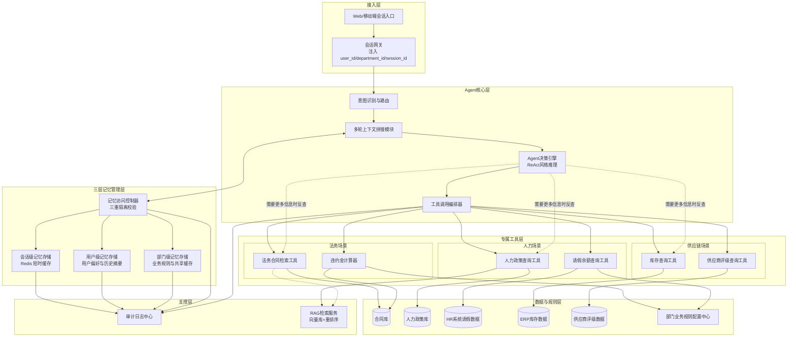
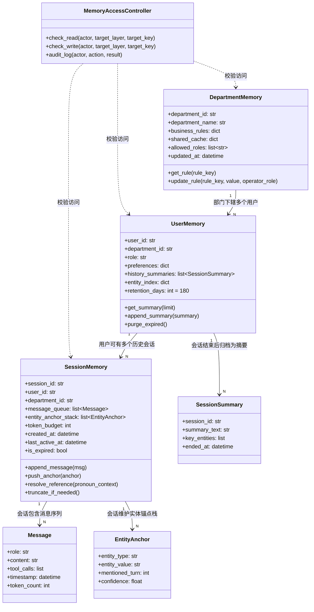

# 第61天:核心功能开发(工具、记忆、多轮交互)

**课程阶段**:Stage 6 · 旗舰项目实战营
**项目背景**:蓬远科技「苍穹企业级智能体中台」· 寰宇集团项目
**冲刺进度**:6 天冲刺 · Day 3 / 6
**今日主题**:三大业务场景专属工具开发、跨部门三重记忆隔离机制、多轮追问交互能力
**前情提要**:Day 60 打通了 RAG 检索与 Agent 决策的主链路,一条"能跑起来"的骨架已经立在那儿了
**后续预告**:Day 62 将进入后端能力补全与前后端联调阶段

---

## 【旁白】

冲刺进入第三天的时候,办公室的空气都变得不太一样了。前两天大家还带着一点"看看这活儿到底多难"的试探感,第三天早上八点四十,工位区已经坐满了人,没有人闲聊,键盘声密得像下雨。陈铭抱着笔记本电脑走进会议室的时候,发现投影仪已经开着了,王振宇正对着白板写东西,写的不是代码,是三个圈——"法务"、"人力"、"供应链",圈外面又画了一条虚线,圈住了"记忆"两个字。

"陈铭,你来得正好。"老王把马克笔往桌上一放,"昨天咱们把主链路跑通了,能查资料、能调工具、能给结论,看起来挺像那么回事。但你有没有想过一个问题——寰宇集团那边,法务部的人和供应链部的人,用的是同一个智能体入口,他们查的东西能不能串?"

陈铭愣了一下:"应该不能吧,权限……"

"应该不能,和'一定不能',中间差着一整套工程实现。"老王敲了敲白板上那条虚线,"今天这一天,咱们要把这条虚线变成一堵实实在在的墙。三大业务场景各自的专属能力要补上,同时得让这套系统'记得住事',还得记得对地方——你部门的事不能被隔壁部门看见,你今天问的事,下周再问不该凑到一块儿,除非你自己愿意。"

这句话陈铭后来在项目复盘会上反复提起。他说那天上午他脑子里冒出来的第一反应是"这不就是加个 user_id 过滤吗",直到老王把权限矩阵摊开在桌上,他才意识到,寰宇集团这种规模的企业客户,"记忆"从来不是一个技术名词,它背后拴着数据安全、合规审计、部门墙、甚至集团内部的政治敏感度。一次没隔离好的记忆泄露,足以让这个项目在客户那边直接判死刑。

那天的太阳很好,会议室的窗帘没拉上,阳光斜斜地照在白板上那三个圈和一条虚线上。陈铭后来在笔记里写道:"这一天学到的东西,比我过去半年写的所有 CRUD 加起来都多。"

---

## 一、晨会纪要

**时间**:2026年X月X日(冲刺 Day 3) 09:00-09:35
**地点**:蓬远科技 3 楼作战室
**主持人**:王振宇(老王,技术负责人)
**参会人**:陈铭(后端/Agent 开发)、苏晴(产品经理)、阿泰(前端)、小胡(测试)、老陈(数据平台)

**老王**:先复盘一下昨天的成果。RAG 检索链路跑通了,Agent 决策也能跑通了,三大场景的基础问答都能给出结果,虽然还比较糙。今天不是继续往主链路上堆功能,是往深里挖——每个场景要有自己专属的"手",还要有"脑子记得住事"的能力。苏晴,你先说一下客户那边昨天提的反馈。

**苏晴**:昨天下午跟寰宇集团的项目对接人开了个短会,法务部的张总提了个很具体的诉求——他们现在每天要处理大量合同违约金的核算,人工翻合同条款、算滞纳天数、算金额,一份合同平均要花四十分钟。他们最想要的不是"帮我总结这份合同",而是"告诉我这份合同违约了要赔多少钱"。这个诉求比我们原来想的"合同摘要"要具体得多。

**老王**:这就是我强调的,别停留在"检索+总结"这个层次,要做能直接产出业务结果的工具。陈铭,昨天你那套 Agent 决策链路里,工具调用那一层还是比较薄的,今天要把六个工具怼上去。哪六个,苏晴复述一下需求文档里定的范围。

**苏晴**:法务场景两个——合同检索工具、违约金计算器;人力场景两个——人力政策查询工具、请假余额查询工具;供应链场景两个——库存查询工具、供应商评级查询工具。这六个是今天必须要落地的,而且客户下周三要来现场看一次进度演示,这六个工具的效果直接决定演示成不成。

**陈铭**:合同检索和库存查询我理解,是接现有的数据源做检索。违约金计算器和供应商评级这种带"计算"和"打分"逻辑的,是不是得单独写业务规则?

**老王**:对,这就是今天的重点之一——不是所有工具都是"查询型"的,有一部分是"计算型"的,还有一部分甚至是"决策型"的。违约金计算器要吃合同里的滞纳金条款、逾期天数、金额基数,套公式算出来,这个公式还得留出可配置的空间,因为寰宇集团不同事业部签的合同模板,滞纳金条款写法都不完全一样。供应商评级也是,不是单纯查一个分数,是要综合交货及时率、质量合格率、账期履约情况几个维度加权算出来。

**小胡**:这些工具都写好之后,我这边怎么测?有没有测试数据集?

**老陈**:数据这块我昨天已经跟客户那边要了一批脱敏后的样例数据,合同大概两百份,人力政策文档四十多个,库存和供应商数据是从他们 ERP 系统导出的两张表,大概三千多条记录,晚点我导到测试库里,小胡你直接连测试库跑。

**老王**:好,数据这块老陈盯着。第二个大头是记忆隔离。昨天咱们的 demo 里,所有人共用一套上下文,这在演示的时候没事,但客户这边组织架构复杂,法务、人力、供应链三个部门在系统里跑同一套底座,必须做到互相看不见对方的会话历史,同一个部门内部不同用户之间也不能串。今天要把这套隔离机制落地成三层——用户级、部门级、会话级,陈铭主导设计,我来把关。

**阿泰**:前端这边要不要跟着改?现在的会话侧边栏是不分部门的。

**苏晴**:先不动前端结构,阿泰你先把接口预留好,后端把 department_id、user_id、session_id 这三个字段在请求里都传上,今天先把后端能力做扎实,明天联调的时候再对前端界面动刀。

**老王**:第三个事儿,多轮追问。昨天的 demo 里,你问一句、它答一句,下一句问的时候等于重新开始,压根不记得上文说了什么。客户那边法务和人力场景,追问是常态——"这份合同里有没有保密条款" "那如果违反了呢" "赔偿金额怎么算的" ,这是一连串带着指代关系的对话,"那"、"这个"、"上面提到的"都要能正确解析到具体的实体上。这个是今天下午的重头戏,陈铭负责设计上下文拼接和窗口截断的逻辑,防止对话轮次一多直接把上下文窗口撑爆。

**陈铭**:窗口截断这块,是简单按轮次数砍,还是要做摘要压缩?

**老王**:今天先做基于轮次数 + token 预算的截断,加一个关键信息的锚点保留机制——不能简单地"先进先出",不然前几轮提到的合同编号、金额这种关键信息一旦被砍掉,后面的追问就答不上来了。摘要压缩这种更复杂的记忆管理策略,我们放到后面测试评估那一轮再优化,今天先把基础打牢。

**小胡**:那我今天主要测哪块?

**老王**:上午先跟着陈铭过一遍六个工具的接口定义,写测试用例;下午等记忆隔离和多轮交互的代码出来了,你重点测三个方面——一是隔离有没有真的隔离住,写几个"跨部门查隐私数据"的攻击性用例;二是多轮追问的指代解析对不对;三是窗口截断以后,关键信息还在不在。

**苏晴**:今天的验收标准我这边也列一下:六个工具全部要有真实数据跑通,不能是 mock;记忆隔离要能证明——我会拿两个不同部门的账号现场切着测;多轮交互至少要能扛住五轮追问不丢关键信息。

**老王**:行,基本就这个安排。陈铭,今天工作量不小,咱俩先花十分钟对一下工具的接口规范,开完会就开始。大家有问题现在提,没有就散会,十点前我要看到第一个工具——合同检索——的骨架代码。

**(会议结束,09:35)**

散会以后陈铭没有立刻回工位,他站在白板前面又看了一眼那三个圈和虚线,拿手机拍了张照。他心里那会儿其实有点发虚——不是因为工具本身难写,是因为他隐约感觉到,今天要做的这套记忆隔离机制,一旦设计错了方向,后面几天要推倒重来的成本会很高。他后来跟老王提起这个顾虑,老王说了一句让他印象很深的话:"工具写错了,改一个文件;记忆架构设计错了,改的是地基,这也是为什么今天上午你先写工具练手,下午咱俩一起画记忆架构图,先想清楚再动手。"

---

## 二、需求文档

### 2.1 文档信息

| 项目 | 内容 |
|---|---|
| 文档名称 | 苍穹中台核心功能开发需求说明书(工具/记忆/多轮交互) |
| 版本 | v0.3 |
| 编写人 | 苏晴 |
| 审核人 | 王振宇 |
| 适用范围 | 寰宇集团项目 · 法务/人力/供应链三大场景 |
| 状态 | 待开发 → 开发中 |

### 2.2 背景与目标

寰宇集团是一家跨多个事业部的大型集团企业,内部划分了法务合规部、人力资源部、供应链管理部三大核心业务部门,三个部门目前分别使用不同的独立系统处理各自的日常事务,信息不互通,人工处理效率低,尤其是法务合同审核、人力政策咨询、供应链数据核查这类高频、重复、有明确规则可依的工作,人工耗时长且容易出错。

本次苍穹中台落地的目标,是在同一套智能体底座上,为三个部门分别提供专属的"业务工具",让 Agent 在对话过程中能够根据用户意图自动调用对应工具,给出结构化、可验证的业务结果,而不是泛泛的文本总结。与此同时,由于三个部门数据敏感度不同、组织边界清晰,系统必须保证严格的数据隔离,防止跨部门数据泄露;同时要支持用户在同一场景下进行多轮追问式的自然对话,而不是每次都要把背景信息重新说一遍。

### 2.3 三大业务场景专属工具清单

#### 2.3.1 法务合规场景

**工具一:法务合同检索工具(contract_search_tool)**

- 功能描述:根据用户输入的关键词、合同编号、签约方名称、合同类型、签约时间范围等条件,从合同库中检索匹配的合同及具体条款,支持按条款类型(如保密条款、违约责任、付款条件、终止条款)做二次过滤。
- 输入参数:
  - `query`(字符串,必填):自然语言查询或关键词
  - `contract_no`(字符串,可选):合同编号,精确匹配
  - `counterparty`(字符串,可选):签约对方名称
  - `contract_type`(字符串,可选):合同类型,枚举值包括采购合同、销售合同、服务合同、劳务合同、保密协议等
  - `clause_type`(字符串,可选):条款类型过滤
  - `date_from` / `date_to`(日期,可选):签约日期范围
  - `department_id`(字符串,必填,由系统自动注入,非用户输入):调用方部门,用于数据隔离
  - `top_k`(整数,可选,默认 5):返回结果数量上限
- 输出结构:命中合同列表,每条包含合同编号、合同名称、签约方、签约日期、匹配的具体条款原文、条款在合同中的位置(章节/页码)、匹配度分数。
- 业务规则:
  - 合同检索结果必须能溯源到具体条款原文,不能只返回摘要,法务人员要能核对原文。
  - 已终止或已作废的合同默认不返回,除非显式传入 `include_terminated=true`。
  - 检索结果按匹配度降序排列,匹配度低于阈值(0.35)的结果不返回。

**工具二:违约金计算器(penalty_calculator_tool)**

- 功能描述:根据指定合同的违约金/滞纳金条款、逾期天数、涉及金额基数,自动计算应赔付的违约金金额,支持多种计费模式(固定比例、阶梯比例、日息累加、封顶限额)。
- 输入参数:
  - `contract_no`(字符串,必填):合同编号
  - `base_amount`(数值,可选):违约金计算基数,若不传则系统自动从合同条款中解析
  - `overdue_days`(整数,必填):逾期天数
  - `penalty_mode`(字符串,可选):强制指定计费模式,不传则按合同条款自动识别
  - `department_id`(字符串,必填,系统注入)
- 输出结构:计算结果金额、计算过程明细(每一步的公式和中间值)、适用的条款原文引用、是否触发封顶限额提示。
- 业务规则:
  - 计算结果必须附带完整的计算过程,不能只给最终数字,法务和财务要能复核。
  - 若合同条款约定了违约金封顶(如"不超过合同总金额的 30%"),计算结果超过封顶时要自动按封顶值返回,并明确提示。
  - 若合同中未查到违约金条款,返回明确的错误提示,不能编造条款内容。

#### 2.3.2 人力资源场景

**工具三:人力政策查询工具(hr_policy_query_tool)**

- 功能描述:根据用户问题检索公司人力资源制度文档(考勤、薪酬、福利、晋升、离职、报销等),返回对应政策条款原文及适用范围说明。
- 输入参数:
  - `query`(字符串,必填):自然语言问题
  - `policy_category`(字符串,可选):政策分类,枚举包括考勤管理、薪酬福利、招聘录用、绩效考核、离职管理、报销制度等
  - `applicable_role`(字符串,可选):适用岗位/职级,用于过滤只对特定岗位生效的政策
  - `applicable_location`(字符串,可选):适用地区(集团下属子公司分布多地,部分政策存在地区差异)
  - `department_id`(字符串,必填,系统注入)
- 输出结构:命中政策条款列表,每条包含政策文档名称、版本号、生效日期、条款原文、适用范围说明。
- 业务规则:
  - 若同一问题命中多个版本的政策(新旧版本共存),默认只返回最新生效版本,并提示"该政策于 XX 日期更新过"。
  - 涉及薪酬敏感信息的政策条款,查询结果需要做二次权限校验,普通员工只能查通用政策,涉及职级薪酬带宽的条款仅 HRBP 及以上角色可见。

**工具四:请假余额查询工具(leave_balance_tool)**

- 功能描述:查询指定员工当前各类假期(年假、调休、病假、事假等)的剩余额度、已使用天数、有效期。
- 输入参数:
  - `employee_id`(字符串,必填):员工工号,默认取当前登录用户,若查询他人需额外权限校验
  - `leave_type`(字符串,可选):假期类型,不传则返回全部类型汇总
  - `year`(整数,可选,默认当前年度)
  - `department_id`(字符串,必填,系统注入)
- 输出结构:各假期类型的余额明细(总额度、已用、剩余、有效期截止日)。
- 业务规则:
  - 员工只能查询自己的请假余额,若要查他人余额,`employee_id` 必须与登录用户不一致,此时需校验调用者是否具备"部门主管"或"HR"角色,否则拒绝并返回权限不足提示。
  - 年假额度需要按入职年限做阶梯计算(入职不满 1 年按比例折算,满 1 年不满 10 年 5 天,满 10 年及以上 10 天,集团自定义规则以配置表为准),工具内部要能正确处理折算逻辑。

#### 2.3.3 供应链场景

**工具五:供应链库存查询工具(inventory_query_tool)**

- 功能描述:查询指定物料/产品在各仓库的库存数量、可用量(扣减已锁定/在途占用后)、安全库存阈值、是否需要预警。
- 输入参数:
  - `sku`(字符串,可选):物料编码
  - `product_name`(字符串,可选):物料名称,支持模糊匹配
  - `warehouse_id`(字符串,可选):仓库编号,不传则返回全部仓库汇总
  - `department_id`(字符串,必填,系统注入)
- 输出结构:各仓库库存明细(总库存、已锁定量、在途量、可用量、安全库存线、库存状态标记:正常/预警/缺货)。
- 业务规则:
  - `sku` 和 `product_name` 至少传一个,两个都不传返回参数错误。
  - 可用量计算公式:可用量 = 总库存 - 已锁定量 - 已分配未出库量,不能简单等于总库存。
  - 当可用量低于安全库存阈值时,结果中要标记预警状态,并给出建议补货量(安全库存上限 - 当前可用量)。

**工具六:供应商评级查询工具(supplier_rating_tool)**

- 功能描述:查询指定供应商的综合评级及各维度得分明细(交货及时率、质量合格率、账期履约率、价格竞争力),支持按评级周期(月/季/年)查询历史评级趋势。
- 输入参数:
  - `supplier_id`(字符串,可选):供应商编号
  - `supplier_name`(字符串,可选):供应商名称,模糊匹配
  - `period_type`(字符串,可选,默认"quarter"):评级周期类型
  - `period_range`(整数,可选,默认 4):返回最近几个周期的趋势数据
  - `department_id`(字符串,必填,系统注入)
- 输出结构:供应商基础信息、当前综合评级(A/B/C/D 等级及具体分数)、四个维度的加权得分明细、历史评级趋势序列、是否列入黑名单/观察名单标记。
- 业务规则:
  - 综合评级计算公式:综合分 = 交货及时率×0.35 + 质量合格率×0.35 + 账期履约率×0.2 + 价格竞争力×0.1,权重可配置。
  - 综合分低于 60 分连续两个周期,自动标记"观察名单";低于 50 分连续两个周期,标记"黑名单预警",需人工复核。

### 2.4 记忆隔离规范

寰宇集团的组织结构决定了本系统的记忆管理必须严格遵循"三层隔离"原则,自下而上分别是**会话级**、**用户级**、**部门级**,任何一层的边界被突破,都构成严重的数据安全事故。

#### 2.4.1 隔离层级定义

| 层级 | 隔离键 | 生命周期 | 典型内容 | 访问范围 |
|---|---|---|---|---|
| 会话级(Session) | `session_id` | 单次对话会话,超时或用户主动结束后失效(默认 30 分钟无操作自动过期) | 当前对话的完整消息序列、当前轮次提到的实体(合同编号、员工工号、物料编码等) | 仅当前会话可读写,同一用户开启新会话不可见旧会话内容,除非用户主动切换回该会话 |
| 用户级(User) | `user_id` + `department_id` | 长期保存(默认 180 天滚动),用户主动清除或账号注销时失效 | 用户的历史会话摘要、用户的常用偏好(如常查询的合同类型、惯用语言风格)、用户的历史查询实体索引 | 仅该用户本人可读写,部门主管默认不可读取下属的用户级记忆内容(除非走审计流程) |
| 部门级(Department) | `department_id` | 长期保存,随部门业务规则调整而更新 | 部门专属的业务规则配置(如违约金计算模式、假期折算规则、库存预警阈值)、部门共享的高频问答缓存 | 仅该部门下所有用户可读,写入权限仅限系统管理员或部门管理员角色 |

#### 2.4.2 隔离原则

1. **默认拒绝原则**:任何跨层级、跨部门的数据访问,默认返回拒绝,必须显式配置白名单才能放开,不允许"默认允许、异常拦截"的反向设计。
2. **写入前置校验**:每一次记忆写入操作,必须先校验写入方的 `department_id` 与 `user_id` 是否与目标存储键匹配,不匹配直接拒绝写入并记录审计日志,不能"先写后校验"。
3. **读取双重校验**:每一次记忆读取,除了校验隔离键匹配之外,还要校验调用者当前角色是否具备读取该类记忆的权限(例如涉及薪酬带宽的部门级记忆,只有 HRBP 角色可读)。
4. **审计留痕**:所有跨层级的记忆访问尝试(包括被拒绝的),都要记录访问日志,日志至少包含操作时间、操作方 `user_id`、目标 `department_id`、操作类型(读/写)、结果(成功/拒绝)、拒绝原因。
5. **物理隔离优先,逻辑隔离兜底**:法务、人力、供应链三个部门的记忆数据,优先考虑物理层面的存储隔离(不同的存储命名空间甚至不同的库实例),逻辑层面的 `department_id` 过滤作为第二道防线,不能只依赖逻辑过滤这一层。
6. **会话隔离不可跨设备继承**:同一用户在不同设备、不同浏览器标签打开的对话,视为不同会话,`session_id` 各自独立,不允许同一账号的两个并发会话共享上下文,避免误拼接的风险。

#### 2.4.3 权限访问矩阵

| 角色 | 会话级(自己) | 会话级(他人) | 用户级(自己) | 用户级(他人) | 部门级(本部门) | 部门级(跨部门) |
|---|---|---|---|---|---|---|
| 普通员工 | 读写 | 拒绝 | 读写 | 拒绝 | 只读 | 拒绝 |
| 部门主管 | 读写 | 拒绝(需走审计申请) | 读写 | 拒绝 | 读写 | 拒绝 |
| HRBP(仅人力部门) | 读写 | 拒绝 | 读写 | 拒绝(部分薪酬敏感字段可读) | 读写 | 拒绝 |
| 系统管理员 | 读写(需审计) | 只读(需审计) | 读写(需审计) | 只读(需审计) | 读写 | 只读(需审计) |

#### 2.4.4 数据保留与清理

- 会话级记忆:超过 30 分钟无新消息自动标记为"已结束",结束后的会话内容转入用户级存储中的"历史会话摘要",原始逐轮消息保留 7 天后归档,归档数据加密存储,90 天后按合规要求清除敏感字段。
- 用户级记忆:180 天滚动窗口,超出窗口的历史记录自动清理,清理前生成压缩摘要保留,原始明细不再保留。
- 部门级记忆:长期保存,随业务规则版本迭代更新,历史版本保留用于审计追溯,不主动清理。

### 2.5 多轮交互能力需求

- 支持用户在同一会话内进行连续追问,系统需要正确解析追问中的指代关系(如"那"、"这个"、"上面提到的合同"、"刚才说的那个供应商")到具体实体。
- 支持追问过程中对上一轮工具调用结果的二次加工(例如上一轮查到了违约金金额,下一轮问"如果再拖欠十天呢",系统要能识别这是同一个合同、同一个计费模式下的参数变更,重新调用违约金计算器)。
- 上下文窗口存在长度限制,当对话轮次增多、累积 token 超过预算时,系统需要自动截断早期内容,但必须保留本次会话中出现过的关键实体(合同编号、员工工号、物料编码、供应商编号等),防止截断后追问失效。
- 多轮交互的记忆读写不能与前述三层隔离机制冲突,即多轮上下文只在会话级记忆内流转,不允许因为拼接上下文而意外读取到其他会话或其他用户的数据。

### 2.6 验收标准

1. 六个工具均能对接真实测试数据源,返回结果可追溯到原始数据(合同原文、政策原文、ERP 记录等),不允许模型自由生成业务数字。
2. 记忆隔离机制通过至少 10 个跨部门/跨用户的攻击性测试用例,全部正确拒绝。
3. 多轮交互场景下,连续 5 轮追问(含至少 2 次代词指代)能够正确解析并给出正确结果,窗口截断后关键实体不丢失。
4. 所有工具调用、记忆读写操作均有日志留痕,可供后续审计。

---

## 三、架构设计图

下面这张图是老王和陈铭在白板上画完之后,由陈铭誊到 Mermaid 里的整体架构,重点表达的是"专属工具层"如何挂载在 Agent 决策层之下,以及"三层记忆"如何贯穿整个请求处理路径。



这张图有几个地方值得多说两句。第一,会话网关这一层把 `user_id`、`department_id`、`session_id` 三个隔离键在进入 Agent 核心层之前就完成了注入,这是老王反复强调的原则——隔离键不能等到工具层才补,必须在最外层入口就固定下来,后面所有环节都只是传递,不允许中途篡改或重新解析。第二,记忆访问控制器(D4)被画成一个独立模块,而不是分散在各个工具里各自校验,这是为了保证隔离逻辑只有一处实现,后续如果隔离规则调整,只改一个地方。第三,专属工具层和数据层是严格对应的,每个工具只能访问自己场景的数据源,图上没有画一条"法务工具访问 ERP 库存数据"的连线,这不是画漏了,是架构上就不允许存在这条连线。

---

## 四、流程图:一次多轮追问对话的完整记忆读写与上下文拼接流程

这张图对应的是下午设计评审时,老王让陈铭现场画的一个具体场景——法务部用户先问"帮我查一下寰宇与蓝海物流签的采购合同",紧接着追问"那这份合同里的违约金条款怎么约定的",再追问"如果对方拖欠了十五天,该赔多少"。整个过程涉及三轮工具调用、两次指代解析、一次上下文窗口检查。

```mermaid
flowchart TD
    Start([用户发起第1轮提问:<br/>查寰宇与蓝海物流的采购合同]) --> S1[会话网关校验身份<br/>注入session_id/user_id/department_id]
    S1 --> S2{会话是否已存在?}
    S2 -->|否,新建| S3[创建会话级记忆容器<br/>初始化空消息队列与实体锚点表]
    S2 -->|是,已存在| S4[读取会话级记忆<br/>加载历史消息队列与实体锚点表]
    S3 --> S5
    S4 --> S5[上下文拼接模块:<br/>本轮无历史,直接使用原始问题]
    S5 --> S6[Agent决策:识别意图为合同检索]
    S6 --> S7[调用 contract_search_tool<br/>参数:签约方=蓝海物流,类型=采购合同]
    S7 --> S8[工具查询合同库,返回合同编号HY-CG-20250311等]
    S8 --> S9[写入会话级记忆:<br/>本轮消息+提取实体锚点 contract_no=HY-CG-20250311]
    S9 --> S10[生成回复,返回用户]

    S10 --> Turn2([用户发起第2轮追问:<br/>那这份合同里的违约金条款怎么约定的])
    Turn2 --> T1[会话网关校验身份,复用同一session_id]
    T1 --> T2[读取会话级记忆<br/>加载消息队列+实体锚点表]
    T2 --> T3[指代解析模块:<br/>识别代词'这份合同'→匹配锚点表 contract_no=HY-CG-20250311]
    T3 --> T4[上下文拼接:<br/>历史摘要+当前问题+解析后的显式实体]
    T4 --> T5{拼接后token数<br/>是否超过窗口预算?}
    T5 -->|未超| T6[直接送入Agent决策引擎]
    T5 -->|超出| T6a[触发窗口截断策略:<br/>保留锚点实体+最近N轮+丢弃更早的原始文本]
    T6a --> T6
    T6 --> T7[Agent决策:识别意图为条款查询<br/>补全contract_no参数]
    T7 --> T8[调用 contract_search_tool<br/>参数:contract_no=HY-CG-20250311,clause_type=违约条款]
    T8 --> T9[工具返回违约金条款原文]
    T9 --> T10[写入会话级记忆:<br/>追加本轮消息+更新锚点 penalty_clause_id]
    T10 --> T11[生成回复,返回用户]

    T11 --> Turn3([用户发起第3轮追问:<br/>如果对方拖欠了十五天,该赔多少])
    Turn3 --> R1[读取会话级记忆]
    R1 --> R2[指代解析:'对方拖欠'→复用锚点 contract_no与penalty_clause_id]
    R2 --> R3[上下文拼接+窗口检查<br/>同上一轮逻辑]
    R3 --> R4[Agent决策:识别意图为违约金计算<br/>补全 contract_no + overdue_days=15]
    R4 --> R5[调用 penalty_calculator_tool]
    R5 --> R6[工具从合同解析基数与条款,计算违约金]
    R6 --> R7[写入会话级记忆:追加消息+更新锚点 last_penalty_amount]
    R7 --> End([生成最终回复,返回用户])
```



这张流程图画完之后,小胡当场就提了个问题:"如果第二轮追问的时候,用户说的'这份合同'其实指的不是上一轮查到的那份,而是三轮之前提到的另一份合同呢?"这个问题把陈铭问住了,他后来在代码实战部分设计了一个"锚点栈"结构来处理这种情况——不是简单地"最近一次提到的实体优先",而是允许指代解析模块在锚点栈里做近似匹配和消歧,如果消歧结果置信度不够高,系统会主动反问用户"您是指 XX 合同还是 XX 合同",而不是硬猜一个答案。这个细节在下面的代码里会体现出来。

---

## 五、示意图:三重记忆隔离的数据结构示意

这张图不是流程,是数据结构本身的示意,老王管它叫"给记忆拍个 X 光片",目的是让团队里每个人对"一条记忆到底长什么样、存在哪儿、谁能碰"有一个统一的心智模型。



这张类图里有几个设计细节值得记一笔。`EntityAnchor` 不是挂在 `Message` 上,而是单独抽成一个"锚点栈",挂在 `SessionMemory` 下面——这是因为实体锚点是跨消息复用的东西,一次合同编号提取出来,后面十轮对话都可能用到,如果把锚点信息塞进单条消息里,每次指代解析都要重新扫描整个消息队列,效率低而且逻辑绕。锚点栈按 `mentioned_turn` 排序,解析代词时优先在栈顶(最近提到的)附近找,但保留全栈可回溯的能力,应对小胡提的那个"指代三轮前的合同"的场景。另外 `MemoryAccessController` 被画成独立的类,不挂在任何一层记忆结构下面,它是横切关注点,所有的读写都要经过它,这一点和架构图里的设计是一致的。

---

## 六、课堂笔记

### 上午:专属工具开发

老王上午没有一上来就讲代码,他先在白板上写了一句话:"工具是 Agent 的手,手伸不准,脑子再聪明也没用。"然后他花了大概二十分钟讲工具设计的几个原则,陈铭把这些原则记在了自己的笔记本上,后来整理成了下面这几条。

**第一条原则:工具必须是"确定性"的,不能让模型替工具兜底。** 老王举了个反例,说他之前带过的一个团队,写了个"计算违约金"的工具,工具内部逻辑没写完整,遇到某些边界情况就抛异常,结果模型看到异常之后,自己"善解人意"地编了一个数字回复用户。这是致命的,因为业务方拿着这个数字去发催款函,发现算错了,直接就是法律纠纷。所以违约金计算器这个工具,老王要求陈铭必须把所有可能遇到的合同条款类型都枚举清楚,遇到无法识别的条款格式,工具要抛出明确的、结构化的错误信息,并且这个错误信息要被设计成让模型能"看懂"、然后诚实地告诉用户"这份合同的违约金条款格式我暂时无法解析,建议人工复核",而不是随便编一个数字。

**第二条原则:工具的输入参数设计要考虑"模型填不准"的情况。** 陈铭一开始设计合同检索工具的时候,把 `contract_type` 设计成必填字段,老王直接打回去,说模型在多轮对话里经常拿不准用户说的到底是哪个枚举值,如果必填字段模型填错了,检索直接就是错的还不报错,更危险。后来陈铭把这类字段都改成可选,并且在工具内部做了"宽松匹配+模糊纠错",比如用户说"采购的合同"、模型可能填成"采购合同"或者"采购类合同",工具内部要有一层归一化逻辑,把这些变体都映射到标准枚举值上,而不是直接拿去做精确匹配导致查不到结果。

**第三条原则:每个工具的返回结果都要"可追溯"。** 这一条几乎贯穿了六个工具的设计。合同检索要返回条款原文和位置,不能只给摘要;违约金计算要返回完整的计算公式和中间步骤;政策查询要返回文档名称和版本号;请假余额要给出每一类假期的明细而不是只给一个汇总数字;库存查询要拆分出总库存、锁定量、在途量,不能只给一个"可用量"让人猜怎么算出来的;供应商评级要给出四个维度的加权明细,不能只甩一个"B级"的结论。老王说这是企业级场景和 toy demo 最大的区别之一——企业客户要的不是一个看起来聪明的答案,是一个能立刻拿去用、拿去审核、拿去存档的结果。

讲完原则,老王开始带着陈铭一个个过六个工具的设计细节,这部分陈铭记得最细。

**合同检索工具**,老王强调的重点是"检索"和"结构化过滤"要分开设计成两层。第一层是基于关键词/语义的粗筛,这一层依赖 RAG 检索服务(向量库+关键词混合检索);第二层是基于结构化字段(合同编号、签约方、合同类型、日期范围、条款类型)的精确过滤,这一层是在数据库层面做的,不依赖向量相似度。很多团队会把这两层混在一起做,导致检索结果既不精确又不全面。陈铭当时问了个问题:"如果用户既给了关键词又给了合同编号,应该先按哪个走?"老王说这种情况直接走精确匹配,精确匹配到了就不需要再走语义检索,语义检索只在没有精确条件或者精确匹配结果为空的时候兜底触发,这样能省下不少检索成本,响应也更快。

**违约金计算器**,这是上午讨论最久的一个工具,因为它涉及的业务规则最复杂。老王先让陈铭去翻了几份寰宇集团给的样例合同,发现违约金条款至少有三种典型写法:一种是"按日千分之X计收违约金,不超过合同总金额的Y%",这是日息累加+封顶模式;一种是"逾期超过N天,视为严重违约,按合同总金额的固定比例赔偿",这是阶梯触发模式;还有一种是简单的"按逾期总天数乘以固定金额",这是固定单价模式。老王要求这个工具必须支持这三种模式的自动识别和分别计算,而不是让开发者提前假设合同都是同一种写法。这个工具的另一个难点是"基数"的确定——违约金计算的基数,有的合同是按合同总金额算,有的是按逾期未付款的部分金额算,这个必须从条款原文里抠出来,不能想当然地拿合同总金额去算。

**人力政策查询工具**和合同检索工具的设计思路类似,但多了一层"版本管理"和"权限分级"的考量。老王提到寰宇集团的政策文档存在大量历史版本共存的情况,比如"年假天数"这条规则,2023年的版本和2025年的版本可能不一样,如果检索的时候不做版本过滤,模型很容易检索到过期的政策条款给用户,这是个很容易被忽略但后果很严重的坑——因为员工会真的按这个错误信息去规划自己的假期安排,发现被系统"骗了",客户投诉起来是实打实的。所以这个工具在设计上,默认只返回最新生效版本,并且明确标注生效日期,如果用户显式问"以前的规定是怎样的",才允许查历史版本。

**请假余额查询工具**,重点在于权限校验和假期折算规则。老王反复强调"员工只能查自己的",这个校验必须在工具内部做,不能指望上层 Agent 决策逻辑"记得"要做这个校验——因为 Agent 的决策是基于模型推理的,存在不确定性,但工具内部的权限校验必须是硬编码的确定性逻辑,这是最后一道防线。折算规则那部分陈铭花了点时间去理解寰宇集团的规则表,入职不满一年的员工,年假天数要按在职月份数比例折算,这个逻辑写起来不难,但边界条件(比如刚好入职满12个月当天算不算满一年)需要跟业务方反复确认,老王让陈铭直接把这类边界条件写成单元测试用例,以后规则文档更新了,靠测试用例反过来验证代码有没有跟着改对。

**供应链库存查询工具**,老王特别强调"可用量"这个字段的计算不能简化。他说见过不止一个团队犯这个错误——把"总库存"当成"可用库存"直接返回给业务方,业务方拿着这个数字去做销售承诺,结果因为一部分库存已经被其他订单锁定或者在调拨在途,实际能发的货比承诺的少,造成客户投诉。这个工具里"总库存-已锁定量-已分配未出库量=可用量"这个公式必须显式计算并且在返回结果里把每一项都列出来,让业务方能看清楚这个数字是怎么来的。

**供应商评级查询工具**,重点是加权公式的可配置性和"连续两个周期低于阈值触发观察名单/黑名单"这个状态机逻辑。老王说这类"状态机"逻辑很容易被写成简单的 if-else 判断,但如果不考虑"连续"这个时间维度,很容易出现"某供应商上个季度评分低,这个季度恢复了,但系统还是显示黑名单"这种滞后错误,所以这个工具在设计上要维护一个历史评级序列,而不是只看当前这一次的评分。

上午临近结束的时候,老王补了一句让陈铭印象很深的话:"这六个工具你写完,不代表这六个场景就完了。你会发现,写工具这件事本身教会你的,是怎么把一个模糊的业务需求,拆解成一组边界清晰、可验证、可追溯的确定性接口。这个能力,比会不会调用某个具体的框架 API 重要得多。"

### 下午:记忆隔离机制与多轮交互实现

下午一开场,老王先抛出一个问题:"如果你现在要给隔壁工位的产品经理解释,为什么记忆要分三层,而不是简单一个 `user_id` 字段就能搞定,你怎么讲?"陈铭想了想说:"因为部门内部有共享的规则和缓存,这些东西不属于某一个用户,但又不能全公司共享;而单个用户在不同会话之间,有些信息应该延续(比如他的常用查询偏好),有些信息不应该延续(比如上一次会话里提到的具体某份合同,不该在下一次会话里被无意间提及)。"老王说这个答案已经答对了七八成,他补充的部分是——三层记忆之所以要分开设计成三个独立的存储结构和独立的访问控制,而不是在同一张表里加几个字段做逻辑区分,是因为它们的"生命周期"完全不同:会话级是分钟级的,用户级是月级的,部门级是几乎永久的。生命周期不同,意味着清理策略、备份策略、审计策略都得不同,混在一起会导致运维和合规上的一堆麻烦。

接下来老王带陈铭细讲了三层记忆各自的存储选型和实现要点。

**会话级记忆**,老王建议用 Redis 这类内存型 KV 存储,因为它的访问频率极高(几乎每一轮对话都要读写),而且生命周期短,天然适合设置 TTL 自动过期。他强调了一个细节——会话级记忆里的"实体锚点栈"不能简单地用一个列表往后追加,因为多轮对话里同一个实体可能被反复提及、又被修正(比如用户说"不对,我说的是另一份合同"),锚点栈的设计要支持"更新"而不只是"追加",而且要给每个锚点打上"是否仍然有效"的标记,当用户明确否定或修正之前提到的实体时,要把旧锚点标记失效,而不是留着不管让后续解析模块继续读到过期信息。

**用户级记忆**,老王说这一层最容易被误用的地方,是把它做成一个"全量历史日志",导致存储越滚越大,检索越来越慢。正确的做法是会话结束后,不保留原始逐轮消息在用户级记忆里(逐轮消息归档到冷存储,用户级只保留),而是生成一份"会话摘要",摘要里提取关键实体和结论,用于下次该用户开启新会话时,系统可以选择性地"回忆"一些背景(比如"您上次查询的供应商是XX,评级是B级"),但这个"回忆"要是用户主动触发或者被系统明确判断为相关才带入,不能默认把所有历史摘要无脑塞进新会话的上下文里,否则新会话很快就会被无关的历史信息污染,而且这也违反"会话隔离"的初衷——用户可能就是想开一个全新的话题,不想被系统"贴心地"联想到上次的事。

**部门级记忆**,老王讲这一层的时候提到了一个此前没细说的场景——部门级记忆不只是存业务规则(比如违约金计算模式配置、假期折算规则表),还要承担"部门共享缓存"的角色,比如同一个部门里,不同员工可能会反复问类似的高频问题(法务部门可能有十个人都在问同一份新签合同的某个条款),这类问题的检索结果可以在部门级做缓存,减少重复的向量检索和数据库查询开销。但共享缓存必须有版本校验机制——如果合同库或政策库的底层数据更新了,缓存要能感知到失效,不能拿着过期数据给用户,这一点陈铭在代码里用了一个基于数据源版本号的缓存失效策略来实现。

讲完存储设计,下午的重点转向了"如何保证隔离真的生效"。老王没有直接讲代码,先讲了一个反例——他说见过一种很常见但很危险的实现方式:业务代码里到处写 `if user.department_id == data.department_id`,散落在十几个不同的函数里。这种写法的问题是,只要有一处漏写了这个判断(哪�威力一次开发迭代中不小心漏掉),隔离就破了,而且很难通过代码审查发现,因为它不是"写错了",是"忘了写"。老王要求陈铭把所有的隔离校验收敛到一个统一的"记忆访问控制器"里,所有对三层记忆的读写操作,都必须经过这个控制器,业务代码里不允许出现直接绕过控制器访问底层存储的代码路径。这样即使某个新工具开发的时候忘了处理隔离逻辑,只要它调用的是统一的记忆读写接口,隔离校验就一定会被执行,不存在"忘写"的可能性。

陈铭在这里提了一个很实际的问题:"如果某个角色(比如系统管理员)确实需要跨部门读取数据做排障,这种'合法的越权'怎么处理?"老王说这正是权限矩阵存在的意义——管理员的跨部门只读权限,要走"审计申请"流程,也就是说,即使角色允许,这次访问依然要被完整记录进审计日志,而且最好是要有一个显式的"越权访问原因"字段被填写,不能做成无声无息的、和普通访问日志混在一起看不出区别的记录。这个观点后来直接体现在了代码实现里,`MemoryAccessController` 对管理员的跨部门读取会额外记一条带 `is_privileged_access=True` 标记的审计日志。

最后半小时,老王和陈铭聚焦讨论多轮交互的上下文拼接与窗口截断。老王先明确了拼接的基本流程:每一轮新问题进来,先从会话级记忆里取出历史消息队列和实体锚点栈,做指代解析(把代词、省略的主语替换或补全为具体实体),再把"拼接后的完整问题"和"必要的历史摘要"一起送进 Agent 决策引擎,而不是把原始的十几轮消息全量塞进去。窗口截断这块,老王给了一个具体的策略框架,陈铭后来把它落到了代码里:

1. 优先保留系统提示词(system prompt)和当前这一轮的用户问题,这两部分永远不截断。
2. 其次保留"实体锚点"对应的关键信息,即使原始消息被截断丢弃,提取出来的实体锚点(合同编号、员工工号等)要单独作为一个"记忆摘要块"始终保留在拼接结果里。
3. 剩余的 token 预算,按"最近优先"的原则从后往前保留完整的历史消息轮次,直到预算用尽,更早的轮次要么被丢弃,要么被压缩成一句话摘要(如"用户此前查询过XX合同的基本信息")。
4. 截断发生时要在日志里记一条提示,方便后续排查"为什么这一轮回答没提到很早之前说的某个细节"。

老王讲完之后补了一句:"你会发现,这套截断策略本质上是在做'什么信息值得被记住'的权衡,这个权衡没有放之四海皆准的完美答案,今天先把这个基础框架搭起来,能扛住咱们验收标准里的五轮追问测试就算合格,后面测试评估阶段咱们会拿真实的多轮对话日志去调这些参数。"

下午快结束的时候,小胡跑过来问了一个很尖锐的问题:"我拿两个不同部门的账号,分别开会话去问同一个供应商的评级,如果系统内部真的走了共享缓存,会不会不小心把法务部门的某个查询结果缓存命中给了供应链部门?"老王当场让陈铭现场演示了一下部门级缓存的隔离键设计——缓存的 key 里必须包含 `department_id` 作为前缀的一部分,不同部门即使查询参数完全一样,缓存 key 也完全不同,不存在互相命中的可能。这个细节当时被小胡记进了测试用例清单里,准备第二天专门写一个针对缓存穿透的攻击性测试。

---

## 七、代码实战

下面是今天落地的全部代码,涵盖六个专属工具的完整实现、三重记忆隔离机制的完整实现、多轮交互上下文拼接与窗口截断逻辑,以及配套的工具注册调度器和集成演示脚本。代码风格上,统一使用类型注解和 dataclass,方便后续团队协作阅读;所有涉及隔离校验的地方都显式调用统一的 `MemoryAccessController`,不允许绕过。

### 7.1 法务合同检索工具

```python
"""
contract_search_tool.py
法务合同检索工具:支持关键词/语义粗筛 + 结构化字段精确过滤两层检索逻辑。
所有检索结果必须可追溯到合同原文条款,不允许只返回摘要。
"""

from __future__ import annotations

import re
from dataclasses import dataclass, field
from datetime import date, datetime
from typing import Optional


CONTRACT_TYPE_ALIASES = {
    "采购合同": ["采购合同", "采购类合同", "采购协议", "购销合同"],
    "销售合同": ["销售合同", "销售协议", "销售类合同"],
    "服务合同": ["服务合同", "服务协议", "技术服务合同"],
    "劳务合同": ["劳务合同", "劳务协议", "劳动合同"],
    "保密协议": ["保密协议", "保密合同", "NDA", "保密条款协议"],
}

CLAUSE_TYPE_ALIASES = {
    "保密条款": ["保密条款", "保密义务", "信息保密"],
    "违约责任": ["违约责任", "违约条款", "违约金条款", "滞纳金条款"],
    "付款条件": ["付款条件", "付款条款", "结算条款", "付款方式"],
    "终止条款": ["终止条款", "解除条款", "合同终止"],
}

MATCH_SCORE_THRESHOLD = 0.35


@dataclass
class ContractClause:
    clause_type: str
    section: str
    page: int
    original_text: str


@dataclass
class ContractRecord:
    contract_no: str
    contract_name: str
    counterparty: str
    contract_type: str
    sign_date: date
    status: str  # active / terminated / expired
    total_amount: float
    clauses: list[ContractClause] = field(default_factory=list)


@dataclass
class ContractSearchHit:
    contract_no: str
    contract_name: str
    counterparty: str
    sign_date: date
    matched_clause: Optional[ContractClause]
    match_score: float


class ContractRepository:
    """模拟合同数据仓库,真实环境下对接向量库 + 结构化数据库的组合查询。"""

    def __init__(self, records: list[ContractRecord]):
        self._records = records

    def find_by_contract_no(self, contract_no: str) -> Optional[ContractRecord]:
        for record in self._records:
            if record.contract_no == contract_no:
                return record
        return None

    def filter(
        self,
        counterparty: Optional[str] = None,
        contract_type: Optional[str] = None,
        date_from: Optional[date] = None,
        date_to: Optional[date] = None,
        include_terminated: bool = False,
    ) -> list[ContractRecord]:
        results = []
        for record in self._records:
            if not include_terminated and record.status != "active":
                continue
            if counterparty and counterparty not in record.counterparty:
                continue
            if contract_type and not self._match_contract_type(record.contract_type, contract_type):
                continue
            if date_from and record.sign_date < date_from:
                continue
            if date_to and record.sign_date > date_to:
                continue
            results.append(record)
        return results

    @staticmethod
    def _match_contract_type(actual: str, requested: str) -> bool:
        aliases = CONTRACT_TYPE_ALIASES.get(requested, [requested])
        return actual in aliases

    def semantic_search(self, query: str, candidates: list[ContractRecord]) -> list[tuple[ContractRecord, float]]:
        """
        简化版语义匹配:真实实现应调用向量库进行相似度检索,
        这里用关键词重叠比例模拟一个匹配分数,保证接口形状一致,方便后续替换真实实现。
        """
        scored: list[tuple[ContractRecord, float]] = []
        query_tokens = set(re.findall(r"[\w\u4e00-\u9fff]+", query.lower()))
        if not query_tokens:
            return [(record, 0.5) for record in candidates]
        for record in candidates:
            text_pool = record.contract_name + record.counterparty + record.contract_type
            for clause in record.clauses:
                text_pool += clause.original_text
            pool_tokens = set(re.findall(r"[\w\u4e00-\u9fff]+", text_pool.lower()))
            if not pool_tokens:
                continue
            overlap = len(query_tokens & pool_tokens)
            score = overlap / max(len(query_tokens), 1)
            scored.append((record, min(score, 1.0)))
        scored.sort(key=lambda item: item[1], reverse=True)
        return scored


class ContractSearchTool:
    """
    法务合同检索工具。department_id 由系统在会话网关阶段注入,
    调用方无法在参数里自行伪造,这里为了演示保留了显式参数位。
    """

    name = "contract_search_tool"
    description = "根据关键词/合同编号/签约方/类型/日期范围检索合同及具体条款原文"

    def __init__(self, repository: ContractRepository):
        self._repo = repository

    def run(
        self,
        department_id: str,
        query: str,
        contract_no: Optional[str] = None,
        counterparty: Optional[str] = None,
        contract_type: Optional[str] = None,
        clause_type: Optional[str] = None,
        date_from: Optional[str] = None,
        date_to: Optional[str] = None,
        include_terminated: bool = False,
        top_k: int = 5,
    ) -> dict:
        if department_id != "legal":
            return self._error("PERMISSION_DENIED", "当前工具仅供法务部门调用")

        if contract_no:
            record = self._repo.find_by_contract_no(contract_no)
            if not record:
                return self._error("NOT_FOUND", f"未找到合同编号为 {contract_no} 的合同")
            candidates = [record]
        else:
            parsed_from = self._parse_date(date_from)
            parsed_to = self._parse_date(date_to)
            candidates = self._repo.filter(
                counterparty=counterparty,
                contract_type=contract_type,
                date_from=parsed_from,
                date_to=parsed_to,
                include_terminated=include_terminated,
            )
            if not candidates:
                return self._error("NOT_FOUND", "未找到符合结构化过滤条件的合同")

        scored = self._repo.semantic_search(query, candidates)
        hits: list[ContractSearchHit] = []
        for record, score in scored:
            if score < MATCH_SCORE_THRESHOLD and not contract_no:
                continue
            matched_clause = self._pick_clause(record, clause_type)
            hits.append(
                ContractSearchHit(
                    contract_no=record.contract_no,
                    contract_name=record.contract_name,
                    counterparty=record.counterparty,
                    sign_date=record.sign_date,
                    matched_clause=matched_clause,
                    match_score=round(score, 3),
                )
            )
            if len(hits) >= top_k:
                break

        if not hits:
            return self._error("NOT_FOUND", "检索结果匹配度过低,未返回任何合同")

        return {
            "status": "ok",
            "total": len(hits),
            "results": [self._hit_to_dict(hit) for hit in hits],
        }

    @staticmethod
    def _pick_clause(record: ContractRecord, clause_type: Optional[str]) -> Optional[ContractClause]:
        if not clause_type:
            return record.clauses[0] if record.clauses else None
        aliases = CLAUSE_TYPE_ALIASES.get(clause_type, [clause_type])
        for clause in record.clauses:
            if clause.clause_type in aliases:
                return clause
        return None

    @staticmethod
    def _parse_date(value: Optional[str]) -> Optional[date]:
        if not value:
            return None
        return datetime.strptime(value, "%Y-%m-%d").date()

    @staticmethod
    def _hit_to_dict(hit: ContractSearchHit) -> dict:
        return {
            "contract_no": hit.contract_no,
            "contract_name": hit.contract_name,
            "counterparty": hit.counterparty,
            "sign_date": hit.sign_date.isoformat(),
            "match_score": hit.match_score,
            "matched_clause": (
                {
                    "clause_type": hit.matched_clause.clause_type,
                    "section": hit.matched_clause.section,
                    "page": hit.matched_clause.page,
                    "original_text": hit.matched_clause.original_text,
                }
                if hit.matched_clause
                else None
            ),
        }

    @staticmethod
    def _error(code: str, message: str) -> dict:
        return {"status": "error", "error_code": code, "message": message}
```

### 7.2 违约金计算器

```python
"""
penalty_calculator_tool.py
违约金计算器:支持日息累加+封顶、阶梯触发、固定单价三种计费模式的自动识别与计算。
返回结果必须附带完整的计算过程明细,不允许只给最终数字。
"""

from __future__ import annotations

from dataclasses import dataclass
from enum import Enum
from typing import Optional


class PenaltyMode(str, Enum):
    DAILY_RATE_CAPPED = "daily_rate_capped"      # 按日千分之X计收,不超过总金额的Y%
    TIERED_TRIGGER = "tiered_trigger"             # 逾期超过N天,按固定比例赔偿
    FIXED_PER_DAY = "fixed_per_day"                # 按逾期天数乘以固定金额


@dataclass
class PenaltyClauseConfig:
    contract_no: str
    mode: PenaltyMode
    daily_rate: Optional[float] = None       # 例如 0.001 表示千分之一
    cap_ratio: Optional[float] = None        # 封顶比例,例如 0.3 表示不超过总金额30%
    trigger_days: Optional[int] = None       # 阶梯触发天数
    tiered_ratio: Optional[float] = None     # 触发后按总金额的比例赔偿
    fixed_amount_per_day: Optional[float] = None
    base_amount: Optional[float] = None      # 计算基数,若为空则取合同总金额
    clause_original_text: str = ""


class PenaltyClauseRepository:
    def __init__(self, configs: dict[str, PenaltyClauseConfig]):
        self._configs = configs

    def get(self, contract_no: str) -> Optional[PenaltyClauseConfig]:
        return self._configs.get(contract_no)


@dataclass
class CalculationStep:
    description: str
    formula: str
    value: float


class PenaltyCalculatorTool:
    name = "penalty_calculator_tool"
    description = "根据合同违约金条款和逾期天数计算应赔付金额,返回完整计算过程"

    def __init__(self, clause_repo: PenaltyClauseRepository):
        self._repo = clause_repo

    def run(
        self,
        department_id: str,
        contract_no: str,
        overdue_days: int,
        base_amount: Optional[float] = None,
        penalty_mode: Optional[str] = None,
    ) -> dict:
        if department_id != "legal":
            return self._error("PERMISSION_DENIED", "当前工具仅供法务部门调用")

        if overdue_days < 0:
            return self._error("INVALID_PARAM", "逾期天数不能为负数")

        config = self._repo.get(contract_no)
        if config is None:
            return self._error(
                "CLAUSE_NOT_FOUND",
                f"未在合同 {contract_no} 中查到违约金/滞纳金条款,无法计算,请人工复核合同原文",
            )

        mode = PenaltyMode(penalty_mode) if penalty_mode else config.mode
        effective_base = base_amount if base_amount is not None else config.base_amount

        if effective_base is None or effective_base <= 0:
            return self._error("INVALID_BASE_AMOUNT", "违约金计算基数缺失或不合法,无法计算")

        try:
            if mode == PenaltyMode.DAILY_RATE_CAPPED:
                result = self._calc_daily_rate_capped(config, effective_base, overdue_days)
            elif mode == PenaltyMode.TIERED_TRIGGER:
                result = self._calc_tiered_trigger(config, effective_base, overdue_days)
            elif mode == PenaltyMode.FIXED_PER_DAY:
                result = self._calc_fixed_per_day(config, effective_base, overdue_days)
            else:
                return self._error("UNSUPPORTED_MODE", f"暂不支持的计费模式:{mode}")
        except MissingClauseParamError as exc:
            return self._error("MISSING_CLAUSE_PARAM", str(exc))

        steps, final_amount, capped = result
        return {
            "status": "ok",
            "contract_no": contract_no,
            "mode": mode.value,
            "overdue_days": overdue_days,
            "base_amount": effective_base,
            "final_amount": round(final_amount, 2),
            "is_capped": capped,
            "calculation_steps": [
                {"description": s.description, "formula": s.formula, "value": round(s.value, 2)}
                for s in steps
            ],
            "clause_reference": config.clause_original_text,
        }

    @staticmethod
    def _calc_daily_rate_capped(
        config: PenaltyClauseConfig, base_amount: float, overdue_days: int
    ) -> tuple[list[CalculationStep], float, bool]:
        if config.daily_rate is None:
            raise MissingClauseParamError("该条款缺失日利率参数,无法按日息累加模式计算")
        raw_amount = base_amount * config.daily_rate * overdue_days
        steps = [
            CalculationStep(
                description="按日息累加计算原始违约金",
                formula=f"{base_amount} × {config.daily_rate} × {overdue_days}",
                value=raw_amount,
            )
        ]
        if config.cap_ratio is not None:
            cap_amount = base_amount * config.cap_ratio
            steps.append(
                CalculationStep(
                    description="计算封顶限额",
                    formula=f"{base_amount} × {config.cap_ratio}",
                    value=cap_amount,
                )
            )
            if raw_amount > cap_amount:
                steps.append(
                    CalculationStep(
                        description="原始金额超过封顶限额,取封顶值",
                        formula=f"min({round(raw_amount, 2)}, {round(cap_amount, 2)})",
                        value=cap_amount,
                    )
                )
                return steps, cap_amount, True
        return steps, raw_amount, False

    @staticmethod
    def _calc_tiered_trigger(
        config: PenaltyClauseConfig, base_amount: float, overdue_days: int
    ) -> tuple[list[CalculationStep], float, bool]:
        if config.trigger_days is None or config.tiered_ratio is None:
            raise MissingClauseParamError("该条款缺失阶梯触发天数或触发比例参数")
        if overdue_days < config.trigger_days:
            steps = [
                CalculationStep(
                    description=f"逾期天数未达到触发阈值({config.trigger_days}天),不触发违约金",
                    formula=f"{overdue_days} < {config.trigger_days}",
                    value=0.0,
                )
            ]
            return steps, 0.0, False
        amount = base_amount * config.tiered_ratio
        steps = [
            CalculationStep(
                description=f"逾期天数达到触发阈值({config.trigger_days}天),按固定比例计算违约金",
                formula=f"{base_amount} × {config.tiered_ratio}",
                value=amount,
            )
        ]
        return steps, amount, False

    @staticmethod
    def _calc_fixed_per_day(
        config: PenaltyClauseConfig, base_amount: float, overdue_days: int
    ) -> tuple[list[CalculationStep], float, bool]:
        if config.fixed_amount_per_day is None:
            raise MissingClauseParamError("该条款缺失每日固定金额参数")
        amount = config.fixed_amount_per_day * overdue_days
        steps = [
            CalculationStep(
                description="按每日固定金额计算违约金",
                formula=f"{config.fixed_amount_per_day} × {overdue_days}",
                value=amount,
            )
        ]
        if config.cap_ratio is not None:
            cap_amount = base_amount * config.cap_ratio
            if amount > cap_amount:
                steps.append(
                    CalculationStep(
                        description="超过封顶限额,取封顶值",
                        formula=f"min({round(amount, 2)}, {round(cap_amount, 2)})",
                        value=cap_amount,
                    )
                )
                return steps, cap_amount, True
        return steps, amount, False

    @staticmethod
    def _error(code: str, message: str) -> dict:
        return {"status": "error", "error_code": code, "message": message}


class MissingClauseParamError(Exception):
    pass
```

### 7.3 人力政策查询工具

```python
"""
hr_policy_query_tool.py
人力政策查询工具:检索考勤/薪酬/福利/晋升/离职/报销等制度文档,
默认只返回最新生效版本,涉及薪酬敏感字段的条款做二次角色校验。
"""

from __future__ import annotations

from dataclasses import dataclass, field
from datetime import date
from typing import Optional


SENSITIVE_KEYWORDS = ["薪酬带宽", "职级薪资", "股权激励比例", "高管薪酬"]

ALLOWED_SENSITIVE_ROLES = {"hrbp", "hr_director", "admin"}


@dataclass
class PolicyDocument:
    doc_id: str
    doc_name: str
    category: str
    version: str
    effective_date: date
    is_latest: bool
    applicable_roles: list[str] = field(default_factory=lambda: ["all"])
    applicable_locations: list[str] = field(default_factory=lambda: ["all"])
    clauses: list["PolicyClause"] = field(default_factory=list)


@dataclass
class PolicyClause:
    clause_title: str
    original_text: str
    is_sensitive: bool = False


class HRPolicyRepository:
    def __init__(self, documents: list[PolicyDocument]):
        self._documents = documents

    def search(
        self,
        category: Optional[str] = None,
        applicable_role: Optional[str] = None,
        applicable_location: Optional[str] = None,
        include_outdated: bool = False,
    ) -> list[PolicyDocument]:
        results = []
        for doc in self._documents:
            if not include_outdated and not doc.is_latest:
                continue
            if category and doc.category != category:
                continue
            if applicable_role and "all" not in doc.applicable_roles and applicable_role not in doc.applicable_roles:
                continue
            if (
                applicable_location
                and "all" not in doc.applicable_locations
                and applicable_location not in doc.applicable_locations
            ):
                continue
            results.append(doc)
        return results


def _keyword_score(query: str, text: str) -> float:
    query_tokens = set(query)
    text_tokens = set(text)
    if not query_tokens:
        return 0.0
    overlap = len(query_tokens & text_tokens)
    return overlap / len(query_tokens)


class HRPolicyQueryTool:
    name = "hr_policy_query_tool"
    description = "检索人力资源制度文档并返回条款原文及适用范围说明"

    def __init__(self, repository: HRPolicyRepository):
        self._repo = repository

    def run(
        self,
        department_id: str,
        query: str,
        caller_role: str = "employee",
        policy_category: Optional[str] = None,
        applicable_role: Optional[str] = None,
        applicable_location: Optional[str] = None,
    ) -> dict:
        if department_id not in ("hr", "legal", "supply_chain", "*"):
            # 人力政策的通用条款允许全公司查询,敏感条款单独校验角色
            pass

        docs = self._repo.search(
            category=policy_category,
            applicable_role=applicable_role,
            applicable_location=applicable_location,
        )
        if not docs:
            return self._error("NOT_FOUND", "未检索到符合条件的人力政策文档")

        hits = []
        for doc in docs:
            best_clause = None
            best_score = -1.0
            for clause in doc.clauses:
                if clause.is_sensitive and caller_role not in ALLOWED_SENSITIVE_ROLES:
                    continue
                score = _keyword_score(query, clause.clause_title + clause.original_text)
                if score > best_score:
                    best_score = score
                    best_clause = clause
            if best_clause is None:
                continue
            hits.append((doc, best_clause, best_score))

        if not hits:
            return self._error(
                "PERMISSION_DENIED_OR_NOT_FOUND",
                "未检索到您可查看的相关条款,涉及敏感薪酬信息的条款仅限HRBP及以上角色查看",
            )

        hits.sort(key=lambda item: item[2], reverse=True)
        top_hits = hits[:5]

        return {
            "status": "ok",
            "total": len(top_hits),
            "results": [
                {
                    "doc_name": doc.doc_name,
                    "version": doc.version,
                    "effective_date": doc.effective_date.isoformat(),
                    "clause_title": clause.clause_title,
                    "original_text": clause.original_text,
                    "applicable_roles": doc.applicable_roles,
                    "applicable_locations": doc.applicable_locations,
                }
                for doc, clause, _ in top_hits
            ],
        }

    @staticmethod
    def _error(code: str, message: str) -> dict:
        return {"status": "error", "error_code": code, "message": message}
```

### 7.4 请假余额查询工具

```python
"""
leave_balance_tool.py
请假余额查询工具:查询员工各类假期的余额明细,包含入职年限折算年假天数的规则。
员工只能查自己的余额,查他人余额需要主管/HR角色权限。
"""

from __future__ import annotations

from dataclasses import dataclass, field
from datetime import date
from typing import Optional


PRIVILEGED_QUERY_ROLES = {"manager", "hrbp", "hr_director", "admin"}


@dataclass
class Employee:
    employee_id: str
    name: str
    department_id: str
    hire_date: date
    role: str = "employee"


@dataclass
class LeaveTypeBalance:
    leave_type: str
    total_days: float
    used_days: float
    expire_date: date

    @property
    def remaining_days(self) -> float:
        return round(self.total_days - self.used_days, 2)


class AnnualLeaveRuleTable:
    """入职年限对应的年假天数规则,支持部门自定义覆盖。"""

    DEFAULT_RULES = [
        (0, 1, None),   # 不满1年,按比例折算,None表示走比例逻辑
        (1, 10, 5),      # 满1年不满10年,5天
        (10, 999, 10),   # 满10年及以上,10天
    ]

    def __init__(self, department_overrides: Optional[dict[str, list[tuple[int, int, Optional[int]]]]] = None):
        self._overrides = department_overrides or {}

    def get_rules(self, department_id: str) -> list[tuple[int, int, Optional[int]]]:
        return self._overrides.get(department_id, self.DEFAULT_RULES)

    def calc_annual_leave_days(self, department_id: str, hire_date: date, as_of: date) -> float:
        years_of_service = self._years_between(hire_date, as_of)
        rules = self.get_rules(department_id)
        for lower, upper, fixed_days in rules:
            if lower <= years_of_service < upper:
                if fixed_days is not None:
                    return float(fixed_days)
                # 不满1年,按已入职月数比例折算,基准5天/年
                months = self._months_between(hire_date, as_of)
                prorated = round(5 * months / 12, 2)
                return prorated
        return 0.0

    @staticmethod
    def _years_between(start: date, end: date) -> int:
        years = end.year - start.year
        if (end.month, end.day) < (start.month, start.day):
            years -= 1
        return max(years, 0)

    @staticmethod
    def _months_between(start: date, end: date) -> int:
        months = (end.year - start.year) * 12 + (end.month - start.month)
        if end.day < start.day:
            months -= 1
        return max(months, 0)


class LeaveBalanceRepository:
    def __init__(
        self,
        employees: dict[str, Employee],
        balances: dict[str, list[LeaveTypeBalance]],
        rule_table: AnnualLeaveRuleTable,
    ):
        self._employees = employees
        self._balances = balances
        self._rule_table = rule_table

    def get_employee(self, employee_id: str) -> Optional[Employee]:
        return self._employees.get(employee_id)

    def get_balances(self, employee_id: str, year: int) -> list[LeaveTypeBalance]:
        return self._balances.get(employee_id, [])

    def get_calculated_annual_leave(self, employee: Employee, as_of: date) -> float:
        return self._rule_table.calc_annual_leave_days(employee.department_id, employee.hire_date, as_of)


class LeaveBalanceTool:
    name = "leave_balance_tool"
    description = "查询员工各类假期余额明细,支持年假入职年限折算规则"

    def __init__(self, repository: LeaveBalanceRepository):
        self._repo = repository

    def run(
        self,
        department_id: str,
        caller_employee_id: str,
        caller_role: str,
        employee_id: Optional[str] = None,
        leave_type: Optional[str] = None,
        year: Optional[int] = None,
    ) -> dict:
        target_employee_id = employee_id or caller_employee_id
        if target_employee_id != caller_employee_id and caller_role not in PRIVILEGED_QUERY_ROLES:
            return self._error(
                "PERMISSION_DENIED",
                "无权查询他人请假余额,仅部门主管或HR角色可查询下属员工数据",
            )

        employee = self._repo.get_employee(target_employee_id)
        if employee is None:
            return self._error("NOT_FOUND", f"未找到工号为 {target_employee_id} 的员工信息")

        if employee.department_id != department_id and caller_role not in PRIVILEGED_QUERY_ROLES:
            return self._error("PERMISSION_DENIED", "无权查询跨部门员工的请假余额")

        query_year = year or date.today().year
        balances = self._repo.get_balances(target_employee_id, query_year)

        annual_leave_calculated = self._repo.get_calculated_annual_leave(employee, date.today())
        existing_annual = next((b for b in balances if b.leave_type == "annual_leave"), None)
        if existing_annual is None:
            balances = balances + [
                LeaveTypeBalance(
                    leave_type="annual_leave",
                    total_days=annual_leave_calculated,
                    used_days=0.0,
                    expire_date=date(query_year, 12, 31),
                )
            ]

        if leave_type:
            balances = [b for b in balances if b.leave_type == leave_type]
            if not balances:
                return self._error("NOT_FOUND", f"未找到假期类型 {leave_type} 的余额记录")

        return {
            "status": "ok",
            "employee_id": target_employee_id,
            "employee_name": employee.name,
            "year": query_year,
            "balances": [
                {
                    "leave_type": b.leave_type,
                    "total_days": b.total_days,
                    "used_days": b.used_days,
                    "remaining_days": b.remaining_days,
                    "expire_date": b.expire_date.isoformat(),
                }
                for b in balances
            ],
        }

    @staticmethod
    def _error(code: str, message: str) -> dict:
        return {"status": "error", "error_code": code, "message": message}
```

### 7.5 供应链库存查询工具

```python
"""
inventory_query_tool.py
供应链库存查询工具:查询物料在各仓库的库存明细,
可用量 = 总库存 - 已锁定量 - 已分配未出库量,低于安全库存线时给出预警和建议补货量。
"""

from __future__ import annotations

from dataclasses import dataclass
from typing import Optional


@dataclass
class WarehouseStock:
    warehouse_id: str
    warehouse_name: str
    total_quantity: float
    locked_quantity: float
    allocated_not_shipped: float
    safety_stock_threshold: float

    @property
    def available_quantity(self) -> float:
        return round(self.total_quantity - self.locked_quantity - self.allocated_not_shipped, 2)

    @property
    def status(self) -> str:
        available = self.available_quantity
        if available <= 0:
            return "缺货"
        if available < self.safety_stock_threshold:
            return "预警"
        return "正常"

    @property
    def suggested_replenishment(self) -> float:
        if self.status == "正常":
            return 0.0
        return round(self.safety_stock_threshold - self.available_quantity, 2)


@dataclass
class MaterialRecord:
    sku: str
    product_name: str
    unit: str
    stocks: list[WarehouseStock]


class InventoryRepository:
    def __init__(self, materials: list[MaterialRecord]):
        self._materials = materials

    def find_by_sku(self, sku: str) -> Optional[MaterialRecord]:
        for material in self._materials:
            if material.sku == sku:
                return material
        return None

    def find_by_name(self, product_name: str) -> list[MaterialRecord]:
        return [m for m in self._materials if product_name in m.product_name]


class InventoryQueryTool:
    name = "inventory_query_tool"
    description = "查询物料在各仓库的库存明细,含可用量计算与安全库存预警"

    def __init__(self, repository: InventoryRepository):
        self._repo = repository

    def run(
        self,
        department_id: str,
        sku: Optional[str] = None,
        product_name: Optional[str] = None,
        warehouse_id: Optional[str] = None,
    ) -> dict:
        if department_id != "supply_chain":
            return self._error("PERMISSION_DENIED", "当前工具仅供供应链部门调用")

        if not sku and not product_name:
            return self._error("INVALID_PARAM", "sku 和 product_name 至少需要提供一个")

        materials: list[MaterialRecord] = []
        if sku:
            material = self._repo.find_by_sku(sku)
            if material:
                materials = [material]
        else:
            materials = self._repo.find_by_name(product_name)

        if not materials:
            return self._error("NOT_FOUND", "未找到匹配的物料信息")

        results = []
        for material in materials:
            stocks = material.stocks
            if warehouse_id:
                stocks = [s for s in stocks if s.warehouse_id == warehouse_id]
                if not stocks:
                    continue

            warehouse_details = [
                {
                    "warehouse_id": s.warehouse_id,
                    "warehouse_name": s.warehouse_name,
                    "total_quantity": s.total_quantity,
                    "locked_quantity": s.locked_quantity,
                    "allocated_not_shipped": s.allocated_not_shipped,
                    "available_quantity": s.available_quantity,
                    "safety_stock_threshold": s.safety_stock_threshold,
                    "status": s.status,
                    "suggested_replenishment": s.suggested_replenishment,
                }
                for s in stocks
            ]
            if not warehouse_details:
                continue

            results.append(
                {
                    "sku": material.sku,
                    "product_name": material.product_name,
                    "unit": material.unit,
                    "total_available_across_warehouses": round(
                        sum(s.available_quantity for s in stocks), 2
                    ),
                    "warehouse_details": warehouse_details,
                }
            )

        if not results:
            return self._error("NOT_FOUND", "未找到匹配仓库条件的库存记录")

        return {"status": "ok", "total": len(results), "results": results}

    @staticmethod
    def _error(code: str, message: str) -> dict:
        return {"status": "error", "error_code": code, "message": message}
```

### 7.6 供应商评级查询工具

```python
"""
supplier_rating_tool.py
供应商评级查询工具:综合评级 = 交货及时率×0.35 + 质量合格率×0.35 + 账期履约率×0.2 + 价格竞争力×0.1
连续两个周期低于60分标记观察名单,连续两个周期低于50分标记黑名单预警。
"""

from __future__ import annotations

from dataclasses import dataclass, field
from typing import Optional


DEFAULT_WEIGHTS = {
    "on_time_delivery_rate": 0.35,
    "quality_pass_rate": 0.35,
    "payment_term_compliance": 0.2,
    "price_competitiveness": 0.1,
}

WATCHLIST_THRESHOLD = 60.0
BLACKLIST_THRESHOLD = 50.0


@dataclass
class PeriodScore:
    period_label: str
    on_time_delivery_rate: float
    quality_pass_rate: float
    payment_term_compliance: float
    price_competitiveness: float

    def composite_score(self, weights: dict[str, float] = None) -> float:
        w = weights or DEFAULT_WEIGHTS
        return round(
            self.on_time_delivery_rate * w["on_time_delivery_rate"]
            + self.quality_pass_rate * w["quality_pass_rate"]
            + self.payment_term_compliance * w["payment_term_compliance"]
            + self.price_competitiveness * w["price_competitiveness"],
            2,
        )


@dataclass
class SupplierRecord:
    supplier_id: str
    supplier_name: str
    history_scores: list[PeriodScore] = field(default_factory=list)  # 按时间正序排列


def grade_from_score(score: float) -> str:
    if score >= 90:
        return "A"
    if score >= 75:
        return "B"
    if score >= 60:
        return "C"
    return "D"


def determine_watch_status(recent_scores: list[float]) -> str:
    if len(recent_scores) >= 2:
        last_two = recent_scores[-2:]
        if all(s < BLACKLIST_THRESHOLD for s in last_two):
            return "黑名单预警"
        if all(s < WATCHLIST_THRESHOLD for s in last_two):
            return "观察名单"
    elif len(recent_scores) == 1 and recent_scores[-1] < BLACKLIST_THRESHOLD:
        return "单周期低分,需持续观察"
    return "正常"


class SupplierRepository:
    def __init__(self, suppliers: list[SupplierRecord]):
        self._suppliers = suppliers

    def find_by_id(self, supplier_id: str) -> Optional[SupplierRecord]:
        for s in self._suppliers:
            if s.supplier_id == supplier_id:
                return s
        return None

    def find_by_name(self, name: str) -> list[SupplierRecord]:
        return [s for s in self._suppliers if name in s.supplier_name]


class SupplierRatingTool:
    name = "supplier_rating_tool"
    description = "查询供应商综合评级及各维度得分明细,含历史评级趋势与黑名单/观察名单判定"

    def __init__(self, repository: SupplierRepository, weights: Optional[dict[str, float]] = None):
        self._repo = repository
        self._weights = weights or DEFAULT_WEIGHTS

    def run(
        self,
        department_id: str,
        supplier_id: Optional[str] = None,
        supplier_name: Optional[str] = None,
        period_range: int = 4,
    ) -> dict:
        if department_id != "supply_chain":
            return self._error("PERMISSION_DENIED", "当前工具仅供供应链部门调用")

        if not supplier_id and not supplier_name:
            return self._error("INVALID_PARAM", "supplier_id 和 supplier_name 至少需要提供一个")

        suppliers: list[SupplierRecord] = []
        if supplier_id:
            record = self._repo.find_by_id(supplier_id)
            if record:
                suppliers = [record]
        else:
            suppliers = self._repo.find_by_name(supplier_name)

        if not suppliers:
            return self._error("NOT_FOUND", "未找到匹配的供应商信息")

        results = []
        for supplier in suppliers:
            if not supplier.history_scores:
                continue
            recent_periods = supplier.history_scores[-period_range:]
            trend = [
                {
                    "period_label": p.period_label,
                    "composite_score": p.composite_score(self._weights),
                    "grade": grade_from_score(p.composite_score(self._weights)),
                    "detail": {
                        "on_time_delivery_rate": p.on_time_delivery_rate,
                        "quality_pass_rate": p.quality_pass_rate,
                        "payment_term_compliance": p.payment_term_compliance,
                        "price_competitiveness": p.price_competitiveness,
                    },
                }
                for p in recent_periods
            ]
            recent_scores = [item["composite_score"] for item in trend]
            watch_status = determine_watch_status(recent_scores)
            current = trend[-1]

            results.append(
                {
                    "supplier_id": supplier.supplier_id,
                    "supplier_name": supplier.supplier_name,
                    "current_period": current,
                    "watch_status": watch_status,
                    "history_trend": trend,
                }
            )

        if not results:
            return self._error("NOT_FOUND", "该供应商暂无评级历史数据")

        return {"status": "ok", "total": len(results), "results": results}

    @staticmethod
    def _error(code: str, message: str) -> dict:
        return {"status": "error", "error_code": code, "message": message}
```

### 7.7 三重记忆隔离完整实现

```python
"""
memory_isolation.py
三重记忆隔离机制的完整实现:会话级、用户级、部门级三层存储,
统一通过 MemoryAccessController 进行读写校验,业务代码不允许绕过控制器直接访问底层存储。
"""

from __future__ import annotations

import time
import uuid
from dataclasses import dataclass, field
from datetime import datetime, timedelta
from enum import Enum
from typing import Optional


# ---------------------------------------------------------------------------
# 基础数据结构
# ---------------------------------------------------------------------------

class MemoryLayer(str, Enum):
    SESSION = "session"
    USER = "user"
    DEPARTMENT = "department"


class AccessAction(str, Enum):
    READ = "read"
    WRITE = "write"


@dataclass
class Message:
    role: str  # user / assistant / tool
    content: str
    tool_calls: list = field(default_factory=list)
    timestamp: datetime = field(default_factory=datetime.now)
    token_count: int = 0


@dataclass
class EntityAnchor:
    entity_type: str          # contract_no / employee_id / sku / supplier_id 等
    entity_value: str
    mentioned_turn: int
    confidence: float = 1.0
    is_valid: bool = True


@dataclass
class SessionSummary:
    session_id: str
    summary_text: str
    key_entities: list[str]
    ended_at: datetime


@dataclass
class SessionMemory:
    session_id: str
    user_id: str
    department_id: str
    message_queue: list[Message] = field(default_factory=list)
    entity_anchor_stack: list[EntityAnchor] = field(default_factory=list)
    token_budget: int = 3000
    created_at: datetime = field(default_factory=datetime.now)
    last_active_at: datetime = field(default_factory=datetime.now)
    turn_count: int = 0

    def is_expired(self, timeout_minutes: int = 30) -> bool:
        return datetime.now() - self.last_active_at > timedelta(minutes=timeout_minutes)

    def append_message(self, message: Message) -> None:
        self.message_queue.append(message)
        self.last_active_at = datetime.now()
        if message.role == "user":
            self.turn_count += 1

    def push_anchor(self, entity_type: str, entity_value: str, confidence: float = 1.0) -> None:
        # 同类型同值的锚点更新置顶,而不是重复堆积
        for anchor in self.entity_anchor_stack:
            if anchor.entity_type == entity_type and anchor.entity_value == entity_value:
                anchor.mentioned_turn = self.turn_count
                anchor.confidence = confidence
                anchor.is_valid = True
                return
        self.entity_anchor_stack.append(
            EntityAnchor(
                entity_type=entity_type,
                entity_value=entity_value,
                mentioned_turn=self.turn_count,
                confidence=confidence,
            )
        )

    def invalidate_anchor(self, entity_type: str, entity_value: str) -> None:
        for anchor in self.entity_anchor_stack:
            if anchor.entity_type == entity_type and anchor.entity_value == entity_value:
                anchor.is_valid = False

    def get_latest_anchor(self, entity_type: str) -> Optional[EntityAnchor]:
        valid_anchors = [
            a for a in self.entity_anchor_stack if a.entity_type == entity_type and a.is_valid
        ]
        if not valid_anchors:
            return None
        return max(valid_anchors, key=lambda a: a.mentioned_turn)


@dataclass
class UserMemory:
    user_id: str
    department_id: str
    role: str
    preferences: dict = field(default_factory=dict)
    history_summaries: list[SessionSummary] = field(default_factory=list)
    entity_index: dict[str, list[str]] = field(default_factory=dict)
    retention_days: int = 180

    def append_summary(self, summary: SessionSummary) -> None:
        self.history_summaries.append(summary)
        for entity in summary.key_entities:
            self.entity_index.setdefault(entity, []).append(summary.session_id)

    def get_recent_summaries(self, limit: int = 3) -> list[SessionSummary]:
        return sorted(self.history_summaries, key=lambda s: s.ended_at, reverse=True)[:limit]

    def purge_expired(self) -> int:
        cutoff = datetime.now() - timedelta(days=self.retention_days)
        before = len(self.history_summaries)
        self.history_summaries = [s for s in self.history_summaries if s.ended_at >= cutoff]
        return before - len(self.history_summaries)


@dataclass
class DepartmentMemory:
    department_id: str
    department_name: str
    business_rules: dict = field(default_factory=dict)
    shared_cache: dict = field(default_factory=dict)
    allowed_roles: list[str] = field(default_factory=lambda: ["employee", "manager", "admin"])
    updated_at: datetime = field(default_factory=datetime.now)

    def get_rule(self, rule_key: str):
        return self.business_rules.get(rule_key)

    def update_rule(self, rule_key: str, value, operator_role: str) -> bool:
        if operator_role not in ("admin", "department_admin"):
            return False
        self.business_rules[rule_key] = value
        self.updated_at = datetime.now()
        return True

    def cache_key(self, raw_key: str) -> str:
        # 缓存key必须带上department_id前缀,杜绝跨部门缓存穿透
        return f"{self.department_id}::{raw_key}"

    def get_cached(self, raw_key: str, current_data_version: str):
        entry = self.shared_cache.get(self.cache_key(raw_key))
        if entry is None:
            return None
        if entry.get("data_version") != current_data_version:
            return None  # 数据源已更新,缓存失效
        return entry.get("value")

    def set_cached(self, raw_key: str, value, data_version: str) -> None:
        self.shared_cache[self.cache_key(raw_key)] = {
            "value": value,
            "data_version": data_version,
            "cached_at": datetime.now(),
        }


# ---------------------------------------------------------------------------
# 审计日志
# ---------------------------------------------------------------------------

@dataclass
class AuditLogEntry:
    log_id: str
    timestamp: datetime
    actor_user_id: str
    actor_department_id: str
    actor_role: str
    target_layer: MemoryLayer
    target_key: str
    action: AccessAction
    result: str  # allowed / denied
    reason: str
    is_privileged_access: bool = False


class AuditLogCenter:
    def __init__(self):
        self._logs: list[AuditLogEntry] = []

    def record(self, entry: AuditLogEntry) -> None:
        self._logs.append(entry)

    def query_denied(self) -> list[AuditLogEntry]:
        return [log for log in self._logs if log.result == "denied"]

    def query_privileged(self) -> list[AuditLogEntry]:
        return [log for log in self._logs if log.is_privileged_access]

    def all_logs(self) -> list[AuditLogEntry]:
        return list(self._logs)


# ---------------------------------------------------------------------------
# 调用者身份
# ---------------------------------------------------------------------------

@dataclass
class Actor:
    user_id: str
    department_id: str
    role: str


PRIVILEGED_ROLES = {"admin"}
MANAGER_LIKE_ROLES = {"manager", "hrbp", "hr_director", "admin"}


# ---------------------------------------------------------------------------
# 访问控制器:所有记忆读写的唯一入口
# ---------------------------------------------------------------------------

class MemoryAccessController:
    def __init__(self, audit_center: AuditLogCenter):
        self._sessions: dict[str, SessionMemory] = {}
        self._users: dict[str, UserMemory] = {}
        self._departments: dict[str, DepartmentMemory] = {}
        self._audit = audit_center

    # ---- 部门级记忆注册 ----
    def register_department(self, dept_memory: DepartmentMemory) -> None:
        self._departments[dept_memory.department_id] = dept_memory

    def register_user(self, user_memory: UserMemory) -> None:
        self._users[user_memory.user_id] = user_memory

    # ---- 会话级 ----
    def get_or_create_session(self, actor: Actor, session_id: Optional[str] = None) -> SessionMemory:
        if session_id and session_id in self._sessions:
            session = self._sessions[session_id]
            if session.is_expired():
                self._archive_session(session)
                del self._sessions[session_id]
            else:
                self._check_and_audit(actor, MemoryLayer.SESSION, session_id, AccessAction.READ, session.user_id, session.department_id)
                return session

        new_id = session_id or str(uuid.uuid4())
        session = SessionMemory(session_id=new_id, user_id=actor.user_id, department_id=actor.department_id)
        self._sessions[new_id] = session
        self._audit.record(
            AuditLogEntry(
                log_id=str(uuid.uuid4()),
                timestamp=datetime.now(),
                actor_user_id=actor.user_id,
                actor_department_id=actor.department_id,
                actor_role=actor.role,
                target_layer=MemoryLayer.SESSION,
                target_key=new_id,
                action=AccessAction.WRITE,
                result="allowed",
                reason="create_new_session",
            )
        )
        return session

    def read_session(self, actor: Actor, session_id: str) -> Optional[SessionMemory]:
        session = self._sessions.get(session_id)
        if session is None:
            return None
        allowed, reason = self._evaluate_session_access(actor, session, AccessAction.READ)
        self._audit.record(self._build_log(actor, MemoryLayer.SESSION, session_id, AccessAction.READ, allowed, reason))
        return session if allowed else None

    def write_session(self, actor: Actor, session_id: str, mutate_fn) -> bool:
        session = self._sessions.get(session_id)
        if session is None:
            return False
        allowed, reason = self._evaluate_session_access(actor, session, AccessAction.WRITE)
        self._audit.record(self._build_log(actor, MemoryLayer.SESSION, session_id, AccessAction.WRITE, allowed, reason))
        if not allowed:
            return False
        mutate_fn(session)
        return True

    def _evaluate_session_access(self, actor: Actor, session: SessionMemory, action: AccessAction) -> tuple[bool, str]:
        if actor.user_id == session.user_id and actor.department_id == session.department_id:
            return True, "owner_access"
        if actor.role in PRIVILEGED_ROLES and action == AccessAction.READ:
            return True, "privileged_readonly_access"
        return False, "cross_user_or_cross_department_denied"

    def _archive_session(self, session: SessionMemory) -> None:
        summary_text = self._summarize_session(session)
        key_entities = [a.entity_value for a in session.entity_anchor_stack if a.is_valid]
        user_memory = self._users.get(session.user_id)
        if user_memory is not None:
            user_memory.append_summary(
                SessionSummary(
                    session_id=session.session_id,
                    summary_text=summary_text,
                    key_entities=key_entities,
                    ended_at=datetime.now(),
                )
            )

    @staticmethod
    def _summarize_session(session: SessionMemory) -> str:
        user_turns = [m.content for m in session.message_queue if m.role == "user"]
        if not user_turns:
            return "空会话,无有效交互"
        preview = "; ".join(user_turns[:3])
        return f"本次会话共 {session.turn_count} 轮,主要问题包括:{preview}"

    # ---- 用户级 ----
    def read_user_memory(self, actor: Actor, target_user_id: str) -> Optional[UserMemory]:
        user_memory = self._users.get(target_user_id)
        if user_memory is None:
            return None
        allowed, reason, privileged = self._evaluate_user_access(actor, user_memory, AccessAction.READ)
        self._audit.record(
            self._build_log(actor, MemoryLayer.USER, target_user_id, AccessAction.READ, allowed, reason, privileged)
        )
        return user_memory if allowed else None

    def write_user_memory(self, actor: Actor, target_user_id: str, mutate_fn) -> bool:
        user_memory = self._users.get(target_user_id)
        if user_memory is None:
            return False
        allowed, reason, privileged = self._evaluate_user_access(actor, user_memory, AccessAction.WRITE)
        self._audit.record(
            self._build_log(actor, MemoryLayer.USER, target_user_id, AccessAction.WRITE, allowed, reason, privileged)
        )
        if not allowed:
            return False
        mutate_fn(user_memory)
        return True

    def _evaluate_user_access(
        self, actor: Actor, user_memory: UserMemory, action: AccessAction
    ) -> tuple[bool, str, bool]:
        if actor.user_id == user_memory.user_id:
            return True, "self_access", False
        if actor.role in PRIVILEGED_ROLES and action == AccessAction.READ:
            return True, "admin_readonly_privileged_access", True
        return False, "cross_user_denied", False

    # ---- 部门级 ----
    def read_department_memory(self, actor: Actor, target_department_id: str) -> Optional[DepartmentMemory]:
        dept_memory = self._departments.get(target_department_id)
        if dept_memory is None:
            return None
        allowed, reason, privileged = self._evaluate_department_access(actor, target_department_id, AccessAction.READ)
        self._audit.record(
            self._build_log(
                actor, MemoryLayer.DEPARTMENT, target_department_id, AccessAction.READ, allowed, reason, privileged
            )
        )
        return dept_memory if allowed else None

    def write_department_memory(self, actor: Actor, target_department_id: str, mutate_fn) -> bool:
        dept_memory = self._departments.get(target_department_id)
        if dept_memory is None:
            return False
        allowed, reason, privileged = self._evaluate_department_access(
            actor, target_department_id, AccessAction.WRITE
        )
        self._audit.record(
            self._build_log(
                actor, MemoryLayer.DEPARTMENT, target_department_id, AccessAction.WRITE, allowed, reason, privileged
            )
        )
        if not allowed:
            return False
        if actor.role not in ("admin", "department_admin"):
            return False
        mutate_fn(dept_memory)
        return True

    def _evaluate_department_access(
        self, actor: Actor, target_department_id: str, action: AccessAction
    ) -> tuple[bool, str, bool]:
        if actor.department_id == target_department_id:
            return True, "same_department_access", False
        if actor.role in PRIVILEGED_ROLES and action == AccessAction.READ:
            return True, "admin_readonly_privileged_access", True
        return False, "cross_department_denied", False

    # ---- 辅助方法 ----
    def _check_and_audit(
        self, actor: Actor, layer: MemoryLayer, key: str, action: AccessAction, owner_user: str, owner_dept: str
    ) -> None:
        allowed = actor.user_id == owner_user and actor.department_id == owner_dept
        reason = "owner_access" if allowed else "denied"
        self._audit.record(self._build_log(actor, layer, key, action, allowed, reason))

    def _build_log(
        self,
        actor: Actor,
        layer: MemoryLayer,
        key: str,
        action: AccessAction,
        allowed: bool,
        reason: str,
        privileged: bool = False,
    ) -> AuditLogEntry:
        return AuditLogEntry(
            log_id=str(uuid.uuid4()),
            timestamp=datetime.now(),
            actor_user_id=actor.user_id,
            actor_department_id=actor.department_id,
            actor_role=actor.role,
            target_layer=layer,
            target_key=key,
            action=action,
            result="allowed" if allowed else "denied",
            reason=reason,
            is_privileged_access=privileged,
        )

    def sweep_expired_sessions(self, timeout_minutes: int = 30) -> int:
        expired_ids = [sid for sid, s in self._sessions.items() if s.is_expired(timeout_minutes)]
        for sid in expired_ids:
            self._archive_session(self._sessions[sid])
            del self._sessions[sid]
        return len(expired_ids)
```

### 7.8 多轮交互上下文拼接与窗口截断逻辑

```python
"""
context_window_manager.py
多轮交互上下文拼接与窗口截断:
1. 指代解析:将追问中的代词/省略表达解析为具体实体(依赖会话级记忆的锚点栈)
2. 上下文拼接:系统提示词 + 关键实体摘要 + 保留的历史轮次 + 当前问题
3. 窗口截断:当预估token超过预算时,按优先级丢弃/压缩早期内容,锚点信息始终保留
"""

from __future__ import annotations

import re
from dataclasses import dataclass, field
from typing import Optional

from memory_isolation import EntityAnchor, Message, SessionMemory


PRONOUN_PATTERNS = [
    r"这份合同", r"那份合同", r"这个合同", r"上面提到的合同",
    r"这个供应商", r"那个供应商", r"刚才说的供应商", r"上面那家供应商",
    r"这个员工", r"那个员工", r"这名员工",
    r"这个物料", r"那个物料", r"这款产品",
    r"对方", r"他们", r"它", r"这个", r"那个", r"上面提到的",
]

ENTITY_TYPE_HINTS = {
    "合同": "contract_no",
    "供应商": "supplier_id",
    "员工": "employee_id",
    "物料": "sku",
    "产品": "sku",
}


def rough_token_count(text: str) -> int:
    """
    粗略估算token数,中文按字符数*1.0估算,英文按空格分词估算,
    真实生产环境应替换为对应模型tokenizer的精确计数。
    """
    chinese_chars = len(re.findall(r"[\u4e00-\u9fff]", text))
    other_tokens = len(re.findall(r"[A-Za-z0-9]+", text))
    return chinese_chars + other_tokens


@dataclass
class ReferenceResolutionResult:
    resolved_text: str
    resolved_entities: dict[str, str]
    needs_clarification: bool = False
    clarification_options: list[str] = field(default_factory=list)


class ReferenceResolver:
    """
    指代解析模块:识别问题中的代词/省略指代,结合会话锚点栈解析为具体实体。
    当锚点栈中存在多个同类型候选、且置信度接近时,不强行猜测,标记需要澄清。
    """

    CONFIDENCE_GAP_FOR_AMBIGUITY = 0.15

    def resolve(self, question: str, session: SessionMemory) -> ReferenceResolutionResult:
        resolved_entities: dict[str, str] = {}
        found_pronoun = False

        for pattern in PRONOUN_PATTERNS:
            if re.search(pattern, question):
                found_pronoun = True
                entity_type = self._infer_entity_type(pattern)
                if entity_type is None:
                    continue
                candidates = self._get_ranked_candidates(session, entity_type)
                if not candidates:
                    continue
                if len(candidates) == 1:
                    resolved_entities[entity_type] = candidates[0].entity_value
                    continue
                top, second = candidates[0], candidates[1]
                if (top.mentioned_turn - second.mentioned_turn) == 0 and abs(
                    top.confidence - second.confidence
                ) < self.CONFIDENCE_GAP_FOR_AMBIGUITY:
                    return ReferenceResolutionResult(
                        resolved_text=question,
                        resolved_entities={},
                        needs_clarification=True,
                        clarification_options=[c.entity_value for c in candidates[:3]],
                    )
                resolved_entities[entity_type] = top.entity_value

        if not found_pronoun:
            # 没有显式代词,仍然带上当前会话最新的关键锚点,供意图识别参考
            for entity_type in set(ENTITY_TYPE_HINTS.values()):
                latest = session.get_latest_anchor(entity_type)
                if latest:
                    resolved_entities.setdefault(entity_type, latest.entity_value)

        annotated_question = question
        if resolved_entities:
            hint = "、".join(f"{k}={v}" for k, v in resolved_entities.items())
            annotated_question = f"{question}\n[解析出的关联实体:{hint}]"

        return ReferenceResolutionResult(resolved_text=annotated_question, resolved_entities=resolved_entities)

    @staticmethod
    def _infer_entity_type(pattern: str) -> Optional[str]:
        for keyword, entity_type in ENTITY_TYPE_HINTS.items():
            if keyword in pattern:
                return entity_type
        return None

    @staticmethod
    def _get_ranked_candidates(session: SessionMemory, entity_type: str) -> list[EntityAnchor]:
        candidates = [
            a for a in session.entity_anchor_stack if a.entity_type == entity_type and a.is_valid
        ]
        return sorted(candidates, key=lambda a: (a.mentioned_turn, a.confidence), reverse=True)


@dataclass
class ContextBuildResult:
    system_prompt: str
    entity_summary_block: str
    retained_messages: list[Message]
    dropped_turn_count: int
    truncated: bool
    estimated_tokens: int


class ContextWindowManager:
    """
    上下文拼接与窗口截断的核心逻辑。
    优先级:系统提示词 > 当前问题 > 实体锚点摘要 > 最近历史轮次(从近到远填充直到预算耗尽)
    """

    def __init__(self, token_budget: int = 3000, reserved_for_response: int = 800):
        self.token_budget = token_budget
        self.reserved_for_response = reserved_for_response

    def build_context(
        self,
        session: SessionMemory,
        system_prompt: str,
        current_question: str,
    ) -> ContextBuildResult:
        available_budget = self.token_budget - self.reserved_for_response
        system_tokens = rough_token_count(system_prompt)
        question_tokens = rough_token_count(current_question)

        entity_summary_block = self._build_entity_summary(session)
        entity_tokens = rough_token_count(entity_summary_block)

        remaining_budget = available_budget - system_tokens - question_tokens - entity_tokens

        if remaining_budget < 0:
            # 极端情况下连锚点摘要都放不下,优先保留系统提示词和当前问题,砍掉历史消息全部
            return ContextBuildResult(
                system_prompt=system_prompt,
                entity_summary_block=entity_summary_block,
                retained_messages=[],
                dropped_turn_count=len(session.message_queue),
                truncated=True,
                estimated_tokens=system_tokens + question_tokens + entity_tokens,
            )

        retained: list[Message] = []
        used_tokens = 0
        dropped_count = 0
        # 从最近的历史消息往前填充,直到预算耗尽
        for message in reversed(session.message_queue):
            msg_tokens = message.token_count or rough_token_count(message.content)
            if used_tokens + msg_tokens > remaining_budget:
                dropped_count += 1
                continue
            retained.insert(0, message)
            used_tokens += msg_tokens

        truncated = dropped_count > 0
        total_estimated = system_tokens + question_tokens + entity_tokens + used_tokens

        return ContextBuildResult(
            system_prompt=system_prompt,
            entity_summary_block=entity_summary_block,
            retained_messages=retained,
            dropped_turn_count=dropped_count,
            truncated=truncated,
            estimated_tokens=total_estimated,
        )

    @staticmethod
    def _build_entity_summary(session: SessionMemory) -> str:
        valid_anchors = [a for a in session.entity_anchor_stack if a.is_valid]
        if not valid_anchors:
            return ""
        lines = ["【本次会话已出现的关键实体,回答时请优先复用,不要要求用户重新提供】"]
        for anchor in sorted(valid_anchors, key=lambda a: a.mentioned_turn):
            lines.append(f"- {anchor.entity_type}: {anchor.entity_value}(第{anchor.mentioned_turn}轮提及)")
        return "\n".join(lines)

    def assemble_prompt(self, build_result: ContextBuildResult, resolved_question: str) -> str:
        parts = [build_result.system_prompt]
        if build_result.entity_summary_block:
            parts.append(build_result.entity_summary_block)
        if build_result.truncated and build_result.dropped_turn_count > 0:
            parts.append(f"【提示:更早的 {build_result.dropped_turn_count} 轮历史消息因超出上下文窗口已被截断,如需引用请重新说明】")
        for message in build_result.retained_messages:
            role_label = {"user": "用户", "assistant": "助手", "tool": "工具"}.get(message.role, message.role)
            parts.append(f"[{role_label}] {message.content}")
        parts.append(f"[用户] {resolved_question}")
        return "\n\n".join(parts)


class MultiTurnOrchestrator:
    """
    多轮交互编排器:串联指代解析与上下文窗口管理,是Agent决策引擎的直接上游。
    """

    def __init__(self, resolver: ReferenceResolver, window_manager: ContextWindowManager):
        self._resolver = resolver
        self._window_manager = window_manager

    def prepare_turn(self, session: SessionMemory, system_prompt: str, raw_question: str) -> dict:
        resolution = self._resolver.resolve(raw_question, session)

        if resolution.needs_clarification:
            return {
                "need_clarification": True,
                "clarification_prompt": self._build_clarification_prompt(resolution.clarification_options),
            }

        build_result = self._window_manager.build_context(session, system_prompt, resolution.resolved_text)
        final_prompt = self._window_manager.assemble_prompt(build_result, resolution.resolved_text)

        return {
            "need_clarification": False,
            "final_prompt": final_prompt,
            "resolved_entities": resolution.resolved_entities,
            "truncated": build_result.truncated,
            "dropped_turn_count": build_result.dropped_turn_count,
            "estimated_tokens": build_result.estimated_tokens,
        }

    @staticmethod
    def _build_clarification_prompt(options: list[str]) -> str:
        option_text = "、".join(options)
        return f"您指的是以下哪一个?请明确一下:{option_text}"
```

### 7.9 工具注册与统一调度器

```python
"""
tool_dispatcher.py
工具注册与统一调度器:Agent决策引擎不直接持有各工具实例,
统一通过Dispatcher按工具名调用,并在调度层强制注入department_id,
杜绝任何工具在没有隔离键的情况下被裸调用。
"""

from __future__ import annotations

import time
import uuid
from dataclasses import dataclass
from typing import Callable, Optional

from memory_isolation import Actor, AuditLogCenter, AuditLogEntry, AccessAction, MemoryLayer


@dataclass
class ToolCallRecord:
    call_id: str
    tool_name: str
    actor: Actor
    params: dict
    result: dict
    duration_ms: float


class ToolNotFoundError(Exception):
    pass


class ToolPermissionError(Exception):
    pass


TOOL_DEPARTMENT_WHITELIST = {
    "contract_search_tool": {"legal"},
    "penalty_calculator_tool": {"legal"},
    "hr_policy_query_tool": {"hr", "legal", "supply_chain"},  # 通用政策全公司可查
    "leave_balance_tool": {"hr", "legal", "supply_chain"},
    "inventory_query_tool": {"supply_chain"},
    "supplier_rating_tool": {"supply_chain"},
}


class ToolDispatcher:
    def __init__(self, audit_center: AuditLogCenter):
        self._tools: dict[str, object] = {}
        self._audit = audit_center
        self._call_records: list[ToolCallRecord] = []

    def register(self, tool_instance) -> None:
        self._tools[tool_instance.name] = tool_instance

    def list_tools(self) -> list[dict]:
        return [
            {"name": name, "description": getattr(tool, "description", "")}
            for name, tool in self._tools.items()
        ]

    def dispatch(self, actor: Actor, tool_name: str, params: dict) -> dict:
        if tool_name not in self._tools:
            raise ToolNotFoundError(f"未注册的工具:{tool_name}")

        allowed_departments = TOOL_DEPARTMENT_WHITELIST.get(tool_name, set())
        if allowed_departments and actor.department_id not in allowed_departments:
            self._audit.record(
                AuditLogEntry(
                    log_id=str(uuid.uuid4()),
                    timestamp=__import__("datetime").datetime.now(),
                    actor_user_id=actor.user_id,
                    actor_department_id=actor.department_id,
                    actor_role=actor.role,
                    target_layer=MemoryLayer.DEPARTMENT,
                    target_key=tool_name,
                    action=AccessAction.READ,
                    result="denied",
                    reason="tool_department_whitelist_denied",
                )
            )
            raise ToolPermissionError(f"部门 {actor.department_id} 无权调用工具 {tool_name}")

        tool_instance = self._tools[tool_name]
        # 强制注入department_id,即便调用方在params里传了别的值也会被覆盖,防止参数伪造
        safe_params = dict(params)
        safe_params["department_id"] = actor.department_id

        start = time.perf_counter()
        try:
            result = tool_instance.run(**safe_params)
        except TypeError as exc:
            result = {"status": "error", "error_code": "INVALID_PARAM", "message": str(exc)}
        duration_ms = (time.perf_counter() - start) * 1000

        self._call_records.append(
            ToolCallRecord(
                call_id=str(uuid.uuid4()),
                tool_name=tool_name,
                actor=actor,
                params=safe_params,
                result=result,
                duration_ms=round(duration_ms, 2),
            )
        )
        return result

    def get_call_history(self, actor_user_id: Optional[str] = None) -> list[ToolCallRecord]:
        if actor_user_id is None:
            return list(self._call_records)
        return [r for r in self._call_records if r.actor.user_id == actor_user_id]
```

### 7.10 集成演示脚本

```python
"""
demo_day61_integration.py
集成演示脚本:串联六个工具、三重记忆隔离、多轮交互编排器,
模拟晨会纪要里提到的"合同检索→条款追问→违约金计算"三轮对话场景,
并附带一组隔离攻击性测试用例,验证跨部门/跨用户访问全部被正确拒绝。
"""

from __future__ import annotations

from datetime import date

from memory_isolation import (
    Actor,
    AuditLogCenter,
    DepartmentMemory,
    MemoryAccessController,
    Message,
    UserMemory,
)
from context_window_manager import MultiTurnOrchestrator, ReferenceResolver, ContextWindowManager
from contract_search_tool import (
    ContractClause,
    ContractRecord,
    ContractRepository,
    ContractSearchTool,
)
from penalty_calculator_tool import (
    PenaltyCalculatorTool,
    PenaltyClauseConfig,
    PenaltyClauseRepository,
    PenaltyMode,
)
from tool_dispatcher import ToolDispatcher, ToolPermissionError


def build_demo_environment():
    audit = AuditLogCenter()
    controller = MemoryAccessController(audit)

    controller.register_department(DepartmentMemory(department_id="legal", department_name="法务合规部"))
    controller.register_department(DepartmentMemory(department_id="supply_chain", department_name="供应链管理部"))

    controller.register_user(UserMemory(user_id="u_chenming", department_id="legal", role="employee"))
    controller.register_user(UserMemory(user_id="u_supplychain_zhang", department_id="supply_chain", role="employee"))

    dispatcher = ToolDispatcher(audit)

    contract_repo = ContractRepository(
        [
            ContractRecord(
                contract_no="HY-CG-20250311",
                contract_name="寰宇集团与蓝海物流采购合同",
                counterparty="蓝海物流有限公司",
                contract_type="采购合同",
                sign_date=date(2025, 3, 11),
                status="active",
                total_amount=2_000_000.0,
                clauses=[
                    ContractClause(
                        clause_type="违约责任",
                        section="第八条",
                        page=6,
                        original_text="乙方逾期交付的,按日千分之一支付违约金,违约金总额不超过合同总金额的30%。",
                    ),
                    ContractClause(
                        clause_type="保密条款",
                        section="第十二条",
                        page=9,
                        original_text="双方对合作过程中知悉的商业秘密负有保密义务,保密期限为合同终止后两年。",
                    ),
                ],
            )
        ]
    )
    dispatcher.register(ContractSearchTool(contract_repo))

    penalty_repo = PenaltyClauseRepository(
        {
            "HY-CG-20250311": PenaltyClauseConfig(
                contract_no="HY-CG-20250311",
                mode=PenaltyMode.DAILY_RATE_CAPPED,
                daily_rate=0.001,
                cap_ratio=0.3,
                base_amount=2_000_000.0,
                clause_original_text="乙方逾期交付的,按日千分之一支付违约金,违约金总额不超过合同总金额的30%。",
            )
        }
    )
    dispatcher.register(PenaltyCalculatorTool(penalty_repo))

    orchestrator = MultiTurnOrchestrator(ReferenceResolver(), ContextWindowManager(token_budget=1500))

    return controller, dispatcher, orchestrator


def run_multi_turn_demo():
    controller, dispatcher, orchestrator = build_demo_environment()
    actor = Actor(user_id="u_chenming", department_id="legal", role="employee")
    session = controller.get_or_create_session(actor)

    system_prompt = "你是寰宇集团法务合规助手,回答需引用合同原文,不得编造数字。"

    print("========== 第1轮:合同检索 ==========")
    turn1 = orchestrator.prepare_turn(session, system_prompt, "帮我查一下寰宇与蓝海物流签的采购合同")
    print("拼接后的prompt片段:", turn1["final_prompt"][-200:])
    session.append_message(Message(role="user", content="帮我查一下寰宇与蓝海物流签的采购合同"))
    result1 = dispatcher.dispatch(
        actor, "contract_search_tool", {"query": "蓝海物流 采购合同", "counterparty": "蓝海物流"}
    )
    print("工具返回:", result1)
    if result1["status"] == "ok":
        top = result1["results"][0]
        session.push_anchor("contract_no", top["contract_no"])
    session.append_message(Message(role="assistant", content=f"已找到合同:{result1}"))

    print("\n========== 第2轮:追问违约金条款 ==========")
    turn2 = orchestrator.prepare_turn(session, system_prompt, "那这份合同里的违约金条款怎么约定的")
    print("解析出的实体:", turn2["resolved_entities"])
    session.append_message(Message(role="user", content="那这份合同里的违约金条款怎么约定的"))
    contract_no = turn2["resolved_entities"].get("contract_no")
    result2 = dispatcher.dispatch(
        actor, "contract_search_tool", {"query": "违约金", "contract_no": contract_no, "clause_type": "违约责任"}
    )
    print("工具返回:", result2)
    session.append_message(Message(role="assistant", content=f"违约金条款:{result2}"))

    print("\n========== 第3轮:追问具体金额 ==========")
    turn3 = orchestrator.prepare_turn(session, system_prompt, "如果对方拖欠了十五天,该赔多少")
    print("解析出的实体:", turn3["resolved_entities"])
    session.append_message(Message(role="user", content="如果对方拖欠了十五天,该赔多少"))
    result3 = dispatcher.dispatch(
        actor,
        "penalty_calculator_tool",
        {"contract_no": turn3["resolved_entities"].get("contract_no"), "overdue_days": 15},
    )
    print("工具返回:", result3)
    session.append_message(Message(role="assistant", content=f"违约金计算结果:{result3}"))


def run_isolation_attack_tests():
    controller, dispatcher, _orchestrator = build_demo_environment()

    legal_actor = Actor(user_id="u_chenming", department_id="legal", role="employee")
    supply_chain_actor = Actor(user_id="u_supplychain_zhang", department_id="supply_chain", role="employee")

    print("\n========== 隔离攻击性测试 ==========")

    # 攻击1:供应链部门尝试调用法务工具
    try:
        dispatcher.dispatch(supply_chain_actor, "contract_search_tool", {"query": "任意合同"})
        print("[失败] 供应链部门竟然调用成功了法务工具,隔离失效!")
    except ToolPermissionError as exc:
        print(f"[通过] 供应链部门调用法务工具被正确拒绝:{exc}")

    # 攻击2:法务用户尝试读取供应链部门的部门级记忆
    dept_memory = controller.read_department_memory(legal_actor, "supply_chain")
    if dept_memory is None:
        print("[通过] 法务用户读取供应链部门级记忆被正确拒绝")
    else:
        print("[失败] 法务用户竟然读到了供应链部门级记忆,隔离失效!")

    # 攻击3:跨用户读取会话
    session_legal = controller.get_or_create_session(legal_actor)
    stolen = controller.read_session(supply_chain_actor, session_legal.session_id)
    if stolen is None:
        print("[通过] 供应链用户读取法务用户会话被正确拒绝")
    else:
        print("[失败] 供应链用户竟然读到了法务用户的会话内容,隔离失效!")

    # 攻击4:跨用户读取用户级记忆
    user_memory = controller.read_user_memory(supply_chain_actor, "u_chenming")
    if user_memory is None:
        print("[通过] 供应链用户读取法务用户的用户级记忆被正确拒绝")
    else:
        print("[失败] 供应链用户竟然读到了法务用户的用户级记忆,隔离失效!")

    print("\n审计日志汇总(被拒绝的访问):")
    for log in controller._audit.query_denied():
        print(f"  - actor={log.actor_user_id}({log.actor_department_id}) target={log.target_key} reason={log.reason}")


if __name__ == "__main__":
    run_multi_turn_demo()
    run_isolation_attack_tests()
```

---

## 八、今日复盘

晚上七点半,团队没有像前两天那样匆匆散场,老王让大家留了十分钟做复盘,他说这个习惯要坚持下去,冲刺阶段最容易犯的错误就是"只顾往前冲,不回头看今天埋下的坑"。

陈铭在复盘会上先说了自己的感受:"今天最大的收获,不是写了六个工具,是理解了'工具设计'和'普通接口设计'的区别。普通接口设计,你只要考虑好参数校验、返回格式就差不多了;但工具设计,你要考虑的是一个不完全可控的'大脑'(也就是模型)会怎么误用你的接口——它可能填错参数,可能编造不存在的合同编号,可能在明明工具报错的情况下还是要硬凑一个答案给用户。所以每个工具的错误处理,都得往'防止模型兜底出错'这个方向去设计,而不是简单的异常抛出。"

老王点头,补充了一点:"这也是为什么我一直强调,工具返回的错误信息本身要写得'像人话',不能只是一个错误码。因为这个错误信息最终是要被模型读到、再转述给用户的,如果错误信息写得含糊,模型很容易在转述过程中'添油加醋',把一个技术性的报错,包装成一个看起来言之凿凿但其实是编造的回答。"

苏晴提到了产品侧的观察:"今天上午我看了一下六个工具的接口文档,有一个细节我觉得很关键——所有的输出都要求可追溯到原始数据,这一条对客户来说是核心卖点。寰宇集团那边最担心的就是AI'一本正经地胡说八道',如果我们能在演示里明确展示每一个数字、每一条结论背后都有原文引用或者计算公式,这对建立客户信任非常关键,建议演示的时候把这个'可追溯性'当成一个亮点单独讲。"

小胡说了下午测试的进展:"隔离攻击性测试我已经跑了六个用例,全部按预期被拒绝了,包括我特意设计的一个'管理员越权读取但要留痕'的场景,审计日志里确实带上了 `is_privileged_access` 的标记,这个设计我觉得挺细的,后续做安全审计报告的时候能直接用得上。多轮交互那边,我测了五轮追问,包括两次代词指代和一次'我说的不是这份合同,是另一份'的修正场景,系统能正确识别修正意图并让旧锚点失效,这个体验比我预期的要好。唯一一个小问题是,窗口截断触发之后,给用户的提示语有点生硬,'更早的3轮历史消息因超出上下文窗口已被截断'这句话直接甩给终端用户会显得很技术化,建议这句提示只在日志里留存,不要原样透出给用户看到的最终回复。"

老王认可了这个反馈,让陈铭记下来作为明天的一个小优化项:窗口截断的提示信息要区分"内部日志用"和"用户可见"两个版本,内部版本保留技术细节方便排查,用户可见版本要改写成更自然的话,比如在合适的场景下轻声提示"如果我漏了什么之前提到的信息,麻烦您再说一下"。

阿泰从前端视角提了个问题:"记忆隔离这套东西对前端有什么直接影响?我需要改哪些接口调用方式?"陈铭回答说,目前后端所有涉及记忆读写的接口,入参里都强制要求携带 `session_id`,前端在会话切换的时候要保证这个 ID 的生命周期管理是清晰的——切换到新会话要生成新的 `session_id`,不能沿用旧的,同时如果用户主动点击"清空当前对话",前端要显式调用一个"结束会话"的接口,让后端触发会话归档流程,而不是简单地在前端把界面清空就完事,这样后端才能正确地把这次会话摘要写入用户级记忆。这个约定后来被记进了接口文档里,准备第二天联调的时候由阿泰对接。

老王最后总结了三句话,陈铭一字不差地记在了笔记本最后一页:

"第一,今天补的六个工具,看起来是六个独立的模块,但它们共享同一套设计哲学——确定性、可追溯、对模型的误用有防御。这套哲学要贯穿到后面所有工具的开发里,不是只在今天用一次。

第二,记忆隔离这件事,工程实现只是一半,另一半是让整个团队都对'边界在哪里'有清晰的共识,今天权限矩阵那张表,建议打印出来贴在工位上,以后开发新功能第一件事就是先看这张表,别等出了事故才想起来查。

第三,多轮交互能不能扛得住真实用户的表达习惯,今天写的这套锚点+窗口截断只是个基础框架,后面还有大量的边界case要在真实数据上打磨,不要觉得今天做完就一劳永逸了。"

散会之后,陈铭没有立刻回家,他打开电脑又把三张 Mermaid 图和六个工具的代码过了一遍,确认没有遗漏晨会上定的验收标准。他在项目笔记的末尾补了一句:"今天感觉自己第一次真正碰到了'企业级'这个词的重量——不是代码量大,是每一个决策背后都拴着真实的业务后果。"

---

## 九、课后作业

**作业一**:请为"违约金计算器"工具补充第四种计费模式——"混合模式",即合同条款约定"逾期前10天按日千分之一计收,超过10天部分按日千分之三计收,总额不超过合同总金额的30%",要求给出该模式的 `PenaltyMode` 枚举扩展设计、`PenaltyClauseConfig` 需要新增的字段,以及完整的计算函数实现,计算过程明细必须体现分段计算的两个子步骤。

**作业二**:当前的三层记忆隔离设计中,部门级记忆的写入权限只授予 `admin` 和 `department_admin` 两个角色。请设计一套"部门业务规则变更审批流程",要求变更请求先进入"待审批"状态,由更高权限角色确认后才真正生效,并说明这套审批流程如何与现有的 `MemoryAccessController` 和 `AuditLogCenter` 结合,给出关键的数据结构和核心方法签名(不要求完整实现)。

**作业三**:在多轮交互场景中,如果用户跨越很长时间间隔(比如中午问了一个问题,下午三点又在同一个会话里追问),会话没有超过30分钟无操作的过期阈值(因为用户偶尔有互动),但业务上这两个问题可能已经不再相关。请设计一个"话题漂移检测"的简单策略,判断新的问题是否与会话内已有的实体锚点显著不相关,如果检测到漂移,应该如何处理会话的实体锚点栈?请给出判断逻辑的伪代码或Python实现思路。

**作业四**:请说明为什么本课件中"记忆访问控制器"要被设计成整个系统里唯一允许直接操作三层记忆存储的模块,而不允许各个工具或业务代码直接读写。结合具体的反例场景(至少举出两个如果不这样设计可能出现的安全事故),写一段300字以上的分析。

**作业五**:请为"供应商评级查询工具"补充一个新的业务规则——如果某供应商在最近一个评级周期内,交货及时率或质量合格率任意一项低于40分(即出现单项严重不达标,即使综合分未必很低),需要触发"单项严重预警",这个预警和现有的"观察名单/黑名单"判定逻辑是并行存在还是互斥关系?请给出你的判断依据,并修改 `determine_watch_status` 相关代码以支持这一新规则。

**作业六(选做,难度较高)**:结合今天架构图中的"部门级共享缓存",设计一个缓存失效策略,要求同时满足:①合同库、政策库等底层数据源更新后,相关缓存必须及时失效,不能让用户查到过期数据;②缓存失效检测的开销不能太大,不能每次读缓存都去做一次全量数据比对。请给出你的设计思路,可以参考版本号机制、增量时间戳机制或其他你了解的方案,并说明各自的权衡。

---

## 十、作业参考答案

**作业一参考答案**:

混合模式可以定义为 `PenaltyMode.HYBRID_TIERED_RATE`,`PenaltyClauseConfig` 需要新增两个字段:`first_stage_days`(第一阶段天数,即示例中的10天)和 `first_stage_rate`(第一阶段日利率)、`second_stage_rate`(第二阶段日利率),同时复用现有的 `cap_ratio` 字段做封顶控制。计算函数思路如下:

```python
@staticmethod
def _calc_hybrid_tiered_rate(
    config: PenaltyClauseConfig, base_amount: float, overdue_days: int
) -> tuple[list[CalculationStep], float, bool]:
    if config.first_stage_days is None or config.first_stage_rate is None or config.second_stage_rate is None:
        raise MissingClauseParamError("该条款缺失混合分段计费所需的分段参数")

    first_stage_actual_days = min(overdue_days, config.first_stage_days)
    second_stage_actual_days = max(0, overdue_days - config.first_stage_days)

    first_stage_amount = base_amount * config.first_stage_rate * first_stage_actual_days
    second_stage_amount = base_amount * config.second_stage_rate * second_stage_actual_days
    raw_amount = first_stage_amount + second_stage_amount

    steps = [
        CalculationStep(
            description=f"第一阶段(前{config.first_stage_days}天)违约金",
            formula=f"{base_amount} × {config.first_stage_rate} × {first_stage_actual_days}",
            value=first_stage_amount,
        ),
        CalculationStep(
            description="第二阶段(超出天数)违约金",
            formula=f"{base_amount} × {config.second_stage_rate} × {second_stage_actual_days}",
            value=second_stage_amount,
        ),
        CalculationStep(
            description="两阶段违约金合计",
            formula=f"{round(first_stage_amount, 2)} + {round(second_stage_amount, 2)}",
            value=raw_amount,
        ),
    ]

    if config.cap_ratio is not None:
        cap_amount = base_amount * config.cap_ratio
        if raw_amount > cap_amount:
            steps.append(
                CalculationStep(
                    description="超过封顶限额,取封顶值",
                    formula=f"min({round(raw_amount, 2)}, {round(cap_amount, 2)})",
                    value=cap_amount,
                )
            )
            return steps, cap_amount, True
    return steps, raw_amount, False
```

这个实现的关键点在于把"分段"显式拆成两个 `CalculationStep`,并在最后加一个"合计"步骤,保证法务和财务复核的时候能一眼看出两段各自的计算过程,而不是只看到一个笼统的最终数字。

**作业二参考答案**:

审批流程的核心是在"发起变更"和"真正生效"之间插入一个"待审批"状态,不能让变更请求直接调用 `update_rule` 生效。可以设计一个 `RuleChangeRequest` 数据结构:

```python
@dataclass
class RuleChangeRequest:
    request_id: str
    department_id: str
    rule_key: str
    proposed_value: object
    requested_by: str
    requested_role: str
    status: str = "pending"  # pending / approved / rejected
    approved_by: Optional[str] = None
    approved_at: Optional[datetime] = None
```

核心方法签名包括:`submit_change_request(actor, department_id, rule_key, proposed_value) -> RuleChangeRequest`(只做登记,不修改真实规则,同时向 `AuditLogCenter` 记一条"发起变更申请"的日志)、`approve_change_request(approver_actor, request_id) -> bool`(校验 `approver_actor` 的角色是否高于发起人的角色,校验通过后才真正调用 `DepartmentMemory.update_rule`,并记录一条"审批通过并生效"的审计日志,日志里要同时包含发起人和审批人两个身份)、`reject_change_request(approver_actor, request_id, reason) -> bool`。这套流程和现有的 `MemoryAccessController` 结合的方式是——审批通过后触发的规则写入,依然要走 `write_department_memory` 这个统一入口,不能因为审批流程的存在就绕开原有的隔离校验,审批只是在写入之前多加了一道"人工确认"的关卡,而不是取代原有的权限校验体系。

**作业三参考答案**:

话题漂移检测可以基于"新问题中提到的实体类型/关键词,与会话锚点栈中现存有效锚点的关联度"来判断,简化实现思路如下:

```python
def detect_topic_drift(question: str, session: SessionMemory, drift_threshold: float = 0.1) -> bool:
    valid_anchors = [a for a in session.entity_anchor_stack if a.is_valid]
    if not valid_anchors:
        return False  # 没有历史锚点,无所谓漂移

    question_tokens = set(re.findall(r"[\w\u4e00-\u9fff]+", question))
    anchor_related_tokens = set()
    for anchor in valid_anchors:
        anchor_related_tokens.add(anchor.entity_value)
        anchor_related_tokens.add(anchor.entity_type)

    overlap = len(question_tokens & anchor_related_tokens)
    relevance_score = overlap / max(len(question_tokens), 1)

    has_pronoun_reference = any(re.search(p, question) for p in PRONOUN_PATTERNS)
    if has_pronoun_reference:
        return False  # 显式指代,不判定为漂移,交给指代解析处理

    return relevance_score < drift_threshold
```

如果检测到漂移,不建议直接清空锚点栈(用户后面仍有可能绕回原话题),更稳妥的做法是把现有锚点全部标记为"低优先级"而不是直接 `is_valid = False`,即新增一个"topic_relevance_score"字段,漂移发生时整体降权,下一轮如果又出现相关代词指代,仍然可以从锚点栈里捞回来,只是排序优先级降低,避免误伤。同时可以在拼接上下文的时候,不主动把这些降权后的锚点塞进"关键实体摘要"块里,减少无关信息对新话题推理的干扰。

**作业四参考答案**:

将记忆访问控制器设计为唯一的读写入口,本质上是把安全校验这个"横切关注点"从分散的业务代码里收敛到一处,遵循的是关注点分离和单一职责的原则。如果不这样设计,反例场景一:某个新入职的同事在开发第七个工具(比如后续要加的"合同归档查询工具")时,由于对隔离规则不熟悉,直接绕过控制器调用了底层的 Redis 客户端读取会话数据,遗漏了部门校验这一步,上线后供应链部门的用户通过这个新工具意外读到了法务部门某个会话里提到的商业机密条款,这种问题在代码审查阶段很难被发现,因为它不是逻辑错误,只是"少做了一步该做的事"。反例场景二:随着系统迭代,原有的隔离规则需要调整(比如新增一个"审计人员"角色,允许其在特定条件下跨部门只读),如果隔离校验逻辑分散在十几个工具文件里,这次规则调整需要同时修改十几处代码,极易出现遗漏,而如果所有校验都收敛在 `MemoryAccessController` 里,只需要修改一处,所有工具自动获得一致的新行为,这也是这套设计能长期维护下去的根本原因。

**作业五参考答案**:

单项严重预警和现有的"观察名单/黑名单"判定逻辑应该是**并行存在**而非互斥关系,因为两者衡量的维度不同——综合分反映的是供应商整体表现的加权结果,可能因为某一维度(比如价格竞争力)特别高而拉高综合分,掩盖了另一维度(比如质量合格率)的严重问题;单项严重预警恰恰是为了防止"综合分看起来还行,但某个致命维度已经出了大问题"这种情况被忽略,两者应该同时展示给业务方,而不是让一个覆盖另一个。修改后的判定函数:

```python
def determine_watch_status(recent_scores: list[float]) -> str:
    if len(recent_scores) >= 2:
        last_two = recent_scores[-2:]
        if all(s < BLACKLIST_THRESHOLD for s in last_two):
            return "黑名单预警"
        if all(s < WATCHLIST_THRESHOLD for s in last_two):
            return "观察名单"
    elif len(recent_scores) == 1 and recent_scores[-1] < BLACKLIST_THRESHOLD:
        return "单周期低分,需持续观察"
    return "正常"


def detect_single_dimension_alert(latest_period: "PeriodScore", threshold: float = 40.0) -> Optional[str]:
    alerts = []
    if latest_period.on_time_delivery_rate < threshold:
        alerts.append("交货及时率严重不达标")
    if latest_period.quality_pass_rate < threshold:
        alerts.append("质量合格率严重不达标")
    if not alerts:
        return None
    return "单项严重预警:" + "、".join(alerts)
```

在工具的返回结果里,`watch_status` 和 `single_dimension_alert` 应该作为两个独立字段同时返回,供应链部门在做供应商风险审查时,即使综合分显示"正常",只要单项预警存在,也应该引起人工关注。

**作业六参考答案(选做)**:

推荐采用"版本号机制"作为基础方案,原因是它在实现和运维成本上比较均衡。具体做法是给每一类底层数据源(合同库、政策库)维护一个全局或者按表粒度的 `data_version` 字段,每次数据源发生写操作(新增合同、政策更新)时,version 做一次自增或者更新为当前时间戳;缓存写入时把当时读到的 `data_version` 一并存下来;缓存读取时,只需要比较缓存里存的 `data_version` 和当前数据源的最新 `data_version` 是否一致,这个比较操作的开销极小(读一个整数或时间戳字段),不需要做全量数据比对。这个方案的局限性在于粒度较粗——如果 `data_version` 是整个表级别的,那么表内任意一条记录的更新都会导致所有相关缓存全部失效,存在一定的"误杀"。如果需要更精细的粒度,可以进一步优化为按主键维度的版本号(比如每份合同单独维护一个 `updated_at` 时间戳,缓存key里带上具体的 `contract_no`,失效判断只比较这一份合同的时间戳),这样可以避免无关数据的更新影响到其他缓存条目,但会增加实现复杂度和存储开销,需要根据实际的数据更新频率和缓存命中率数据来权衡选择哪种粒度,今天课上采用的是表级版本号的简化方案,后续测试评估阶段如果发现缓存命中率不理想,可以考虑升级到细粒度方案。

---

## 十一、明日预告

Day 62 是 6 天冲刺的第四天,主题是"前端界面与后端 API 联调"。今天补齐的六个专属工具、三重记忆隔离、多轮交互能力,明天要真正跟阿泰负责的前端界面对接起来——会话如何在前端正确维护 `session_id` 生命周期,记忆隔离的错误提示如何在界面上友好地呈现给用户,工具调用过程中的中间状态(比如"正在检索合同""正在计算违约金")要不要在前端做流式展示,窗口截断触发之后前端要不要给用户一个"查看更早历史"的入口,这些都是接下来要逐一敲定的细节。老王在今天散会前提了一句:"后端做得再扎实,前端接不上、体验跟不上,客户看到的还是一个'不好用'的东西,明天的联调不比今天轻松。"

---

*(本课件为蓬远科技「苍穹企业级智能体中台」寰宇集团项目 · 70天企业级AI课程 Stage 6 旗舰实战营配套材料,Day 61)*
