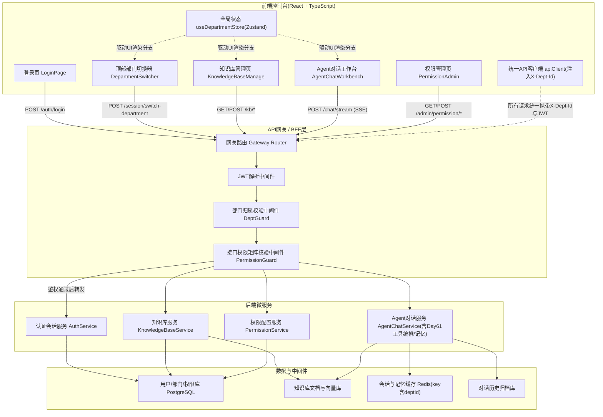
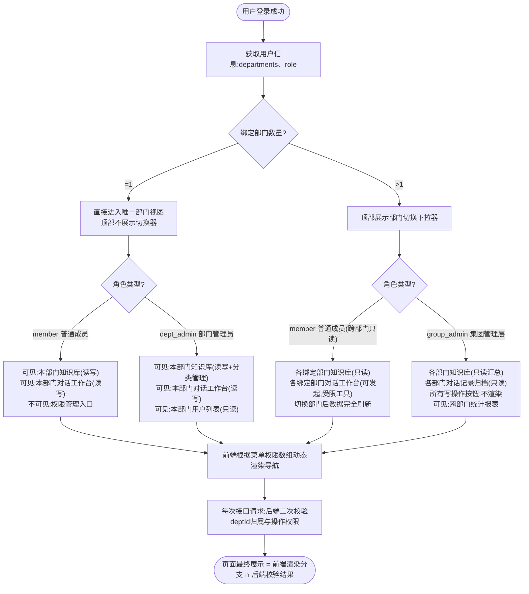

# 第62天:前端界面+后端API联调

- **课程阶段**:Stage 6·旗舰实战篇(70天企业级AI课程 · 第六阶段)
- **所属周期**:寰宇集团项目六天冲刺 · 第4天(重大项目集成日)
- **主讲/带教导师**:王振宇(老王,蓬远科技技术合伙人)
- **学员/主角**:陈铭
- **协作方**:周晓(前端工程师,蓬远科技)
- **客户方**:寰宇集团(信息化部、财务部、人力资源部、采购部、生产制造部)
- **产品**:苍穹企业级智能体中台
- **今日主题**:前端控制台开发 + 前后端API联调,打通"登录—权限—多部门—对话—溯源"全链路
- **前置知识**:Day61(工具调用编排、记忆机制、多轮交互闭环已完成)
- **今日产出物**:寰宇项目前端控制台(多部门切换组件、知识库管理页、Agent对话工作台)、后端权限校验中间件、联调修复的两处关键缺陷(权限校验漏洞、多部门数据串台)
- **明日预告**:Day63 进入测试与优化阶段

---

## 【旁白】

冲刺进入第四天,办公室的白板已经写满了三层。第一层是老王上周画的总体架构,第二层是陈铭这几天补充的工具调用和记忆模块的时序图,第三层——也是今天新添的一层——是周晓用红色马克笔写的一行字:"前端不是皮,是脸,脸歪了,里子再好也没用。"

这句话看似调侃,其实是周晓昨晚跟寰宇集团信息化部的对接人开电话会议之后,憋了一晚上憋出来的。寰宇那边的诉求很直接:系统要给财务、人力、采购、生产制造四个部门的业务人员用,每个部门只能看到自己权限范围内的知识库和对话记录,绝对不能出现"部门A的人一刷新页面,看到部门B的采购合同"这种事故。这种诉求听起来是个"UI权限展示"问题,但陈铭和老王都清楚,真正的地基在后端——前端展示的权限控制,后端必须逐层校验,否则前端做得再严密,也挡不住一个懂开发者工具的人改几个请求参数。

于是这一天,注定是前端和后端拧成一股绳的一天。上午,周晓带着陈铭一起过前端控制台的组件设计;下午,两人对着日志一条一条排查联调中冒出来的诡异现象——包括后来被记入项目复盘文档、编号为"BUG-0062-01"和"BUG-0062-02"的两个典型问题。这两个 bug,一个差点酿成真正的权限泄露事故,一个差点让寰宇的验收方在演示现场看到"串台"的对话记录。事后老王在晚会上说了一句让陈铭记到现在的话:"联调这一天教你的东西,比看十天架构图都管用,因为架构图不会骂你,线上事故会。"

---

## 晨会纪要

**时间**:2026年X月X日(冲刺第4天) 09:00-09:35
**地点**:蓬远科技3楼项目作战室
**参会人**:王振宇(主持)、陈铭、周晓、测试同学小林(列席,今日下午介入)
**会议形式**:站会 + 前后端对齐会(合并进行,因今日任务强耦合)

**一、昨日进展回顾(老王主持复盘)**

老王先让陈铭汇报Day61的收尾情况。陈铭说,工具调用编排的路由已经稳定跑通,包括"查财务报表""查采购合同状态""生成人力异动周报"三类典型工具都能被Agent正确识别调用;短期记忆用Redis做会话级缓存,长期记忆写入向量库并加了摘要压缩策略,连续跑了200轮压测对话没有出现记忆丢失或串话。老王点头说这块可以先放一放,"但记住,今天前端一上,记忆和多轮交互的边界条件会被用户用各种奇怪操作试出来,你们俩要有心理准备,该修的还得修。"

周晓接着汇报前端的准备情况。她说这三天她已经把控制台的基础框架搭出来了,路由、登录页、整体布局(左侧导航+顶部部门切换器+主内容区)都跑通了,昨晚又跟寰宇的信息化部对了一遍UI稿,确认了四个部门(财务部、人力资源部、采购部、生产制造部)加一个"集团管理层"视角,一共5套权限视图。她提出一个问题:"知识库管理页和Agent对话工作台的接口文档,陈铭那边昨天给的是草稿版,里面几个字段的类型和后端实际返回的不一致,比如`citations`字段文档写的是字符串数组,但陈铭本地跑起来返回的是对象数组,这个今天必须先对齐,不然我组件写了也要重写。"

陈铭承认接口文档确实没来得及更新,当场表态:"我九点半之前把最新的OpenAPI schema发到群里,citations改成对象数组是对的,因为要带溯源的文档片段ID、页码、相似度分数,不能只给个字符串。"

老王补充了一句:"这就是为什么我一直强调,接口契约要先行,哪怕是草稿,也得有版本号,别让前端猜后端的心思。今天开始,所有接口变更必须在群里@一下,谁改的谁负责同步。"

**二、今日任务拆解**

老王在白板上写下今天的任务清单,一共四大块:

1. **前端控制台核心页面开发**(周晓主导,陈铭配合出接口):
   - 多部门切换组件(顶部下拉,切换后联动左侧导航和主内容区权限)
   - 知识库管理页(部门维度的文档上传、分类、检索测试、状态展示)
   - Agent对话工作台(多轮对话、流式输出、引用溯源展示、历史会话列表)

2. **后端权限校验中间件**(陈铭主导):
   - 统一在API Gateway/BFF层做JWT解析 + 部门归属校验 + 接口级权限矩阵校验
   - 知识库、对话、工具调用三类接口全部纳入校验范围
   - 校验失败的降级策略(401/403区分,前端要能识别并给出不同提示)

3. **前后端联调**(下午全员):
   - 按"登录→选择部门→浏览知识库→发起对话→查看溯源"的完整链路走一遍
   - 记录所有联调中发现的问题,归类为"接口契约不一致""权限逻辑缺陷""数据隔离缺陷""UI状态缺陷"四类
   - 当天可修复的立即修复,复杂的记录到缺陷跟踪表,明天(Day63测试优化日)集中处理

4. **测试同学小林下午介入**,重点验证多部门场景下的越权访问和数据隔离,老王特意强调:"小林你今天的角色不是功能测试,是安全测试思维,专门想办法'搞坏'系统,能不能用财务部的账号看到人力部的东西,能不能改URL参数绕过权限,都试一遍。"

**三、老王的几点强调**

老王在会议最后强调了三点,陈铭记了满满一页笔记:

第一,"前端权限展示"和"后端权限校验"是两件事,不能混为一谈。前端根据用户部门隐藏菜单、灰掉按钮,这是用户体验层面的事,目的是让用户不迷路、不误操作;但真正的安全边界必须在后端,任何一个接口,不管前端有没有展示入口,后端都要独立校验调用者是否有权限访问对应部门的数据。"你们俩一定要建立这个分层意识,今天写代码的时候,前端负责'好看和好用',后端负责'安全和正确',谁也别指望对方替自己背锅。"

第二,多部门数据隔离在技术实现上有两种常见思路:一种是"物理隔离",不同部门的知识库、对话记录在数据库层面用不同的schema或者不同的库;另一种是"逻辑隔离",共用一套表结构,靠`dept_id`字段做行级过滤。寰宇项目由于部门数量不多、数据量级中等,用的是逻辑隔离方案,这就意味着几乎每一条SQL查询、每一个缓存key,都必须带上`dept_id`,一旦某个地方漏了,就是数据串台的根源。"这也是为什么我让小林重点测这块,逻辑隔离最怕的就是'有一个地方忘了加过滤条件',这种bug平时测不出来,量一大或者并发一高就炸。"

第三,今天联调发现的问题,不管大小,都要记录进联调问题清单,哪怕当场修复了也要记,因为这些问题本身就是明天测试阶段最好的用例来源。"我们不是为了应付客户验收才做测试,是真的要对我们自己的系统负责。"

**四、时间安排**

- 09:35-12:00:前端三大页面开发 + 后端权限中间件开发(并行推进)
- 13:30-14:30:接口自测(各自先跑通,再互相验证)
- 14:30-18:00:全链路联调 + 小林安全测试介入 + 问题修复
- 18:00-18:30:今日复盘 + 缺陷清单归档

会议结束前,周晓半开玩笑地说了一句:"老王,你这个'安全测试思维'是不是就是让小林专门来找我们茶。"老王笑了笑没接话,陈铭倒是接了一句:"茬找出来是好事,总比客户在寰宇集团的会议室里找出来强。"这句话后来被写进了当天的复盘文档标题下面,算是这一天的注脚。

---

## 需求文档:寰宇项目前端控制台功能需求说明

**文档编号**:HY-PRD-2026-0062
**版本**:V1.2(联调前最终确认版)
**编写人**:周晓(前端)、陈铭(后端接口对齐)
**评审人**:王振宇
**适用范围**:寰宇集团苍穹智能体中台项目 · 前端控制台模块

### 一、背景说明

寰宇集团是一家集团化管控的大型制造企业,下设财务中心、人力资源中心、采购中心、生产制造事业部四大业务板块,另设集团管理层视角用于跨部门数据汇总查看。集团在部署苍穹企业级智能体中台之前,已经明确提出一个核心诉求:**系统必须支持多部门隔离使用,不同部门的员工登录后只能看到、只能操作与自己部门相关的知识库内容和智能体对话能力,集团管理层账号可以查看全部部门的汇总视图,但不能直接篡改各部门的具体数据**。

这一诉求直接决定了前端控制台的核心设计原则:**控制台不是一套通用UI皮肤,而是一套"部门感知型"的动态渲染系统**,同一套代码,不同部门登录进来,看到的导航结构、可用功能、数据范围都不一样。

### 二、总体功能范围

前端控制台本期(第一批交付)包含四大功能模块:

1. 多部门切换模块
2. 知识库管理模块
3. Agent对话工作台模块
4. 权限管理模块(管理员配置入口,面向IT管理员角色)

以下逐一说明各模块的详细需求。

### 三、模块一:多部门切换

**3.1 功能定位**

多部门切换是整个控制台的"总开关"。用户登录成功后,系统需要根据该用户账号绑定的部门信息,决定其可切换的部门范围。绝大多数业务人员只绑定一个部门(比如财务中心的会计只能看财务中心),但也存在"跨部门协同角色"(比如集团审计人员可能同时挂靠财务中心和采购中心两个部门的只读权限),因此多部门切换组件必须支持"单部门用户不展示切换器(直接进入唯一部门视图)"和"多部门用户展示下拉切换器"两种展现形态。

**3.2 详细需求点**

- 需求3.2.1:登录成功后,前端调用`/api/v1/auth/me`接口获取当前用户信息,其中必须包含`departments`字段(数组,包含用户绑定的所有部门及在该部门下的角色,如`{"deptId": "FIN001", "deptName": "财务中心", "role": "member"}`)以及`defaultDeptId`字段(默认展示部门)。
- 需求3.2.2:若`departments`数组长度为1,顶部导航不展示切换器,仅以文字形式展示当前部门名称;若长度大于1,展示下拉切换器,支持点击展开选择。
- 需求3.2.3:切换部门后,前端必须做以下四件事,且顺序不可颠倒:(1)清空当前页面所有与部门相关的本地状态缓存(知识库列表、对话历史列表、当前对话上下文);(2)将新的`deptId`写入全局状态并同步写入后续所有API请求的Header(`X-Dept-Id`);(3)重新拉取左侧导航菜单权限配置;(4)跳转回该模块的默认首页(而不是停留在原页面强行刷新数据,避免出现"页面还是旧部门的数据框架,数据却是新部门的"的过渡态错乱)。
- 需求3.2.4:集团管理层角色(`role: "group_admin"`)切换部门时,进入的是"该部门的管理层只读视图",不能进行知识库编辑、对话发起等写操作,仅能查看统计报表和对话记录归档,写操作按钮需要在渲染层直接隐藏(不是disable置灰,是不渲染,防止用户通过修改DOM或调试工具强行触发)。
- 需求3.2.5:部门切换动作必须调用后端`/api/v1/session/switch-department`接口做一次服务端会话确认,后端会重新签发一个携带新`deptId`声明的短期访问凭证(见架构设计中的权限中间件说明),前端拿到新凭证后才允许渲染新部门页面,避免"前端自己决定切换,后端会话还停留在老部门"的不一致状态。

**3.3 验收标准**

- 单部门用户登录后界面无切换器,且始终只能访问本部门数据(通过接口测试验证,不能通过修改前端参数访问其他部门数据)。
- 多部门用户切换部门后,3秒内完成页面数据刷新,且刷新过程中不出现旧部门数据的闪烁残留。
- 集团管理层视角下,所有写操作入口(上传文档、编辑知识库、发起新对话等)均不可见。

### 四、模块二:知识库管理页

**4.1 功能定位**

知识库管理页是各部门维护本部门专属知识内容的核心页面,承载文档上传、分类管理、状态查看、检索效果自测等能力。这一页面是本次寰宇项目里数据量最大、交互最复杂的页面之一,因为文档处理是异步的(上传后要经过解析、切片、向量化多个阶段),前端需要准确反映这个异步状态。

**4.2 详细需求点**

- 需求4.2.1:页面加载时调用`/api/v1/kb/documents?deptId={当前部门}`获取文档列表,列表需展示文档名称、上传人、上传时间、所属分类、处理状态(排队中/解析中/向量化中/已完成/失败)、文档大小、切片数量。
- 需求4.2.2:文档处理状态需要轮询更新(轮询间隔5秒,状态变为"已完成"或"失败"后停止轮询该条记录),不要求做成WebSocket实时推送(本期成本考量),但轮询逻辑必须做好防抖和资源释放,页面切走后要清除定时器,避免内存泄漏和无效请求。
- 需求4.2.3:支持文档上传,支持拖拽和点击选择两种方式,单文件不超过50MB,支持pdf、docx、xlsx、txt、markdown五种格式,上传时前端必须在请求头中带上当前`deptId`,后端据此决定该文档归属哪个部门知识库,**绝不允许前端把deptId放在可被用户篡改的请求体字段里作为唯一凭据**(这一点在联调阶段被验证出问题,详见课堂笔记下午部分)。
- 需求4.2.4:文档需支持二级分类管理(如财务中心可分为"报销制度""财务报表""审计文件"三类),分类由各部门管理员自行维护,分类信息也必须挂载`deptId`,防止不同部门的分类树相互污染。
- 需求4.2.5:提供"检索效果自测"入口,管理员可以输入一段测试问题,系统调用检索接口(不经过完整Agent对话链路,只测底层retrieval)返回匹配到的文档片段及相似度分数,用于文档管理员判断知识库切片质量是否合理。
- 需求4.2.6:文档列表、分类列表、检索测试结果,三处均需在部门切换后立即清空重新拉取,不能存在跨部门残留数据(这是本页面的头号红线需求)。

**4.3 验收标准**

- 上传大文件(接近50MB)时进度条平滑更新,不出现页面卡死。
- 处理失败的文档需展示具体失败原因(如"解析失败:文件已加密"),不能只显示笼统的"失败"二字。
- 使用两个不同部门账号连续切换,反复验证知识库列表内容与当前部门严格对应,不出现任何一条跨部门数据。

### 五、模块三:Agent对话工作台

**5.1 功能定位**

这是整个控制台里技术含量最高、用户使用频率最高的模块,是苍穹中台"智能体能力"的直接呈现窗口。核心交互是:用户在输入框提问,Agent基于本部门知识库和记忆上下文,以流式方式逐字返回答案,并在答案下方展示引用的具体文档片段(溯源),用户可以点击溯源标记查看原文出处。

**5.2 详细需求点**

- 需求5.2.1:左侧展示历史会话列表(按部门隔离,与知识库列表要求一致),支持新建会话、重命名会话、删除会话。
- 需求5.2.2:主对话区支持多轮对话展示,用户消息和Agent回复以气泡形式区分展示,Agent回复过程中需要展示"思考中"或"正在检索知识库"这类中间态提示(调用Day61完成的工具编排能力时,后端会推送阶段性状态事件,前端需要正确渲染这些中间态,不能让用户在等待期间看到一片空白)。
- 需求5.2.3:Agent回复采用SSE(Server-Sent Events)流式输出,前端逐token拼接展示,要求首字节到达后200毫秒内开始渲染,视觉上不能有明显卡顿感;需要处理好流式过程中用户中途关闭页面或切换会话的情况,及时中断连接,不产生僵尸请求。
- 需求5.2.4:回复内容中如果引用了知识库文档,需要在对应句子或段落后面展示角标形式的引用标记(如"①""②"),点击角标弹出引用溯源面板,展示该引用对应的文档名称、页码/章节、原文片段、相似度分数,支持点击"查看完整文档"跳转到知识库管理页对应文档。
- 需求5.2.5:多轮对话上下文需要正确维护,用户在同一会话内追问时,Agent的记忆机制(Day61已实现)要正常生效,前端只需正确传递`sessionId`,不需要自己维护上下文拼接。
- 需求5.2.6:对话工作台必须严格限定在当前部门的知识库范围内检索和回答,这一点后端会做强制校验,前端仅做展示层的一致性保障(比如切换部门后必须重新建立会话,不能延续上一个部门的会话上下文)。

**5.3 验收标准**

- 流式输出过程流畅,无明显掉字、乱序现象。
- 引用溯源信息准确对应实际检索到的文档片段,点击可正常跳转。
- 部门A的会话历史在切换到部门B后完全不可见,且不能通过修改URL中的会话ID参数访问到部门A的会话内容(此为安全测试重点验证项)。

### 六、模块四:权限管理(管理员配置)

**6.1 功能定位**

面向寰宇集团IT管理员的后台配置页面,用于管理用户与部门的绑定关系、角色分配、以及各角色对各功能模块的操作权限矩阵。本期功能相对简化,仅支持基础的增删改查,不涉及复杂的审批流。

**6.2 详细需求点**

- 需求6.2.1:支持用户列表查看、新增用户、编辑用户部门归属和角色。
- 需求6.2.2:支持权限矩阵配置界面,以表格形式展示"角色 × 功能模块 × 操作类型(查看/编辑/删除)"的三维权限矩阵,管理员勾选保存。
- 需求6.2.3:权限矩阵变更后,需要有明确的生效时间说明(本期方案是变更后用户下次登录或token刷新时生效,不做强制踢下线,这一点已与寰宇方确认可接受)。

**6.3 验收标准**

- 权限矩阵配置保存后,通过重新登录验证确实生效。
- 非管理员角色无法访问该页面(包括直接输入URL访问,需后端路由级校验拦截)。

### 七、非功能性需求

- 页面首屏加载时间(登录后进入首页)不超过2秒(内网环境测试)。
- 所有涉及部门数据的接口,后端必须做部门归属校验,不能仅依赖前端传参,这一条被列为**P0级安全红线需求**,联调阶段必须专项验证。
- 前端需要做好网络异常、接口超时、SSE连接中断的友好提示和重试机制。
- 界面风格延续苍穹中台统一设计语言,主色调采用蓬远科技标准色板,支持中文界面(本期不做国际化)。

---

## 架构设计图:前端控制台页面结构与后端API映射

下图展示了前端控制台四大页面模块与后端服务、接口的对应关系,重点体现"每一层都有独立的部门权限校验点"这一设计原则。



这张架构图里有几个关键点值得在课堂笔记里重点展开说明:第一,前端的`useDepartmentStore`是一个全局单一状态源,任何页面的部门相关渲染都从这里读取,不允许各个组件各自维护一份部门状态,这是避免前端出现"部门状态不同步"问题的核心设计;第二,后端网关层的校验是分层的,JWT解析只负责确认"你是谁",部门归属校验负责确认"你是否真的属于你声称的这个部门",接口权限矩阵校验负责确认"你这个角色能不能做这个操作",三层缺一不可,这也正是今天联调发现的权限漏洞的根源所在(漏洞出现在部门归属校验这一层被绕过了);第三,Redis缓存的key必须包含`deptId`,这是防止多部门数据串台的关键设计,今天发现的另一个bug就是缓存key设计遗漏了这一点。

---

## 流程图:用户登录到完成一次对话交互的完整前后端联调流程

```mermaid
sequenceDiagram
    autonumber
    actor U as 用户(寰宇员工)
    participant FE as 前端控制台
    participant GW as API网关/BFF
    participant AUTH as 认证会话服务
    participant PERM as 权限校验中间件
    participant KB as 知识库服务
    participant CHAT as Agent对话服务

    U->>FE: 输入账号密码,点击登录
    FE->>GW: POST /auth/login
    GW->>AUTH: 校验账号密码
    AUTH-->>GW: 返回用户信息 + 部门列表 + JWT
    GW-->>FE: 登录成功,返回JWT与departments数组

    FE->>FE: 若departments.length>1,展示部门切换器;否则直接使用唯一部门
    U->>FE: 选择/确认所在部门
    FE->>GW: POST /session/switch-department (deptId)
    GW->>PERM: 校验该用户是否绑定该deptId
    PERM-->>GW: 校验通过
    GW->>AUTH: 签发携带deptId声明的新会话令牌
    AUTH-->>GW: 返回新令牌
    GW-->>FE: 返回新令牌,前端写入apiClient默认Header

    FE->>GW: GET /nav/menu (携带新令牌)
    GW->>PERM: 根据角色+deptId计算可见菜单
    PERM-->>GW: 返回菜单权限列表
    GW-->>FE: 渲染左侧导航(仅展示有权限的模块)

    U->>FE: 进入知识库管理页
    FE->>GW: GET /kb/documents?deptId=xxx
    GW->>PERM: 校验令牌中的deptId与请求deptId一致
    PERM-->>GW: 一致,放行
    GW->>KB: 查询该部门文档列表
    KB-->>GW: 返回文档列表
    GW-->>FE: 渲染文档列表

    U->>FE: 切换到对话工作台,输入问题并发送
    FE->>GW: POST /chat/stream (sessionId, deptId, message) 建立SSE连接
    GW->>PERM: 校验deptId归属与接口操作权限
    PERM-->>GW: 放行
    GW->>CHAT: 转发对话请求
    CHAT->>KB: 基于deptId限定范围检索知识库
    KB-->>CHAT: 返回相关文档片段(含citation信息)
    CHAT-->>GW: 流式返回token与阶段性状态事件
    GW-->>FE: SSE持续推送
    FE-->>U: 逐字渲染回复,展示引用角标

    U->>FE: 点击引用角标
    FE->>FE: 展示引用溯源面板(文档名/页码/原文片段/相似度)
```

这张流程图对应的是需求文档第五部分的核心链路,也是今天下午联调的主要脚本——测试同学小林下午就是按照这张图的每一步,逐个环节去验证"这一步是否真的做了它该做的校验",而不仅仅是验证"功能能不能跑通"。事实证明,BUG-0062-01(权限校验漏洞)正是出现在图中第14步"GW->>PERM: 校验令牌中的deptId与请求deptId一致"这一环节——中间件当时只校验了令牌是否有效,却没有真正比较令牌里的deptId和请求参数里的deptId是否一致,导致理论上可以拿着A部门的合法令牌,在请求参数里填B部门的deptId,直接查到B部门的数据。

---

## 示意图:前端控制台多部门权限UI呈现逻辑示意



这张示意图想强调的核心观点是:前端的UI呈现逻辑只是"第一层过滤",它决定了用户第一眼能看到什么、点到什么;但最终真正生效的权限,永远是"前端渲染分支"和"后端校验结果"的交集。哪怕前端因为某个疏漏渲染出了一个不该出现的按钮,只要后端校验足够严密,用户点了也拿不到数据,顶多是体验上的小瑕疵;反过来,哪怕前端权限逻辑做得再精致,只要后端有一处漏了校验,系统的安全边界就是不成立的。这也是老王在晨会上反复强调的"分层意识"在图上的具体呈现。

---

## 课堂笔记

### 上午:前端控制台开发

**09:35,任务分工确定。** 周晓负责三个页面的主体框架和交互逻辑,陈铭负责把接口文档最终版整理出来发到群里,同时着手写后端权限中间件。两人约定用"接口先行、mock先跑、真实对接后微调"的节奏推进,避免互相等待。

**多部门切换组件的设计思路。** 周晓在动手写代码之前先讲了她的设计思路,陈铭在旁边一起过了一遍逻辑再各自去写代码,这个讨论过程本身就值得记录下来。周晓认为多部门切换不能做成一个孤立的下拉框组件,它必须和全局状态管理强绑定,因为一旦切换部门,几乎整个应用的数据都要联动刷新,如果状态管理设计不好,很容易出现"切换了部门,但某个页面的某个子组件还拿着旧部门的数据在渲染"的问题——这种问题往往不会立刻报错,而是安安静静地展示错误数据,是最难排查、也最危险的一类前端bug。

她的方案是用Zustand做一个专门的`useDepartmentStore`,里面维护三个核心状态:`currentDeptId`(当前部门ID)、`departments`(用户绑定的部门列表)、`switchVersion`(一个每次切换部门就自增的版本号)。这个`switchVersion`是关键设计,周晓管它叫"部门切换代际"——凡是依赖部门数据的组件,在发起异步请求(比如拉取知识库列表)之前,先记下当前的`switchVersion`,请求返回时再检查这个版本号是否还是当初记下的那个,如果用户在请求还没返回的时候又切换了部门,版本号会变,组件就直接丢弃这次返回的数据,不渲染。这个思路本质上是在解决前端异步请求里经典的"竞态条件"(race condition)问题:比如用户先切到财务部触发了一次知识库列表请求,这个请求因为网络原因还没返回,用户又手快切到了人力部,这时候如果财务部那次慢请求先回来了,如果没有版本校验,页面就会先展示财务部的数据,过一会儿人力部的数据回来了才被覆盖,用户会看到一次明显的"数据闪烁错乱"。

陈铭听完提了个问题:"这个版本号只能防前端自己的竞态,但如果用户切换部门之后,后端那边权限校验没跟上,是不是一样会拿到错的数据?"周晓说这正是她要强调的边界:"前端这套东西解决的是'展示层的数据一致性',不解决'数据到底该不该给你看'的问题,那个是你们后端的事,咱俩今天正好一个管一层。"这段对话后来被陈铭写进了自己的笔记本,他觉得这恰好印证了老王晨会上说的分层意识,只不过这次是从前端工程师嘴里说出来的,角度不太一样,但结论完全一致。

上午十点左右,这套设计刚落地成代码,团队还遇到了一个小插曲,后来被陈铭调侃为"今天的第一个'假故障'"。周晓按照设计把`useDepartmentStore`和知识库、对话两个业务store之间做了相互引用——`useDepartmentStore`在切换部门时需要调用`useKnowledgeBaseStore`和`useChatStore`的`resetForDeptSwitch`方法清空业务数据,而这两个业务store在初始化时又反过来import了`useDepartmentStore`用于读取当前部门ID,写完保存之后,页面直接白屏,浏览器控制台报出一行看起来毫无头绪的错误:`Cannot access 'useDepartmentStore' before initialization`。周晓一开始怀疑是自己哪里拼写错了变量名,反复检查了几遍代码却没发现问题,陈铭凭着之前踩过类似坑的经验提示她:"这个报错很典型,是ES Module的循环依赖导致的,两个模块互相import对方,打包工具在解析依赖图的时候,谁先被引用谁的模块顶层代码就可能还没执行完,你这边这种'store之间互相引用'的写法,在纯前端工程里其实要非常小心。"两人一起把三个store的引用关系画了一张简单的箭头图,确认问题所在之后,周晓把方案调整为"业务store不主动import部门store,而是由调用方(组件或者部门切换动作发起处)显式把需要清空的store方法作为参数传进去",从而彻底切断了这种循环引用关系,页面恢复正常。这个小插曲被记进了当天的笔记,陈铭说这提醒他们,状态管理设计不仅要考虑"数据怎么流动",也要考虑"模块之间怎么引用",否则设计得再合理,一个循环依赖就能让整个应用直接白屏,而且这种报错信息往往和真正的病因相隔甚远,排查时最容易走弯路。

**知识库管理页的异步状态处理。** 上午十点半左右,周晓开始写知识库管理页,遇到的第一个设计难点是文档处理状态的轮询机制。她原本想用一个全局的定时器,每5秒把整个文档列表重新拉取一遍,陈铭听到后建议她换一种做法:"如果文档有一百多条,每次全量拉取列表既浪费带宽也浪费后端查询资源,而且只有'处理中'状态的文档才需要轮询,'已完成'和'失败'的没必要反复查。"两人商量后改成了"增量轮询"方案:前端维护一个"待轮询文档ID集合",只对这个集合里的文档发起一个批量状态查询接口(`GET /kb/documents/status?ids=xxx,yyy,zzz`),状态变为终态后就把对应ID从集合里移除,集合为空时停止轮询。这个方案后来在代码实战部分有完整实现。

周晓还提到一个细节:轮询定时器必须在组件卸载时清除,她之前踩过这个坑,一个页面来回切换几次,内存里堆了七八个还在跑的定时器,每个都在发请求,后端日志里全是重复请求,排查了半天才发现是前端没清理副作用。这次她用React的`useEffect`清理函数,在组件卸载或者依赖的`deptId`变化时,主动清空所有轮询定时器,这也是知识库管理页代码里比较关键的一处细节实现。

接近十一点的时候,周晓在本地测试大文件上传功能,特意找了一份47MB左右的PDF文件用来验证"单文件不超过50MB"这条需求是否生效,结果出乎意料——文件明明没超过50MB,前端的`beforeUpload`校验也顺利通过了,但上传请求发出去之后没多久就返回了一个`413 Request Entity Too Large`的错误,页面上只提示"上传失败",看不出具体原因。周晓一开始以为是自己请求头设置错了,检查了半天Content-Type也没发现问题,最后把这个问题丢给陈铭一起看。陈铭看了一眼错误状态码就基本猜到了方向:"413一般不是应用代码报的,是反向代理或者Web服务器那一层的请求体大小限制先卡住了,我们本地跑的Nginx配置我记得默认限制是1MB,这个还是上周搭环境的时候随手写的测试配置,一直没改。"两人查看本地Nginx配置文件,果然发现`client_max_body_size`这个配置项默认值是1m,而且此前的测试用的都是几百KB的小文件,一直没有触发过这个限制。陈铭把这个值调整为100m(略大于业务需求的50MB上限,留出余量),同时提醒周晓,这类"看似前端逻辑没问题,但请求怎么都发不过去"的报错,很多时候要往"客户端和应用服务器之间还有哪些中间层"这个方向去排查,包括Nginx、网关、CDN,都可能设置了各自的请求体大小限制,而且这些限制往往不会在应用日志里留下清晰的记录,反而更容易第一时间让人怀疑到应用代码本身。修复之后,周晓又特意构造了一份49.8MB的文件重新测试,上传进度条平滑走完,验证问题彻底解决。

**Agent对话工作台的流式渲染难点。** 上午十一点之后,周晓开始搭对话工作台的框架,这是今天前端工作量最大的部分,她坦白说自己对SSE流式渲染没有太多经验,之前做的项目大多是普通的请求-响应模式,陈铭花了大概二十分钟跟她讲了后端这边SSE接口的数据格式约定。

按照约定,后端的SSE流会推送几种不同类型的事件:`token`事件(每次推送一小段文本片段,前端需要按顺序拼接)、`status`事件(推送"正在检索知识库""正在调用工具"这类中间状态,用于前端展示加载提示)、`citation`事件(在回复内容确定引用了某个文档片段时推送,包含文档ID、片段内容、相似度分数等)、`done`事件(表示这一轮回复结束)、`error`事件(表示中途出错,需要前端做优雅降级展示)。

周晓提出一个前端实现上的顾虑:"如果用户在流式输出过程中,把这个对话切走去看别的会话,或者直接把浏览器标签关掉,这个SSE连接要怎么处理?"陈铭说后端会正常处理连接断开的情况,不会有资源泄漏,但前端也要主动在合适的时机调用`EventSource`的`close()`方法或者用`AbortController`中断`fetch`流式请求,不能指望浏览器自动帮忙清理,尤其是用户在同一个页面内切换会话(而不是关闭页面)的场景,如果不主动中断上一个流式请求,新旧两路流的数据会混在一起渲染到页面上,这也是一个容易被忽略的细节。

关于引用溯源展示,周晓的设计是在正文中用上标角标的形式标记引用位置(类似论文脚注的视觉习惯),角标本身是一个可点击的小组件,点击后弹出一个侧边浮层面板,展示对应的文档名称、页码或章节、原文片段摘录、相似度分数,并提供一个"查看完整文档"的跳转链接。她提到这里有个交互细节需要注意:因为回复内容是流式到达的,引用角标可能是在正文渲染完之后才通过`citation`事件补充推送过来的,所以角标的插入位置需要用一种"占位符替换"的方式实现——后端在生成回复文本时,会在需要插入引用的位置放置形如`[[cite:1]]`的占位符标记,前端在渲染时用正则匹配替换成实际的可点击角标组件,同时维护一个`citationMap`,用引用编号作为key存储对应的溯源详情,等`citation`事件到达后再填充这个map的内容。这个设计思路巧妙地解决了"文本流先到、引用详情后到"的时序问题。

周晓在测试流式渲染效果的时候还发现了一个有意思的小问题:Agent回复内容如果包含Markdown格式(比如加粗、列表、代码片段),由于文本是一个token一个token拼接上来的,经常会出现"正在流式输出到一半时,Markdown语法符号还没有配对完整"的情况,比如回复内容里有一段本该加粗显示的文字,前面的`**`已经到达,后面配对的`**`还没推送过来,这时候如果直接把当前已拼接的文本丢给Markdown渲染器解析,渲染器会把这个还没闭合的`**`当成普通文本显示出来,等后面配对的`**`到达之后,这段文字才会突然"跳"成加粗样式,视觉上会有一瞬间的闪烁跳动,体验不够顺滑。周晓最初尝试的解决办法是"只要检测到当前文本里有未闭合的Markdown语法标记,就先不渲染这一段,等下一个token到达再重试",但这个方案在流速较慢的时候会让文字看起来一卡一卡地成段冒出来,反而更不自然。陈铭建议她换个思路:"没必要在流式过程中做完美的Markdown解析,业界通常的做法是流式阶段先按纯文本展示,只有收到`done`事件、确认这一轮回复真正结束之后,才用完整的最终文本重新做一次完整的Markdown渲染,流式过程中的样式跳动本身可以被产品经理接受,只要最终定格的效果是对的就行。"周晓和产品侧确认了这个取舍能被接受之后,采用了这个更简单的方案:流式过程中始终以纯文本追加展示,`done`事件到达后才整体切换成Markdown渲染结果,这个改动只用了十几分钟就完成,却让原来那种"文字忽然跳动"的违和感完全消失了。

**上午收尾。** 到12点站会前,周晓已经把三个页面的骨架代码和大部分交互逻辑写完,陈铭这边完成了权限中间件的第一版实现,以及接口文档的最终确认版。两人约定下午一点半开始互相对接调试。老王中午过来看了一眼进度,提醒了一句:"别小看引用溯源这个功能,寰宇的信息化部负责人上次演示会上专门问了这个点,说这是他们判断'这套系统是不是真的靠谱'的关键功能之一,毕竟企业客户最怕的就是AI一本正经地编内容,能不能溯源到真实文档,直接决定客户信不信这套系统。"这句话让陈铭下午在调试溯源功能的时候格外仔细,发现有个别情况下溯源片段和实际引用内容对不上的小问题,当场就修复了。

### 下午:前后端联调

**13:30,联调正式开始。** 两人先按照流程图里的链路,用一个测试账号(绑定财务中心,角色为member)完整走了一遍:登录、进入知识库管理页、上传一份测试文档、等待处理完成、进入对话工作台发起一次提问、查看溯源。整个流程走下来没有出现阻断性的报错,周晓和陈铭都松了一口气。

不过,这趟"理想路径"的联调并不是完全没有意外。当周晓这边看着对话工作台的回复文字应该是逐字蹦出来的效果时,她发现无论问什么问题,回复内容都是整整齐齐地"唰"一下全部冒出来,完全没有预想中的逐字流式效果,倒像是等模型把整段话都生成完毕之后一次性推送过来的。她一开始以为是自己前端拼接逻辑写错了,对着`useSSEChat`的代码看了好几遍,逐行确认token事件确实是一个个单独触发的,前端逻辑本身没有问题。陈铭这边打开浏览器的网络面板观察这个请求,发现响应确实是分成了很多小块陆续到达的,时间线上看起来是流式的,但周晓这边视觉上却完全感受不到分批到达的效果,这个矛盾让两人都有点摸不着头脑。老王凑过来看了一下,提示了一句:"你们本地是不是走的是Nginx转发?SSE这种长连接流式响应,很容易被反向代理的响应缓冲机制'拦腰截断'——上游服务器明明是一块一块吐数据出来的,但Nginx默认会把整个响应先缓冲到自己的缓冲区里,攒够一定大小或者等上游连接结束了才一次性转发给客户端,这样客户端看到的效果就是'流式变成了假的一次性响应'。"陈铭顺手用`curl -N`直接绕过浏览器请求了一次后端接口(`-N`参数关闭curl自身的输出缓冲),发现命令行终端里的文字确实是一个字一个字蹦出来的,证明后端服务本身的流式推送是正常的,问题确实出在Nginx这一层。查阅Nginx官方文档后确认,需要在对应的location配置块里加上`proxy_buffering off;`,同时在后端响应头里补充`X-Accel-Buffering: no`(这是Nginx专门识别的一个头部,用来告知它不要对这个响应做缓冲),两处配置都加上之后重新测试,页面上的回复内容终于恢复成了逐字蹦出的效果,和`curl -N`看到的节奏完全一致。这个问题被陈铭记进了部署环境注意事项清单里,他说这种"流式接口在本地直连时表现正常,一旦经过反向代理就失真"的问题非常隐蔽,如果不是今天联调时刻意去对照观察,很可能要等到正式部署上线之后才会被发现,而那时候排查起来的难度会更高,因为团队往往会先怀疑应用代码或者网络带宽,很少第一时间想到是反向代理的默认配置在作祟。

解决完这个小插曲之后,老王过来看了一眼进度说:"这只是最理想路径跑通了,真正的联调不是走一遍顺利的路,是想办法把不顺利的路都走一遍。"于是下午两点,测试同学小林正式介入。

**问题一(联调编号 BUG-0062-01):权限校验漏洞——deptId参数可被篡改绕过归属校验。**

小林的测试方法很朴素:她用财务中心的账号登录,拿到浏览器开发者工具里的网络请求,复制了一份知识库文档列表的请求,把URL里的`deptId=FIN001`手动改成了人力资源中心的部门ID`deptId=HR001`,重新发出请求。结果让所有人都愣了一下——接口正常返回了人力资源中心的文档列表。

小林当场把这个发现报给了陈铭和老王。陈铭第一反应是查权限中间件的代码,很快定位到问题所在:中间件确实做了JWT解析和有效性校验,也确实提取出了令牌里携带的`deptId`声明(也就是用户登录/切换部门时,服务端签发到token里的那个deptId),但是在处理具体业务接口(如查询知识库列表)时,后端代码里用来做查询的`deptId`参数,取的是**请求URL的query参数**,而不是**令牌里解析出来的deptId**。也就是说,中间件校验通过只代表"你的令牌是合法的、没过期",但从来没有真正比较过"你令牌里绑定的部门"和"你请求里想查询的部门"是不是同一个,这是一个典型的"认证(Authentication)通过了,但授权(Authorization)没做"的漏洞,业界一般把这类问题归为"横向越权"(IDOR,不安全的直接对象引用)。

老王听完解释后神色严肃,让陈铭立刻停下手里其他事,专项修复这个问题,并且要求把公司现在所有涉及部门数据的接口都过一遍,确认是否存在同类隐患。"这不是联调小问题,这是能直接写进客户安全审计报告的大问题,如果这套系统上线后被寰宇的安全团队测出来,我们这几天所有的努力都会因为这一个漏洞被打上问号。"

修复思路很明确:中间件层必须强制以令牌里解析出的`deptId`为唯一可信来源,业务代码不应该、也不能够直接信任请求参数里的deptId。具体做法是在权限中间件里,把从令牌解析出的`deptId`重新写入一个受信任的上下文对象(比如FastAPI里常用的`request.state`),业务层代码统一从这个上下文对象取值,而不是从原始的query参数或请求体取值;同时,为了兼容"用户在请求里显式传了deptId用于校验一致性"的合法场景(比如管理员账号可能需要主动指定要查询的部门),中间件额外增加一层比对逻辑:如果请求里传了deptId,必须和令牌上下文里的deptId(或者该用户被授权可访问的部门集合)完全匹配,否则直接拒绝并返回403,而不是"忽略请求参数,悄悄用令牌里的值",因为"悄悄纠正"这种做法本身也存在风险(可能掩盖了一个客户端逻辑错误,却让系统看起来正常运行)。这一段修复代码的完整实现在下面的代码实战部分有详细呈现。

修复完之后,小林重新用同样的手法测试,这次接口返回了403 Forbidden,错误信息为"无权访问该部门数据",问题确认修复。老王要求这个问题连同修复过程写进当天的复盘文档,并且作为反面案例记录进公司内部的代码评审checklist,以后所有涉及多租户/多部门数据隔离的接口开发,评审时必须显式检查"业务查询条件是否来自可信的服务端上下文,而不是客户端可篡改的输入"。

**问题二(联调编号 BUG-0062-02):多部门数据串台——Redis缓存key未包含部门维度导致对话上下文污染。**

这个问题出现得比较隐蔽,一开始甚至没有被当成bug看待。下午三点半左右,陈铭和周晓在联调对话工作台时,用两个不同的测试账号(一个财务中心账号,一个人力资源中心账号)开了两个浏览器标签同时测试,财务中心账号先问了"我们部门今年的报销制度有哪些变化",Agent正常回复;紧接着人力资源中心账号问了一个完全不相关的问题"新员工入职需要准备哪些材料",结果Agent的回复里居然出现了一句"结合您此前提到的报销制度变化"这样的话——这明显是把财务中心那个会话的上下文,错误地当成了人力资源中心这个会话的记忆上下文来使用了。

这个现象一度让周晓以为是自己前端会话ID传错了,重新检查了半天前端代码,发现sessionId的生成和传递都是正确的,两个会话用的是完全不同的sessionId。陈铭这边转向排查后端记忆机制的实现,很快定位到问题:Day61实现的短期记忆缓存,用的Redis key设计是`session:memory:{sessionId}`,理论上应该没有部门维度混淆的问题,因为sessionId本身是唯一的。但陈铭继续往下查,发现真正出问题的地方不是短期记忆,而是"知识库检索结果缓存"这一层——为了减少重复检索同样问题带来的向量库查询压力,系统对最近的检索结果做了一层缓存,缓存key的设计是`kb:search:cache:{query_hash}`,这个key只对用户输入的问题文本做了哈希,却完全没有把`deptId`纳入key的组成部分。

问题的触发条件是:如果两个不同部门的用户,凑巧问出了语义或者文本高度相似的问题(这次是因为陈铭和周晓测试时随口问的两个问题在做检索embedding之后,恰好落在了同一个缓存桶里,还有一种更直接的复现方式是两人几乎同时问了内容部分重叠的问题),检索缓存命中之后返回的文档片段,是之前另一个部门的检索结果,而这些片段又被作为上下文提示词的一部分交给大模型生成回复,于是就出现了"回复内容里夹带了别的部门信息"的诡异现象。这个bug比第一个更隐蔽,因为它不是每次都会触发,只有在缓存命中且跨部门问题相似度较高时才会出现,属于典型的"低概率但高危害"的数据隔离缺陷。

老王听完这个分析,专门强调了一句:"这种bug才是最吓人的,因为它平时看起来系统运行得好好的,业务方也不会天天拿两个不同部门的账号同时提相似的问题去测,一旦上线运行一段时间之后突然爆出来,客户会觉得我们这个系统'不知道什么时候就把别的部门的秘密说出来了',这种信任一旦崩了很难挽回。"

修复方案是把缓存key的组成从单纯的`query_hash`改为`kb:search:cache:{deptId}:{query_hash}`,确保不同部门即便问了完全一样的问题,也不会共享检索缓存;同时,陈铭顺手做了一次代码审查,把系统里所有涉及Redis缓存的地方都过了一遍,额外发现了两处类似风险(一处是工具调用结果的缓存,一处是文档分类树的缓存),都统一补上了`deptId`维度,防止类似问题在其他功能点上以后再次出现。这一段修复代码及审查思路同样在代码实战部分完整呈现。

修复后,陈铭和周晓用之前复现问题的两个账号又反复测试了十几轮,包括故意构造语义高度相似的问题,均未再出现跨部门内容混入的情况;小林随后也接手做了针对性的回归测试,包括高并发场景下的模拟测试(用脚本模拟十个不同部门账号同时发起相似问题的对话请求),确认问题已经彻底解决。

**其他联调发现的小问题(非P0级,记录进缺陷跟踪表,今天顺手修复)。**

除了上述两个重点问题,下午联调过程中还发现了若干个相对轻量的问题,团队采用"边发现边修"的节奏当场处理,这里按发现顺序简单记录:

一是知识库文档上传后,处理状态轮询的过渡态展示不够友好,文档刚上传成功的一瞬间,列表里短暂显示为一个空白行(因为后端接口返回文档记录但状态字段还没来得及初始化),周晓补充了一个默认状态兜底展示为"排队中",解决了这个视觉闪烁问题。

二是对话工作台里,如果Agent一次回复引用了同一份文档的多个不同片段,原本的引用角标编号逻辑会给每个片段单独编号,导致界面上出现"①②③"分别指向同一份文档的不同页码,这本身不算错误,但用户体验上略显繁琐,团队讨论后决定保留这个设计(因为不同页码确实是不同的溯源出处,合并展示反而可能误导用户以为只引用了一处),只是在溯源面板里增加了"共X处引用自该文档"的提示文案,方便用户理解。

三是部门切换器在网络较慢的情况下,点击切换后如果新部门的菜单权限接口响应慢于500毫�import秒,会出现左侧导航短暂空白的情况,周晓补充了一个骨架屏(Skeleton)过渡效果,提升了体验但不影响功能正确性。

四是集团管理层账号切换部门查看只读汇总视图时,发现"导出报表"按钮点击后会报错,原因是这个按钮调用的接口沿用了普通成员视角的写权限接口路径,陈铭确认这是接口路径分配的疏漏,补充了一个专属于只读汇总视角的报表导出接口,并在权限矩阵里正确配置了`group_admin`角色对该接口的访问权限。

五是知识库检索效果自测功能里,测试问题输入框在中文输入法候选词还没确认的时候,按下回车键会误触发提交,周晓在事件处理逻辑里增加了对`isComposing`状态的判断,避免了这个输入体验问题。

六是小林在做并发测试时,用脚本模拟十几个账号同时高频调用知识库检索接口,跑了不到一分钟,后端就开始陆续报出`redis.exceptions.ConnectionError: max number of clients reached`,一部分请求直接返回500错误。陈铭排查后发现,问题不在Redis服务端本身的连接数上限设置得太低,而是应用代码里每次处理请求都临时`new`一个Redis连接,用完之后也没有显式释放回连接池,短时间内并发请求一多,连接对象越攒越多,很快就把Redis允许的最大客户端连接数占满了。他把这处代码改成从一个全局初始化好的连接池(`redis.ConnectionPool`)里获取连接,请求处理完毕后连接自动归还池中供后续请求复用,而不是每次都新建一个连接,重新压测后同样的并发场景不再出现连接数耗尽的问题,响应也更稳定。老王评价这个问题"看起来是个性能问题,往深了想其实也是资源管理不严谨的表现",和今天权限校验、缓存key设计这些问题背后反映的是同一种工程习惯——写代码的时候要多想一步"这个资源用完了谁来负责释放""这个入口会不会被并发放大成一个更严重的问题",这类习惯往往比单纯记住某个具体的修复方案更重要。

七是集团管理层视角下的跨部门统计报表页面,首次加载时后端要串行查询四个部门各自的汇总数据再合并展示,单个部门查询平均耗时300毫秒左右,四个部门串行下来接近1.2秒,页面首屏等待感比较明显。陈铭把这部分逻辑改成用`asyncio.gather`并发查询四个部门的数据,查询之间互不依赖,合并逻辑在所有查询都返回之后统一执行,改造后整体耗时降到了和单个部门查询耗时基本持平的300多毫秒,这个优化虽然没有被列为P0问题,但也被记进了缺陷跟踪表,因为它直接关系到"页面首屏加载时间不超过2秒"这条非功能性需求的达成情况。

**18:00,联调收尾。** 团队把当天所有发现的问题整理进联调问题清单,标注了严重程度、修复状态、修复人和验证人。老王要求这份清单原样归档,作为Day63测试与优化日的基础材料之一,同时他特别把BUG-0062-01和BUG-0062-02两个问题单独摘出来,写进了项目风险登记表,并要求这两处修复代码在明天的代码评审环节里,由团队所有人过一遍,确保每个人都理解这类问题的成因和防范思路,而不仅仅是"陈铭改完就完了"。

---

## 代码实战

本节完整呈现今天联调涉及的核心代码,分为前端控制台部分和后端权限校验、缺陷修复部分。代码按照实际项目的模块划分方式组织,注释保留了关键的设计决策说明。

### 一、前端:公共类型定义

```typescript
// frontend/src/types/index.ts
// 全局共享的类型定义,前后端接口契约的前端侧映射

export type UserRole = 'member' | 'dept_admin' | 'group_admin' | 'super_admin';

export interface DepartmentInfo {
  deptId: string;
  deptName: string;
  role: UserRole;
}

export interface CurrentUser {
  userId: string;
  userName: string;
  departments: DepartmentInfo[];
  defaultDeptId: string;
}

export type DocumentStatus =
  | 'queued'
  | 'parsing'
  | 'embedding'
  | 'completed'
  | 'failed';

export interface KnowledgeDocument {
  docId: string;
  deptId: string;
  fileName: string;
  fileSize: number;
  category: string;
  uploader: string;
  uploadTime: string;
  status: DocumentStatus;
  failReason?: string;
  chunkCount?: number;
}

export interface DocumentCategory {
  categoryId: string;
  deptId: string;
  categoryName: string;
  parentId?: string;
}

export interface RetrievalTestResult {
  chunkId: string;
  docId: string;
  docName: string;
  content: string;
  score: number;
  page?: number;
}

export interface ChatSession {
  sessionId: string;
  deptId: string;
  title: string;
  updatedAt: string;
}

export type ChatRole = 'user' | 'assistant';

export interface CitationInfo {
  citationIndex: number;
  docId: string;
  docName: string;
  page?: number;
  chapter?: string;
  snippet: string;
  score: number;
}

export interface ChatMessage {
  messageId: string;
  role: ChatRole;
  content: string;
  citations: CitationInfo[];
  createdAt: string;
  streaming?: boolean;
}

export type SSEEventType = 'token' | 'status' | 'citation' | 'done' | 'error';

export interface SSEEventPayload {
  type: SSEEventType;
  data: {
    token?: string;
    statusText?: string;
    citation?: CitationInfo;
    errorMessage?: string;
  };
}

export interface PermissionMatrixEntry {
  role: UserRole;
  module: string;
  canView: boolean;
  canEdit: boolean;
  canDelete: boolean;
}

export interface MenuItem {
  key: string;
  label: string;
  path: string;
  visible: boolean;
}
```

### 二、前端:统一API客户端

```typescript
// frontend/src/api/client.ts
// 统一封装axios实例,核心职责:自动注入当前部门ID与鉴权令牌,
// 并统一处理401/403两类错误的降级提示

import axios, {
  AxiosError,
  AxiosInstance,
  InternalAxiosRequestConfig,
} from 'axios';
import { useDepartmentStore } from '../store/useDepartmentStore';
import { useAuthStore } from '../store/useAuthStore';
import { message } from 'antd';

const apiClient: AxiosInstance = axios.create({
  baseURL: import.meta.env.VITE_API_BASE_URL || '/api/v1',
  timeout: 15000,
});

// 请求拦截器:统一注入JWT与当前部门ID
apiClient.interceptors.request.use((config: InternalAxiosRequestConfig) => {
  const token = useAuthStore.getState().accessToken;
  const currentDeptId = useDepartmentStore.getState().currentDeptId;

  if (token) {
    config.headers = config.headers ?? {};
    config.headers['Authorization'] = `Bearer ${token}`;
  }

  // 关键设计:deptId统一由前端全局状态注入到Header,
  // 而不是让每个页面组件各自拼接到query参数里,
  // 这样即便某个页面漏写了deptId,后端也能从Header里拿到兜底值,
  // 但注意:后端绝不能仅信任这个Header,必须与JWT内的deptId比对(见后端中间件实现)。
  if (currentDeptId) {
    config.headers = config.headers ?? {};
    config.headers['X-Dept-Id'] = currentDeptId;
  }

  return config;
});

// 响应拦截器:统一处理鉴权相关错误
apiClient.interceptors.response.use(
  (response) => response,
  (error: AxiosError<{ code?: string; message?: string }>) => {
    const status = error.response?.status;
    const serverMessage = error.response?.data?.message;

    if (status === 401) {
      message.error('登录状态已失效,请重新登录');
      useAuthStore.getState().clearSession();
      window.location.href = '/login';
    } else if (status === 403) {
      message.warning(serverMessage || '您没有权限访问该资源');
    } else if (status === 429) {
      message.warning('操作过于频繁,请稍后再试');
    } else if (!error.response) {
      message.error('网络异常,请检查网络连接后重试');
    } else {
      message.error(serverMessage || '请求失败,请稍后重试');
    }

    return Promise.reject(error);
  },
);

export default apiClient;

// 专用于建立SSE流式连接的辅助函数,
// 使用fetch而不是原生EventSource,因为需要自定义请求头(Authorization、X-Dept-Id)
// 原生EventSource不支持自定义Header,只能通过URL传token,存在安全隐患
export interface SSEStreamOptions {
  url: string;
  body: Record<string, unknown>;
  onEvent: (eventType: string, data: string) => void;
  onError: (error: Error) => void;
  signal?: AbortSignal;
}

export async function openSSEStream(options: SSEStreamOptions): Promise<void> {
  const { url, body, onEvent, onError, signal } = options;
  const token = useAuthStore.getState().accessToken;
  const currentDeptId = useDepartmentStore.getState().currentDeptId;

  try {
    const response = await fetch(
      `${import.meta.env.VITE_API_BASE_URL || '/api/v1'}${url}`,
      {
        method: 'POST',
        headers: {
          'Content-Type': 'application/json',
          Authorization: `Bearer ${token}`,
          'X-Dept-Id': currentDeptId || '',
          Accept: 'text/event-stream',
        },
        body: JSON.stringify(body),
        signal,
      },
    );

    if (!response.ok || !response.body) {
      throw new Error(`SSE连接建立失败,状态码:${response.status}`);
    }

    const reader = response.body.getReader();
    const decoder = new TextDecoder('utf-8');
    let buffer = '';

    while (true) {
      const { done, value } = await reader.read();
      if (done) break;

      buffer += decoder.decode(value, { stream: true });
      const rawEvents = buffer.split('\n\n');
      buffer = rawEvents.pop() || '';

      for (const rawEvent of rawEvents) {
        const lines = rawEvent.split('\n');
        let eventType = 'message';
        let eventData = '';

        for (const line of lines) {
          if (line.startsWith('event:')) {
            eventType = line.slice('event:'.length).trim();
          } else if (line.startsWith('data:')) {
            eventData += line.slice('data:'.length).trim();
          }
        }

        if (eventData) {
          onEvent(eventType, eventData);
        }
      }
    }
  } catch (err) {
    if ((err as Error).name === 'AbortError') {
      return;
    }
    onError(err as Error);
  }
}
```

### 三、前端:部门全局状态管理

```typescript
// frontend/src/store/useDepartmentStore.ts
// 全局唯一的部门状态源,所有页面组件均从这里读取当前部门信息

import { create } from 'zustand';
import type { DepartmentInfo } from '../types';
import apiClient from '../api/client';

interface DepartmentState {
  currentDeptId: string;
  currentDeptName: string;
  departments: DepartmentInfo[];
  currentRole: string;
  // switchVersion:每次切换部门自增,用于解决异步请求的竞态条件问题。
  // 任何依赖deptId发起异步请求的组件,请求发出前记录switchVersion,
  // 请求返回时比对版本号,不一致则丢弃结果,不渲染。
  switchVersion: number;
  isSwitching: boolean;

  initDepartments: (departments: DepartmentInfo[], defaultDeptId: string) => void;
  switchDepartment: (deptId: string) => Promise<boolean>;
}

export const useDepartmentStore = create<DepartmentState>((set, get) => ({
  currentDeptId: '',
  currentDeptName: '',
  departments: [],
  currentRole: 'member',
  switchVersion: 0,
  isSwitching: false,

  initDepartments: (departments, defaultDeptId) => {
    const defaultDept =
      departments.find((d) => d.deptId === defaultDeptId) || departments[0];

    set({
      departments,
      currentDeptId: defaultDept?.deptId || '',
      currentDeptName: defaultDept?.deptName || '',
      currentRole: defaultDept?.role || 'member',
      switchVersion: get().switchVersion + 1,
    });
  },

  switchDepartment: async (deptId: string) => {
    const target = get().departments.find((d) => d.deptId === deptId);
    if (!target) {
      console.error('尝试切换到一个未绑定的部门,前端拒绝执行', deptId);
      return false;
    }

    set({ isSwitching: true });

    try {
      // 需求3.2.5:切换动作必须经过服务端确认,拿到携带新deptId声明的新令牌
      // 才允许真正切换前端状态,避免前后端会话状态不一致
      const resp = await apiClient.post<{ accessToken: string }>(
        '/session/switch-department',
        { deptId },
      );

      const { useAuthStore } = await import('./useAuthStore');
      useAuthStore.getState().setAccessToken(resp.data.accessToken);

      set({
        currentDeptId: target.deptId,
        currentDeptName: target.deptName,
        currentRole: target.role,
        switchVersion: get().switchVersion + 1,
        isSwitching: false,
      });

      return true;
    } catch (err) {
      console.error('部门切换失败', err);
      set({ isSwitching: false });
      return false;
    }
  },
}));
```

### 四、前端:多部门切换组件

```tsx
// frontend/src/components/DepartmentSwitcher.tsx
// 顶部部门切换组件,单部门用户不展示切换器,多部门用户展示下拉

import React, { useCallback, useState } from 'react';
import { Dropdown, Avatar, Space, Tag, Spin } from 'antd';
import { DownOutlined, ApartmentOutlined } from '@ant-design/icons';
import type { MenuProps } from 'antd';
import { useDepartmentStore } from '../store/useDepartmentStore';
import { useNavigate } from 'react-router-dom';
import { useKnowledgeBaseStore } from '../store/useKnowledgeBaseStore';
import { useChatStore } from '../store/useChatStore';

const roleLabelMap: Record<string, string> = {
  member: '成员',
  dept_admin: '部门管理员',
  group_admin: '集团管理层',
  super_admin: '超级管理员',
};

const DepartmentSwitcher: React.FC = () => {
  const {
    departments,
    currentDeptId,
    currentDeptName,
    currentRole,
    switchDepartment,
    isSwitching,
  } = useDepartmentStore();

  const navigate = useNavigate();
  const [pendingDeptId, setPendingDeptId] = useState<string | null>(null);

  // 需求3.2.3:切换部门必须清空所有部门相关的本地缓存状态,
  // 顺序:先清空本地状态 -> 再同步后端会话 -> 再刷新菜单 -> 最后跳转首页
  const handleSwitch = useCallback(
    async (deptId: string) => {
      if (deptId === currentDeptId || isSwitching) return;

      setPendingDeptId(deptId);

      // 第一步:清空所有部门相关本地缓存,防止过渡态出现旧数据残留
      useKnowledgeBaseStore.getState().resetForDeptSwitch();
      useChatStore.getState().resetForDeptSwitch();

      // 第二步:调用后端完成会话侧部门切换确认
      const success = await switchDepartment(deptId);

      setPendingDeptId(null);

      if (success) {
        // 第三步与第四步:跳转到默认首页,而不是停在当前页面强行刷新,
        // 避免页面框架还是旧部门的、数据却已经是新部门的过渡态错乱
        navigate('/console/home', { replace: true });
      }
    },
    [currentDeptId, isSwitching, switchDepartment, navigate],
  );

  if (!departments || departments.length === 0) {
    return null;
  }

  // 需求3.2.2:单部门用户不展示切换器,仅文字展示
  if (departments.length === 1) {
    return (
      <Space className="dept-switcher-single">
        <ApartmentOutlined />
        <span>{departments[0].deptName}</span>
        <Tag color="blue">{roleLabelMap[departments[0].role] || departments[0].role}</Tag>
      </Space>
    );
  }

  const menuItems: MenuProps['items'] = departments.map((dept) => ({
    key: dept.deptId,
    label: (
      <Space>
        <span>{dept.deptName}</span>
        <Tag color={dept.deptId === currentDeptId ? 'green' : 'default'}>
          {roleLabelMap[dept.role] || dept.role}
        </Tag>
        {pendingDeptId === dept.deptId && <Spin size="small" />}
      </Space>
    ),
    disabled: isSwitching,
  }));

  const handleMenuClick: MenuProps['onClick'] = (info) => {
    handleSwitch(info.key);
  };

  return (
    <Dropdown
      menu={{ items: menuItems, onClick: handleMenuClick }}
      trigger={['click']}
      disabled={isSwitching}
    >
      <Space className="dept-switcher" style={{ cursor: 'pointer' }}>
        <Avatar size="small" icon={<ApartmentOutlined />} />
        <span>{currentDeptName}</span>
        <Tag color="blue">{roleLabelMap[currentRole] || currentRole}</Tag>
        <DownOutlined style={{ fontSize: 10 }} />
      </Space>
    </Dropdown>
  );
};

export default DepartmentSwitcher;
```

### 五、前端:知识库管理页

```tsx
// frontend/src/pages/KnowledgeBaseManage.tsx
// 知识库管理页:文档列表、上传、分类管理、检索效果自测

import React, { useEffect, useMemo, useRef, useState } from 'react';
import {
  Table,
  Tag,
  Button,
  Upload,
  message,
  Input,
  Select,
  Tree,
  Card,
  Space,
  Progress,
  Modal,
  Tooltip,
} from 'antd';
import type { UploadProps } from 'antd';
import { InboxOutlined, ReloadOutlined, SearchOutlined } from '@ant-design/icons';
import apiClient from '../api/client';
import { useDepartmentStore } from '../store/useDepartmentStore';
import { useKnowledgeBaseStore } from '../store/useKnowledgeBaseStore';
import type {
  KnowledgeDocument,
  DocumentCategory,
  RetrievalTestResult,
} from '../types';

const STATUS_LABEL: Record<string, { text: string; color: string }> = {
  queued: { text: '排队中', color: 'default' },
  parsing: { text: '解析中', color: 'processing' },
  embedding: { text: '向量化中', color: 'processing' },
  completed: { text: '已完成', color: 'success' },
  failed: { text: '失败', color: 'error' },
};

const TERMINAL_STATUSES = new Set(['completed', 'failed']);
const POLL_INTERVAL_MS = 5000;

const KnowledgeBaseManage: React.FC = () => {
  const currentDeptId = useDepartmentStore((s) => s.currentDeptId);
  const switchVersion = useDepartmentStore((s) => s.switchVersion);

  const [documents, setDocuments] = useState<KnowledgeDocument[]>([]);
  const [categories, setCategories] = useState<DocumentCategory[]>([]);
  const [loading, setLoading] = useState(false);
  const [selectedCategory, setSelectedCategory] = useState<string | undefined>();
  const [uploadModalOpen, setUploadModalOpen] = useState(false);

  const [testQuery, setTestQuery] = useState('');
  const [testResults, setTestResults] = useState<RetrievalTestResult[]>([]);
  const [testLoading, setTestLoading] = useState(false);

  // 维护"待轮询文档ID集合",避免全量轮询浪费资源(4.2.2需求)
  const pollingSetRef = useRef<Set<string>>(new Set());
  const pollTimerRef = useRef<number | null>(null);
  const requestVersionRef = useRef(0);

  const resetKbStore = useKnowledgeBaseStore((s) => s.resetForDeptSwitch);

  const fetchDocuments = async () => {
    const versionAtRequest = switchVersion;
    setLoading(true);
    try {
      const resp = await apiClient.get<{ items: KnowledgeDocument[] }>(
        '/kb/documents',
        { params: { deptId: currentDeptId, categoryId: selectedCategory } },
      );

      // 竞态保护:如果请求返回时部门已经又切换过了,丢弃这次结果
      if (versionAtRequest !== useDepartmentStore.getState().switchVersion) {
        return;
      }

      setDocuments(resp.data.items);

      const pendingIds = resp.data.items
        .filter((doc) => !TERMINAL_STATUSES.has(doc.status))
        .map((doc) => doc.docId);
      pollingSetRef.current = new Set(pendingIds);
      schedulePolling();
    } catch (err) {
      console.error('获取文档列表失败', err);
    } finally {
      setLoading(false);
    }
  };

  const fetchCategories = async () => {
    try {
      const resp = await apiClient.get<{ items: DocumentCategory[] }>(
        '/kb/categories',
        { params: { deptId: currentDeptId } },
      );
      setCategories(resp.data.items);
    } catch (err) {
      console.error('获取分类失败', err);
    }
  };

  // 增量轮询:只查询仍处于中间状态的文档,状态变为终态后从集合中移除
  const pollPendingStatus = async () => {
    const ids = Array.from(pollingSetRef.current);
    if (ids.length === 0) {
      clearPolling();
      return;
    }

    const versionAtRequest = requestVersionRef.current;

    try {
      const resp = await apiClient.get<{ items: KnowledgeDocument[] }>(
        '/kb/documents/status',
        { params: { deptId: currentDeptId, ids: ids.join(',') } },
      );

      if (versionAtRequest !== requestVersionRef.current) return;

      setDocuments((prev) => {
        const statusMap = new Map(resp.data.items.map((d) => [d.docId, d]));
        return prev.map((doc) => statusMap.get(doc.docId) || doc);
      });

      resp.data.items.forEach((doc) => {
        if (TERMINAL_STATUSES.has(doc.status)) {
          pollingSetRef.current.delete(doc.docId);
        }
      });

      if (pollingSetRef.current.size > 0) {
        schedulePolling();
      }
    } catch (err) {
      console.error('轮询文档状态失败', err);
      schedulePolling();
    }
  };

  const schedulePolling = () => {
    clearPollingTimerOnly();
    if (pollingSetRef.current.size === 0) return;
    pollTimerRef.current = window.setTimeout(pollPendingStatus, POLL_INTERVAL_MS);
  };

  const clearPollingTimerOnly = () => {
    if (pollTimerRef.current !== null) {
      window.clearTimeout(pollTimerRef.current);
      pollTimerRef.current = null;
    }
  };

  const clearPolling = () => {
    clearPollingTimerOnly();
    pollingSetRef.current.clear();
  };

  // 需求4.2.6 + 组件卸载清理:部门切换时立即清空数据并停止一切遗留的轮询请求
  useEffect(() => {
    requestVersionRef.current += 1;
    clearPolling();
    setDocuments([]);
    setCategories([]);
    setTestResults([]);
    setSelectedCategory(undefined);
    resetKbStore();

    if (currentDeptId) {
      fetchDocuments();
      fetchCategories();
    }

    return () => {
      clearPolling();
    };
    // eslint-disable-next-line react-hooks/exhaustive-deps
  }, [currentDeptId, switchVersion]);

  useEffect(() => {
    fetchDocuments();
    // eslint-disable-next-line react-hooks/exhaustive-deps
  }, [selectedCategory]);

  const uploadProps: UploadProps = {
    name: 'file',
    multiple: true,
    accept: '.pdf,.docx,.xlsx,.txt,.md',
    action: `${import.meta.env.VITE_API_BASE_URL || '/api/v1'}/kb/documents/upload`,
    headers: {
      // 关键:deptId通过统一的apiClient拦截器机制注入更安全,
      // 这里的Upload组件走的是独立的XHR,需要单独补充Header,
      // 且后端绝不能仅凭这个Header判定归属,必须结合令牌校验(见后端中间件)
      'X-Dept-Id': currentDeptId,
      Authorization: `Bearer ${localStorage.getItem('accessToken') || ''}`,
    },
    data: { categoryId: selectedCategory },
    beforeUpload: (file) => {
      const isLtSize = file.size / 1024 / 1024 < 50;
      if (!isLtSize) {
        message.error('文件大小不能超过50MB');
        return false;
      }
      return true;
    },
    onChange: (info) => {
      const { status } = info.file;
      if (status === 'done') {
        message.success(`${info.file.name} 上传成功,正在处理中`);
        fetchDocuments();
      } else if (status === 'error') {
        message.error(`${info.file.name} 上传失败`);
      }
    },
  };

  const runRetrievalTest = async () => {
    if (!testQuery.trim()) {
      message.warning('请输入测试问题');
      return;
    }
    setTestLoading(true);
    try {
      const resp = await apiClient.post<{ items: RetrievalTestResult[] }>(
        '/kb/retrieval-test',
        { deptId: currentDeptId, query: testQuery },
      );
      setTestResults(resp.data.items);
    } catch (err) {
      console.error('检索测试失败', err);
    } finally {
      setTestLoading(false);
    }
  };

  const categoryTreeData = useMemo(
    () =>
      categories.map((c) => ({
        title: c.categoryName,
        key: c.categoryId,
      })),
    [categories],
  );

  const columns = [
    { title: '文档名称', dataIndex: 'fileName', key: 'fileName' },
    { title: '所属分类', dataIndex: 'category', key: 'category' },
    { title: '上传人', dataIndex: 'uploader', key: 'uploader' },
    { title: '上传时间', dataIndex: 'uploadTime', key: 'uploadTime' },
    {
      title: '大小',
      dataIndex: 'fileSize',
      key: 'fileSize',
      render: (size: number) => `${(size / 1024 / 1024).toFixed(2)} MB`,
    },
    { title: '切片数', dataIndex: 'chunkCount', key: 'chunkCount' },
    {
      title: '状态',
      dataIndex: 'status',
      key: 'status',
      render: (status: string, record: KnowledgeDocument) => {
        const cfg = STATUS_LABEL[status] || { text: status, color: 'default' };
        if (status === 'failed' && record.failReason) {
          return (
            <Tooltip title={record.failReason}>
              <Tag color={cfg.color}>{cfg.text}</Tag>
            </Tooltip>
          );
        }
        if (status === 'parsing' || status === 'embedding') {
          return (
            <Space>
              <Tag color={cfg.color}>{cfg.text}</Tag>
              <Progress percent={status === 'parsing' ? 40 : 80} size="small" style={{ width: 60 }} />
            </Space>
          );
        }
        return <Tag color={cfg.color}>{cfg.text}</Tag>;
      },
    },
  ];

  return (
    <div className="kb-manage-page">
      <div className="kb-manage-sider">
        <Card size="small" title="文档分类" style={{ marginBottom: 12 }}>
          <Tree
            treeData={categoryTreeData}
            onSelect={(keys) => setSelectedCategory(keys[0] as string)}
            selectedKeys={selectedCategory ? [selectedCategory] : []}
          />
        </Card>
        <Card size="small" title="检索效果自测">
          <Input.Search
            placeholder="输入测试问题"
            value={testQuery}
            onChange={(e) => setTestQuery(e.target.value)}
            onSearch={runRetrievalTest}
            loading={testLoading}
            enterButton={<SearchOutlined />}
          />
          <div className="retrieval-test-results">
            {testResults.map((r) => (
              <Card key={r.chunkId} size="small" style={{ marginTop: 8 }}>
                <div className="test-result-title">
                  {r.docName} {r.page ? `· 第${r.page}页` : ''}
                  <Tag color="blue">{(r.score * 100).toFixed(1)}%</Tag>
                </div>
                <div className="test-result-snippet">{r.content}</div>
              </Card>
            ))}
          </div>
        </Card>
      </div>

      <div className="kb-manage-main">
        <div className="kb-manage-toolbar">
          <Space>
            <Button icon={<ReloadOutlined />} onClick={fetchDocuments}>
              刷新
            </Button>
            <Button type="primary" onClick={() => setUploadModalOpen(true)}>
              上传文档
            </Button>
          </Space>
        </div>

        <Table
          rowKey="docId"
          columns={columns}
          dataSource={documents}
          loading={loading}
          pagination={{ pageSize: 10 }}
        />
      </div>

      <Modal
        title="上传文档"
        open={uploadModalOpen}
        onCancel={() => setUploadModalOpen(false)}
        footer={null}
      >
        <Select
          placeholder="选择所属分类"
          style={{ width: '100%', marginBottom: 16 }}
          value={selectedCategory}
          onChange={setSelectedCategory}
          options={categories.map((c) => ({ label: c.categoryName, value: c.categoryId }))}
        />
        <Upload.Dragger {...uploadProps}>
          <p className="ant-upload-drag-icon">
            <InboxOutlined />
          </p>
          <p>点击或拖拽文件到此处上传</p>
          <p className="ant-upload-hint">
            支持 pdf / docx / xlsx / txt / markdown,单文件不超过50MB
          </p>
        </Upload.Dragger>
      </Modal>
    </div>
  );
};

export default KnowledgeBaseManage;
```

### 六、前端:流式对话Hook

```typescript
// frontend/src/hooks/useSSEChat.ts
// 封装SSE流式对话逻辑,处理token拼接、状态提示、引用溯源占位符替换

import { useCallback, useRef, useState } from 'react';
import { openSSEStream } from '../api/client';
import type { ChatMessage, CitationInfo } from '../types';
import { v4 as uuidv4 } from 'uuid';

interface SSETokenData {
  token: string;
}
interface SSEStatusData {
  statusText: string;
}
interface SSECitationData {
  citation: CitationInfo;
}
interface SSEErrorData {
  errorMessage: string;
}

export function useSSEChat(sessionId: string, deptId: string) {
  const [messages, setMessages] = useState<ChatMessage[]>([]);
  const [statusText, setStatusText] = useState<string>('');
  const abortControllerRef = useRef<AbortController | null>(null);
  const citationMapRef = useRef<Map<number, CitationInfo>>(new Map());

  // 关闭上一路未结束的流,防止用户快速切换会话时新旧数据混渲染
  const abortCurrentStream = useCallback(() => {
    if (abortControllerRef.current) {
      abortControllerRef.current.abort();
      abortControllerRef.current = null;
    }
  }, []);

  const sendMessage = useCallback(
    async (content: string) => {
      abortCurrentStream();

      const userMessage: ChatMessage = {
        messageId: uuidv4(),
        role: 'user',
        content,
        citations: [],
        createdAt: new Date().toISOString(),
      };

      const assistantMessageId = uuidv4();
      const assistantMessage: ChatMessage = {
        messageId: assistantMessageId,
        role: 'assistant',
        content: '',
        citations: [],
        createdAt: new Date().toISOString(),
        streaming: true,
      };

      citationMapRef.current = new Map();
      setMessages((prev) => [...prev, userMessage, assistantMessage]);
      setStatusText('');

      const controller = new AbortController();
      abortControllerRef.current = controller;

      const updateAssistantContent = (updater: (msg: ChatMessage) => ChatMessage) => {
        setMessages((prev) =>
          prev.map((m) => (m.messageId === assistantMessageId ? updater(m) : m)),
        );
      };

      await openSSEStream({
        url: '/chat/stream',
        body: { sessionId, deptId, message: content },
        signal: controller.signal,
        onEvent: (eventType, rawData) => {
          try {
            const parsed = JSON.parse(rawData);

            switch (eventType) {
              case 'token': {
                const { token } = parsed as SSETokenData;
                setStatusText('');
                updateAssistantContent((msg) => ({
                  ...msg,
                  content: msg.content + token,
                }));
                break;
              }
              case 'status': {
                const { statusText: text } = parsed as SSEStatusData;
                setStatusText(text);
                break;
              }
              case 'citation': {
                const { citation } = parsed as SSECitationData;
                citationMapRef.current.set(citation.citationIndex, citation);
                updateAssistantContent((msg) => ({
                  ...msg,
                  citations: Array.from(citationMapRef.current.values()).sort(
                    (a, b) => a.citationIndex - b.citationIndex,
                  ),
                }));
                break;
              }
              case 'done': {
                setStatusText('');
                updateAssistantContent((msg) => ({ ...msg, streaming: false }));
                abortControllerRef.current = null;
                break;
              }
              case 'error': {
                const { errorMessage } = parsed as SSEErrorData;
                setStatusText('');
                updateAssistantContent((msg) => ({
                  ...msg,
                  content: msg.content || `抱歉,回复生成出现异常:${errorMessage}`,
                  streaming: false,
                }));
                abortControllerRef.current = null;
                break;
              }
              default:
                break;
            }
          } catch (parseErr) {
            console.error('SSE事件解析失败', parseErr, rawData);
          }
        },
        onError: (err) => {
          console.error('SSE流异常', err);
          setStatusText('');
          updateAssistantContent((msg) => ({
            ...msg,
            content: msg.content || '网络异常,回复中断,请重试',
            streaming: false,
          }));
        },
      });
    },
    [sessionId, deptId, abortCurrentStream],
  );

  return { messages, setMessages, statusText, sendMessage, abortCurrentStream };
}
```

### 七、前端:引用溯源展示组件

```tsx
// frontend/src/components/CitationPanel.tsx
// 将回复文本中的 [[cite:n]] 占位符替换为可点击角标,点击展示溯源详情浮层

import React, { useMemo, useState } from 'react';
import { Popover, Tag, Button } from 'antd';
import { FileTextOutlined } from '@ant-design/icons';
import type { CitationInfo } from '../types';
import { useNavigate } from 'react-router-dom';

interface CitationPanelProps {
  content: string;
  citations: CitationInfo[];
}

const CITE_PATTERN = /\[\[cite:(\d+)\]\]/g;

const CitationBadge: React.FC<{ citation?: CitationInfo; index: number }> = ({
  citation,
  index,
}) => {
  const navigate = useNavigate();

  if (!citation) {
    // 引用详情尚未通过citation事件推送到达,先展示一个占位角标
    return <sup className="citation-badge citation-pending">{index}</sup>;
  }

  const popoverContent = (
    <div className="citation-popover-content" style={{ maxWidth: 320 }}>
      <div className="citation-doc-name">
        <FileTextOutlined /> {citation.docName}
        {citation.page ? ` · 第${citation.page}页` : ''}
        {citation.chapter ? ` · ${citation.chapter}` : ''}
      </div>
      <div className="citation-snippet">{citation.snippet}</div>
      <div className="citation-footer">
        <Tag color="blue">相似度 {(citation.score * 100).toFixed(1)}%</Tag>
        <Button
          type="link"
          size="small"
          onClick={() => navigate(`/console/knowledge-base?docId=${citation.docId}`)}
        >
          查看完整文档
        </Button>
      </div>
    </div>
  );

  return (
    <Popover content={popoverContent} title="引用溯源" trigger="click">
      <sup className="citation-badge">{index}</sup>
    </Popover>
  );
};

const CitationPanel: React.FC<CitationPanelProps> = ({ content, citations }) => {
  const citationMap = useMemo(() => {
    const map = new Map<number, CitationInfo>();
    citations.forEach((c) => map.set(c.citationIndex, c));
    return map;
  }, [citations]);

  const segments = useMemo(() => {
    const result: Array<{ type: 'text' | 'cite'; value: string | number }> = [];
    let lastIndex = 0;
    let match: RegExpExecArray | null;

    // 每次渲染都重新创建正则的exec游标,避免全局正则lastIndex在多次渲染间残留导致漏匹配
    const pattern = new RegExp(CITE_PATTERN);

    while ((match = pattern.exec(content)) !== null) {
      if (match.index > lastIndex) {
        result.push({ type: 'text', value: content.slice(lastIndex, match.index) });
      }
      result.push({ type: 'cite', value: Number(match[1]) });
      lastIndex = match.index + match[0].length;
    }

    if (lastIndex < content.length) {
      result.push({ type: 'text', value: content.slice(lastIndex) });
    }

    return result;
  }, [content]);

  return (
    <div className="citation-panel">
      {segments.map((seg, idx) =>
        seg.type === 'text' ? (
          <span key={idx}>{seg.value as string}</span>
        ) : (
          <CitationBadge
            key={idx}
            index={seg.value as number}
            citation={citationMap.get(seg.value as number)}
          />
        ),
      )}
    </div>
  );
};

export default CitationPanel;
```

### 八、前端:Agent对话工作台页面

```tsx
// frontend/src/pages/AgentChatWorkbench.tsx
// Agent对话工作台:会话列表 + 多轮对话 + 流式渲染 + 引用溯源

import React, { useEffect, useState } from 'react';
import { List, Input, Button, Avatar, Spin, Empty, Popconfirm, message } from 'antd';
import {
  PlusOutlined,
  SendOutlined,
  DeleteOutlined,
  RobotOutlined,
  UserOutlined,
} from '@ant-design/icons';
import { useDepartmentStore } from '../store/useDepartmentStore';
import { useSSEChat } from '../hooks/useSSEChat';
import apiClient from '../api/client';
import CitationPanel from '../components/CitationPanel';
import type { ChatSession } from '../types';
import { v4 as uuidv4 } from 'uuid';

const AgentChatWorkbench: React.FC = () => {
  const currentDeptId = useDepartmentStore((s) => s.currentDeptId);
  const switchVersion = useDepartmentStore((s) => s.switchVersion);
  const currentRole = useDepartmentStore((s) => s.currentRole);

  const [sessions, setSessions] = useState<ChatSession[]>([]);
  const [activeSessionId, setActiveSessionId] = useState<string>('');
  const [inputValue, setInputValue] = useState('');
  const [sessionsLoading, setSessionsLoading] = useState(false);

  const { messages, setMessages, statusText, sendMessage, abortCurrentStream } =
    useSSEChat(activeSessionId, currentDeptId);

  const isReadOnly = currentRole === 'group_admin';

  const fetchSessions = async () => {
    if (!currentDeptId) return;
    setSessionsLoading(true);
    try {
      const resp = await apiClient.get<{ items: ChatSession[] }>('/chat/sessions', {
        params: { deptId: currentDeptId },
      });
      setSessions(resp.data.items);
      if (resp.data.items.length > 0) {
        setActiveSessionId(resp.data.items[0].sessionId);
      } else {
        setActiveSessionId('');
      }
    } catch (err) {
      console.error('获取会话列表失败', err);
    } finally {
      setSessionsLoading(false);
    }
  };

  const loadSessionMessages = async (sessionId: string) => {
    try {
      const resp = await apiClient.get(`/chat/sessions/${sessionId}/messages`, {
        params: { deptId: currentDeptId },
      });
      setMessages(resp.data.items);
    } catch (err) {
      console.error('获取会话历史失败', err);
    }
  };

  // 需求5.2.6:部门切换后必须重新建立会话,不能延续上一个部门的会话上下文,
  // 这里通过abort中断掉可能还在进行的流式请求,并清空消息列表
  useEffect(() => {
    abortCurrentStream();
    setMessages([]);
    setActiveSessionId('');
    fetchSessions();
    // eslint-disable-next-line react-hooks/exhaustive-deps
  }, [currentDeptId, switchVersion]);

  useEffect(() => {
    if (activeSessionId) {
      abortCurrentStream();
      loadSessionMessages(activeSessionId);
    }
    // eslint-disable-next-line react-hooks/exhaustive-deps
  }, [activeSessionId]);

  const handleNewSession = async () => {
    try {
      const resp = await apiClient.post<ChatSession>('/chat/sessions', {
        deptId: currentDeptId,
        title: '新会话',
      });
      setSessions((prev) => [resp.data, ...prev]);
      setActiveSessionId(resp.data.sessionId);
      setMessages([]);
    } catch (err) {
      message.error('新建会话失败');
    }
  };

  const handleDeleteSession = async (sessionId: string) => {
    try {
      await apiClient.delete(`/chat/sessions/${sessionId}`, {
        params: { deptId: currentDeptId },
      });
      setSessions((prev) => prev.filter((s) => s.sessionId !== sessionId));
      if (activeSessionId === sessionId) {
        setActiveSessionId('');
        setMessages([]);
      }
    } catch (err) {
      message.error('删除会话失败');
    }
  };

  const handleSend = async () => {
    if (!inputValue.trim() || isReadOnly) return;
    if (!activeSessionId) {
      message.warning('请先新建或选择一个会话');
      return;
    }
    const content = inputValue;
    setInputValue('');
    await sendMessage(content);
  };

  return (
    <div className="chat-workbench">
      <div className="chat-session-list">
        <Button
          type="dashed"
          block
          icon={<PlusOutlined />}
          onClick={handleNewSession}
          disabled={isReadOnly}
          style={{ marginBottom: 12 }}
        >
          新建会话
        </Button>
        <List
          loading={sessionsLoading}
          dataSource={sessions}
          locale={{ emptyText: <Empty description="暂无会话" /> }}
          renderItem={(session) => (
            <List.Item
              className={
                session.sessionId === activeSessionId ? 'session-item active' : 'session-item'
              }
              onClick={() => setActiveSessionId(session.sessionId)}
              actions={
                isReadOnly
                  ? []
                  : [
                      <Popconfirm
                        key="del"
                        title="确认删除该会话?"
                        onConfirm={(e) => {
                          e?.stopPropagation();
                          handleDeleteSession(session.sessionId);
                        }}
                      >
                        <DeleteOutlined onClick={(e) => e.stopPropagation()} />
                      </Popconfirm>,
                    ]
              }
            >
              <div className="session-title">{session.title}</div>
              <div className="session-time">{session.updatedAt}</div>
            </List.Item>
          )}
        />
      </div>

      <div className="chat-main-area">
        <div className="chat-message-list">
          {messages.length === 0 && (
            <Empty description="开始您与苍穹智能体的第一次对话" />
          )}
          {messages.map((msg) => (
            <div key={msg.messageId} className={`chat-bubble-row ${msg.role}`}>
              <Avatar icon={msg.role === 'user' ? <UserOutlined /> : <RobotOutlined />} />
              <div className="chat-bubble">
                <CitationPanel content={msg.content} citations={msg.citations} />
                {msg.streaming && <Spin size="small" style={{ marginLeft: 8 }} />}
              </div>
            </div>
          ))}
          {statusText && (
            <div className="chat-status-hint">
              <Spin size="small" /> <span>{statusText}</span>
            </div>
          )}
        </div>

        <div className="chat-input-area">
          <Input.TextArea
            value={inputValue}
            onChange={(e) => setInputValue(e.target.value)}
            onPressEnter={(e) => {
              if (!e.shiftKey) {
                e.preventDefault();
                handleSend();
              }
            }}
            placeholder={isReadOnly ? '当前为只读视角,不支持发起对话' : '输入您的问题,回车发送'}
            disabled={isReadOnly}
            autoSize={{ minRows: 2, maxRows: 6 }}
          />
          <Button
            type="primary"
            icon={<SendOutlined />}
            onClick={handleSend}
            disabled={isReadOnly}
          >
            发送
          </Button>
        </div>
      </div>
    </div>
  );
};

export default AgentChatWorkbench;
```

### 九、后端:权限校验中间件(FastAPI实现)

```python
# backend/app/middleware/permission_guard.py
# 权限校验中间件:JWT解析 -> 部门归属校验 -> 接口权限矩阵校验
# 三层职责严格分离,任何一层都不允许跨层信任

import time
from typing import Optional, Callable
from fastapi import Request, Response, HTTPException, status
from starlette.middleware.base import BaseHTTPMiddleware
import jwt

from app.core.config import settings
from app.services.permission_service import PermissionService
from app.services.department_service import DepartmentService
from app.core.logger import logger

# 白名单路径,不需要鉴权(登录、健康检查等)
PUBLIC_PATHS = {
    "/api/v1/auth/login",
    "/api/v1/health",
    "/api/v1/auth/refresh",
}


class JWTAuthMiddleware(BaseHTTPMiddleware):
    """第一层:JWT解析与有效性校验,只负责回答'你是谁'"""

    async def dispatch(self, request: Request, call_next: Callable) -> Response:
        if request.url.path in PUBLIC_PATHS:
            return await call_next(request)

        auth_header = request.headers.get("Authorization", "")
        if not auth_header.startswith("Bearer "):
            raise HTTPException(status_code=status.HTTP_401_UNAUTHORIZED, detail="缺少鉴权令牌")

        token = auth_header[len("Bearer "):]
        try:
            payload = jwt.decode(
                token,
                settings.JWT_SECRET_KEY,
                algorithms=[settings.JWT_ALGORITHM],
            )
        except jwt.ExpiredSignatureError:
            raise HTTPException(status_code=status.HTTP_401_UNAUTHORIZED, detail="登录状态已过期")
        except jwt.InvalidTokenError:
            raise HTTPException(status_code=status.HTTP_401_UNAUTHORIZED, detail="无效的鉴权令牌")

        # 将令牌解析出的可信信息挂载到request.state,
        # 这是后续所有业务代码唯一应该信任的身份来源
        request.state.user_id = payload.get("sub")
        request.state.token_dept_id = payload.get("dept_id")
        request.state.token_role = payload.get("role")
        request.state.token_issued_at = payload.get("iat")

        response = await call_next(request)
        return response


class DeptGuardMiddleware(BaseHTTPMiddleware):
    """
    第二层:部门归属校验,只负责回答'你是否真的属于你声称的这个部门'。

    ============================================================
    BUG-0062-01 修复说明(权限校验漏洞):
    修复前的错误实现,只是简单校验了JWT是否合法,
    从未真正比较过"请求想访问的deptId"与"令牌里绑定的deptId"是否一致,
    导致持有A部门合法令牌的用户,可以在请求参数里篡改deptId访问B部门数据。

    错误示例(修复前,仅作对比说明,不要照抄):
        # dept_id = request.query_params.get("deptId")  # 直接信任客户端传参
        # if not dept_id:
        #     raise HTTPException(400, "缺少部门参数")
        # request.state.dept_id = dept_id   # 危险:未与令牌比对就直接采信

    正确实现:业务层使用的deptId必须来自服务端可信来源(令牌),
    客户端传参只能用于"声明式校验",即客户端说的必须和令牌一致,否则拒绝。
    ============================================================
    """

    async def dispatch(self, request: Request, call_next: Callable) -> Response:
        if request.url.path in PUBLIC_PATHS:
            return await call_next(request)

        token_dept_id: Optional[str] = getattr(request.state, "token_dept_id", None)
        token_role: Optional[str] = getattr(request.state, "token_role", None)
        user_id: Optional[str] = getattr(request.state, "user_id", None)

        if not token_dept_id:
            raise HTTPException(status_code=status.HTTP_401_UNAUTHORIZED, detail="令牌缺少部门信息")

        # 集团管理层角色允许访问所有部门,但仅限只读接口(由第三层权限矩阵控制读写)
        is_group_admin = token_role == "group_admin"

        requested_dept_id = self._extract_requested_dept_id(request)

        if requested_dept_id:
            if requested_dept_id != token_dept_id and not is_group_admin:
                logger.warning(
                    "疑似越权访问尝试: user_id=%s, token_dept_id=%s, requested_dept_id=%s, path=%s",
                    user_id, token_dept_id, requested_dept_id, request.url.path,
                )
                raise HTTPException(
                    status_code=status.HTTP_403_FORBIDDEN,
                    detail="无权访问该部门数据",
                )

            if is_group_admin:
                # 集团管理层需要额外校验:请求的deptId是否在其可查看的部门范围内
                allowed = await DepartmentService.is_dept_visible_to_group_admin(
                    user_id, requested_dept_id
                )
                if not allowed:
                    raise HTTPException(
                        status_code=status.HTTP_403_FORBIDDEN,
                        detail="该部门不在您的可查看范围内",
                    )

        # 最终业务层可信使用的deptId,始终以令牌为准(集团管理层例外场景使用请求指定的部门,
        # 但已经过上面的allow-list校验,不存在被篡改的风险)
        request.state.dept_id = requested_dept_id if is_group_admin and requested_dept_id else token_dept_id

        response = await call_next(request)
        return response

    @staticmethod
    def _extract_requested_dept_id(request: Request) -> Optional[str]:
        """
        统一提取请求中显式指定的deptId,兼容query参数、请求体、Header三种来源,
        任意一处出现即视为"用户声明访问该部门",三处如果同时出现且互相矛盾,以最严格方式处理(拒绝)。
        """
        candidates = set()

        query_dept = request.query_params.get("deptId")
        if query_dept:
            candidates.add(query_dept)

        header_dept = request.headers.get("X-Dept-Id")
        if header_dept:
            candidates.add(header_dept)

        # 请求体的deptId在路由处理函数里通过依赖注入单独校验(见下方get_current_dept依赖),
        # 中间件层不解析body,避免消费掉body流导致下游无法再次读取

        if len(candidates) > 1:
            # query与header声明不一致,视为异常请求,直接拒绝,不做"猜测式纠正"
            raise HTTPException(
                status_code=status.HTTP_400_BAD_REQUEST,
                detail="请求中部门标识不一致",
            )

        return candidates.pop() if candidates else None


class PermissionMatrixMiddleware(BaseHTTPMiddleware):
    """第三层:接口权限矩阵校验,只负责回答'你这个角色能不能做这个操作'"""

    # 路径前缀到功能模块的映射,用于查询权限矩阵
    MODULE_PREFIX_MAP = {
        "/api/v1/kb": "knowledge_base",
        "/api/v1/chat": "agent_chat",
        "/api/v1/admin": "permission_admin",
    }

    WRITE_METHODS = {"POST", "PUT", "PATCH", "DELETE"}

    async def dispatch(self, request: Request, call_next: Callable) -> Response:
        if request.url.path in PUBLIC_PATHS:
            return await call_next(request)

        token_role: Optional[str] = getattr(request.state, "token_role", None)
        module = self._resolve_module(request.url.path)

        if module:
            action = "edit" if request.method in self.WRITE_METHODS else "view"
            allowed = await PermissionService.check_permission(token_role, module, action)
            if not allowed:
                logger.warning(
                    "权限矩阵拒绝: role=%s, module=%s, action=%s, path=%s",
                    token_role, module, action, request.url.path,
                )
                raise HTTPException(
                    status_code=status.HTTP_403_FORBIDDEN,
                    detail=f"当前角色无权执行该操作({module}.{action})",
                )

        response = await call_next(request)
        return response

    def _resolve_module(self, path: str) -> Optional[str]:
        for prefix, module in self.MODULE_PREFIX_MAP.items():
            if path.startswith(prefix):
                return module
        return None


def register_permission_middlewares(app) -> None:
    """
    中间件注册顺序非常关键,必须严格保证:
    JWT解析 -> 部门归属校验 -> 权限矩阵校验
    因为FastAPI的中间件是"后添加先执行"的洋葱模型,
    所以add_middleware的调用顺序要和期望的执行顺序反着写。
    """
    app.add_middleware(PermissionMatrixMiddleware)
    app.add_middleware(DeptGuardMiddleware)
    app.add_middleware(JWTAuthMiddleware)
```

### 十、后端:请求上下文依赖与部门数据访问守卫

```python
# backend/app/core/deps.py
# 提供路由层使用的依赖注入函数,统一从request.state读取可信的部门上下文,
# 业务代码禁止直接从query_params或body里取deptId作为查询条件

from fastapi import Request, Depends, HTTPException, status
from pydantic import BaseModel


class RequestContext(BaseModel):
    user_id: str
    dept_id: str
    role: str


def get_current_context(request: Request) -> RequestContext:
    """
    业务路由统一通过此依赖获取当前请求的可信上下文,
    dept_id字段的值已经在DeptGuardMiddleware中完成了归属校验,
    这里不再重复校验,只做取值封装,确保全项目只有一个"deptId来源"。
    """
    dept_id = getattr(request.state, "dept_id", None)
    user_id = getattr(request.state, "user_id", None)
    role = getattr(request.state, "token_role", None)

    if not dept_id or not user_id:
        raise HTTPException(
            status_code=status.HTTP_401_UNAUTHORIZED,
            detail="请求上下文缺失,无法确认身份",
        )

    return RequestContext(user_id=user_id, dept_id=dept_id, role=role or "member")


async def verify_body_dept_id(request: Request, ctx: RequestContext = Depends(get_current_context)) -> RequestContext:
    """
    针对请求体里携带deptId字段的接口(如上传文档、发起对话),
    额外校验body里的deptId与可信上下文是否一致,不一致直接拒绝,
    绝不允许"以body为准"或"静默纠正为上下文值"这两种危险处理方式。
    """
    try:
        body = await request.json()
    except Exception:
        body = {}

    body_dept_id = body.get("deptId") if isinstance(body, dict) else None

    if body_dept_id and body_dept_id != ctx.dept_id:
        raise HTTPException(
            status_code=status.HTTP_403_FORBIDDEN,
            detail="请求体中的部门标识与当前会话不一致",
        )

    return ctx
```

### 十一、后端:知识库路由(应用权限中间件后的业务代码)

```python
# backend/app/routers/knowledge_base.py
# 知识库相关路由,所有查询均使用ctx.dept_id作为唯一过滤条件,不再信任任何客户端传参

from fastapi import APIRouter, Depends, UploadFile, File, Form, HTTPException
from typing import Optional, List

from app.core.deps import get_current_context, verify_body_dept_id, RequestContext
from app.services.knowledge_base_service import KnowledgeBaseService
from app.schemas.knowledge_base import (
    DocumentListResponse,
    DocumentStatusResponse,
    CategoryListResponse,
    RetrievalTestRequest,
    RetrievalTestResponse,
)

router = APIRouter(prefix="/api/v1/kb", tags=["knowledge_base"])


@router.get("/documents", response_model=DocumentListResponse)
async def list_documents(
    categoryId: Optional[str] = None,
    ctx: RequestContext = Depends(get_current_context),
):
    # 关键点:这里从始至终只使用ctx.dept_id,而不是任何query参数里可能出现的deptId,
    # 即便攻击者伪造了query参数,中间件已经拦下,这里再次强调"业务层不重复解析原始输入"
    items = await KnowledgeBaseService.list_documents(
        dept_id=ctx.dept_id, category_id=categoryId
    )
    return DocumentListResponse(items=items)


@router.get("/documents/status", response_model=DocumentStatusResponse)
async def get_documents_status(
    ids: str,
    ctx: RequestContext = Depends(get_current_context),
):
    doc_ids: List[str] = [i for i in ids.split(",") if i]
    items = await KnowledgeBaseService.get_documents_status(
        dept_id=ctx.dept_id, doc_ids=doc_ids
    )
    return DocumentStatusResponse(items=items)


@router.get("/categories", response_model=CategoryListResponse)
async def list_categories(ctx: RequestContext = Depends(get_current_context)):
    items = await KnowledgeBaseService.list_categories(dept_id=ctx.dept_id)
    return CategoryListResponse(items=items)


@router.post("/documents/upload")
async def upload_document(
    file: UploadFile = File(...),
    categoryId: Optional[str] = Form(None),
    ctx: RequestContext = Depends(get_current_context),
):
    if file.size and file.size > 50 * 1024 * 1024:
        raise HTTPException(status_code=400, detail="文件大小超过50MB限制")

    allowed_ext = {".pdf", ".docx", ".xlsx", ".txt", ".md"}
    ext = "." + file.filename.rsplit(".", 1)[-1].lower() if "." in file.filename else ""
    if ext not in allowed_ext:
        raise HTTPException(status_code=400, detail=f"不支持的文件格式:{ext}")

    doc = await KnowledgeBaseService.create_document(
        dept_id=ctx.dept_id,
        uploader_id=ctx.user_id,
        category_id=categoryId,
        upload_file=file,
    )
    return {"docId": doc.doc_id, "status": doc.status}


@router.post("/retrieval-test", response_model=RetrievalTestResponse)
async def retrieval_test(
    req: RetrievalTestRequest,
    ctx: RequestContext = Depends(verify_body_dept_id),
):
    results = await KnowledgeBaseService.retrieval_test(
        dept_id=ctx.dept_id, query=req.query
    )
    return RetrievalTestResponse(items=results)
```

### 十二、后端:BUG-0062-02 修复——检索缓存与记忆缓存的部门维度隔离

```python
# backend/app/services/cache_key_builder.py
# 统一的缓存key构造工具,强制要求所有涉及部门数据的缓存key必须包含dept_id,
# 通过类型系统在构造函数层面就杜绝"忘记加deptId"这类疏漏

from dataclasses import dataclass


class DeptScopedCacheKeyError(Exception):
    """当尝试构造一个缺少部门维度的缓存key时抛出"""


@dataclass(frozen=True)
class DeptScopedCacheKey:
    """
    所有涉及部门数据的缓存key,统一通过这个类构造,
    dept_id被设计为必填的第一个位置参数,从源头上让"漏加deptId"这件事无法通过编译/运行前检查。

    ============================================================
    BUG-0062-02 修复说明(多部门数据串台):

    修复前的错误实现(仅作对比说明,不要照抄):
        cache_key = f"kb:search:cache:{hash(query)}"
        # 隐患:key只包含问题文本的哈希,完全没有区分部门,
        # 导致财务中心和人力资源中心问出语义相似的问题时,
        # 会互相命中对方的检索缓存结果,进而污染大模型的上下文提示词。

    修复后:所有缓存key强制要求携带dept_id作为独立的命名空间前缀。
    ============================================================
    """

    dept_id: str
    namespace: str
    identifier: str

    def __post_init__(self):
        if not self.dept_id:
            raise DeptScopedCacheKeyError(
                f"构造缓存key时dept_id不能为空,namespace={self.namespace}"
            )

    def build(self) -> str:
        return f"{self.namespace}:{self.dept_id}:{self.identifier}"


def build_search_cache_key(dept_id: str, query: str) -> str:
    import hashlib

    query_hash = hashlib.sha256(query.strip().lower().encode("utf-8")).hexdigest()[:16]
    return DeptScopedCacheKey(
        dept_id=dept_id, namespace="kb:search:cache", identifier=query_hash
    ).build()


def build_tool_result_cache_key(dept_id: str, tool_name: str, args_hash: str) -> str:
    return DeptScopedCacheKey(
        dept_id=dept_id,
        namespace="tool:result:cache",
        identifier=f"{tool_name}:{args_hash}",
    ).build()


def build_category_tree_cache_key(dept_id: str) -> str:
    return DeptScopedCacheKey(
        dept_id=dept_id, namespace="kb:category:tree", identifier="all"
    ).build()
```

```python
# backend/app/services/knowledge_base_search_service.py
# 知识库检索服务,修复后的缓存读写逻辑,始终以dept_id为命名空间前缀

import json
from typing import List
from app.core.redis_client import redis_client
from app.services.cache_key_builder import build_search_cache_key
from app.services.vector_store_service import VectorStoreService
from app.schemas.knowledge_base import RetrievalTestResult

SEARCH_CACHE_TTL_SECONDS = 300


class KnowledgeBaseSearchService:
    @staticmethod
    async def search_with_cache(dept_id: str, query: str, top_k: int = 5) -> List[RetrievalTestResult]:
        # 修复后:缓存key强制携带dept_id,不同部门即便问出完全相同的问题文本,
        # 也不会共享同一份缓存条目,从根源上消除串台风险
        cache_key = build_search_cache_key(dept_id, query)

        cached = await redis_client.get(cache_key)
        if cached:
            raw_items = json.loads(cached)
            return [RetrievalTestResult(**item) for item in raw_items]

        # 缓存未命中,真正查询向量库,并且向量库查询本身也必须带dept_id做过滤(双重防护)
        results = await VectorStoreService.search(
            dept_id=dept_id, query=query, top_k=top_k
        )

        await redis_client.set(
            cache_key,
            json.dumps([r.dict() for r in results]),
            ex=SEARCH_CACHE_TTL_SECONDS,
        )

        return results

    @staticmethod
    async def invalidate_dept_cache(dept_id: str) -> None:
        """当某个部门新增或更新了知识库文档后,主动清理该部门的检索缓存,
        避免文档更新后用户还查到旧的缓存结果(缓存一致性维护,联调时补充的配套能力)"""
        pattern = f"kb:search:cache:{dept_id}:*"
        async for key in redis_client.scan_iter(match=pattern):
            await redis_client.delete(key)
```

```python
# backend/app/services/vector_store_service.py
# 向量库查询服务,检索时强制以dept_id做过滤条件,即便缓存层出现任何疏漏,
# 这一层依然是数据隔离的最后一道防线

from typing import List
from app.schemas.knowledge_base import RetrievalTestResult
from app.core.vector_db_client import vector_db_client


class VectorStoreService:
    @staticmethod
    async def search(dept_id: str, query: str, top_k: int = 5) -> List[RetrievalTestResult]:
        query_vector = await VectorStoreService._embed(query)

        # 关键:filter条件必须显式包含dept_id,绝不允许对整个集合做无过滤的相似度检索,
        # 这是逻辑隔离方案下数据安全的核心保障点
        raw_results = await vector_db_client.similarity_search(
            vector=query_vector,
            top_k=top_k,
            filter={"dept_id": dept_id},
        )

        return [
            RetrievalTestResult(
                chunkId=item["chunk_id"],
                docId=item["doc_id"],
                docName=item["doc_name"],
                content=item["content"],
                score=item["score"],
                page=item.get("page"),
            )
            for item in raw_results
        ]

    @staticmethod
    async def _embed(text: str) -> List[float]:
        from app.core.embedding_client import embedding_client

        return await embedding_client.embed(text)
```

### 十三、后端:代码审查发现的同类隐患一并修复——工具调用结果缓存与分类树缓存

```python
# backend/app/services/tool_execution_service.py
# BUG-0062-02修复过程中,顺带审查发现的同类隐患一:
# 工具调用结果缓存(Day61实现)同样缺少dept_id维度,一并修复

import json
import hashlib
from typing import Any, Dict
from app.core.redis_client import redis_client
from app.services.cache_key_builder import build_tool_result_cache_key

TOOL_CACHE_TTL_SECONDS = 60


class ToolExecutionService:
    @staticmethod
    async def execute_with_cache(dept_id: str, tool_name: str, args: Dict[str, Any]) -> Any:
        args_hash = hashlib.sha256(
            json.dumps(args, sort_keys=True, ensure_ascii=False).encode("utf-8")
        ).hexdigest()[:16]

        cache_key = build_tool_result_cache_key(dept_id, tool_name, args_hash)

        cached = await redis_client.get(cache_key)
        if cached is not None:
            return json.loads(cached)

        result = await ToolExecutionService._dispatch(dept_id, tool_name, args)

        await redis_client.set(cache_key, json.dumps(result, ensure_ascii=False), ex=TOOL_CACHE_TTL_SECONDS)
        return result

    @staticmethod
    async def _dispatch(dept_id: str, tool_name: str, args: Dict[str, Any]) -> Any:
        from app.tools.registry import TOOL_REGISTRY

        tool_fn = TOOL_REGISTRY.get(tool_name)
        if not tool_fn:
            raise ValueError(f"未注册的工具:{tool_name}")

        # 工具函数内部也需要dept_id用于限定查询范围(比如"查财务报表"工具只能查当前部门的报表)
        return await tool_fn(dept_id=dept_id, **args)
```

```python
# backend/app/services/category_service.py
# BUG-0062-02修复过程中,顺带审查发现的同类隐患二:分类树缓存缺少dept_id维度,一并修复

import json
from typing import List
from app.core.redis_client import redis_client
from app.core.db import get_session
from app.models.category import Category
from app.services.cache_key_builder import build_category_tree_cache_key

CATEGORY_CACHE_TTL_SECONDS = 600


class CategoryService:
    @staticmethod
    async def get_category_tree(dept_id: str) -> List[dict]:
        cache_key = build_category_tree_cache_key(dept_id)

        cached = await redis_client.get(cache_key)
        if cached:
            return json.loads(cached)

        async with get_session() as session:
            rows = await session.execute(
                Category.__table__.select().where(Category.dept_id == dept_id)
            )
            categories = [dict(row) for row in rows.mappings().all()]

        await redis_client.set(cache_key, json.dumps(categories, ensure_ascii=False), ex=CATEGORY_CACHE_TTL_SECONDS)
        return categories

    @staticmethod
    async def invalidate_cache(dept_id: str) -> None:
        cache_key = build_category_tree_cache_key(dept_id)
        await redis_client.delete(cache_key)
```

### 十四、后端:权限矩阵校验服务与配置

```python
# backend/app/services/permission_service.py
# 权限矩阵校验服务,支撑PermissionMatrixMiddleware的判定逻辑,
# 矩阵配置从数据库读取,并做本地内存缓存(带TTL)以降低数据库压力

import time
from typing import Dict, Tuple
from app.core.db import get_session
from app.models.permission_matrix import PermissionMatrixEntry

_MATRIX_CACHE: Dict[Tuple[str, str, str], bool] = {}
_MATRIX_CACHE_LOADED_AT: float = 0
_MATRIX_CACHE_TTL_SECONDS = 30


class PermissionService:
    @staticmethod
    async def check_permission(role: str, module: str, action: str) -> bool:
        await PermissionService._ensure_matrix_loaded()
        return _MATRIX_CACHE.get((role, module, action), False)

    @staticmethod
    async def _ensure_matrix_loaded() -> None:
        global _MATRIX_CACHE_LOADED_AT
        now = time.time()
        if now - _MATRIX_CACHE_LOADED_AT < _MATRIX_CACHE_TTL_SECONDS and _MATRIX_CACHE:
            return

        async with get_session() as session:
            rows = await session.execute(PermissionMatrixEntry.__table__.select())
            entries = rows.mappings().all()

        new_cache: Dict[Tuple[str, str, str], bool] = {}
        for entry in entries:
            role = entry["role"]
            module = entry["module"]
            if entry["can_view"]:
                new_cache[(role, module, "view")] = True
            if entry["can_edit"]:
                new_cache[(role, module, "edit")] = True
            if entry["can_delete"]:
                new_cache[(role, module, "delete")] = True

        _MATRIX_CACHE.clear()
        _MATRIX_CACHE.update(new_cache)
        _MATRIX_CACHE_LOADED_AT = now

    @staticmethod
    def invalidate_cache() -> None:
        """权限矩阵在管理员配置页保存后调用此方法,强制下次校验重新从数据库加载"""
        global _MATRIX_CACHE_LOADED_AT
        _MATRIX_CACHE_LOADED_AT = 0
```

```python
# backend/app/services/department_service.py
# 部门归属与集团管理层可见范围校验服务

from typing import List
from app.core.db import get_session
from app.models.user_department import UserDepartment
from app.models.department import Department


class DepartmentService:
    @staticmethod
    async def get_user_departments(user_id: str) -> List[dict]:
        async with get_session() as session:
            rows = await session.execute(
                UserDepartment.__table__.join(
                    Department.__table__,
                    UserDepartment.dept_id == Department.dept_id,
                )
                .select()
                .where(UserDepartment.user_id == user_id)
            )
            return [dict(row) for row in rows.mappings().all()]

    @staticmethod
    async def is_dept_visible_to_group_admin(user_id: str, dept_id: str) -> bool:
        """
        集团管理层账号并非天然可见所有部门,仍需在user_department表中
        显式存在一条role=group_admin的绑定记录,防止"只要是管理层角色就默认全量放行"
        这种过度宽泛的授权设计。
        """
        async with get_session() as session:
            row = await session.execute(
                UserDepartment.__table__.select().where(
                    (UserDepartment.user_id == user_id)
                    & (UserDepartment.dept_id == dept_id)
                    & (UserDepartment.role == "group_admin")
                )
            )
            return row.first() is not None
```

### 十五、后端:会话与部门切换服务

```python
# backend/app/services/session_service.py
# 处理登录与部门切换时的JWT签发逻辑

import time
import jwt
from app.core.config import settings
from app.services.department_service import DepartmentService
from fastapi import HTTPException, status

ACCESS_TOKEN_TTL_SECONDS = 2 * 60 * 60


class SessionService:
    @staticmethod
    async def issue_token(user_id: str, dept_id: str, role: str) -> str:
        now = int(time.time())
        payload = {
            "sub": user_id,
            "dept_id": dept_id,
            "role": role,
            "iat": now,
            "exp": now + ACCESS_TOKEN_TTL_SECONDS,
        }
        return jwt.encode(payload, settings.JWT_SECRET_KEY, algorithm=settings.JWT_ALGORITHM)

    @staticmethod
    async def switch_department(user_id: str, target_dept_id: str) -> str:
        # 需求3.2.5的服务端实现:必须重新校验用户确实绑定该部门,才允许签发新令牌,
        # 不能仅凭前端传来的deptId就直接签发,否则等于把DeptGuard的校验职责拱手让给客户端
        user_depts = await DepartmentService.get_user_departments(user_id)
        matched = next((d for d in user_depts if d["dept_id"] == target_dept_id), None)

        if not matched:
            raise HTTPException(
                status_code=status.HTTP_403_FORBIDDEN,
                detail="您未绑定该部门,无法切换",
            )

        return await SessionService.issue_token(
            user_id=user_id, dept_id=target_dept_id, role=matched["role"]
        )
```

```python
# backend/app/routers/session.py

from fastapi import APIRouter, Depends
from app.core.deps import get_current_context, RequestContext
from app.services.session_service import SessionService
from pydantic import BaseModel

router = APIRouter(prefix="/api/v1/session", tags=["session"])


class SwitchDepartmentRequest(BaseModel):
    deptId: str


@router.post("/switch-department")
async def switch_department(
    req: SwitchDepartmentRequest,
    ctx: RequestContext = Depends(get_current_context),
):
    new_token = await SessionService.switch_department(
        user_id=ctx.user_id, target_dept_id=req.deptId
    )
    return {"accessToken": new_token}
```

### 十六、后端回归测试:验证两处修复的自动化用例

```python
# backend/tests/test_permission_guard.py
# 针对BUG-0062-01的回归测试:确保跨部门篡改deptId参数一定被拒绝

import pytest
from httpx import AsyncClient
from app.main import app
from app.services.session_service import SessionService


@pytest.mark.asyncio
async def test_cross_department_access_denied():
    """财务中心用户尝试通过篡改query参数访问人力资源中心的知识库文档列表,必须被拒绝"""
    fin_token = await SessionService.issue_token(
        user_id="user_fin_001", dept_id="FIN001", role="member"
    )

    async with AsyncClient(app=app, base_url="http://test") as client:
        resp = await client.get(
            "/api/v1/kb/documents",
            params={"deptId": "HR001"},
            headers={"Authorization": f"Bearer {fin_token}"},
        )

    assert resp.status_code == 403
    assert "无权访问" in resp.json()["detail"]


@pytest.mark.asyncio
async def test_same_department_access_allowed():
    """财务中心用户访问自己部门的知识库文档列表,必须放行"""
    fin_token = await SessionService.issue_token(
        user_id="user_fin_001", dept_id="FIN001", role="member"
    )

    async with AsyncClient(app=app, base_url="http://test") as client:
        resp = await client.get(
            "/api/v1/kb/documents",
            params={"deptId": "FIN001"},
            headers={"Authorization": f"Bearer {fin_token}"},
        )

    assert resp.status_code == 200


@pytest.mark.asyncio
async def test_query_header_mismatch_rejected():
    """query参数与Header声明的deptId互相矛盾时,一律拒绝,不做猜测式纠正"""
    fin_token = await SessionService.issue_token(
        user_id="user_fin_001", dept_id="FIN001", role="member"
    )

    async with AsyncClient(app=app, base_url="http://test") as client:
        resp = await client.get(
            "/api/v1/kb/documents",
            params={"deptId": "FIN001"},
            headers={
                "Authorization": f"Bearer {fin_token}",
                "X-Dept-Id": "HR001",
            },
        )

    assert resp.status_code == 400


@pytest.mark.asyncio
async def test_group_admin_can_view_allowed_dept_only():
    """集团管理层账号只能查看其被显式授权可见的部门,不能查看未授权部门"""
    admin_token = await SessionService.issue_token(
        user_id="user_admin_001", dept_id="FIN001", role="group_admin"
    )

    async with AsyncClient(app=app, base_url="http://test") as client:
        resp_allowed = await client.get(
            "/api/v1/kb/documents",
            params={"deptId": "FIN001"},
            headers={"Authorization": f"Bearer {admin_token}"},
        )
        resp_not_allowed = await client.get(
            "/api/v1/kb/documents",
            params={"deptId": "PROD999"},
            headers={"Authorization": f"Bearer {admin_token}"},
        )

    assert resp_allowed.status_code == 200
    assert resp_not_allowed.status_code == 403
```

```python
# backend/tests/test_dept_scoped_cache.py
# 针对BUG-0062-02的回归测试:确保不同部门问相同/相似问题不会共享检索缓存

import pytest
from app.services.knowledge_base_search_service import KnowledgeBaseSearchService
from app.services.cache_key_builder import build_search_cache_key, DeptScopedCacheKeyError


def test_cache_key_must_include_dept_id():
    key_fin = build_search_cache_key("FIN001", "报销制度是什么")
    key_hr = build_search_cache_key("HR001", "报销制度是什么")

    assert key_fin != key_hr
    assert "FIN001" in key_fin
    assert "HR001" in key_hr


def test_cache_key_builder_rejects_empty_dept_id():
    with pytest.raises(DeptScopedCacheKeyError):
        build_search_cache_key("", "任意问题")


@pytest.mark.asyncio
async def test_different_departments_do_not_share_search_cache(monkeypatch):
    call_log = []

    async def fake_vector_search(dept_id, query, top_k=5):
        call_log.append(dept_id)
        return []

    from app.services import vector_store_service

    monkeypatch.setattr(
        vector_store_service.VectorStoreService, "search", staticmethod(fake_vector_search)
    )

    await KnowledgeBaseSearchService.search_with_cache("FIN001", "相同的问题文本")
    await KnowledgeBaseSearchService.search_with_cache("HR001", "相同的问题文本")

    # 两个部门即便问题文本完全一样,也必须各自真正查询了一次向量库,
    # 而不是HR001命中了FIN001缓存下来的结果
    assert call_log == ["FIN001", "HR001"]
```

### 十七、后端:应用入口装配

```python
# backend/app/main.py
# FastAPI应用入口,装配中间件、路由,注册启动时的必要检查

from fastapi import FastAPI
from fastapi.middleware.cors import CORSMiddleware

from app.middleware.permission_guard import register_permission_middlewares
from app.routers import session, knowledge_base, chat, admin_permission, auth
from app.core.config import settings
from app.core.logger import logger

app = FastAPI(title="苍穹企业级智能体中台 - 寰宇项目API", version="0.6.2")

app.add_middleware(
    CORSMiddleware,
    allow_origins=settings.ALLOWED_ORIGINS,
    allow_credentials=True,
    allow_methods=["*"],
    allow_headers=["*"],
)

# 权限相关中间件必须最后注册(参见register_permission_middlewares内部关于洋葱模型的说明),
# 以确保CORS等基础中间件在最外层生效
register_permission_middlewares(app)

app.include_router(auth.router)
app.include_router(session.router)
app.include_router(knowledge_base.router)
app.include_router(chat.router)
app.include_router(admin_permission.router)


@app.on_event("startup")
async def startup_check():
    logger.info("苍穹中台-寰宇项目API启动,当前版本 0.6.2(Day62前后端联调版)")
    logger.info("权限校验三层中间件已装配:JWT解析 -> 部门归属校验 -> 权限矩阵校验")


@app.get("/api/v1/health")
async def health_check():
    return {"status": "ok", "service": "huanyu-console-api"}
```

以上代码构成了今天前后端联调的核心产出:前端侧完整实现了多部门切换、知识库管理、Agent对话工作台三大页面,并且专门处理了竞态条件、内存泄漏、流式渲染时序等一系列细节问题;后端侧完整实现了三层权限校验中间件,并针对联调中发现的两个关键缺陷提供了带清晰问题说明的修复代码,同时补充了对应的自动化回归测试,确保这两类问题不会在后续迭代中被无意间重新引入。

---

## 今日复盘

晚上六点半,团队围坐在作战室的圆桌旁做当天的复盘,老王没有像前几天一样简单过一遍进度,而是专门花了将近二十分钟,把BUG-0062-01和BUG-0062-02两个问题拿出来单独讨论,他说这两个问题的价值远远超过今天完成的功能本身。

老王的第一个观点是关于"联调"这件事在整个开发流程里的位置。他说很多刚入行的工程师,包括他自己早些年也是这样,把联调当成一个"把两边代码接上,能跑起来就算完成"的收尾工作,潜意识里觉得联调应该是顺畜无阻的,因为"我这边测过了,应该没问题"。但事实上,联调的真正价值恰恰在于暴露"单独测试测不出来的问题"——陈铭在写权限中间件的时候,单独用Postman测试,传对的deptId,接口行为完全正确,看起来天衣无缝;周晓在写前端页面的时候,也是按照正常的用户操作路径去验证,数据展示也完全正确。这两个问题,只有当"前端和后端真正碰在一起,而且有人带着'我要不要试试歪招'的心态去碰"的时候,才会暴露出来。这也是为什么他坚持要在联调阶段专门引入测试同学、并且明确要求测试同学采用安全测试思维而不是常规功能测试思维。

老王的第二个观点是关于"业务逻辑正确"和"安全边界正确"是两件不同的事。他打了个比喻:业务逻辑正确性关心的是"张三点击了保存按钮,数据有没有正确保存下来";安全边界正确性关心的是"李四能不能假装自己是张三,把张三的数据改了"。这两件事经常被工程师混为一谈,因为在正常的开发节奏里,大家总是先关注前者(毕竟功能能跑起来才有讨论安全性的基础),但一旦项目进入交付冲刺阶段,时间紧张,很容易把安全边界的校验当成"细枝末节"往后拖,而寰宇项目这次的两个bug恰恰说明,这种"往后拖"的心态本身就是风险——如果不是今天专门安排了安全测试思维的验证环节,这两个问题很可能会一直潜伏到系统上线之后,由真实的客户员工或者更糟糕的、有恶意的第三方发现。

陈铭在复盘时补充了自己的反思。他说自己在写权限中间件第一版的时候,脑子里想的更多是"怎么让接口正常返回数据",对"恶意输入会怎么攻击这个接口"这件事想得不够。他举了一个自己当时没想到的例子:如果他没有在中间件里把"query参数和Header参数不一致时应该拒绝而不是猜测式纠正"这个原则贯彻到底,而是选择了"如果不一致就以Header为准,悄悄纠正",那么虽然表面上看起来问题被"修复"了,但实际上还是把选择权交给了客户端——客户端只要把两个参数都填成攻击目标部门,依然可以绕过校验,这种"看起来修好了但其实没有真正堵住漏洞"的修复方式,是他这次学到的一个重要教训:安全问题的修复,一定要往"消除信任的客户端输入"这个方向去思考,而不是"想办法让代码在这个具体的攻击手法下不出错"。

周晓也分享了她的感受。她说这是她第一次这么直观地感受到"前端权限展示"和"后端权限校验"之间的分界线,以前做项目的时候,她更多是把"根据用户角色显示不同的按钮和菜单"当成前端权限设计的全部内容,今天才意识到,这只是用户体验层面的"引导",真正的安全边界必须靠后端。她说以后自己做前端权限相关设计的时候,会更主动地去问后端同学一句"这个接口你们后端有没有做归属校验",而不是想着"反正前端已经把入口藏起来了,应该没事"。

测试同学小林被邀请一起参加了这次复盘(尽管她的正式工作时间是下午才开始),她提到一个很实际的观察:今天发现的两个bug,复现方法其实都不复杂,权限漏洞的复现只需要改一个URL参数,数据串台的复现也只是两个账号问了相似的问题,这说明这类问题一旦真的出现在生产环境,被外部发现的门槛其实并不高,一旦被寰宇集团的IT安全团队或者哪个好奇心比较重的普通员工无意中撞见,后果都可能相当严重。她建议以后每个新功能模块交付前,团队应该固定预留"安全测试专项时间",而不是把安全测试完全依赖于"联调阶段刚好有空的时候顺便看看"。

老王认可了这个建议,并且当场决定,从明天(Day63测试与优化日)开始,把"多部门数据隔离专项测试"和"越权访问专项测试"作为一个独立的测试项目类别,单独在测试计划里列出来,而不是混在功能测试里面走一遍就算完事。他还提到一个更长远的想法:公司未来如果要沉淀标准化的项目交付流程,类似的"分层权限校验checklist"和"缓存key命名规范checklist",应该被固化成团队内部的工程规范文档,写进新人培训材料里,避免每个项目都要靠"踩一次坑才学会"的方式来积累这类经验。

说到这里,老王难得地讲起了自己早年的一段经历。他说自己十多年前在另一家公司做后端开发的时候,团队做过一个多商户的电商中台项目,当时也是采用逻辑隔离的方案,靠`merchant_id`字段做行级过滤,上线大半年之后,有一次客服部门接到一个商户投诉,说自己后台看到了别的商户的订单数据,一查才发现是一个促销活动页面的接口,开发的时候用了一个共享的商品推荐缓存,缓存key没有带商户维度,结果在一次促销活动流量高峰期间,不同商户的用户几乎同时访问了同一个推荐接口,缓存串了,好几个商户的订单详情页出现了别人的商品推荐位。"那次的处理特别狼狈,不是我们主动发现的,是客户投诉过来的,公司连夜出了道歉声明,还专门给受影响的商户做了额外的补偿,那种被动挨打的滋味,我到现在都记得。"老王说他之所以今天这么执着地要把BUG-0062-02这类问题当成头等大事来对待,很大程度上就是因为吃过这个教训,"技术债这种东西,你今天不花两个小时去查、去补,它不会消失,只会换一种更难堪的方式在未来的某个时间点找上门来,而且那个时间点往往是你最不希望出问题的时候,比如客户的高层正在现场演示,或者促销活动流量最大的时候。"这段往事让陈铭和周晓都听得很认真,陈铭后来在自己的笔记里写道:"老王讲这个故事的时候语气很平淡,但我能感觉到那种'不想再经历第二次'的分量,这比任何一条规范条款都更让我记住今天学到的东西。"

复盘接近尾声的时候,气氛也松弛下来。周晓半开玩笑地说,今天下午小林"搞破坏"的效率太高,自己写的代码被找出漏洞的速度比写代码的速度还快,以后要在评审会上申请"友军支援"一起提前把这些坑填了。小林笑着回应,她这个"专业找茬"的角色,某种意义上也是在帮大家提前避免以后被寰宇集团的客户在正式验收现场"找茬",这句话把大家都说笑了,一天下来的紧张感在这个轻松的收尾里消解了不少。陈铭事后回想这一整天,觉得最大的收获不是修好了两个bug本身,而是真正体会到了"联调"和"独立测试"是两种完全不同的验证视角,单元测试和接口自测能保证"代码按照我设想的方式运行",但只有把系统作为一个整体、并且带着"怎么把它弄坏"的心态去检验,才能发现"设想之外"的问题,而这恰恰是企业级系统交付里最容易被低估、却最决定项目成败的一环。

关于今天的整体进度,老王给出的评价是"符合预期,甚至比预期更好"。他补充说,今天暴露出来的问题里,权限漏洞和缓存串台是"性质严重但发现及时"的典型代表,而Redis连接池耗尽、跨部门报表串行查询这类性能类问题,虽然优先级排在后面,但同样值得团队重视,因为客户真正上线使用之后,遇到的往往不是某个功能"能不能用",而是"好不好用、扛不扛得住",这两类问题合在一起,基本就是今天这一整天联调工作价值的完整体现。他说虽然发现了两个比较严重的问题,但正是因为在联调阶段就发现并修复了,才没有让这两个问题带着继续往后走,这本身就是流程设计合理性的体现——如果按照传统的"先各自开发,最后统一测试"的模式,这两个问题很可能要等到测试阶段甚至更晚才会暴露,修复成本和风险都会高得多。团队今天完成了三大前端页面的核心功能开发,完成了后端三层权限中间件的设计与实现,并且完成了一轮相对完整的联调,包括发现和修复的两个关键缺陷,进度是扎实的。

复盘的最后,老王照例给了明天的任务定调:"明天开始就是测试与优化日了,今天暴露出来的这些问题,包括联调问题清单里那些还没处理的小问题,明天要系统性地过一遍。另外,今天这两个bug的修复代码,我要求你们俩明天早上互相code review一遍,不是走个形式,是真的要看懂对方为什么这么改,以后碰到类似场景能不能自己判断出这是个安全隐患。"陈铭和周晓都点头答应了下来,今天的复盘会议在晚上七点十分结束。

---

## 课后作业

1. 请说明为什么"前端隐藏功能入口"不能替代"后端接口权限校验",并结合本篇课件中权限校验漏洞(BUG-0062-01)的成因,分析一次完整的越权攻击路径可能是什么样的。

2. 本篇课件中提到,权限校验中间件对"query参数与Header参数中的deptId互相矛盾"的处理策略是直接拒绝,而不是"以某一方为准做静默纠正"。请分析为什么"静默纠正"这种看似更友好的处理方式,反而可能带来安全隐患,并举一个具体场景说明。

3. 多部门数据串台的bug(BUG-0062-02)出现在检索结果缓存层,而不是数据库查询层。请分析:如果系统采用的是"物理隔离"(不同部门用不同的数据库schema)而不是"逻辑隔离"(共用表结构靠dept_id过滤)的多租户方案,这类由缓存key设计疏漏导致的数据串台问题,发生的可能性会有什么变化?为什么?

4. 请设计一个前端组件测试用例(伪代码或文字描述均可),用于验证`useDepartmentStore`中"switchVersion竞态保护机制"确实能够防止部门快速切换时出现旧部门数据渲染到新部门页面的问题。

5. 结合课件中Agent对话工作台的引用溯源实现(`[[cite:n]]`占位符 + citation事件补充推送的设计),分析这种"先渲染占位符、后补充详情"的设计相比"等所有citation数据到齐后再渲染" 的设计,分别有什么优缺点,并说明在什么样的业务场景下应该优先选择哪一种。

6. 假设你是今天下午参与联调的测试同学小林,除了课件中提到的"篡改deptId参数"和"高并发相似问题触发缓存串台"这两种测试手法之外,请再设计至少两种针对多部门数据隔离场景的安全测试用例。

7. 请说明为什么权限校验中间件的三层职责(JWT解析、部门归属校验、权限矩阵校验)必须严格分层且顺序固定,如果把"权限矩阵校验"这一层放在"部门归属校验"之前执行,可能会带来什么问题?

8. 本篇课件补充内容中提到,SSE流式接口在经过Nginx反向代理转发后,前端观察到的效果从"逐字流式"变成了"整体一次性到达",而直接使用`curl -N`绕过浏览器请求同一接口时却能看到正常的流式效果。请分析这一现象产生的技术原因,并说明`proxy_buffering off`和`X-Accel-Buffering: no`这两处配置分别在什么层面上起作用。

---

## 作业参考答案

**第1题参考答案:**

"前端隐藏功能入口"解决的是用户体验层面的问题——它让不该看到某个功能的用户根本不会在界面上看到对应的按钮或菜单,减少用户误操作、减少界面信息干扰。但这种隐藏本质上只发生在浏览器这个"客户端环境"里,而客户端环境是完全在用户可控范围之内的:用户可以打开浏览器开发者工具直接查看和修改页面的DOM结构、可以拦截并篡改前端发出的网络请求参数、可以直接绕过前端页面用Postman、curl等工具直接调用后端接口。因此,任何只依赖前端来实现的"权限控制",都只是一个摆设,一旦攻击者选择不通过正常的UI界面操作,而是直接和后端接口打交道,前端所有的隐藏和限制都会失效。

结合BUG-0062-01的成因,一次完整的越权攻击路径可以这样描述:攻击者(可能是一名心怀不满的普通员工,也可能是外部渗透测试人员)首先用自己合法的账号(比如财务中心的普通成员账号)正常登录系统,这一步会拿到一个合法的JWT令牌,令牌里记录了他归属的部门是财务中心;接下来,攻击者打开浏览器开发者工具的网络面板,观察到前端在请求知识库文档列表时,会在URL的query参数里带上`deptId=FIN001`;攻击者意识到这个参数很可能就是决定"查询哪个部门的数据"的关键字段,于是他直接复制这个请求,手动把`deptId`的值改成他猜测或者已知的另一个部门ID(比如`HR001`,人力资源中心),然后重新发出这个请求,注意此时他使用的令牌依然是自己财务中心账号的合法令牌;由于修复前的中间件只做了"令牌本身是否有效"的校验,却从未校验"令牌里的部门"和"请求参数里的部门"是否一致,这个篡改后的请求会被当作合法请求处理,后端业务代码直接使用了请求参数里的`deptId`去查询数据库,结果就是攻击者用自己财务中心的账号,查到了人力资源中心的知识库文档列表。这个攻击路径的可怕之处在于,攻击者完全不需要破解密码、不需要拿到其他人的账号,仅凭自己合法账号的正常登录权限,加上一次简单的参数篡改,就能完成一次典型的"横向越权"访问,这也是为什么这类问题在安全测试领域被专门归类为IDOR(不安全的直接对象引用)漏洞,是Web安全测试中最常见也最容易被忽视的一类问题。

**第2题参考答案:**

"静默纠正"看似是一种更宽容、更不容易报错、用户体验更友好的处理方式——比如当系统发现请求里的两个参数不一致时,不直接报错,而是"聪明地"选择相信其中一方(比如永远相信服务端已经掌握的、更权威的那个值),然后悄悄地把请求继续处理下去,让用户感觉不到任何异常。但这种做法的问题在于,它把"本应该被视为异常信号的情况"当成了"正常情况来悄悄处理掉",从而丧失了一次发现潜在攻击行为或者客户端bug的机会,而且更重要的是,如果"以谁为准"的判断逻辑本身存在疏漏或者被攻击者摸清了规律,静默纠正反而会给攻击者提供一条新的绕过路径。

举一个具体场景:假设修复方案不是"直接拒绝不一致的请求",而是"当query参数和Header参数不一致时,以Header参数为准,静默使用Header的值,忽略query参数"。攻击者一旦通过几次试探性请求摸清楚了这个规律(比如他故意发起几次参数不一致的请求,观察返回结果里到底是哪个参数生效了),就会主动把Header参数也篡改成目标部门的ID——因为Header和query参数一样,都是完全在客户端可控范围内的东西,攻击者可以用开发者工具或者抓包工具随意修改任意一个请求头。这样一来,"以Header为准"这个静默纠正逻辑,不但没有堵住原来的漏洞,反而给了攻击者一个新的攻击入口:原来他篡改query参数会被拒绝,现在他改成同时篡改query和Header两个参数为同一个目标部门,系统会认为"两者是一致的",于是直接放行,漏洞其实完全没有解决,只是攻击的手法换了个地方。这个例子说明,真正安全的处理方式,应该是从根源上只信任服务端自己产生、且客户端无法篡改的凭据(比如JWT令牌里签名保护的字段),任何客户端传入的、可能与这个凭据冲突的参数,一旦发现冲突就应该视为异常直接拒绝,而不是尝试去猜测"哪个更可信"再悄悄纠正。

**第3题参考答案:**

如果系统采用"物理隔离"方案,即不同部门的数据分别存放在不同的数据库schema甚至不同的数据库实例中,那么数据库连接本身在建立的时候就需要明确指定连接到哪一个schema或哪一个实例,这意味着"部门"这个维度会在系统架构的更底层就被强制固化下来,任何一次数据库查询,天然就只能查到它所连接的那个schema里的数据,根本不存在"用错deptId条件去查到别的部门数据"这种可能性,因为查询语句本身运行在一个物理隔离的环境里,即便忘了加过滤条件,也不会查到别的部门的数据,顶多是查询范围内的数据出现逻辑错误,而不会跨部门泄露。

但是,物理隔离方案并不能完全消除课件中出现的这类缓存串台问题,只能说降低了这类问题在"数据库查询"这一层出现的概率,风险并没有归零,而是转移了位置。原因在于,课件中出现问题的地方是应用层的缓存(Redis),而不是数据库层。即便数据库本身做了物理隔离,应用服务层通常仍然是"一套服务代码同时为所有部门提供服务"(这是绝大多数SaaS或多租户系统出于运维成本和资源利用率考虑的常见架构选择),这套共享的应用服务在处理请求的过程中,如果使用了一个跨部门共享的缓存实例(比如同一个Redis集群),而缓存key的设计又恰好忽略了部门维度,那么依然会出现"应用层从缓存里取出了别的部门的检索结果"这种问题——因为缓存层的数据隔离,靠的是应用代码里手动维护的key命名规范,而不是数据库层面的物理隔离机制能够自动保证的。换句话说,物理隔离方案能够为"最终落地存储"这一层提供比逻辑隔离更强的兜底保护,但只要架构中还存在跨部门共享的中间层(缓存、消息队列、日志聚合、搜索引擎索引等),这些中间层的数据隔离依然完全依赖开发人员在代码层面主动遵守规范,物理隔离本身并不会自动延伸保护到这些中间层。因此,即便采用物理隔离方案,课件中这类"忘记在缓存key里加dept_id"的问题依然可能发生,只是它造成的直接后果可能有所不同(比如不会直接导致跨部门的原始文档内容被检索出来展示给用户,但仍然可能污染大模型的上下文提示词,产生类似的信息泄露风险),团队在架构设计和代码评审时,不能因为采用了物理隔离方案就放松对中间层缓存key设计的审查。

**第4题参考答案:**

测试用例可以按照如下思路设计(以类似React Testing Library + Jest的伪代码风格描述):

```javascript
// 测试用例:验证switchVersion竞态保护机制能够正确丢弃过期的异步请求结果

test('快速连续切换部门时,页面最终展示的数据必须与最后一次切换的目标部门一致', async () => {
  // 1. 模拟一个knowledge base列表请求的mock函数,
  //    对财务部(FIN001)的请求人为延迟800毫秒返回,
  //    对人力部(HR001)的请求立即返回(模拟真实网络中,先发出的请求反而后到达的乱序场景)
  mockApiClient.get.mockImplementation((url, config) => {
    if (config.params.deptId === 'FIN001') {
      return delay(800).then(() => ({ data: { items: mockFinDocs } }));
    }
    if (config.params.deptId === 'HR001') {
      return Promise.resolve({ data: { items: mockHrDocs } });
    }
  });

  // 2. 渲染知识库管理页组件,初始部门为FIN001,并立即触发一次切换到HR001
  render(<KnowledgeBaseManage />);
  act(() => {
    useDepartmentStore.getState().switchDepartment('HR001');
  });

  // 3. 等待所有微任务和延迟任务执行完毕(包括那个延迟800ms、
  //    本应属于FIN001但实际上是竞态的"迟到"请求)
  await waitFor(() => {}, { timeout: 1000 });

  // 4. 断言:页面最终展示的文档列表,必须是HR001部门的数据,
  //    绝不能因为FIN001的请求后到达,而把页面数据又覆盖回财务部的文档列表
  const renderedDocNames = screen.getAllByTestId('doc-name-cell').map(el => el.textContent);
  expect(renderedDocNames).toEqual(mockHrDocs.map(d => d.fileName));
  expect(renderedDocNames).not.toEqual(mockFinDocs.map(d => d.fileName));
});
```

这个测试用例的核心设计思路是"人为制造一次请求乱序到达的场景":让代表旧部门的请求故意延迟返回,让代表新部门的请求提前返回,如果`switchVersion`竞态保护机制生效,组件在旧部门请求真正返回的那一刻,会发现当前的`switchVersion`已经不是发起请求时记录的那个版本号了,于是直接丢弃这次返回结果,不会用它覆盖页面上已经正确展示的新部门数据;如果没有这层保护(或者保护逻辑写错了),测试就会失败,因为页面最终会展示成财务部的文档列表,而不是期望的人力部文档列表。这种"故意让慢请求最后到达"的测试手法,是验证前端竞态条件保护逻辑是否生效的标准做法,在真实项目里非常实用,值得作为一类固定的测试模式沉淀下来。

**第5题参考答案:**

"先渲染占位符、后补充详情"的设计,优点主要体现在用户感知的响应速度上:大模型生成回复文本本身需要一定的时间,如果要求"所有引用详情都必须等到齐才能开始渲染正文",那么用户会经历一段更长的空白等待期,尤其是当引用详情的获取(比如需要额外查询文档元数据、计算相似度分数格式化展示内容)本身有一定耗时的时候,这种等待会被进一步放大;而先渲染占位符的方式,可以让用户第一时间看到文字内容在流畅地逐字增长,获得"系统在积极工作"的正向反馈,引用详情则以一种"渐进增强"的方式,在几百毫秒到一两秒之后自然地补充上去,对大多数用户而言,这个补充过程是几乎无感的,因为他们通常会先读完文字内容之后才会去点击角标查看详情,这时候详情数据大概率已经补充完毕了。

这种设计的缺点在于实现复杂度更高,需要精心设计"占位符匹配 + 后续数据填充"的机制(如课件中`[[cite:n]]`正则匹配加`citationMap`维护的实现方式),并且需要处理"用户在详情尚未补充完成之前就点击了角标"这种边界情况(课件里的实现方案是展示一个"pending"态的占位角标,样式上明显区别于已经补充完详情的角标,这本身也是一种诚实且体验友好的处理方式,而不是让用户点击后什么反应都没有)。另外,如果citation事件因为网络问题丢失或者延迟严重,用户可能会长时间看到一个"pending"态的角标却始终点不出详情,这需要前端做超时兜底处理(比如超过一定时间没有补充到详情,提示"引用详情加载失败,请重试"或者提供一个手动刷新的入口)。

相对地,"等所有citation数据到齐后再渲染"的设计实现更简单,不需要处理占位符匹配和渐进填充这类复杂的时序逻辑,数据一致性上也更有保障(不会出现"占位符点击了却没有详情"的边界情况),但代价是用户等待时间会变长,尤其是在回复内容很长、引用很多的场景下,这种"整体等待"的体验劣势会更明显。

关于应用场景的选择:对于用户体验优先级更高、且系统吞吐量较大(意味着一次对话可能会有较多用户同时在线等待响应)的C端或者高频交互场景,应该优先选择"先渲染占位符、后补充详情"的方式,通过流式和渐进增强来提升用户的即时反馈感;而对于一些对数据完整性和一次性呈现要求较高的场景(比如生成一份正式的分析报告、需要一次性完整展示所有引用出处以便审计或存档),或者引用详情获取本身耗时很短、不构成明显的用户等待负担的场景,选择"等所有数据到齐后再渲染"反而更简单可靠,不需要为了一个不明显的体验提升去承担额外的实现复杂度和边界情况处理成本。

**第6题参考答案:**

除了课件中提到的"篡改deptId参数"和"高并发相似问题触发缓存串台"这两种测试手法,至少还可以设计以下几种针对多部门数据隔离场景的安全测试用例:

第一种,"跨部门会话ID遍历测试":用A部门账号登录,记录下自己所有会话的sessionId格式规律(比如是否是简单自增的数字ID,或者是否存在可预测的时间戳前缀规律),然后尝试用B部门账号登录,手动在URL或者接口请求里拼接A部门账号的某个具体sessionId,尝试访问`/chat/sessions/{sessionId}/messages`接口,验证后端是否会因为sessionId本身归属校验缺失,而错误地返回了A部门的对话历史内容给B部门的账号。这个测试直接对应课件需求文档中"部门A的会话历史在切换到部门B后完全不可见,且不能通过修改URL中的会话ID参数访问到部门A的会话内容"这条验收标准。

第二种,"文件上传路径穿越与归属篡改测试":用A部门账号登录,在上传知识库文档的接口请求中,除了正常的文件内容和分类参数之外,尝试在请求体或Header里追加一个声明为B部门的`deptId`字段(而不是通过正常的部门切换流程),观察后端是否会因为对请求体里额外字段的信任疏漏,把这份文档错误地归档到了B部门的知识库下,这类测试直接针对课件需求文档里"绝不允许前端把deptId放在可被用户篡改的请求体字段里作为唯一凭据"这条红线要求。

第三种,"并发部门切换下的令牌时序测试":模拟同一个用户账号,在极短时间内(比如100毫秒以内)连续发起两次不同目标部门的"切换部门"请求,验证后端签发出的两个新令牌是否都能正确对应各自请求所声明的目标部门,不会因为并发处理不当(比如使用了某个未加锁的共享变量存储"待签发的部门信息")而导致两个请求签发出的令牌部门信息发生错乱或者互相覆盖。

第四种,"权限矩阵变更后的旧令牌有效性测试":管理员在权限管理页面把某个角色对知识库模块的编辑权限收回后,验证此前已经登录、持有旧令牌的该角色用户,是否真的不能再执行编辑操作(结合课件需求文档中"变更后用户下次登录或token刷新时生效,不做强制踢下线"这条产品设计,测试的目的是确认这一设计决策在实现上被准确执行,而不是权限矩阵的变更完全没有生效路径,导致旧令牌永久有效直到过期)。

**第7题参考答案:**

权限校验中间件的三层职责——JWT解析(回答"你是谁")、部门归属校验(回答"你是否真的属于你声称的这个部门")、权限矩阵校验(回答"你这个角色能不能做这个操作")——之所以必须严格分层且顺序固定,原因在于这三个问题存在明确的逻辑先后依赖关系:只有先确认"你是谁"(即令牌合法且能解析出可信的用户身份和部门信息),才有资格去讨论"你是否属于你声称的部门"这个问题,因为部门归属校验本身依赖于JWT解析出来的`token_dept_id`这个字段;同样,只有先确认了"你的部门归属是合法的、没有被篡改的",才有意义去讨论"你这个角色在这个（已确认合法的）部门范围内能不能执行某个具体操作",因为权限矩阵校验的判定逻辑,通常是基于角色和模块的组合,而这个角色信息本身也需要建立在前两层校验已经确认过身份可信的基础之上。

如果把"权限矩阵校验"这一层提前到"部门归属校验"之前执行,会带来的问题是:系统会在还没有确认"当前请求声称访问的部门是否真的合法"这件事之前,就先去判断"这个角色能不能做这个操作",这意味着权限矩阵校验这一步骤,实际上是在一个尚未被验证过的、可能已经被篡改的部门上下文里做判断的。举一个具体的例子:假设权限矩阵校验先执行,它检查到"当前角色是member,操作是查看知识库(view),模块权限矩阵里member角色确实拥有knowledge_base模块的view权限",于是判定通过,放行请求;但是,这个请求实际请求的deptId,可能已经被篡改成了另一个当前用户根本不归属的部门——如果部门归属校验放在权限矩阵校验之后才执行,那么在这个执行顺序错误的场景下,虽然最终部门归属校验依然会拦截这个请求,但整个校验流程的"防御纵深"设计被打乱了,会导致代码逻辑上出现"先做了一次可能毫无意义的判断,再回头去做真正决定这次请求是否应该被处理的关键判断"这种低效且容易在未来的代码维护中引入疏漏的结构;更严重的情况是,如果未来某次代码重构中,权限矩阵校验这一层因为某种原因被误设计为"校验通过后就直接返回结果给客户端,不再继续往下执行部门归属校验"(比如中间件写成了提前return而不是继续调用下一层),那么部门归属校验这一层会被完全绕过,直接导致和BUG-0062-01一样的越权访问漏洞重新出现,只不过这次的成因换成了"中间件执行顺序设计错误"而不是"忘记做归属比对"。因此,严格保证"身份确认在前,归属校验在中,权限矩阵校验在后"的固定顺序,本质上是让整个权限校验体系具备清晰、可推理、不容易被后续代码变更意外破坏的纵深防御结构,这也是安全领域"纵深防御"(Defense in Depth)原则在具体工程实现上的体现。

**第8题参考答案:**

这一现象的根本原因在于反向代理(Nginx)与后端应用服务器之间、以及反向代理与客户端浏览器之间,存在两段独立的网络连接,而Nginx默认为了提升转发效率、减少和上游频繁的小数据包交互,会启用响应缓冲机制:上游服务器(这里是后端应用)把数据一块一块地吐出来,Nginx并不会立刻把每一块都转发给客户端,而是先在自己的内存或者临时文件里攒起来,等积攒到一定大小、或者等上游这次响应完全结束之后,才把攒好的内容整体转发出去。对于普通的一次性HTTP响应(比如返回一段JSON),这种缓冲策略几乎没有副作用,还能提升性能;但对于SSE这种"服务端持续、间歇性推送小块数据,客户端需要尽快感知每一块数据"的长连接流式响应,这种缓冲策略会直接破坏"流式"这个特性的语义——数据在Nginx那里被攒住了,客户端只有等上游整个响应结束、Nginx把攒了半天的所有数据一次性转发出来,才会看到内容,这就是为什么浏览器端观察到的效果是"整体一次性到达",而不是分批到达。

`curl -N`之所以能看到正常的流式效果,是因为它绕开了浏览器和中间代理层的部分默认行为,直接以最简单的方式发起请求,`-N`参数本身的作用是关闭curl客户端自己的输出缓冲(默认情况下curl在检测到输出不是终端时,也会做一些本地缓冲优化),确保后端每吐出一块数据,curl就立刻打印一块,从而"还原"出后端应用本身推送数据的真实节奏,用来验证问题到底出在客户端渲染逻辑、后端应用本身,还是中间的某一层代理上,这也是排查流式接口问题时非常实用的一个对照检验方法:如果`curl -N`直连后端应用能看到正常流式效果,而经过完整链路(浏览器到Nginx到后端)却看不到,基本可以断定问题出在中间的转发环节。

`proxy_buffering off`这条配置是在Nginx自身的响应转发行为上生效的,它告诉Nginx"对于这个location匹配到的请求,不要缓冲上游的响应,收到多少就立刻转发多少给客户端",这是解决问题最直接的一条配置,但需要注意它是配置在Nginx这一层,如果链路中还存在其他反向代理或者CDN节点,每一层都需要单独确认是否存在类似的默认缓冲行为,否则修好了其中一层,问题依然会在另一层重现。`X-Accel-Buffering: no`则是应用服务器在响应头里主动声明的一个信号,专门被Nginx识别(这是Nginx私有的一个约定头部,不是HTTP标准头部),作用是"即便整体的Nginx配置里没有针对这个location关闭缓冲,这个具体的响应也要求不被缓冲",这种由应用层主动声明的方式,好处是不需要每次新增一个流式接口就去修改一遍Nginx配置文件,应用代码层面就能精确控制哪些响应需要保持真正的流式转发,这也是实际生产环境中更常被推荐的做法,因为它把"是否需要流式"这个业务语义放在了更了解这件事的应用层,而不是让运维配置去猜测和维护一份容易过时的location规则列表,两种方式在实践中往往会配合使用,以获得双重保障。

---

## 明日预告

明天是Day63,六天冲刺进入第五天,主题是"测试与优化"。前端三大页面和后端权限体系的核心功能今天已经打通,但老王在复盘时已经明确表态,今天暴露出来的联调问题清单、以及BUG-0062-01和BUG-0062-02这两处修复代码,都会成为明天测试工作的直接输入。明天团队会把"多部门数据隔离专项测试"和"越权访问专项测试"作为独立的测试类别系统化地跑一遍,同时针对Day61完成的工具调用、记忆机制、多轮交互,以及今天完成的前端三大页面,开展一轮更全面的性能与稳定性优化——包括流式对话在高并发场景下的表现、知识库检索的响应延迟、以及整个系统在长时间运行后是否存在内存或连接资源的缓慢泄漏。陈铭已经预感到,这将是冲刺阶段里最考验"精细活儿"的一天,毕竟功能能跑通只是及格线,而寰宇集团这样的大型企业客户,验收标准从来不会止步于"能用",还有更高的一道关卡在等着——那就是"好用、稳定、经得起长时间高强度使用的考验"。
