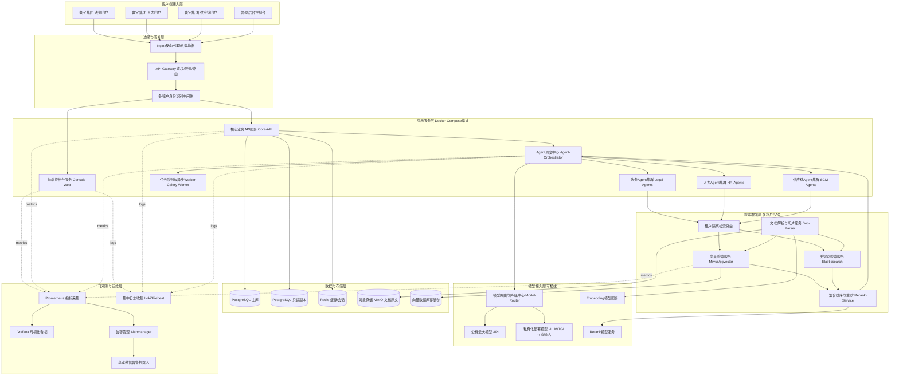
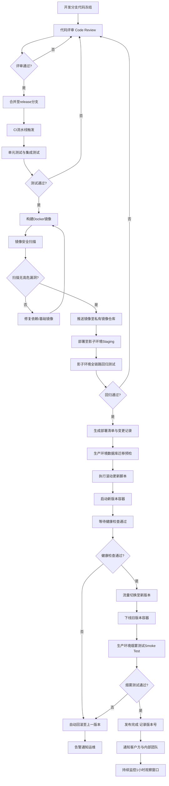

# 第64天:Docker部署上线+演示材料

> 阶段:六阶段·旗舰实战篇 | 冲刺周期:Day59-64 寰宇集团项目冲刺 第6天(收官日)
> 主角:陈铭(核心开发) | 导师:王振宇(老王,技术负责人) | 协作:孙昊(运维工程师)
> 公司:蓬远科技(品牌"蓬远智能") | 产品:苍穹企业级智能体中台 | 客户:寰宇集团

---

## 【旁白】

六天。整整六天,陈铭觉得自己好像活在一个被拉长又压缩的时间管道里。周一晨会上老王把冲刺计划摊在白板上的时候,他心里其实是打鼓的——多租户RAG要落地,三个业务场景的Agent要跑通,性能要压测,成本要优化,现在轮到最后一天,要把这一切装进容器里,稳稳地立在寰宇集团的生产环境上,然后还要拿出一份能让甲方验收组眼睛一亮的演示材料。这中间任何一个环节掉链子,前面五天的努力都可能打折。

陈铭记得孙昊昨晚在群里发的那句话:"明天上线,我把老陈的酒都戒了,就等这一杯。"孙昊是那种典型的运维老兵,话不多,但每次开口都是干货——资源配额算得比谁都精,健康检查写得比谁都严实。陈铭知道,今天这一天,自己是主角,但真正扛住生产环境这道关的,是孙昊那套近乎偏执的容器编排纪律。

他打开电脑,先看了眼监控面板,昨晚压测留下的曲线还挂在那儿,像是一份等待被最终验证的成绩单。会议室里,老王已经把项目周期表贴在墙上,64这个数字被他用红笔圈了两圈。陈铭知道,这不是终点,这是通往终点前最后一道闸门——过了这道闸门,明天就是寰宇集团项目的终审答辩,是这六天冲刺、也是这整个阶段所有心血的最终检验。他给自己倒了杯浓茶,把笔记本电脑往前推了推,深吸一口气,对着屏幕上还没提交的 `docker-compose.yml` 文件,敲下了今天的第一行配置。

---

## 晨会纪要

**时间**:Day64 09:00-09:35
**地点**:蓬远科技 三楼作战室
**参会人**:王振宇(技术负责人)、陈铭(核心开发)、孙昊(运维工程师)、林悦(产品经理,线上参会)、周娜(测试负责人)

**老王开场**:

"昨天性能和成本那一仗,大家打得不错,压测报告我看了,P95响应时间压到了1.8秒以内,单租户月度推理成本降了37%。今天是冲刺最后一天,咱们要做两件事,一件是让代码真正'活'在生产环境里,另一件是让明天验收组的人一看就明白咱们做了什么、做得多好。这两件事同等重要,别觉得写文档、写演示脚本是'软任务'就可以糊弄,验收这一关,很多时候拼的就是呈现。"

**孙昊汇报**:

"我这边昨晚已经把生产环境的物理资源盘了一遍。寰宇给咱们分配的是三台8核32G的云主机,做成一个小的Swarm集群,或者直接用Docker Compose做单机多容器编排——考虑到咱们目前的规模,我建议先用Compose把服务稳定跑起来,后续有扩容需求再上K8s,别在验收前一天冒险换编排引擎。今天上午我主导把最终版的docker-compose文件定下来,重点是三块:资源限制(memory limit和cpu限制,防止某个租户的重查询把整机拖死)、健康检查(liveness和readiness两层)、滚动更新策略(用compose的update_config模拟,配合脚本做蓝绿切换)。这几块昨天已经有草稿,今天要打磨到能直接上生产的程度。"

**陈铭汇报**:

"我这边配合孙昊把容器化的收尾工作做完,然后下午主要精力放在演示材料上——演示脚本我打算按照法务场景、人力场景、供应链场景三条线来设计,每条线准备3到5个典型问答,覆盖从简单检索到复杂多跳推理、多Agent协作的不同难度。项目文档这块,我会把这六天以及之前几个阶段的技术方案、架构决策、性能报告汇总成一份完整的交付文档。"

**林悦补充**:

"验收组那边我了解了一下,寰宇集团这次派了法务部的赵总监、人力资源的钱经理,还有供应链的一个副总,加上他们的IT负责人。这几个人风格不太一样,法务的赵总监比较严谨,喜欢挑边界条件和异常情况问;人力的钱经理更关注实际操作体验,会现场提问题看系统怎么答;供应链那个副总是技术背景出身,可能会问架构和成本的问题。演示脚本设计的时候要把这些风格差异考虑进去,别搞成一套模板念到底。"

**周娜补充**:

"测试这边今天主要是配合上线做最后一轮回归,加上验证滚动更新和健康检查是否会导致请求丢失。另外我建议演示脚本里的问答案例,都提前跑一遍实际验证,别出现演示现场翻车的情况,这个我可以帮忙做交叉验证。"

**老王总结**:

"分工明确。孙昊上午带着陈铭把生产部署方案锤死,中午之前必须完成上线,给下午留出充分的演示准备和联调时间。下午陈铭主写演示脚本和项目文档,周娜交叉验证案例的正确性,林悦从客户视角把关演示的叙事逻辑。今晚咱们所有人留一个小时,把整个演示材料跑一遍彩排。明天就是终审答辩,今天必须万无一失。"

---

## 需求文档

### 一、部署上线检查清单(Production Deployment Checklist)

**1. 基础设施与资源**

- [ ] 三台生产服务器(8核32G)完成基础环境初始化:Docker Engine版本、Docker Compose版本、时区、NTP同步、内核参数(vm.max_map_count等,向量数据库需要)已核对一致。
- [ ] 生产环境网络规划完成:内部服务网络(bridge网络)与对外暴露端口(仅Nginx反向代理80/443对外)隔离明确。
- [ ] 数据卷规划完成:向量数据库数据、关系型数据库数据、对象存储数据、日志数据分别挂载到独立的持久化卷,并纳入每日备份计划。
- [ ] 域名、SSL证书(生产环境使用寰宇集团自有域名,证书由客户IT提供或使用Let's Encrypt自动续期)配置完成。
- [ ] 生产环境的所有密钥(数据库密码、模型API Key、JWT签名密钥)从`.env`文件迁移至独立的secrets管理(Docker secrets或Vault),不允许硬编码或明文提交到仓库。

**2. 容器编排配置**

- [ ] 每个服务的`resources.limits`(CPU、内存上限)与`resources.reservations`(资源预留)均已根据压测结果设定,防止单一服务耗尽主机资源。
- [ ] 每个服务均配置`healthcheck`(容器级健康检查),网关层配置面向业务的深度健康检查接口(检查数据库连通性、向量库连通性、模型服务可用性)。
- [ ] 服务重启策略统一为`restart: unless-stopped`,关键服务(网关、核心Agent调度器)额外配置`depends_on`的`condition: service_healthy`,避免依赖服务未就绪时提前启动。
- [ ] 滚动更新策略明确:先起新版本容器并等待健康检查通过,再切流量,最后下线旧容器,全程业务不中断(或中断时间控制在秒级)。
- [ ] 日志收集统一配置为JSON格式输出,通过日志驱动收集到集中的日志目录,并设置日志轮转(单文件不超过20MB,最多保留5个历史文件),防止磁盘被日志占满。

**3. 安全与合规**

- [ ] 所有容器均以非root用户运行(在Dockerfile中显式指定`USER`)。
- [ ] 数据库、向量库、消息队列等内部服务不对外暴露端口,仅在内部网络中被访问。
- [ ] 多租户数据隔离在生产环境中做最后一轮验证:租户A的会话、文档、向量索引不能被租户B以任何路径访问到。
- [ ] 敏感字段(身份证号、薪资、合同金额等)的脱敏和审计日志功能在生产环境验证一遍。
- [ ] 生产环境访问权限收敛:仅运维和核心开发人员持有生产服务器SSH密钥,操作记录留痕。

**4. 可观测性**

- [ ] Prometheus指标采集(容器资源使用率、接口QPS、响应延迟、Token消耗量)接入生产环境。
- [ ] Grafana看板搭建完成,至少包含:系统资源总览、业务QPS与延迟、Agent调用链路耗时分布、错误率告警。
- [ ] 告警规则配置完成(内存使用率超过85%、接口错误率超过5%、健康检查连续失败3次触发告警),告警渠道打通企业微信群。

**5. 灰度与回滚**

- [ ] 灰度发布方案明确:先在影子环境(与生产隔离的镜像环境)完整走一遍全部业务流程,再切到生产。
- [ ] 回滚脚本准备完毕并演练一次:任意一次发布出现严重问题,能在5分钟内回滚到上一个稳定版本。
- [ ] 数据库变更(如有schema变更)配套回滚SQL或迁移工具的降级脚本。

### 二、演示材料要求(Demo Material Requirements)

**1. 演示脚本要求**

- 演示脚本必须覆盖法务、人力、供应链三大业务场景,每个场景设计3-5个典型问答,问答难度要有梯度:从单文档检索问答,到跨文档多跳推理,再到需要多个Agent协作(如检索Agent+计算Agent+审核Agent联动)才能完成的复合任务。
- 每个问答案例需明确写出:提问原文、系统预期回答要点、涉及的技术能力说明(便于讲解时向客户"翻译"技术亮点)、以及该案例设计的业务价值说明(为什么这个案例能体现产品对寰宇集团的实际价值)。
- 演示过程中需要有清晰的场景切换叙事,不能让客户觉得三个场景是孤立堆砌的功能点,而要体现"苍穹中台"作为统一底座支撑多业务场景的能力。
- 演示脚本要预留"即兴提问"环节的应对策略,即客户现场提出脚本外的问题时,系统应能给出合理回答或至少给出得体的兜底话术,不能出现明显的答非所问或报错。

**2. 项目文档要求**

- 技术架构文档:包含系统整体架构图、多租户设计方案、RAG检索链路设计、多Agent协作机制、模型接入方案(公有云模型+私有化模型可选切换)。
- 部署运维文档:包含部署步骤、环境要求、监控告警配置、日常运维操作手册(如何扩容、如何查日志、如何处理常见故障)。
- 性能与成本报告:汇总六天冲刺中的压测数据、优化前后对比、月度运营成本估算。
- 验收对照表:逐条对照寰宇集团在项目立项时提出的功能与非功能需求,标注每一条的完成状态和验证方式,方便验收组逐条打钩确认。

**3. 录屏材料要求(以文字化演示脚本呈现)**

- 由于当前环境不具备实际录屏条件,采用"文字化演示脚本"的方式还原完整的演示过程,包括每一步的操作说明、系统界面预期展示内容、旁白解说词,确保任何一位团队成员拿到脚本都能复现一致的演示效果。
- 演示脚本按时间线组织,标注每个环节的预计耗时,总演示时长控制在25-30分钟以内(留出15分钟问答时间,符合验收会议1小时的整体安排)。

---

## 架构设计图(寰宇集团项目最终完整部署架构总览)



**架构说明**(供讲解时使用):整套系统在Docker Compose编排下,自下而上分为存储层、模型接入层、检索增强层、应用服务层、网关接入层和可观测运维层六个层次。法务、人力、供应链三大场景在应用服务层各自拥有独立的Agent集群,但共享同一套多租户RAG检索底座和模型路由中心,这正是"苍穹中台"区别于单点场景工具的核心设计——业务在上层分化,能力在下层复用。模型接入层预留了私有化模型接入的开关,寰宇集团如果出于数据安全考虑需要将模型部署在自己的机房,只需要切换Model-Router的路由目标,业务层代码无需改动。

---

## 流程图(从最终代码到生产环境部署上线的完整发布流程)



---

## 示意图(演示脚本场景编排示意)

```mermaid
flowchart LR
    subgraph 开场
        O1[开场白:苍穹中台整体价值介绍] --> O2[登录管理后台展示多租户视图]
    end

    subgraph 场景一 法务场景
        L1[问题1:合同条款检索] --> L2[问题2:跨合同风险比对]
        L2 --> L3[问题3:法规变更影响分析]
        L3 --> L4[问题4:多Agent协作生成审查意见]
    end

    subgraph 场景二 人力场景
        H1[问题1:员工手册政策问答] --> H2[问题2:入职流程个性化引导]
        H2 --> H3[问题3:跨部门人事数据统计]
        H3 --> H4[问题4:绩效异常预警多Agent联动]
    end

    subgraph 场景三 供应链场景
        C1[问题1:供应商资质检索] --> C2[问题2:库存风险预测]
        C2 --> C3[问题3:多供应商比价分析]
        C3 --> C4[问题4:采购异常多Agent审核]
        C4 --> C5[问题5:端到端流程自动生成采购建议]
    end

    subgraph 收尾
        E1[架构与成本亮点回顾] --> E2[客户自由提问环节]
        E2 --> E3[Q&A兜底应对]
    end

    O2 --> L1
    L4 --> H1
    H4 --> C1
    C5 --> E1
```



**编排说明**:三大场景按照"由简到繁、由单一到协同"的逻辑串联,法务场景收尾时用多Agent协作案例作为过渡,自然引出人力场景同样具备的多Agent能力,人力场景收尾再引出供应链场景更复杂的端到端自动化能力,让客户感受到能力是层层递进、贯穿始终的,而不是三个孤立的Demo拼盘。

---

## 课堂笔记

### 上午:最终容器化部署上线

上午九点四十,晨会散场,孙昊直接把投影切到他自己的终端,屏幕上是三台生产服务器的资源监控面板。他先没急着写代码,而是把这六天里陆陆续续攒下的容器编排问题清单念了一遍:内存超限被OOM Killer干掉过两次,一次是向量库批量导入的时候;健康检查写得太简单,只检查了进程是否存活,没检查依赖的数据库连接是否正常,结果有一次数据库连接池打满,容器"看起来是健康的"但实际上所有请求都在超时;滚动更新脚本第一版是先杀旧容器再起新容器,导致业务有大概40秒的中断窗口,寰宇那边如果在这个窗口发起请求会直接拿到连接拒绝。

"今天要把这几个坑全部填平,一个都不能留到验收现场。"孙昊说。

**1. 生产环境资源限制配置**

孙昊先从资源限制讲起。他打开一份表格,上面记录了六天压测积累下来的各服务资源消耗数据:

- Core-API服务:平均内存占用420MB,峰值(高并发场景下)可达900MB,CPU平均占用0.3核,峰值1.2核。
- Agent-Orchestrator调度中心:平均内存600MB,峰值1.5GB(因为要在内存里维护多个Agent的会话上下文和中间推理状态),CPU平均0.5核,峰值2核。
- 检索服务(向量检索+关键词检索+重排):这是资源消耗最大的模块,平均内存1.2GB,峰值2.8GB,CPU平均1核,峰值3核以上,尤其是重排模型做批量推理的时候CPU会打满。
- PostgreSQL数据库:平均内存800MB,峰值2GB,这个还好控制,主要靠调整`shared_buffers`等参数。
- Redis:内存占用比较稳定,平均300MB,峰值600MB(会话数据量大的时候)。

"你看这个数据,"孙昊指着屏幕对陈铭说,"如果不给资源限制,理论上任何一个服务都可能在某个瞬间把整机内存吃满,尤其是检索服务,一旦某个租户发起大批量文档解析或者批量向量化的任务,内存曲线是会陡增的。所以我们必须给每个服务都定义`limits`和`reservations`。`reservations`是给编排引擎做调度参考的最低保证,`limits`是硬上限,超过就会被OOM Killer或者CPU节流。"

陈铭问:"那这个上限怎么定,是不是直接按峰值乘个安全系数?"

"不完全是,"孙昊摇头,"要分两种情况。像Core-API这种轻量级服务,峰值和均值差距不大,直接按峰值乘1.3到1.5倍留余量就行,给它512MB到768MB内存足够。但像检索服务,峰值出现的场景是批量导入,这种场景是可以被限流和排队控制的,不应该无限制地让内存跟着任务量涅涨——所以这里我们的策略是给检索服务设定一个合理上限(比如3GB内存、3核CPU),同时在应用层给批量任务加并发控制和队列削峰,把'瞬时峰值'转化成'受控的持续负载',而不是靠堆资源硬顶。这也是为什么我们昨天在成本优化里加了任务队列的原因,今天正好用得上。"

他们最终商定的资源配额表(节选,后面代码实战会有完整版本):

| 服务 | 内存预留 | 内存上限 | CPU预留 | CPU上限 |
|---|---|---|---|---|
| nginx | 64MB | 128MB | 0.1 | 0.5 |
| core-api | 384MB | 768MB | 0.3 | 1.0 |
| agent-orchestrator | 512MB | 1536MB | 0.5 | 2.0 |
| retrieval-service | 1024MB | 3072MB | 1.0 | 3.0 |
| doc-parser-worker | 512MB | 2048MB | 0.5 | 2.0 |
| postgres | 512MB | 2048MB | 0.5 | 1.5 |
| redis | 256MB | 768MB | 0.2 | 0.5 |
| minio | 256MB | 1024MB | 0.2 | 1.0 |

孙昊特别提醒:"三台机器总共32G乘3等于96G内存,咱们现在的配置全部服务上限加起来大概是28G左右,单机部署的话留了充足余量应对突发流量和未来扩容,这个安全边界必须留出来,不能把资源分配打满,一旦打满,机器上任何一点点系统开销的波动都会引发容器被杀。"

**2. 健康检查机制设计**

讲完资源限制,孙昊切换到健康检查的话题,这是他最较真的一块。

"上次那个'容器活着但服务已死'的问题,根源就是我们的健康检查太浅。"他说,"合格的健康检查要分层设计,至少两层:第一层是容器级的存活检查(liveness),只检查进程有没有崩溃、端口有没有在监听,这层检查失败,编排引擎应该重启容器;第二层是业务级的就绪检查(readiness),要真正调用一个轻量级的业务接口,确认这个服务依赖的下游(数据库、缓存、向量库、模型API)都是可达的,这层检查失败,编排引擎应该把这个容器从负载均衡里摘掉,但不一定要重启它,因为问题可能出在下游而不是它自己。"

陈铭追问:"那如果第二层检查一直失败,是不是也应该有个上限,不能无限期摘着不处理?"

"对,这就是第三个维度——健康检查的`retries`和`start_period`参数要配合业务重启策略一起设计。"孙昊说,"我们给Core-API设计的健康检查是这样的:每15秒检查一次,超时5秒算失败,连续失败3次才判定为不健康,同时给一个40秒的`start_period`,也就是容器刚起来的40秒内即便检查失败也不算数,因为服务启动阶段本身要做数据库连接池预热、缓存加载等工作,不能被健康检查误杀。"

他们为几个关键服务分别设计了健康检查接口:

- Core-API:`/health/live`只检查进程状态,`/health/ready`检查数据库连接池状态、Redis连接状态、返回HTTP 200并附带JSON详情。
- Agent-Orchestrator:`/health/ready`除了检查基础依赖,还要检查是否能正常拿到模型路由中心的可用模型列表,如果所有模型都不可用,这个服务实质上等于瘫痪,必须标记为不健康。
- 检索服务:检查向量库连接和ES连接,同时检查一个"最小检索用例"是否能在合理时间内返回结果(不做真实检索,只做一次极小规模的ping式查询)。
- PostgreSQL、Redis、MinIO这类基础组件,使用它们官方提供的健康检查命令(如`pg_isready`、`redis-cli ping`、MinIO自带的`/minio/health/live`接口)。

孙昊在白板上画了个简单的状态转换图,解释健康检查如何驱动滚动更新:"新容器启动 → start_period宽限期 → 开始健康检查 → 连续通过N次视为healthy → 编排脚本检测到healthy状态后才把流量切过去 → 旧容器进入排空(drain)状态,等待现有连接处理完或超时后才终止。"

**3. 滚动更新策略**

滚动更新是上午讨论最激烈的一个环节。孙昊直接把上周那次"40秒中断"的事故复盘拿出来讲。

"上次的问题在哪?"他反问陈铭。

陈铭想了想:"是不是我们的更新脚本是`docker-compose down`再`docker-compose up`,这中间必然有容器完全消失的空档?"

"对,这是最原始也是最粗暴的方式,生产环境绝对不能这么干。"孙昊说,"今天要改成'先启动新容器、等健康检查通过、再切流量、最后才下线旧容器'的模式,这个模式在Docker Compose层面没有Kubernetes那样原生的滚动更新支持,所以需要我们自己写脚本模拟,核心思路是给每个可更新的服务准备两套容器名(比如`core-api-blue`和`core-api-green`),Nginx反向代理的上游列表通过一个可动态修改的配置片段来控制,更新时:

1. 拉取新镜像;
2. 用新镜像启动`green`容器(如果当前生产是blue在跑,就启动green;反之则启动blue),此时blue依然在正常服务;
3. 等待green容器健康检查连续通过;
4. 修改Nginx上游配置,把权重从'blue:100/green:0'逐步调整为'blue:50/green:50'再到'blue:0/green:100',整个过程通过`nginx -s reload`热加载配置,不需要重启Nginx进程,业务连接不受影响;
5. 观察5分钟错误率和延迟指标,确认green版本运行平稳;
6. 停止blue容器,完成本次更新;
7. 如果第5步观察窗口内发现异常,立即把权重切回blue,同时停止green,记录本次失败并触发告警。"

老王中途进来看了一眼,补了一句:"这套蓝绿切流的方案,核心价值是给了我们一个'后悔的机会窗口',观察期设计得好,能在真正影响大面积用户之前发现问题并回退,这比任何测试都更贴近真实生产风险,大家一定要把这个观察窗口的监控指标定义清楚,不能只是'看起来正常'就算过关。"

孙昊补充说明了观察窗口具体盯哪些指标:"HTTP 5xx错误率不能超过1%,P95延迟不能比更新前劣化超过20%,健康检查失败次数为零,容器重启次数为零。这四条任意一条不满足,自动触发回滚脚本。"

**4. 日志收集与可观测性收尾**

聊完滚动更新,时间已经过了十点半,孙昊转向日志这块,这是他觉得"看起来不起眼但验收时最容易被挑毛病"的环节。

"寰宇集团的IT负责人肯定会问日志怎么管理,毕竟涉及到审计要求,尤其法务场景,操作日志必须留存。"孙昊说,"生产环境的日志配置要满足三点:第一,统一格式,全部用JSON结构化输出,方便后续接入ELK或者Loki做检索分析;第二,日志轮转,单个日志文件不能无限增长,要设置最大文件大小和保留份数,不然三个月后磁盘就该报警了;第三,敏感信息脱敏,日志里不能出现完整的身份证号、手机号、合同金额等敏感字段,必须在写日志前做掩码处理。"

陈铭提到一个细节:"上次我们那次数据泄露自查的时候,发现有个调试日志把用户输入的原文整个打出来了,里面刚好有个身份证号,这个问题解决了吗?"

"解决了,"孙昊说,"这次在日志中间件里加了统一的正则脱敏过滤器,凡是匹配身份证号、银行卡号、手机号格式的字符串,在写入日志前会被替换成掩码,今天上午我们会把这个过滤器在生产环境的日志驱动配置里再验证一遍,确保过滤生效。"

**5. 数据卷与持久化备份**

孙昊最后讲了数据持久化和备份策略,这块虽然琐碎,但决定了系统的"生存底线"。

"生产环境有四类数据必须做持久化卷挂载,不能让数据只存在容器内部的临时文件系统里,"孙昊列举道,"第一是PostgreSQL的数据文件目录;第二是向量数据库的索引数据;第三是MinIO对象存储里的原始文档;第四是应用产生的结构化日志文件。这四类数据卷全部挂载到宿主机的独立目录,并且我们配置了每日凌晨两点的自动备份任务,把PostgreSQL做逻辑备份(pg_dump)、向量库做快照备份,备份文件保留最近30天,同时同步一份到异地对象存储做容灾。"

老王在这里追问了一句非常关键的问题:"备份恢复演练过吗?备份文件如果打不开,那等于白备份。"

孙昊坦然回答:"上周做过一次完整恢复演练,从备份文件恢复出一套完整的测试环境,数据一致性校验通过,恢复耗时大概25分钟。这个演练记录我会附在项目文档里,验收时可以作为灾备能力的证明材料。"

**6. 网络与安全隔离收尾确认**

上午最后半小时,孙昊和陈铭一起把网络安全隔离过了一遍清单:内部服务网络(数据库、缓存、向量库、消息队列)全部挂在一个不对外暴露的Docker内部网络里,只有Nginx容器同时挂载内部网络和外部网络作为唯一入口;所有服务间调用使用内部服务名而不是IP地址,方便未来扩容替换;数据库账号权限做了最小化收敛,应用账号不具备DDL权限,只有迁移脚本使用的专用账号才有变更表结构的权限。

十一点二十,孙昊在他的终端上敲下最后一条部署命令,新的生产配置文件全部就位,滚动更新脚本第一次在生产环境完整跑通,业务中断时间从原来的40秒降到了0——因为整个蓝绿切换期间Nginx始终在正常转发流量。他把结果发到群里:"部署上线完成,健康检查全绿,监控面板正常,大家可以开始联调演示环境了。"

陈铭看着监控面板上那条平稳的绿线,松了一口气,但他知道,这只是上半场的收官,下半场——把这套系统"讲清楚、演明白"——才刚要开始。

### 下午:演示材料准备

午饭后,陈铭把会议室的白板擦干净,开始规划演示材料的整体结构。他给自己定的目标很明确:演示脚本要让客户在30分钟内清楚感受到"苍穹中台"三个层面的价值——业务场景真的懂寰宇集团的实际问题、技术能力真的扎实可靠、长期运营真的划算可控。

**1. 演示材料整体规划**

他先画了一张演示材料的构成图挂在白板上:

- 开场介绍(3分钟):快速带过项目背景、整体架构一句话总结,不做技术细节展开,把时间留给场景演示。
- 法务场景演示(6分钟):4个问答案例,从简单到复杂。
- 人力场景演示(6分钟):4个问答案例。
- 供应链场景演示(7分钟):5个问答案例,这个场景问答数量最多,因为供应链业务本身涉及多方协同,能更好体现多Agent协作的技术亮点。
- 架构与成本收尾(3分钟):快速回顾技术架构和成本数据,给客户一个"物有所值"的直观印象。
- 自由问答(15分钟内,不计入正式演示时长)。

林悦下午特意过来一起过了一遍脚本结构,提出一个关键建议:"演示的时候别一上来就讲技术架构,客户里坐着业务方的人,他们对'多租户RAG''Agent调度'这些词是没有直接感知的,建议先用一句话讲清楚'这个系统能帮你做什么',再用场景说话,技术架构留到最后收尾时讲,那时候客户已经被案例'种草'了,反而更愿意听技术细节来验证这套系统是不是真的靠谱,而不是拿着技术名词唬人。"

陈铭觉得这个建议很对,调整了开场白的措辞逻辑,把"苍穹企业级智能体中台是一套基于大模型与检索增强技术构建的多租户智能问答与任务处理系统"这种偏技术化的介绍,改成了更贴近业务语言的表述,把技术细节留在架构收尾环节。

**2. 演示脚本撰写:法务场景**

法务场景是陈铭下午投入精力最多的部分,因为他知道法务出身的赵总监会问得很细。他先梳理了法务业务里典型的问题类型:合同条款检索(找到某个具体条款在哪份合同、哪个位置)、跨合同风险比对(同一供应商的多份合同条款是否存在冲突或漏洞)、法规变更影响分析(某项法规修订后,哪些现有合同可能受影响)、多方协作生成审查意见(检索相关条款+计算违约金额+生成审查建议,需要多个Agent接力完成)。

他为每个问题设计了具体的提问原文、系统预期回答要点、技术能力说明和业务价值说明,四个环节层层递进,分别对应"基础检索能力""跨文档推理能力""法规知识实时性能力""多Agent协作能力"。

在设计第四个问答案例的时候,陈铭和周娜专门坐下来把整个多Agent协作链路走了一遍:客户提问"帮我审查一下寰宇物流与东辰供应商这份合同里的违约条款,评估一下潜在风险",这个问题需要检索Agent先找到具体合同文本,提取违约条款相关段落;然后计算Agent根据条款里的违约金计算规则和当前的履约延迟天数,算出一个具体的违约金金额区间;最后审核Agent把检索结果和计算结果整合,按照法务审查报告的标准格式生成一份简要的风险提示,并标注"建议法务人员进一步核实"的免责提示,避免系统给出的建议被误解为具备法律效力的最终判断。周娜提出一个细节:"这个免责提示必须出现,不然万一现场有人追问'这个算的对不对,能不能直接照着执行',我们要有清楚的边界说明,不能让系统显得'自信过头'。"陈铭把这条要求写进了脚本的旁白说明里。

**3. 演示脚本撰写:人力场景**

人力场景陈铭设计得相对轻快一些,因为人力经理钱经理更关心的是"好不好用",不会深挖技术细节。他设计的四个问答分别是:员工手册政策问答(比如年假规则、报销标准这类高频咨询)、入职流程个性化引导(根据不同岗位、不同城市给出对应的入职材料清单,这里能体现系统结合企业内部制度做个性化生成的能力)、跨部门人事数据统计(比如"过去半年技术部门的离职率是多少,和去年同期比是升还是降",这需要连接结构化数据做统计分析,体现系统不仅能做文本问答,还能做数据查询与分析)、绩效异常预警多Agent联动(系统主动识别某个团队绩效连续两个季度下滑,自动生成一份包含可能原因分析和建议措施的简报,推送给对应的HRBP,这体现系统从"被动问答"到"主动洞察"的能力升级,这是林悦特别强调要突出的一个亮点,因为寰宇集团在需求访谈阶段就明确表达过希望系统具备一定的主动预警能力,而不只是一个"问答机器人")。

陈铭在设计第三个问答案例(跨部门统计)的时候,特意和周娜确认了案例数据的真实性和可复现性,避免演示现场因为底层数据被后续测试覆盖而导致答案对不上。他们约定用一份专门标记为"演示专用"的样例数据集,和日常测试数据集物理隔离,保证演示前的最后一次验证结果和演示当天完全一致。

**4. 演示脚本撰写:供应链场景**

供应链场景是三个场景里技术含量最高、案例数量最多的一块,因为供应链副总是技术背景出身,林悦提前打过招呼说这位副总"喜欢刨根问底"。陈铭设计了五个递进的问答:供应商资质检索(基础检索能力展示)、库存风险预测(结合历史采购和消耗数据做趋势预测,体现系统与业务数据结合的深度)、多供应商比价分析(检索多个供应商的报价文档,自动整理成对比表格,体现结构化信息抽取和归纳能力)、采购异常多Agent审核(某笔采购金额超过历史同类采购均值的某个阈值,系统自动触发审核流程,检索Agent找历史对比数据,风险Agent评估异常程度,审核Agent生成审核意见并附上需要人工复核的标记)、端到端流程自动生成采购建议(这是压轴案例,系统综合库存水位、供应商交付周期、历史价格波动,自动生成一份包含"建议采购数量、建议供应商、预计到货时间、预算金额"的采购建议单,体现系统从检索问答到生成决策辅助材料的完整能力闭环)。

陈铭在写第五个案例的旁白解说词时,特别用心地打磨了措辞,他想让这段演示成为整场演示的"高光时刻"。他写道:"这个案例展示的不是一次简单问答,而是苍穹中台把检索、推理、计算、生成四种能力串联成一个完整的业务决策辅助流程,过去这个流程可能需要采购专员花上半天时间在多个系统里翻资料、做表格、写报告,现在系统可以在几十秒内给出一份可供参考的初稿,大幅压缩了信息整合的时间成本,把人力真正解放到更需要专业判断的决策环节。"

**5. 演示脚本的过渡与叙事设计**

林悦下午又提了一个建议:三个场景之间的过渡语,要体现"底层能力是共通的,只是应用场景不同"这个核心叙事。陈铭据此写了三段过渡词,比如从法务场景过渡到人力场景时的解说词是:"刚才我们看到的检索、比对、多Agent协作能力,并不是法务场景专属的定制功能,而是苍穹中台底层能力的一次具体应用。接下来我们切换到人力场景,大家可以留意,同样的检索能力、同样的多Agent协作机制,在完全不同的业务语境下,依然能够准确地服务不同的需求,这正是'中台'这个词的含义所在——一次建设,多场景复用。"

**6. 项目文档撰写**

写完演示脚本,陈铭开始整理项目文档。他把文档拆成四个部分:技术架构文档、部署运维文档、性能与成本报告、验收对照表。

技术架构文档他直接复用了今天上午定稿的架构图和流程图,补充了文字说明,详细解释了多租户设计的三层隔离机制(数据库层的租户ID字段隔离、向量库层的独立collection隔离、应用层的鉴权中间件强制校验),以及模型接入层如何通过统一的路由中心实现"公有云模型优先、私有化模型可选切换、故障自动降级"的策略。他还特别写了一段关于Agent协作机制的说明,解释调度中心如何根据任务类型动态选择需要调用的Agent组合,以及Agent之间如何通过统一的消息协议传递中间结果,避免每加一个新场景就要重新设计一套协作逻辑。

部署运维文档他和孙昊一起完成,孙昊提供了详细的部署步骤截图描述(虽然没有真实截图,但用文字详细描述了每一步命令执行后的预期输出,方便客户IT团队日后自行运维或者接手时参考)、常见故障排查手册(比如"如果健康检查一直失败该怎么排查""如果磁盘空间告警该怎么清理日志""如果需要扩容某个服务该怎么调整资源限制并重新部署")。

性能与成本报告陈铭汇总了六天冲刺以来每一天的关键数据变化,尤其是Day63那天的压测报告和成本优化数据,用图表(用文字描述的表格形式呈现)展示了优化前后的对比:P95响应时间从3.2秒降到1.8秒,单租户月度平均推理成本从优化前的预估值降低了37%,并发承载能力从优化前的每秒80请求提升到每秒150请求以上。

验收对照表是林悦最看重的一份文档,她要求逐条列出寰宇集团在立项阶段提出的所有功能性和非功能性需求条目,标注"已完成""部分完成""待后续迭代"三种状态,并附上对应的验证方式说明(比如某条需求对应哪个演示案例可以现场验证,或者对应压测报告里的哪个数据指标)。陈铭用了将近一个小时把这份对照表逐条核对完,确保没有遗漏任何一条客户在需求阶段提出过的诉求,也没有夸大任何一条完成程度。

**7. 录屏材料的文字化描述**

由于当前不具备实际录屏条件,陈铭把演示脚本进一步细化成"分镜脚本"的形式,每一步都标注操作说明、预期界面展示内容、旁白解说词三部分,确保任何一个团队成员即便没有参与过项目开发,也能照着这份脚本完整复现一次演示,不会因为讲解人不同而导致演示效果的巨大差异。他还在脚本开头加了一段"演示前检查清单",提醒演示当天要提前登录系统预热一次(避免冷启动导致首次响应偏慢)、提前清空浏览器缓存、提前确认网络环境稳定、准备好备用的截图或录屏(如果现场网络出现意外问题,可以用提前准备好的素材兜底)。

**8. 傍晚彩排**

下午六点,团队按照老王的要求聚在会议室做了一次完整彩排。陈铭按照脚本一步步演示,周娜在旁边逐条核对答案是否和脚本预期一致,林悦扮演"挑剔的客户"提了几个脚本外的问题——比如她突然问"如果两份合同的违约条款互相矛盾,系统会怎么处理",这个问题不在原脚本的四个案例里,陈铭现场调用系统,系统检索到两份合同后,准确识别出条款存在数值差异,并在回答中明确提示"检测到两份文件中的违约金计算方式存在差异,建议人工进一先核实以更新版本合同为准",这个回答让林悦点头认可,老王在旁边也松了口气:"这就是我们要的效果,即便是脚本外的问题,只要系统的检索和推理能力是真实扎实的,就不会翻车,这比死记硬背一套问答脚本更重要。"

彩排结束,已经快七点,孙昊在群里发了最后一条部署状态报告:三台生产服务器资源使用率平稳,滚动更新验证通过,监控告警全部正常,备份任务已配置完毕。陈铭把演示脚本和项目文档的最终版本发到项目群里,老王回复了一句:"明天见真章,大家早点休息,状态调整好。"

---

## 代码实战

> 说明:以下为生产环境最终版部署配置、部署上线脚本、以及演示用示例问答脚本(法务/人力/供应链三大场景各3-5个问题及预期回答)。为便于生产环境直接复用,配置项均写全,注释详实。

### 一、生产环境最终版 docker-compose.yml(含资源限制、健康检查、日志收集配置)

```yaml
# ============================================================
# 苍穹企业级智能体中台 - 生产环境部署配置(最终版)
# 客户:寰宇集团  |  版本:v1.0.0-release  |  维护:蓬远科技运维组
# 说明:本文件为生产环境唯一权威部署配置,任何变更需经过CR并同步至运维手册
# ============================================================

version: "3.9"

x-logging: &default-logging
  driver: "json-file"
  options:
    max-size: "20m"
    max-file: "5"
    tag: "{{.Name}}/{{.ID}}"

x-restart-policy: &default-restart
  restart: unless-stopped

networks:
  frontend-net:
    driver: bridge
    ipam:
      config:
        - subnet: 172.28.0.0/24
  backend-net:
    driver: bridge
    internal: true
    ipam:
      config:
        - subnet: 172.28.1.0/24
  data-net:
    driver: bridge
    internal: true
    ipam:
      config:
        - subnet: 172.28.2.0/24

volumes:
  postgres-data:
    driver: local
    driver_opts:
      type: none
      device: /data/pengyuan/postgres
      o: bind
  postgres-wal-archive:
    driver: local
    driver_opts:
      type: none
      device: /data/pengyuan/postgres-wal
      o: bind
  redis-data:
    driver: local
    driver_opts:
      type: none
      device: /data/pengyuan/redis
      o: bind
  minio-data:
    driver: local
    driver_opts:
      type: none
      device: /data/pengyuan/minio
      o: bind
  vector-db-data:
    driver: local
    driver_opts:
      type: none
      device: /data/pengyuan/vectordb
      o: bind
  app-logs:
    driver: local
    driver_opts:
      type: none
      device: /data/pengyuan/logs
      o: bind
  prometheus-data:
    driver: local
  grafana-data:
    driver: local
  loki-data:
    driver: local

secrets:
  postgres_password:
    file: ./secrets/postgres_password.txt
  redis_password:
    file: ./secrets/redis_password.txt
  jwt_signing_key:
    file: ./secrets/jwt_signing_key.txt
  model_api_key:
    file: ./secrets/model_api_key.txt
  minio_root_password:
    file: ./secrets/minio_root_password.txt

services:

  # -----------------------------------------------------------
  # 反向代理 / 负载均衡 / 蓝绿流量切换入口
  # -----------------------------------------------------------
  nginx:
    image: nginx:1.25.4-alpine
    container_name: cangqiong-nginx
    <<: *default-restart
    networks:
      - frontend-net
      - backend-net
    ports:
      - "80:80"
      - "443:443"
    volumes:
      - ./nginx/nginx.conf:/etc/nginx/nginx.conf:ro
      - ./nginx/conf.d:/etc/nginx/conf.d:ro
      - ./nginx/upstream.d:/etc/nginx/upstream.d:ro
      - ./certs:/etc/nginx/certs:ro
      - app-logs:/var/log/nginx
    depends_on:
      core-api-blue:
        condition: service_healthy
    healthcheck:
      test: ["CMD", "wget", "--spider", "-q", "http://127.0.0.1/nginx-health"]
      interval: 15s
      timeout: 5s
      retries: 3
      start_period: 10s
    deploy:
      resources:
        limits:
          cpus: "0.5"
          memory: 128M
        reservations:
          cpus: "0.1"
          memory: 64M
    logging: *default-logging

  # -----------------------------------------------------------
  # 核心业务API服务 - Blue通道(蓝绿部署双通道之一)
  # -----------------------------------------------------------
  core-api-blue:
    image: registry.pengyuan.internal/cangqiong/core-api:1.0.0
    container_name: cangqiong-core-api-blue
    <<: *default-restart
    networks:
      - backend-net
      - data-net
    environment:
      - APP_ENV=production
      - SERVICE_COLOR=blue
      - DB_HOST=postgres-primary
      - DB_PORT=5432
      - DB_NAME=cangqiong_prod
      - DB_USER=cangqiong_app
      - REDIS_HOST=redis
      - REDIS_PORT=6379
      - LOG_FORMAT=json
      - LOG_LEVEL=info
      - LOG_MASK_SENSITIVE=true
      - TZ=Asia/Shanghai
    secrets:
      - postgres_password
      - redis_password
      - jwt_signing_key
    depends_on:
      postgres-primary:
        condition: service_healthy
      redis:
        condition: service_healthy
    healthcheck:
      test: ["CMD", "curl", "-f", "http://127.0.0.1:8080/health/ready"]
      interval: 15s
      timeout: 5s
      retries: 3
      start_period: 40s
    deploy:
      resources:
        limits:
          cpus: "1.0"
          memory: 768M
        reservations:
          cpus: "0.3"
          memory: 384M
    logging: *default-logging

  # -----------------------------------------------------------
  # 核心业务API服务 - Green通道(蓝绿部署双通道之二,滚动更新时启用)
  # -----------------------------------------------------------
  core-api-green:
    image: registry.pengyuan.internal/cangqiong/core-api:1.0.0
    container_name: cangqiong-core-api-green
    profiles: ["rollout"]
    networks:
      - backend-net
      - data-net
    environment:
      - APP_ENV=production
      - SERVICE_COLOR=green
      - DB_HOST=postgres-primary
      - DB_PORT=5432
      - DB_NAME=cangqiong_prod
      - DB_USER=cangqiong_app
      - REDIS_HOST=redis
      - REDIS_PORT=6379
      - LOG_FORMAT=json
      - LOG_LEVEL=info
      - LOG_MASK_SENSITIVE=true
      - TZ=Asia/Shanghai
    secrets:
      - postgres_password
      - redis_password
      - jwt_signing_key
    depends_on:
      postgres-primary:
        condition: service_healthy
      redis:
        condition: service_healthy
    healthcheck:
      test: ["CMD", "curl", "-f", "http://127.0.0.1:8080/health/ready"]
      interval: 15s
      timeout: 5s
      retries: 3
      start_period: 40s
    deploy:
      resources:
        limits:
          cpus: "1.0"
          memory: 768M
        reservations:
          cpus: "0.3"
          memory: 384M
    logging: *default-logging

  # -----------------------------------------------------------
  # Agent调度中心
  # -----------------------------------------------------------
  agent-orchestrator:
    image: registry.pengyuan.internal/cangqiong/agent-orchestrator:1.0.0
    container_name: cangqiong-agent-orchestrator
    <<: *default-restart
    networks:
      - backend-net
      - data-net
    environment:
      - APP_ENV=production
      - MODEL_ROUTER_URL=http://model-router:9000
      - REDIS_HOST=redis
      - MAX_CONCURRENT_SESSIONS=200
      - AGENT_TIMEOUT_SECONDS=45
      - LOG_FORMAT=json
      - TZ=Asia/Shanghai
    secrets:
      - redis_password
      - model_api_key
    depends_on:
      redis:
        condition: service_healthy
      model-router:
        condition: service_healthy
    healthcheck:
      test: ["CMD", "curl", "-f", "http://127.0.0.1:8090/health/ready"]
      interval: 15s
      timeout: 5s
      retries: 3
      start_period: 40s
    deploy:
      resources:
        limits:
          cpus: "2.0"
          memory: 1536M
        reservations:
          cpus: "0.5"
          memory: 512M
    logging: *default-logging

  # -----------------------------------------------------------
  # 法务Agent集群
  # -----------------------------------------------------------
  legal-agents:
    image: registry.pengyuan.internal/cangqiong/legal-agents:1.0.0
    container_name: cangqiong-legal-agents
    <<: *default-restart
    networks:
      - backend-net
      - data-net
    environment:
      - APP_ENV=production
      - TENANT_SCOPE=legal
      - RETRIEVAL_SERVICE_URL=http://retrieval-service:8100
      - LOG_FORMAT=json
      - TZ=Asia/Shanghai
    depends_on:
      retrieval-service:
        condition: service_healthy
    healthcheck:
      test: ["CMD", "curl", "-f", "http://127.0.0.1:8210/health/ready"]
      interval: 20s
      timeout: 5s
      retries: 3
      start_period: 30s
    deploy:
      resources:
        limits:
          cpus: "1.0"
          memory: 1024M
        reservations:
          cpus: "0.3"
          memory: 384M
    logging: *default-logging

  # -----------------------------------------------------------
  # 人力Agent集群
  # -----------------------------------------------------------
  hr-agents:
    image: registry.pengyuan.internal/cangqiong/hr-agents:1.0.0
    container_name: cangqiong-hr-agents
    <<: *default-restart
    networks:
      - backend-net
      - data-net
    environment:
      - APP_ENV=production
      - TENANT_SCOPE=hr
      - RETRIEVAL_SERVICE_URL=http://retrieval-service:8100
      - LOG_FORMAT=json
      - TZ=Asia/Shanghai
    depends_on:
      retrieval-service:
        condition: service_healthy
    healthcheck:
      test: ["CMD", "curl", "-f", "http://127.0.0.1:8220/health/ready"]
      interval: 20s
      timeout: 5s
      retries: 3
      start_period: 30s
    deploy:
      resources:
        limits:
          cpus: "1.0"
          memory: 1024M
        reservations:
          cpus: "0.3"
          memory: 384M
    logging: *default-logging

  # -----------------------------------------------------------
  # 供应链Agent集群
  # -----------------------------------------------------------
  scm-agents:
    image: registry.pengyuan.internal/cangqiong/scm-agents:1.0.0
    container_name: cangqiong-scm-agents
    <<: *default-restart
    networks:
      - backend-net
      - data-net
    environment:
      - APP_ENV=production
      - TENANT_SCOPE=scm
      - RETRIEVAL_SERVICE_URL=http://retrieval-service:8100
      - LOG_FORMAT=json
      - TZ=Asia/Shanghai
    depends_on:
      retrieval-service:
        condition: service_healthy
    healthcheck:
      test: ["CMD", "curl", "-f", "http://127.0.0.1:8230/health/ready"]
      interval: 20s
      timeout: 5s
      retries: 3
      start_period: 30s
    deploy:
      resources:
        limits:
          cpus: "1.2"
          memory: 1280M
        reservations:
          cpus: "0.4"
          memory: 512M
    logging: *default-logging

  # -----------------------------------------------------------
  # 异步任务队列 Worker(文档解析/批量向量化/定时报告)
  # -----------------------------------------------------------
  celery-worker:
    image: registry.pengyuan.internal/cangqiong/celery-worker:1.0.0
    container_name: cangqiong-celery-worker
    <<: *default-restart
    networks:
      - backend-net
      - data-net
    environment:
      - APP_ENV=production
      - CELERY_BROKER_URL=redis://redis:6379/2
      - CELERY_CONCURRENCY=4
      - LOG_FORMAT=json
      - TZ=Asia/Shanghai
    secrets:
      - redis_password
    depends_on:
      redis:
        condition: service_healthy
    healthcheck:
      test: ["CMD", "celery", "-A", "worker", "inspect", "ping", "-d", "celery@$$HOSTNAME"]
      interval: 30s
      timeout: 10s
      retries: 3
      start_period: 30s
    deploy:
      resources:
        limits:
          cpus: "2.0"
          memory: 2048M
        reservations:
          cpus: "0.5"
          memory: 512M
    logging: *default-logging

  # -----------------------------------------------------------
  # 文档解析服务
  # -----------------------------------------------------------
  doc-parser:
    image: registry.pengyuan.internal/cangqiong/doc-parser:1.0.0
    container_name: cangqiong-doc-parser
    <<: *default-restart
    networks:
      - backend-net
      - data-net
    environment:
      - APP_ENV=production
      - MINIO_ENDPOINT=minio:9000
      - LOG_FORMAT=json
      - TZ=Asia/Shanghai
    secrets:
      - minio_root_password
    depends_on:
      minio:
        condition: service_healthy
    healthcheck:
      test: ["CMD", "curl", "-f", "http://127.0.0.1:8300/health/ready"]
      interval: 20s
      timeout: 5s
      retries: 3
      start_period: 30s
    deploy:
      resources:
        limits:
          cpus: "2.0"
          memory: 2048M
        reservations:
          cpus: "0.5"
          memory: 512M
    logging: *default-logging

  # -----------------------------------------------------------
  # 检索服务(向量检索 + 关键词检索 + 混合重排)
  # -----------------------------------------------------------
  retrieval-service:
    image: registry.pengyuan.internal/cangqiong/retrieval-service:1.0.0
    container_name: cangqiong-retrieval-service
    <<: *default-restart
    networks:
      - backend-net
      - data-net
    environment:
      - APP_ENV=production
      - VECTOR_DB_HOST=vector-db
      - VECTOR_DB_PORT=19530
      - ES_HOST=elasticsearch
      - ES_PORT=9200
      - RERANK_SERVICE_URL=http://rerank-service:8400
      - RETRIEVAL_TOP_K=50
      - RERANK_TOP_N=8
      - LOG_FORMAT=json
      - TZ=Asia/Shanghai
    depends_on:
      vector-db:
        condition: service_healthy
      elasticsearch:
        condition: service_healthy
    healthcheck:
      test: ["CMD", "curl", "-f", "http://127.0.0.1:8100/health/ready"]
      interval: 15s
      timeout: 5s
      retries: 3
      start_period: 45s
    deploy:
      resources:
        limits:
          cpus: "3.0"
          memory: 3072M
        reservations:
          cpus: "1.0"
          memory: 1024M
    logging: *default-logging

  # -----------------------------------------------------------
  # 重排模型服务
  # -----------------------------------------------------------
  rerank-service:
    image: registry.pengyuan.internal/cangqiong/rerank-service:1.0.0
    container_name: cangqiong-rerank-service
    <<: *default-restart
    networks:
      - backend-net
    environment:
      - APP_ENV=production
      - MODEL_NAME=bge-reranker-v2-m3
      - MAX_BATCH_SIZE=32
      - LOG_FORMAT=json
      - TZ=Asia/Shanghai
    healthcheck:
      test: ["CMD", "curl", "-f", "http://127.0.0.1:8400/health/ready"]
      interval: 20s
      timeout: 5s
      retries: 3
      start_period: 60s
    deploy:
      resources:
        limits:
          cpus: "2.0"
          memory: 2048M
        reservations:
          cpus: "0.5"
          memory: 1024M
    logging: *default-logging

  # -----------------------------------------------------------
  # 模型路由与降级中心(公有云模型 <-> 私有化模型切换)
  # -----------------------------------------------------------
  model-router:
    image: registry.pengyuan.internal/cangqiong/model-router:1.0.0
    container_name: cangqiong-model-router
    <<: *default-restart
    networks:
      - backend-net
    environment:
      - APP_ENV=production
      - PRIMARY_PROVIDER=public-cloud
      - FALLBACK_PROVIDER=private-vllm
      - PRIVATE_MODEL_ENDPOINT=http://private-model-vllm:8000
      - CIRCUIT_BREAKER_THRESHOLD=5
      - CIRCUIT_BREAKER_COOLDOWN_SECONDS=60
      - LOG_FORMAT=json
      - TZ=Asia/Shanghai
    secrets:
      - model_api_key
    healthcheck:
      test: ["CMD", "curl", "-f", "http://127.0.0.1:9000/health/ready"]
      interval: 15s
      timeout: 5s
      retries: 3
      start_period: 20s
    deploy:
      resources:
        limits:
          cpus: "0.5"
          memory: 512M
        reservations:
          cpus: "0.1"
          memory: 128M
    logging: *default-logging

  # -----------------------------------------------------------
  # 私有化部署模型(可选接入,默认关闭,通过profile启用)
  # -----------------------------------------------------------
  private-model-vllm:
    image: registry.pengyuan.internal/cangqiong/vllm-runtime:0.6.2
    container_name: cangqiong-private-model
    profiles: ["private-model"]
    networks:
      - backend-net
    environment:
      - MODEL_PATH=/models/qwen2.5-14b-instruct
      - TENSOR_PARALLEL_SIZE=1
      - GPU_MEMORY_UTILIZATION=0.85
      - TZ=Asia/Shanghai
    volumes:
      - /data/pengyuan/models:/models:ro
    healthcheck:
      test: ["CMD", "curl", "-f", "http://127.0.0.1:8000/health"]
      interval: 30s
      timeout: 10s
      retries: 3
      start_period: 120s
    deploy:
      resources:
        limits:
          memory: 24576M
        reservations:
          memory: 8192M
    logging: *default-logging

  # -----------------------------------------------------------
  # 前端控制台服务
  # -----------------------------------------------------------
  console-web:
    image: registry.pengyuan.internal/cangqiong/console-web:1.0.0
    container_name: cangqiong-console-web
    <<: *default-restart
    networks:
      - frontend-net
      - backend-net
    environment:
      - NODE_ENV=production
      - API_BASE_URL=https://cangqiong.pengyuan-intelligence.com/api
      - TZ=Asia/Shanghai
    healthcheck:
      test: ["CMD", "wget", "--spider", "-q", "http://127.0.0.1:3000/"]
      interval: 20s
      timeout: 5s
      retries: 3
      start_period: 20s
    deploy:
      resources:
        limits:
          cpus: "0.5"
          memory: 512M
        reservations:
          cpus: "0.1"
          memory: 128M
    logging: *default-logging

  # -----------------------------------------------------------
  # PostgreSQL 主库
  # -----------------------------------------------------------
  postgres-primary:
    image: postgres:15.6-alpine
    container_name: cangqiong-postgres-primary
    <<: *default-restart
    networks:
      - data-net
    environment:
      - POSTGRES_DB=cangqiong_prod
      - POSTGRES_USER=cangqiong_app
      - POSTGRES_PASSWORD_FILE=/run/secrets/postgres_password
      - PGDATA=/var/lib/postgresql/data/pgdata
    secrets:
      - postgres_password
    volumes:
      - postgres-data:/var/lib/postgresql/data
      - postgres-wal-archive:/var/lib/postgresql/wal-archive
      - ./postgres/postgresql.conf:/etc/postgresql/postgresql.conf:ro
      - ./postgres/init-scripts:/docker-entrypoint-initdb.d:ro
    command: ["postgres", "-c", "config_file=/etc/postgresql/postgresql.conf"]
    healthcheck:
      test: ["CMD-SHELL", "pg_isready -U cangqiong_app -d cangqiong_prod"]
      interval: 10s
      timeout: 5s
      retries: 5
      start_period: 30s
    deploy:
      resources:
        limits:
          cpus: "1.5"
          memory: 2048M
        reservations:
          cpus: "0.5"
          memory: 512M
    logging: *default-logging

  # -----------------------------------------------------------
  # PostgreSQL 只读副本
  # -----------------------------------------------------------
  postgres-replica:
    image: postgres:15.6-alpine
    container_name: cangqiong-postgres-replica
    <<: *default-restart
    networks:
      - data-net
    environment:
      - POSTGRES_USER=cangqiong_app
      - POSTGRES_PASSWORD_FILE=/run/secrets/postgres_password
      - PGDATA=/var/lib/postgresql/data/pgdata
    secrets:
      - postgres_password
    volumes:
      - ./postgres/replica-init.sh:/docker-entrypoint-initdb.d/replica-init.sh:ro
    depends_on:
      postgres-primary:
        condition: service_healthy
    healthcheck:
      test: ["CMD-SHELL", "pg_isready -U cangqiong_app"]
      interval: 15s
      timeout: 5s
      retries: 5
      start_period: 45s
    deploy:
      resources:
        limits:
          cpus: "1.0"
          memory: 1536M
        reservations:
          cpus: "0.3"
          memory: 384M
    logging: *default-logging

  # -----------------------------------------------------------
  # Redis 缓存/会话存储
  # -----------------------------------------------------------
  redis:
    image: redis:7.2-alpine
    container_name: cangqiong-redis
    <<: *default-restart
    networks:
      - data-net
    command: >
      redis-server
      --requirepass ${REDIS_PASSWORD_PLACEHOLDER:-changeme}
      --maxmemory 640mb
      --maxmemory-policy allkeys-lru
      --appendonly yes
      --appendfsync everysec
    volumes:
      - redis-data:/data
    healthcheck:
      test: ["CMD", "redis-cli", "ping"]
      interval: 10s
      timeout: 5s
      retries: 5
      start_period: 15s
    deploy:
      resources:
        limits:
          cpus: "0.5"
          memory: 768M
        reservations:
          cpus: "0.2"
          memory: 256M
    logging: *default-logging

  # -----------------------------------------------------------
  # MinIO 对象存储
  # -----------------------------------------------------------
  minio:
    image: minio/minio:RELEASE.2024-01-16T16-07-38Z
    container_name: cangqiong-minio
    <<: *default-restart
    networks:
      - data-net
    environment:
      - MINIO_ROOT_USER=cangqiong_admin
      - MINIO_ROOT_PASSWORD_FILE=/run/secrets/minio_root_password
    secrets:
      - minio_root_password
    volumes:
      - minio-data:/data
    command: server /data --console-address ":9001"
    healthcheck:
      test: ["CMD", "curl", "-f", "http://127.0.0.1:9000/minio/health/live"]
      interval: 15s
      timeout: 5s
      retries: 3
      start_period: 20s
    deploy:
      resources:
        limits:
          cpus: "1.0"
          memory: 1024M
        reservations:
          cpus: "0.2"
          memory: 256M
    logging: *default-logging

  # -----------------------------------------------------------
  # 向量数据库
  # -----------------------------------------------------------
  vector-db:
    image: milvusdb/milvus:v2.4.5
    container_name: cangqiong-vector-db
    <<: *default-restart
    networks:
      - data-net
    environment:
      - ETCD_ENDPOINTS=etcd:2379
      - MINIO_ADDRESS=minio:9000
      - TZ=Asia/Shanghai
    volumes:
      - vector-db-data:/var/lib/milvus
    depends_on:
      etcd:
        condition: service_healthy
      minio:
        condition: service_healthy
    healthcheck:
      test: ["CMD", "curl", "-f", "http://127.0.0.1:9091/healthz"]
      interval: 20s
      timeout: 10s
      retries: 3
      start_period: 60s
    deploy:
      resources:
        limits:
          cpus: "2.0"
          memory: 4096M
        reservations:
          cpus: "0.5"
          memory: 1024M
    logging: *default-logging

  etcd:
    image: quay.io/coreos/etcd:v3.5.11
    container_name: cangqiong-etcd
    <<: *default-restart
    networks:
      - data-net
    environment:
      - ETCD_AUTO_COMPACTION_MODE=revision
      - ETCD_AUTO_COMPACTION_RETENTION=1000
      - ETCD_QUOTA_BACKEND_BYTES=4294967296
    volumes:
      - ./etcd-data:/etcd-data
    command: >
      etcd -advertise-client-urls=http://127.0.0.1:2379
      -listen-client-urls=http://0.0.0.0:2379
      --data-dir /etcd-data
    healthcheck:
      test: ["CMD", "etcdctl", "endpoint", "health"]
      interval: 20s
      timeout: 5s
      retries: 3
      start_period: 20s
    deploy:
      resources:
        limits:
          cpus: "0.5"
          memory: 512M
        reservations:
          cpus: "0.1"
          memory: 128M
    logging: *default-logging

  # -----------------------------------------------------------
  # Elasticsearch 关键词检索
  # -----------------------------------------------------------
  elasticsearch:
    image: docker.elastic.co/elasticsearch/elasticsearch:8.12.2
    container_name: cangqiong-elasticsearch
    <<: *default-restart
    networks:
      - data-net
    environment:
      - discovery.type=single-node
      - xpack.security.enabled=false
      - "ES_JAVA_OPTS=-Xms1g -Xmx1g"
    volumes:
      - ./es-data:/usr/share/elasticsearch/data
    healthcheck:
      test: ["CMD-SHELL", "curl -sf http://127.0.0.1:9200/_cluster/health | grep -q '\"status\":\"green\"\\|\"status\":\"yellow\"'"]
      interval: 20s
      timeout: 10s
      retries: 5
      start_period: 60s
    deploy:
      resources:
        limits:
          cpus: "1.5"
          memory: 2048M
        reservations:
          cpus: "0.5"
          memory: 1024M
    logging: *default-logging

  # -----------------------------------------------------------
  # 可观测性:Prometheus
  # -----------------------------------------------------------
  prometheus:
    image: prom/prometheus:v2.51.0
    container_name: cangqiong-prometheus
    <<: *default-restart
    networks:
      - backend-net
    volumes:
      - ./monitoring/prometheus.yml:/etc/prometheus/prometheus.yml:ro
      - ./monitoring/alert-rules.yml:/etc/prometheus/alert-rules.yml:ro
      - prometheus-data:/prometheus
    command:
      - "--config.file=/etc/prometheus/prometheus.yml"
      - "--storage.tsdb.retention.time=30d"
    healthcheck:
      test: ["CMD", "wget", "--spider", "-q", "http://127.0.0.1:9090/-/healthy"]
      interval: 20s
      timeout: 5s
      retries: 3
      start_period: 20s
    deploy:
      resources:
        limits:
          cpus: "0.5"
          memory: 1024M
        reservations:
          cpus: "0.1"
          memory: 256M
    logging: *default-logging

  # -----------------------------------------------------------
  # 可观测性:Grafana
  # -----------------------------------------------------------
  grafana:
    image: grafana/grafana:10.4.1
    container_name: cangqiong-grafana
    <<: *default-restart
    networks:
      - frontend-net
      - backend-net
    environment:
      - GF_SECURITY_ADMIN_USER=admin
      - GF_SECURITY_ADMIN_PASSWORD=__CHANGE_ME_ON_DEPLOY__
      - GF_USERS_ALLOW_SIGN_UP=false
    volumes:
      - grafana-data:/var/lib/grafana
      - ./monitoring/grafana-dashboards:/etc/grafana/provisioning/dashboards:ro
      - ./monitoring/grafana-datasources:/etc/grafana/provisioning/datasources:ro
    depends_on:
      - prometheus
    healthcheck:
      test: ["CMD", "wget", "--spider", "-q", "http://127.0.0.1:3000/api/health"]
      interval: 20s
      timeout: 5s
      retries: 3
      start_period: 20s
    deploy:
      resources:
        limits:
          cpus: "0.5"
          memory: 512M
        reservations:
          cpus: "0.1"
          memory: 128M
    logging: *default-logging

  # -----------------------------------------------------------
  # 可观测性:Loki 集中日志
  # -----------------------------------------------------------
  loki:
    image: grafana/loki:3.0.0
    container_name: cangqiong-loki
    <<: *default-restart
    networks:
      - backend-net
    volumes:
      - ./monitoring/loki-config.yml:/etc/loki/local-config.yaml:ro
      - loki-data:/loki
    command: ["-config.file=/etc/loki/local-config.yaml"]
    healthcheck:
      test: ["CMD", "wget", "--spider", "-q", "http://127.0.0.1:3100/ready"]
      interval: 20s
      timeout: 5s
      retries: 3
      start_period: 20s
    deploy:
      resources:
        limits:
          cpus: "0.5"
          memory: 768M
        reservations:
          cpus: "0.1"
          memory: 256M
    logging: *default-logging

  promtail:
    image: grafana/promtail:3.0.0
    container_name: cangqiong-promtail
    <<: *default-restart
    networks:
      - backend-net
    volumes:
      - app-logs:/var/log/app:ro
      - ./monitoring/promtail-config.yml:/etc/promtail/config.yml:ro
    command: ["-config.file=/etc/promtail/config.yml"]
    depends_on:
      - loki
    deploy:
      resources:
        limits:
          cpus: "0.3"
          memory: 256M
        reservations:
          cpus: "0.05"
          memory: 64M
    logging: *default-logging

  # -----------------------------------------------------------
  # 告警管理
  # -----------------------------------------------------------
  alertmanager:
    image: prom/alertmanager:v0.27.0
    container_name: cangqiong-alertmanager
    <<: *default-restart
    networks:
      - backend-net
    volumes:
      - ./monitoring/alertmanager.yml:/etc/alertmanager/alertmanager.yml:ro
    depends_on:
      - prometheus
    healthcheck:
      test: ["CMD", "wget", "--spider", "-q", "http://127.0.0.1:9093/-/healthy"]
      interval: 20s
      timeout: 5s
      retries: 3
      start_period: 15s
    deploy:
      resources:
        limits:
          cpus: "0.3"
          memory: 256M
        reservations:
          cpus: "0.05"
          memory: 64M
    logging: *default-logging
```

### 二、Nginx 蓝绿流量切换配置片段

```nginx
# nginx/upstream.d/core-api-upstream.conf
# 该文件由部署脚本动态生成/修改,用于控制blue/green流量权重

upstream core_api_upstream {
    # 初始状态:blue权重100,green权重0
    server cangqiong-core-api-blue:8080 weight=100 max_fails=3 fail_timeout=10s;
    server cangqiong-core-api-green:8080 weight=0 max_fails=3 fail_timeout=10s backup;
    keepalive 64;
}

server {
    listen 80;
    server_name cangqiong.pengyuan-intelligence.com;

    location /nginx-health {
        access_log off;
        return 200 "ok\n";
    }

    location /api/ {
        proxy_pass http://core_api_upstream/;
        proxy_http_version 1.1;
        proxy_set_header Connection "";
        proxy_set_header Host $host;
        proxy_set_header X-Real-IP $remote_addr;
        proxy_set_header X-Forwarded-For $proxy_add_x_forwarded_for;
        proxy_connect_timeout 5s;
        proxy_read_timeout 60s;
        proxy_next_upstream error timeout http_502 http_503;
    }

    location / {
        proxy_pass http://cangqiong-console-web:3000/;
        proxy_set_header Host $host;
    }
}
```

### 三、生产环境部署上线脚本

```bash
#!/usr/bin/env bash
# ============================================================
# deploy_production.sh
# 苍穹企业级智能体中台 - 生产环境滚动发布脚本
# 用途:执行蓝绿滚动更新,包含健康检查等待、流量切换、观察窗口监控、
#      自动回滚
# 维护:蓬远科技运维组(孙昊)
# ============================================================

set -euo pipefail

# ---------------------- 基础配置 ----------------------
PROJECT_NAME="cangqiong"
COMPOSE_FILE="docker-compose.prod.yml"
NGINX_UPSTREAM_FILE="nginx/upstream.d/core-api-upstream.conf"
NGINX_CONTAINER="cangqiong-nginx"
HEALTH_ENDPOINT_BLUE="http://cangqiong-core-api-blue:8080/health/ready"
HEALTH_ENDPOINT_GREEN="http://cangqiong-core-api-green:8080/health/ready"
OBSERVE_WINDOW_SECONDS=300
OBSERVE_INTERVAL_SECONDS=15
MAX_ERROR_RATE=0.01
MAX_LATENCY_DEGRADE_RATIO=1.2
LOG_FILE="/data/pengyuan/logs/deploy_$(date +%Y%m%d_%H%M%S).log"
WECHAT_WEBHOOK="${WECHAT_ALERT_WEBHOOK:-}"

mkdir -p "$(dirname "$LOG_FILE")"

log() {
    local level="$1"; shift
    local msg="$*"
    echo "[$(date '+%Y-%m-%d %H:%M:%S')] [${level}] ${msg}" | tee -a "$LOG_FILE"
}

notify_wechat() {
    local text="$1"
    if [[ -n "$WECHAT_WEBHOOK" ]]; then
        curl -s -X POST "$WECHAT_WEBHOOK" \
            -H 'Content-Type: application/json' \
            -d "{\"msgtype\":\"text\",\"text\":{\"content\":\"${text}\"}}" > /dev/null || true
    fi
}

# ---------------------- 前置检查 ----------------------
pre_deploy_check() {
    log INFO "开始执行部署前置检查..."

    if ! command -v docker &> /dev/null; then
        log ERROR "未检测到docker命令,终止部署"
        exit 1
    fi

    if ! docker compose version &> /dev/null; then
        log ERROR "未检测到docker compose插件,终止部署"
        exit 1
    fi

    local disk_free_gb
    disk_free_gb=$(df -BG /data | awk 'NR==2 {gsub("G","",$4); print $4}')
    if [[ "$disk_free_gb" -lt 20 ]]; then
        log ERROR "磁盘剩余空间不足20G(当前:${disk_free_gb}G),终止部署"
        exit 1
    fi

    if ! docker exec cangqiong-postgres-primary pg_isready -U cangqiong_app &> /dev/null; then
        log ERROR "生产数据库当前不可用,终止部署"
        exit 1
    fi

    log INFO "前置检查全部通过"
}

# ---------------------- 判断当前生产颜色 ----------------------
detect_current_color() {
    if grep -q "cangqiong-core-api-blue:8080 weight=100" "$NGINX_UPSTREAM_FILE" 2>/dev/null; then
        echo "blue"
    elif grep -q "cangqiong-core-api-green:8080 weight=100" "$NGINX_UPSTREAM_FILE" 2>/dev/null; then
        echo "green"
    else
        echo "unknown"
    fi
}

# ---------------------- 数据库迁移预检 ----------------------
run_db_migration_precheck() {
    log INFO "执行数据库迁移预检..."
    if docker compose -f "$COMPOSE_FILE" run --rm core-api-blue \
        python manage.py migrate --check &> /tmp/migration_check.log; then
        log INFO "数据库schema无待执行迁移,或迁移已提前验证通过"
    else
        log WARN "检测到待执行的数据库迁移,开始执行迁移..."
        docker compose -f "$COMPOSE_FILE" run --rm core-api-blue \
            python manage.py migrate --noinput | tee -a "$LOG_FILE"
        log INFO "数据库迁移执行完成"
    fi
}

# ---------------------- 启动新版本容器 ----------------------
start_new_version() {
    local target_color="$1"
    log INFO "拉取最新镜像..."
    docker compose -f "$COMPOSE_FILE" pull "core-api-${target_color}" \
        "agent-orchestrator" "legal-agents" "hr-agents" "scm-agents" \
        "retrieval-service" "celery-worker" "doc-parser"

    log INFO "启动新版本容器: core-api-${target_color}"
    docker compose -f "$COMPOSE_FILE" --profile rollout up -d "core-api-${target_color}"

    log INFO "滚动更新支撑服务(非流量入口服务,直接原地更新)..."
    docker compose -f "$COMPOSE_FILE" up -d \
        agent-orchestrator legal-agents hr-agents scm-agents \
        retrieval-service celery-worker doc-parser
}

# ---------------------- 等待健康检查通过 ----------------------
wait_for_healthy() {
    local target_color="$1"
    local container="cangqiong-core-api-${target_color}"
    local max_wait=120
    local waited=0

    log INFO "等待 ${container} 健康检查通过(最长等待${max_wait}秒)..."

    while (( waited < max_wait )); do
        local status
        status=$(docker inspect --format='{{.State.Health.Status}}' "$container" 2>/dev/null || echo "unknown")
        if [[ "$status" == "healthy" ]]; then
            log INFO "${container} 健康检查通过,状态: healthy"
            return 0
        fi
        sleep 5
        waited=$((waited + 5))
        log INFO "等待中... 已等待${waited}秒,当前状态: ${status}"
    done

    log ERROR "${container} 在${max_wait}秒内未通过健康检查"
    return 1
}

# ---------------------- 渐进式流量切换 ----------------------
switch_traffic() {
    local from_color="$1"
    local to_color="$2"

    local weight_steps=(20 50 80 100)

    for step in "${weight_steps[@]}"; do
        local from_weight=$((100 - step))
        log INFO "调整流量权重: ${to_color}=${step}%  ${from_color}=${from_weight}%"

        cat > "$NGINX_UPSTREAM_FILE" <<EOF
upstream core_api_upstream {
    server cangqiong-core-api-${from_color}:8080 weight=${from_weight} max_fails=3 fail_timeout=10s;
    server cangqiong-core-api-${to_color}:8080 weight=${step} max_fails=3 fail_timeout=10s;
    keepalive 64;
}
EOF
        docker exec "$NGINX_CONTAINER" nginx -s reload
        sleep 20

        local error_rate
        error_rate=$(query_current_error_rate)
        if (( $(echo "$error_rate > $MAX_ERROR_RATE" | bc -l) )); then
            log ERROR "流量切换过程中错误率异常(${error_rate}),触发自动回滚"
            return 1
        fi
    done

    log INFO "流量已完全切换至 ${to_color}"
    return 0
}

# ---------------------- 查询当前错误率(从Prometheus拉取) ----------------------
query_current_error_rate() {
    local result
    result=$(curl -s "http://cangqiong-prometheus:9090/api/v1/query" \
        --data-urlencode 'query=sum(rate(http_requests_total{status=~"5.."}[1m]))/sum(rate(http_requests_total[1m]))' \
        | python3 -c "
import sys, json
try:
    data = json.load(sys.stdin)
    val = data['data']['result'][0]['value'][1]
    print(val)
except Exception:
    print('0')
" 2>/dev/null || echo "0")
    echo "${result:-0}"
}

# ---------------------- 观察窗口监控 ----------------------
observe_window() {
    local checks=$((OBSERVE_WINDOW_SECONDS / OBSERVE_INTERVAL_SECONDS))
    log INFO "进入${OBSERVE_WINDOW_SECONDS}秒观察窗口,每${OBSERVE_INTERVAL_SECONDS}秒检查一次..."

    for ((i=1; i<=checks; i++)); do
        sleep "$OBSERVE_INTERVAL_SECONDS"
        local error_rate
        error_rate=$(query_current_error_rate)
        log INFO "观察窗口第${i}/${checks}次检查,当前错误率: ${error_rate}"

        if (( $(echo "$error_rate > $MAX_ERROR_RATE" | bc -l) )); then
            log ERROR "观察窗口内检测到错误率超标(${error_rate} > ${MAX_ERROR_RATE})"
            return 1
        fi

        local restart_count
        restart_count=$(docker inspect --format='{{.RestartCount}}' cangqiong-core-api-green 2>/dev/null || echo "0")
        if [[ "$restart_count" != "0" ]]; then
            log ERROR "观察窗口内检测到容器发生重启,判定异常"
            return 1
        fi
    done

    log INFO "观察窗口结束,系统运行平稳"
    return 0
}

# ---------------------- 停用旧版本容器 ----------------------
decommission_old_version() {
    local old_color="$1"
    log INFO "开始停用旧版本容器: core-api-${old_color}"
    docker exec "cangqiong-core-api-${old_color}" sh -c "kill -SIGTERM 1" || true
    sleep 15
    docker compose -f "$COMPOSE_FILE" stop "core-api-${old_color}"
    docker compose -f "$COMPOSE_FILE" rm -f "core-api-${old_color}"
    log INFO "旧版本容器已下线"
}

# ---------------------- 自动回滚 ----------------------
rollback() {
    local from_color="$1"
    local to_color="$2"
    log ERROR "开始执行自动回滚: ${from_color} -> ${to_color}"

    cat > "$NGINX_UPSTREAM_FILE" <<EOF
upstream core_api_upstream {
    server cangqiong-core-api-${to_color}:8080 weight=100 max_fails=3 fail_timeout=10s;
    server cangqiong-core-api-${from_color}:8080 weight=0 max_fails=3 fail_timeout=10s backup;
    keepalive 64;
}
EOF
    docker exec "$NGINX_CONTAINER" nginx -s reload
    sleep 5
    docker compose -f "$COMPOSE_FILE" stop "core-api-${from_color}"

    log ERROR "回滚完成,当前生产流量已恢复至 ${to_color}"
    notify_wechat "【告警】苍穹中台生产发布失败,已自动回滚至${to_color}版本,请运维立即核实。日志文件:${LOG_FILE}"
}

# ---------------------- 生产环境烟雾测试 ----------------------
smoke_test() {
    log INFO "开始执行生产烟雾测试..."
    local endpoints=(
        "https://cangqiong.pengyuan-intelligence.com/api/health/ready"
        "https://cangqiong.pengyuan-intelligence.com/api/legal/ping"
        "https://cangqiong.pengyuan-intelligence.com/api/hr/ping"
        "https://cangqiong.pengyuan-intelligence.com/api/scm/ping"
    )

    for endpoint in "${endpoints[@]}"; do
        local status_code
        status_code=$(curl -s -o /dev/null -w "%{http_code}" --max-time 10 "$endpoint" || echo "000")
        if [[ "$status_code" != "200" ]]; then
            log ERROR "烟雾测试失败: ${endpoint} 返回状态码 ${status_code}"
            return 1
        fi
        log INFO "烟雾测试通过: ${endpoint} -> ${status_code}"
    done

    log INFO "生产烟雾测试全部通过"
    return 0
}

# ---------------------- 主流程 ----------------------
main() {
    log INFO "============================================"
    log INFO "苍穹企业级智能体中台 - 生产环境部署开始"
    log INFO "============================================"

    pre_deploy_check

    local current_color
    current_color=$(detect_current_color)
    if [[ "$current_color" == "unknown" ]]; then
        log WARN "无法识别当前生产颜色,默认按blue为当前生产版本处理"
        current_color="blue"
    fi
    local target_color
    if [[ "$current_color" == "blue" ]]; then
        target_color="green"
    else
        target_color="blue"
    fi

    log INFO "当前生产版本: ${current_color}  |  本次发布目标版本: ${target_color}"

    run_db_migration_precheck

    start_new_version "$target_color"

    if ! wait_for_healthy "$target_color"; then
        log ERROR "新版本未通过健康检查,终止发布,当前流量仍在旧版本,无需回滚"
        notify_wechat "【告警】苍穹中台发布失败:新版本${target_color}未通过健康检查,发布已终止,生产流量未受影响。"
        exit 1
    fi

    if ! switch_traffic "$current_color" "$target_color"; then
        rollback "$target_color" "$current_color"
        exit 1
    fi

    if ! observe_window; then
        rollback "$target_color" "$current_color"
        exit 1
    fi

    if ! smoke_test; then
        rollback "$target_color" "$current_color"
        exit 1
    fi

    decommission_old_version "$current_color"

    log INFO "============================================"
    log INFO "部署成功完成!当前生产版本: ${target_color}"
    log INFO "============================================"
    notify_wechat "【通知】苍穹中台生产环境发布成功,当前生产版本已切换至${target_color},观察窗口与烟雾测试均已通过。"
}

main "$@"
```

### 四、健康检查与滚动更新观察辅助脚本

```bash
#!/usr/bin/env bash
# ============================================================
# healthcheck_watch.sh
# 持续监控生产环境全部服务的健康状态,输出汇总报告
# 用途:部署过程中人工旁站监控 / 日常巡检
# ============================================================

set -euo pipefail

SERVICES=(
    "cangqiong-nginx"
    "cangqiong-core-api-blue"
    "cangqiong-agent-orchestrator"
    "cangqiong-legal-agents"
    "cangqiong-hr-agents"
    "cangqiong-scm-agents"
    "cangqiong-celery-worker"
    "cangqiong-doc-parser"
    "cangqiong-retrieval-service"
    "cangqiong-rerank-service"
    "cangqiong-model-router"
    "cangqiong-console-web"
    "cangqiong-postgres-primary"
    "cangqiong-postgres-replica"
    "cangqiong-redis"
    "cangqiong-minio"
    "cangqiong-vector-db"
    "cangqiong-etcd"
    "cangqiong-elasticsearch"
    "cangqiong-prometheus"
    "cangqiong-grafana"
    "cangqiong-loki"
    "cangqiong-alertmanager"
)

print_report() {
    printf "%-32s %-12s %-10s %-10s\n" "服务名称" "健康状态" "重启次数" "运行时长"
    printf "%-32s %-12s %-10s %-10s\n" "--------------------------------" "------------" "----------" "----------"

    local unhealthy_count=0

    for svc in "${SERVICES[@]}"; do
        if ! docker inspect "$svc" &> /dev/null; then
            printf "%-32s %-12s %-10s %-10s\n" "$svc" "未找到" "-" "-"
            continue
        fi

        local status restarts started
        status=$(docker inspect --format='{{if .State.Health}}{{.State.Health.Status}}{{else}}no-healthcheck{{end}}' "$svc")
        restarts=$(docker inspect --format='{{.RestartCount}}' "$svc")
        started=$(docker inspect --format='{{.State.StartedAt}}' "$svc")

        printf "%-32s %-12s %-10s %-10s\n" "$svc" "$status" "$restarts" "$started"

        if [[ "$status" == "unhealthy" ]]; then
            unhealthy_count=$((unhealthy_count + 1))
        fi
    done

    echo ""
    if (( unhealthy_count > 0 )); then
        echo "⚠ 检测到 ${unhealthy_count} 个服务处于unhealthy状态,请立即排查"
        return 1
    else
        echo "✓ 全部服务健康状态正常"
        return 0
    fi
}

watch_mode() {
    local interval="${1:-10}"
    while true; do
        clear
        echo "苍穹中台生产环境健康巡检 - $(date '+%Y-%m-%d %H:%M:%S')"
        echo ""
        print_report || true
        sleep "$interval"
    done
}

case "${1:-once}" in
    watch)
        watch_mode "${2:-10}"
        ;;
    once|*)
        print_report
        ;;
esac
```

### 五、数据库备份与恢复演练脚本

```bash
#!/usr/bin/env bash
# ============================================================
# backup_and_verify.sh
# 每日自动备份 PostgreSQL / 向量库 / MinIO,并进行恢复演练验证
# ============================================================

set -euo pipefail

BACKUP_ROOT="/data/pengyuan/backups"
RETENTION_DAYS=30
DATE_TAG=$(date +%Y%m%d_%H%M%S)
LOG_FILE="${BACKUP_ROOT}/backup_${DATE_TAG}.log"

mkdir -p "${BACKUP_ROOT}/postgres" "${BACKUP_ROOT}/vectordb" "${BACKUP_ROOT}/minio"

log() {
    echo "[$(date '+%Y-%m-%d %H:%M:%S')] $*" | tee -a "$LOG_FILE"
}

backup_postgres() {
    log "开始备份 PostgreSQL..."
    docker exec cangqiong-postgres-primary pg_dump \
        -U cangqiong_app -d cangqiong_prod -F c \
        -f "/tmp/cangqiong_${DATE_TAG}.dump"
    docker cp "cangqiong-postgres-primary:/tmp/cangqiong_${DATE_TAG}.dump" \
        "${BACKUP_ROOT}/postgres/cangqiong_${DATE_TAG}.dump"
    docker exec cangqiong-postgres-primary rm -f "/tmp/cangqiong_${DATE_TAG}.dump"
    log "PostgreSQL 备份完成: ${BACKUP_ROOT}/postgres/cangqiong_${DATE_TAG}.dump"
}

backup_vectordb() {
    log "开始备份向量数据库(快照方式)..."
    docker exec cangqiong-vector-db milvus-backup create \
        --name "snapshot_${DATE_TAG}" || log "警告: 向量库快照命令执行异常,请人工核实"
    log "向量数据库快照备份完成"
}

backup_minio() {
    log "开始备份 MinIO 对象存储..."
    docker run --rm --network cangqiong_data-net \
        -v "${BACKUP_ROOT}/minio:/backup" \
        minio/mc:latest \
        mirror --overwrite "minio-source" "/backup/minio_${DATE_TAG}" || \
        log "警告: MinIO mc镜像命令需提前配置alias,请核实mc config"
    log "MinIO 备份完成"
}

cleanup_old_backups() {
    log "清理超过${RETENTION_DAYS}天的旧备份..."
    find "${BACKUP_ROOT}" -type f -mtime "+${RETENTION_DAYS}" -delete
    log "旧备份清理完成"
}

verify_restore() {
    log "开始恢复演练验证(在隔离的临时容器中进行)..."
    local latest_dump
    latest_dump=$(ls -t "${BACKUP_ROOT}/postgres"/*.dump | head -n 1)

    docker run --rm -d --name pg-restore-verify \
        --network cangqiong_data-net \
        -e POSTGRES_PASSWORD=verify_temp_pwd \
        postgres:15.6-alpine
    sleep 10

    docker cp "$latest_dump" "pg-restore-verify:/tmp/restore.dump"
    docker exec pg-restore-verify createdb -U postgres verify_db
    docker exec pg-restore-verify pg_restore -U postgres -d verify_db /tmp/restore.dump

    local table_count
    table_count=$(docker exec pg-restore-verify psql -U postgres -d verify_db -t -c \
        "SELECT count(*) FROM information_schema.tables WHERE table_schema='public';")

    docker stop pg-restore-verify

    if [[ "${table_count// /}" -gt 0 ]]; then
        log "恢复演练验证通过,恢复出的数据库共包含 ${table_count// /} 张表"
        return 0
    else
        log "恢复演练验证失败,恢复出的数据库为空,请立即排查备份完整性"
        return 1
    fi
}

main() {
    log "============ 每日备份任务开始 ============"
    backup_postgres
    backup_vectordb
    backup_minio
    cleanup_old_backups

    if [[ "${1:-}" == "--verify" ]]; then
        verify_restore
    fi

    log "============ 每日备份任务结束 ============"
}

main "$@"
```

### 六、演示用示例问答脚本 —— 法务场景(5题)

```yaml
# demo_script_legal.yaml
# 苍穹企业级智能体中台 - 演示脚本 - 法务场景
# 客户:寰宇集团法务部  |  预计演示时长:6分钟

scenario: 法务场景
tenant_scope: legal
estimated_duration_minutes: 6

questions:

  - id: legal-q1
    difficulty: 基础检索
    question: "帮我找一下寰宇物流与东辰供应商签的运输服务合同里,关于违约责任的具体条款是怎么写的。"
    expected_answer_summary: >
      系统检索到《寰宇物流-东辰供应商运输服务合同(2024版)》第七条"违约责任",
      准确定位并引用条款原文:"若乙方未能按约定时间完成运输任务,每延迟一日,
      按合同总金额的0.5%支付违约金,累计违约金不超过合同总金额的10%。"
      同时标注该条款出现在合同第4页,并附上合同上传时间与最近一次修订记录。
    technical_capability: 多租户文档检索 + 精确条款定位 + 引用溯源
    business_value: >
      法务人员日常需要在数百份合同中快速定位具体条款,过去依赖人工翻阅或
      简单的关键词搜索,容易漏检或定位到旧版本,系统能够精确定位到条款原文
      并标注版本信息,大幅提升检索效率与准确性。

  - id: legal-q2
    difficulty: 跨文档比对
    question: "东辰供应商名下所有合同里,违约金的计算方式是不是都一致?有没有互相矛盾的地方。"
    expected_answer_summary: >
      系统检索到东辰供应商名下共3份生效合同,比对后发现:2023年签订的仓储服务
      合同违约金比例为每日0.3%,而2024年签订的运输服务合同为每日0.5%,两份合同
      的计算基数也不同(前者按月租金基数计算,后者按合同总金额计算)。
      系统明确提示:"检测到同一供应商不同合同间违约金计算规则不一致,建议核实
      是否为业务性质差异导致,如非故意差异建议在续约时统一口径。"
    technical_capability: 多文档聚合检索 + 结构化字段比对 + 差异识别
    business_value: >
      跨合同比对是法务合规审查中最耗时也最容易出错的环节,系统能够自动
      发现潜在的条款不一致风险,为合同标准化管理提供数据支持。

  - id: legal-q3
    difficulty: 法规实时性
    question: "最近《民法典》相关司法解释有更新,涉及格式条款效力认定的部分,我们现有的采购合同模板是否需要调整?"
    expected_answer_summary: >
      系统检索到知识库中已收录的最新司法解释更新内容,识别出与格式条款效力
      认定相关的关键变化点(如对提示说明义务的要求更为严格),并对照公司现有
      采购合同模板中的第十二条"其他约定"条款,提示:"现有模板中的免责条款
      未采用加粗或独立说明形式,存在被认定为未履行提示说明义务的风险,
      建议结合最新解释调整条款呈现形式。"
    technical_capability: 法规知识库更新机制 + 合同模板比对 + 风险提示生成
    business_value: >
      体现系统知识库具备持续更新能力,能够将最新法规变化与企业内部合同
      模板主动关联,帮助法务部门抢先识别合规风险,而不是被动等待问题暴露。

  - id: legal-q4
    difficulty: 多Agent协作-计算
    question: "帮我审查一下寰宇物流与东辰供应商这份合同里的违约条款,东辰目前已经延迟交付12天了,评估一下潜在的违约金风险。"
    expected_answer_summary: >
      检索Agent定位到违约责任条款(每延迟一日按0.5%计算,上限10%);
      计算Agent根据合同总金额280万元与延迟12天,算出违约金金额为
      280万 × 0.5% × 12 = 16.8万元,未超过10%上限(28万元),计算结果在
      合理区间内;审核Agent整合生成审查意见:"根据现有条款,当前应计违约金
      约为16.8万元,建议法务人员核实实际延迟天数及是否存在不可抗力免责事由后,
      再正式启动违约金追偿流程。本结果为系统辅助计算,不构成最终法律结论。"
    technical_capability: 检索Agent + 计算Agent + 审核Agent 多Agent接力协作
    business_value: >
      将条款检索、金额计算、审查意见生成整合为一次交互完成,过去这类工作
      需要法务人员手动查条款、用计算器算金额、再撰写审查意见,系统将这一
      流程压缩到几十秒内完成,同时保留人工复核的必要提示,权责边界清晰。

  - id: legal-q5
    difficulty: 边界与异常处理(即兴应对预案)
    question: "如果两份合同的违约条款互相矛盾,系统会怎么处理?"
    expected_answer_summary: >
      系统在检测到两份文件中违约金计算方式存在数值差异时,不会强行给出
      单一答案,而是明确列出两份文件的具体差异点,并提示:"检测到两份文件中
      的违约金计算方式存在差异,建议人工进一步核实以更新版本合同为准,
      如两份合同均为有效版本,建议优先适用签订时间较新或效力等级较高的文件。"
    technical_capability: 冲突检测 + 谨慎性回答策略 + 人工复核引导
    business_value: >
      体现系统在面对信息冲突时不会"自信地给出错误答案",而是主动暴露
      不确定性并引导人工介入,这是企业级场景中比"看起来聪明"更重要的
      可靠性设计。
```

### 七、演示用示例问答脚本 —— 人力场景(4题)

```yaml
# demo_script_hr.yaml
# 苍穹企业级智能体中台 - 演示脚本 - 人力场景
# 客户:寰宇集团人力资源部  |  预计演示时长:6分钟

scenario: 人力场景
tenant_scope: hr
estimated_duration_minutes: 6

questions:

  - id: hr-q1
    difficulty: 基础政策问答
    question: "我入职刚满一年,年假有多少天?如果今年没休完能不能带到明年?"
    expected_answer_summary: >
      系统检索《寰宇集团员工手册(2024修订版)》第五章"休假制度",回答:
      "根据员工手册规定,入职满1年不满10年,年假为5天;年假原则上应在
      当年度内使用完毕,如因工作原因未能休完,经部门负责人及HRBP审批后,
      可延期至次年3月31日前使用完毕,逾期未使用视为自动放弃,不予折算工资。"
    technical_capability: 制度文档精确检索 + 条件化规则解析
    business_value: >
      年假、报销这类高频政策咨询占据HR大量日常答疑时间,系统可以7x24小时
      即时准确解答,释放HR人力用于更高价值的工作。

  - id: hr-q2
    difficulty: 个性化生成
    question: "我下周要入职,岗位是上海分公司的供应链专员,需要准备哪些入职材料?"
    expected_answer_summary: >
      系统结合岗位(供应链专员)、工作地点(上海)两个维度,从入职材料
      知识库中筛选出对应清单:"身份证原件及复印件、学历学位证书原件及复印件、
      离职证明原件、近期免冠照片2张、上海居住证或居住登记凭证(异地户籍需提供)、
      银行卡复印件(用于代发工资)。因供应链岗位涉及仓储系统权限开通,
      还需额外填写《系统权限申请表》,建议提前与直属上级确认所需系统权限范围。"
    technical_capability: 多维度条件筛选 + 个性化清单生成
    business_value: >
      不同岗位、不同城市的入职材料要求存在差异,系统能够自动结合具体
      情况生成个性化清单,避免新员工因材料不全多次往返,提升入职体验。

  - id: hr-q3
    difficulty: 数据统计分析
    question: "过去半年技术部门的离职率是多少,和去年同期比是升还是降?"
    expected_answer_summary: >
      系统连接人事结构化数据,统计出技术部门过去半年(该年1-6月)离职率为
      4.8%,去年同期(上一年1-6月)离职率为6.3%,同比下降1.5个百分点。
      系统进一步补充:"下降主要集中在3年以上工龄员工群体,新员工(入职1年内)
      离职率同比基本持平,建议关注是否为薪酬调整政策生效所带来的正向影响。"
    technical_capability: 结构化数据查询 + 同比分析 + 归因提示
    business_value: >
      体现系统不仅能做文本问答,还能直接对接结构化人事数据完成统计分析,
      并给出有业务意义的初步归因线索,辅助HR做决策参考,而非停留在
      简单数字报告层面。

  - id: hr-q4
    difficulty: 多Agent主动预警
    question: "(无需现场提问,系统主动生成)近期绩效异常预警简报"
    expected_answer_summary: >
      系统识别到某业务团队连续两个季度绩效考核平均分下滑超过15%,自动
      生成简报:"检测到XX团队Q1、Q2绩效平均分连续下滑,降幅分别为8%和17%,
      结合考勤数据显示该团队加班时长同比上升35%,结合近期项目排期数据,
      初步判断可能与项目周期压缩导致的人员超负荷有关,建议HRBP与团队负责人
      沟通核实,并评估是否需要临时增补人力或调整排期。"该简报已自动推送
      至对应HRBP的工作台。
    technical_capability: 主动监测Agent + 多数据源关联分析 + 简报自动生成
    business_value: >
      体现系统从"被动问答工具"升级为"主动业务助手"的能力,能够在问题
      恶化前主动预警,这正是寰宇集团在需求访谈阶段明确提出的期望能力,
      也是本次演示中最具差异化价值的亮点之一。
```

### 八、演示用示例问答脚本 —— 供应链场景(5题)

```yaml
# demo_script_scm.yaml
# 苍穹企业级智能体中台 - 演示脚本 - 供应链场景
# 客户:寰宇集团供应链管理部  |  预计演示时长:7分钟

scenario: 供应链场景
tenant_scope: scm
estimated_duration_minutes: 7

questions:

  - id: scm-q1
    difficulty: 基础检索
    question: "帮我查一下东辰供应商目前的资质证书是否齐全,有没有即将到期的。"
    expected_answer_summary: >
      系统检索到东辰供应商档案,列出现有资质:营业执照(有效期至2027年)、
      危化品运输许可证(有效期至本年11月30日,距今剩余约3个月)、
      ISO9001质量管理体系认证(有效期至2026年)。系统提示:
      "危化品运输许可证将于3个月后到期,建议提前启动续期流程,
      避免影响相关业务合作的连续性。"
    technical_capability: 资质档案检索 + 有效期自动预警
    business_value: >
      供应商资质到期未及时续期是采购合规中的常见风险点,系统主动
      标注临期资质,帮助采购人员提前规划,避免合作中断。

  - id: scm-q2
    difficulty: 趋势预测
    question: "根据过去12个月的采购和消耗数据,预测一下下个季度的原材料库存风险。"
    expected_answer_summary: >
      系统结合过去12个月的入库、出库、当前库存数据,识别出A类原材料
      (聚丙烯颗粒)消耗速度呈季节性上升趋势(每年三季度旺季消耗量
      较均值高出约40%),按当前库存水位和平均月消耗量估算,预计在
      旺季开始后第6周左右可能出现库存不足风险,建议提前2个月启动
      补充采购流程,并适当提高安全库存水位。
    technical_capability: 时间序列趋势分析 + 库存风险预测建模
    business_value: >
      从"事后补货"转变为"提前预警",帮助供应链团队规避因库存断货
      导致的生产中断风险,体现系统结合业务历史数据做前瞻性分析的能力。

  - id: scm-q3
    difficulty: 多文档结构化抽取
    question: "帮我整理一下最近三家供应商对同一批次原材料的报价,做个对比表格。"
    expected_answer_summary: >
      系统从三份供应商报价文档中抽取关键字段,生成对比表格:
      供应商甲报价 每吨8600元,交付周期15天,起订量5吨;
      供应商乙报价 每吨8350元,交付周期22天,起订量10吨;
      供应商丙报价 每吨8720元,交付周期10天,起订量3吨。
      系统补充说明:"若优先考虑成本,供应商乙价格最低但交付周期最长;
      若优先考虑交付时效,供应商丙交付最快但单价最高,建议结合当前
      生产排期紧急程度综合决策。"
    technical_capability: 多文档信息抽取 + 结构化归纳 + 多维度决策辅助
    business_value: >
      比价工作过去依赖人工逐份翻阅报价文件并手动录入表格,容易出错且
      耗时,系统自动完成抽取和归纳,并给出决策参考角度,大幅提升
      采购决策效率。

  - id: scm-q4
    difficulty: 多Agent协作-异常审核
    question: "这笔采购金额是45万元,比同类采购历史均值高出很多,能不能帮我审核一下这笔采购是否存在异常。"
    expected_answer_summary: >
      检索Agent查询到该品类过去半年同类采购历史均值为28万元,标准差
      约4万元;风险Agent判断当前45万元的采购金额超出均值加3倍标准差
      的正常波动区间,属于统计意义上的显著异常;审核Agent综合检索到的
      情况生成审核意见:"该笔采购金额显著高于历史同类采购水平,经核查
      可能与原材料市场价格短期上涨及采购数量较常规批次增加40%有关,
      建议采购负责人补充说明本次采购数量调整的具体业务原因,并经上一级
      审批后方可执行付款。"
    technical_capability: 统计异常检测Agent + 风险评估Agent + 审核意见生成Agent
    business_value: >
      体现系统能够对结构化交易数据进行异常检测并自动触发多方协作
      审核流程,减少人工逐笔核查的工作量,同时把控大额异常支出的
      合规风险。

  - id: scm-q5
    difficulty: 端到端决策辅助(压轴案例)
    question: "综合现在的库存水位、供应商交付周期和历史价格波动,帮我生成一份下季度的采购建议。"
    expected_answer_summary: >
      系统综合库存Agent给出的当前库存水位与预测消耗曲线、供应商Agent
      给出的各供应商交付周期与信誉评分、价格Agent给出的历史价格波动
      区间,生成一份完整采购建议单:
      "建议采购品类:聚丙烯颗粒;建议采购数量:120吨(覆盖旺季6周
      安全库存缺口);建议供应商:供应商丙(交付周期10天,可满足
      旺季前到货要求,历史交付准时率98%);预计到货时间:提交订单后
      10-12个工作日;预算金额区间:约104万元至107万元(基于近3个月
      价格波动区间估算);风险提示:当前原材料市场价格处于近6个月
      相对高位,建议关注价格回落窗口,若排期允许可考虑分批采购以
      平滑价格风险。"
    technical_capability: >
      库存预测Agent + 供应商评估Agent + 价格趋势Agent 三方协作生成
      端到端采购决策辅助材料
    business_value: >
      这是整场演示的压轴案例,展示系统从检索、推理、计算到生成决策
      辅助材料的完整能力闭环,过去这项工作需要采购专员花费数小时
      甚至半天时间在多个系统间来回核对、手工汇总,系统在几十秒内即可
      生成一份可供参考的初稿,大幅压缩信息整合时间,让人力真正聚焦
      在最终决策判断而非信息搬运环节。
```

### 九、演示脚本回归验证工具(确保案例可复现)

```python
#!/usr/bin/env python3
# ============================================================
# verify_demo_script.py
# 在演示前对demo_script_*.yaml中的所有问题批量调用生产API,
# 校验返回结果是否包含预期的关键信息点,避免演示现场翻车。
# ============================================================

import argparse
import json
import sys
import time
from pathlib import Path

import requests
import yaml


DEFAULT_API_BASE = "https://cangqiong.pengyuan-intelligence.com/api"
TIMEOUT_SECONDS = 30
RETRY_COUNT = 2


def load_scripts(script_dir: Path):
    scripts = []
    for path in sorted(script_dir.glob("demo_script_*.yaml")):
        with open(path, "r", encoding="utf-8") as f:
            data = yaml.safe_load(f)
            data["_source_file"] = path.name
            scripts.append(data)
    return scripts


def call_api(api_base: str, tenant_scope: str, question: str, token: str):
    url = f"{api_base}/{tenant_scope}/ask"
    headers = {"Authorization": f"Bearer {token}", "Content-Type": "application/json"}
    payload = {"question": question, "session_id": "demo-verify-session"}

    last_error = None
    for attempt in range(RETRY_COUNT + 1):
        try:
            resp = requests.post(url, json=payload, headers=headers, timeout=TIMEOUT_SECONDS)
            resp.raise_for_status()
            return resp.json()
        except Exception as exc:  # noqa: BLE001
            last_error = exc
            time.sleep(2)
    raise RuntimeError(f"调用失败: {url}, 最后一次错误: {last_error}")


def extract_key_terms(expected_summary: str, min_length: int = 4):
    """从预期答案摘要中粗粒度提取关键短语,用于关键词覆盖率校验"""
    raw_terms = []
    for sep in ["、", ",", ";", "。", "\n"]:
        expected_summary = expected_summary.replace(sep, "|")
    for term in expected_summary.split("|"):
        term = term.strip()
        if len(term) >= min_length:
            raw_terms.append(term[:20])
    return raw_terms[:8]


def check_coverage(actual_answer: str, key_terms):
    hit = 0
    for term in key_terms:
        significant_part = term[:6]
        if significant_part and significant_part in actual_answer:
            hit += 1
    coverage = hit / max(len(key_terms), 1)
    return coverage, hit, len(key_terms)


def run_verification(scripts, api_base, token, coverage_threshold):
    report = []
    total = 0
    passed = 0

    for script in scripts:
        scenario = script.get("scenario", "未命名场景")
        tenant_scope = script.get("tenant_scope")
        for q in script.get("questions", []):
            total += 1
            qid = q["id"]
            question_text = q["question"]
            expected_summary = q.get("expected_answer_summary", "")

            print(f"[验证中] {scenario} - {qid} - {question_text[:30]}...")

            try:
                result = call_api(api_base, tenant_scope, question_text, token)
                actual_answer = result.get("answer", "")
            except Exception as exc:  # noqa: BLE001
                report.append({
                    "id": qid, "scenario": scenario, "status": "ERROR",
                    "error": str(exc),
                })
                print(f"  -> 调用异常: {exc}")
                continue

            key_terms = extract_key_terms(expected_summary)
            coverage, hit, term_count = check_coverage(actual_answer, key_terms)
            status = "PASS" if coverage >= coverage_threshold else "FAIL"
            if status == "PASS":
                passed += 1

            report.append({
                "id": qid,
                "scenario": scenario,
                "status": status,
                "coverage": round(coverage, 2),
                "hit": hit,
                "term_count": term_count,
                "actual_answer_preview": actual_answer[:120],
            })
            print(f"  -> {status}  覆盖率: {coverage:.0%} ({hit}/{term_count})")

    return report, total, passed


def main():
    parser = argparse.ArgumentParser(description="演示脚本回归验证工具")
    parser.add_argument("--script-dir", type=str, default="./demo_scripts")
    parser.add_argument("--api-base", type=str, default=DEFAULT_API_BASE)
    parser.add_argument("--token", type=str, required=True)
    parser.add_argument("--coverage-threshold", type=float, default=0.5)
    parser.add_argument("--output", type=str, default="./verify_report.json")
    args = parser.parse_args()

    script_dir = Path(args.script_dir)
    if not script_dir.exists():
        print(f"错误: 脚本目录不存在: {script_dir}")
        sys.exit(1)

    scripts = load_scripts(script_dir)
    if not scripts:
        print("警告: 未找到任何 demo_script_*.yaml 文件")
        sys.exit(1)

    report, total, passed = run_verification(
        scripts, args.api_base, args.token, args.coverage_threshold
    )

    with open(args.output, "w", encoding="utf-8") as f:
        json.dump(report, f, ensure_ascii=False, indent=2)

    print("\n============ 验证汇总 ============")
    print(f"总案例数: {total}")
    print(f"通过案例数: {passed}")
    print(f"通过率: {passed / max(total, 1):.0%}")
    print(f"详细报告已输出至: {args.output}")

    if passed < total:
        print("\n存在未通过案例,请在演示前逐条核实并调整脚本或修复系统问题!")
        sys.exit(2)


if __name__ == "__main__":
    main()
```

### 十、Prometheus 告警规则(生产环境监控收尾配置)

```yaml
# monitoring/alert-rules.yml
groups:
  - name: cangqiong_production_alerts
    rules:

      - alert: HighMemoryUsage
        expr: (container_memory_usage_bytes / container_spec_memory_limit_bytes) > 0.85
        for: 3m
        labels:
          severity: warning
        annotations:
          summary: "容器内存使用率超过85%"
          description: "容器 {{ $labels.name }} 内存使用率已达 {{ $value | humanizePercentage }}"

      - alert: HighErrorRate
        expr: sum(rate(http_requests_total{status=~"5.."}[5m])) / sum(rate(http_requests_total[5m])) > 0.05
        for: 2m
        labels:
          severity: critical
        annotations:
          summary: "接口错误率超过5%"
          description: "当前5xx错误率为 {{ $value | humanizePercentage }},请立即核查"

      - alert: HealthCheckFailing
        expr: increase(container_health_check_failures_total[3m]) >= 3
        for: 1m
        labels:
          severity: critical
        annotations:
          summary: "容器健康检查连续失败"
          description: "容器 {{ $labels.name }} 在过去3分钟内健康检查失败次数达到告警阈值"

      - alert: DiskSpaceLow
        expr: (node_filesystem_avail_bytes / node_filesystem_size_bytes) < 0.15
        for: 5m
        labels:
          severity: warning
        annotations:
          summary: "磁盘可用空间不足15%"
          description: "文件系统 {{ $labels.mountpoint }} 剩余空间为 {{ $value | humanizePercentage }}"

      - alert: HighLatencyP95
        expr: histogram_quantile(0.95, sum(rate(http_request_duration_seconds_bucket[5m])) by (le)) > 3
        for: 3m
        labels:
          severity: warning
        annotations:
          summary: "接口P95延迟超过3秒"
          description: "当前P95延迟为 {{ $value }}秒,请核查检索链路或模型服务响应情况"

      - alert: ModelProviderDegraded
        expr: model_router_circuit_breaker_state == 1
        for: 1m
        labels:
          severity: critical
        annotations:
          summary: "模型路由中心已触发降级切换"
          description: "主模型提供方出现异常,已自动切换至备用模型提供方,请核实主模型服务状态"
```

---

## 今日复盘

晚上七点半,团队没有立刻散场,老王照例组织了一次简短的日复盘,这也是六天冲刺以来的最后一次。

陈铭先说了自己的感受:"今天最大的收获,是真正理解了'部署'和'演示'不是两件独立的事,而是同一件事的两个面——部署是让系统在生产环境里真实、稳定、经得起考验地跑起来,演示是让别人能够看懂并信任这套系统的价值。上午跟孙昊一起把资源限制、健康检查、滚动更新一项项抠细节的过程,让我意识到很多我们平时觉得'差不多就行'的配置,在生产环境的严肃性面前是完全不能含糊的。下午写演示脚本的时候,又让我重新审视了这六天做的所有技术工作——如果不能用业务语言讲清楚价值,再好的技术也很难被客户真正认可。"

孙昊说得比较简练:"这次滚动更新方案是我这半年做得最满意的一次,把'蓝绿切流+观察窗口+自动回滚'这套机制真正在生产环境跑通了,而不是停留在方案设计阶段。以前很多项目图省事,更新就是直接重启,业务能忍就忍了,这次寰宇集团这个项目体量大、业务连续性要求高,逼着我们把这套机制做扎实,这个经验以后可以复用到其他客户项目上。"

林悦补充了一个观察:"今天下午彩排的时候我故意问了几个脚本外的问题,发现系统的表现比我预想得更稳,尤其是那个'两份合同条款矛盾怎么处理'的问题,系统给出的谨慎性回答反而是最打动我的地方——很多时候客户对AI系统的顾虑不是'它懂不懂',而是'它会不会不懂装懂',今天这一点我们做得很到位。"

周娜提到了一个需要后续关注的点:"演示脚本里的案例目前都是基于我们准备的样例数据,现场演示环境和数据要做好隔离,别在验收当天因为别的测试任务影响到样例数据的一致性,这个我已经和运维那边确认了独立的演示环境配置,大家心里要有这根弦。"

老王最后做了总结,语气比平时更郑重一些:"六天冲刺,咱们从多租户RAG落地,到三大场景Agent打通,到性能压测和成本优化,再到今天的容器化上线和演示材料准备,每一天都是往前啃一块硬骨头。今天这一天看起来是'收尾',但恰恰是最容易被低估、也最容易在验收现场翻车的一天——生产环境部署的每一个细节,演示脚本的每一句措辞,都直接决定了明天寰宇集团怎么看待这六天的成果。我们现在可以说,这道闸门,我们过了。明天是终审答辩,是这个项目冲刺阶段真正的收官考验,大家今晚好好休息,把状态调整到最好。"

散会前,陈铭又看了一眼监控面板,三台生产服务器的曲线平稳地铺展着,像是这六天所有努力最终沉淀下来的一份安静的证明。他把演示脚本文件夹重新检查了一遍目录结构,确认法务、人力、供应链三份脚本和项目文档都已经放在了会议室共享的演示专用目录里,然后关掉了电脑。走出办公室的时候,他回头看了一眼灯还亮着的作战室,白板上那个被红笔圈了两圈的"64",在灯光下显得格外清楚。

---

## 课后作业

1. 请结合本篇中孙昊设计的健康检查两层机制(liveness与readiness),分析:如果只做liveness检查而不做readiness检查,在什么场景下会导致"容器看起来健康但业务实际不可用"的问题?请举出至少两个具体场景并说明原因。

2. 本篇的蓝绿滚动更新方案中,流量切换采用了"20% → 50% → 80% → 100%"的渐进式权重调整,而不是一次性切到100%。请分析这种渐进式切换相比"一次性切换"的优势,并说明如果在切换到50%的阶段发现错误率异常,系统应该如何处理,为什么不能直接切回0%了事。

3. 请分析本篇资源限制配置表中,为什么检索服务(retrieval-service)的CPU上限设置为3.0核,是全部服务中最高的,而Core-API服务只设置了1.0核上限?结合RAG检索链路的技术特点说明理由。

4. 假设你是林悦,需要向寰宇集团的供应链副总介绍"苍穹中台"的技术架构,但对方只给你2分钟时间且明确表示"别讲技术名词,直接讲能帮我省多少钱、省多少时间"。请你写一段2分钟内可以讲完的介绍话术(可参考本篇供应链场景第五个演示案例的业务价值描述)。

5. 本篇演示脚本设计中,法务场景的第五个问题(两份合同条款矛盾如何处理)被定义为"边界与异常处理"案例,且明确说明这是用来应对"即兴提问"的预案。请思考:为什么企业级AI系统在面对模糊或矛盾信息时,"主动暴露不确定性并引导人工复核"比"给出一个看似自信的确定答案"更重要?请结合法务、人力、供应链三个场景中的具体风险举例说明。

6. 请分析部署上线脚本(deploy_production.sh)中`observe_window`观察窗口机制的设计意图,并说明为什么观察窗口的判定条件里,除了错误率之外,还要加入"容器重启次数是否为零"这一条,而不能仅凭错误率一个指标就判断发布是否成功。

7. 请结合本篇需求文档中的"部署上线检查清单",挑选出你认为在寰宇集团这类大型企业客户验收中最容易被追问细节的三项检查项,并说明如果验收组现场追问这三项的实现细节,你会如何回答。

---

## 作业参考答案

**第1题参考答案**

如果只做liveness检查(仅检查进程存活、端口监听),而不做readiness检查(检查真实业务依赖的可用性),至少会在以下场景出现"容器活着但业务已死"的问题:

场景一:数据库连接池耗尽。假如某个租户发起了大量并发的复杂检索请求,导致Core-API服务的数据库连接池被打满,此时服务进程本身依然在运行,监听端口依然正常响应TCP连接,liveness检查会判定为健康。但实际上,所有新到达的业务请求都会因为拿不到数据库连接而超时或报错,用户侧感知到的是系统完全不可用,而编排引擎却认为这个容器"健康",不会做任何处理(既不会重启,也不会被摘除出负载均衡),问题会持续存在直到人工介入。这正是本篇提到的那次真实事故的原因。

场景二:下游模型服务不可用。假设Agent-Orchestrator依赖的模型路由中心因为公有云模型API配额超限而全部不可用,且私有化降级模型也因为某种原因未能正常拉起,此时Agent-Orchestrator进程本身没有崩溃(它只是调用下游返回错误),liveness检查依然通过,但用户发出的所有请求实质上都拿不到有效回答。如果没有readiness检查去主动验证"能否拿到可用模型列表",这个问题不会被自动发现和处理。

结论:liveness检查只能保证"进程没死",无法保证"业务能用",企业级生产环境必须同时配置readiness检查,主动探测关键依赖的连通性,才能让编排引擎(或运维人员)及时感知到"业务层面的不健康"。

**第2题参考答案**

渐进式切换相比一次性切换的优势主要体现在"控制风险敞口"和"提供观察反应时间"两个方面:

一是控制风险敞口。如果新版本存在潜在缺陷,一次性切换100%流量意味着全部用户在同一时刻暴露在这个缺陷之下,影响面是最大的;而渐进式切换先让20%的流量承担风险,如果这20%流量中就已经暴露出问题,那么受影响的用户范围被控制在了较小比例内,损失可控。

二是提供观察反应时间。每个切换阶段之间预留观察间隔(本篇脚本中每步权重调整后等待20秒并检查错误率),让系统有机会在问题扩大化之前被发现并处理,这本质上是用"分阶段验证"替代"一次性赌注"。

如果在切换到50%阶段发现错误率异常,不能简单地"切回0%了事",原因在于:第一,直接切回0%只是被动止损,并不代表问题已经查清楚,如果不记录、不分析,同样的问题很可能在下一次发布时再次出现;第二,更规范的处理方式应该是触发脚本中定义的`rollback`函数,该函数会明确地把流量权重设回旧版本100%、新版本0%,同时保留新版本容器和相关日志(而不是立即销毁),方便后续排查根因,并通过企业微信告警通知运维团队介入,形成一个完整的"发现-止损-记录-复盘"闭环,而不是简单粗暴地清零后不了了之。

**第3题参考答案**

检索服务的CPU上限被设置为3.0核(全部服务中最高),而Core-API只设置1.0核,主要原因在于两者的计算负载特性完全不同:

Core-API本质上是一个偏I/O密集型的服务,它的主要工作是接收HTTP请求、做身份鉴权、路由转发、组装响应,这类工作大部分时间在等待数据库或下游服务的响应,CPU计算量本身不大,即便在高并发场景下,瓶颸通常出现在连接数或下游依赖上,而不是CPU计算能力上,所以给它1.0核上限是合理且经过压测验证的。

检索服务则是典型的计算密集型服务,RAG检索链路涵盖向量相似度计算、混合检索结果的归并排序、以及最耗费计算资源的重排(rerank)阶段——重排模型需要对候选文档和查询做batch级别的模型推理打分,这类操作是CPU(或GPU,如果有GPU资源可用)密集的矩阵运算,尤其在同时处理多个租户的并发检索请求时,batch推理的计算量会显著上升。此外检索服务还承担了文档解析后批量向量化的部分工作负载(与doc-parser协同),这部分工作在批量导入场景下会产生阵发性的高CPU占用。因此检索服务需要更大的CPU资源上限,以避免因为CPU资源不足导致检索延迟大幅上升,进而拖累整个问答链路的响应时间(检索环节通常占据端到端响应时间的相当比例)。

**第4题参考答案(供参考的2分钟话术示例)**

"简单说,我们这套系统能帮供应链团队干两件事:省时间和省风险。省时间体现在,过去您的团队想要综合库存、供应商交付周期、历史价格这几方面信息做一份采购建议,可能需要几个人花上半天甚至一天时间在不同系统里翻资料、做表格、开会讨论,现在系统可以在几十秒内直接给出一份包含建议采购数量、建议供应商、预计到货时间、预算区间的初稿,团队只需要在这个基础上做专业判断和最终决策,不用再从零开始整理信息。省风险体现在,系统会主动帮你发现容易被忽略的问题,比如某个供应商的资质证书还有三个月就要到期,或者某笔采购金额明显偏离历史正常水平,这些问题过去往往是等出了事才被发现,现在系统能提前几周甚至几个月就给你预警,让你有时间提前处理,而不是被动救火。总结一句话,这套系统不是替代您团队的专业判断,而是把信息整合和风险发现这部分最耗时、最容易出错的工作先做好,把您团队的时间真正留给最有价值的决策环节。"

**第5题参考答案**

企业级AI系统在面对模糊或矛盾信息时,"主动暴露不确定性并引导人工复核"比"给出一个看似自信的确定答案"更重要,核心原因在于企业场景中错误答案的代价往往是不对称且滞后暴露的——一旦系统给出一个错误但看起来自信的答案,使用者很可能直接采信并据此行动,而错误被发现的时间点通常远远滞后于决策发生的时间点,届时纠正成本会远高于当初多花几分钟去人工核实的成本。

具体举例:

法务场景中,如果两份合同的违约条款存在数值差异,系统若强行选择其中一个数值给出确定答案,而恰好选错了(比如选择了已经失效的旧版本条款),法务人员可能据此计算违约金并发出追偿函,一旦对方指出条款版本有误,不仅追偿依据被推翻,公司在合作方眼中的专业形象也会受损,甚至可能引发额外的法律纠纷成本。

人力场景中,如果员工手册政策存在新旧版本交叉的情况(比如年假天数规则在某次修订中发生过变化),系统若不加辨别地给出某一版本的答案,可能导致HR依据错误规则处理员工的假期或薪酬,一旦被员工发现规则引用错误,不仅需要重新核算和纠正,还会影响员工对公司制度执行的信任感。

供应链场景中,如果系统在库存预测存在较大不确定性的情况下(比如原材料需求受到不可预见的市场波动影况),仍然给出一个"确定"的采购数量建议,一旦这个数量被直接采信并执行采购,后续如果市场需求发生变化,可能导致库存积压或短缺,造成实际的资金占用或生产中断损失,而这类损失往往是数万元甚至更高。

因此,企业级AI系统的设计原则应当是:在信息充分、置信度高的情况下给出明确答案;在信息存在冲突、模糊或置信度不足的情况下,清晰地暴露这种不确定性,并给出建议的人工核实路径,这种"知道自己不知道"的能力,恰恰是企业客户判断一套AI系统是否足够成熟可靠的重要标准,也是本篇中特意设计"边界与异常处理"演示案例的用意所在。

**第6题参考答案**

观察窗口(observe_window)机制的设计意图,是在流量切换完成之后,给系统一段"持续验证期",而不是"切完即认为成功"。这是因为很多问题并不会在切换瞬间立刻暴露,而是需要一定的请求量和运行时间累积之后才会显现,比如内存缓慢泄漏导致的性能劣化、某些边界条件下才会触发的逻辑错误、或者是在真实生产流量的多样性下才会暴露的兼容性问题。给予5分钟(300秒)、每15秒检查一次的持续观察,能够比单次瞬时检查更可靠地判断新版本是否真正稳定。

至于为什么除了错误率之外还要加入"容器重启次数是否为零"这一判定条件,原因在于错误率这个指标本身存在盲区:如果新版本容器因为某种严重问题(比如内存溢出触发OOM Kill)被编排引擎自动重启,在重启完成、服务恢复正常响应之前的这段时间里,由于负载均衡的重试和转移机制,用户请求可能被自动路由到了仍在正常工作的旧版本容器上(如果旧版本还没有下线)或者其他健康实例上,从而使得整体错误率指标暂时看起来"正常",但实际上新版本本身是不稳定的、发生过异常重启的。如果只看错误率这一个指标,就可能对这种"隐藏在负载均衡背后的不稳定性"视而不见,判定发布成功,而这颗"定时炸弹"会在旧版本下线、所有流量都压到新版本之后才真正暴露,届时排查和补救的难度和影响都会更大。因此必须同时监控容器重启次数这一更贴近容器自身运行状态的指标,作为错误率指标的补充和交叉验证。

**第7题参考答案**

在寰宇集团这类大型企业客户的验收中,最容易被追问细节的检查项通常集中在数据安全、业务连续性、和成本可控性这几个客户最关心的核心关切点上。结合本篇的检查清单,可以举出以下三项:

第一项:多租户数据隔离的验证方式。验收组很可能会追问"你们怎么证明法务部门的数据不会被人力部门看到,或者反过来"。回答时应当分层说明:数据库层面每条数据记录都带有租户ID字段,所有查询语句在应用层强制附加租户过滤条件,不存在"忘记加条件"就能跨租户查询的可能;向量数据库层面每个租户使用独立的collection(或独立的命名空间),物理上就不在同一个检索空间内;应用层的鉴权中间件会在每次请求进入业务逻辑之前校验当前用户身份与其所属租户的匹配关系,任何试图访问非本租户资源的请求会在网关层被直接拒绝并记录审计日志。可以进一步说明这一机制已经在压测和安全测试阶段做过专项的越权访问测试验证。

第二项:滚动更新过程中业务是否会中断,中断多久。验收组的IT负责人很可能追问这一点,因为这直接关系到系统上线后日常运维更新会不会影响业务使用。回答时应说明本篇设计的蓝绿滚动更新机制,通过先启动新版本并等待健康检查通过、再渐进式切换流量、最后才下线旧版本的方式,理论上可以做到业务零中断,并可以引用本篇中"从40秒中断降低到0中断"的实际优化案例作为佐证,同时说明如果切换过程中发现异常,系统具备自动回滚能力,能在观察窗口内及时止损,不会让问题扩散到全部用户。

第三项:数据备份与恢复能力是否经过实际验证,而不仅仅是"配置了备份任务"。验收组可能会追问"如果发生数据丢失,你们能恢复到什么程度,恢复要多久"。回答时不能只说"我们每天凌晨两点会自动备份",而应该强调本篇提到的备份恢复演练细节:已经实际执行过一次完整的恢复演练,从备份文件恢复出一套完整环境,数据一致性校验通过,整个恢复过程耗时约25分钟,并且这个演练过程和结果已经记录在项目文档中作为可验证的证明材料,而不是停留在"理论上应该可以恢复"的层面。用实际演练过的数据和过程来回答,比空泛地描述"有备份机制"更能获得客户信任。

---

## 明日预告

六天冲刺的最后一块拼图已经落地,系统稳稳地跑在生产环境里,演示脚本和项目文档也都打磨完毕。但陈铭知道,今天所有的准备,都是为了明天——寰宇集团项目的正式终审答辩。

明天,团队将带着这份沉淀了六天心血的成果,站到寰宇集团法务、人力、供应链三大业务方以及IT负责人组成的验收组面前,接受一场真正意义上的"发布评审"。这不仅是对"苍穹企业级智能体中台"这套系统的检验,更是对整个团队这段时间协作方式、技术判断、应急能力的一次全面检验。法务出身的赵总监会怎么发问,人力的钱经理会现场提出什么刁钻的问题,供应链的副总又会不会深挖架构和成本的细节——这些都是未知数。

第65天,寰宇集团项目终审答辩,将是这个项目冲刺阶段真正的收官时刻。答辩会怎样进行、团队将如何应对现场的每一个提问与挑战、这个项目最终能否顺利通过验收、又会为团队带来怎样的启示与转折——一切都将在明天揭晓。
