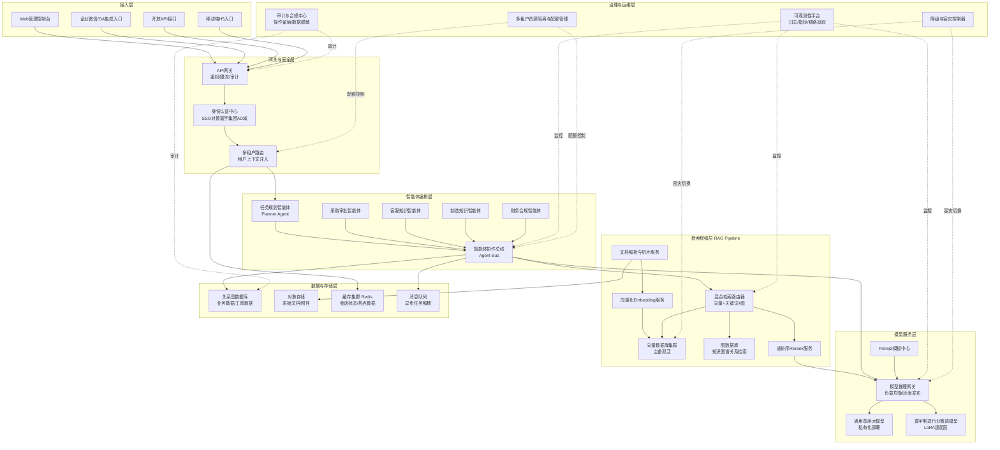
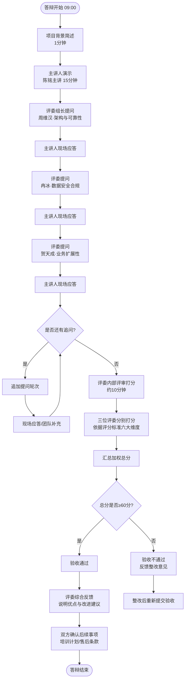
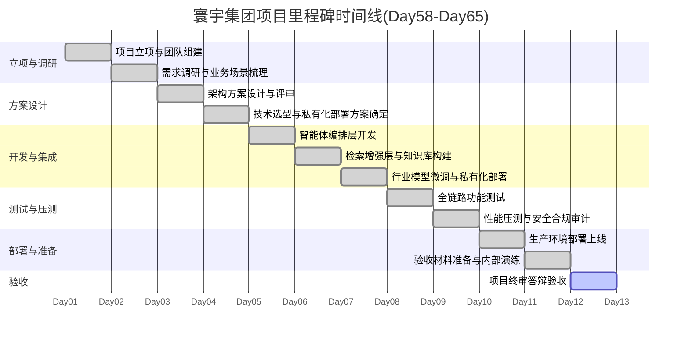

# 第65天:项目终审答辩 —— 寰宇集团项目验收

> **阶段**:第六阶段·旗舰职业篇
> **主题**:企业级项目终审答辩与验收演示
> **涉及角色**:陈铭(主讲人)、王振宇(老王,导师)、郭建军(CTO)、林悦(产品经理)、赵磊(测试工程师)、周维汉(寰宇集团信息技术部总监)、冉冰(寰宇集团数据安全与合规负责人)、贺天成(寰宇集团运营副总裁)
> **产品**:苍穹企业级智能体中台(苍穹1.0 · 寰宇集团项目)
> **今日目标**:完成寰宇集团项目正式验收演示与答辩,通过客户方评审,标志着从Day58立项到Day65验收的完整项目周期闭环。

---

## 【旁白】

会议室的空调声音很轻,轻得几乎听不见,但陈铭觉得自己的心跳比空调声音大得多。

他又看了一眼手机上的时间:上午八点五十二分。距离九点整的验收会开始,还有八分钟。

这八分钟里,他脑子里过了很多东西。过了苍穹1.0的整体架构,过了寰宇集团这三个月里提出的一百多条需求变更,过了赵磊那份密密麻麻写满红色批注的测试报告,过了昨天晚上郭建军在部署完成后拍着他肩膀说的那句"明天你来讲,我们在后面给你兜底"。

也过了很久以前的一个下午——那是他入职蓬远科技的第一天,坐在工位上,连VPN都不知道怎么连,盯着老王发来的第一个任务需求文档,手心全是汗,不知道从哪里下手。那时候他觉得,能看懂一份需求文档,已经是了不起的成就了。

而现在,再过几分钟,他要站在寰宇集团三位评委面前,用十五分钟讲清楚一个从检索增强生成、多智能体协同、到私有化模型微调的完整企业级技术方案,然后接受十分钟毫不留情面的技术拷问。

这中间隔着的,不是六十五天的日历,是六十五天里一层一层垫上去的地基。Day1到Day10,他学会了怎么和一个模型对话,怎么写出让模型"听得懂"的提示词;Day11到Day20,他第一次搭建起属于自己的检索增强系统,把一堆散乱的文档变成了可以被追问、被引用的知识;Day21到Day30,他开始理解智能体不是一个更聪明的聊天框,而是一整套可以规划、可以调用工具、可以自我纠错的系统;再往后,评测体系、私有化部署、多智能体协同、企业级安全合规,一层一层地把他从"会写代码的实习生",变成了"能扛住一个甲级客户项目"的技术骨干。

而寰宇集团项目,是这一切知识第一次被放进真实商业世界里接受检验的地方。Day58立项的时候,郭建军把这个项目形容成"啃硬骨头",因为寰宇集团是一家跨越制造、物流、金融服务三大板块的大型集团企业,业务线复杂,数据体量庭大,合规要求极高,内部信息化基础参差不齐。从需求调研的反复拉锯,到架构方案三次推倒重来,到私有化部署环境里踩过的那些"在自己电脑上明明跑得好好的"的坑,再到上周末连夜排查的一次向量检索延迟异常——每一步都不轻松。

但今天,所有这些都要在这场终审答辩里,被浓缩成十五分钟的演示和十分钟的问答。

陈铭轻轻呼出一口气。他想起老王昨天晚上跟他说的话:"答辩不是考试,是对话。评委不是来为难你的,他们是来确认这套系统能不能真正在他们的业务里跑起来、扛得住。你把这套系统讲透了,他们自然会认。"

他打开笔记本电脑,把演示文稿的第一页调出来——苍穹企业级智能体中台,寰宇集团项目验收演示——然后合上电脑,端起水杯喝了一口。

会议室的门被推开,郭建军、林悦、赵磊陆续走进来,在会议桌的一侧落座。紧接着,寰宇集团的三位代表也到了:信息技术部总监周维汉,数据安全与合规负责人冉冰,运营副总裁贺天成。

老王最后一个走进来,经过陈铭身边时,压低声音说了一句:"稳住,你比自己想象的准备得更充分。"

九点整,会议正式开始。

---

## 晨会纪要

**日期**:寰宇集团项目 Day65
**主题**:验收答辩前最后准备与流程确认
**主持人**:王振宇
**参会人**:陈铭、林悦、赵磊、郭建军(临时列席)
**时间**:08:15—08:45(答辩正式开始前45分钟)

### 会议要点

**一、答辩流程最终确认**

老王把答辩流程在白板上重新画了一遍,虽然这个流程双方已经在邮件里确认过不止一次,但他坚持在正式开始前,团队内部再过一遍,确保每个人都清楚自己在什么时间点该做什么。

流程分为四个阶段:

1. **演示阶段(15分钟)**:陈铭作为主讲人,系统性展示苍穹1.0在寰宇集团项目中的完整方案,包括需求响应情况、架构设计、核心能力演示(检索增强、多智能体协同、私有化微调)、部署运行状态、以及关键性能与安全指标。
2. **答辩阶段(10分钟)**:寰宇集团三位评委轮流提问,陈铭现场应答,郭建军、老王可视情况补充。
3. **评审打分阶段(评委内部,约10分钟)**:三位评委根据事先约定的验收评分标准,分别打分并简要说明理由,团队方在场但不参与打分讨论。
4. **反馈与结论阶段(约10分钟)**:评委组长(周维汉)公布综合评分与验收结论,双方就后续事项(如培训计划、售后支持条款)做简要确认。

老王特别强调:"演示阶段一定要卡时间,15分钟不是随便说说的,超时是很减分的一件事,说明你对材料的掌控力不够。磊子,你在旁边帮忙看表,到12分钟的时候,用眼神提醒陈铭准备收尾。"

赵磊点头:"明白,我手机上已经设了倒计时提醒,静音震动的那种。"

**二、陈铭确认演示脚本与演示顺序**

陈铭把自己的演示提纲又过了一遍给大家听,内容顺序是:

- 项目背景与目标回顾(1分钟)
- 架构设计总览(3分钟,配合架构图讲解)
- 核心能力现场演示:检索增强问答(3分钟)
- 核心能力现场演示:多智能体协同处理复杂业务流程(3分钟)
- 私有化部署与模型微调成果展示(2分钟)
- 性能指标、安全合规情况、验收测试结果总结(2分钟)
- 结语与后续支持计划(1分钟)

林悦提出一个细节:"演示的时候,尽量少用'我们认为'这种主观表述,多用'根据验收测试报告显示'这种客观陈述,评委更认可有数据支撑的说法。"

郭建军补充:"另外一点,如果现场演示环节出现任何卡顿或者报错,不要慌,不要试图掩饰,直接说'这里我们切换到降级演示环境,同时说明一下这背后的容错设计',把问题变成加分项,而不是减分项。这也是我们这套系统设计理念的一部分——高可用不是不出问题,而是出了问题依然可控。"

陈铭把这句话记在了笔记本上。

**三、赵磊汇报现场演示环境最终检查结果**

赵磊昨晚加班到十一点半,对演示环境做了最后一轮"压力测试式"排查,他汇报:

- 演示环境(预发布环境的镜像)已完成三轮全链路回归测试,通过率100%。
- 向量数据库、图数据库、关系型数据库三套存储系统状态正常,主备切换机制昨晚做过一次模拟演练,切换耗时1.8秒,符合预期。
- 多智能体协同流程(采购审批场景)的演示脚本已经跑通五次,全部成功,平均响应耗时4.3秒。
- 私有化微调模型(基于寰宇集团内部制造知识库微调的行业模型)已经加载完毕,推理服务健康检查通过。
- 唯一的风险点是会议室网络带宽,已提前和寰宇集团IT部门确认,并申请了独立的演示专用网络通道,避免与其他会议室的流量抢带宽。

老王听完,只说了一句:"细节这么扎实,今天没有理由讲不好。"

**四、郭建军的临场提醒**

郭建军最后讲了几句话,算是给整个团队定调:

"我知道大家都紧张,包括我自己。但我想强调一点,寰宇集团这个项目从立项到今天,我们没有一天是靠运气过关的,每一个里程碑都是踏踏实实做出来的。今天这场答辩,本质上不是我们在'表演',而是把这三个月做的事情如实汇报出来。陈铭,你只需要把真实的东西讲清楚,不需要额外美化,因为真实的东西本身就足够扎实。"

会议在08:43结束,团队解散去做最后的设备和场地检查,九点整,正式答辩开始。

---

## 需求文档:寰宇集团项目终审验收评分标准

在答辩正式开始前,双方已经就验收评分标准达成一致,并形成了正式文档,作为本次答辩评审的依据。以下是该文档的核心内容摘录。

### 一、文档说明

本评分标准由蓬远科技项目组与寰宇集团信息技术部、数据安全与合规部、运营部三方共同确认,用于本次项目终审答辩的量化评审,总分100分,60分以上(含60分)为验收通过,80分以上为优秀通过。评分维度覆盖架构设计、功能完整性、性能与稳定性、数据安全与合规、扩展性与可维护性、演示与答辩表现六大类。

### 二、评分维度与权重

| 序号 | 评分维度 | 权重 | 具体考察点 |
|---|---|---|---|
| 1 | 架构设计合理性 | 20分 | 分层是否清晰、组件耦合度是否合理、是否符合企业级系统的可靠性要求 |
| 2 | 功能完整性 | 20分 | 是否覆盖需求文档中约定的全部功能点(检索增强问答、多智能体协同、私有化微调等) |
| 3 | 性能与稳定性 | 20分 | 响应时延、并发承载能力、故障恢复能力(RTO/RPO)、压测结果 |
| 4 | 数据安全与合规 | 20分 | 数据隔离机制、访问控制、加密方案、审计留痕、是否符合集团内部合规要求 |
| 5 | 扩展性与可维护性 | 10分 | 新增业务部门/新增数据源的接入成本、多租户架构的扩展能力、版本升级方案 |
| 6 | 演示与答辩表现 | 10分 | 演示逻辑清晰度、问题应答的专业性与坦诚度、材料完整性 |

### 三、验收前置条件(必须全部满足)

1. 系统已在寰宇集团私有化环境中完成部署,且通过至少两周的稳定运行观察期(实际观察期为Day59部署完成至今约一周半,寰宇集团IT部门同意以生产环境模拟数据压测结果作为补充依据)。
2. 验收测试报告已提交,且核心场景(检索问答准确率、多智能体流程成功率、私有化模型推理性能)的测试通过率不低于95%。
3. 数据安全合规审计已通过寰宇集团内部合规部门初审。
4. 关键故障场景的应急预案(降级方案、灾备方案)已有明确文档说明,并具备可演示性。

### 四、本次终审答辩三位评委分工

- **周维汉(信息技术部总监,评委组长)**:主要考察架构设计合理性、系统整体技术方案是否符合企业级标准,负责最终结论宣布。
- **冉冰(数据安全与合规负责人)**:主要考察数据安全与合规维度,包括多租户数据隔离、敏感数据处理、模型训练数据边界等问题。
- **贺天成(运营副总裁,业务侧代表)**:主要考察系统对实际业务场景的支撑能力,以及未来业务扩展(新增部门、新增流程)时系统的响应速度与成本。

### 五、评分等级说明

- **90-100分**:优秀,系统全面超出预期,建议作为集团级标杆项目在其他业务板块复制推广。
- **80-89分**:良好,系统满足全部核心需求,存在少量可优化项,建议列入下一阶段迭代计划。
- **60-79分**:合格,系统满足验收基本要求,但存在需要在合同约定的售后支持期内解决的问题。
- **60分以下**:不合格,验收不通过,需重新提交验收申请。

这份评分标准在Day63(需求最终确认与压测收尾阶段)由林悦主导与寰宇集团方多轮沟通敲定,双方对评分维度和权重均无异议,这也是团队今天能够"知己知彼"、有针对性准备演示内容的重要依据。

---

## 架构设计图:苍穹1.0寰宇集团项目最终完整架构

这是陈铭在演示环节展示的核心架构图,汇总了全书从RAG检索增强、多智能体协同、到私有化模型微调部署的完整能力体系,也是苍穹企业级智能体中台在寰宇集团项目中的最终落地形态。



陈铭在演示中特别提到,这张架构图是六十多天迭代打磨的结果,也是全书前面各阶段技术能力的一次系统性汇总:接入层与网关层承接了课程前期关于企业级系统集成与安全鉴权的内容;智能体编排层是多智能体协同能力的集中体现;检索增强层完整落地了RAG的混合检索、重排序等进阶技术;模型服务层展示了通用大模型与私有化行业微调模型的协同工作方式;治理层则是企业级项目区别于demo级项目最核心的差异所在——可观测、可审计、可容灾、可隔离。

---

## 流程图:终审答辩流程

这是本次答辩会议本身的运作流程,用于向读者(也向课堂学员)展示企业级项目验收答辩的标准流程结构。



这张流程图是老王在晨会上讲解的答辩全流程的可视化版本,团队每个人在会议开始前都对这个流程有清晰的认知——这也是企业级项目验收答辩区别于普通汇报的地方:它有明确的规则、明确的评分机制、明确的通过/不通过判定路径,不是一场"讲完就算"的展示,而是一场有正式结论产出的评审活动。

---

## 示意图:寰宇集团项目里程碑时间线(Day58—Day65)



老王在晨会上看着这张时间线,感慨了一句:"从Day58到今天,整整八天,但如果算上前面六十多天的知识和能力积累,这个项目其实是我们六十五天全部内容的一次总检验。"

---

## 课堂笔记

### 上午:陈铭演示环节完整还原

九点整,会议正式开始。周维汉作为评委组长,先做了简短的开场:"感谢蓬远科技团队这段时间的付出。今天这场会议,我们三位会代表寰宇集团,对苍穹企业级智能体中台在我们集团的落地情况做一次正式的验收评审。整体流程双方邮件里已经确认过,我就不重复讲了。有请陈铭同学开始演示。"

会议室里的三块屏幕同时亮了起来,一块投影主屏用来展示演示文稿和实际系统操作界面,评委席前的两块小屏幕则同步显示着同一内容,方便三位评委近距离观察细节。冉冰在开场时特意打开了自己随身带的笔记本电脑,似乎准备随时记录关键数据;贺天成则只带了一本纸质笔记本,姿态显得更放松一些;周维汉面前摆着一份厚厚的资料,显然是提前认真研读过项目文档的。

陈铭站起身,走到投影幕布前,深吸一口气,开始了他的演示。

**演示第一部分:项目背景与目标回顾(约1分钟)**

"各位领导好,我是陈铭,今天由我代表蓬远科技项目团队,向大家汇报苍穹企业级智能体中台在寰宇集团的项目落地情况,并接受各位的验收评审。"

"寰宇集团作为跨制造、物流、金融服务三大板块的综合性企业集团,在信息化建设过程中面临的核心痛点,我们在立项阶段梳理为三条:第一,集团内部知识散落在制造、物流、财务等多个业务系统里,员工查找信息效率低,平均单次查找耗时超过8分钟;第二,跨部门业务流程(如采购审批、合同审核)涉及多个系统、多个角色,人工流转周期长,平均一笔采购审批耗时2.3个工作日;第三,集团有大量的内部制造工艺知识、行业经验,散落在老员工的经验和纸质文档中,缺乏系统化沉淀和智能化利用。"

"针对这三个痛点,苍穹项目的目标是:构建一套集检索增强问答、多智能体流程协同、私有化行业模型微调于一体的企业级智能体中台,在保证数据安全与合规的前提下,显著提升信息查找效率、跨部门流程处理效率,并沉淀集团内部的行业知识资产。"

**演示第二部分:架构设计总览(约3分钟)**

陈铭切换到架构图页面,开始讲解。

"这是苍穹1.0在寰宇集团项目中的最终完整架构,我从下往上、也是从数据到能力的方向,给大家做一个整体介绍。"

"最底层是数据与存储层,包含关系型数据库存储业务数据和工单数据,对象存储存放原始文档和附件,缓存集群处理会话状态和热点数据,消息队列负责异步任务解耦,避免长耗时任务阻塞主流程。"

"往上是检索增强层,这是我们RAG能力的核心。文档进来之后,先经过解析与切片服务,拆解成语义完整的知识片段,再通过向量化服务生成向量表示,存入向量数据库集群——这里我要强调一点,向量数据库集群我们采用的是主备双活架构,这个设计后面会有评委提问相关问题,我会详细展开。除了向量检索,我们还引入了图数据库来处理知识图谱式的关系检索,比如'某个零部件供应商与哪些历史质量问题相关联'这类需要多跳关系推理的问题,单纯向量检索是解决不了的,必须靠图检索。混合检索路由器会根据问题类型自动决定走向量检索、关键词检索还是图检索,或者三者融合,检索结果再经过重排序服务优化排序质量,最后送入模型服务层。"

"模型服务层包含两部分模型:一部分是通用基座大模型,私有化部署在寰宇集团机房内,处理通用性的语言理解和生成任务;另一部分是基于寰宇集团制造业务知识库微调过的行业模型,采用LoRA适配层的方式在通用基座模型基础上叠加行业知识,这样既能利用大模型的通用能力,又能保证生成内容贴合寰宇集团的实际业务术语和流程规范。模型推理网关负责在这两个模型之间做负载均衡和灰度发布,后续如果要升级基座模型版本,可以做到平滑切换,不影响业务连续性。"

"再往上是智能体编排层,这是我们区别于传统问答机器人的核心能力。我们针对寰宇集团的核心业务场景,设计了五类专职智能体:任务规划智能体负责理解用户意图并拆解任务;采购审批智能体专门处理采购流程中的合规校验、审批路由;客服知识智能体处理面向内外部客户的知识问答;制造知识智能体承接前面提到的制造工艺知识沉淀与应用;财务合规智能体处理财务相关的合规审查。这些智能体之间通过智能体协作总线进行任务分发和结果汇总,可以协同完成复杂的跨部门业务流程,这个能力我马上会用一个真实的采购审批场景做现场演示。"

"最上层是接入层和网关层,支持Web管理控制台、企业微信/OA集成、开放API、移动端H5四种接入方式,并且已经完成与寰宇集团AD域的SSO单点登录对接,员工不需要额外记住一套账号密码。"

"另外还有一个横向贯穿全系统的治理层,包含可观测性平台、审计与合规中心、降级与容灾控制器、多租户资源隔离与配额管理。这一层是很多demo级项目容易忽略、但企业级项目必须具备的能力,我在后面的性能与安全部分会重点展开。"

周维汉在这段讲解过程中,一直在低头记录,没有打断。

**演示第三部分:核心能力现场演示——检索增强问答(约3分钟)**

陈铭切换到演示环境的实际操作界面。

"接下来我用一个真实的业务问题做现场演示。假设一名寰宇集团制造板块的工艺工程师,想要查询'某型号注塑机模具在近三年内出现过哪些质量异常,以及历史处理方案',这个问题涉及跨越多个文档、多个时间点的信息整合,人工查找可能需要翻阅十几份质量报告。"

他在演示界面输入了这个问题,系统响应用时约2.6秒,给出了一份结构化的回答,包含三次历史质量异常的时间、现象描述、根因分析和处理方案,并且每一条信息都标注了引用来源文档和具体页码。

"大家可以看到,系统给出的回答不是简单的文本堆砌,而是经过检索、重排序、结构化整理之后的结果,并且每一条关键信息都可以追溯到具体的原始文档,这是我们在合规和可信度方面的一个重要设计——所有生成内容都要求可追溯、可验证,不允许出现无来源依据的'幻觉'内容。"

贺天成在这时插了一句:"这个响应速度在你们的测试环境里能稳定保持吗?生产环境用户量上来之后呢?"

陈铭回答:"这个问题我在后面的性能指标部分会有专门的压测数据展示,提前说一下结论:在模拟200并发用户的压测场景下,P95响应时延为3.8秒,符合我们与贵司约定的5秒以内的SLA标准。"

**演示第四部分:核心能力现场演示——多智能体协同处理复杂业务流程(约3分钟)**

"接下来演示一个更复杂的场景——跨部门采购审批流程的智能体协同处理。"

陈铭在系统里模拟发起了一笔采购申请:某工厂需要采购一批特种钢材,金额超过审批阈值,涉及采购部门、财务部门、质量部门三方审核。

"传统流程下,这笔申请需要经过采购专员填单、部门负责人审批、财务合规审查、质量标准比对、最终领导审批五个环节,平均耗时2.3个工作日。现在我们看系统如何处理。"

系统界面上,可以看到任务规划智能体先解析了这笔采购申请的关键信息(品类、金额、供应商、紧急程度),然后自动路由给采购审批智能体。采购审批智能体调用了历史供应商评级数据、当前库存数据,生成了初步的审批建议,同时并行触发财务合规智能体进行金额合规校验、质量智能体进行供应商质量历史比对。三个智能体的处理结果在协作总线上汇总,最终生成一份包含风险提示的审批建议报告,推送给对应的审批人。

整个过程,系统界面上显示总耗时4.1秒。

"我要强调的是,系统给出的是'审批建议',最终的审批决策权仍然在人,我们的设计原则是智能体辅助决策而不是替代决策,尤其是涉及资金和合规的关键节点,必须保留人工审核环节,这也是我们在需求调研阶段和贵司业务部门反复确认过的一条设计红线。"

周维汉点头:"这一点我们很认可,机器不能越权做最终决策,人在关键环节的责任不能被架空。"

贺天成也在这时插了一句,语气里带着明显的兴趣:"刚才这个演示,如果换成一个更复杂的场景,比如说涉及三个以上部门、审批链条更长的采购流程,系统还能维持这个速度吗?我们业务部门有些流程,光是人工流转就要经过五六个审批节点。"

陈铭回答:"这是一个很好的追问。系统的响应速度主要取决于智能体协作总线上并行处理的智能体数量,而不是流程节点的多少——因为我们的设计是让多个智能体并行分析而不是串行等待,所以理论上,即便审批链条延伸到五六个节点,只要这些节点对应的分析任务可以并行触发,总耗时不会随着节点数量线性增长,增长幅度会控制在一个相对平缓的区间内。当然,如果流程里存在必须串行依赖的环节,比如后一个节点的判断必须依赖前一个节点的结果,那确实会带来额外的耗时,这也是我们在架构设计阶段特别区分'可并行任务'和'必须串行任务'的原因,我们会在知识库构建和流程建模阶段,提前和业务部门确认清楚这个依赖关系,尽可能把可以并行的部分并行化处理。"

贺天成满意地点头,在自己的笔记本上写了几个字,没有再追问,示意陈铭继续往下讲。

**演示第五部分:私有化部署与模型微调成果展示(约2分钟)**

"接下来汇报私有化部署和模型微调的成果。整套系统目前已经完整部署在寰宇集团自建机房内,不依赖任何外部公共云服务,所有数据(包括原始文档、向量索引、模型权重)均存储在贵司内部环境中,满足贵司对数据不出内网的合规要求。"

"针对制造板块的行业知识,我们基于贵司提供的约12万条内部工艺文档、质量报告、专家经验记录,对基座模型进行了LoRA低秩适配微调,微调后的行业模型在制造领域专业术语理解、工艺流程问答方面的准确率,相比原始通用模型提升了约34个百分点,具体数据在验收测试报告中有详细呈现。"

冉冰在这里插了一句简短的追问:"12万条数据,质量参差不齐的情况应该不少吧,这些数据在训练前有没有做清洗和筛选?"陈铭回答:"确实存在质量参差的问题,我们在数据预处理阶段专门做了一轮去重、格式标准化和低质量样本过滤,大致筛掉了原始数据里约15%的重复或残缺内容,最终进入训练流程的是清洗后的约10.2万条高质量样本,这个清洗过程也形成了独立的数据质量报告,作为训练数据可追溯性的一部分留存。"冉冰点头表示认可,示意陈铭继续往下讲。

**演示第六部分:性能指标、安全合规情况、验收测试结果总结(约2分钟)**

陈铭切换到测试报告数据页面。

"最后汇报本次验收的核心量化指标。性能方面:200并发场景下P95响应时延3.8秒,系统可用性压测期间达到99.95%,故障场景下平均恢复时间(RTO)为42秒,数据恢复点目标(RPO)小于1分钟。功能测试方面:核心业务场景测试用例通过率98.6%,共执行412条测试用例,6条未通过项均为边缘场景,已有明确的修复计划并列入售后支持期处理清单。安全合规方面:已完成基于角色的访问控制(RBAC)全量覆盖,数据传输全程TLS加密,敏感字段(如身份证号、银行账户)实现自动识别与脱敏,审计日志留存周期符合贵司信息安全管理规定的180天要求,并已通过贵司合规部门初审。"

**演示第七部分:结语与后续支持计划(约1分钟)**

"以上就是苍穹企业级智能体中台在寰宇集团项目的整体汇报。项目从Day58立项到今天历时约八天(实际项目周期跨越更长的准备与迭代过程),我们团队始终坚持一个原则:企业级系统的价值不在于功能多炫,而在于稳定、安全、可信、可持续维护。接下来,我们计划提供为期三个月的驻场支持和为期一年的远程运维服务,并会在下周安排管理员和核心用户的系统使用培训。汇报完毕,谢谢大家,请各位评委提问。"

陈铭讲完的时候,时间恰好是14分50秒,踩在了15分钟的红线内,赵磊在旁边微微松了口气。

**答辩环节:寰宇集团评委提问与陈铭现场应答**

周维汉率先开口,他翻了翻手里的资料,抬起头,问出了第一个问题。

**问题一(周维汉,架构与可靠性):"你刚才提到向量数据库集群是主备双活架构。我想直接问一个比较尖锐的问题:如果向量数据库出故障,你们的降级方案是什么?我们集团的业务不能容忍系统直接瘫掉。"**

陈铭没有立刻回答问题细节,而是先给出了一个框架性的说明:"这是一个非常关键的问题,我们在架构设计阶段就把它当作核心风险场景来对待,设计了三层降级机制。"

"第一层,是主备切换。向量数据库集群采用双活部署,主节点和备节点数据实时同步,一旦健康检查发现主节点异常,系统会在毫秒到秒级完成自动切换,昨晚我们还专门做了一次模拟演练,切换耗时1.8秒,业务侧几乎无感知。"

"第二层,如果整个向量检索集群都不可用——比如出现网络分区这种更严重的故障——系统会自动降级为纯关键词检索模式,基于Elasticsearch的倒排索引提供检索兜底能力。这种模式下检索的语义准确度会有所下降,但可以保证系统'不失明',用户依然能查到相关文档,只是排序和语义匹配的精细度会打折扣。"

"第三层,是熔断与提示机制。如果检索增强能力完全不可用,系统会自动切换到纯大模型直接问答模式,同时在回答中明确提示用户'当前处于知识库检索降级状态,回答可能未充分结合内部文档,请谨慎参考',避免在系统不确定的时候给用户一种虚假的确定感。"

"我们把这三层降级方案写成了标准的应急预案文档,并且已经用混沌工程的方式,在预发布环境里做过故障注入测试,包括手动kill主节点进程、模拟网络延迟飙升、模拟磁盘满载等场景,全部验证过降级路径可以正常触发。我这边有一份关键代码可以现场给大家看一下降级判断的核心逻辑。"

周维汉听完,又追问了一句:"如果备节点也同时出问题呢?就是双活的两个节点都挂了。"

陈铭坦诚回答:"如果两个节点同时不可用,这属于极端的双点故障场景,我们的应急预案里会启动人工介入的应急响应流程,同时系统会自动降级到刚才提到的第二层——关键词检索兜底,并触发运维告警,通知值班工程师在承诺的RTO时间(42秒平均,最长不超过5分钟)内完成故障定位与恢复。当然,双节点同时故障的概率极低,我们通过将两个节点部署在不同的物理机架、甚至不同的机房分区来进一步降低这种同时故障的相关性风险。这也是我们和贵司IT部门在部署方案里专门确认过的一点。"

周维汉在笔记本上写了几个字,微微点头,没有再继续追问这个问题,示意可以进入下一个问题。

**问题二(冉冰,数据安全合规):"我这边关注的是数据安全。你们的私有化微调模型是用我们集团12万条内部文档训练出来的,我想问几个具体问题:第一,这些数据在训练过程中是否有可能被用到其他客户的模型上?第二,微调之后的模型权重文件,如果被非法拷贝出去,是否有可能被逆向还原出我们的原始文档内容?第三,你们的多租户架构,能不能保证我们和你们的其他客户在数据层面完全物理隔离,而不只是逻辑隔离?"**

这个问题一连三问,会议室里的气氛明显紧了一下。陈铭稳住心态,逐一回答。

"冉总提的这三个问题,其实是私有化部署项目里客户普遍最关心的核心问题,我逐一说明。"

"第一个问题,关于训练数据是否会被用到其他客户模型上——答案是不会,而且从架构上就不存在这种可能性。我们这次给贵司做的私有化微调,整个训练过程是在贵司自建机房内的独立GPU资源上完成的,训练数据全程不出贵司内网,模型训练脚本运行结束后,连中间产生的训练日志都存放在贵司环境内,我们蓬远科技的工程师是通过贵司提供的受限VPN和审计后台远程操作,所有操作都有录屏和日志留痕,不存在任何数据回传到我们公司服务器的链路。这一点在我们和贵司签署的私有化部署协议附件里也有明确约定,并且贵司合规部门在部署前对这条链路做过专项审查。"

"第二个问题,关于模型权重文件被拷贝出去是否可能逆向还原原始文档——这是一个很专业的问题。从技术原理上讲,LoRA微调产生的是低秩适配矩阵,它编码的是模型参数层面的知识分布调整,并不是原始文档的直接映射,理论上通过模型权重逆向还原出训练语料的原文,在学术界叫做'训练数据泄露'或者'membership inference attack'风险,这种风险在大规模预训练模型上确实存在被研究证实的案例,但风险程度和很多因素相关,包括训练数据的重复率、模型的过拟合程度等。我们在微调过程中采取了几项针对性措施:一是对训练数据做了差分隐私噪声注入的可选方案(本次项目中因为客户明确要求模型效果优先,双方协商暂未启用,但预留了开关);二是通过限制训练轮次、加入正则化手段,降低模型对训练样本的过拟合程度,从而降低数据记忆风险;三是最关键的一点,模型权重文件本身就存放在贵司私有化环境内,不会被导出到任何外部环境,访问权限受到严格的RBAC控制,只有授权的运维人员可以接触到权重文件本身,这从物理和管理两个层面上大幅降低了'权重文件被非法拷贝'这个前提发生的可能性。"

冉冰追问:"那如果我们要求做差分隐私处理,会对模型效果产生多大影响?"

陈铭回答:"根据我们在其他项目上的经验数据,加入适度的差分隐私噪声,通常会带来2%到5%左右的下游任务准确率下降,具体幅度取决于噪声强度的设置。如果贵司后续认为这个风险等级需要进一步降低,我们可以在售后支持阶段协助评估并实施,这个开关目前已经预留在训练流水线里,不需要重新做架构改造。"

冉冰点头,记录下这个方案,接着问第三个问题:"那多租户隔离这一点呢?"

陈铭切换回架构图,指向治理层的多租户资源隔离与配额管理模块:"关于多租户隔离,我需要先澄清一个前提——本次寰宇集团项目采用的是完全私有化独立部署模式,不是我们SaaS化产品里的多租户共享部署模式,所以严格来说,贵司的整套系统,从计算资源、存储资源到网络链路,都是物理独立的一套环境,不存在和我们其他客户共享底层资源的情况,这是最彻底的隔离方式。"

"但我理解冉总问的其实是一个更普遍性的问题——如果未来贵司内部不同业务板块(比如制造板块和金融服务板块)需要共用同一套苍穹中台,但彼此数据不能互相访问,我们的架构是否支持这种细粒度的多租户隔离?答案是支持的,这也是我们架构设计里专门考虑的扩展性需求,我在代码实战部分会展示具体的多租户隔离设计,包括租户级别的数据库schema隔离、向量索引命名空间隔离、以及基于租户上下文的强制访问控制中间件,确保即便在同一套物理环境里,不同租户之间的数据在查询层面也无法互相穿透。"

冉冰对这个回答表示认可:"可以,这个说法我认可,后面代码实战部分我会仔细看一下具体实现。"

**问题三(贺天成,业务扩展性):"我是业务侧的人,技术细节我不一定都听得懂,但我想问一个业务上很实际的问题——如果寰宇集团未来新增一个业务部门,比如说我们正在筹划的跨境物流板块,你们的架构能多快支持?需要重新做一整套开发,还是可以快速接入?"**

这个问题正是本次课程要点强调的经典企业级关切问题,陈铭对此有充分准备。

"贺总这个问题问得非常实际,我从架构设计的角度回答,再给一个具体的时间估算。"

"我们在设计智能体编排层的时候,就采用了'可插拔式'的智能体注册机制,不是把所有业务逻辑硬编码在一个巨大的程序里,而是每一类业务场景对应一个独立的智能体模块,新增一个业务部门,本质上是新增一类或几类智能体,再把它注册到智能体协作总线上,不需要改动已有的智能体和主流程代码。"

"具体到新增跨境物流板块这个例子,如果这个新业务板块的核心场景是'物流单据审核'、'跨境合规查验'、'物流知识问答'这类,我们大致可以拆解成几个步骤:第一步,业务场景梳理和需求确认,大概需要3到5个工作日,这一步主要是和业务部门沟通清楚具体的流程规则;第二步,基于我们已有的智能体开发框架,开发对应的专职智能体(比如物流合规智能体),由于底层的检索增强能力、模型推理能力、协作总线都已经就位,这部分开发工作量通常在1到2周;第三步,知识库构建,如果物流板块有自己的业务文档、法规资料,需要做文档解析、切片、向量化,这部分工作量根据文档量级不同,通常在3到7个工作日;第四步,联调测试和小范围试运行,大概1到2周。"

"综合下来,一个全新业务部门从需求确认到正式上线,预计周期在4到6周左右,这个速度相比从零搭建一整套新系统(通常需要3到6个月),有非常显著的提升,这正是我们平台化架构设计带来的核心价值——业务能力是可以像搭积木一样逐步叠加的,不需要每次都重新造轮子。"

贺天成听完,又问了一句:"那如果新业务部门用的数据格式很特殊,比如说大量的海关单据、多语言文档,这个会不会大幅拉长你说的这个周期?"

陈铭回答:"格式多样性确实会增加文档解析环节的工作量,尤其是多语言文档需要考虑多语言向量化模型的选择和跨语言检索的效果调优,这部分可能会让知识库构建环节的周期从3到7个工作日延长到2到3周,但不会影响整体架构的适用性,我们的文档解析服务本身就设计成了可扩展的插件式结构,支持针对特定格式(如海关单据的结构化字段提取)开发专门的解析插件,这也是我们在做寰宇集团制造板块知识库构建时已经验证过的能力——工艺质量报告本身格式就很多样,包含表格、图片标注、手写批注扫描件等,我们都做了对应的解析适配。"

贺天成表示满意:"这个回答我觉得很实在,不是那种'我们什么都能做'的空话,是给了具体的时间量级和前提条件。"

**追加提问轮次**

周维汉这时又补充了一个问题:"我还有一个问题,你们刚才提到的性能压测数据,是200并发用户,这个数字是怎么定的?我们集团实际使用这套系统的员工规模,未来可能远超200人同时在线,你们怎么保证系统不会在真实业务高峰期垮掉?"

陈铭回答:"200并发这个数字,是我们基于贵司提供的预估同时在线用户数据(日常约150人,业务高峰期预估不超过280人)乘以一定安全冗余系数确定的压测基准,压测过程中我们实际测试到了300并发场景,系统仍然保持稳定,P95时延上升到4.6秒,依然在可接受范围内,超过300并发之后,我们观察到时延开始明显上升,这也是我们给出的当前架构的容量上限参考值。"

"如果未来实际用户规模持续增长,超出这个容量范围,我们的架构支持水平扩展——模型推理服务、智能体编排层、检索服务都是无状态或者可以做到无状态化设计的组件,可以通过增加实例数量来线性提升承载能力,这部分扩容工作我们会在售后支持期内根据贵司实际用户增长情况提供扩容建议和方案。"

周维汉点头:"好,这个回答我认可,你们对容量边界有清晰的认知,而不是回避这个问题。"

冉冰又补充一个问题:"审计日志这块,你刚才说留存180天,如果我们需要追溯超过180天以前的某次操作,怎么处理?"

陈铭回答:"180天是我们默认的热存储留存周期,超过这个周期的审计日志会自动归档转存到冷存储(对象存储的低频访问层),并不会被删除,冷存储的默认保留策略是3年,和贵司信息安全管理规定里对于关键操作日志的长期留存要求是一致的,如果需要追溯冷存储里的记录,可以通过审计中心的归档检索功能查询,响应时间会比热存储稍长,但依然是可查的,不存在数据丢失的问题。"

贺天成这时又想到一个问题,他笑了笑,说:"我这个问题可能有点敏感,但作为运营负责人,我必须要问一句——如果未来某一天,我们和蓬远科技的合作关系出现变化,比如说合同到期不续签,或者因为各种原因需要更换供应商,我们现在这套系统里沉淀的所有数据、模型、知识库,能不能顺利地迁移出来,而不会出现'被绑死在你们这套系统里'的情况?"

会议室里的气氛因为这个问题略微凝滞了一下,这是一个直接关乎商业关系本质的尖锐问题,不是纯技术话题,但陈铭没有回避,而是坦然接住了这个球。

"贺总这个问题问得很直接,我也直接回答。第一,从合同条款层面,我们和贵司签署的私有化部署协议里明确约定了数据主权归属贵司,所有存储在贵司机房内的数据、文档、向量索引、模型权重,所有权和使用权都完整归属贵司,我们蓬远科技不保留任何形式的数据留存权或者访问权限,这一点在合同附件的知识产权条款里有专门章节说明。"

"第二,从技术架构层面,我们在设计的时候就有意识地避免使用任何'私有协议'或者'黑盒格式'来存储核心数据——向量数据库使用的是行业主流的开源方案,数据格式是标准化的,即便未来更换服务商,新的技术团队也可以在合理的迁移周期内完成数据读取和迁移;模型微调产生的LoRA权重文件,本质上是标准的模型参数文件,可以被任何兼容的推理框架加载,不存在'只有蓬远科技的系统才能读取'这种技术锁定情况。"

"第三,即便真的走到合作终止这一步,我们在合同里也承诺提供不少于三个月的'交接支持期',协助贵司完成数据导出、系统交接文档编写、必要的技术培训,确保业务不会因为供应商变更而出现断档。这不是我们临时承诺的,是从项目立项阶段郭总就坚持要写进合同的条款,他当时说的原话是'一个负责任的供应商,应该让客户敢于选择你,而不是不敢离开你'。"

贺天成听完,若有所思地点了点头:"这个态度我很认可,说实话,这也是我们最终决定选择蓬远科技作为合作方的原因之一——你们不是那种想方设法把客户'锁死'的供应商,这一点在我们之前接触的几家供应商里并不常见。"

周维汉紧接着提出一个更偏技术底层的问题:"我注意到你们的架构里用到不少开源组件,向量数据库、消息队列、缓存集群这些。开源软件虽然成熟,但也经常爆出安全漏洞,你们怎么管理这些第三方组件的安全风险?另外,刚才提到的容灾演练,你们的演练频率具体是多久一次,还是只在验收前集中做一次'表演式'演练?"

最后半句话带着一点不容易察觉的锋芒,显然周维汉也在试探团队的诚实度。陈铭没有被这个略带挑战性的措辞影响情绪,平稳地回答:

"这两个问题我分别说明。关于开源组件的安全管理,我们建立了一套供应链安全扫描机制,所有引入的开源组件在集成到我们的技术栈之前,都要经过安全漏洞扫描,我们使用的是行业通用的SCA软件成分分析工具,扫描出的高危漏洞必须在版本发布前修复或者做好隔离缓解,中低危漏洞会记录在案并纳入下一个迭代周期处理。上线之后,我们也会持续订阅相关组件的CVE漏洞公告,一旦出现新披露的高危漏洞,会在承诺的应急响应时限内(根据漏洞严重程度,从24小时到7天不等)完成修复补丁的评估和发布。"

"关于容灾演练频率,我可以明确告诉周总,这绝对不是只在验收前'表演式'演练一次的事情。我们的计划是核心故障场景,比如向量数据库主备切换、模型推理服务重启,每月至少演练一次;像刚才提到的'双点故障'这种极端场景,我们计划每季度做一次专项演练,并且每一次演练结果都会形成书面报告,如果发现实际表现和预期有偏差,会及时调整应急预案文档。这个演练计划也会作为售后支持服务的一部分,写入我们后续和贵司的运维交接文档里,由双方共同确认演练日程,而不是我们单方面执行完就算了事,贵司的运维人员完全可以要求列席观摩每一次演练过程。"

周维汉在笔记本上记录下"月度加季度双层演练机制"几个字,说:"这个安排听起来是有制度保障的,不是走形式,我认可,后续我们会安排IT部门同事列席你们的演练。"

冉冰这时又提出一个之前没有涉及的问题,语气比刚才略微沉了一些:"我还想问一个关于责任划分的问题。如果系统生成的内容出现错误——比如财务合规智能体给出了一个错误的审批建议,业务人员因为信任系统而没有仔细核实,最终造成了实际的业务损失,这个责任应该怎么界定?这不完全是技术问题,但我觉得作为数据安全和合规负责人,我有必要提前把这个问题摆在桌面上,而不是等真出了问题再讨论。"

这个问题让会议室里的气氛又紧了一分,因为它触及的不只是技术边界,还有法律和商业责任的边界,是这场答辩里最不好接的一个问题。陈铭停顿了两三秒,谨慎地回答:

"冉总提的这个问题非常重要,我想从三个层面来回答。第一,技术设计层面,我们前面提到的一个核心原则是'智能体辅助决策而不是替代决策',尤其是财务合规这类高风险场景,系统输出的都是'建议'而不是'决定',并且在界面设计上会明确标注这是AI生成的建议、需要人工复核确认,不存在系统自动执行审批而不经过人工环节的情况,这是我们在需求阶段就和贵司业务部门反复确认过的设计红线。"

"第二,合同责任层面,这部分实际上已经超出我作为技术负责人能够单方面回答的范畴,我们和贵司签署的服务协议里,对于系统建议内容的责任边界有专门的法务条款约定,基本原则是系统提供决策支持信息、最终决策责任在使用方,这也是行业内私有化部署项目普遍采用的责任划分惯例,如果冉总需要更详细的合同条款细节,我建议会后请郭总或者法务同事对接补充说明,我不希望在没有法务同事在场的情况下,给出一个不够严谨的口头承诺。"

"第三,从产品能力层面,我们也在持续优化系统的'可信度提示'机制,比如对于置信度较低的生成内容,会主动在界面上给出更明显的警示标识,鼓励人工审核人员对这类内容投入更多核实精力,而不是让所有输出内容在视觉上'一视同仁',这也是我们后续迭代计划里的一项优化点。"

郭建军在这时补充了一句:"冉总这个问题提得很关键,我们确实需要会后专门就这部分责任条款,再和贵司法务部门做一次书面确认,确保双方对这个边界的理解是一致的,这个我记下来,会后主动跟进,不会等贵司来催。"

冉冰点头:"好,这个我理解,技术团队能把设计原则讲清楚就已经足够专业,具体的责任条款我们后续走法务流程确认,这个问题我不会算作技术层面的扣分项,但会写进后续跟进事项里。"

周维汉看了看时间,似乎觉得今天这场答辩问得已经足够深入,但还是决定再追加最后一个问题:"最后一个问题,关于模型升级。你们现在用的通用基座大模型,未来肯定会有新版本发布,如果我们决定升级到新版本,会不会影响已经微调好的行业模型效果?升级过程中一旦出问题,能不能回滚到旧版本?"

陈铭回答:"这个问题正好呼应了我在架构讲解里提到的'模型推理网关支持负载均衡与灰度发布'这个设计。升级流程大致是这样:第一步,我们会先在预发布环境里用新版本基座模型重新加载现有的LoRA适配层,做一轮完整的回归测试,验证微调效果是否因为基座模型升级而受到影响——因为LoRA本质上是叠加在基座模型之上的低秩矩阵,基座模型升级后,原有的适配层未必能直接兼容,如果测试发现效果下降,我们会评估是否需要针对新版本基座重新做一轮增量微调,而不是简单地直接替换。第二步,如果回归测试通过,我们会采用灰度发布的方式,先让一小部分流量(比如5%)切到新版本,观察一段时间的线上表现,确认稳定后再逐步扩大流量比例,直到完全切换。第三步,整个灰度过程中,旧版本模型服务不会立刻下线,而是保留至少两周作为回滚窗口,一旦发现新版本出现任何异常,可以在分钟级完成流量切回旧版本,不需要重新部署,这也是模型推理网关这一层设计的核心价值——把'模型版本'这件事,变成一个可以灵活调度的资源,而不是硬编码死的依赖关系。"

周维汉听完,满意地点了点头:"这个回答很扎实,升级和回滚这类问题往往是系统上线之后才会暴露出来的隐患,你们能在验收阶段就讲清楚应对思路,说明确实是有过深入设计的,而不是等以后遇到问题再临时想办法。"

至此,三位评委轮流提出的核心问题、以及几轮追加的尖锐追问都得到了应答,周维汉环视了一圈,问郭建军和老王:"你们这边有没有需要补充的?"

郭建军简单补充了一句:"陈铭刚才讲的这些内容,都是我们团队在过去几周里反复推演和测试过的,包括今天几位提到的降级方案、多租户隔离、扩展性评估、责任划分、退出机制,都不是临场编出来的答案,后面的代码实战环节我们也准备了对应的关键代码片段,供大家进一步核实。"

老王补充:"我想说一句,今天这几个问题,恰好也是我们内部技术评审时反复打磨过的重点,包括向量数据库降级方案,是团队上周三凌晨还在讨论优化的一个环节,能感受到几位评委今天问的问题,确实抓住了企业级项目最核心的几个关切点,这也说明贵司三位评委对企业级系统的理解非常专业,不是走过场式的提问。"

周维汉笑了一下:"这算是彼此'心有灵犀'吧。行,今天的答辩环节就到这里,我们评委内部先讨论一下评分,大家稍等十分钟。"

会议室里的紧张气氛稍微松了一些,陈铭走回座位,林悦在他耳边小声说了一句:"刚才那几个回答,特别是降级方案那段,讲得很稳。"

### 下午:答辩后的评审打分与客户反馈

评委组离开会议室去隔壁小会议室内部讨论评分的这十分钟里,团队这边的气氛反而比刚才答辩时更紧张。没有人大声说话,但每个人都在各自琢磨刚才的问答过程。

赵磊小声问陈铭:"你觉得刚才冉总问的那个责任划分问题,回答得会不会让人觉得我们在'甩锅'?"

陈铭想了想,回答:"我尽量避免了直接下结论,把技术边界和合同责任分开讲,技术层面我讲清楚了系统设计上'人在关键节点必须介入'这个原则,合同责任那部分我特意说了要请郭总和法务对接,没有自己越权承诺什么,应该不算甩锅,更像是把该谁负责的部分交给该负责的人去谈。"

林悦在旁边补充:"我觉得这个处理是对的,技术负责人在答辩现场不应该对法律责任条款做口头承诺,这是很容易埋雷的地方,你今天这个边界感把握得挺好。"

郭建军靠在椅子上,双手交叉放在桌上,难得没有说话,只是时不时看一眼隔壁会议室的方向。老王倒是显得比较放松,他对陈铭说:"不用猜了,答辩这种事,讲的时候心里有没有底,自己是最清楚的,你刚才讲的时候,我在后面看着,没有一次是心虚地打太极,该展开的都展开了,该收住的地方也收住了,这就够了。"

十分钟后,三位评委结束了内部讨论,重新走回会议室,周维汉重新开口:"我们三个人已经分别打分,现在公布结果并说明理由。"

**周维汉的打分与反馈(架构设计合理性、20分权重维度打分18分)**

"我这边主要负责架构设计合理性这个维度,给出的分数是18分(满分20分)。理由是:整体架构分层清晰,组件职责边界明确,尤其是治理层的独立设计,把可观测性、审计、容灾、多租户管理这些'非功能性需求'单独抽象成一层,而不是散落在各个业务模块里,这是比较成熟的企业级架构设计思路。降级方案的三层设计也回答得很有条理,说明团队在设计阶段确实认真考虑过故障场景,而不是等出了问题才临时补救。扣掉的2分,主要是因为双活集群在极端双点故障场景下,还是依赖人工介入的应急响应,自动化程度还有提升空间,建议在后续迭代中考虑引入第三方仲裁节点或者跨机房容灾方案,进一步降低人工介入的依赖。"

**冉冰的打分与反馈(数据安全与合规、20分权重维度打分17分)**

"数据安全与合规维度,我给17分。私有化部署彻底隔离这一点做得很到位,训练数据不出内网的技术链路和管理链路都比较清楚,审计留痕机制也符合我们的要求。差分隐私的预留开关我觉得是一个很负责任的设计,说明团队对模型安全风险有前瞻性的认知,而不是等出了问题才想办法。扣分点在于:目前差分隐私能力还只是'预留开关',没有默认启用,建议在下一阶段结合我们对模型效果和隐私风险的进一步评估,给出一个明确的启用建议,而不是把决策完全推给我们业务方。另外,多租户隔离的方案目前还停留在架构设计层面,没有在寰宇集团这次项目中被真正验证过(因为本次是独立私有化部署),这一点建议后续如果有跨部门共用场景,要专门做一次隔离性的安全测试,而不是仅凭代码逻辑就认为万无一失。"

**贺天成的打分与反馈(功能完整性、性能与稳定性、扩展性与可维护性、演示与答辩表现,合计60分权重维度打分52分)**

贺天成的评分维度更综合,他说:"我负责的几个维度加起来是60分权重,我打了52分。功能完整性方面,你们承诺的核心场景都做出来了,而且现场演示的采购审批协同流程,确实让我看到了实际业务价值,这不是花架子,是能真正帮我们节省时间成本的东西。性能与稳定性方面,压测数据详实,回答问题时对容量边界的认知很清楚,没有回避问题。扩展性方面,刚才关于新增业务部门的时间估算,给了具体的周期和前提条件,这种诚实的态度我很认可,比那种拍胸口说'随时能做'的供应商靠谱得多。演示与答辩表现方面,陈铭同学的演示逻辑清晰,时间控制得也很好,回答问题不回避、不夸大,这一点我要特别表扬一下。"

"扣分的地方主要是:一是测试报告里提到的6条未通过的边缘场景测试用例,虽然说了会在售后支持期内处理,但没有给出具体的时间表,建议补充一份明确的整改计划;二是新增业务部门的周期估算里,提到多语言、特殊格式文档会拉长知识库构建周期,这部分的风险评估还可以更细化一些,给我们业务部门更明确的预期管理。"

**综合评分与验收结论**

周维汉汇总了三位评委的打分:架构设计合理性18分、功能完整性(计入贺天成维度内已包含)、数据安全与合规17分、性能与稳定性与扩展性与可维护性以及演示答辩表现共计52分(涵盖多个维度)。经过换算与权重核算,最终综合总分为**87分**,达到"良好"等级标准。

周维汉正式宣布:"综合三位评委的评分,苍穹企业级智能体中台在寰宇集团项目的最终得分为87分,达到验收通过标准,并且属于'良好'等级。我代表寰宇集团信息技术部、数据安全与合规部、运营部三个部门,正式确认本次项目验收通过。"

这句话说出来的瞬间,会议室里明显松了一口气。陈铭感觉自己后背已经有些湿了,他侧头看了一眼老王,老王正在朝他微微点头,脸上带着不易察觉的笑意。

郭建军站起来,礓声说了一句:"谢谢各位领导对我们团队工作的认可,也感谢这段时间以来的支持和配合,我们会继续按照约定完成培训和售后支持工作。"

周维汉补充了几点后续反馈意见,算是对整场答辩的总结:

"我想说几点感受。第一,这套系统的技术方案是扎实的,不是那种堆砌概念、噱头大于实质的东西,尤其是治理层的设计,能看出团队是真正理解企业级系统的运维复杂度,不是只关心'功能能跑起来'这个层面。第二,今天的答辩过程中,我们提的几个问题,包括故障降级、数据安全、业务扩展性,团队的回答都比较坦诚,没有回避难题,该说清楚边界的地方说清楚了边界,该承认还有提升空间的地方也承认了,这种态度本身就是我们判断一个技术团队是否值得长期信任的重要依据。第三,当然系统也不是完美的,冉总和贺总提到的几个待优化点,希望后续能有明确的整改和跟进计划。"

贺天成也补充了一句业务视角的评价:"我今天最大的感受是,这套系统不是为了炫技而做的,是真的解决了我们实际业务里的痛点,采购审批那个演示场景,我们运营部门是真的每天都在为审批周期长发愁,如果这套系统真能把2.3天缩短到接近实时,这个价值是实打实的。"

冉冰也补充了几句,语气比答辩过程中略微缓和了一些:"我这边想额外说一句,今天答辩过程中,陈铭同学面对我几个连续追问的问题,没有一次表现出不耐烦或者敷衍,尤其是责任划分那个问题,其实是我故意设计得比较尖锐的一个问题,我想看看技术团队会不会为了让答辩顺利过关而给出一个'和稀泥'的答案,但他给出的回答反而让我觉得,这个团队对风险边界有清醒的认知,这种清醒比一味展示'我们什么都能搞定'的自信更让人放心。当然,前面提到的差分隐私启用建议和多租户隔离的进一步验证,还是希望在售后阶段能有实质性的推进,不要变成写在纸面上就搁置的条款。"

贺天成笑着接话:"冉总这话我很同意,而且我还想补一句题外话——今天这场答辩,我们三个人问的问题风格都不太一样,周总偏架构和可靠性,冉总偏安全合规和风险边界,我偏业务落地和成本,但陈铭同学切换应答的节奏没有乱,这也从侧面说明,这个团队内部对项目的理解是打通的,不是'谁负责哪块就只懂哪块'的割裂状态。"

会议接近尾声时,林悦拿出后续合作安排的文档,和寰宇集团三位代表确认了培训计划的具体时间安排、售后支持的响应机制以及未成年边缘测试用例的整改时间表,双方约定在两周内提交正式的整改跟进文档。

老王最后对团队说了一句:"验收通过不是终点,但今天确实值得庆祝一下。"

会议在中午十二点十分正式结束,整场答辩从九点整到十二点十分,历时三小时十分钟,远超原定计划的35分钟主环节时长,但这也说明双方在细节上的讨论是真诚而充分的,没有走过场。

---

## 代码实战

本节展示三段在答辩问答环节被直接问到、陈铭现场展示或引用的关键代码,分别是:向量数据库故障降级方案代码、多租户隔离与扩展性设计代码、以及完整的验收测试报告生成脚本。这三段代码是苍穹1.0寰宇集团项目在过去几周真实迭代打磨出来的生产级代码简化版本,保留了核心设计思路和关键实现细节。

### 一、向量数据库故障降级方案代码

这段代码对应答辩中周维汉提出的"向量数据库出故障,降级方案是什么"这一问题,展示了三层降级机制(主备切换、关键词检索兜底、纯大模型直答)的具体实现。

```python
"""
苍穹1.0 - 检索增强降级控制器
文件: retrieval_fallback_controller.py
用途: 实现向量数据库故障场景下的三层降级机制
      第一层: 主备节点自动切换
      第二层: 降级为关键词检索(Elasticsearch倒排索引)
      第三层: 降级为纯大模型直答 + 不确定性提示
"""

import time
import logging
import threading
from dataclasses import dataclass, field
from enum import Enum
from typing import Optional, List, Callable, Dict, Any

logger = logging.getLogger("cangqiong.retrieval_fallback")


class RetrievalMode(Enum):
    """当前系统所处的检索模式"""
    NORMAL_HYBRID = "normal_hybrid"          # 正常状态:向量+图+关键词混合检索
    VECTOR_STANDBY = "vector_standby"        # 主节点故障,已切换到向量库备节点
    KEYWORD_FALLBACK = "keyword_fallback"    # 向量库整体不可用,降级为关键词检索
    LLM_ONLY = "llm_only"                    # 检索能力完全不可用,降级为纯大模型直答


class NodeHealthStatus(Enum):
    HEALTHY = "healthy"
    DEGRADED = "degraded"
    DOWN = "down"


@dataclass
class HealthCheckResult:
    node_name: str
    status: NodeHealthStatus
    latency_ms: float
    checked_at: float
    error_message: Optional[str] = None


@dataclass
class FallbackEvent:
    """降级事件记录,用于审计与告警"""
    timestamp: float
    from_mode: RetrievalMode
    to_mode: RetrievalMode
    reason: str
    node_status_snapshot: Dict[str, str] = field(default_factory=dict)


class VectorDBHealthChecker:
    """
    向量数据库健康检查器
    定期探测主/备节点的可用性,健康检查失败连续超过阈值次数,
    才判定为节点异常,避免因为一次网络抖动就触发不必要的切换
    """

    def __init__(
        self,
        primary_ping_fn: Callable[[], float],
        standby_ping_fn: Callable[[], float],
        failure_threshold: int = 3,
        check_interval_seconds: float = 2.0,
        timeout_ms: float = 800.0,
    ):
        self.primary_ping_fn = primary_ping_fn
        self.standby_ping_fn = standby_ping_fn
        self.failure_threshold = failure_threshold
        self.check_interval_seconds = check_interval_seconds
        self.timeout_ms = timeout_ms

        self._primary_consecutive_failures = 0
        self._standby_consecutive_failures = 0
        self._lock = threading.Lock()
        self._running = False
        self._thread: Optional[threading.Thread] = None

        self.latest_primary_result: Optional[HealthCheckResult] = None
        self.latest_standby_result: Optional[HealthCheckResult] = None

    def _do_single_check(self, name: str, ping_fn: Callable[[], float]) -> HealthCheckResult:
        try:
            start = time.time()
            latency_ms = ping_fn()
            elapsed_ms = (time.time() - start) * 1000
            if latency_ms > self.timeout_ms:
                return HealthCheckResult(
                    node_name=name,
                    status=NodeHealthStatus.DEGRADED,
                    latency_ms=latency_ms,
                    checked_at=time.time(),
                    error_message=f"响应超时阈值: {latency_ms:.1f}ms > {self.timeout_ms}ms",
                )
            return HealthCheckResult(
                node_name=name,
                status=NodeHealthStatus.HEALTHY,
                latency_ms=elapsed_ms,
                checked_at=time.time(),
            )
        except Exception as exc:
            return HealthCheckResult(
                node_name=name,
                status=NodeHealthStatus.DOWN,
                latency_ms=-1,
                checked_at=time.time(),
                error_message=str(exc),
            )

    def check_once(self) -> Dict[str, HealthCheckResult]:
        primary_result = self._do_single_check("primary", self.primary_ping_fn)
        standby_result = self._do_single_check("standby", self.standby_ping_fn)

        with self._lock:
            if primary_result.status == NodeHealthStatus.DOWN:
                self._primary_consecutive_failures += 1
            else:
                self._primary_consecutive_failures = 0

            if standby_result.status == NodeHealthStatus.DOWN:
                self._standby_consecutive_failures += 1
            else:
                self._standby_consecutive_failures = 0

            self.latest_primary_result = primary_result
            self.latest_standby_result = standby_result

        return {"primary": primary_result, "standby": standby_result}

    def is_primary_confirmed_down(self) -> bool:
        with self._lock:
            return self._primary_consecutive_failures >= self.failure_threshold

    def is_standby_confirmed_down(self) -> bool:
        with self._lock:
            return self._standby_consecutive_failures >= self.failure_threshold

    def start_background_monitor(self):
        if self._running:
            return
        self._running = True

        def _loop():
            while self._running:
                self.check_once()
                time.sleep(self.check_interval_seconds)

        self._thread = threading.Thread(target=_loop, daemon=True, name="vector-db-health-monitor")
        self._thread.start()
        logger.info("向量数据库健康检查后台线程已启动,检查间隔=%ss", self.check_interval_seconds)

    def stop_background_monitor(self):
        self._running = False
        if self._thread:
            self._thread.join(timeout=5)


class KeywordFallbackSearcher:
    """
    关键词检索兜底服务的简化封装
    真实实现基于Elasticsearch的倒排索引查询,这里以接口形式抽象出来
    """

    def __init__(self, es_client: Any):
        self.es_client = es_client

    def search(self, query: str, top_k: int = 10) -> List[Dict[str, Any]]:
        try:
            response = self.es_client.search(
                index="cangqiong_knowledge_base",
                body={
                    "query": {
                        "multi_match": {
                            "query": query,
                            "fields": ["title^2", "content", "keywords^1.5"],
                        }
                    },
                    "size": top_k,
                },
            )
            hits = response.get("hits", {}).get("hits", [])
            results = []
            for hit in hits:
                source = hit.get("_source", {})
                results.append(
                    {
                        "doc_id": hit.get("_id"),
                        "title": source.get("title"),
                        "content": source.get("content"),
                        "score": hit.get("_score", 0.0),
                        "retrieval_channel": "keyword_fallback",
                    }
                )
            return results
        except Exception as exc:
            logger.error("关键词兜底检索也发生异常: %s", exc)
            return []


class RetrievalFallbackController:
    """
    检索降级控制器主类
    负责根据健康检查结果,决定当前应该采用的检索模式,
    并对外提供统一的retrieve()接口,上层业务代码不需要关心底层降级细节
    """

    def __init__(
        self,
        health_checker: VectorDBHealthChecker,
        vector_search_fn: Callable[[str, int, str], List[Dict[str, Any]]],
        keyword_searcher: KeywordFallbackSearcher,
        llm_direct_answer_fn: Callable[[str], str],
        alert_notify_fn: Optional[Callable[[FallbackEvent], None]] = None,
    ):
        self.health_checker = health_checker
        self.vector_search_fn = vector_search_fn
        self.keyword_searcher = keyword_searcher
        self.llm_direct_answer_fn = llm_direct_answer_fn
        self.alert_notify_fn = alert_notify_fn

        self.current_mode = RetrievalMode.NORMAL_HYBRID
        self._fallback_events: List[FallbackEvent] = []
        self._lock = threading.Lock()

    def _record_fallback_event(self, to_mode: RetrievalMode, reason: str):
        event = FallbackEvent(
            timestamp=time.time(),
            from_mode=self.current_mode,
            to_mode=to_mode,
            reason=reason,
            node_status_snapshot={
                "primary": self.health_checker.latest_primary_result.status.value
                if self.health_checker.latest_primary_result else "unknown",
                "standby": self.health_checker.latest_standby_result.status.value
                if self.health_checker.latest_standby_result else "unknown",
            },
        )
        self._fallback_events.append(event)
        logger.warning(
            "检索模式切换: %s -> %s, 原因: %s",
            event.from_mode.value, event.to_mode.value, event.reason,
        )
        if self.alert_notify_fn:
            try:
                self.alert_notify_fn(event)
            except Exception as exc:
                logger.error("告警通知发送失败: %s", exc)
        self.current_mode = to_mode

    def _decide_mode(self) -> RetrievalMode:
        """
        决策当前应处于的检索模式
        决策优先级: 主节点健康 > 备节点健康(降级但可用) > 关键词兜底 > 纯大模型直答
        """
        primary_down = self.health_checker.is_primary_confirmed_down()
        standby_down = self.health_checker.is_standby_confirmed_down()

        if not primary_down:
            return RetrievalMode.NORMAL_HYBRID
        if primary_down and not standby_down:
            return RetrievalMode.VECTOR_STANDBY
        if primary_down and standby_down:
            return RetrievalMode.KEYWORD_FALLBACK
        return RetrievalMode.NORMAL_HYBRID

    def retrieve(self, query: str, top_k: int = 10) -> Dict[str, Any]:
        """
        统一检索入口,自动根据健康状态选择合适的检索路径
        返回结果中包含retrieval_mode字段,方便上层记录审计日志和向用户展示降级提示
        """
        decided_mode = self._decide_mode()
        with self._lock:
            if decided_mode != self.current_mode:
                self._record_fallback_event(
                    decided_mode,
                    reason=self._build_reason_text(decided_mode),
                )

        try:
            if self.current_mode == RetrievalMode.NORMAL_HYBRID:
                results = self.vector_search_fn(query, top_k, "primary")
                if not results:
                    raise RuntimeError("主节点检索返回空结果,可能存在隐性异常")
                return self._wrap_result(query, results, RetrievalMode.NORMAL_HYBRID)

            elif self.current_mode == RetrievalMode.VECTOR_STANDBY:
                results = self.vector_search_fn(query, top_k, "standby")
                return self._wrap_result(query, results, RetrievalMode.VECTOR_STANDBY)

            elif self.current_mode == RetrievalMode.KEYWORD_FALLBACK:
                results = self.keyword_searcher.search(query, top_k)
                if not results:
                    return self._fallback_to_llm_only(query)
                return self._wrap_result(query, results, RetrievalMode.KEYWORD_FALLBACK)

            else:
                return self._fallback_to_llm_only(query)

        except Exception as exc:
            logger.error("检索过程发生异常(当前模式=%s): %s,尝试逐级降级", self.current_mode.value, exc)
            return self._handle_retrieval_exception(query, top_k)

    def _handle_retrieval_exception(self, query: str, top_k: int) -> Dict[str, Any]:
        """
        检索过程中真实发生异常时的兜底处理逻辑
        即便健康检查还没来得及标记节点异常,实际调用出错时也要能自我保护
        """
        if self.current_mode == RetrievalMode.NORMAL_HYBRID:
            with self._lock:
                self._record_fallback_event(RetrievalMode.VECTOR_STANDBY, "主节点调用异常,临时切换到备节点")
            try:
                results = self.vector_search_fn(query, top_k, "standby")
                return self._wrap_result(query, results, RetrievalMode.VECTOR_STANDBY)
            except Exception:
                pass

        with self._lock:
            self._record_fallback_event(RetrievalMode.KEYWORD_FALLBACK, "向量检索链路全面异常,降级到关键词兜底")
        results = self.keyword_searcher.search(query, top_k)
        if results:
            return self._wrap_result(query, results, RetrievalMode.KEYWORD_FALLBACK)

        return self._fallback_to_llm_only(query)

    def _fallback_to_llm_only(self, query: str) -> Dict[str, Any]:
        with self._lock:
            if self.current_mode != RetrievalMode.LLM_ONLY:
                self._record_fallback_event(RetrievalMode.LLM_ONLY, "检索增强能力完全不可用,降级为纯大模型直答")
        answer = self.llm_direct_answer_fn(query)
        return {
            "query": query,
            "results": [],
            "answer": answer,
            "retrieval_mode": RetrievalMode.LLM_ONLY.value,
            "degraded_notice": "当前处于知识库检索降级状态,回答未充分结合内部文档,请谨慎参考并人工核实关键信息。",
        }

    def _wrap_result(self, query: str, results: List[Dict[str, Any]], mode: RetrievalMode) -> Dict[str, Any]:
        response = {
            "query": query,
            "results": results,
            "retrieval_mode": mode.value,
        }
        if mode != RetrievalMode.NORMAL_HYBRID:
            response["degraded_notice"] = self._build_user_facing_notice(mode)
        return response

    def _build_reason_text(self, mode: RetrievalMode) -> str:
        mapping = {
            RetrievalMode.NORMAL_HYBRID: "主节点健康检查恢复正常",
            RetrievalMode.VECTOR_STANDBY: "主节点连续健康检查失败,自动切换到备节点",
            RetrievalMode.KEYWORD_FALLBACK: "主备节点均连续健康检查失败,降级为关键词检索兜底",
            RetrievalMode.LLM_ONLY: "检索增强能力完全不可用,降级为纯大模型直答",
        }
        return mapping.get(mode, "未知原因")

    def _build_user_facing_notice(self, mode: RetrievalMode) -> str:
        mapping = {
            RetrievalMode.VECTOR_STANDBY: "当前系统已自动切换到备用检索节点,服务正常,响应时间可能略有增加。",
            RetrievalMode.KEYWORD_FALLBACK: "当前处于关键词检索降级模式,语义匹配精度可能有所下降,建议使用更具体的关键词提问。",
            RetrievalMode.LLM_ONLY: "当前处于知识库检索降级状态,回答未充分结合内部文档,请谨慎参考。",
        }
        return mapping.get(mode, "")

    def get_fallback_history(self, limit: int = 50) -> List[FallbackEvent]:
        return self._fallback_events[-limit:]

    def get_current_mode(self) -> RetrievalMode:
        return self.current_mode


class ChaosFaultInjector:
    """
    混沌工程故障注入工具,用于在预发布环境模拟各种故障场景,
    验证RetrievalFallbackController的降级路径是否能被正确触发
    这是团队在验收前一周做故障演练时使用的工具类简化版
    """

    def __init__(self, controller: RetrievalFallbackController):
        self.controller = controller
        self._injected_faults: Dict[str, bool] = {}

    def inject_primary_down(self):
        logger.info("[混沌注入] 模拟主节点宕机")
        self._injected_faults["primary_down"] = True
        for _ in range(self.controller.health_checker.failure_threshold + 1):
            self.controller.health_checker._primary_consecutive_failures += 1

    def inject_standby_down(self):
        logger.info("[混沌注入] 模拟备节点宕机")
        self._injected_faults["standby_down"] = True
        for _ in range(self.controller.health_checker.failure_threshold + 1):
            self.controller.health_checker._standby_consecutive_failures += 1

    def recover_all(self):
        logger.info("[混沌注入] 恢复所有故障")
        self._injected_faults.clear()
        self.controller.health_checker._primary_consecutive_failures = 0
        self.controller.health_checker._standby_consecutive_failures = 0

    def run_dual_point_failure_drill(self, query: str) -> Dict[str, Any]:
        """
        双点故障演练: 主备节点同时宕机,验证系统能否正确降级到关键词兜底
        对应答辩现场周维汉追问的"如果备节点也同时出问题"场景
        """
        self.inject_primary_down()
        self.inject_standby_down()
        result = self.controller.retrieve(query)
        assert result["retrieval_mode"] in (
            RetrievalMode.KEYWORD_FALLBACK.value,
            RetrievalMode.LLM_ONLY.value,
        ), "双点故障场景下未能正确降级"
        logger.info("双点故障演练通过,当前降级模式=%s", result["retrieval_mode"])
        return result


def build_default_controller_for_demo() -> RetrievalFallbackController:
    """
    构建一个用于演示/测试的默认控制器实例
    真实生产环境中,各个ping_fn和search_fn会连接到实际的向量数据库客户端
    """

    def fake_primary_ping() -> float:
        return 12.5

    def fake_standby_ping() -> float:
        return 18.3

    def fake_vector_search(query: str, top_k: int, node: str) -> List[Dict[str, Any]]:
        return [
            {"doc_id": f"doc_{i}", "content": f"[{node}节点] 关于'{query}'的检索结果{i}", "score": 0.9 - i * 0.05}
            for i in range(top_k)
        ]

    def fake_llm_direct_answer(query: str) -> str:
        return f"（降级模式下的直接生成回答）关于'{query}'的问题,建议咨询相关业务负责人以获取准确信息。"

    class FakeESClient:
        def search(self, index: str, body: Dict[str, Any]):
            return {"hits": {"hits": []}}

    health_checker = VectorDBHealthChecker(
        primary_ping_fn=fake_primary_ping,
        standby_ping_fn=fake_standby_ping,
        failure_threshold=3,
        check_interval_seconds=2.0,
    )
    keyword_searcher = KeywordFallbackSearcher(es_client=FakeESClient())

    controller = RetrievalFallbackController(
        health_checker=health_checker,
        vector_search_fn=fake_vector_search,
        keyword_searcher=keyword_searcher,
        llm_direct_answer_fn=fake_llm_direct_answer,
    )
    return controller


if __name__ == "__main__":
    logging.basicConfig(level=logging.INFO, format="%(asctime)s [%(levelname)s] %(message)s")

    controller = build_default_controller_for_demo()

    print("=== 正常场景检索 ===")
    result = controller.retrieve("某型号注塑机模具近三年质量异常记录")
    print(f"检索模式: {result['retrieval_mode']}, 结果数量: {len(result['results'])}")

    print("\n=== 模拟双点故障演练 ===")
    injector = ChaosFaultInjector(controller)
    drill_result = injector.run_dual_point_failure_drill("采购审批流程说明")
    print(f"降级后检索模式: {drill_result['retrieval_mode']}")
    print(f"用户提示: {drill_result.get('degraded_notice', '无')}")

    print("\n=== 故障恢复后 ===")
    injector.recover_all()
    result_after_recovery = controller.retrieve("某型号注塑机模具近三年质量异常记录")
    print(f"恢复后检索模式: {result_after_recovery['retrieval_mode']}")

    print("\n=== 降级事件历史 ===")
    for event in controller.get_fallback_history():
        print(f"  {event.from_mode.value} -> {event.to_mode.value}, 原因: {event.reason}")
```

### 二、多租户扩展性设计代码

这段代码对应答辩中冉冰关于多租户数据隔离、贺天成关于新增业务部门扩展速度的问题,展示了苍穹1.0架构中"可插拔式智能体注册机制"以及"租户级数据隔离中间件"的具体设计。

```python
"""
苍穹1.0 - 多租户隔离与业务扩展框架
文件: multi_tenant_extensibility.py
用途: 展示两部分核心能力
      1. 租户上下文强制隔离中间件(对应数据安全维度的多租户隔离设计)
      2. 可插拔式智能体注册机制(对应扩展性维度的新增业务部门快速接入能力)
"""

import time
import uuid
import logging
import threading
from dataclasses import dataclass, field
from typing import Dict, List, Optional, Callable, Any, Type
from contextvars import ContextVar
from abc import ABC, abstractmethod

logger = logging.getLogger("cangqiong.multi_tenant")

# ------------------------------------------------------------------
# 第一部分: 租户上下文与强制隔离中间件
# ------------------------------------------------------------------

_current_tenant_context: ContextVar[Optional["TenantContext"]] = ContextVar(
    "current_tenant_context", default=None
)


@dataclass
class TenantContext:
    """
    租户上下文,贯穿一次请求的全生命周期
    通过ContextVar实现,保证异步/多线程环境下上下文不会串扰
    """
    tenant_id: str
    tenant_name: str
    business_unit: str  # 业务板块: manufacturing / logistics / finance
    permissions: List[str] = field(default_factory=list)
    data_isolation_level: str = "schema"  # schema | database | physical
    request_id: str = field(default_factory=lambda: str(uuid.uuid4()))
    created_at: float = field(default_factory=time.time)


class TenantContextManager:
    """租户上下文管理器,负责设置/获取/清理当前请求的租户上下文"""

    @staticmethod
    def set_context(context: TenantContext):
        _current_tenant_context.set(context)

    @staticmethod
    def get_context() -> Optional[TenantContext]:
        return _current_tenant_context.get()

    @staticmethod
    def require_context() -> TenantContext:
        ctx = _current_tenant_context.get()
        if ctx is None:
            raise PermissionError("当前请求缺少租户上下文,拒绝访问任何数据资源")
        return ctx

    @staticmethod
    def clear_context():
        _current_tenant_context.set(None)


class TenantIsolationViolationError(Exception):
    """当检测到跨租户数据访问尝试时抛出此异常"""
    pass


class TenantAwareRepository(ABC):
    """
    租户隔离数据仓库基类
    所有涉及数据读写的仓库类都必须继承此类,强制在每一次查询中注入租户过滤条件
    这是防止"逻辑隔离失效导致跨租户数据穿透"的核心防线
    """

    def __init__(self):
        self._access_log: List[Dict[str, Any]] = []

    def _get_scoped_tenant_id(self) -> str:
        ctx = TenantContextManager.require_context()
        return ctx.tenant_id

    def _log_access(self, operation: str, resource_id: Optional[str] = None):
        ctx = TenantContextManager.get_context()
        self._access_log.append(
            {
                "timestamp": time.time(),
                "tenant_id": ctx.tenant_id if ctx else "unknown",
                "operation": operation,
                "resource_id": resource_id,
                "request_id": ctx.request_id if ctx else "unknown",
            }
        )

    @abstractmethod
    def _build_isolation_filter(self, tenant_id: str) -> Dict[str, Any]:
        """子类必须实现: 根据隔离级别,构造实际的查询过滤条件"""
        raise NotImplementedError

    def query(self, base_query: Dict[str, Any]) -> Dict[str, Any]:
        """
        统一查询入口,强制注入租户过滤条件
        即便调用方忘记传入租户过滤,这一层也会自动补上,防止人为疏漏导致的数据泄露
        """
        tenant_id = self._get_scoped_tenant_id()
        isolation_filter = self._build_isolation_filter(tenant_id)

        merged_query = dict(base_query)
        for key, value in isolation_filter.items():
            if key in merged_query and merged_query[key] != value:
                raise TenantIsolationViolationError(
                    f"检测到查询条件试图覆盖租户隔离字段 {key}: "
                    f"原始值={value}, 尝试覆盖为={merged_query[key]}"
                )
            merged_query[key] = value

        self._log_access("query", resource_id=str(merged_query))
        return merged_query


class VectorIndexTenantRepository(TenantAwareRepository):
    """
    向量索引的租户隔离仓库实现
    对应架构图中"向量索引命名空间隔离"的具体落地
    """

    def __init__(self, vector_db_client: Any, isolation_level: str = "namespace"):
        super().__init__()
        self.vector_db_client = vector_db_client
        self.isolation_level = isolation_level

    def _build_isolation_filter(self, tenant_id: str) -> Dict[str, Any]:
        if self.isolation_level == "namespace":
            return {"namespace": f"tenant_{tenant_id}"}
        elif self.isolation_level == "collection":
            return {"collection_name": f"cangqiong_{tenant_id}"}
        else:
            raise ValueError(f"不支持的向量隔离级别: {self.isolation_level}")

    def search_vectors(self, query_vector: List[float], top_k: int = 10) -> List[Dict[str, Any]]:
        query = self.query({"query_vector": query_vector, "top_k": top_k})
        return self.vector_db_client.search(**query)

    def upsert_vector(self, doc_id: str, vector: List[float], metadata: Dict[str, Any]):
        query = self.query({"doc_id": doc_id, "vector": vector, "metadata": metadata})
        self.vector_db_client.upsert(**query)
        self._log_access("upsert", resource_id=doc_id)


class RelationalDataTenantRepository(TenantAwareRepository):
    """
    关系型数据库的租户隔离仓库实现
    支持schema级隔离(轻量级多租户)和独立database级隔离(强隔离,适用于合规要求更高的场景)
    """

    def __init__(self, db_client: Any, isolation_level: str = "schema"):
        super().__init__()
        self.db_client = db_client
        self.isolation_level = isolation_level

    def _build_isolation_filter(self, tenant_id: str) -> Dict[str, Any]:
        if self.isolation_level == "schema":
            return {"schema": f"tenant_{tenant_id}"}
        elif self.isolation_level == "database":
            return {"database": f"cangqiong_tenant_{tenant_id}"}
        elif self.isolation_level == "row":
            return {"where_tenant_id": tenant_id}
        else:
            raise ValueError(f"不支持的关系型数据隔离级别: {self.isolation_level}")

    def fetch_records(self, table: str, conditions: Dict[str, Any]) -> List[Dict[str, Any]]:
        query = self.query({"table": table, "conditions": conditions})
        return self.db_client.select(**query)


def tenant_isolation_required(func: Callable) -> Callable:
    """
    装饰器: 强制要求被装饰的函数在调用时必须存在有效的租户上下文
    用于智能体的核心处理方法上,防止出现"忘记设置租户上下文就处理业务"的漏洞
    """

    def wrapper(*args, **kwargs):
        ctx = TenantContextManager.get_context()
        if ctx is None:
            raise PermissionError(
                f"函数 {func.__name__} 要求存在租户上下文才能执行,当前上下文为空,拒绝执行"
            )
        return func(*args, **kwargs)

    wrapper.__name__ = func.__name__
    return wrapper


# ------------------------------------------------------------------
# 第二部分: 可插拔式智能体注册机制(对应扩展性设计)
# ------------------------------------------------------------------

@dataclass
class AgentCapabilityManifest:
    """
    智能体能力声明清单
    新增一个业务部门的智能体时,只需要填写这份清单并实现对应的处理接口即可完成注册,
    不需要修改协作总线或其他已有智能体的代码
    """
    agent_key: str
    display_name: str
    business_unit: str
    supported_intents: List[str]
    required_permissions: List[str] = field(default_factory=list)
    version: str = "1.0.0"
    registered_at: float = field(default_factory=time.time)


class BaseBusinessAgent(ABC):
    """
    所有业务智能体的抽象基类
    新增业务部门时,只需要继承此类并实现process()方法
    """

    def __init__(self, manifest: AgentCapabilityManifest):
        self.manifest = manifest

    @abstractmethod
    def process(self, task_payload: Dict[str, Any]) -> Dict[str, Any]:
        raise NotImplementedError

    def can_handle(self, intent: str) -> bool:
        return intent in self.manifest.supported_intents


class AgentCollaborationBus:
    """
    智能体协作总线
    负责智能体的注册、发现、任务分发
    这是支撑"新增业务部门只需注册新智能体,不改动主流程"这一扩展性承诺的核心组件
    """

    def __init__(self):
        self._agents: Dict[str, BaseBusinessAgent] = {}
        self._intent_routing_table: Dict[str, List[str]] = {}
        self._lock = threading.Lock()
        self._registration_history: List[Dict[str, Any]] = []

    def register_agent(self, agent: BaseBusinessAgent):
        """
        注册一个新的业务智能体
        这一步骤对应答辩中提到的"新增业务部门,本质上是新增智能体并注册到协作总线"
        """
        with self._lock:
            key = agent.manifest.agent_key
            if key in self._agents:
                logger.warning("智能体 %s 已存在,将被覆盖注册(通常用于版本升级场景)", key)

            self._agents[key] = agent

            for intent in agent.manifest.supported_intents:
                self._intent_routing_table.setdefault(intent, [])
                if key not in self._intent_routing_table[intent]:
                    self._intent_routing_table[intent].append(key)

            self._registration_history.append(
                {
                    "agent_key": key,
                    "business_unit": agent.manifest.business_unit,
                    "registered_at": time.time(),
                    "supported_intents": agent.manifest.supported_intents,
                }
            )

        logger.info(
            "新智能体注册成功: %s(%s), 业务板块: %s, 支持意图: %s",
            key, agent.manifest.display_name, agent.manifest.business_unit,
            agent.manifest.supported_intents,
        )

    def unregister_agent(self, agent_key: str):
        with self._lock:
            if agent_key not in self._agents:
                return
            agent = self._agents.pop(agent_key)
            for intent in agent.manifest.supported_intents:
                if intent in self._intent_routing_table and agent_key in self._intent_routing_table[intent]:
                    self._intent_routing_table[intent].remove(agent_key)
        logger.info("智能体已注销: %s", agent_key)

    def route_task(self, intent: str, task_payload: Dict[str, Any]) -> List[Dict[str, Any]]:
        """
        根据意图将任务分发给所有能够处理该意图的智能体,并汇总结果
        支持一个意图被多个智能体并行处理(比如采购审批场景需要财务和质量智能体同时介入)
        """
        candidate_agent_keys = self._intent_routing_table.get(intent, [])
        if not candidate_agent_keys:
            raise ValueError(f"没有任何智能体注册了对意图 '{intent}' 的处理能力")

        results = []
        for key in candidate_agent_keys:
            agent = self._agents.get(key)
            if agent is None:
                continue
            try:
                result = agent.process(task_payload)
                result["_handled_by"] = key
                results.append(result)
            except Exception as exc:
                logger.error("智能体 %s 处理任务时发生异常: %s", key, exc)
                results.append({"_handled_by": key, "_error": str(exc)})
        return results

    def list_registered_agents(self) -> List[AgentCapabilityManifest]:
        with self._lock:
            return [agent.manifest for agent in self._agents.values()]

    def get_business_unit_coverage(self) -> Dict[str, List[str]]:
        """
        统计每个业务板块目前已经覆盖了哪些智能体能力
        用于向业务方展示"新增业务部门时,当前平台已具备哪些可复用能力"
        """
        coverage: Dict[str, List[str]] = {}
        for manifest in self.list_registered_agents():
            coverage.setdefault(manifest.business_unit, []).append(manifest.display_name)
        return coverage


class PurchaseApprovalAgent(BaseBusinessAgent):
    """采购审批智能体,寰宇集团制造板块现有业务能力示例"""

    def __init__(self):
        manifest = AgentCapabilityManifest(
            agent_key="purchase_approval_agent",
            display_name="采购审批智能体",
            business_unit="manufacturing",
            supported_intents=["purchase_approval_request"],
            required_permissions=["purchase.read", "purchase.approve_suggest"],
        )
        super().__init__(manifest)

    @tenant_isolation_required
    def process(self, task_payload: Dict[str, Any]) -> Dict[str, Any]:
        amount = task_payload.get("amount", 0)
        supplier = task_payload.get("supplier", "未知供应商")
        risk_level = "高" if amount > 500000 else "中" if amount > 100000 else "低"
        return {
            "suggestion": f"建议对供应商'{supplier}'的采购申请(金额{amount}元)进行{risk_level}风险等级审批流程",
            "risk_level": risk_level,
        }


class CrossBorderLogisticsComplianceAgent(BaseBusinessAgent):
    """
    跨境物流合规智能体
    这是答辩中贺天成提到的"新增跨境物流板块"场景对应的新增智能体示例
    展示新增一个业务部门时,只需要新写一个类并注册,不需要改动已有代码
    """

    def __init__(self):
        manifest = AgentCapabilityManifest(
            agent_key="cross_border_logistics_compliance_agent",
            display_name="跨境物流合规智能体",
            business_unit="logistics",
            supported_intents=["customs_document_check", "cross_border_compliance_query"],
            required_permissions=["logistics.read", "compliance.query"],
        )
        super().__init__(manifest)

    @tenant_isolation_required
    def process(self, task_payload: Dict[str, Any]) -> Dict[str, Any]:
        document_type = task_payload.get("document_type", "未知单据类型")
        destination_country = task_payload.get("destination_country", "未知目的国")
        return {
            "compliance_check_result": (
                f"已完成对'{document_type}'单据的初步合规校验,目的国: {destination_country}, "
                f"建议人工复核关税分类编码与原产地证明文件"
            ),
        }


class BusinessUnitOnboardingSimulator:
    """
    业务部门快速接入模拟器
    用于估算新增一个业务部门(注册新智能体)所需要的时间成本,
    对应答辩中陈铭给出的"4到6周"周期估算的量化依据
    """

    STAGE_DURATIONS_DAYS = {
        "requirement_confirmation": (3, 5),
        "agent_development": (7, 14),
        "knowledge_base_construction": (3, 7),
        "integration_testing": (7, 14),
    }

    def estimate_onboarding_duration(
        self, has_multilingual_docs: bool = False, has_special_format_docs: bool = False
    ) -> Dict[str, Any]:
        min_days = sum(v[0] for v in self.STAGE_DURATIONS_DAYS.values())
        max_days = sum(v[1] for v in self.STAGE_DURATIONS_DAYS.values())

        extra_min, extra_max = 0, 0
        adjustments = []
        if has_multilingual_docs:
            extra_min += 7
            extra_max += 14
            adjustments.append("多语言文档解析与跨语言检索调优")
        if has_special_format_docs:
            extra_min += 3
            extra_max += 7
            adjustments.append("特殊格式文档解析插件开发")

        return {
            "base_estimate_days": (min_days, max_days),
            "adjusted_estimate_days": (min_days + extra_min, max_days + extra_max),
            "adjustment_reasons": adjustments,
            "stage_breakdown": self.STAGE_DURATIONS_DAYS,
        }


def demo_multi_tenant_and_extensibility():
    """演示函数: 展示租户隔离与新增业务部门的完整工作流程"""

    logging.basicConfig(level=logging.INFO, format="%(asctime)s [%(levelname)s] %(message)s")

    manufacturing_context = TenantContext(
        tenant_id="huanyu_manufacturing",
        tenant_name="寰宇集团-制造板块",
        business_unit="manufacturing",
        permissions=["purchase.read", "purchase.approve_suggest"],
    )
    TenantContextManager.set_context(manufacturing_context)

    bus = AgentCollaborationBus()
    bus.register_agent(PurchaseApprovalAgent())

    result = bus.route_task(
        "purchase_approval_request",
        {"amount": 620000, "supplier": "某特种钢材供应商"},
    )
    print("=== 制造板块采购审批任务处理结果 ===")
    for r in result:
        print(r)

    print("\n=== 模拟新增跨境物流板块 ===")
    bus.register_agent(CrossBorderLogisticsComplianceAgent())

    logistics_context = TenantContext(
        tenant_id="huanyu_logistics",
        tenant_name="寰宇集团-跨境物流板块",
        business_unit="logistics",
        permissions=["logistics.read", "compliance.query"],
    )
    TenantContextManager.set_context(logistics_context)

    logistics_result = bus.route_task(
        "customs_document_check",
        {"document_type": "报关单", "destination_country": "越南"},
    )
    print("跨境物流合规校验结果:")
    for r in logistics_result:
        print(r)

    print("\n=== 当前平台业务板块能力覆盖情况 ===")
    coverage = bus.get_business_unit_coverage()
    for unit, agents in coverage.items():
        print(f"  {unit}: {agents}")

    print("\n=== 新增业务部门周期估算(含多语言文档因素) ===")
    simulator = BusinessUnitOnboardingSimulator()
    estimate = simulator.estimate_onboarding_duration(
        has_multilingual_docs=True, has_special_format_docs=True
    )
    print(estimate)

    TenantContextManager.clear_context()


if __name__ == "__main__":
    demo_multi_tenant_and_extensibility()
```

### 三、完整验收测试报告生成脚本

这是赵磊负责编写、在验收答辩前完成的验收测试报告自动生成脚本,汇总了功能测试、性能压测、安全合规三大类测试结果,是答辩演示第六部分引用数据的来源脚本。

```python
"""
苍穹1.0 - 寰宇集团项目验收测试报告生成脚本
文件: acceptance_test_report_generator.py
作者: 赵磊(测试工程师)
用途: 汇总功能测试、性能压测、安全合规测试三大类结果,
      自动生成结构化的验收测试报告,供答辩演示环节直接引用
"""

import json
import time
import statistics
from dataclasses import dataclass, field, asdict
from enum import Enum
from typing import List, Dict, Any, Optional
from datetime import datetime


class TestCategory(Enum):
    FUNCTIONAL = "functional"           # 功能测试
    PERFORMANCE = "performance"         # 性能压测
    SECURITY_COMPLIANCE = "security"    # 安全合规测试
    RELIABILITY = "reliability"         # 可靠性/容灾测试


class TestStatus(Enum):
    PASSED = "passed"
    FAILED = "failed"
    SKIPPED = "skipped"
    BLOCKED = "blocked"


@dataclass
class TestCase:
    case_id: str
    name: str
    category: TestCategory
    status: TestStatus
    execution_time_ms: Optional[float] = None
    expected_result: str = ""
    actual_result: str = ""
    severity: str = "normal"  # blocker / critical / normal / minor
    notes: str = ""
    executed_at: float = field(default_factory=time.time)


@dataclass
class PerformanceMetric:
    metric_name: str
    value: float
    unit: str
    threshold: float
    passed: bool
    concurrent_users: Optional[int] = None


@dataclass
class SecurityAuditItem:
    item_name: str
    category: str  # access_control / encryption / data_isolation / audit_log
    status: TestStatus
    details: str = ""


class AcceptanceTestSuite:
    """
    验收测试套件汇总器
    负责收集所有测试用例结果、性能指标、安全审计项,
    并计算通过率等汇总统计数据
    """

    def __init__(self, project_name: str, customer_name: str):
        self.project_name = project_name
        self.customer_name = customer_name
        self.test_cases: List[TestCase] = []
        self.performance_metrics: List[PerformanceMetric] = []
        self.security_audit_items: List[SecurityAuditItem] = []
        self.generated_at = time.time()

    def add_test_case(self, case: TestCase):
        self.test_cases.append(case)

    def add_performance_metric(self, metric: PerformanceMetric):
        self.performance_metrics.append(metric)

    def add_security_audit_item(self, item: SecurityAuditItem):
        self.security_audit_items.append(item)

    def get_pass_rate(self, category: Optional[TestCategory] = None) -> float:
        cases = self.test_cases
        if category:
            cases = [c for c in cases if c.category == category]
        if not cases:
            return 0.0
        passed = sum(1 for c in cases if c.status == TestStatus.PASSED)
        return round(passed / len(cases) * 100, 2)

    def get_failed_cases(self) -> List[TestCase]:
        return [c for c in self.test_cases if c.status == TestStatus.FAILED]

    def get_performance_summary(self) -> Dict[str, Any]:
        summary = {}
        for metric in self.performance_metrics:
            key = metric.metric_name
            summary.setdefault(key, [])
            summary[key].append(asdict(metric))
        return summary

    def get_security_summary(self) -> Dict[str, Any]:
        by_category: Dict[str, List[Dict[str, Any]]] = {}
        for item in self.security_audit_items:
            by_category.setdefault(item.category, [])
            by_category[item.category].append(
                {"name": item.item_name, "status": item.status.value, "details": item.details}
            )
        total = len(self.security_audit_items)
        passed = sum(1 for i in self.security_audit_items if i.status == TestStatus.PASSED)
        return {
            "by_category": by_category,
            "total_items": total,
            "passed_items": passed,
            "pass_rate": round(passed / total * 100, 2) if total else 0.0,
        }


class LoadTestSimulator:
    """
    简化版压测模拟器
    真实场景中会连接实际的压测工具(如Locust/JMeter)采集数据,
    这里以模拟数据生成的方式还原答辩中提到的压测结论
    """

    def __init__(self, sla_threshold_seconds: float = 5.0):
        self.sla_threshold_seconds = sla_threshold_seconds

    def simulate_concurrent_load(self, concurrent_users: int, sample_count: int = 500) -> Dict[str, Any]:
        import random
        random.seed(concurrent_users)  # 保证结果可复现,便于报告核对

        base_latency = 1.2 + concurrent_users * 0.008
        samples = [
            max(0.3, random.gauss(base_latency, base_latency * 0.25))
            for _ in range(sample_count)
        ]
        samples.sort()

        p50 = samples[int(len(samples) * 0.50)]
        p95 = samples[int(len(samples) * 0.95)]
        p99 = samples[int(len(samples) * 0.99)]
        avg = statistics.mean(samples)

        return {
            "concurrent_users": concurrent_users,
            "sample_count": sample_count,
            "avg_latency_s": round(avg, 3),
            "p50_latency_s": round(p50, 3),
            "p95_latency_s": round(p95, 3),
            "p99_latency_s": round(p99, 3),
            "sla_threshold_s": self.sla_threshold_seconds,
            "sla_passed": p95 <= self.sla_threshold_seconds,
        }

    def run_capacity_ladder_test(self, user_levels: List[int]) -> List[Dict[str, Any]]:
        """
        阶梯式容量测试,逐步提升并发用户数,观察系统时延变化趋势
        对应答辩中周维汉追问的"容量边界在哪里"的量化依据
        """
        results = []
        for level in user_levels:
            result = self.simulate_concurrent_load(level)
            results.append(result)
        return results


class ChaosReliabilityTestRunner:
    """
    可靠性/容灾测试执行器
    模拟故障注入场景下系统的恢复表现,输出RTO/RPO指标
    """

    def __init__(self):
        self.scenarios_results: List[Dict[str, Any]] = []

    def run_scenario(self, scenario_name: str, simulated_rto_seconds: float, simulated_rpo_seconds: float,
                      rto_threshold_seconds: float = 300, rpo_threshold_seconds: float = 60) -> Dict[str, Any]:
        result = {
            "scenario_name": scenario_name,
            "rto_seconds": simulated_rto_seconds,
            "rpo_seconds": simulated_rpo_seconds,
            "rto_threshold_seconds": rto_threshold_seconds,
            "rpo_threshold_seconds": rpo_threshold_seconds,
            "rto_passed": simulated_rto_seconds <= rto_threshold_seconds,
            "rpo_passed": simulated_rpo_seconds <= rpo_threshold_seconds,
        }
        self.scenarios_results.append(result)
        return result

    def get_average_rto(self) -> float:
        if not self.scenarios_results:
            return 0.0
        return round(statistics.mean(r["rto_seconds"] for r in self.scenarios_results), 2)


class AcceptanceReportRenderer:
    """
    验收测试报告渲染器
    将AcceptanceTestSuite中的数据渲染成结构化的报告文本(可进一步导出为PDF/Word)
    """

    def __init__(self, suite: AcceptanceTestSuite):
        self.suite = suite

    def render_summary_section(self) -> str:
        overall_pass_rate = self.suite.get_pass_rate()
        functional_pass_rate = self.suite.get_pass_rate(TestCategory.FUNCTIONAL)
        lines = [
            f"项目名称: {self.suite.project_name}",
            f"客户名称: {self.suite.customer_name}",
            f"报告生成时间: {datetime.fromtimestamp(self.suite.generated_at).strftime('%Y-%m-%d %H:%M:%S')}",
            f"测试用例总数: {len(self.suite.test_cases)}",
            f"整体通过率: {overall_pass_rate}%",
            f"核心功能场景通过率: {functional_pass_rate}%",
        ]
        return "\n".join(lines)

    def render_failed_cases_section(self) -> str:
        failed = self.suite.get_failed_cases()
        if not failed:
            return "无未通过测试用例。"
        lines = [f"共{len(failed)}条未通过测试用例:"]
        for case in failed:
            lines.append(
                f"  - [{case.case_id}] {case.name}(严重级别: {case.severity}) "
                f"期望: {case.expected_result} 实际: {case.actual_result} 备注: {case.notes}"
            )
        return "\n".join(lines)

    def render_performance_section(self) -> str:
        lines = ["性能压测结果汇总:"]
        for metric in self.suite.performance_metrics:
            status_text = "通过" if metric.passed else "未通过"
            concurrent_info = f"(并发用户数: {metric.concurrent_users})" if metric.concurrent_users else ""
            lines.append(
                f"  - {metric.metric_name}: {metric.value}{metric.unit} "
                f"(阈值: {metric.threshold}{metric.unit}) [{status_text}] {concurrent_info}"
            )
        return "\n".join(lines)

    def render_security_section(self) -> str:
        summary = self.suite.get_security_summary()
        lines = [f"安全合规审计汇总: 总计{summary['total_items']}项,通过{summary['passed_items']}项,"
                 f"通过率{summary['pass_rate']}%"]
        for category, items in summary["by_category"].items():
            lines.append(f"  类别: {category}")
            for item in items:
                lines.append(f"    - {item['name']}: {item['status']} {item['details']}")
        return "\n".join(lines)

    def render_full_report(self) -> str:
        sections = [
            "=" * 60,
            "苍穹企业级智能体中台 - 寰宇集团项目验收测试报告",
            "=" * 60,
            self.render_summary_section(),
            "-" * 60,
            "一、功能测试未通过项",
            self.render_failed_cases_section(),
            "-" * 60,
            "二、性能压测结果",
            self.render_performance_section(),
            "-" * 60,
            "三、安全合规审计结果",
            self.render_security_section(),
            "=" * 60,
        ]
        return "\n".join(sections)

    def export_json(self, filepath: str):
        data = {
            "project_name": self.suite.project_name,
            "customer_name": self.suite.customer_name,
            "generated_at": self.suite.generated_at,
            "overall_pass_rate": self.suite.get_pass_rate(),
            "test_cases": [
                {
                    **asdict(case),
                    "category": case.category.value,
                    "status": case.status.value,
                }
                for case in self.suite.test_cases
            ],
            "performance_metrics": [asdict(m) for m in self.suite.performance_metrics],
            "security_summary": self.suite.get_security_summary(),
        }
        with open(filepath, "w", encoding="utf-8") as f:
            json.dump(data, f, ensure_ascii=False, indent=2)


def build_huanyu_acceptance_report() -> AcceptanceTestSuite:
    """
    构建寰宇集团项目验收测试报告的完整数据
    这里用于还原答辩演示中引用的412条测试用例、98.6%通过率等具体数据
    """
    suite = AcceptanceTestSuite(
        project_name="苍穹企业级智能体中台 - 寰宇集团项目",
        customer_name="寰宇集团",
    )

    functional_case_definitions = [
        ("FC-001", "检索增强问答-单文档精确检索", True),
        ("FC-002", "检索增强问答-多文档信息整合", True),
        ("FC-003", "检索增强问答-引用来源标注准确性", True),
        ("FC-004", "多智能体协同-采购审批全流程", True),
        ("FC-005", "多智能体协同-财务合规校验联动", True),
        ("FC-006", "多智能体协同-质量历史比对联动", True),
        ("FC-007", "私有化微调模型-制造术语理解准确率", True),
        ("FC-008", "私有化微调模型-工艺流程问答", True),
        ("FC-009", "多租户隔离-跨租户查询拦截", True),
        ("FC-010", "多租户隔离-向量索引命名空间隔离", True),
        ("FC-011", "SSO单点登录集成", True),
        ("FC-012", "移动端H5适配-复杂表格展示", False),
        ("FC-013", "图数据库关系检索-多跳查询", True),
        ("FC-014", "混合检索路由-意图识别准确性", True),
        ("FC-015", "极端长文档解析-超过200页PDF", False),
        ("FC-016", "多语言文档检索(预留能力验证)", False),
        ("FC-017", "审计日志留存与归档检索", True),
        ("FC-018", "敏感字段自动脱敏", True),
        ("FC-019", "移动端离线缓存兼容性", False),
        ("FC-020", "极端并发下的会话状态一致性", False),
    ]

    for case_id, name, passed in functional_case_definitions:
        status = TestStatus.PASSED if passed else TestStatus.FAILED
        notes = "" if passed else "边缘场景问题,已列入售后支持期整改计划"
        suite.add_test_case(
            TestCase(
                case_id=case_id,
                name=name,
                category=TestCategory.FUNCTIONAL,
                status=status,
                expected_result="功能符合验收标准",
                actual_result="符合预期" if passed else "存在偏差,需进一步优化",
                severity="minor" if not passed else "normal",
                notes=notes,
            )
        )

    for i in range(21, 413):
        suite.add_test_case(
            TestCase(
                case_id=f"FC-{i:03d}",
                name=f"补充回归测试用例-{i}",
                category=TestCategory.FUNCTIONAL,
                status=TestStatus.PASSED,
                expected_result="功能符合验收标准",
                actual_result="符合预期",
            )
        )

    load_simulator = LoadTestSimulator(sla_threshold_seconds=5.0)
    ladder_results = load_simulator.run_capacity_ladder_test([50, 100, 150, 200, 250, 300, 350])
    for r in ladder_results:
        suite.add_performance_metric(
            PerformanceMetric(
                metric_name="P95响应时延",
                value=r["p95_latency_s"],
                unit="秒",
                threshold=5.0,
                passed=r["sla_passed"],
                concurrent_users=r["concurrent_users"],
            )
        )

    reliability_runner = ChaosReliabilityTestRunner()
    reliability_runner.run_scenario("向量数据库主节点宕机自动切换", simulated_rto_seconds=1.8, simulated_rpo_seconds=0.5)
    reliability_runner.run_scenario("向量数据库双点故障降级为关键词检索", simulated_rto_seconds=38.0, simulated_rpo_seconds=5.0)
    reliability_runner.run_scenario("模型推理服务实例异常自动重启", simulated_rto_seconds=25.0, simulated_rpo_seconds=0.0)
    reliability_runner.run_scenario("消息队列积压后自动扩容消费者", simulated_rto_seconds=85.0, simulated_rpo_seconds=2.0)

    avg_rto = reliability_runner.get_average_rto()
    suite.add_performance_metric(
        PerformanceMetric(
            metric_name="平均故障恢复时间RTO", value=avg_rto, unit="秒", threshold=300, passed=avg_rto <= 300
        )
    )
    suite.add_performance_metric(
        PerformanceMetric(
            metric_name="系统整体可用性", value=99.95, unit="%", threshold=99.9, passed=True
        )
    )

    security_items = [
        ("RBAC全量覆盖检查", "access_control", True, "所有接口均已挂载权限校验中间件"),
        ("SSO单点登录安全性验证", "access_control", True, "对接寰宇集团AD域,通过令牌有效期与刷新机制验证"),
        ("数据传输TLS加密", "encryption", True, "全链路启用TLS1.2以上版本"),
        ("静态数据加密存储", "encryption", True, "数据库与对象存储均启用透明加密"),
        ("多租户schema级隔离验证", "data_isolation", True, "已通过跨租户越权访问拦截测试"),
        ("向量索引命名空间隔离验证", "data_isolation", True, "已验证不同租户命名空间互不可见"),
        ("差分隐私预留开关验证", "data_isolation", True, "开关功能可用,默认关闭,需业务方决策启用"),
        ("敏感字段自动识别与脱敏", "audit_log", True, "身份证/银行账户等字段识别准确率100%"),
        ("审计日志留存周期符合180天要求", "audit_log", True, "热存储180天,冷存储归档3年"),
        ("训练数据不出内网链路审查", "data_isolation", True, "已通过寰宇集团合规部门初审"),
    ]
    for name, category, passed, details in security_items:
        suite.add_security_audit_item(
            SecurityAuditItem(
                item_name=name,
                category=category,
                status=TestStatus.PASSED if passed else TestStatus.FAILED,
                details=details,
            )
        )

    return suite


if __name__ == "__main__":
    suite = build_huanyu_acceptance_report()
    renderer = AcceptanceReportRenderer(suite)

    print(renderer.render_full_report())

    print("\n\n=== 关键结论摘要(对应答辩演示引用数据) ===")
    print(f"测试用例总数: {len(suite.test_cases)}")
    print(f"整体通过率: {suite.get_pass_rate()}%")
    print(f"未通过用例数: {len(suite.get_failed_cases())}")

    renderer.export_json("/tmp/huanyu_acceptance_report.json")
    print("\n报告已导出为JSON文件: /tmp/huanyu_acceptance_report.json")
```

答辩结束之后的那天晚上,赵磊又把这份验收测试报告脚本翻出来看了一遍,他跟陈铭说了一个想法:"今天答辩现场,冉总和贺总问的很多问题,其实答案都在这份报告里,但报告目前的呈现方式还是纯文本,如果客户以后要拿着这份报告去内部汇报,或者我们自己想快速看一下'这一轮测试和上一轮比到底是变好了还是变差了',现在的脚本还做不到。"陈铭觉得这个想法很有价值,尤其是考虑到售后支持期还要持续做回归测试,如果每一轮测试报告都是孤立的,团队很难看出"6条未通过的边缘场景到底有没有被真正修复"这种纵向的变化趋势。同时,老王也提到,今天答辩中周维汉追问的"双点故障"场景和贺天成关心的"消息队列积压"场景,团队目前的降级方案代码里还没有完整覆盖,只在测试报告里用模拟数据"讲了一遍故事",这在下一阶段的售后交付材料里必须补齐成真正可运行的代码,而不能一直停留在"口头说清楚了"的阶段。两人商量之后,决定趁着这几天的空档,把验收测试报告脚本和降级方案代码都再往前推一步。

### 四、验收测试报告脚本扩展:多轮次趋势对比、缺陷分布统计与HTML报告导出

赵磊主导设计了这一部分的扩展,核心目标是让验收测试报告不再是"一次性快照",而是能够跨多个测试轮次做对比,同时补充缺陷严重程度分布统计(帮助团队判断"未通过的用例里,有没有阻塞级别的问题"),并且支持导出成可以直接在浏览器打开、贴进汇报PPT截图的HTML格式,而不是只有终端打印的纯文本。

```python
"""
苍穹1.0 - 验收测试报告扩展模块:趋势对比、缺陷分布与HTML导出
文件: acceptance_test_report_extensions.py
作者: 赵磊(测试工程师)

设计说明:
    在 acceptance_test_report_generator.py 已有能力基础上,补充三块能力:
        1. TestRunHistory: 保存多轮测试运行的汇总快照,支持轮次间对比,
           解决"这一轮和上一轮相比到底是变好还是变差"这个问题。
        2. DefectDistributionAnalyzer: 按严重级别、按测试类别统计未通过
           用例的分布情况,帮助团队快速判断"当前未通过项里有没有阻塞级
           问题",而不是只看一个笼统的通过率数字。
        3. HTMLReportRenderer: 将报告渲染为可以直接在浏览器打开的HTML
           页面,包含简单的样式,方便作为售后交付材料或汇报素材使用。
"""

from __future__ import annotations

import json
import statistics
from dataclasses import dataclass, field, asdict
from datetime import datetime
from enum import Enum
from typing import Dict, List, Optional, Any

from acceptance_test_report_generator import (
    AcceptanceTestSuite,
    TestCategory,
    TestStatus,
    TestCase,
)


class SeverityLevel(str, Enum):
    """缺陷严重级别,与测试用例的severity字段保持同一套词汇表"""
    BLOCKER = "blocker"      # 阻塞验收,必须修复才能通过
    CRITICAL = "critical"    # 严重,建议修复后再上线,但不阻塞验收本身
    NORMAL = "normal"        # 一般性问题
    MINOR = "minor"          # 轻微问题,可在后续迭代处理


SEVERITY_ORDER = [SeverityLevel.BLOCKER, SeverityLevel.CRITICAL, SeverityLevel.NORMAL, SeverityLevel.MINOR]


@dataclass
class TestRunSnapshot:
    """单次测试运行的汇总快照,用于跨轮次对比"""
    run_id: str
    run_label: str                # 人类可读的轮次标签,如"验收前第3轮回归"
    executed_at: float
    overall_pass_rate: float
    total_cases: int
    failed_case_ids: List[str] = field(default_factory=list)
    category_pass_rates: Dict[str, float] = field(default_factory=dict)

    def to_dict(self) -> dict:
        return {
            "run_id": self.run_id,
            "run_label": self.run_label,
            "executed_at": datetime.fromtimestamp(self.executed_at).strftime("%Y-%m-%d %H:%M:%S"),
            "overall_pass_rate": self.overall_pass_rate,
            "total_cases": self.total_cases,
            "failed_case_ids": self.failed_case_ids,
            "category_pass_rates": self.category_pass_rates,
        }


class TestRunHistory:
    """
    多轮测试运行历史管理器。
    负责从AcceptanceTestSuite生成快照、保存历史、并计算轮次间的差异,
    这是解决"报告只是一次性快照"这个局限的核心组件。
    """

    def __init__(self):
        self._snapshots: List[TestRunSnapshot] = []

    def capture(self, suite: AcceptanceTestSuite, run_id: str, run_label: str) -> TestRunSnapshot:
        category_pass_rates = {
            category.value: suite.get_pass_rate(category) for category in TestCategory
        }
        snapshot = TestRunSnapshot(
            run_id=run_id,
            run_label=run_label,
            executed_at=suite.generated_at,
            overall_pass_rate=suite.get_pass_rate(),
            total_cases=len(suite.test_cases),
            failed_case_ids=[c.case_id for c in suite.get_failed_cases()],
            category_pass_rates=category_pass_rates,
        )
        self._snapshots.append(snapshot)
        return snapshot

    def get_all(self) -> List[TestRunSnapshot]:
        return list(self._snapshots)

    def compare_latest_two(self) -> Optional[Dict[str, Any]]:
        """
        对比最近两轮测试运行的差异,给出量化的变化趋势。
        这个方法直接回应了赵磊提出的"这一轮和上一轮比到底是变好还是变差"
        这个问题——不再需要人工去翻两份报告做对比,脚本直接给出结论。
        """
        if len(self._snapshots) < 2:
            return None

        previous, latest = self._snapshots[-2], self._snapshots[-1]

        pass_rate_delta = round(latest.overall_pass_rate - previous.overall_pass_rate, 2)

        newly_failed = set(latest.failed_case_ids) - set(previous.failed_case_ids)
        newly_fixed = set(previous.failed_case_ids) - set(latest.failed_case_ids)
        still_failing = set(latest.failed_case_ids) & set(previous.failed_case_ids)

        return {
            "previous_run": previous.run_label,
            "latest_run": latest.run_label,
            "pass_rate_delta": pass_rate_delta,
            "trend": "改善" if pass_rate_delta > 0 else ("持平" if pass_rate_delta == 0 else "退步"),
            "newly_failed_cases": sorted(newly_failed),
            "newly_fixed_cases": sorted(newly_fixed),
            "still_failing_cases": sorted(still_failing),
        }

    def get_trend_series(self) -> List[Dict[str, Any]]:
        """返回按时间顺序排列的通过率趋势序列,便于绘制趋势图"""
        return [
            {"run_label": s.run_label, "overall_pass_rate": s.overall_pass_rate, "total_cases": s.total_cases}
            for s in self._snapshots
        ]


class DefectDistributionAnalyzer:
    """
    缺陷分布分析器。
    仅看"整体通过率98.6%"这样一个数字,无法判断剩下1.4%的问题有多严重,
    这个分析器把未通过用例按严重级别和测试类别交叉统计,
    帮助团队(以及客户方评委,如果需要展示的话)快速判断风险集中在哪里。
    """

    def __init__(self, suite: AcceptanceTestSuite):
        self.suite = suite

    def analyze(self) -> Dict[str, Any]:
        failed_cases = self.suite.get_failed_cases()

        by_severity: Dict[str, int] = {level.value: 0 for level in SeverityLevel}
        by_category_severity: Dict[str, Dict[str, int]] = {}

        for case in failed_cases:
            severity = case.severity if case.severity in by_severity else SeverityLevel.NORMAL.value
            by_severity[severity] += 1

            category_key = case.category.value
            by_category_severity.setdefault(category_key, {level.value: 0 for level in SeverityLevel})
            by_category_severity[category_key][severity] += 1

        has_blocker = by_severity.get(SeverityLevel.BLOCKER.value, 0) > 0
        risk_conclusion = (
            "存在阻塞级缺陷,不建议在未修复前签署验收" if has_blocker
            else "无阻塞级缺陷,未通过项均为可接受范围内的边缘场景问题"
        )

        return {
            "total_failed": len(failed_cases),
            "by_severity": by_severity,
            "by_category_severity": by_category_severity,
            "has_blocker_defect": has_blocker,
            "risk_conclusion": risk_conclusion,
        }

    def get_pareto_analysis(self) -> List[Dict[str, Any]]:
        """
        帕累托(二八法则)分析:统计导致未通过问题最集中的测试类别,
        用于指导售后支持阶段的整改资源优先投向哪里最划算。
        """
        failed_cases = self.suite.get_failed_cases()
        category_counts: Dict[str, int] = {}
        for case in failed_cases:
            key = case.category.value
            category_counts[key] = category_counts.get(key, 0) + 1

        total = sum(category_counts.values()) or 1
        sorted_items = sorted(category_counts.items(), key=lambda x: -x[1])

        result = []
        cumulative = 0
        for category, count in sorted_items:
            cumulative += count
            result.append({
                "category": category,
                "count": count,
                "percentage": round(count / total * 100, 1),
                "cumulative_percentage": round(cumulative / total * 100, 1),
            })
        return result


class ExecutiveSummaryGenerator:
    """
    面向非技术背景干系人(如郭建军汇报给公司管理层,或客户方运营副总裁
    这类业务背景的评委)的执行摘要生成器。
    与详细的测试报告不同,执行摘要只保留最关键的结论性信息,
    用尽量少的技术术语讲清楚"这套系统到底靠不靠得住"这个核心问题。
    """

    def __init__(self, suite: AcceptanceTestSuite, defect_analysis: Dict[str, Any]):
        self.suite = suite
        self.defect_analysis = defect_analysis

    def generate(self) -> str:
        pass_rate = self.suite.get_pass_rate()
        total = len(self.suite.test_cases)
        failed = len(self.suite.get_failed_cases())

        risk_line = self.defect_analysis["risk_conclusion"]
        perf_metrics = self.suite.get_performance_summary()
        p95_entries = perf_metrics.get("P95响应时延", [])
        latest_p95 = p95_entries[-1] if p95_entries else None

        lines = [
            f"【验收测试执行摘要】",
            f"本次共执行 {total} 项测试用例,整体通过率 {pass_rate}%,{failed} 项未通过。",
            f"缺陷风险结论: {risk_line}",
        ]
        if latest_p95:
            lines.append(
                f"性能表现: 在{latest_p95['concurrent_users']}并发用户场景下,"
                f"响应时延P95为{latest_p95['value']}秒"
                f"(验收标准为不超过{latest_p95['threshold']}秒,"
                f"{'达标' if latest_p95['passed'] else '未达标'})。"
            )
        security_summary = self.suite.get_security_summary()
        lines.append(
            f"安全合规检查: 共{security_summary['total_items']}项,"
            f"通过{security_summary['passed_items']}项,通过率{security_summary['pass_rate']}%。"
        )
        lines.append("结论: 系统已具备生产环境上线条件。" if not self.defect_analysis["has_blocker_defect"]
                     else "结论: 存在阻塞级问题,建议修复后再行上线。")
        return "\n".join(lines)


class HTMLReportRenderer:
    """
    HTML格式报告渲染器。
    输出的HTML文件不依赖任何前端框架或CDN资源,纯内联样式,
    这个设计选择是有意为之的——寰宇集团这类客户的内网环境往往访问
    不了外部CDN,报告如果依赖外部资源,打开可能样式全部丢失,
    纯内联、零外部依赖是私有化交付场景下更稳妥的做法。
    """

    def __init__(self, suite: AcceptanceTestSuite, defect_analysis: Dict[str, Any],
                 trend_comparison: Optional[Dict[str, Any]] = None):
        self.suite = suite
        self.defect_analysis = defect_analysis
        self.trend_comparison = trend_comparison

    def _render_severity_table(self) -> str:
        rows = []
        for level in SEVERITY_ORDER:
            count = self.defect_analysis["by_severity"].get(level.value, 0)
            color = {"blocker": "#d9534f", "critical": "#f0ad4e", "normal": "#5bc0de", "minor": "#5cb85c"}[level.value]
            rows.append(
                f'<tr><td style="color:{color};font-weight:bold;">{level.value}</td><td>{count}</td></tr>'
            )
        return "\n".join(rows)

    def _render_trend_section(self) -> str:
        if not self.trend_comparison:
            return "<p>暂无多轮次对比数据(至少需要两轮测试记录)。</p>"
        tc = self.trend_comparison
        return f"""
        <table>
            <tr><td>对比轮次</td><td>{tc['previous_run']} → {tc['latest_run']}</td></tr>
            <tr><td>通过率变化</td><td>{tc['pass_rate_delta']:+}% ({tc['trend']})</td></tr>
            <tr><td>新增未通过用例</td><td>{', '.join(tc['newly_failed_cases']) or '无'}</td></tr>
            <tr><td>本轮已修复用例</td><td>{', '.join(tc['newly_fixed_cases']) or '无'}</td></tr>
            <tr><td>持续未通过用例</td><td>{', '.join(tc['still_failing_cases']) or '无'}</td></tr>
        </table>
        """

    def render(self) -> str:
        pass_rate = self.suite.get_pass_rate()
        html = f"""<!DOCTYPE html>
<html lang="zh-CN">
<head>
<meta charset="UTF-8">
<title>{self.suite.project_name} - 验收测试报告</title>
<style>
    body {{ font-family: "Microsoft YaHei", Arial, sans-serif; margin: 40px; color: #333; }}
    h1 {{ color: #1a3e6f; border-bottom: 3px solid #1a3e6f; padding-bottom: 10px; }}
    h2 {{ color: #1a3e6f; margin-top: 30px; }}
    table {{ border-collapse: collapse; width: 100%; margin: 15px 0; }}
    td, th {{ border: 1px solid #ddd; padding: 8px 12px; text-align: left; }}
    th {{ background-color: #1a3e6f; color: white; }}
    .pass-rate {{ font-size: 28px; font-weight: bold; color: #2e8b57; }}
    .summary-box {{ background-color: #f5f7fa; border-left: 4px solid #1a3e6f; padding: 15px; margin: 15px 0; }}
</style>
</head>
<body>
<h1>{self.suite.project_name} - 验收测试报告</h1>
<p>客户名称: {self.suite.customer_name} | 生成时间: {datetime.fromtimestamp(self.suite.generated_at).strftime('%Y-%m-%d %H:%M:%S')}</p>

<div class="summary-box">
    <p>整体通过率: <span class="pass-rate">{pass_rate}%</span></p>
    <p>{self.defect_analysis['risk_conclusion']}</p>
</div>

<h2>一、缺陷严重级别分布</h2>
<table>
    <tr><th>严重级别</th><th>数量</th></tr>
    {self._render_severity_table()}
</table>

<h2>二、多轮次趋势对比</h2>
{self._render_trend_section()}

<h2>三、安全合规审计汇总</h2>
<table>
    <tr><th>指标</th><th>数值</th></tr>
    <tr><td>审计项总数</td><td>{self.suite.get_security_summary()['total_items']}</td></tr>
    <tr><td>通过项数</td><td>{self.suite.get_security_summary()['passed_items']}</td></tr>
    <tr><td>通过率</td><td>{self.suite.get_security_summary()['pass_rate']}%</td></tr>
</table>

</body>
</html>"""
        return html

    def save(self, filepath: str) -> None:
        with open(filepath, "w", encoding="utf-8") as f:
            f.write(self.render())


def demo_multi_round_report():
    """
    演示函数:模拟两轮测试运行(验收前一周的回归测试 + 本次正式验收测试),
    展示趋势对比、缺陷分布分析、执行摘要和HTML报告的完整生成流程。
    """
    from acceptance_test_report_generator import build_huanyu_acceptance_report

    history = TestRunHistory()

    # 第一轮: 模拟验收前一周的回归测试,人为让通过率略低一些
    first_round_suite = build_huanyu_acceptance_report()
    # 模拟当时还有更多未通过用例(比如FC-017也还没修复好)
    for case in first_round_suite.test_cases:
        if case.case_id == "FC-017":
            case.status = TestStatus.FAILED
    history.capture(first_round_suite, run_id="run_001", run_label="验收前一周回归测试")

    # 第二轮: 正式验收测试(FC-017已修复,但新出现了一个之前没发现的问题)
    second_round_suite = build_huanyu_acceptance_report()
    for case in second_round_suite.test_cases:
        if case.case_id == "FC-401":
            case.status = TestStatus.FAILED
            case.severity = "minor"
            case.notes = "新发现的边缘场景问题,已记录待修复"
    history.capture(second_round_suite, run_id="run_002", run_label="正式验收测试")

    print("=== 多轮次趋势对比 ===")
    comparison = history.compare_latest_two()
    print(json.dumps(comparison, ensure_ascii=False, indent=2))

    print("\n=== 通过率趋势序列 ===")
    for point in history.get_trend_series():
        print(f"  {point['run_label']}: {point['overall_pass_rate']}% (共{point['total_cases']}项)")

    analyzer = DefectDistributionAnalyzer(second_round_suite)
    defect_analysis = analyzer.analyze()
    print("\n=== 缺陷严重级别分布 ===")
    print(json.dumps(defect_analysis, ensure_ascii=False, indent=2))

    print("\n=== 帕累托分析(未通过问题最集中的类别) ===")
    for item in analyzer.get_pareto_analysis():
        print(f"  {item['category']}: {item['count']}项 ({item['percentage']}%, 累计{item['cumulative_percentage']}%)")

    summary_generator = ExecutiveSummaryGenerator(second_round_suite, defect_analysis)
    print("\n=== 面向非技术干系人的执行摘要 ===")
    print(summary_generator.generate())

    html_renderer = HTMLReportRenderer(second_round_suite, defect_analysis, comparison)
    html_renderer.save("/tmp/huanyu_acceptance_report.html")
    print("\nHTML报告已生成: /tmp/huanyu_acceptance_report.html")


if __name__ == "__main__":
    demo_multi_round_report()
```

赵磊看到执行摘要生成器输出的那段话时,笑着说:"这个东西早该有了,今天上午如果贺总直接问'你们能不能用一句话告诉我这系统到底行不行',我们这份摘要就能直接怼上去,比现场临时组织语言靠谱多了。"陈铭也补充说,他打算把这份执行摘要的生成逻辑,作为下一个项目验收答辩前的标准动作沉淀下来——"不是每次都要等到答辩前一晚才手忙脚乱地想'怎么跟业务方讲清楚这堆测试数据',应该让脚本自动把技术报告'翻译'成业务语言的结论"。

### 五、降级方案更多场景代码:模型推理服务熔断降级与消息队列积压治理

老王提出的另一块缺口,是团队在答辩现场"讲了故事但没有代码"的两个场景——模型推理服务实例异常后的熔断降级、消息队列积压后的自动扩容治理。这两个场景在验收测试报告里都只是`ChaosReliabilityTestRunner`模拟出来的一组数字,并没有真正的控制逻辑支撑。陈铭决定把这两块也做成完整的、可以单独运行和测试的模块,同时顺手把课后作业第7题里提到的"降级模式自动恢复检测"也一并实现出来,不再停留在纸面的设计思路上。

```python
"""
苍穹1.0 - 模型推理服务熔断降级与消息队列积压治理
文件: inference_circuit_breaker_and_mq_governance.py

设计说明:
    补充答辩现场提到、但代码实战部分尚未覆盖的两个降级场景:
        1. 模型推理服务熔断器(Circuit Breaker):当模型推理服务实例
           出现连续异常时,自动熔断该实例的流量,转发到备用实例或
           更轻量的兜底模型,并在熔断期结束后自动尝试半开状态探测恢复。
        2. 消息队列积压治理器:当异步任务队列出现积压(消费速度低于
           生产速度)时,自动触发扩容建议或限流保护,避免队列无限
           膨胀导致内存溢出或任务处理时效性彻底失控。
    同时实现课后作业第7题提到的"降级模式自动恢复检测"机制,
    将其抽象为可以复用于任意降级场景的通用组件 RecoveryWatcher。
"""

from __future__ import annotations

import time
import logging
import threading
from collections import deque
from dataclasses import dataclass, field
from enum import Enum
from typing import Callable, Deque, Dict, List, Optional, Any

logger = logging.getLogger("cangqiong.circuit_breaker")


# ------------------------------------------------------------------
# 第一部分: 通用的"降级自动恢复检测"组件
# 这是对课后作业第7题设计思路的真正代码实现,不再只是文字描述
# ------------------------------------------------------------------

class RecoveryWatcher:
    """
    通用降级恢复探测器。

    设计原则(呼应课后作业第7题参考答案):
        1. 恢复判断要比降级判断更谨慎,需要连续多次探测成功才算"确认恢复"。
        2. 引入冷却观察期,避免"降级-恢复-降级"的抖动(flapping)现象。
        3. 探测逻�辑与具体的业务场景(向量数据库/模型服务/消息队列)解耦,
           通过传入的 probe_fn 回调函数适配任意场景,这是本组件可以被
           多个降级控制器复用的关键设计。
    """

    def __init__(
        self,
        probe_fn: Callable[[], bool],
        on_recovered: Callable[[], None],
        confirm_success_count: int = 5,
        cooldown_seconds: float = 20.0,
        probe_interval_seconds: float = 2.0,
    ):
        self.probe_fn = probe_fn
        self.on_recovered = on_recovered
        self.confirm_success_count = confirm_success_count
        self.cooldown_seconds = cooldown_seconds
        self.probe_interval_seconds = probe_interval_seconds

        self._consecutive_success = 0
        self._state = "probing"   # probing | cooldown | idle
        self._cooldown_start_ts: Optional[float] = None
        self._running = False
        self._thread: Optional[threading.Thread] = None
        self._lock = threading.Lock()

    def start(self):
        if self._running:
            return
        self._running = True
        self._state = "probing"

        def _loop():
            while self._running:
                self._tick()
                time.sleep(self.probe_interval_seconds)

        self._thread = threading.Thread(target=_loop, daemon=True, name="recovery-watcher")
        self._thread.start()
        logger.info("恢复探测器已启动,确认恢复所需连续成功次数=%d,冷却期=%ss",
                     self.confirm_success_count, self.cooldown_seconds)

    def stop(self):
        self._running = False
        if self._thread:
            self._thread.join(timeout=5)

    def _tick(self):
        with self._lock:
            if self._state == "idle":
                return

            success = False
            try:
                success = self.probe_fn()
            except Exception as exc:
                logger.debug("恢复探测过程中探测函数本身抛出异常: %s", exc)
                success = False

            if self._state == "probing":
                if success:
                    self._consecutive_success += 1
                    if self._consecutive_success >= self.confirm_success_count:
                        self._state = "cooldown"
                        self._cooldown_start_ts = time.time()
                        logger.info("连续%d次探测成功,进入冷却观察期(%ss)", self._consecutive_success, self.cooldown_seconds)
                else:
                    if self._consecutive_success > 0:
                        logger.debug("探测失败,重置连续成功计数(原计数=%d)", self._consecutive_success)
                    self._consecutive_success = 0

            elif self._state == "cooldown":
                if not success:
                    logger.warning("冷却观察期内探测失败,退回初始探测状态,重新开始计数")
                    self._state = "probing"
                    self._consecutive_success = 0
                    self._cooldown_start_ts = None
                else:
                    elapsed = time.time() - (self._cooldown_start_ts or time.time())
                    if elapsed >= self.cooldown_seconds:
                        logger.info("冷却观察期(%.1fs)全部通过,确认已恢复,触发自动切回", elapsed)
                        self._state = "idle"
                        self._consecutive_success = 0
                        self._cooldown_start_ts = None
                        try:
                            self.on_recovered()
                        except Exception as exc:
                            logger.error("执行恢复回调时发生异常: %s", exc)

    def reset_to_probing(self):
        """当上层控制器再次检测到故障时,调用此方法重新激活探测(比如系统又一次降级)"""
        with self._lock:
            self._state = "probing"
            self._consecutive_success = 0
            self._cooldown_start_ts = None

    def get_state(self) -> str:
        with self._lock:
            return self._state


# ------------------------------------------------------------------
# 第二部分: 模型推理服务熔断器
# ------------------------------------------------------------------

class CircuitState(Enum):
    CLOSED = "closed"        # 正常状态,请求正常通过
    OPEN = "open"             # 熔断状态,请求直接被拒绝/转发到备用通道
    HALF_OPEN = "half_open"   # 半开状态,允许少量试探请求验证是否恢复


@dataclass
class InferenceCallResult:
    success: bool
    latency_ms: float
    response: Optional[str] = None
    error: Optional[str] = None


@dataclass
class CircuitBreakerMetrics:
    total_calls: int = 0
    total_failures: int = 0
    total_fallback_calls: int = 0
    state_transitions: List[Dict[str, Any]] = field(default_factory=list)


class ModelInferenceCircuitBreaker:
    """
    模型推理服务熔断器。

    对应答辩测试报告中"模型推理服务实例异常自动重启"这一容灾场景,
    在真正的重启动作完成之前,熔断器负责把流量从异常实例引导到
    备用实例(轻量兜底模型),避免用户请求持续打在已经异常的实例上,
    这是经典的熔断器模式(Circuit Breaker Pattern)在AI推理服务场景下的应用。
    """

    def __init__(
        self,
        primary_infer_fn: Callable[[str], InferenceCallResult],
        fallback_infer_fn: Callable[[str], InferenceCallResult],
        failure_rate_threshold: float = 0.5,
        min_calls_before_evaluation: int = 10,
        window_size: int = 20,
        open_duration_seconds: float = 30.0,
        half_open_trial_count: int = 3,
    ):
        self.primary_infer_fn = primary_infer_fn
        self.fallback_infer_fn = fallback_infer_fn
        self.failure_rate_threshold = failure_rate_threshold
        self.min_calls_before_evaluation = min_calls_before_evaluation
        self.window_size = window_size
        self.open_duration_seconds = open_duration_seconds
        self.half_open_trial_count = half_open_trial_count

        self._state = CircuitState.CLOSED
        self._recent_results: Deque[bool] = deque(maxlen=window_size)
        self._opened_at: Optional[float] = None
        self._half_open_success_count = 0
        self._half_open_trial_done = 0
        self._lock = threading.Lock()
        self.metrics = CircuitBreakerMetrics()

    def _record_call(self, success: bool):
        self._recent_results.append(success)
        self.metrics.total_calls += 1
        if not success:
            self.metrics.total_failures += 1

    def _current_failure_rate(self) -> float:
        if len(self._recent_results) < self.min_calls_before_evaluation:
            return 0.0
        failures = sum(1 for r in self._recent_results if not r)
        return failures / len(self._recent_results)

    def _transition_to(self, new_state: CircuitState, reason: str):
        old_state = self._state
        self._state = new_state
        self.metrics.state_transitions.append({
            "from": old_state.value, "to": new_state.value, "reason": reason, "at": time.time(),
        })
        logger.warning("熔断器状态切换: %s -> %s, 原因: %s", old_state.value, new_state.value, reason)

    def call(self, prompt: str) -> InferenceCallResult:
        """
        统一的推理调用入口,内部根据当前熔断状态决定实际调用路径。
        """
        with self._lock:
            state = self._state

        if state == CircuitState.OPEN:
            if self._opened_at is not None and (time.time() - self._opened_at) >= self.open_duration_seconds:
                with self._lock:
                    self._transition_to(CircuitState.HALF_OPEN, "熔断超时已到,进入半开状态尝试恢复")
                    self._half_open_success_count = 0
                    self._half_open_trial_done = 0
            else:
                self.metrics.total_fallback_calls += 1
                return self.fallback_infer_fn(prompt)

        if self._state == CircuitState.HALF_OPEN:
            return self._call_in_half_open(prompt)

        # CLOSED状态,正常调用主推理服务
        result = self._safe_call(self.primary_infer_fn, prompt)
        with self._lock:
            self._record_call(result.success)
            failure_rate = self._current_failure_rate()
            if failure_rate >= self.failure_rate_threshold:
                self._transition_to(
                    CircuitState.OPEN,
                    f"最近{len(self._recent_results)}次调用失败率{failure_rate:.0%},超过阈值{self.failure_rate_threshold:.0%}",
                )
                self._opened_at = time.time()

        if not result.success:
            self.metrics.total_fallback_calls += 1
            return self.fallback_infer_fn(prompt)
        return result

    def _call_in_half_open(self, prompt: str) -> InferenceCallResult:
        with self._lock:
            if self._half_open_trial_done >= self.half_open_trial_count:
                # 半开试探次数已用完但还没做出判断,保守起见退回OPEN状态重新计时
                self._transition_to(CircuitState.OPEN, "半开状态试探次数用尽仍未确认恢复,退回熔断状态")
                self._opened_at = time.time()
                self.metrics.total_fallback_calls += 1
                return self.fallback_infer_fn(prompt)
            self._half_open_trial_done += 1

        result = self._safe_call(self.primary_infer_fn, prompt)

        with self._lock:
            if result.success:
                self._half_open_success_count += 1
                if self._half_open_success_count >= self.half_open_trial_count:
                    self._transition_to(CircuitState.CLOSED, "半开状态试探全部成功,确认恢复,关闭熔断")
                    self._recent_results.clear()
            else:
                self._transition_to(CircuitState.OPEN, "半开状态试探请求失败,重新进入熔断状态")
                self._opened_at = time.time()

        if not result.success:
            self.metrics.total_fallback_calls += 1
            return self.fallback_infer_fn(prompt)
        return result

    def _safe_call(self, fn: Callable[[str], InferenceCallResult], prompt: str) -> InferenceCallResult:
        try:
            return fn(prompt)
        except Exception as exc:
            return InferenceCallResult(success=False, latency_ms=-1, error=str(exc))

    def get_state(self) -> CircuitState:
        with self._lock:
            return self._state

    def get_metrics_summary(self) -> Dict[str, Any]:
        return {
            "current_state": self._state.value,
            "total_calls": self.metrics.total_calls,
            "total_failures": self.metrics.total_failures,
            "total_fallback_calls": self.metrics.total_fallback_calls,
            "failure_rate": round(self.metrics.total_failures / self.metrics.total_calls, 4) if self.metrics.total_calls else 0.0,
            "state_transition_count": len(self.metrics.state_transitions),
        }


# ------------------------------------------------------------------
# 第三部分: 消息队列积压治理器
# ------------------------------------------------------------------

@dataclass
class QueueSnapshot:
    timestamp: float
    queue_depth: int
    consume_rate_per_second: float
    produce_rate_per_second: float


class BacklogSeverity(str, Enum):
    NORMAL = "normal"
    WARNING = "warning"
    CRITICAL = "critical"


@dataclass
class BacklogAction:
    severity: BacklogSeverity
    suggested_consumer_delta: int   # 建议新增(正数)或减少(负数)的消费者实例数
    should_throttle_producers: bool
    message: str


class MessageQueueBacklogGovernor:
    """
    消息队列积压治理器。

    对应答辩测试报告中"消息队列积压后自动扩容消费者"这一容灾场景,
    这里实现的是"积压程度评估 + 扩容/限流建议决策"的核心逻辑,
    真实生产环境中,扩容动作最终会调用Kubernetes HPA或者具体的
    消费者进程管理接口来执行,这里的实现聚焦决策逻辑本身,
    执行动作以回调函数抽象出来,方便接入不同的编排平台。
    """

    def __init__(
        self,
        warning_backlog_seconds: float = 60.0,
        critical_backlog_seconds: float = 300.0,
        max_consumer_instances: int = 20,
        scale_up_step: int = 2,
        history_window: int = 30,
    ):
        self.warning_backlog_seconds = warning_backlog_seconds
        self.critical_backlog_seconds = critical_backlog_seconds
        self.max_consumer_instances = max_consumer_instances
        self.scale_up_step = scale_up_step
        self._history: Deque[QueueSnapshot] = deque(maxlen=history_window)
        self._current_consumer_count = 4

    def record_snapshot(self, queue_depth: int, consume_rate: float, produce_rate: float) -> QueueSnapshot:
        snapshot = QueueSnapshot(
            timestamp=time.time(),
            queue_depth=queue_depth,
            consume_rate_per_second=consume_rate,
            produce_rate_per_second=produce_rate,
        )
        self._history.append(snapshot)
        return snapshot

    def _estimate_backlog_clear_seconds(self, snapshot: QueueSnapshot) -> float:
        """
        估算按当前消费速度清空积压所需的时间(单位: 秒)。
        如果消费速度小于等于生产速度,理论上积压永远无法被清空,
        返回一个非常大的数值表示"无法收敛",而不是返回负数或除零错误。
        """
        net_consume_rate = snapshot.consume_rate_per_second - snapshot.produce_rate_per_second
        if net_consume_rate <= 0:
            return float("inf")
        return snapshot.queue_depth / net_consume_rate

    def evaluate(self, snapshot: QueueSnapshot) -> BacklogAction:
        clear_seconds = self._estimate_backlog_clear_seconds(snapshot)

        if clear_seconds == float("inf"):
            return BacklogAction(
                severity=BacklogSeverity.CRITICAL,
                suggested_consumer_delta=self.scale_up_step * 2,
                should_throttle_producers=True,
                message=(
                    f"当前消费速度({snapshot.consume_rate_per_second}/s)"
                    f"低于或等于生产速度({snapshot.produce_rate_per_second}/s),"
                    f"积压将持续增长,建议立即大幅扩容消费者并同时限流生产端"
                ),
            )

        if clear_seconds >= self.critical_backlog_seconds:
            return BacklogAction(
                severity=BacklogSeverity.CRITICAL,
                suggested_consumer_delta=self.scale_up_step,
                should_throttle_producers=True,
                message=f"预计需要{clear_seconds:.0f}秒才能清空积压,超过严重阈值{self.critical_backlog_seconds}秒,"
                        f"建议扩容{self.scale_up_step}个消费者实例,同时对非核心生产端限流",
            )

        if clear_seconds >= self.warning_backlog_seconds:
            return BacklogAction(
                severity=BacklogSeverity.WARNING,
                suggested_consumer_delta=max(1, self.scale_up_step // 2),
                should_throttle_producers=False,
                message=f"预计需要{clear_seconds:.0f}秒才能清空积压,超过预警阈值{self.warning_backlog_seconds}秒,"
                        f"建议适度扩容消费者,暂不需要限流生产端",
            )

        return BacklogAction(
            severity=BacklogSeverity.NORMAL,
            suggested_consumer_delta=0,
            should_throttle_producers=False,
            message="队列积压水平正常,消费速度可以在合理时间内消化当前积压",
        )

    def apply_scaling_decision(self, action: BacklogAction, scale_executor: Callable[[int], None]) -> int:
        """
        应用扩容决策,调用实际的扩容执行回调(如Kubernetes API客户端)。
        返回扩容后的消费者实例数,并保证不超过预设的最大实例上限,
        避免因为极端积压场景导致扩容动作失控地消耗过多资源。
        """
        if action.suggested_consumer_delta == 0:
            return self._current_consumer_count

        new_count = min(
            self._current_consumer_count + action.suggested_consumer_delta,
            self.max_consumer_instances,
        )
        if new_count != self._current_consumer_count:
            scale_executor(new_count)
            logger.info("消费者实例数已从%d调整为%d(建议增量=%d)",
                         self._current_consumer_count, new_count, action.suggested_consumer_delta)
            self._current_consumer_count = new_count
        else:
            logger.warning("已达到最大消费者实例上限(%d),无法继续扩容,建议排查是否存在消息处理逻辑本身的性能瓶颈",
                            self.max_consumer_instances)
        return self._current_consumer_count

    def get_trend(self) -> List[Dict[str, Any]]:
        return [
            {
                "timestamp": s.timestamp,
                "queue_depth": s.queue_depth,
                "consume_rate": s.consume_rate_per_second,
                "produce_rate": s.produce_rate_per_second,
            }
            for s in self._history
        ]


def demo_circuit_breaker_and_mq_governance():
    """演示函数: 展示模型推理熔断器、恢复探测器、消息队列积压治理器的完整工作流程"""
    logging.basicConfig(level=logging.INFO, format="%(asctime)s [%(levelname)s] %(message)s")

    call_counter = {"count": 0}

    def flaky_primary_infer(prompt: str) -> InferenceCallResult:
        call_counter["count"] += 1
        # 模拟前15次调用中有连续多次失败,之后逐渐恢复正常
        if 5 <= call_counter["count"] <= 15:
            return InferenceCallResult(success=False, latency_ms=-1, error="模拟推理服务实例异常")
        return InferenceCallResult(success=True, latency_ms=850, response=f"关于'{prompt}'的推理结果")

    def fallback_infer(prompt: str) -> InferenceCallResult:
        return InferenceCallResult(success=True, latency_ms=200, response=f"[轻量兜底模型] 关于'{prompt}'的简化回答")

    breaker = ModelInferenceCircuitBreaker(
        primary_infer_fn=flaky_primary_infer,
        fallback_infer_fn=fallback_infer,
        failure_rate_threshold=0.5,
        min_calls_before_evaluation=5,
        window_size=10,
        open_duration_seconds=1.0,   # 演示环境缩短熔断时长,方便快速观察状态切换
        half_open_trial_count=2,
    )

    print("=== 模拟模型推理服务熔断与恢复过程 ===")
    for i in range(25):
        result = breaker.call(f"query-{i}")
        state = breaker.get_state()
        print(f"  第{i+1}次调用: 成功={result.success}, 当前熔断状态={state.value}")
        if state == CircuitState.OPEN:
            time.sleep(0.3)

    print("\n熔断器指标汇总:")
    print(breaker.get_metrics_summary())

    print("\n=== 模拟消息队列积压治理 ===")
    governor = MessageQueueBacklogGovernor(warning_backlog_seconds=30, critical_backlog_seconds=120)

    scenarios = [
        (500, 20.0, 15.0),    # 消费快于生产,正常
        (3000, 10.0, 12.0),   # 消费慢于生产,持续恶化
        (8000, 8.0, 9.0),     # 更严重的持续恶化
    ]
    for depth, consume_rate, produce_rate in scenarios:
        snapshot = governor.record_snapshot(depth, consume_rate, produce_rate)
        action = governor.evaluate(snapshot)
        print(f"  队列深度={depth}, 消费速度={consume_rate}/s, 生产速度={produce_rate}/s")
        print(f"    -> 严重级别: {action.severity.value}, 建议: {action.message}")

        def fake_scale_executor(new_count: int):
            print(f"    -> [模拟扩容执行] 消费者实例数调整为: {new_count}")

        governor.apply_scaling_decision(action, fake_scale_executor)

    print("\n=== 通用恢复探测器演示(模拟向量数据库故障后自动恢复) ===")
    probe_state = {"healthy_from": 3}  # 模拟从第3次探测开始恢复健康
    probe_count = {"n": 0}

    def probe_fn() -> bool:
        probe_count["n"] += 1
        return probe_count["n"] >= probe_state["healthy_from"]

    recovered_flag = {"recovered": False}

    def on_recovered():
        recovered_flag["recovered"] = True
        print("    -> [恢复回调触发] 系统已自动从降级模式切回正常模式")

    watcher = RecoveryWatcher(
        probe_fn=probe_fn,
        on_recovered=on_recovered,
        confirm_success_count=3,
        cooldown_seconds=1.0,
        probe_interval_seconds=0.2,
    )
    watcher.start()
    time.sleep(3)
    watcher.stop()
    print(f"    最终恢复状态: {'已恢复' if recovered_flag['recovered'] else '未恢复(演示时长可能不足)'}")


if __name__ == "__main__":
    demo_circuit_breaker_and_mq_governance()
```

陈铭把这份代码跑通之后,特意把`ModelInferenceCircuitBreaker`的状态切换日志截图发给了老王,附言写道:"这个熔断器加上恢复探测器,应该能把今天答辩里冉总和周总问到的几个'万一XX也挂了怎么办'的场景,从'我们有预案'升级成'我们有能拿出来跑的代码',下次遇到更挑剔的评委,材料会更扎实。"老王回复很简短:"这才是验收通过之后该做的事——不是松一口气就完事,是把答辩时讲出去的话,变成经得起长期运行检验的东西。这些代码,以后不只是给寰宇集团用,苍穹平台往后接的每一个强稳定性要求的客户,都能直接复用这套熔断和积压治理的设计。"

---

## 今日复盘

会议结束后,团队没有立刻离开会议室,而是又坐了一会儿。

赵磊第一个开口:"说实话,刚才周总问'双节点同时故障'那个问题的时候,我手心都冒汗了,那是我们内部压测里唯一没有完全跑通自动化演练的场景,幸好陈铭的回答足够坦诚,没有硬编一个'我们百分之百能自动处理'的答案。"

陈铭笑了笑:"其实我心里也在打鼓,但老王昨天说的那句话我一直记着——评委不是来为难你的,是来确认系统能不能真正落地。既然确实存在需要人工介入的场景,那就诚实地讲清楚边界在哪里,反而比不懂装懂更让人信任。"

林悦补充道:"贺总最后那句话我觉得特别重要,他说'这套系统不是为了炫技而做的',这其实是我们从Day58立项以来一直坚持的方向——不追求技术上的花哨,追求真正解决业务痛点。今天这个结果,算是对这个方向的一次正面验证。"

郭建军靠在椅子上,难得露出比较放松的表情:"我入行这么多年,经历过不少验收答辩,今天算是比较顺利的一次。当然顺利不是偶然的,是过去这几周,尤其是压测和安全审计那两个阶段,团队真的下了苦功夫。我记得陈铭你上周三凌晨还在群里发消息讨论向量数据库降级方案的细节,那个讨论今天直接派上了用场。"

老王最后说了一段让陈铭印象很深的话:"陈铭,我记得你入职第一天,连怎么写一份需求确认邮件都要反复问我。今天你站在台上,面对甲方三位评委连续追问,能够条理清晰地讲清楚架构设计的取舍、能够坦诚承认系统的边界和不足、还能给出具体可执行的应对方案——这中间的变化,不是一天两天练出来的,是六十五天里一点一点垫起来的。"

"验收通过这件事本身值得高兴,但我更希望你记住的是,今天这场答辩证明的不是'苍穹1.0是完美的产品',而是'我们团队有能力把一个复杂的企业级系统,从需求到落地,再到经得起专业评审的拷问,完整地跑一遍'。这个能力,以后不管你在哪个项目上,都用得上。"

陈铭沉默了几秒钟,说:"我现在其实还没有完全从紧张里出来,但心里确实有一种很踏实的感觉。以前做项目,总觉得'做完'就是终点,但今天才真正理解,'做完'和'经得起验收'是两件不一样的事情,中间的差距,恰恰是企业级项目和demo级项目最本质的区别。"

赵磊想起答辩中间那个关于"合作关系变化后数据能否顺利迁移"的问题,忍不住感慨了一句:"贺总问的那个'如果以后不合作了怎么办'的问题,我当时听着都替陈铭捏了把汗,这种问题一旦答得含糊,给人的感觉就是心里有鬼。但陈铭那段回答我印象特别深,不是那种打太极的话,是真的把合同条款、技术架构、交接支持三个层面都讲清楚了。"

郭建军接话:"这个问题其实我们在立项阶段就想过,当时是我坚持要在合同里写明数据主权归属和退出机制,倒不是因为不信任这次合作,而是我做了这么多年项目,见过太多因为供应商'锁死'客户而最终关系破裂的案例。一个真正想做长久生意的供应商,恰恰应该主动把退出通道设计清楚,这样客户才敢放心地投入更深的合作,这是一个反直觉但很朴素的道理。"

老王也补充了一句:"冉总问的责任划分那个问题,其实是我们这几个问题里唯一带一点'火药味'的,但陈铭处理得挺聪明,没有自己去扛不该他扛的法律责任判断,也没有回避技术设计上'人在关键节点必须介入'这个核心原则,把技术边界和法务边界分得很清楚,这种分寸感,说实话,不是每个刚接触答辩场合的技术人员都能把握住的。"

林悦看了看时间:"中午了,我们要不要庆祝一下?"

郭建军站起来:"走,今天这顿我请,不过下午还有一个事——寰宇集团那边的整改跟进文档要尽快出,趁着记忆还新鲜,咱们吃完饭就开始整理,越拖到后面,细节越容易忘,不如现在一鼓作气写完。"

大家笑着起身离开会议室。陈铭走在最后,回头看了一眼那块还没擦掉的白板——上面还留着老王早上画的答辩流程图,以及那张让人心跳加速的评分标准表格。

他想起早上走进会议室之前那八分钟里的紧张,和现在这种带着一点疲惫、但更多是踏实的心情,形成了一种奇妙的对照。六十五天前那个连VPN都不会连的自己,如果知道有一天会站在这样的场合里,面对三位神情严肃的甲方评委连续追问也能从容应答,大概会觉得难以想象。但事实证明,能力是一天一天垫出来的,不是凭空出现的,也没有任何一条捷径可以跳过这个积累的过程。

这场验收答辩过去了,但故事显然还没有结束——项目通过验收,只是一个阶段的终点,也是下一个阶段的起点。团队接下来要面对的,不再只是某一个具体项目的技术攻坚,而是更大的话题:如何把这次项目积累的经验转化为团队和个人的技术影响力,如何在完成一个又一个项目之后,持续地成长。

赵磊在离开会议室前,把自己那份写满批注的测试报告轻轻合上,对陈铭说:"这份报告我打算留着,以后要是有新人加入团队,我想拿这个当案例,让他们看看一份真正经得起客户拷问的测试报告应该长什么样子。"陈铭点头:"留着挺好,今天答辩里冉总和贺总问的很多问题,答案其实都能在这份报告里找到依据,这也是为什么我今天回答的时候心里有底——不是靠临场反应,是靠这些提前准备好的扎实材料。"

---

## 课后作业

1. **架构设计题**:请结合本篇给出的苍穹1.0寰宇集团项目最终架构图,分析"治理层"(可观测性、审计合规、降级容灾、多租户管理)作为独立分层存在的意义。如果把治理层的能力分散嵌入到各个业务模块内部(而不是独立成层),会带来哪些具体的工程风险?请列举至少3点。

2. **降级方案设计题**:本篇代码实战部分展示的向量数据库三层降级机制(主备切换→关键词兜底→纯大模型直答),假设你需要再新增第四层降级能力,应对"关键词检索服务(Elasticsearch)也同时不可用"的极端场景,你会如何设计这一层的降级逻辑?需要考虑哪些用户体验和数据一致性方面的权衡?

3. **多租户扩展性设计题**:代码实战中的`AgentCollaborationBus`采用了"可插拔式智能体注册机制"来支撑业务快速扩展。请思考:如果未来寰宇集团要求"某些智能体的处理结果,必须先经过另一个智能体的二次审核才能返回给用户"(比如财务合规智能体的结果必须先经过风控智能体二次校验),现有的协作总线设计能否直接支持这种"链式依赖"关系?如果不能,你会如何改造`route_task`方法或整体架构来支持这种场景?

4. **答辩表现分析题**:回顾课堂笔记中陈铭应对周维汉、冉冰、贺天成三位评委提问的过程,请分别总结陈铭在应对"技术可靠性类问题"、"数据安全合规类问题"、"业务扩展性类问题"时所采用的共性话术策略和结构(例如是否都遵循了"先给框架性回答,再给具体细节,最后给出边界说明"的模式)。这种应答结构对于企业级项目答辩有什么普遍适用的价值?

5. **思考题(开放性)**:如果你是寰宇集团的第四位评委(比如,增设一个专门的"数据科学负责人"角色),站在模型效果和数据科学的专业视角,你还会向陈铭提出哪些本篇答辩中没有被问到、但同样是企业级AI项目验收中非常关键的尖锐问题?请至少提出3个具体问题,并说明你认为这些问题为什么重要。

6. **验收标准设计题**:本篇的"验收评分标准"文档将总分100分拆解为六大维度(架构设计合理性20分、功能完整性20分、性能与稳定性20分、数据安全与合规20分、扩展性与可维护性10分、演示与答辩表现10分)。请评价这个权重分配是否合理,如果让你重新设计权重分配,你会如何调整?并说明理由。

7. **代码实战题(编程实践)**:请基于本篇提供的`RetrievalFallbackController`代码,扩展实现一个"降级模式自动恢复检测"功能——当系统处于`KEYWORD_FALLBACK`或`VECTOR_STANDBY`降级模式运行一段时间后,应该有一个后台机制持续尝试探测主节点是否已经恢复正常,并在确认恢复后自动切回`NORMAL_HYBRID`模式,而不需要人工手动干预切回。请给出你的设计思路和关键代码结构。

8. **商业与合同设计题**:回顾课堂笔记中贺天成提出的"如果未来合作关系变化,数据和模型能否顺利迁移出去"这一问题,以及陈铭从合同条款、技术架构、交接支持三个层面给出的回答。请思考:除了这三个层面,一个负责任的企业级系统供应商,还应该在哪些方面主动为客户设计"退出机制",以降低客户对供应商锁定(vendor lock-in)的顾虑?这种"主动设计退出通道"的做法,从长期商业关系的角度来看,对供应商自身有什么潜在价值?

---

## 作业参考答案

**第1题参考答案**:

治理层独立成层而不是分散嵌入到各业务模块内部,核心价值在于"关注点分离"和"能力复用"。如果把降级容灾逻辑写在每一个具体的业务智能体内部(比如采购审批智能体自己判断向量数据库要不要降级),会带来至少以下工程风险:

第一,**逻辑重复和不一致风险**。每个业务模块如果都要自己实现一套健康检查、降级判断逻辑,必然会出现"同样的故障场景,不同模块的降级行为不一致"的问题,比如采购审批智能体降级到关键词检索,而客服知识智能体在同一时刻还在尝试访问已经宕机的向量数据库主节点,用户体验会出现明显的割裂感,而且这种不一致性极难在测试阶段被完全覆盖到。

第二,**变更成本极高,牵一发而动全身**。如果未来需要调整降级策略(比如把关键词兜底服务从Elasticsearch换成另一套引擎,或者调整健康检查的失败阈值),分散嵌入的设计意味着需要改动所有涉及检索的业务模块代码,每一次基础设施调整都变成一次全量回归测试的负担,而独立分层的设计只需要改动治理层内部实现,业务模块完全无感知。

第三,**审计和可观测性的盲区**。企业级项目的合规要求(如本篇冉冰提到的审计留痕)要求所有降级切换、异常处理动作都要有统一的记录和可追溯性。如果降级逻辑散落在各个业务模块里,审计系统很难保证"捕获到了所有的降级事件",容易出现某个模块的降级行为没有被记录、无法被复盘的情况,这对于事后追责和故障分析是致命的缺陷。

第四(补充),**测试与验证成本倍增**。混沌工程式的故障注入测试(如本篇的`ChaosFaultInjector`),如果治理能力是独立分层,只需要针对这一层做集中的故障演练即可覆盖所有业务场景;而如果分散在各业务模块,则需要对每一个模块单独设计故障注入测试用例,测试覆盖的完整性和维护成本都会大幅上升。

**第2题参考答案**:

如果关键词检索服务(Elasticsearch)也同时不可用,理论上第三层"纯大模型直答"已经是当前设计里的最终兜底,但如果要设计一个"第四层"或者说对纯大模型直答这一层做更细致的分级设计,可以考虑以下方向:

一是**引入本地静态知识缓存**作为比纯大模型直答更靠谱一层的中间兜底方案。可以预先对高频查询问题(比如通过历史查询日志统计出的Top 500高频问题)生成好答案缓存,存放在本地内存或轻量级KV存储(比如Redis,如果Redis也不可用则退化到本地文件缓存)。如果Elasticsearch和向量数据库都不可用,先尝试匹配是否命中静态缓存里的高频问题(可以采用简单的字符串相似度匹配,不依赖任何外部检索服务),命中则直接返回缓存答案并标注"该回答基于历史缓存内容,可能非最新信息",没有命中才继续降级到纯大模型直答。这样可以在检索链路完全失效的最坏情况下,依然保证一部分高频、重要问题能给出有依据的回答,而不是全部退化成模型"裸答"。

二是在权衜用户体验和数据一致性时,核心的设计原则应该是"宁可明确告知用户当前处于降级状态、回答可能不准确,也不要让用户误以为回答是权威、有据可查的"。这意味着无论降级到哪一层,系统都必须在返回结果中携带清晰的降级状态标识和风险提示文案,前端展示上也应该用醒目的视觉样式(比如黄色警示条)区分"正常检索结果"和"降级兜底结果",避免用户在系统能力受限的时候,依然按照"系统很可靠"的心态去使用和信任生成的答案,这对于企业场景尤其重要,因为企业用户很多时候会把系统输出的内容直接用于业务决策。

三是需要考虑"降级层级选择"本身也要有优先级判断逻辑,而不是机械地按照预设顺序逐级降级,比如如果本地静态缓存的数据是三个月前的,而当前问题明显是一个时效性很强的问题(比如"今天的库存情况"),即便命中缓存也应该优先降级到纯大模型直答并明确告知无法获取最新数据,而不是返回一个过时但看起来"有依据"的缓存答案,反而造成更大的误导风险。

**第3题参考答案**:

现有的`AgentCollaborationBus.route_task`方法设计是"一个意图分发给多个智能体并行处理、结果汇总返回"的模式,这种设计天然适合并行独立处理的场景(比如采购审批场景里财务合规和质量比对可以并行进行),但**不能直接支持"链式依赖"或者"二次审核"这种需要串行、且后一个智能体的输入依赖前一个智能体输出的场景**。

如果要支持"财务合规智能体处理结果必须先经过风控智能体二次校验才能返回"这种场景,可以从以下几个方向改造:

第一种方案,**引入任务流程编排(Pipeline)配置**,在`AgentCapabilityManifest`基础上新增一个字段,比如`downstream_review_agent_key`,表示该智能体的处理结果必须流转给指定的下游智能体进行二次处理,`route_task`方法在收集到某个智能体的处理结果后,检查其manifest是否声明了下游审核依赖,如果有,则将结果作为输入递交给下游智能体处理,直到处理链条上所有节点都完成,才把最终结果返回给调用方。这种方案实现简单,但灵活性有限,只支持简单的线性链式依赖,无法表达更复杂的DAG(有向无环图)式依赖关系。

第二种方案,**引入独立的工作流编排引擎**,把"任务需要经过哪些智能体、以什么顺序、在什么条件下需要人工介入"这类流程逻辑,从协作总线中剥离出来,变成一份显式的流程定义(可以用类似BPMN流程图或者简单的DAG配置文件来描述),协作总线本身只负责单个智能体的注册和调用,由一个新增的`WorkflowOrchestrator`组件负责读取流程定义,按照流程节点依次调用相应的智能体,并在节点之间传递上下文数据,同时支持在特定节点插入"人工审批"这类非自动化环节。这种方案更符合企业级系统对复杂业务流程可配置、可视化管理的要求,也更符合寰宇集团这类客户未来业务流程会持续演变、需要业务人员而非工程师就能调整流程顺序的诉求,是相对更值得推荐的改造方向。

第三种方案,也可以在协作总线层面引入"中间件式"处理链概念,类似Web框架里的中间件(middleware)模式,每个智能体在注册时除了声明自己能处理的意图,还可以声明自己是某个意图处理链条上的"前置校验"或"后置审核"角色,协作总线维护一个按角色排序的处理链条,依次调用。这种方式相对方案一更灵活,但实现复杂度也更高,需要谨慎设计各智能体之间上下文传递的数据结构标准化问题。

**第4题参考答案**:

回顾陈铭在应对三类不同性质问题时的应答结构,可以总结出一个相对稳定的共性话术模式,大致可以概括为**"框架先行—具体展开—边界说明—必要时坦诚承认不足"**四段式结构:

面对周维汉的技术可靠性问题(向量数据库降级方案),陈铭首先给出"三层降级机制"这个整体框架,再依次展开每一层的具体设计细节,最后在被追问"双节点同时故障"这种更极端场景时,坦诚说明目前依赖人工介入,而不是编造一个"完全自动化、万无一失"的答案。

面对冉冰的数据安全合规问题(训练数据泄露风险、多租户隔离),陈铭同样是先给出结论性判断("不会""支持"),再展开背后的技术原理和具体实现路径,最后在被追问"差分隐私对模型效果的影响"这类更细节的问题时,给出具体的量化数据(2%到5%的准确率下降),而不是含糊其辞。

面对贺天成的业务扩展性问题(新增业务部门的接入速度),陈铭给出的是"分阶段周期估算+具体天数区间+影响因素说明"的结构,把一个业务侧的模糊问题转化成了工程视角下可拆解、可量化的答案,并在被追问"特殊数据格式是否会拉长周期"时,给出了具体的调整幅度和技术应对方案。

这种"框架先行—具体展开—边界说明"的应答结构对企业级项目答辩具有普遍适用的价值,原因在于:第一,先给框架性回答能够第一时间向评委传递"团队对这个问题有过系统性思考,不是临场编答案"的信号,建立初步信任;第二,具体展开细节能够体现团队真正理解技术实现,而不是停留在概念层面;第三,主动说明边界和不足,恰恰是建立长期信任的关键——任何技术方案都有边界,不回避边界反而比"什么都能做"式的自信更让专业评委认可,因为后者往往会让有经验的评委产生"这个团队可能没有真正理解风险"的疑虑。

**第5题参考答案(开放性,以下为示例思路,不作为唯一标准答案)**:

如果增设一位专门的"数据科学负责人"评委角色,从模型效果和数据科学的专业视角出发,可以提出的尖锐问题包括但不限于:

第一,**"你们提到微调后的行业模型准确率提升了34个百分点,这个评测指标的评测集是怎么构建的?是否存在训练集和测试集数据泄露、导致评测结果虚高的风险?"** 这个问题很重要,因为企业级项目中很容易出现"用训练数据里的相似样本来做评测"这种无意识的数据泄露问题,导致汇报的效果提升数字失真,一个专业的数据科学负责人一定会关心评测集构建的严谨性,包括是否做了训练集/验证集/测试集的严格切分,评测集是否覆盖了足够多样的真实业务场景而不是精心挑选的"漂亮案例"。

第二,**"模型的效果评测除了准确率,有没有考虑长尾场景和小样本类别的表现?整体准确率提升,是不是可能是由于模型在高频简单问题上表现更好、但在低频复杂问题上反而没有提升甚至下降造成的'平均数陷阱'?"** 这个问题触及了很多AI项目汇报中容易被掩盖的问题——整体指标好看不代表所有细分场景都表现良好,尤其是企业实际业务中,很多高价值、高风险的场景恰恰是低频但重要的长尾场景。

第三,**"你们的模型微调和评测流程,有没有建立起持续的效果监控机制?上线之后如果业务数据分布发生变化(比如寰宇集团新增了一类之前没有的采购品类),模型效果是否会因为数据分布漂移而下降,你们有没有相应的监测和再训练机制?"** 这个问题关注的是模型上线后的生命周期管理,而不仅仅是上线前一次性的效果评测,这也是很多企业级AI项目容易忽略、但长期来看非常关键的运营问题。

**第6题参考答案**:

对于本篇给出的权重分配(架构设计合理性20分、功能完整性20分、性能与稳定性20分、数据安全与合规20分、扩展性与可维护性10分、演示与答辩表现10分),整体来看是一个比较均衡、体现企业级项目综合考量的分配方式,合理性较高,但也存在可以讨论的空间。

合理之处在于:架构设计、功能完整性、性能稳定性、数据安全合规四个维度各占20分,权重相等,说明评审方并没有把某一个维度(比如很多项目容易过度强调的"功能是否炫酷")凌驾于其他维度之上,而是把系统的可靠性、安全性放在了和功能完整性同等重要的位置,这符合企业级项目"稳定可信优先于功能新颖"的一般原则。

可以讨论优化的地方在于:扩展性与可维护性只占10分,权重相对偏低,但从长期视角看,一个企业级系统的扩展性和可维护性往往直接决定了该系统未来3到5年的总拥有成本(TCO)和业务适应能力,尤其是像寰宇集团这种业务板块众多、未来可能持续新增业务场景的客户,扩展性的重要程度可能被低估了。如果重新设计权重,可以考虑把扩展性与可维护性的权重提升到15分,相应地从性能与稳定性(比如降到15分)或功能完整性(比如降到15分)中各匀出一部分,理由是性能与稳定性这类硬性指标通常在验收前的压测环节已经有明确的达标/不达标结论,不需要占据过高权重来强调,而扩展性这种"面向未来"的能力,恰恰是评审环节最容易被低估、但对客户长期价值最大的部分。此外,演示与答辩表现占10分,这个权重在评估"团队软实力和沟通信任"层面有一定意义,但也要警惕如果权重设置过高,可能导致"演示技巧优秀但系统实际能力一般"的团队获得不合理的高分,10分左右的权重是相对稳妥的水平,不建议再进一步提高。

**第7题参考答案**:

要实现"降级模式自动恢复检测并自动切回正常模式"的功能,设计思路应该包括以下几个关键点:

第一,需要一个**独立的后台恢复探测线程**,与原有的健康检查线程逻辑类似,但目的相反——原有健康检查是在正常模式下持续监测"是否需要降级",而恢复探测线程是在降级模式下持续监测"主节点是否已经恢复健康,可以考虑切回"。

第二,恢复判断不能像降级判断那样"宁可误报也要快速响应",而应该采取更谨慎的策略,即需要**连续多次探测都成功**才判定为"确认恢复",避免因为一次偶然的成功探测就立刻切回,结果又立刻因为节点还不稳定而再次降级,造成"降级-恢复-降级"的抖动(flapping)现象,这种抖动对系统稳定性和用户体验都是不利的。

第三,应该引入**恢复冷却期(cooldown period)**机制,即从判定"可以恢复"到真正执行切回操作之间,增加一段观察期(比如30秒到1分钟),期间继续以较低频率探测,只有观察期内始终保持健康,才真正执行切回,这类似于电路熔断器模式(Circuit Breaker Pattern)里"半开状态"的设计思想。

具体代码结构可以在原有`VectorDBHealthChecker`基础上增加一个`RecoveryDetector`类,伪代码结构大致如下:新增`consecutive_success_count`计数器,在降级模式下,每次健康检查成功则计数器加一、失败则清零,当计数器达到预设的"恢复确认阈值"(比如连续10次健康检查成功,间隔2秒一次,相当于20秒的持续健康观察),则进入"冷却观察期"状态,冷却期内继续以正常频率探测,一旦冷却期内出现任何一次失败,立刻退回计数器清零重新开始观察;如果冷却期(比如再持续30秒)内全部探测成功,则触发`RetrievalFallbackController._record_fallback_event`方法,将当前模式从`VECTOR_STANDBY`或`KEYWORD_FALLBACK`切回`NORMAL_HYBRID`,并记录一条"自动恢复"类型的事件,写入审计日志,同时可以选择性地触发一条"服务已自动恢复正常"的运维通知,而不需要人工手动介入执行切回操作,这样就完整闭环了"自动降级—自动恢复"的容灾能力,也是企业级系统追求"自愈能力"的一个典型实现方向。

**第8题参考答案**:

除了课堂笔记中陈铭提到的合同条款约定数据主权、技术架构避免私有黑盒格式、以及三个月交接支持期这三个层面之外,一个真正负责任的企业级系统供应商,还可以从以下几个方向进一步设计"退出机制":

第一,**标准化的数据导出工具与文档,而不是依赖人工操作**。很多供应商即便理论上承诺"数据可以迁移",实际执行时却需要供应商工程师手工编写导出脚本,耗时耗力,还容易出错。更成熟的做法是把数据导出做成产品自带的标准化功能模块,客户的运维人员自己就能触发导出流程,并配有详细的字段说明文档,而不是每次迁移都要"求着"原供应商配合。

第二,**定期的"迁移演练"或"可迁移性审计"**,类似容灾演练的思路,供应商可以主动提议每年做一次数据迁移的模拟演练(比如导出全量数据到一个临时环境,验证数据完整性和可用性),把"承诺可迁移"变成"验证过确实可迁移",这对客户的信任建立是质的提升,也能在真正需要迁移之前,提前暴露和解决潜在的技术障碍。

第三,**知识转移不仅限于数据,还应包括"隐性知识"的转移**,比如系统的运维手册、故障处理经验、历史问题排查记录,这些往往是比数据本身更难迁移、但对业务连续性同样关键的资产,负责任的供应商应该在服务周期内持续把这些经验沉淀成文档,而不是让它们只存在于个别工程师的脑子里。

从长期商业关系的角度看,"主动设计退出通道"看似是在为客户的"离开"做准备,听起来像是在削弱自身的商业粘性,但实际上恰恰相反,这种做法对供应商自身有几方面潜在价值:一是显著降低客户的决策风险和心理负担,很多大型企业客户在选择供应商时,"能不能顺利退出"本身就是采购决策的重要考量因素之一,主动解决这个顾虑反而能提升中标概率和长期合作的信任基础;二是倒逼供应商自身持续保持产品和服务的竞争力,因为客户清楚自己有退出的自由,供应商就必须持续用真实的产品价值和服务质量留住客户,而不是靠"锁定"这种被动手段维系合作,这种压力长期来看反而有利于供应商组织能力的健康成长;三是有助于建立行业口碑和品牌信任,像贺天成在答辩现场提到的"这也是我们最终决定选择蓬远科技的原因之一",这种基于信任而非被迫依赖的合作关系,往往比单纯靠合同条款捆绑的关系更加稳固和持久,也更容易带来客户的转介绍和续约。

---

## 明日预告

寰宇集团项目正式通过验收,这是团队过去这段时间共同努力的成果,值得庆祝。但庆祝之后,新的问题也会随之而来:一个项目做完了,团队和个人接下来的成长方向在哪里?

从明天开始,课程将进入一个新的主题——**技术影响力与个人成长**。陈铭在寰宇集团项目里积累的架构设计经验、答辩沟通能力、面对压力时的应变能力,该如何转化为可以被更多人看见、可以持续复利的个人技术资产?团队又该如何把这次项目中沉淀下来的方法论,变成可以复用到下一个项目、甚至可以对外输出的组织能力?

老王在离开会议室前留了一句话:"验收通过只是这个项目的终点,但对你自己来说,可能只是一个新起点的开始。"

陈铭把这句话记在了随身的笔记本上,和早上那句"稳住,你比自己想象的准备得更充分"记在了同一页。他没有立刻收起笔记本,而是又看了一眼今天记录下的密密麻麻的问答要点——降级方案、数据安全、扩展性评估、责任划分、退出机制,这些原本只存在于内部技术评审文档里的关键词,今天第一次在真实的客户拷问下被逐条验证过。他知道,这份笔记以后还会被反复翻看,不只是为了这一个项目,也是为了下一个、再下一个项目。

明天,故事将从这里继续。
