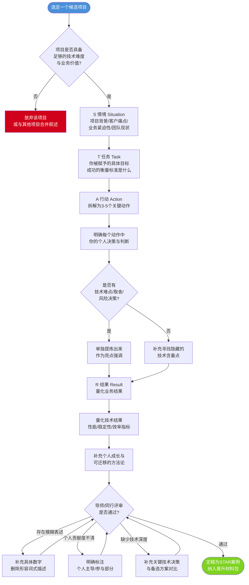
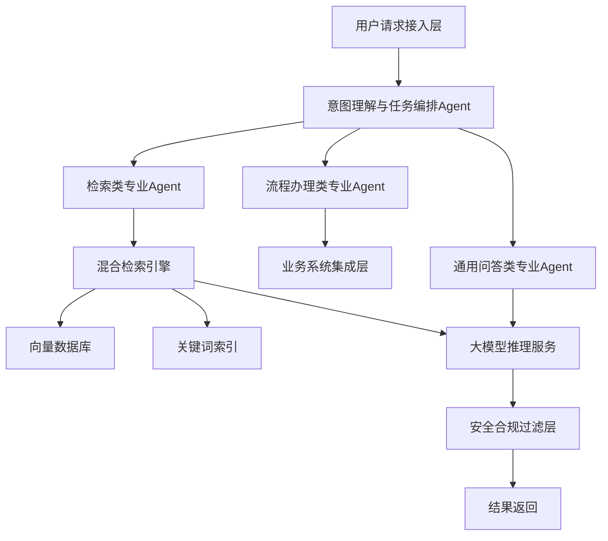

# 第66天:技术影响力与晋升材料准备

> 阶段:S6·旗舰职业篇 | 项目背景:蓬远科技·苍穹企业级智能体中台 | 人物:陈铭(主角)、王振宇(导师,老王)
> 前情:Day65 寰宇集团旗舰项目正式验收通过 | 后续:Day67 晋升答辩前的技术八股准备

---

## 【旁白】

七十天前,陈铭第一次打开工位电脑的时候,屏幕右下角的时间是早上八点五十六分。他记得那天自己对着一份"苍穹企业级智能体中台"的项目介绍文档看了很久,里面全是他没见过的词——RAG、Agent编排、向量检索、多轮对话状态管理。那时候他连"大模型"和"大数据"的边界都分不清楚,写一个Python的类还要翻半天语法书。

七十天后的今天,他坐在同一个工位上,面前摊开的不是入门教程,而是寰宇集团那份厚达四十多页的项目验收报告,报告最后一页盖着甲方的验收公章。旁边的备忘录软件里,记着五个项目的名字:苍穹0.1版对话产品、海纳制造集团RAG项目、祺瑞集团多Agent办公助手、御风金融私有化部署、寰宇集团旗舰项目。这五个名字,串起来就是他这七十天的全部技术生涯。

陈铭自己都没太意识到,这七十天里他到底经历了什么样的跃迁。直到老王在晨会上说出那句话——"HR已经启动你的晋升评审流程了"——他才猛然回过神:原来自己不知不觉间,已经从一个连环境变量都配不利索的技术新人,走到了需要向公司证明"我配得上更高职级"的这一步。

技术人的成长曲线总是这样,你埋头往前走的时候感觉不到坡度,回头一看才发现自己已经爬了很高。但爬得高不代表别人看得见。老王常说一句话:"技术影响力不是你做了多少事,是别人知道你做了多少事,以及别人认可你做这些事的难度。"这句话听起来有点功利,但陈铭渐渐明白,这恰恰是技术人从"完成任务"走向"被组织看见"的必经关卡。

今天,陈铭要做一件他从来没有认真做过的事——不是写代码,不是画架构图,而是给自己这七十天的技术生涯"写一份说明书"。这份说明书,要让不懂技术细节的HR看得懂,要让评审委员会里的其他技术专家认可,还要经得起答辩时的追问。这是一场新的考试,考的不是技术本身,而是"如何让技术被看见,如何让价值被度量"。

这一天,故事从晨会室的白板前开始。

---

## 晨会纪要

**时间**:Day66,上午9:10
**地点**:蓬远科技3号会议室"苍穹厅"
**参会人**:王振宇(导师)、陈铭、HRBP 林晓雯(列席,后段加入)

---

**老王**(端着咖啡杯走进来,脸上带着少见的郑重感):"陈铭,坐。今天开会内容跟以往不太一样,先不聊技术方案。"

**陈铭**(有点意外):"不聊技术?那聊什么,不会是要我请假去出差吧?"

**老王**(笑了一下,把平板电脑推到桌子中间):"比出差重要。昨天下午,HR那边正式给我发了通知——你的晋升评审流程,已经启动了。"

**陈铭**(愣了两秒):"我的……晋升评审?现在?寰宇的项目才刚验收完。"

**老王**:"就是因为寰宇验收完了,时间点正好。你想想,过去七十天你干了什么——从零上手苍穹0.1版对话产品,到海纳制造集团那个RAG项目从0到1落地,再到祺瑞集团的多Agent办公助手,御风金融的私有化部署,最后是寰宇这个旗舰级项目的架构设计和交付。这条线拉出来,任何一个评审委员看了都会觉得,这个人不该还在原来的职级上。"

**陈铭**:"可是……我自己都没觉得这些事有多特别,做的时候就是每天被问题推着走,一个坑一个坑地填过去的。"

**老王**(把咖啡杯放下,身体前倾):"这就是我今天要跟你聊的核心问题。你做了很多事,但你从来没有'讲过'这些事。技术人有个通病,叫'干得漂亮,说得潮湿'——事情做得挺好,但一开口就'哦这个就是接了个RAG接口''这个就是配了下多Agent'。听起来平平无奇,可实际上背后的技术判断、踩过的坑、扛住的压力,外人根本看不见。"

**陈铭**:"所以晋升评审,考的不是我做没做过这些事,是考我'讲不讲得清楚'这些事?"

**老王**:"讲清楚只是第一层。更深一层是,你要证明这些事的'难度系数'和'不可替代性'。评审委员会里坐的不全是技术出身的人,有业务线的VP,有HR负责人,还有跨部门的技术委员代表。他们没时间也没必要去看你的代码仓库,他们要看的是——结构化、可验证、有量化结果的材料。"

（此时,HRBP林晓雯敲门进入,手里拿着文件夹)

**林晓雯**:"老王,陈铭,不打扰吧?我这边把晋升评审的具体材料清单和时间节点带过来了。"

**老王**:"正好,坐。"

**林晓雯**:"陈铭,先跟你说明一下流程。你这次申报的是从P6到P7的技术晋升,按公司规范,需要在两周内提交完整的晋升材料包,材料包会先经过部门内部初审,通过后进入委员会答辩环节,大概是三周后。"

**陈铭**:"材料包具体要包含哪些内容?"

**林晓雯**(翻开文件夹):"标准清单是这样的,我念一下:一,晋升述职PPT,要求包含个人核心项目介绍、技术能力模型自评、未来规划;二,关键项目案例材料,建议用STAR法则整理,至少三到五个代表性项目;三,代码及技术产出证明,包括你负责或主导的仓库、文档、专利或内部技术分享记录;四,同事及合作方评价,这个我们HR会走内部360评估流程,你不用管;五,如果有的话,内部技术分享或外部技术影响力的证明材料,比如你在内部技术周会做过的分享、参与的技术评审会等。"

**陈铭**(边听边在笔记本上记):"这个量……感觉比写一份需求文档还大。"

**林晓雯**(笑):"确实不小,但这也是为什么很多技术能力很强的同事,反而在晋升这一步卡住——不是能力不够,是材料准备的方法不对。我见过太多人把PPT做成了项目周报的合集,一页一页全是截图和代码片段,评委看不到重点,自然打不了高分。"

**老王**:"这也是我今天要陪你一起过一遍的原因。今天咱们的目标很明确,三件事。第一,用STAR法则,把你这七十天里最有代表性的五个项目重新梳理一遍,不是流水账,是要提炼出'情境-任务-行动-结果'的结构,尤其是结果要能量化。第二,把咱们苍穹平台相关的代码仓库——cangqiong-platform,按照规范的开源项目标准整理一遍,包括README、Wiki、文档体系,这既是给评委看的证据,也是给公司留下的技术资产。第三,设计一份技术分享PPT的大纲,这个PPT不光是给晋升答辩用的,以后你要在公司内部技术周会上正式分享一次,这也是林晓雯刚才提到的'内部技术影响力'的证明材料。"

**陈铭**:"三件事听起来都不小,今天一天能弄完框架吗?"

**老王**:"框架今天必须要出来,细节可以后面几天迭代。晋升评审这件事,跟咱们平时做项目一样——先把骨架搭对,再往上填肉。你先把这五个项目在脑子里过一遍,咱们从苍穹0.1版对话产品开始,一个一个用STAR法则拆解。"

**林晓雯**:"我这边补充一句,评审委员会特别看重两点——一是'量化结果',不要写'提升了效率''优化了体验'这种模糊表述,要写具体数字,响应时间从多少降到多少,准确率从百分之多少提升到百分之多少;二是'个人贡献度',尤其是团队项目,一定要讲清楚哪部分是你主导、哪部分是你参与,不要把团队的功劳全部揽在自己身上,也不要谦虚到把自己的功劳都让出去。"

**陈铭**:"明白,量化和个人贡献度是两条红线。"

**老王**:"对。还有一点,林晓雯之前也提过,材料包里技术产出证明这一项,咱们的cangqiong-platform仓库现在是个'内部黑话仓库'——README写得潦草,目录结构东一块西一块,连个清晰的架构说明文档都没有。这不光影响晋升材料的呈现效果,长远看也影响咱们平台在公司内部的技术资产沉淀,不能只有你自己看得懂。今天咱们要把它按正规开源项目的标准重新梳理一遍。"

**陈铭**:"行,那我们现在开始?"

**老王**:"开始。先说个规矩,咱们今天这一天,不写新功能代码,专心把这些'软实力'的东西梳理扎实。这也是每个技术人迟早要过的一关——你可以是最会解决问题的人,但如果没人知道你解决了什么问题,组织没法给你对应的位置。"

**林晓雯**(临走前补充):"对了陈铭,晋升委员会的答辩环节,除了讲PPT,还会有开放性提问,涉及系统设计、技术选型的权衡、团队协作中的冲突处理等等,这部分建议你和老王后面再单独准备一下技术问答的应对策略。"

**陈铭**:"好,谢谢晓雯姐。"

（林晓雯离开会议室)

**老王**:"她说的那部分,咱们放到明天,今天先把材料骨架搭起来。走,拿上电脑,去咱们的项目复盘墙那边,我把白板腾出来,咱们把五个项目一个个过。"

---

## 需求文档

### 文档编号:CQ-CAREER-2026-066
### 文档名称:陈铭P6→P7技术晋升材料准备需求说明

---

#### 一、背景

陈铭自入职蓬远科技以来,历时七十个工作日,先后主导或深度参与了苍穹企业级智能体中台从0.1版本原型到多个标杆客户(海纳制造集团、祺瑞集团、御风金融、寰宇集团)落地交付的全过程。技术负责人王振宇与HRBP林晓雯共同确认,陈铭当前的技术能力与项目贡献已达到P7职级的评审门槛,现启动正式晋升评审流程。本需求文档用于明确本次晋升材料准备工作的范围、标准与验收方式。

#### 二、需求目标

1. 在两周内完成完整的晋升材料包,材料包需满足公司晋升评审委员会的标准格式要求;
2. 通过STAR法则,将陈铭主导或参与的五个代表性项目转化为结构化、可量化、可验证的案例材料;
3. 将cangqiong-platform代码仓库按照企业级开源项目标准进行整理,形成可供评委及跨团队查阅的技术资产;
4. 设计并输出一份技术分享PPT大纲,兼顾晋升答辩与公司内部技术影响力建设两个用途;
5. 建立陈铭个人技术主页草案,作为长期技术影响力沉淀的载体。

#### 三、需求范围

**3.1 晋升材料清单(核心交付物)**

| 序号 | 材料类别 | 具体内容 | 负责人 | 截止时间 |
|---|---|---|---|---|
| 1 | 晋升述职PPT | 个人项目总览、能力模型自评、未来规划,不少于25页 | 陈铭 | Day66+10 |
| 2 | STAR项目案例集 | 5个代表性项目,每个项目按情境-任务-行动-结果四段式结构撰写,附量化数据 | 陈铭(老王评审) | Day66当天完成初稿 |
| 3 | 代码与技术产出证明 | cangqiong-platform仓库README、Wiki、架构文档规范化整理 | 陈铭 | Day66-Day68 |
| 4 | 内部技术分享材料 | 技术分享PPT大纲及后续实际分享记录 | 陈铭 | Day66出大纲,Day70前完成一次实际分享 |
| 5 | 个人技术主页 | 汇总项目经历、技术栈、开源贡献、分享记录 | 陈铭 | Day66出草案 |
| 6 | 360评估材料 | 同事、合作方、下游业务方评价 | HR林晓雯 | 独立流程,不占用陈铭工时 |

**3.2 STAR法则项目案例范围**

本次晋升材料需覆盖以下五个项目,均需按STAR结构撰写,量化指标需附具体数据来源(如监控报表、验收报告、性能测试记录等):

1. 苍穹企业级智能体中台0.1版对话产品(项目初期,展现从零学习与快速上手能力)
2. 海纳制造集团RAG知识库项目(展现RAG工程化落地能力,处理制造业专业术语与多模态文档的技术难点)
3. 祺瑞集团多Agent办公助手项目(展现Agent编排、多角色协作系统设计能力)
4. 御风金融私有化部署项目(展现金融行业高安全合规要求下的私有化交付能力)
5. 寰宇集团旗舰项目(展现架构设计、多团队协作、大型项目端到端交付能力,作为职级跃迁的核心佐证)

**3.3 cangqiong-platform仓库整理规范要求**

- 顶层README.md需包含项目简介、核心特性、快速开始、架构图、目录结构说明、贡献指南、License等标准区块;
- 建立独立的Wiki文档体系,至少覆盖:架构设计文档、部署运维手册、API接口文档、常见问题FAQ、变更日志四大类;
- 仓库目录结构需按功能模块重新组织,避免"一个文件夹装所有东西"的历史遗留问题;
- 提供一份可自动运行的项目统计脚本,用于生成代码行数、提交次数、贡献者活跃度等统计报告,作为技术产出量化证明的辅助材料。

**3.4 技术分享PPT大纲要求**

- 目标受众:公司内部技术周会全员(约60-80人,涵盖不同技术背景);
- 时长控制在30分钟正式分享+10分钟问答;
- 内容需兼顾技术深度与业务价值表达,既要让资深工程师觉得有干货,也要让业务同事听得懂价值所在;
- 大纲需给出每个章节的核心论点与预计时长分配。

#### 四、验收标准

1. STAR案例集经导师王振宇审阅,五个项目均无"表述模糊""缺乏量化数据""个人贡献度不清"三类问题;
2. cangqiong-platform仓库README经陌生人视角测试(找一位未接触过该项目的同事,能否在10分钟内看懂项目定位与快速上手方式);
3. 项目统计脚本可一键运行并生成可读的统计报告;
4. 技术分享PPT大纲经老王与HRBP共同评审通过;
5. 全部材料在两周窗口期内提交至晋升评审系统。

#### 五、风险与约束

- 时间风险:陈铭同时承担寰宇项目收尾支持工作,需合理分配工时,晋升材料准备不占用客户交付的核心响应时间;
- 表达风险:技术人员容易陷入"技术自嗨"式表达,需要老王在评审环节持续纠偏,确保材料对非技术背景评委同样友好;
- 数据风险:部分历史项目的量化数据(如海纳制造集团项目早期阶段的响应时间数据)可能因监控系统迁移而部分缺失,需要陈铭提前排查并寻找替代数据源或估算依据,估算数据需在材料中明确标注为"估算值"。

#### 六、需求变更记录

| 版本 | 日期 | 变更内容 | 变更人 |
|---|---|---|---|
| v1.0 | Day66 | 初版需求文档创建 | 陈铭 |
| v1.1 | Day66下午 | 补充技术分享PPT大纲的时长分配要求 | 王振宇 |

---

## 架构设计图

下图为cangqiong-platform仓库整理后的README/Wiki/Docs文档体系架构,展示各类文档如何分层组织、相互引用,以及如何服务于不同的读者角色(新成员、运维人员、评审委员、外部合作方)。

```mermaid
graph TD
    subgraph 仓库根目录
        A[README.md<br/>项目门户]
        B[CONTRIBUTING.md<br/>贡献指南]
        C[LICENSE]
        D[CHANGELOG.md<br/>变更日志]
    end

    subgraph docs 目录 -- 深度技术文档
        E[architecture.md<br/>架构设计文档]
        F[deployment.md<br/>部署运维手册]
        G[api-reference.md<br/>API接口文档]
        H[faq.md<br/>常见问题]
        I[data-flow.md<br/>数据流转说明]
    end

    subgraph Wiki 知识库 -- 团队协作沉淀
        J[项目背景与决策记录 ADR]
        K[各客户交付案例归档]
        L[排障手册 Runbook]
        M[新人上手指南 Onboarding]
    end

    subgraph scripts 目录 -- 工程化工具
        N[project_stats.py<br/>统计报告生成]
        O[gen_wiki_index.py<br/>Wiki索引生成]
    end

    subgraph 读者角色
        P((新加入工程师))
        Q((运维/SRE))
        R((晋升评审委员))
        S((外部合作方/审计方))
    end

    A --> E
    A --> F
    A --> G
    A --> D
    A --> B

    E --> I
    F --> L
    G --> H

    J --> E
    K --> R
    L --> Q
    M --> P

    N --> A
    O --> J

    P --> A
    P --> M
    Q --> F
    Q --> L
    R --> A
    R --> K
    R --> N
    S --> A
    S --> G

    style A fill:#4a90d9,color:#fff
    style E fill:#f5a623,color:#fff
    style F fill:#f5a623,color:#fff
    style G fill:#f5a623,color:#fff
    style J fill:#7ed321,color:#fff
    style K fill:#7ed321,color:#fff
    style N fill:#bd10e0,color:#fff
```

这张图的核心逻辑,老王在白板上讲解时特别强调了一点:"文档不是写完就完事,文档是有'读者画像'的。新人来了要看README和Onboarding,运维要看部署手册和排障手册,评审委员要看架构文档和客户案例归档,外部合作方审计的时候要看API文档和License。你如果把所有内容一股脑塞进一个README里,谁都看得累。"

---

## 流程图

下图展示了用STAR法则整理项目经历的标准方法论流程,这是陈铭今天上午要反复练习的核心方法。



---

## 示意图

下图以示意方式展现陈铭七十天以来的技术能力成长曲线,从Python基础语法学习起步,经历RAG工程化、Agent多智能体系统、模型微调与私有化部署,最终走到企业级架构设计能力,曲线呈现明显的阶梯式跃迁特征而非线性增长。

```mermaid
graph LR
    subgraph 阶段一 Day1-Day10 基础筑基
        A1[Python核心语法]
        A2[数据结构与算法思维]
        A3[Git协作与工程规范]
    end

    subgraph 阶段二 Day11-Day25 大模型应用入门
        B1[Prompt工程]
        B2[LangChain基础]
        B3[向量数据库入门]
        B4[苍穹0.1版对话产品]
    end

    subgraph 阶段三 Day26-Day40 RAG工程化
        C1[文档解析与切片策略]
        C2[混合检索与重排序]
        C3[海纳制造集团RAG项目]
    end

    subgraph 阶段四 Day41-Day55 多Agent系统
        D1[Agent角色设计]
        D2[多Agent通信协议]
        D3[祺瑞集团办公助手项目]
    end

    subgraph 阶段五 Day56-Day63 微调与私有化部署
        E1[模型微调LoRA]
        E2[私有化部署与安全合规]
        E3[御风金融项目]
    end

    subgraph 阶段六 Day64-Day66 架构设计与旗舰交付
        F1[大型系统架构设计]
        F2[多团队协同交付]
        F3[寰宇集团旗舰项目]
        F4[技术影响力沉淀]
    end

    A1 --> A2 --> A3 --> B1
    B1 --> B2 --> B3 --> B4
    B4 --> C1 --> C2 --> C3
    C3 --> D1 --> D2 --> D3
    D3 --> E1 --> E2 --> E3
    E3 --> F1 --> F2 --> F3 --> F4

    style A1 fill:#d5e8f7
    style B4 fill:#4a90d9,color:#fff
    style C3 fill:#4a90d9,color:#fff
    style D3 fill:#4a90d9,color:#fff
    style E3 fill:#4a90d9,color:#fff
    style F3 fill:#f5a623,color:#fff
    style F4 fill:#7ed321,color:#fff
```



老王在讲解这张图的时候补了一句:"你看这条线,每个阶段末尾那个'蓹上色的项目节点',其实就是你能力'确认落地'的标志。技术能力不是学完一个知识点就算数,是要在真实项目里跑一遍、扛住压力、拿到结果,才算真正'长'在你身上。晋升评审看的也是这个——不是你知道多少,是你在多难的情境下证明过自己知道的东西能打。"

---

## 课堂笔记

### 上午:STAR法则整理关键项目经历实战

老王把陈铭带到项目复盘墙前,墙上贴着七十天以来陆陆续续攒下的便签、里程碑照片和几张打印出来的验收报告封面。他从桌上抽出一张白纸,在最上面写下四个大字母:S、T、A、R。

"陈铭,咱们先把这个方法论说透,再一个一个项目过。"老王说,"STAR法则不是什么新鲜东西,几乎所有大厂的晋升答辩、面试评估都在用它,但十个人里有八个用不好,原因很简单——大部分人写STAR的时候,把'情境'写成了'我们公司是做什么的',把'任务'写成了'我要完成一个项目',把'行动'写成了技术名词堆砌,把'结果'写成了'效果不错,客户很满意'。这四段每一段都写虚了,合起来就是一份典型的'水材料'。"

**情境(Situation)怎么写才对**

老王强调,情境部分的核心任务是让评委在30秒内理解"这件事为什么难、为什么重要"。他给出了一个判断标准:一个好的情境描述,应该同时回答三个问题——业务背景是什么(客户是谁,要解决什么痛点)、技术现状是什么(当时团队/系统处于什么水平)、紧迫性体现在哪(为什么这件事不能拖,拖了会怎样)。

"你写'海纳制造集团需要一个RAG系统',这不是情境,这是任务的一句话概括。你得写清楚——海纳制造集团是一家什么规模的企业,他们原来的知识检索方式是什么样的(比如工程师查阅设备手册要靠人工翻纸质文档或者在几十个共享文件夹里搜索),这种方式造成了什么具体的业务损失(比如平均一次设备故障排查要多花两个小时去找对应的维修手册),以及为什么是现在这个时间点要解决(比如他们在做数字化转型的KPI考核,或者出现过因为查不到关键文档导致的安全事故)。这些细节堆上去,评委才能感受到'这件事不好办'。"

陈铭若有所思地点头:"所以情境部分,其实是在给后面的'结果'埋价值感的种子——情境越具体、越有痛感,后面结果的分量才越重。"

"对喽。"老王满意地敲了敲桌子,"接着说任务。"

**任务(Task)怎么写才对**

"任务部分最容易犯的错,是把'我做了什么'当成了'我的任务是什么'。任务应该是目标和衡量标准,不是行动本身。比如你不能写'我的任务是搭建RAG系统',你要写'我的任务是在六周内为海纳制造集团搭建一套支持十万级设备手册文档的智能检索系统,要求检索准确率达到业务方设定的可用线,并且要在他们现有的老旧内网环境里跑起来'。你看,这里面有时间约束、有规模约束、有质量约束、有环境约束——这才是一个完整的任务定义。"

陈铭在笔记本上快速记录着,忽然停下来问:"老王,如果当时其实没有人明确给我下这么精确的任务指标,是我自己后来倒推出来的,这样写算不算'编造'?"

老王摇头:"不算编造,这叫'结构化复盘'。你当时可能只是被交代'搞一个知识库出来',具体的准确率、时间线这些约束条件,是隐性存在于业务需求和项目排期里的,你现在要做的是把这些隐性约束显性化、量化。但前提是——你写的这些约束,必须是真实存在过的,不能是你现在凭空拍脑袋加上去的数字。如果实在没有精确数字,那就写清楚这是'事后根据项目排期和业务方反馈推算的合理指标',千万别不打招呼就编一个假数字上去,这个东西一旦在答辩现场被追问细节,你圆不回来,信任就崩了。"

**行动(Action)怎么写才对**

"行动部分是整份材料里技术含量最集中的地方,也是最容易写成'技术名词堆砌大赛'的地方。"老王说,"很多人写行动,就是'我使用了LangChain搭建了检索链,使用了BGE模型做embedding,使用了Rerank模型做重排,最后接入了大模型生成答案'。这段话技术名词都对,但评委看完什么都没记住,因为里面没有'你的判断'。"

"什么叫'你的判断'?"陈铭问。

"就是在多个可选方案里,你为什么选了这一个,放弃了那些。比如,你完全可以写——'在方案选型阶段,我评估了直接使用稠密向量检索的方案,但测试发现制造业设备手册里大量存在型号编号、参数表格这类结构化程度很高的内容,纯语义检索在这类内容上的召回效果不理想,准确率只有六成出头,于是我改为采用稠密检索加关键词检索的混合检索策略,并针对表格类内容单独设计了结构化解析与切片规则,把这部分的召回准确率提升到了九成以上'。你看,这段话里有你的判断、你发现的问题、你做出的权衡、以及权衡带来的结果。这才是有技术含量的行动描述。"

陈铭想了想自己五个项目里的技术决策,忽然意识到自己确实做过很多类似的取舍,只是从来没有专门把它们提炼出来讲过。

老王又补充道:"行动部分建议控制在三到五个关键动作,不要面面俱到把项目里做的所有事情都列出来,那样反而稀释了重点。挑那些'最体现你技术判断力'和'最有难度'的三到五件事,详细展开,其他的一句话带过就行。"

**结果(Result)怎么写才对**

"结果是整个STAR结构里分量最重的一段,但也是最容易写虚的一段。"老王的语气加重了些,"你不能写'系统上线后效果很好,客户很满意',这句话信息量是零。你要写具体数字——上线前和上线后的对比数据是什么,业务侵蚀率下降了多少,响应时间从多少降到多少,客户续约金额或者扩容采购金额有没有增加,内部团队因为这套系统减少了多少人力投入。"

"结果部分我建议分三层来写。第一层是业务结果,这个是给非技术背景评委看的,比如'客户的设备故障平均排查时间从原来的两小时缩短到二十分钟以内,一年下来预计为客户节省停机损失数百万元';第二层是技术结果,这个是给懂技术的评委看的,比如'系统整体检索准确率达到92%,平均响应延迟控制在1.5秒以内,支持并发查询数从个位数提升到两位数';第三层是个人成长与方法论沉淀,这个是给评委看你'有没有把经验转化为可复用能力'的,比如'这次项目中沉淀的混合检索与结构化文档解析方案,后来被复用到了祺瑞集团和御风金融的项目里,节省了后续项目大约三分之一的检索模块开发时间'。"

陈铭把这三层结构完整地记在笔记本上,画了一个简单的三角形标注"业务-技术-方法论"。

**开始逐一梳理五个项目**

老王拿起白板笔:"好,方法论讲完了,咱们现在一个一个来。先从苍穹0.1版对话产品开始,这是你入职最初的项目,虽然技术深度不算最高,但很能体现你'从零快速学习'的能力,这个能力在晋升材料里同样重要,尤其是评委里如果有人关心'这个人有没有持续学习的潜力',这个项目就是最好的证据。"

**项目一:苍穹0.1版对话产品**

陈铭开始口述,老王在白板上帮他记录关键词,时不时打断纠正。

情境:陈铭刚入职蓬远科技时,苍穹企业级智能体中台还处于概念验证阶段,团队需要在极短时间内搭建出一个可以对外演示的对话产品原型,用于向公司管理层和潜在客户展示技术可行性,证明公司在企业级智能体方向上具备落地能力。当时团队人手紧张,陈铭作为新人被直接推上前线参与核心功能开发,而他此前对大模型应用开发几乎是零基础。

任务:在两周内,配合团队完成一个具备基础多轮对话能力、能够接入企业内部知识、并且有基础的意图识别与追问澄清能力的对话产品原型,要求能够支撑一次面向管理层的现场演示,演示过程中不能出现明显的对话逻辑断裂或者答非所问的情况。

行动:陈铭首先用三天时间高强度补齐了Python工程化开发的基础能力,包括类的设计、异常处理、日志规范等,这部分老王在最初给他安排了专门的代码评审环节,逐行纠正他的编码习惯。随后,陈铭主导完成了对话产品中"多轮上下文管理模块"的开发,这个模块负责在多轮对话中维护用户的历史意图和已提取的关键信息,避免大模型在长对话中"失忆"或者重复提问已经回答过的问题。在开发过程中,陈铭发现直接把全部历史对话拼接进prompt会导致token消耗过快、且当对话轮次超过十轮之后大模型的注意力会明显分散,于是他设计了一套"滑动窗口+关键信息摘要"的上下文压缩策略,只保留最近三轮的完整对话原文,更早的对话内容通过摘要方式压缩后保留在上下文中。这个方案是陈铭在查阅资料并和老王多次讨论后确定的,期间也尝试过完全依赖模型自带的长上下文能力,但测试发现在当时可用的模型条件下,直接依赖长上下文的方案响应延迟明显更高,且成本也更高,综合权衡后选择了压缩策略。

结果:该对话产品原型在两周期限内如期完成,现场演示中连续进行了十五轮左右的多轮对话测试,没有出现对话逻辑断裂或重复提问的情况,管理层现场对系统的连贯性给予了积极反馈,这次演示也直接促成了公司决定加大对苍穹平台的资源投入,项目组随后扩编。对陈铭个人而言,这是他第一次完整体验从"技术小白"到"能独立承担核心模块开发"的转变,他所设计的上下文压缩策略后续也成为苍穹平台早期版本对话引擎的标准组件之一,被沿用了相当长一段时间。

老王在陈铭讲完之后点评道:"这个项目你讲得已经不错了,但我要提醒你一点——在晋升材料里,这个项目建议放在'成长曲线证明'的位置,而不是'技术深度证明'的位置。你不需要在这个项目上过多纠结技术细节的展开,重点是要让评委感受到'这个人上手速度快、学习能力强、而且第一次做核心模块开发就能扛住压力交付'。这五个项目要分工明确,不能每个都想着面面俱到。"

**项目二:海纳制造集团RAG项目**

陈铭调整了一下坐姿,开始讲第二个项目,这个项目他明显更熟悉,讲述的时候语速都快了不少。

情境:海纳制造集团是一家大型装备制造企业,旗下有多个生产基地,设备种类繁杂,现场工程师在设备出现故障时,需要查阅设备手册来定位故障原因和维修方案。原有的做法是工程师在几十个不同版本、格式各异的PDF手册和Excel表格里手动搜索关键词,平均一次故障排查中用于查找资料的时间接近两个小时,严重影响生产线的停机损失。海纳集团在推进数字化转型的过程中,明确提出希望引入智能检索系统来缩短这个环节的耗时,这也是蓬远科技当时争取到的第一个制造业标杆客户项目,对公司在这个行业的口碑树立意义重大。

任务:陈铭作为该项目的核心研发之一(项目整体由老王统筹,陈铭负责RAG检索链路的设计与实现),需要在六周内完成一套支持十万级设备手册文档规模的智能问答检索系统,要求检索准确率达到业务方设定的可用标准(内部约定的验收线是不低于85%的准确率),并且系统需要部署在客户现场相对老旧的内网环境中,不能依赖公网调用外部API。

行动:陈铭首先对海纳集团提供的文档样本进行了详细分析,发现这些设备手册里存在大量结构化程度很高的内容——型号参数表、故障代码对照表、维修步骤编号列表,如果直接用通用的文本切片方式(比如固定长度滑动窗口切片),会把一张完整的参数表切成好几段毫无意义的碎片,导致检索时召回的内容支离破碎。针对这个问题,陈铭设计了一套"结构感知的文档解析策略",在文档预处理阶段先识别出表格、列表等结构化区块,对这些区块采用整体保留或者按行意义保留的切片方式,而对普通段落文本采用语义边界切片。这一步骤把表格类内容的检索召回准确率从最初测试的六成左右提升到了九成以上。

其次,陈铭在检索策略上做了关键的技术决策:最初团队计划完全依赖稠密向量检索,但陈铭在测试中发现制造业术语和型号编号存在大量"专有名词精确匹配"的检索需求(比如工程师直接搜索一个具体的故障代码"E-2073"),而稠密向量检索对这类短、精确、低语义信息量的查询效果并不理想。因此陈铭主导引入了BM25关键词检索与稠密向量检索的混合检索策略,并设计了一套基于查询类型的动态权重调整机制——当检测到查询中包含明显的编号、代码格式的关键词时,提高关键词检索的权重占比;当查询是自然语言描述性问题时,提高语义检索的权重占比。这个方案是团队内部经过两轮方案对比测试后确定的,对比测试数据显示混合检索相比纯语义检索,整体准确率提升了约15个百分点。

第三,由于客户现场环境不能联网调用外部服务,陈铭需要负责整套RAG链路的私有化部署适配工作,包括本地化部署向量数据库、本地化部署Embedding模型和Rerank模型,并针对客户现场硬件资源有限的情况,对模型进行了量化处理以降低显存占用,同时优化了批处理逻辑以提升有限硬件条件下的吞吐能力。

结果:项目最终交付的系统整体检索准确率达到92%,超出验收标准7个百分点,平均查询响应时间控制在1.5秒以内。上线后三个月的跟踪数据显示,海纳集团现场工程师的平均故障资料查找时间从原来的两小时左右缩短到二十分钟以内,单次故障排查整体耗时因此显著缩短,按照客户方内部估算,一年下来因为停机时间缩短带来的直接经济价值预计超过数百万元。这个项目也让蓬远科技在制造业智能化领域树立了标杆案例,后续帮助公司拿下了另外两家同行业客户的合同。对陈铭个人而言,这个项目让他真正掌握了RAG系统工程化落地的完整方法论,尤其是"结构感知文档解析"和"动态权重混合检索"这两个技术方案,后来被沉淀为苍穹平台的标准能力模块,复用到了后续多个项目中。

老王听完点了点头:"这个项目讲得很扎实,量化数据也齐全。但我建议你在最后结果部分,再加一句话,强调一下这个方案后来被复用的情况,这个点非常重要——它证明你做的不是'一次性交付',而是'可复用的技术资产',这对晋升评审来说是加分项,说明你的产出具备平台化价值,不是每次都从零开始。"

陈铭立刻在笔记本上补充了这一点。

**项目三:祺瑞集团多Agent办公助手项目**

老王喝了口咖啡:"接着说第三个,祺瑞集团那个多Agent项目,这个项目技术难度和创新性都比前两个更高,是你晋升材料里的重点项目之一。"

情境:祺瑞集团是一家综合性集团企业,内部涉及多个业务条线,包括行政审批、财务报销、人事流程、会议协同等,员工日常需要在多个独立系统之间来回切换才能完成一件简单的行政事务,比如一次出差申请可能需要先在OA系统填审批单,再在财务系统查预算,再在邮件系统里跟相关方沟通确认,操作链路冗长且体验割裂。祺瑞集团希望引入一个统一的智能办公助手,能够以自然语言交互的方式,自动理解员工意图并跨系统完成任务编排,而不是简单的问答机器人。这对当时的苍穹平台而言是一次能力上的重大跃迁——从"单一RAG问答"走向"多Agent任务编排"。

任务:陈铭在这个项目中承担了多Agent系统架构设计与核心编排逻辑开发的主要职责,需要在八周内设计并实现一套支持至少五类典型办公场景(出差申请、报销审批、会议安排、文档协同、人事咨询)的多Agent协同系统,要求系统能够正确识别用户的复合意图(比如"帮我安排下周去上海出差,顺便把机票报销单也一起提交"这种一句话里包含多个子任务的请求),并将其拆解、分配给对应的专业Agent执行,同时要保证各Agent之间的信息传递准确、不丢失上下文。

行动:陈铭首先面临的第一个关键决策是Agent的组织架构设计——是采用完全平权的多个Agent互相协商的模式,还是采用"主控Agent+专业子Agent"的层级模式。陈铭和团队进行了充分的方案论证,最终选择了后者:设计了一个"意图理解与任务编排Agent"作为主控,负责接收用户输入、拆解复合意图、生成执行计划,并将计划中的子任务分发给对应的专业Agent(如出差Agent、报销Agent、会议Agent、文档Agent、人事Agent);每个专业Agent只需要专注处理自己领域内的任务,通过标准化的消息协议与主控Agent通信。之所以放弃平权协商模式,是因为在前期原型测试中发现,平权模式下多个Agent之间容易出现"重复确认""互相等待""决策权不清"等问题,导致响应延迟大幅增加且结果不可控,而层级模式在可控性和可调试性上明显更优,这也更符合企业级场景对稳定性的高要求。

第二个关键行动是设计了Agent间通信的标准化消息协议,定义了任务分发消息、执行结果回传消息、异常上报消息等标准格式,并引入了"任务执行状态机"来追踪每个子任务从分发、执行、到完成或失败的完整生命周期,这个状态机设计解决了此前原型阶段"任务执行到一半系统卡死却不知道卡在哪个Agent"的调试难题。

第三个关键行动是针对复合意图理解的准确率问题,陈铭设计了一套"意图拆解+执行计划生成"的两阶段Prompt策略,并引入了少量高质量的示例(few-shot)来提升大模型在复合意图拆解任务上的稳定性,同时为了应对大模型偶尔生成不合法执行计划(比如引用了不存在的Agent能力)的问题,增加了执行计划的合法性校验环节,在计划真正下发执行前先做一轮语法与语义层面的校验,校验不通过则触发重新生成,这个环节显著降低了因大模型幻觉导致的任务执行失败率。

结果:系统最终上线支持了六类典型办公场景(比原计划多出一类,后期根据客户反馈追加了"通用咨询转人工"场景),复合意图识别与任务拆解的准确率达到88%,较项目初期原型阶段的62%有大幅提升。上线后祺瑞集团内部员工日常行政事务处理的平均耗时,根据客户侧的抽样调研,从原来平均每次跨系统操作耗时十几分钟,缩短到平均三到五分钟以内完成大部分常见场景,员工满意度调研分数明显提升。这个项目也是苍穹平台第一次成功落地的完整多Agent协同系统,项目中沉淀的"主控-子Agent"架构模式和标准化通信协议后来被写入了苍穹平台的技术规范文档,成为后续所有涉及多Agent场景项目的默认架构选型参考。

老王打断补充:"这里有个细节要在材料里明确写出来——你们最初考虑过平权协商模式但放弃了,这个'技术决策的取舍过程'一定要写进去,不要只写最终选定的方案。评委很在意候选人是否具备'多方案权衡能力',而不是'只知道一种做法'。"

**项目四:御风金融私有化部署项目**

陈铭喘了口气,继续讲第四个项目。

情境:御风金融是一家持牌金融机构,对数据安全与合规性的要求极为严格,按照监管要求,核心业务数据不允许出域,更不允许调用任何公网大模型API,所有的AI能力必须完全私有化部署在客户自己的机房环境内,且需要满足金融行业等级保护相关的安全审计要求。此前苍穹平台的项目大多依赖一定程度的云端能力或混合部署模式,御风金融项目是公司第一次面临"从模型到应用全链路完全私有化、且要通过金融行业安全审计"的高强度合规交付要求,项目失败的后果不仅是丢掉客户,还可能影响公司在金融行业的整体信誉。

任务:陈铭在此项目中主要负责私有化部署架构设计与安全合规适配工作,需要在客户完全隔离的内网环境中,完成大模型推理服务、向量检索服务、业务应用层的全套部署,并配合客户完成安全审计所需的技术文档准备和现场安全测试,整体时间窗口为十周,其中留给纯技术部署和调优的时间只有六周,剩余时间用于安全审计配合与问题整改。

行动:陈铭首先梳理了客户机房的硬件资源情况,由于是金融行业客户,硬件采购流程慢且资源相对受限,陈铭需要在有限的GPU资源下,同时满足推理服务的响应延迟要求和吞吐量要求,他主导完成了大模型的量化压缩与推理框架选型工作,对比测试了几种主流推理加速方案后,最终选择了一套在客户提供的硬件条件下综合表现最优的推理引擎组合,并针对金融业务场景常见的长文本合同分析类请求,做了专门的批处理与显存管理优化,使得在有限硬件资源下的并发处理能力提升了约一倍。

第二个关键行动是安全合规适配,陈铭配合公司安全团队完成了包括数据传输全链路加密、访问权限最小化控制、操作全流程审计日志、模型输出内容合规过滤等多项安全机制的设计与实现,其中"操作全流程审计日志"这一项是陈铭主导设计的,他设计了一套贯穿从用户请求进入到大模型调用到最终结果返回的全链路日志追踪机制,确保任何一次AI能力的调用都可以被完整追溯,这个设计后来在客户安全审计现场,被审计方特别提及为"链路可追溯性做得比较到位"的加分项。

第三个关键行动是在客户内部进行了两轮模拟安全渗透测试自查,提前发现并修复了若干潜在的安全隐患(比如早期版本中存在的接口鉴权粒度过粗的问题),避免了在正式审计中被暴露出重大问题的风险。

结果:项目最终顺利通过了御风金融的内部安全审计与监管层面的合规检查,是公司在金融行业完全私有化部署场景下的第一个成功案例,推理服务在客户有限硬件资源条件下实现了满足业务要求的响应延迟(核心场景平均响应时间在3秒以内)与并发能力,整体项目按期交付,没有因为安全问题导致的延期。这个项目直接为公司打开了金融行业私有化部署这个新的业务方向,后续公司陆续接触到的另外三家金融机构潜在客户,在早期技术方案沟通阶段都直接参考了这个项目沉淀下来的私有化部署安全合规标准方案,大幅缩短了后续项目的方案设计周期。对陈铭个人而言,这个项目让他第一次完整经历了"技术方案要同时满足性能、成本、合规三重约束"的复杂权衡过程,这也是他技术能力从"功能实现"走向"架构级权衡"的重要跃迁节点。

老王评价:"这个项目最大的亮点是'合规'这个维度,这是很多纯技术背景的候选人材料里比较缺乏的维度,评委里如果有偏业务或者偏风控背景的人,看到这个项目会格外有共鸣,记得在PPT里给这个项目一个相对独立的位置,别把它和纯技术项目混在一起讲。"

**项目五:寰宇集团旗舰项目**

最后一个项目,陈铭讲得格外郑重,毕竟这是刚刚在Day65验收通过、还带着热乎气儿的项目。

情境:寰宇集团是一家业务版图覆盖多个子行业的大型集团企业,此次合作项目是公司迄今为止规模最大、涉及部门最多、技术复杂度最高的旗舰级项目,项目范围横跨知识检索、多Agent协同、跨系统集成、私有化部署等此前多个项目积累的技术能力,同时还首次引入了需要陈铭主导进行整体架构设计的要求——不再是承担某个模块的开发,而是需要对整个系统的技术架构负全责。项目周期长、涉及甲方多个业务部门的诉求协调、还涉及公司内部多个技术团队的协同配合,项目一旦出现架构层面的失误,后期返工成本极高,对公司在大型集团客户领域的口碑影响也会是决定性的。

任务:陈铭作为该项目的技术负责人(在老王的整体统筹和把关下),需要主导完成寰宇集团旗舰项目的整体技术架构设计,协调公司内部包括RAG团队、Agent团队、部署运维团队、安全团队等多个小组的协同配合,确保项目在既定的十二周周期内完成开发交付,并通过甲方组织的正式验收,验收标准涵盖功能完整性、性能指标、安全合规、以及甲方多个业务部门代表参与的现场演示评审。

行动:陈铭在项目启动阶段,首先主导完成了整体技术架构的设计工作,这次他面临的核心挑战是如何把此前在不同项目中分别验证过的技术能力——海纳项目的RAG检索能力、祺瑞项目的多Agent编排能力、御风项目的私有化部署与安全合规能力——整合到一套统一的架构体系里,而不是简单拼接。他设计了一套分层架构,底层是统一的模型服务与检索服务层,中间是标准化的Agent编排层,上层是面向不同业务场景的应用层,并为每一层都设计了清晰的接口契约,确保后续不同团队可以并行开发而不互相阻塞。这个架构设计方案经过了公司内部技术委员会的评审,期间也吸收了评审专家提出的关于服务层容错设计的建议,补充了熔断降级机制。

第二个关键行动是项目执行过程中的跨团队协同管理,陈铭建立了一套每周技术对齐机制,牵头组织各团队负责人对齐进度和接口变更情况,并针对项目中期出现的一次因为接口契约理解不一致导致的集成延期风险,及时组织了专项攻关会议,重新梳理并固化了接口文档,避免了风险进一步扩大。

第三个关键行动是在项目临近验收阶段,陈铭主导完成了整体系统的压力测试与稳定性加固工作,针对甲方现场演示环节可能出现的高并发访问场景,提前进行了模拟压测,发现并修复了若干在高并发条件下才会暴露的资源竞争问题,确保了正式验收现场演示的稳定运行。

结果:项目最终在十二周周期内如期完成交付,通过了甲方组织的正式验收,验收报告中甲方明确认可了系统在功能完整性、性能表现和安全合规方面的达标情况,系统整体响应性能、并发处理能力均达到或超过合同约定的验收指标。这个项目是公司迄今为止在大型集团客户领域交付的最大规模项目,也直接确立了苍穹平台在同类竞品中的技术领先地位,为公司后续争取更多大型集团客户提供了标杆案例支撑。对陈铭个人而言,这个项目是他从"技术执行者"到"技术架构负责人"的关键跃迁,他第一次完整经历了从架构设计、跨团队协同、到风险控制的全流程负责人角色,也是他此次申报晋升的核心支撑项目。

老王听完,沉默了几秒,然后说:"这个项目的分量,你自己应该也感觉到了。这五个项目摆在一起,评委看的不是你做了五件事,是你能力曲线的斜率——从苍穹0.1版的'快速学习者',到海纳项目的'RAG工程能力',到祺瑞项目的'系统设计能力',到御风项目的'架构级权衡能力',最后到寰宇项目的'技术负责人角色'。这条线一路往上走,而且每一步都有真实的量化结果支撑,这才是最有说服力的晋升材料。"

**常见错误与老王的三条修改建议**

老王把白板上的内容拍照存档后,总结了三条他见过最多的STAR材料常见错误,让陈铭记下来作为后续自查清单:

第一条,情境部分写得太抽象,变成了"公司业务发展需要"这种放在哪个项目上都适用的空话,一定要写出这个项目独有的、具体的业务痛点和技术现状,越具体越有说服力。

第二条,行动部分变成了技术名词的罗列,没有体现出"你的判断"。判断的核心标志是"我评估了A方案和B方案,因为什么原因选择了B方案",如果材料里全篇都是"我用了什么什么技术做了什么什么",没有任何一处出现"我为什么这么选",这份材料就是在堆砌技术名词而不是展示技术能力。

第三条,结果部分缺乏量化或者量化维度单一。老王特别强调,一份好的结果描述应该同时包含业务结果、技术结果、个人成长/方法论沉淀这三层,只写技术指标的材料,会让不懂技术的评委觉得"跟我有什么关系";只写业务结果不写技术结果的材料,会让懂技术的评委觉得"这技术含量在哪";只有前两层没有第三层的材料,会让评委觉得"这个人做完项目就完了,没有沉淀复用能力,潜力有限"。

陈铭把这三条建议认真抄在笔记本最显眼的位置,准备回去后逐一对照检查五个项目的STAR初稿。

---

### 下午:GitHub仓库整理规范 + 技术分享PPT大纲设计

吃过午饭,老王和陈铭换到了另一个更小的会议室,桌上摆着两台笔记本电脑,一台打开着cangqiong-platform的代码仓库,另一台打开着空白的PPT编辑软件。

**仓库整理规范:从"能跑就行"到"专业资产"**

老王先打开仓库首页,页面上只有一个简单的README,标题是"苍穹平台",下面跟着几行零散的安装命令,连基本的项目介绍都没有。

"你自己看看这个README,如果你是第一次接触这个项目的新人,或者是评委临时想看看你的技术产出,打开这个页面你能获得什么信息?"老王问。

陈铭有点不好意思:"确实……什么都看不出来,连这个项目是干什么的都得靠猜。"

"这就是典型的'内部人视角'陷阱。"老王说,"你天天泡在这个项目里,觉得所有东西都是理所当当然的,但外部视角的人打开这个仓库,面对的是完全的信息真空。一个专业的开源项目级README,至少要包含以下几个标准区块,咱们对着讲一遍。"

老王在纸上列出了一份清单:

第一,项目徽章区(Badges),放在README最顶部,展示构建状态、测试覆盖率、License类型、版本号等信息,虽然是很小的一块内容,但能第一眼传达"这是一个规范维护的工程项目"的印象。

第二,项目简介(Introduction),用两到三段话说清楚"这个项目是什么、解决什么问题、和市面上同类方案比有什么差异化优势",这部分要写得让完全不懂技术的人也能大致理解项目的价值。

第三,核心特性(Features),用列表形式列出项目的核心能力点,每一条尽量简短有力,比如"支持多轮对话上下文压缩管理""内置混合检索策略,支持关键词与语义检索动态融合""标准化多Agent通信协议,支持横向扩展新的专业Agent"。

第四,架构图(Architecture),放一张整体架构示意图,让读者对系统的模块划分和数据流转有直观认识,这部分建议直接嵌入Mermaid图或者图片。

第五,快速开始(Quick Start),这是决定"陌生人能不能在十分钟内跑起来这个项目"的关键区块,需要包含环境依赖说明、安装命令、最小可运行示例代码、以及运行后的预期效果说明。

第六,目录结构说明(Project Structure),用树状结构展示仓库的目录组织方式,并对每个核心目录做一句话说明。

第七,配置说明(Configuration),说明关键的配置文件和环境变量,尤其是涉及模型选择、密钥配置、部署环境切换等常见的配置项。

第八,贡献指南链接(Contributing),指向单独的CONTRIBUTING.md文件,说明代码提交规范、分支管理策略、代码评审流程等。

第九,变更日志链接(Changelog),指向CHANGELOG.md,记录版本迭代历史。

第十,License与致谢(License & Acknowledgements)。

"这十个区块不是每个项目都必须一个不少,但核心的简介、快速开始、架构图、目录结构这四块,是硬性要求,少了任何一块,这个README就不算专业。"老王说。

**目录结构的重新组织**

陈铭打开仓库当前的目录结构给老王看,里面确实是"一个文件夹装天下"的典型历史遗留问题——所有的Python文件都堆在一个叫`src`的文件夹里,没有按功能模块细分,配置文件、测试文件、脚本文件也散落在各个角落,没有统一的组织逻辑。

老王和陈铭一起商定了新的目录结构方案,按照功能模块重新划分:

```
cangqiong-platform/
├── README.md
├── CONTRIBUTING.md
├── CHANGELOG.md
├── LICENSE
├── requirements.txt
├── docs/
│   ├── architecture.md
│   ├── deployment.md
│   ├── api-reference.md
│   ├── faq.md
│   └── data-flow.md
├── src/
│   ├── retrieval/          # RAG检索模块
│   ├── agent/              # 多Agent编排模块
│   ├── context/            # 对话上下文管理模块
│   ├── security/           # 安全合规模块
│   └── deployment/         # 部署适配模块
├── scripts/
│   ├── project_stats.py
│   └── gen_wiki_index.py
├── tests/
└── wiki/
    ├── adr/                # 架构决策记录
    ├── case-studies/       # 客户交付案例归档
    ├── runbook/            # 排障手册
    └── onboarding/         # 新人上手指南
```

"这个目录结构一目了然的好处是,任何人看到`src`目录下的五个子模块名字,就能大致猜出这个平台的核心能力构成,这本身就是一种无声的文档。"老王说。

**Wiki文档体系:比README更深一层的知识沉淀**

老王强调,README解决的是"让人快速了解和跑起来项目"的问题,但真正体现团队技术深度和历史决策沉淀的,是Wiki文档体系。他建议按四个大类组织Wiki:

架构决策记录(ADR,Architecture Decision Record),用于记录项目历史上每一次重大技术选型背后的决策过程,比如"为什么放弃平权多Agent协商模式,选择主控-子Agent层级模式"这类决策,都应该单独写一篇ADR文档,记录决策背景、考虑过的备选方案、最终决策理由、以及决策的影响范围。这类文档的价值在于,几个月甚至几年后,当有人质疑"为什么当初这么设计"的时候,团队不需要凭记忆回答,直接翻ADR文档就有据可查。

客户交付案例归档(Case Studies),把每一个客户项目的交付过程、遇到的技术难点、解决方案都归档下来,这既是团队的知识资产,也是陈铭此次晋升材料里"代码与技术产出证明"的重要补充材料——评委完全可以直接从Wiki里看到项目交付的真实痕迹,而不只是听陈铭口头描述。

排障手册(Runbook),记录系统运行过程中常见的故障现象、排查步骤和处理方法,这类文档主要服务于运维和值班同学,减少对核心研发人员的依赖。

新人上手指南(Onboarding),从新人第一天入职的视角出发,写清楚环境搭建步骤、代码仓库导览、常见开发工具配置等,老王开玩笑说:"你要是当时入职第一天就有这么一份Onboarding文档,能少踩多少坑。"

陈铭听完深有感触:"确实,我入职第一周光是搞明白项目里各种环境变量的含义,就花了不少时间,当时要是有这么一份文档,能省不少事。"

老王说:"这也是技术影响力的另一层含义——你留下的东西,能不能让后来的人少走弯路。这也是评委在评估'技术资产沉淀能力'时很看重的一点。"

**Commit规范与版本管理**

老王还特别提到了commit规范的重要性:"你去看看现在仓库里的commit记录,有多少条是'修复bug''update''fix'这种毫无信息量的提交说明?"

陈铭打开commit历史看了看,苦笑了一下:"是不少。"

老王建议引入约定式提交规范(Conventional Commits),用统一的前缀标注每次提交的类型,比如`feat:`表示新增功能,`fix:`表示修复缺陷,`docs:`表示文档变更,`refactor:`表示代码重构,`perf:`表示性能优化,`test:`表示测试相关变更。这样做的好处是,后续可以基于commit记录自动生成变更日志,也能让项目统计脚本更精准地统计出"这个人到底做了多少功能性贡献,而不是提交了多少次琐碎的小修改"。

"这一点其实也直接关系到你的项目统计脚本要怎么设计。"老王说,"如果commit信息本身就没有区分类型,你写的统计脚本再厉害,也统计不出有意义的贡献画像。所以规范化commit,本身就是在为后续的量化证明打基础。"

**技术分享PPT大纲设计**

下午的第二个主题是技术分享PPT的大纲设计。老王打开一份空白PPT,和陈铭一起从头梳理结构。

"这份PPT有两个用途,一个是晋升答辩要用,一个是你后面要在公司内部技术周会上做正式分享。这两个场合的受众有交集但不完全一致——晋升答辩的评委更关心你的'个人能力证明',技术周会的听众更关心'我能从你的分享里学到什么'。咱们设计一个通用的骨架,针对不同场合微调侧重点。"

老王和陈铭一起确定了以下大纲结构,并为每个章节标注了预计时长(以晋升答辩场景为准,总时长控制在30分钟正式分享加10分钟问答):

**第一部分:开场与个人介绍(2分钟)**。简要介绍自己的入职背景、当前角色、以及本次分享/答辩的核心内容概览。老王建议这部分要简短,不要花太多时间自我介绍,评委的耐心和注意力是有限资源,要留给后面的核心内容。

**第二部分:七十天技术成长全景图(3分钟)**。用一张类似今天课上画的成长曲线图,快速展示从Python基础到RAG到多Agent到私有化部署到架构设计的完整跃迁路径,给评委建立一个整体框架感,让他们知道接下来要听的五个项目分别对应曲线上的哪个阶段。

**第三部分:核心项目案例深度剖析(18分钟,平均每个项目3-4分钟)**。这是整份PPT的核心,按照上午梳理的STAR结构,依次呈现五个项目。老王特别提醒,每个项目的呈现顺序要经过设计,不能简单按时间顺序平铺——建议采用"技术深度递进"的呈现逻辑,苍穹0.1版对话产品作为开场展示学习能力,海纳制造集团RAG项目展示工程化落地能力,祺瑞集团项目展示系统设计能力,御风金融项目展示架构权衡与合规能力,寰宇集团项目作为收尾的重磅项目,展示技术负责人角色的综合能力,形成一个层层递进的叙事节奏。

每个项目案例的呈现建议采用统一的四段式版面:情境与任务用一页幻灯片(配合关键数字标注,比如客户规模、原有痛点的量化描述),行动用一到两页幻灯片(配合简化版的技术方案示意图,突出关键决策点),结果用一页幻灯片(用大字号数字突出量化成果,业务结果和技术结果分栏展示)。

**第四部分:技术能力模型自评(3分钟)**。老王建议这部分用一张雷达图或者能力矩阵表,横向列出几个核心技术维度(比如RAG工程能力、多Agent系统设计能力、私有化部署与安全合规能力、架构设计能力、跨团队协同能力),纵向对比"七十天前的自己"和"当前的自己"在每个维度上的水平,用直观的可视化方式呈现成长幅度,这比单纯的文字描述更有说服力。

**第五部分:技术资产沉淀与团队贡献(2分钟)**。介绍cangqiong-platform仓库的规范化整理工作、沉淀的可复用技术方案(比如混合检索策略、主控-子Agent架构模式)、以及这些方案被其他项目复用的具体情况,证明自己的产出不只是"完成任务",而是形成了组织层面的技术资产。

**第六部分:未来规划(2分钟)**。简要说明晋升后希望在哪些技术方向上进一步深耕,以及对团队和平台的规划性思考,这部分要避免空喊口号,建议结合公司苍穹平台接下来的业务方向,提出一到两个具体且有一定可行性的技术方向。

**第七部分:问答环节(10分钟)**。老王提醒陈铭要提前预判评委可能会问的问题,尤其是针对每个项目的技术决策细节、个人贡献边界(团队项目里到底哪部分是本人主导)、以及"如果重新做一次会不会有不同的选择"这类考察反思能力的问题,提前准备好应答思路,而不要临场现编。

"另外,"老王补充道,"技术周会分享的版本,你可以把晋升答辩里偏'证明自己能力'的部分,替换成偏'方法论可复用性'的部分——比如把'技术能力模型自评'这一页,换成'这些方法论其他同事怎么复用到自己项目里',这样对听众更有实际价值,也更符合技术分享的初衷,不是单纯秀成绩,是帮助团队整体提升。"

**个人技术主页设计要点**

下午快结束时,老王简单提了一下个人技术主页的设计方向,作为长期沉淀的载体,建议陈铭后续持续维护。技术主页建议包含以下几个模块:个人简介与技术栈标签云、代表性项目卡片展示(每个项目卡片包含一句话简介、核心技术标签、量化成果数字)、技术博客或分享记录列表、开源贡献统计(可以直接复用今天要写的项目统计脚本的产出数据)、以及联系方式。老王建议这个主页先做一个静态的Markdown版本草案,后续再考虑是否要做成正式的网页。

一天的课程接近尾声,陈铭看着笔记本上密密麻麻记满的内容,心里五味杂陈——原来把过去的事情"讲清楚",比重新做一遍还要费脑子。

---

## 代码实战

本节包含三部分代码产出:一是cangqiong-platform仓库的规范化README.md模板完整示例;二是项目Wiki文档结构示例(包含架构决策记录ADR模板、客户案例归档模板等);三是自动生成项目统计报告的Python脚本,用于统计代码行数、提交次数、贡献者活跃度等信息,作为晋升材料中"技术产出量化证明"的辅助工具。

### 一、cangqiong-platform仓库规范化README.md模板

```markdown
<div align="center">

# 苍穹企业级智能体中台 (Cangqiong Enterprise Agent Platform)

[]()
[]()
[]()
[]()
[]()

**面向大型企业客户的一站式智能体中台,融合RAG知识检索、多Agent任务编排、私有化部署与安全合规能力**

[快速开始](#快速开始) · [架构设计](#架构设计) · [核心特性](#核心特性) · [文档中心](./docs) · [Wiki知识库](./wiki)

</div>

---

## 项目简介

苍穹企业级智能体中台(Cangqiong Enterprise Agent Platform)是蓬远科技自主研发的企业级AI应用中台,旨在帮助大型企业客户快速构建面向内部业务场景的智能问答、任务编排与自动化办公能力。

与市面上通用的对话机器人框架不同,苍穹平台从设计之初就针对企业级场景的三大核心诉求进行了深度优化:

1. **面向复杂业务文档的高精度检索能力**:内置结构感知的文档解析引擎与动态权重混合检索策略,专门解决制造业设备手册、金融合同文本等结构化程度高、专业术语密集场景下的检索准确率问题;
2. **面向多业务系统集成的多Agent任务编排能力**:采用主控Agent与专业子Agent的层级化架构,支持将复合业务意图自动拆解为多个子任务,并分发给对应的专业Agent协同完成;
3. **面向金融、制造等强合规行业的私有化部署能力**:支持模型、检索服务、应用层的全链路私有化部署,内置操作全流程审计日志与安全合规适配模块。

苍穹平台已在制造业(海纳制造集团)、综合集团企业(祺瑞集团、寰宇集团)、金融行业(御风金融)等多个标杆客户完成落地交付。

## 核心特性

- **混合检索引擎**:融合稠密向量检索与关键词检索,支持基于查询类型的动态权重调整,在专业术语密集场景下相比纯语义检索准确率提升15个百分点以上
- **结构感知文档解析**:自动识别表格、列表等结构化文档区块,避免通用切片策略破坏结构化信息完整性
- **多Agent协同编排**:标准化的Agent间通信协议与任务执行状态机,支持横向扩展新的专业Agent而无需改动主控逻辑
- **上下文压缩管理**:滑动窗口结合关键信息摘要的对话上下文管理策略,兼顾长对话连贯性与token成本控制
- **全链路私有化部署**:支持模型量化压缩、本地化向量检索服务部署,适配客户内网隔离环境
- **安全合规内置能力**:全链路操作审计日志、数据传输加密、访问权限最小化控制等金融级安全能力

## 架构设计



更详细的架构设计说明请参见 [docs/architecture.md](./docs/architecture.md)。

## 快速开始

### 环境依赖

- Python 3.10 及以上版本
- Redis 6.0 及以上版本(用于会话状态存储)
- 支持CUDA的GPU环境(推荐,用于本地化模型推理场景)

### 安装步骤

```bash
# 克隆仓库
git clone https://internal-git.pengyuan.tech/ai-platform/cangqiong-platform.git
cd cangqiong-platform

# 创建虚拟环境
python -m venv venv
source venv/bin/activate

# 安装依赖
pip install -r requirements.txt

# 复制配置文件模板并按需修改
cp config/config.example.yaml config/config.yaml
```

### 最小可运行示例

```python
from src.retrieval import HybridRetriever
from src.context import ConversationContext

retriever = HybridRetriever(config_path="config/config.yaml")
context = ConversationContext(session_id="demo-session-001")

user_query = "E-2073故障代码对应的维修步骤是什么"
context.add_user_message(user_query)

retrieved_docs = retriever.search(
    query=user_query,
    top_k=5,
    query_type="auto",
)

for doc in retrieved_docs:
    print(f"[相关度 {doc.score:.2f}] {doc.content[:80]}...")
```

预期输出示例:

```text
[相关度 0.93] 故障代码E-2073对应设备主控板供电异常,维修步骤如下:1. 断开主电源...
[相关度 0.81] 参见设备手册第7章"电气系统故障处理"中关于E-20xx系列代码的说明...
```

## 目录结构

```text
cangqiong-platform/
├── README.md                  # 项目门户,当前文件
├── CONTRIBUTING.md             # 贡献指南
├── CHANGELOG.md                # 版本变更日志
├── LICENSE                     # 许可协议
├── requirements.txt            # Python依赖清单
├── config/                     # 配置文件目录
├── docs/                       # 深度技术文档
│   ├── architecture.md         # 架构设计文档
│   ├── deployment.md           # 部署运维手册
│   ├── api-reference.md        # API接口文档
│   ├── faq.md                  # 常见问题
│   └── data-flow.md            # 数据流转说明
├── src/                        # 核心源码
│   ├── retrieval/               # RAG检索模块
│   ├── agent/                   # 多Agent编排模块
│   ├── context/                 # 对话上下文管理模块
│   ├── security/                # 安全合规模块
│   └── deployment/              # 部署适配模块
├── scripts/                    # 工程化辅助脚本
│   ├── project_stats.py         # 项目统计报告生成脚本
│   └── gen_wiki_index.py        # Wiki索引生成脚本
├── tests/                      # 单元测试与集成测试
└── wiki/                       # 团队知识库
    ├── adr/                     # 架构决策记录
    ├── case-studies/            # 客户交付案例归档
    ├── runbook/                 # 排障手册
    └── onboarding/               # 新人上手指南
```

## 配置说明

核心配置项集中在 `config/config.yaml` 中,关键配置项说明如下:

| 配置项 | 说明 | 默认值 |
|---|---|---|
| `retrieval.mode` | 检索模式,支持 `dense` / `bm25` / `hybrid` | `hybrid` |
| `retrieval.hybrid_weight` | 混合检索中语义检索的权重占比 | `0.6` |
| `deployment.mode` | 部署模式,支持 `cloud` / `hybrid` / `on_premise` | `on_premise` |
| `security.audit_log_enabled` | 是否开启全链路操作审计日志 | `true` |
| `agent.max_sub_tasks` | 单次复合意图最大可拆解子任务数 | `5` |

完整配置说明请参见 [docs/deployment.md](./docs/deployment.md)。

## 贡献指南

欢迎团队成员为本项目贡献代码或文档,提交代码前请阅读 [CONTRIBUTING.md](./CONTRIBUTING.md),重点遵守以下规范:

- 提交信息遵循约定式提交规范(Conventional Commits),如 `feat: 新增混合检索动态权重调整能力`
- 所有新增功能需配套单元测试,测试覆盖率不低于80%
- 涉及架构层面的变更,需在 `wiki/adr/` 目录下补充对应的架构决策记录

## 变更日志

详见 [CHANGELOG.md](./CHANGELOG.md)。

## 许可协议

本项目为蓬远科技内部专有项目,详见 [LICENSE](./LICENSE)。

## 致谢

感谢海纳制造集团、祺瑞集团、御风金融、寰宇集团各位业务伙伴在项目落地过程中的持续反馈与支持,也感谢苍穹平台研发团队全体成员的共同努力。
```

### 二、项目Wiki文档结构示例

以下为Wiki知识库的核心模板文件示例,包含架构决策记录模板、客户案例归档模板、排障手册示例条目、新人上手指南示例。

```markdown
# wiki/adr/0007-multi-agent-hierarchy-vs-peer-negotiation.md

## ADR-0007: 多Agent系统采用主控-子Agent层级架构而非平权协商架构

- **状态**: 已采纳
- **决策日期**: 项目祺瑞集团多Agent办公助手阶段
- **决策人**: 陈铭(提议),王振宇(评审确认)

### 背景

祺瑞集团多Agent办公助手项目需要支持复合意图任务(如"安排出差并提交报销单"),
系统需要在多个专业Agent之间协调完成任务拆解与执行。前期原型阶段分别尝试了
"平权协商架构"与"主控-子Agent层级架构"两种方案。

### 考虑过的方案

**方案A:平权协商架构**

各Agent地位平等,通过消息广播和协商机制自主决定任务分配。

优点:
- 理论上具备更好的去中心化容错能力
- 新增Agent不需要改动其他Agent逻辑

缺点(原型测试中暴露):
- 多Agent之间出现重复确认、互相等待的情况,平均任务响应延迟增加约40%
- 决策权归属不清晰,出现过两个Agent同时认领同一子任务导致重复执行的问题
- 调试难度显著增加,任务执行异常时难以定位是哪个Agent的决策出了问题

**方案B:主控-子Agent层级架构**

设置一个意图理解与任务编排Agent作为主控,负责任务拆解与分发,
各专业子Agent只负责执行分配到的子任务并将结果回传主控。

优点:
- 决策权集中,任务分配逻辑清晰可控
- 调试与可观测性更好,可通过任务执行状态机追踪每个子任务的生命周期
- 新增专业Agent只需要接入标准通信协议,不影响已有Agent逻辑

缺点:
- 主控Agent存在单点压力,需要针对主控的稳定性做额外加固
- 复合意图拆解的准确率高度依赖主控Agent的意图理解能力

### 决策

采纳方案B(主控-子Agent层级架构)。

### 理由

企业级场景对系统稳定性与可调试性的要求高于对纯粹去中心化架构灵活性的追求。
方案A暴露出的响应延迟与任务重复执行问题,在企业级客户现场是不可接受的稳定性风险。
方案B的单点压力问题,可以通过对主控Agent进行专项稳定性加固(如熔断降级、
执行计划合法性校验)来缓解,风险可控。

### 影响范围

本决策确立后,后续所有涉及多Agent场景的项目(包括寰宇集团旗舰项目)
均默认采用主控-子Agent层级架构作为默认架构选型,已写入平台技术规范文档。
```

```markdown
# wiki/case-studies/hainakit-manufacturing-rag-project.md

## 客户交付案例:海纳制造集团RAG知识库项目

### 客户背景

海纳制造集团,大型装备制造企业,多生产基地,设备手册文档规模约十万级。

### 项目周期

六周(方案设计两周,开发实现三周,现场部署与验收一周)

### 核心技术难点

1. 设备手册中大量结构化内容(参数表、故障代码对照表)在通用切片策略下被破坏
2. 专业术语与型号编号的精确匹配检索需求,纯语义检索效果不佳
3. 客户现场内网隔离环境,无法调用公网API,需完全私有化部署

### 解决方案摘要

- 结构感知文档解析引擎,针对表格/列表类内容采用整体或按行保留的切片策略
- BM25关键词检索与稠密向量检索的动态权重混合策略
- 本地化部署量化压缩后的Embedding与Rerank模型,适配客户有限硬件资源

### 验收结果

- 检索准确率92%(验收标准85%)
- 平均响应延迟1.5秒以内
- 客户现场故障资料查找时间从约2小时缩短至20分钟以内

### 复用情况

结构感知文档解析与动态权重混合检索方案,已复用至祺瑞集团、
御风金融项目的检索模块,节省后续项目检索模块开发工时约三分之一。

### 相关文档

- [ADR-0003: 混合检索动态权重策略设计](../adr/0003-hybrid-retrieval-dynamic-weight.md)
- [架构设计文档](../../docs/architecture.md)
```

```markdown
# wiki/runbook/retrieval-service-high-latency.md

## 排障手册:检索服务响应延迟突增

### 现象描述

监控告警显示检索服务平均响应延迟从正常的1.5秒左右突增至5秒以上,
业务方反馈问答响应明显变慢。

### 排查步骤

1. 检查向量数据库服务状态与资源使用率(CPU/内存/磁盘IO)
   ```bash
   kubectl top pods -n cangqiong-retrieval
   ```
2. 检查是否存在检索请求量突增导致的排队积压
   ```bash
   curl -s http://localhost:9090/metrics | grep retrieval_queue_length
   ```
3. 检查是否有慢查询(通常与查询文本长度异常或索引未命中有关)
4. 检查Rerank模型服务是否出现GPU资源竞争(常见于与其他推理任务共享GPU的部署环境)

### 常见原因与处理方式

| 原因 | 处理方式 |
|---|---|
| 向量数据库索引未定期优化 | 执行索引重建任务 `python scripts/rebuild_index.py` |
| 请求量突增超出容量规划 | 临时扩容检索服务实例,评估是否需要长期扩容 |
| Rerank模型GPU资源竞争 | 调整任务调度优先级,或为检索服务独占部分GPU资源 |
| 查询文本异常过长 | 检查上游是否传入了未经截断处理的超长查询文本 |

### 升级路径

若按上述步骤排查后仍未定位问题根因,升级联系检索模块负责人处理。
```

```markdown
# wiki/onboarding/new-member-guide.md

## 新人上手指南

欢迎加入苍穹企业级智能体中台研发团队,本指南帮助你在入职第一周快速上手。

### 第一天:环境搭建

1. 克隆代码仓库,按照README.md完成本地开发环境搭建
2. 申请内部Git平台账号权限与相关系统访问权限
3. 阅读本文档以及 [docs/architecture.md](../../docs/architecture.md),
   建立对整体系统的初步认识

### 第一周:代码导览建议路径

建议按以下顺序阅读代码,而不是从头到尾线性阅读:

1. `src/context/` 模块:理解对话上下文管理的基本逻辑,这是相对独立、
   容易理解的模块,适合作为入门切入点
2. `src/retrieval/` 模块:理解混合检索引擎的实现,建议结合
   `wiki/case-studies/hainakit-manufacturing-rag-project.md` 一起阅读,
   理解设计动机
3. `src/agent/` 模块:理解多Agent编排逻辑,建议结合
   `wiki/adr/0007-multi-agent-hierarchy-vs-peer-negotiation.md` 阅读
4. `src/security/` 与 `src/deployment/` 模块:相对独立,可按需了解

### 常见问题

参见 [docs/faq.md](../../docs/faq.md)。

### 找谁求助

- 检索模块相关问题:联系检索模块负责人
- Agent编排相关问题:联系Agent模块负责人
- 部署与安全合规相关问题:联系部署运维负责人
```

### 三、自动生成项目统计报告的Python脚本

该脚本用于统计cangqiong-platform仓库的代码行数分布、提交历史、贡献者活跃度等信息,自动生成一份Markdown格式的统计报告,作为晋升材料中"技术产出量化证明"的辅助工具。脚本设计为不依赖第三方复杂库,仅使用Python标准库配合`git`命令行工具,便于在任何已安装git的环境中直接运行。

```python
#!/usr/bin/env python3
# -*- coding: utf-8 -*-
"""
project_stats.py

苍穹企业级智能体中台 - 项目统计报告生成脚本

功能:
    1. 统计仓库各语言代码行数分布(代码行/空行/注释行)
    2. 统计提交历史,包括总提交数、按贡献者分布、按提交类型(feat/fix/docs等)分布
    3. 统计贡献者活跃度,包括首次提交时间、最近提交时间、活跃天数
    4. 生成一份结构化的Markdown统计报告,可直接作为晋升材料附件

使用方式:
    python scripts/project_stats.py --repo-path . --output docs/project_stats_report.md

作者: 陈铭
维护: 苍穹平台研发团队
"""

import argparse
import collections
import datetime
import os
import subprocess
import sys
from dataclasses import dataclass, field
from typing import Dict, List, Optional


# ---------------------------------------------------------------------------
# 常量配置
# ---------------------------------------------------------------------------

# 需要统计的代码文件后缀与对应语言名称
LANGUAGE_EXTENSIONS: Dict[str, str] = {
    ".py": "Python",
    ".js": "JavaScript",
    ".ts": "TypeScript",
    ".tsx": "TypeScript (React)",
    ".jsx": "JavaScript (React)",
    ".yaml": "YAML",
    ".yml": "YAML",
    ".md": "Markdown",
    ".sql": "SQL",
    ".sh": "Shell",
    ".dockerfile": "Dockerfile",
}

# 统计时需要忽略的目录名(不区分层级,只要目录名匹配就跳过)
IGNORED_DIRECTORIES = {
    ".git",
    "venv",
    "env",
    "__pycache__",
    "node_modules",
    ".idea",
    ".vscode",
    "dist",
    "build",
    ".pytest_cache",
}

# 约定式提交规范中常见的类型前缀,用于对commit信息分类统计
CONVENTIONAL_COMMIT_TYPES = [
    "feat",
    "fix",
    "docs",
    "refactor",
    "perf",
    "test",
    "style",
    "chore",
    "build",
    "ci",
]

# 单行注释符号,按语言区分(仅用于粗粒度估算,不追求100%精确)
SINGLE_LINE_COMMENT_PREFIX: Dict[str, str] = {
    ".py": "#",
    ".sh": "#",
    ".yaml": "#",
    ".yml": "#",
    ".js": "//",
    ".ts": "//",
    ".tsx": "//",
    ".jsx": "//",
    ".sql": "--",
}


@dataclass
class FileStat:
    """单个文件的统计结果"""

    path: str
    language: str
    total_lines: int = 0
    blank_lines: int = 0
    comment_lines: int = 0
    code_lines: int = 0


@dataclass
class LanguageSummary:
    """按语言汇总的统计结果"""

    language: str
    file_count: int = 0
    total_lines: int = 0
    blank_lines: int = 0
    comment_lines: int = 0
    code_lines: int = 0


@dataclass
class CommitInfo:
    """单条提交记录的结构化信息"""

    commit_hash: str
    author: str
    email: str
    date: datetime.datetime
    subject: str
    commit_type: Optional[str] = None


@dataclass
class ContributorSummary:
    """按贡献者汇总的统计结果"""

    author: str
    email: str
    commit_count: int = 0
    first_commit_date: Optional[datetime.datetime] = None
    last_commit_date: Optional[datetime.datetime] = None
    commit_types: Dict[str, int] = field(default_factory=lambda: collections.defaultdict(int))

    @property
    def active_days(self) -> int:
        if self.first_commit_date is None or self.last_commit_date is None:
            return 0
        delta = self.last_commit_date.date() - self.first_commit_date.date()
        return max(delta.days, 0)


# ---------------------------------------------------------------------------
# 代码行数统计部分
# ---------------------------------------------------------------------------

def should_ignore_directory(dir_name: str) -> bool:
    return dir_name in IGNORED_DIRECTORIES or dir_name.startswith(".")


def detect_language(file_path: str) -> Optional[str]:
    _, ext = os.path.splitext(file_path)
    ext = ext.lower()
    return LANGUAGE_EXTENSIONS.get(ext)


def analyze_file(file_path: str) -> Optional[FileStat]:
    """分析单个文件,统计总行数/空行数/注释行数/代码行数"""

    language = detect_language(file_path)
    if language is None:
        return None

    _, ext = os.path.splitext(file_path)
    ext = ext.lower()
    comment_prefix = SINGLE_LINE_COMMENT_PREFIX.get(ext)

    try:
        with open(file_path, "r", encoding="utf-8", errors="ignore") as f:
            lines = f.readlines()
    except (OSError, IOError):
        return None

    stat = FileStat(path=file_path, language=language)
    stat.total_lines = len(lines)

    for raw_line in lines:
        line = raw_line.strip()
        if not line:
            stat.blank_lines += 1
        elif comment_prefix and line.startswith(comment_prefix):
            stat.comment_lines += 1
        else:
            stat.code_lines += 1

    return stat


def walk_repository(repo_path: str) -> List[FileStat]:
    """遍历仓库目录,收集所有可识别语言文件的统计信息"""

    file_stats: List[FileStat] = []

    for root, dirs, files in os.walk(repo_path):
        dirs[:] = [d for d in dirs if not should_ignore_directory(d)]

        for filename in files:
            full_path = os.path.join(root, filename)
            stat = analyze_file(full_path)
            if stat is not None:
                file_stats.append(stat)

    return file_stats


def summarize_by_language(file_stats: List[FileStat]) -> List[LanguageSummary]:
    """将文件级统计结果按语言汇总"""

    summary_map: Dict[str, LanguageSummary] = {}

    for stat in file_stats:
        if stat.language not in summary_map:
            summary_map[stat.language] = LanguageSummary(language=stat.language)

        summary = summary_map[stat.language]
        summary.file_count += 1
        summary.total_lines += stat.total_lines
        summary.blank_lines += stat.blank_lines
        summary.comment_lines += stat.comment_lines
        summary.code_lines += stat.code_lines

    summaries = list(summary_map.values())
    summaries.sort(key=lambda s: s.code_lines, reverse=True)
    return summaries


# ---------------------------------------------------------------------------
# Git提交历史统计部分
# ---------------------------------------------------------------------------

def run_git_command(repo_path: str, args: List[str]) -> str:
    """执行git命令并返回标准输出内容,出错时返回空字符串"""

    try:
        result = subprocess.run(
            ["git"] + args,
            cwd=repo_path,
            capture_output=True,
            text=True,
            check=True,
        )
        return result.stdout
    except (subprocess.CalledProcessError, FileNotFoundError) as exc:
        print(f"[警告] 执行git命令失败: {exc}", file=sys.stderr)
        return ""


def detect_commit_type(subject: str) -> Optional[str]:
    """根据约定式提交规范,从commit标题中识别提交类型"""

    subject_lower = subject.strip().lower()
    for commit_type in CONVENTIONAL_COMMIT_TYPES:
        prefix_colon = f"{commit_type}:"
        prefix_paren = f"{commit_type}("
        if subject_lower.startswith(prefix_colon) or subject_lower.startswith(prefix_paren):
            return commit_type
    return None


def parse_git_log(repo_path: str, since: Optional[str] = None) -> List[CommitInfo]:
    """解析git log输出,生成结构化的提交记录列表"""

    log_format = "%H%x1f%an%x1f%ae%x1f%aI%x1f%s%x1e"
    args = ["log", f"--pretty=format:{log_format}"]
    if since:
        args.append(f"--since={since}")

    raw_output = run_git_command(repo_path, args)
    if not raw_output:
        return []

    commits: List[CommitInfo] = []
    entries = raw_output.strip().split("\x1e")

    for entry in entries:
        entry = entry.strip()
        if not entry:
            continue

        fields = entry.split("\x1f")
        if len(fields) < 5:
            continue

        commit_hash, author, email, date_str, subject = fields[:5]

        try:
            commit_date = datetime.datetime.fromisoformat(date_str)
        except ValueError:
            continue

        commit_type = detect_commit_type(subject)

        commits.append(
            CommitInfo(
                commit_hash=commit_hash,
                author=author,
                email=email,
                date=commit_date,
                subject=subject,
                commit_type=commit_type,
            )
        )

    return commits


def summarize_by_contributor(commits: List[CommitInfo]) -> List[ContributorSummary]:
    """将提交记录按贡献者汇总"""

    summary_map: Dict[str, ContributorSummary] = {}

    for commit in commits:
        key = commit.email or commit.author
        if key not in summary_map:
            summary_map[key] = ContributorSummary(author=commit.author, email=commit.email)

        summary = summary_map[key]
        summary.commit_count += 1

        if commit.commit_type:
            summary.commit_types[commit.commit_type] += 1
        else:
            summary.commit_types["未分类"] += 1

        if summary.first_commit_date is None or commit.date < summary.first_commit_date:
            summary.first_commit_date = commit.date
        if summary.last_commit_date is None or commit.date > summary.last_commit_date:
            summary.last_commit_date = commit.date

    summaries = list(summary_map.values())
    summaries.sort(key=lambda s: s.commit_count, reverse=True)
    return summaries


def summarize_commit_types(commits: List[CommitInfo]) -> Dict[str, int]:
    """统计整体提交类型分布"""

    type_counter: collections.Counter = collections.Counter()
    for commit in commits:
        type_counter[commit.commit_type or "未分类"] += 1
    return dict(type_counter)


# ---------------------------------------------------------------------------
# 报告生成部分
# ---------------------------------------------------------------------------

def format_number(value: int) -> str:
    return f"{value:,}"


def build_language_table(summaries: List[LanguageSummary]) -> str:
    lines = [
        "| 语言 | 文件数 | 总行数 | 代码行数 | 注释行数 | 空行数 |",
        "|---|---|---|---|---|---|",
    ]
    for summary in summaries:
        lines.append(
            "| {lang} | {files} | {total} | {code} | {comment} | {blank} |".format(
                lang=summary.language,
                files=format_number(summary.file_count),
                total=format_number(summary.total_lines),
                code=format_number(summary.code_lines),
                comment=format_number(summary.comment_lines),
                blank=format_number(summary.blank_lines),
            )
        )
    return "\n".join(lines)


def build_contributor_table(summaries: List[ContributorSummary]) -> str:
    lines = [
        "| 贡献者 | 提交次数 | 首次提交 | 最近提交 | 活跃跨度(天) |",
        "|---|---|---|---|---|",
    ]
    for summary in summaries:
        first_date = (
            summary.first_commit_date.strftime("%Y-%m-%d")
            if summary.first_commit_date
            else "未知"
        )
        last_date = (
            summary.last_commit_date.strftime("%Y-%m-%d")
            if summary.last_commit_date
            else "未知"
        )
        lines.append(
            "| {author} | {count} | {first} | {last} | {days} |".format(
                author=summary.author,
                count=format_number(summary.commit_count),
                first=first_date,
                last=last_date,
                days=summary.active_days,
            )
        )
    return "\n".join(lines)


def build_commit_type_table(type_counter: Dict[str, int]) -> str:
    lines = [
        "| 提交类型 | 数量 | 占比 |",
        "|---|---|---|",
    ]
    total = sum(type_counter.values()) or 1
    sorted_items = sorted(type_counter.items(), key=lambda item: item[1], reverse=True)
    for commit_type, count in sorted_items:
        ratio = count / total * 100
        lines.append(f"| {commit_type} | {count} | {ratio:.1f}% |")
    return "\n".join(lines)


def build_contributor_detail_section(summaries: List[ContributorSummary]) -> str:
    """为每个贡献者生成详细的提交类型分布小节"""

    sections = []
    for summary in summaries:
        type_lines = "\n".join(
            f"  - {commit_type}: {count} 次"
            for commit_type, count in sorted(
                summary.commit_types.items(), key=lambda item: item[1], reverse=True
            )
        )
        sections.append(
            f"### {summary.author}\n\n"
            f"- 总提交次数: {summary.commit_count}\n"
            f"- 提交类型分布:\n{type_lines}\n"
        )
    return "\n".join(sections)


def generate_report(
    repo_path: str,
    language_summaries: List[LanguageSummary],
    contributor_summaries: List[ContributorSummary],
    commit_type_counter: Dict[str, int],
    total_commits: int,
) -> str:
    """整合所有统计结果,生成最终的Markdown报告"""

    generated_at = datetime.datetime.now().strftime("%Y-%m-%d %H:%M:%S")
    repo_name = os.path.basename(os.path.abspath(repo_path))

    total_code_lines = sum(s.code_lines for s in language_summaries)
    total_files = sum(s.file_count for s in language_summaries)

    report_parts = [
        f"# {repo_name} 项目统计报告",
        "",
        f"生成时间: {generated_at}",
        "",
        "## 一、代码规模总览",
        "",
        f"- 统计文件总数: {format_number(total_files)}",
        f"- 代码总行数(不含空行与注释): {format_number(total_code_lines)}",
        f"- 涉及语言种类: {len(language_summaries)}",
        "",
        "### 按语言分布明细",
        "",
        build_language_table(language_summaries),
        "",
        "## 二、提交历史总览",
        "",
        f"- 总提交次数: {format_number(total_commits)}",
        f"- 参与贡献者人数: {len(contributor_summaries)}",
        "",
        "### 提交类型分布(约定式提交规范)",
        "",
        build_commit_type_table(commit_type_counter),
        "",
        "## 三、贡献者活跃度总览",
        "",
        build_contributor_table(contributor_summaries),
        "",
        "## 四、贡献者提交类型详情",
        "",
        build_contributor_detail_section(contributor_summaries),
        "",
        "---",
        "",
        "*本报告由 scripts/project_stats.py 自动生成,可作为技术产出量化证明的辅助材料。*",
    ]

    return "\n".join(report_parts)


# ---------------------------------------------------------------------------
# 命令行入口
# ---------------------------------------------------------------------------

def parse_args() -> argparse.Namespace:
    parser = argparse.ArgumentParser(
        description="生成苍穹企业级智能体中台项目统计报告"
    )
    parser.add_argument(
        "--repo-path",
        type=str,
        default=".",
        help="仓库根目录路径,默认为当前目录",
    )
    parser.add_argument(
        "--output",
        type=str,
        default="docs/project_stats_report.md",
        help="报告输出路径,默认为 docs/project_stats_report.md",
    )
    parser.add_argument(
        "--since",
        type=str,
        default=None,
        help="仅统计该日期之后的提交记录,格式如 '2026-01-01'",
    )
    return parser.parse_args()


def main() -> None:
    args = parse_args()

    if not os.path.isdir(args.repo_path):
        print(f"[错误] 指定的仓库路径不存在: {args.repo_path}", file=sys.stderr)
        sys.exit(1)

    print(f"[信息] 正在扫描仓库目录: {args.repo_path}")
    file_stats = walk_repository(args.repo_path)
    language_summaries = summarize_by_language(file_stats)

    print(f"[信息] 正在解析git提交历史...")
    commits = parse_git_log(args.repo_path, since=args.since)
    contributor_summaries = summarize_by_contributor(commits)
    commit_type_counter = summarize_commit_types(commits)

    print(f"[信息] 正在生成统计报告...")
    report_content = generate_report(
        repo_path=args.repo_path,
        language_summaries=language_summaries,
        contributor_summaries=contributor_summaries,
        commit_type_counter=commit_type_counter,
        total_commits=len(commits),
    )

    output_dir = os.path.dirname(args.output)
    if output_dir and not os.path.exists(output_dir):
        os.makedirs(output_dir, exist_ok=True)

    with open(args.output, "w", encoding="utf-8") as f:
        f.write(report_content)

    print(f"[完成] 统计报告已生成: {args.output}")
    print(f"[摘要] 代码总行数: {sum(s.code_lines for s in language_summaries):,}")
    print(f"[摘要] 总提交次数: {len(commits):,}")
    print(f"[摘要] 贡献者人数: {len(contributor_summaries)}")


if __name__ == "__main__":
    main()
```

配套的Wiki索引自动生成脚本,用于扫描`wiki/`目录下所有Markdown文档,自动生成一份索引页,方便读者快速定位需要的知识文档:

```python
#!/usr/bin/env python3
# -*- coding: utf-8 -*-
"""
gen_wiki_index.py

扫描 wiki/ 目录下的所有Markdown文档,自动生成索引页 wiki/README.md,
按子目录分类展示文档标题与链接。

使用方式:
    python scripts/gen_wiki_index.py --wiki-path wiki --output wiki/README.md
"""

import argparse
import os
import re
from dataclasses import dataclass
from typing import Dict, List, Optional


@dataclass
class WikiDocument:
    """单个Wiki文档的基本信息"""

    relative_path: str
    title: str
    category: str


CATEGORY_DISPLAY_NAMES: Dict[str, str] = {
    "adr": "架构决策记录 (ADR)",
    "case-studies": "客户交付案例归档",
    "runbook": "排障手册",
    "onboarding": "新人上手指南",
}


def extract_title(file_path: str) -> Optional[str]:
    """从Markdown文件中提取第一个一级标题作为文档标题"""

    try:
        with open(file_path, "r", encoding="utf-8", errors="ignore") as f:
            for line in f:
                match = re.match(r"^#\s+(.+)$", line.strip())
                if match:
                    return match.group(1).strip()
    except (OSError, IOError):
        return None

    return None


def scan_wiki_documents(wiki_path: str) -> List[WikiDocument]:
    """遍历wiki目录,收集所有Markdown文档信息"""

    documents: List[WikiDocument] = []

    for root, _dirs, files in os.walk(wiki_path):
        for filename in files:
            if not filename.lower().endswith(".md"):
                continue
            if filename.lower() == "readme.md" and root == wiki_path:
                continue

            full_path = os.path.join(root, filename)
            relative_path = os.path.relpath(full_path, wiki_path)

            category = relative_path.split(os.sep)[0] if os.sep in relative_path else "其他"
            title = extract_title(full_path) or filename.replace(".md", "")

            documents.append(
                WikiDocument(
                    relative_path=relative_path.replace(os.sep, "/"),
                    title=title,
                    category=category,
                )
            )

    documents.sort(key=lambda doc: (doc.category, doc.title))
    return documents


def group_by_category(documents: List[WikiDocument]) -> Dict[str, List[WikiDocument]]:
    grouped: Dict[str, List[WikiDocument]] = {}
    for doc in documents:
        grouped.setdefault(doc.category, []).append(doc)
    return grouped


def build_index_content(grouped_docs: Dict[str, List[WikiDocument]]) -> str:
    lines = [
        "# Wiki 知识库索引",
        "",
        "本页面由 scripts/gen_wiki_index.py 自动生成,请勿手动编辑。",
        "",
    ]

    for category in sorted(grouped_docs.keys()):
        display_name = CATEGORY_DISPLAY_NAMES.get(category, category)
        lines.append(f"## {display_name}")
        lines.append("")
        for doc in grouped_docs[category]:
            lines.append(f"- [{doc.title}](./{doc.relative_path})")
        lines.append("")

    return "\n".join(lines)


def parse_args() -> argparse.Namespace:
    parser = argparse.ArgumentParser(description="生成Wiki知识库索引页")
    parser.add_argument("--wiki-path", type=str, default="wiki", help="Wiki目录路径")
    parser.add_argument(
        "--output", type=str, default="wiki/README.md", help="索引页输出路径"
    )
    return parser.parse_args()


def main() -> None:
    args = parse_args()

    if not os.path.isdir(args.wiki_path):
        print(f"[错误] Wiki目录不存在: {args.wiki_path}")
        return

    documents = scan_wiki_documents(args.wiki_path)
    grouped_docs = group_by_category(documents)
    content = build_index_content(grouped_docs)

    with open(args.output, "w", encoding="utf-8") as f:
        f.write(content)

    print(f"[完成] Wiki索引已生成: {args.output}")
    print(f"[摘要] 共收录文档 {len(documents)} 篇,涉及 {len(grouped_docs)} 个分类")


if __name__ == "__main__":
    main()
```

两个脚本写完并本地测试跑通后,陈铭在仓库根目录下执行了一次统计,看到终端输出的代码总行数和提交次数时,他愣了一下——原来这七十天里,他在cangqiong-platform相关代码库里积累下来的东西,用数字说出来是这个体量。老王在旁边看着,只说了一句:"这就是了,别人问你做了什么,你现在有底气甩数字过去,而不是含糊地说'做了不少东西'。"

---

## 今日复盘

晚上七点多,陈铭一个人留在工位上,把今天整理的STAR案例初稿又过了一遍。他忽然意识到,过去这七十天里最大的变化,其实不是学会了RAG、学会了多Agent、学会了私有化部署这些具体技术,而是他第一次被要求"用别人能听懂的方式,把自己做过的事情讲清楚"。这件事听起来简单,做起来却比写代码更耗心力。

写代码的时候,陈铭习惯于对着一个具体的报错信息、一个具体的性能瓶颈去死磕,那种问题是"有解"的,只要方法对、耐心够,总能找到出路。但今天整理STAR材料的时候,他面对的是一种完全不同的挑战——如何在有限的篇幅里,把七十天里发生的成百上千个技术决策,压缩成五个项目、每个项目四段话,还要让每一段话都经得起追问。这种"压缩与提炼"的能力,过去他从未认真训练过。

老王今天反复强调的几个点,陈铭在复盘时又想了一遍。第一是情境要具体,不能写空话,这提醒他技术人容易陷入"技术自我中心"的叙述方式,总觉得业务背景是"背景知识",随口带过就行,但恰恰是这些业务背景的细节,决定了别人能不能理解这件事的难度和价值。第二是行动部分要体现"判断",不能只是技术名词的堆砌,这一点让陈铭反思,自己平时做技术决策的时候,脑子里确实经过了很多方案对比和权衡,但这些思考过程从来没有被系统地记录下来,如果不是今天硬着头皮去回忆,很多细节可能就永远埋在过去的某次会议记录或者聊天记录里,再也想不起来。这让他萌生了一个想法——以后每次做重要的技术决策,都应该顺手写一份简短的ADR文档,不为别的,就为了让未来的自己不要忘记曾经权衡过什么。

第三是结果要分层量化,业务结果、技术结果、方法论沉淀,这三层缺一不可。陈铭发现自己过去汇报工作的时候,最常见的问题就是只讲技术结果,比如"准确率提升了多少个百分点",却很少主动去追问和量化这个技术结果背后对应的业务价值——客户到底因此省了多少钱、少花了多少时间。技术人容易沉浸在自己的技术世界里,觉得"准确率提升"本身就是价值,却忘了向外部翻译这个价值。这是他今天感受最深的一课。

另外一个让陈铭印象深刻的点,是老王讲仓库整理规范时提到的"内部人视角陷阱"。陈铭承认自己确实一直用一种"理所当然"的心态在维护cangqiong-platform这个仓库,觉得目录结构乱一点没关系,反正团队里的人都知道东西放在哪,README潦草一点没关系,反正大家都是口头交接。但今天试着以一个完全陌生人的视角重新打开这个仓库时,他才第一次真切地感受到,一份混乱的代码仓库对外部世界(不管是新同事、评审委员、还是未来某个需要参考这个项目的人)意味着多大的认知门槛。规范化整理仓库,表面上是在做"文档工作",实际上是在做"降低组织认知成本"的工作,这件事的价值,不比写代码本身小。

关于技术分享PPT的大纲设计,陈铭最大的收获是理解了"同一份内容,针对不同受众要有不同的呈现重点"这个道理。晋升答辩要讲"我能不能扛更大的责任",技术分享要讲"我的经验能不能让别人受益",两者共享同一套素材库,但组织逻辑和取舍标准完全不同。这也让他意识到,技术影响力这件事,本质上是一种"翻译能力"——把复杂的技术实践,翻译成不同受众能理解、能受益的语言。

陈铭还想起了老王在中午休息时随口说的一句话:"技术人成长到一定阶段,光会解决问题已经不够了,你得学会让组织知道'这个问题的解决,创造了多大的价值'。这不是虚荣,这是让组织资源能够正确地流向真正创造价值的人,这本身也是一种更大尺度上的'系统优化'——把人才这个资源,分配到它该去的位置。"

这句话让陈铭对晋升评审这件事的理解又深了一层。他原本觉得这是一场需要"包装自己"的考试,现在他觉得,这更像是一次"校准"——让组织对他的能力认知,和他实际具备的能力对齐。如果材料写得不好,导致组织低估了他的能力,那不仅是他个人的损失,也是组织错配资源的损失;反过来,如果材料写得过度包装、脱离事实,那同样是一种错配,会让组织对他产生不切实际的期待,未来一旦兑现不了,反而是更大的信任损耗。

想到这里,陈铭对着电脑屏幕上还没写完的最后一份材料——个人技术主页草案,又重新审视了一遍自己写的每一句话,删掉了几处稍显夸张的形容词,换成了更朴素但更有分量的具体数字。他知道,这场围绕"表达"的修炼,才刚刚开始。

## 课后作业

1. 请选取你自己(或你所熟悉的一位同事)过去参与的一个具体项目,尝试用STAR法则(情境-任务-行动-结果)完整撰写一份项目案例材料,要求"行动"部分至少包含一处明确的技术方案取舍与理由,"结果"部分至少包含业务结果、技术结果两个维度的量化数据。

2. 请分析今天课堂笔记中"项目三:祺瑞集团多Agent办公助手项目"的STAR描述,指出其中哪一句话最能体现"个人技术判断力"(而不是单纯的技术名词罗列),并说明理由。

3. 假设你负责的一个代码仓库,当前README.md只有项目名称和三行安装命令,请列出你认为最需要优先补充的三个区块,并说明为什么是这三个而不是其他区块(结合本节课提到的十个标准区块清单进行取舍分析)。

4. 请结合本节课"项目统计报告生成脚本"的设计思路,思考并简要说明:如果要在这个脚本基础上增加"识别代码规模异常突增的commit(可能是不小心提交了第三方依赖或生成文件)"的能力,你会如何设计判断逻辑?（不要求写出完整代码,给出思路即可,可用文字或伪代码描述)

5. 请结合"技术分享PPT大纲设计"一节的内容,说明"晋升答辩版本"和"内部技术周会分享版本"在同一套STAR素材基础上,分别应该如何调整叙事重点,并各举一个具体的调整示例。

6.（进阶思考题)本节课老王提到:"技术人成长到一定阶段,光会解决问题已经不够了,你得学会让组织知道这个问题的解决创造了多大的价值。"请结合你自己的理解,谈一谈"技术影响力"和"技术能力"之间的关系,两者是否总是同步增长的?如果不同步,可能出现哪些典型的失衡情况,应该如何应对?

## 作业参考答案

**第1题参考答案**

本题为开放性实践题,以下给出一份评分要点供自查参照,不提供固定答案。

一份合格的STAR案例材料,应满足以下要点:情境部分需具体交代业务背景、技术现状与紧迫性,避免使用"公司业务发展需要""为了提升效率"这类可以套用在任何项目上的空泛表述;任务部分应明确成功的衡量标准,包括时间约束、质量约束、规模约束等,即便原始任务指令比较模糊,也应说明这是"事后根据实际情况复盘梳理的合理指标";行动部分建议提炼三到五个关键动作,其中至少一处需要体现"评估了多个方案、比较了优劣、最终基于具体理由选定其中之一"的决策过程,单纯罗列"用了什么技术做了什么"不算合格;结果部分需要至少包含业务结果(比如为客户/团队节省的时间、成本、提升的满意度等)和技术结果(比如具体的性能指标、准确率、稳定性数据)两个维度,如果能补充第三层"方法论沉淀与复用情况"则更佳。自查时可以对照课堂笔记中"常见错误与老王的三条修改建议"逐条检查。

**第2题参考答案**

最能体现"个人技术判断力"的一句话是关于Agent组织架构选型的部分:"陈铭和团队进行了充分的方案论证,最终选择了后者……之所以放弃平权协商模式,是因为在前期原型测试中发现,平权模式下多个Agent之间容易出现'重复确认''互相等待''决策权不清'等问题,导致响应延迟大幅增加且结果不可控,而层级模式在可控性和可调试性上明显更优。"

理由在于,这句话完整呈现了"存在至少两个可选方案—做过实际测试验证—发现了具体的问题现象—基于问题现象做出取舍—取舍理由与企业级场景的稳定性诉求相匹配"这一完整的判断链条,而不是简单陈述"我们用了主控-子Agent架构"。评委或读者从这句话里能清晰看到候选人不是"选了一个技术方案",而是"经过论证选择了更适合当前场景的技术方案",这正是技术判断力的核心体现——判断力不在于知道多少种方案,而在于能不能基于场景约束做出正确取舍并说清楚取舍的依据。

**第3题参考答案**

在只有项目名称和三行安装命令的极简README基础上,建议优先补充的三个区块依次是:项目简介、快速开始(补充完整版本)、架构图。

选择项目简介作为第一优先级,是因为在完全没有说明项目定位的情况下,任何区块的补充都无法弥补"读者根本不知道这个项目是做什么的"这一根本性缺失,项目简介是所有后续理解的地基。选择快速开始的完整补充版本(而不只是安装命令)作为第二优先级,是因为对大多数实际使用者(尤其是新加入的同事)而言,"能不能跑起来、跑起来之后是什么效果"是决定他们是否愿意继续深入了解项目的关键门槛,当前仅有安装命令而没有配套的最小可运行示例与预期输出说明,读者跑完安装命令后往往不知道下一步该做什么。选择架构图作为第三优先级,是因为架构图能够以最低的阅读成本传达系统的模块划分与核心工作原理,对于评委或者跨团队协作方而言,一张清晰的架构图往往比大段文字描述更有效率。相对而言,贡献指南、变更日志、致谢等区块虽然也是标准清单的一部分,但对"让陌生人快速理解并跑起来项目"这一核心诉求的紧迫性相对较低,可以放在后续迭代中补充。

**第4题参考答案**

可以从以下几个维度设计判断逻辑(伪代码思路,不要求完整实现):对每一条commit,统计其变更涉及的文件数量与新增/删除的代码行数(可通过`git show --stat`或`git diff --numstat`获取);设定一个基于历史提交数据统计得到的"正常范围"阈值,比如统计仓库最近若干条提交的平均新增行数与标准差,若某条commit的新增行数超过"平均值加三倍标准差"这类统计学意义上的异常阈值,则标记为"规模异常突增"候选;进一步结合文件路径特征进行二次校验,比如检查新增的文件是否落在常见的第三方依赖目录特征路径下(如包含`node_modules`、`vendor`、`dist`等关键词),或者新增文件的后缀是否为常见的锁文件、构建产物文件(如`.lock`、`.min.js`、二进制文件后缀等),若命中这类特征则提高其被误提交的可能性判断权重;最终将同时满足"规模异常"与"文件路径/类型特征命中"两个条件的commit,在统计报告中单独列出并提示复核,而不是直接自动删除或阻断,因为脚本的定位是辅助提示而非自动决策。

**第5题参考答案**

晋升答辩版本应将叙事重点放在"证明个人能力边界与成长幅度"上,具体调整示例:在"技术能力模型自评"这一环节,采用雷达图对比"七十天前"与"当前"在RAG工程能力、多Agent系统设计能力、私有化部署与安全合规能力、架构设计能力、跨团队协同能力五个维度上的水平变化,以此直观呈现成长幅度,服务于评委对"该同志是否已具备下一职级要求的能力"的判断。

内部技术周会分享版本应将叙事重点放在"经验的可迁移性与团队受益面"上,具体调整示例:将上述"技术能力模型自评"环节替换为"这些方法论,你的项目可以怎么复用"环节,比如具体讲解结构感知文档解析策略在什么样的业务场景下适用、动态权重混合检索策略的参数该如何根据自己项目的实际查询分布进行调整,让听众听完后能直接带走可复用的方法,而不只是了解分享者本人做了什么。

**第6题参考答案**

本题为开放性思考题,以下给出一种可参考的论证角度。

技术能力与技术影响力并非总是同步增长的两个变量,二者之间存在一层"转化中介",即"表达与传播"这一能力。技术能力是"能否解决问题"的度量,技术影响力是"组织能否感知并认可这个问题被解决所创造的价值"的度量,两者之间的转化效率高度依赖候选人是否具备结构化表达、量化呈现、跨受众翻译这类"软能力"。

典型的失衡情况有两类。第一类是"技术能力强、技术影响力弱",常见于埋头做事、不擅长或不重视对外沟通表达的工程师,他们解决了很多有价值的问题,但组织内部很少有人知道这些问题的解决难度和价值,长期来看容易导致晋升通道受阻、话语权不足,甚至在团队资源分配时被边缘化,因为"看不见的贡献,很难被纳入决策考量"。第二类是"技术影响力强、技术能力相对有限",常见于擅长包装、汇报和对外沟通,但实际技术深度和解决复杂问题的能力相对有限的情况,这类失衡短期内可能带来一定的晋升或资源倾斜优势,但长期来看风险更大,一旦遇到真正高难度的技术挑战,能力与预期之间的落差会暴露出来,反而会造成更大的信任损耗。

应对第一类失衡,建议按照本节课的方法论,建立定期的技术成果结构化整理习惯(比如遇到重要技术决策就顺手写ADR,项目结束后及时用STAR法则复盘),并主动寻找合适的场合(内部技术分享、文档沉淀、跨团队交流)传播自己的技术产出,把"隐性贡献"转化为"显性资产"。应对第二类失衡,则需要保持诚实和自省,表达和呈现的价值在于"准确传递真实的价值",而不是"制造超出真实水平的印象",一旦发现自己的技术影响力开始超出真实能力水平,应当主动在实际技术深度上加大投入,把"影响力的溢出部分"补齐为真实能力,否则这种失衡终究会在更大的挑战面前显现出来,反而损害长期的职业信誉。理想状态是技术能力与技术影响力保持动态匹配、相互促进——能力支撑影响力的真实性,影响力反过来为能力的进一步施展争取更大的舞台和资源。

## 明日预告

材料骨架搭起来了,但老王明天要带陈铭啃一块更硬的骨头——晋升答辩现场的技术问答。评委不会只满足于听PPT,他们会追着细节问下去:为什么当初选这个方案而不是那个,如果重新设计寰宇项目的架构你会做什么不同的选择,多Agent系统的通信协议如果并发量再翻十倍会不会出问题……这些问题,没有一个能靠背熟PPT来应付。第67天,陈铭要开始正式的技术八股与答辩应对准备,老王说这才是真正决定这场晋升成败的临场硬仗。
