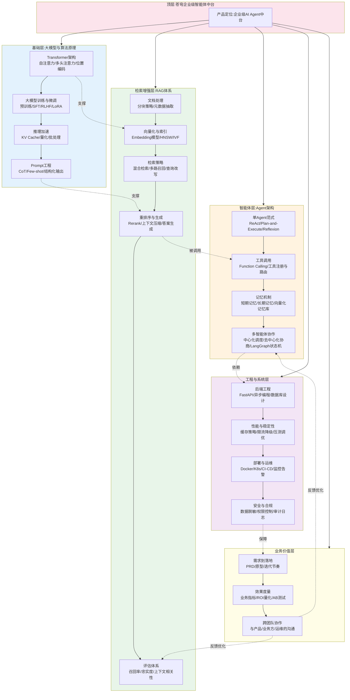
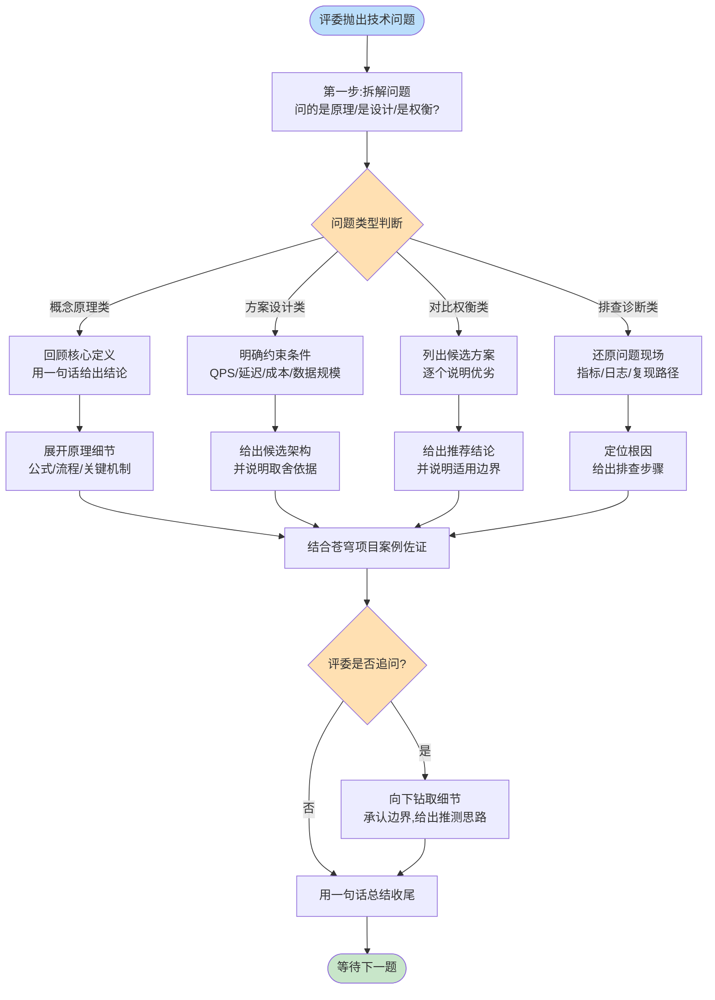
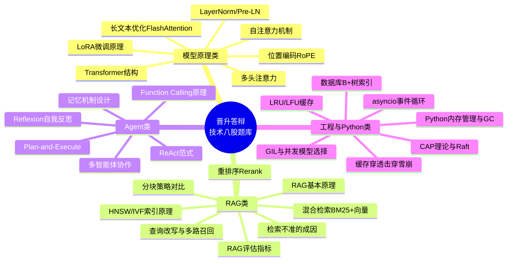

> **课程名称**:企业级AI全栈工程师70天特训营
> **阶段**:Stage 6·旗舰项目与职业冲刺
> **日期**:Day 67
> **标题**:第67天:晋升答辩准备(一)—— 技术八股
> **主角**:陈铭(学员) / 王振宇·老王(导师,蓬远科技AI中台负责人)
> **产品背景**:苍穹企业级智能体中台
> **前置**:Day66 晋升材料准备完成,答辩PPT与业务成果汇总已定稿
> **后续**:Day68 晋升答辩准备(二)—— 系统设计类问题

---

## 【旁白】

九月的第三个周一,陈铭比平时早到了四十分钟。工位的显示器还没亮,他先去茶水间接了一杯热水,回来的时候看见老王的工位灯已经亮了——老王比他还早。

这是陈铭进入蓬远科技第十个月。三个月前那次"苍穹企业级智能体中台"从0到1的旗舰项目验收会上,他站在会议室最后一排答辩PPT时手心全是汗,而现在,同一间会议室,他要面对的是完全不同性质的一场"考试":高级AI工程师晋升答辩。

昨天下午,Day66 的收尾会上,HRBP 把晋升答辩的通知函正式发到了陈铭邮箱,答辩时间定在两周后的周四下午,评委除了老王,还有跨部门的两位技术总监和一位产品VP。材料这一关,陈铭已经在老王的指导下打磨了整整一周——项目复盘PPT、业务价值量化表、技术难点攻坚记录,昨天晚上十点终于拿到了老王的"过关"批复。

但老王在批复消息末尾补了一句话,让陈铭一晚上没睡好:

"材料只是敲门砖,答辩现场的技术八股才是真正的分水岭。评委里有两位总监不做AI方向,他们唯一能验证你'够不够高级'的方式,就是看你能不能把底层原理讲清楚、讲透、讲得让非AI背景的人也能点头。明天早上九点,会议室,我来当考官,你来做题。"

陈铭走进会议室的时候,老王正在白板上写字。黑色马克笔划过白板,写下了四个大字:"技术八股"。

"『八股』这个词你可能觉得贬义,"老王把笔放下,转过身,"但你去看那些真正厉害的工程师,他们对基础原理的掌握,恰恰是最扎实的那批人。晋升答辩不是让你秀花活,是让评委确认——你说的每一个'我们用了RAG'、'我们做了Agent编排'背后,你是不是真懂,还是只会调包。今天这一整天,我们就把最高频的技术问题过一遍,覆盖模型原理、RAG优化、Agent设计,再加一点Python和工程基础。下午我出一份模拟笔试,掐着表让你做。"

陈铭点点头,坐下,翻开了新的一页笔记本。他知道,这一天注定是硬仗——但比起三个月前那场手心冒汗的项目答辩,这一次,他至少已经有了"苍穹"项目的实战积累撑腰。真正的问题是,能不能把这些积累,翻译成让评委听得懂、听得服的语言。

老王拉了一张椅子坐到陈铭对面,像模拟一场真正的答辩现场那样,清了清嗓子:"陈铭同学,那我们开始吧。第一个问题,自我介绍就不用了,材料里都有。我直接问技术。"

---

## 一、晨会纪要

**会议主题**:Day67 晨会 —— 晋升答辩技术八股专项训练启动
**参会人**:王振宇(主持)、陈铭
**时间**:09:00-09:20
**地点**:苍穹项目组会议室B

**纪要要点**:

1. **背景说明**。老王指出,陈铭的晋升答辩材料(项目复盘、业务价值、技术攻坚记录)已经在 Day66 完成并通过初审,接下来两周的核心任务是"技术硬实力"的现场检验。答辩委员会中有非AI背景的技术总监,历史数据显示,这类答辩失败案例中,七成以上不是因为业务成果不够,而是候选人对基础原理讲述不清晰、被追问两三个"为什么"就露怯。

2. **训练计划总览**。老王将答辩准备拆成三天:
   - Day67(今天):技术八股 —— 高频原理题精讲 + 模拟笔试,巩固"讲得清楚"的能力;
   - Day68:系统设计类问题 —— 针对"如果让你重新设计苍穹的检索模块""如果QPS涨十倍怎么办"这类开放性问题做专项训练;
   - Day69:行为面试与业务价值陈述,专门打磨"如何用数据讲故事"。

3. **今日安排**。上午 09:20-12:00,老王以"考官"身份出题,陈铭现场作答,老王逐题点评并补充;下午 13:30-16:00,进行一次完整模拟笔试,题型覆盖选择、简答、代码、系统设计四类;16:00-17:30,复盘笔试、代码实战演练、布置课后作业。

4. **考察范围确认**。老王明确了今天覆盖的技术版块:
   - 模型原理类:Transformer结构、注意力机制、位置编码、归一化方式、长文本优化;
   - RAG类:检索增强生成的原理、常见故障模式、优化手段(混合检索、重排序、查询改写、分块策略);
   - Agent类:ReAct、Plan-and-Execute、Reflexion、多智能体协作、工具调用的坑;
   - 工程与Python类:内存管理、GIL、异步编程、数据库索引、缓存策略、分布式一致性。

5. **老王强调的答题原则**。他反复叮嘱陈铭三点:
   - 第一,先给结论,再展开原理,不要上来就讲细节让评委抓不住重点;
   - 第二,凡是能用苍穹项目的真实案例佐证的,一定要举例,这是陈铭区别于"背书型"候选人的核心优势;
   - 第三,遇到不确定的问题,要诚实说明自己的理解边界,再给出合理的推测思路,不要不懂装懂,评委往往通过追问就能识破。

6. **待办事项**:
   - 陈铭:准备好纸笔,今天所有问答现场手写记录,晚上整理成个人复习手册;
   - 老王:准备好模拟笔试试卷(书面版),下午准时发放;
   - 双方:今天结束后确定 Day68 的具体考察清单。

会议在 09:20 准时结束,陈铭翻开笔记本新的一页,写下了今天的日期,以及老王刚才在白板上留下的四个字。

---

## 二、需求文档 —— 晋升答辩技术考察大纲

**文档名称**:《高级AI工程师晋升答辩技术考察大纲》
**版本**:V1.0
**制定人**:王振宇
**适用对象**:蓬远科技AI中台部门晋升答辩候选人
**审核状态**:已在部门内部评审通过,作为本次及后续晋升答辩的参考标准

### 2.1 文档目的

本大纲用于明确高级AI工程师(P6→P7,或对应级别)晋升答辩中技术考察的范围、深度要求与评分维度,确保答辩委员会对候选人的技术判断有统一、可量化的参考标准,同时也作为候选人自我训练的复习指南。

### 2.2 考察范围

考察范围分为四大模块,每个模块下设具体考点,考点后括号内为难度等级(基础/进阶/资深):

**模块一:大模型基础原理**

- Transformer整体架构与Encoder-Decoder差异(基础)
- 自注意力机制的计算过程与直觉理解(基础)
- 多头注意力存在的意义(进阶)
- 位置编码:绝对位置编码、相对位置编码、RoPE旋转位置编码对比(进阶)
- LayerNorm与BatchNorm的区别,Pre-LN与Post-LN的选择(进阶)
- 长序列场景下Attention计算复杂度优化思路:稀疏注意力、线性注意力、FlashAttention(资深)
- 大模型微调技术:全参数微调、LoRA、QLoRA、Prefix-Tuning对比(进阶)
- 大模型推理加速:KV Cache、量化、投机采样(资深)

**模块二:RAG检索增强生成**

- RAG基本原理与适用场景(基础)
- RAG系统常见故障模式:检索不准、上下文过长、答案幻觉(基础)
- 检索优化手段:混合检索(BM25+向量)、查询改写、多路召回、重排序(进阶)
- 文档分块策略:固定长度分块、语义分块、递归分块的优劣(进阶)
- 向量数据库索引原理:HNSW、IVF、倒排索引对比(资深)
- RAG评估指标体系:召回率、准确率、忠实度、上下文相关性(进阶)

**模块三:Agent智能体设计**

- ReAct范式原理与局限(基础)
- Plan-and-Execute范式与ReAct的对比(进阶)
- Reflexion自我反思机制的实现思路(进阶)
- 多智能体协作架构:中心化调度 vs 去中心化协商(资深)
- Function Calling/工具调用的实现原理与常见坑(基础)
- Agent的记忆机制设计:短期记忆、长期记忆、情景记忆(进阶)

**模块四:工程与Python基础**

- Python内存管理:引用计数与垃圾回收、循环引用处理(基础)
- GIL全局解释器锁的原理与影响,多线程/多进程/协程的选择依据(进阶)
- 异步编程:asyncio事件循环原理、协程调度机制(进阶)
- 数据库索引原理:B+树结构、聚簇索引与非聚簇索引、索引失效场景(基础)
- 缓存设计:LRU/LFU算法、缓存穿透/击穿/雪崩及应对方案(基础)
- 分布式系统基础:CAP理论、一致性协议Raft简述(进阶)

### 2.3 能力要求

答辩委员会依据以下四个维度对候选人技术问答进行打分,每项满分5分:

| 维度 | 说明 |
|---|---|
| 原理准确性 | 回答的技术原理是否正确,是否存在明显知识错误 |
| 表达清晰度 | 是否能用简明语言让非专业背景的评委理解核心逻辑 |
| 深度与广度 | 是否能在追问下继续展开,而不是止步于表面结论 |
| 结合实战能力 | 是否能结合真实项目经验佐证观点,而非纯理论背诵 |

### 2.4 考察形式

- 现场问答:评委随机抽取考点提问,候选人限时口头作答(每题2-3分钟);
- 笔试环节(仅作为答辩前自我训练手段,非正式答辩流程):选择题+简答题+代码题+系统设计题,总时长150分钟。

### 2.5 通过标准

四个维度平均分不低于3.5分,且原理准确性单项不低于3分,视为技术八股环节通过,进入系统设计与行为面试考察阶段。

---

## 三、架构设计图 —— 陈铭的技术知识体系

老王在白板上画完考察大纲后,让陈铭自己动手,把这70天学到的东西梳理成一张"知识体系图",作为答辩现场"技术地图"式开场的素材。陈铭想了想,画出了下面这张图。



老王看完这张图,点了点头,又摇了摇头:"图画得不错,层次很清楚,但答辩现场你不能干巴巴地念这张图。你要能指着'检索增强层'跟评委说,'苍穹项目里我们在C3检索策略这一层踩了什么坑,怎么解决的',这张图才算真的立起来。"

---

## 四、流程图 —— 一次技术问答的思考路径(以拆解系统设计题为例)

老王紧接着说:"你刚才回答我随口问的第一个问题时,愣了三秒才开口。答辩现场三秒不算什么,但你要有一套稳定的思考框架,不管我问什么,你都能按这套框架走一遍,而不是靠临场灵感。"他在白板上画了下面这张流程图。



"这套框架你记熟,"老王说,"核心就四步:拆解问题类型、明确约束或定义、展开细节、拿项目案例佐证。最后如果我追问,你敢承认边界,再给出你的推测逻辑,这一点比不懂装懂重要一百倍。"

---

## 五、示意图 —— 高频问题分类示意

为了让陈铭对"今天要过一遍的题库"有个全局印象,老王又画了一张分类示意图,把高频问题按四大类归拢。



老王指着图说:"你看,这四类问题,其实对应的就是你日常工作里天天打交道的四个模块。今天上午我们就按这个顺序过一遍,一类问题选四五个最高频的,详细讲;工程类问题我会问得稍微简单一点,毕竟评委里有非AI背景的总监,但你不能因此就答得潦草,反而要讲得更通俗才行。"

---

## 六、课堂笔记

### 6.1 上午:老王出题,陈铭作答(高频面试题精讲)

老王把椅子往前挪了挪,拿出一个笔记本,像模拟真实答辩现场一样开始提问。陈铭在自己的笔记本上一边听一边记,以下是整理后的完整问答记录。

---

#### 问题1:请说说Transformer的整体架构,以及自注意力机制的计算过程。

**老王提问**:"陈铭,我们从最基础的问起。你能不能不看任何资料,给我讲一下Transformer的整体架构,以及自注意力机制具体是怎么算出来的?"

**陈铭作答**:

"Transformer最早是2017年那篇《Attention Is All You Need》提出的,整体上是一个Encoder-Decoder架构,但像GPT这类生成式大模型,实际上只用了Decoder部分,做的是Decoder-only架构;而像BERT这类做理解任务的模型,用的是Encoder-only架构。苍穹项目里我们用的基础大模型都是Decoder-only结构。

Transformer的核心创新是完全抛弃了RNN的循环结构,用自注意力机制来建模序列内部任意两个位置之间的依赖关系,这样做的好处是可以并行计算,不像RNN那样必须一步一步算,训练效率大幅提升,而且能捕捉长距离依赖,不会像RNN那样有梯度消失导致的'记忆遗忘'问题。

自注意力机制的计算过程,我按公式来讲。对于输入序列的每一个token,先通过三个不同的线性变换矩阵,分别得到Query(查询向量)、Key(键向量)、Value(值向量),也就是Q、K、V。这三个矩阵是模型训练出来的参数,不是手工设计的。

计算的时候,先拿当前位置的Query向量,和序列里所有位置的Key向量做点积,得到一个'相似度分数',这个分数反映了当前位置对其他每个位置的'关注程度'。点积之后要除以一个缩放因子,也就是Key向量维度的平方根,这一步是为了防止点积结果过大导致后面softmax梯度消失——因为如果Q和K的维度很高,点积的数值方差会很大,不缩放的话softmax会变得非常'尖锐',大部分梯度都会消失。

缩放之后,对这一行分数做softmax归一化,得到一组权重,这组权重加起来等于1,代表当前位置'应该花多少注意力'在序列的每一个位置上。最后,用这组权重去对所有位置的Value向量做加权求和,得到当前位置新的表示向量。这就是所谓的'自注意力',公式写出来就是 Attention(Q,K,V) = softmax(QK^T / √d_k) V。

直觉上理解,这个机制其实模拟的是人在读一句话时,理解某个词的意思要参考上下文其他词——比如'苹果'这个词,如果上下文出现'手机''发布会',那这个词更可能指品牌;如果上下文出现'吃''水果',那更可能指水果。自注意力机制就是让模型自动学会,在理解每个词的时候该'看'哪些其他词,看多重。"

**老王点评**:"公式讲得很准,缩放因子那部分的解释也到位,这一点很多人只会说'防止梯度消失'但说不清楚为什么。补一句,面试或答辩现场时间紧,你这段回答可以再压缩三分之一,先说结论——'Transformer用自注意力替代RNN实现并行化和长距离依赖建模',再展开公式细节,评委听起来会更省心。"

---

#### 问题2:为什么要用多头注意力,而不是单头?

**老王提问**:"接着问,多头注意力这个'多头'到底解决了什么问题?为什么不直接用一个大的注意力头?"

**陈铭作答**:

"多头注意力的核心思路是,把原本一个高维度的Q、K、V,切分成多个'头',每个头在一个较低维度的子空间里独立计算注意力,最后把所有头的输出拼接起来,再做一次线性变换。

为什么这么做,而不是直接用一个大头去算?主要有两个原因。

第一,表达能力上,单头注意力本质上只能学到'一种'关注模式,因为softmax加权求和的结果,天然会让分布趋向于关注少数几个高权重的位置,信息容易被'平均'掉。而多头注意力让模型可以在不同的头里学习不同类型的依赖关系——比如有的头专注于捕捉语法结构(比如主谓宾的依赖),有的头专注于捕捉语义相似性,有的头可能专注于位置上比较近的局部关系。这就是所谓的'子空间投影',不同头相当于从不同角度去看同一份输入。

第二,从可视化研究来看,像BERT这类模型做过大量注意力可视化分析,确实发现不同的头学到了不同的模式,有的头明显在关注前一个词,有的头在关注句子的主语,这从实验上验证了多头设计确实带来了功能上的分化,不是简单的参数冗余。

在苍穹项目里,我们做过一次对模型内部注意力头的分析实验,当时是为了排查一个'长文档摘要漏关键信息'的问题,我们把不同层不同头的注意力权重可视化出来,发现浅层的头更多关注局部词法关系,深层的头会出现明显跨段落的长距离关注模式,这也从侧面印证了多头注意力+多层堆叠,确实是在不同粒度上建模文本结构。"

**老王点评**:"这道题回答得比较完整,尤其是最后提到苍穹项目里做过注意力可视化分析,这种细节非常加分,评委一听就知道你不是单纯背书,是真的动手做过实验。继续保持这种'原理+项目案例'的组合。"

---

#### 问题3:位置编码有哪几种方式?RoPE和传统的正弦位置编码有什么区别?

**老王提问**:"Transformer本身没有循环结构,天然不知道词的顺序,你说说位置编码是怎么解决这个问题的,尤其是RoPE。"

**陈铭作答**:

"自注意力机制本身是'置换不变'的,也就是说如果不加位置信息,把输入序列打乱顺序,自注意力的计算结果理论上是一样的,这显然不对,因为语言是有顺序的。所以Transformer需要额外注入位置信息,这就是位置编码要解决的问题。

第一种是原始论文里用的正弦余弦绝对位置编码,给每个位置生成一个固定的、不需要训练的向量,用不同频率的sin和cos函数组合而成,不同维度对应不同的频率,这样每个位置都有一个唯一的编码,而且这个编码有很好的性质——位置之间的相对距离可以通过编码之间的线性变换关系体现出来。这种方式简单,不引入额外参数,但是有个问题,它是直接加到词向量上的,和词向量的语义信息混在一起,而且外推能力有限,如果推理时序列长度超过训练时见过的最大长度,效果会明显下降。

第二种是可学习的绝对位置编码,像BERT用的就是这种,直接给每个位置初始化一个可训练向量,通过训练学出来。这种方式表达能力更强,但外推性更差,因为超出训练长度的位置向量根本没被训练过。

第三种是相对位置编码,比如T5用的相对位置偏置,不是给每个绝对位置编码,而是在计算注意力分数时,加入'当前位置和被关注位置的相对距离'这个信息,这样对序列长度的泛化能力更好。

第四种就是现在主流大模型广泛使用的RoPE,也就是旋转位置编码。RoPE的核心思路很巧妙,它不是把位置信息'加'到词向量上,而是通过对Q和K向量做一个和位置相关的'旋转变换',让两个位置之间的注意力分数天然地只依赖于它们的相对距离,而不是绝对位置。具体做法是把向量的每两个维度看成一个复平面上的坐标,乘以一个旋转角度和位置成正比的旋转矩阵。这样做的好处是,第一,它是通过乘法方式作用在Q和K上,不破坏原始词向量的模长信息;第二,数学上可以证明,两个经过RoPE处理的向量做点积,结果只和它们的相对位置差有关,这就自然地实现了相对位置编码的效果,同时保留了绝对位置编码计算简单的优点;第三,RoPE在长度外推上表现更好,后续像YaRN、NTK-aware插值这些长文本外推技术,都是在RoPE的基础上做频率调整来实现的。

苍穹项目里我们在做长文档问答的时候,曾经遇到过输入长度超过基础模型训练长度导致效果骤降的问题,后来通过调整RoPE的base参数做了简单的长度外推插值,配合分段处理,把可用的上下文长度扩展了大概两倍,这个经历让我对RoPE的外推机制有了更直观的理解。"

**老王点评**:"这一题回答的深度已经超出'高级工程师'的一般水平了,RoPE讲得很透彻,尤其是'旋转变换保留相对距离'这一点讲清楚了,这是很多人容易讲错的地方。长度外推那段案例也很好。如果评委追问YaRN具体怎么做频率调整,你要能再往下讲一层,建议晚上补一下这部分的细节。"

---

#### 问题4:LayerNorm和BatchNorm有什么区别?为什么Transformer用LayerNorm而不是BatchNorm?Pre-LN和Post-LN怎么选?

**老王提问**:"这个问题很多人答不到点上,你试试。"

**陈铭作答**:

"BatchNorm是在'批次'这个维度上做归一化,对于一个batch里所有样本的同一个特征通道,计算均值和方差,然后归一化。它依赖batch内的统计量,所以对batch size比较敏感,batch size太小的时候统计量不稳定,效果会变差。

LayerNorm则是在'特征'这个维度上做归一化,对单个样本自身的所有特征维度,计算均值和方差,归一化后再做一个可学习的缩放和平移。它不依赖batch内其他样本,所以对batch size不敏感,即使batch size是1也能正常工作。

Transformer为什么用LayerNorm而不是BatchNorm,原因主要有两点。第一,NLP任务里,序列长度是可变的,同一个batch里不同样本要padding到相同长度,如果用BatchNorm,padding部分会污染统计量,而且不同位置的token,其特征分布本身差异很大,不像图像里同一个通道在空间上分布相对稳定,BatchNorm在这种场景下效果不好。第二,推理阶段经常是单条样本或者小batch,BatchNorm在小batch下统计量不稳定的问题会被放大,而LayerNorm天然不受影响。

关于Pre-LN和Post-LN,这个问题涉及到Transformer训练稳定性。原始论文用的是Post-LN,也就是子层(比如自注意力、前馈网络)先算完,残差连接加上原始输入之后,再做LayerNorm。这种结构在层数较浅的时候没问题,但层数一深,梯度在反向传播时容易出现不稳定,训练很难收敛,需要非常精细的学习率warmup策略才能训练起来。

后来主流的做法转向了Pre-LN,也就是先对输入做LayerNorm,再送进子层计算,子层的输出直接和原始输入做残差连接,不再额外过一次LayerNorm。这样做的好处是,残差路径上没有被LayerNorm'切断',梯度可以更直接地从深层反向传播回浅层,训练稳定性大幅提升,不需要那么精细的warmup,可以支持训练更深的网络。现在几乎所有主流大模型,包括GPT系列、LLaMA系列,用的都是Pre-LN结构,或者它的变体比如RMSNorm加Pre-Norm的组合。RMSNorm相比LayerNorm去掉了均值中心化这一步,只做方差归一化,计算更快,效果在大模型上基本等价甚至更好。

苍穹项目里我们在做小规模模型微调实验时,也做过对比,同样的超参数下,Post-LN结构如果层数一多,训练loss经常会震荡甚至发散,换成Pre-LN之后收敛明显平稳很多,这个实验结果和公开的论文结论是一致的。"

**老王点评**:"这题答得非常扎实,Pre-LN和Post-LN的训练稳定性差异讲清楚了,而且提到了RMSNorm,这是加分项。评委如果是懂技术的总监,这一题基本能拿满分。"

---

#### 问题5:序列长度很长时,自注意力的计算复杂度是O(n²),有哪些优化思路?FlashAttention具体优化了什么?

**老王提问**:"这是个比较硬核的问题,你尽量讲清楚。"

**陈铭作答**:

"自注意力机制里,每个位置都要和序列里所有位置计算注意力分数,所以计算复杂度和显存占用都是序列长度的平方级别,也就是O(n²),这在长文本场景下会成为瓶颈,比如序列长度从2000涨到8000,计算量会涨16倍。

优化思路大致可以分成几类。

第一类是稀疏注意力,核心思路是不让每个位置都关注所有位置,而是只关注一个子集,比如只关注局部窗口内的位置,加上少量全局token,或者按固定的步长做稀疏采样。像Longformer、BigBird这类工作都是这个思路,复杂度可以降到接近O(n)或O(n log n),但缺点是需要精心设计稀疏模式,可能会丢失一些全局依赖信息。

第二类是线性注意力,核心思路是把softmax(QK^T)V这个计算顺序换一下,利用矩阵乘法的结合律,先算K^T V,再和Q相乘,这样可以把复杂度从O(n²d)降到O(nd²)。但直接这么做的问题是,softmax是非线性的,不能直接交换计算顺序,所以线性注意力通常需要用一个核函数去近似softmax,比如Performer用随机特征映射去近似,或者直接用其他核函数替代softmax,这类方法在效果上通常会有一定损失,需要权衡。

第三类是FlashAttention,这个和前两类不一样,它不改变注意力的数学计算结果,精确计算出来的结果和标准注意力完全一致,它优化的是'怎么算得更快、更省显存',是一个纯粹的系统层面的优化。

FlashAttention具体做了什么,核心思路是利用GPU的存储层级结构,GPU上有容量小但带宽极高的SRAM,和容量大但带宽相对低的HBM(也就是显存)。标准注意力实现里,QK^T这个n×n的中间矩阵要完整写入HBM,然后再读出来做softmax,再写回去,再读出来和V相乘,这个过程有大量的显存读写,而显存带宽往往才是瓶颈,不是算力。

FlashAttention用了一种叫'分块计算+在线softmax'的技巧,把Q、K、V分成小块,每次只把一小块数据加载到SRAM里,在SRAM内完成这一块的注意力计算,并且用在线softmax的算法,累积地更新最终结果,而不需要把整个n×n的注意力矩阵完整地写到显存里。这样就把显存读写的次数从O(n²)量级降低到接近线性,虽然理论计算量没变,但因为省掉了大量显存IO的开销,实际运行速度能提升好几倍,而且因为不需要存储完整的n×n矩阵,显存占用也大幅降低,这就让训练和推理更长的序列变得可行。

苍穹项目里,我们在部署阶段用的推理框架底层已经集成了类似FlashAttention的优化,当时做过一次对比测试,同样的长文档问答场景,开启和不开启这类attention kernel优化,推理延迟差了大概三倍以上,这个提升是实打实的,不是理论上的。"

**老王点评**:"FlashAttention这块讲得很到位,尤其是'不改变数学结果、只优化系统层实现'这个定位讲对了,很多人会把它和线性注意力搞混。'分块计算+在线softmax'的表述也准确。这一题如果评委继续追问,你可以补充GQA(分组查询注意力)、MQA(多查询注意力)这些也是从另一个角度优化推理阶段KV Cache显存占用的方法,晚上你查一下补充进笔记里。"

---

#### 问题6:RAG的基本原理是什么?为什么现在企业级应用大多要用RAG,而不是直接微调模型?

**老王提问**:"换个方向,讲讲RAG。"

**陈铭作答**:

"RAG全称是Retrieval-Augmented Generation,检索增强生成。基本原理是,在模型生成回答之前,先根据用户的问题,从一个外部知识库里检索出相关的文档片段,把这些片段作为上下文,拼接到Prompt里,再让大模型基于这些上下文生成回答。

它要解决的核心问题是,大模型的知识是在预训练阶段固化下来的,存在两个明显短板:一是知识有截止时间,训练之后发生的新事实模型不知道;二是模型可能没有见过企业内部的私有数据,比如公司内部的产品文档、知识库,这些数据模型压根没训练过。RAG通过'检索'这一步,把外部的、实时的、私有的知识动态注入到生成过程里,让模型能够回答它本身'不知道'的问题,同时也能大幅缓解幻觉问题,因为回答有据可依,而不是完全靠模型参数里的记忆去'编'。

为什么企业级场景大多选RAG而不是直接微调,原因有几个。第一,微调需要大量高质量的标注数据,而且训练成本高,一旦知识库更新,微调模型就要重新训练,而RAG只需要更新外部知识库,不需要重新训练模型,更新成本极低,几乎是实时的。第二,微调更适合让模型学习'风格'和'能力',比如让模型学会遵循某种输出格式,或者学会某个专业领域的推理方式,但对于'记住具体事实'这件事,微调的效果并不稳定,模型可能记住,也可能记混,而且没办法追溯这个答案是从哪来的。RAG的答案是有源可查的,可以直接告诉用户'这个结论来自于哪份文档的哪一段',这对企业级场景的可解释性和合规审计非常重要。第三,微调有'灾难性遗忘'的风险,如果只在小范围的私有数据上做微调,模型原本的通用能力可能会退化,而RAG完全不改变模型参数,不存在这个风险。

当然RAG和微调不是互斥的,苍穹项目里我们的做法是,底座模型的通用能力和指令遵循能力靠SFT去强化,具体的知识事实靠RAG去动态注入,这是目前企业级应用比较主流的组合方案,业界一般管这个叫'RAG+微调'的混合架构。"

**老王点评**:"这一题回答得很全面,'RAG解决知识时效性和私有数据,微调解决风格和能力'这个定位的表述很准确,而且提到了可解释性和灾难性遗忘,这些都是评委会关心的点。继续。"

---

#### 问题7:一个RAG系统上线后,经常遇到检索不准的问题,你说说都有哪些常见原因,以及对应的优化手段。

**老王提问**:"这题结合你在苍穹项目里的实际经历讲。"

**陈铭作答**:

"检索不准是RAG系统最常见的故障模式,我按照'从查询到召回到排序'这条链路,把常见原因和对应优化手段梳理一下。

第一个环节是查询本身的问题。用户提的问题往往很口语化、很短,或者包含指代词、缺乏上下文,而知识库里的文档是书面语、术语化的表达,这中间存在'查询-文档'语义鸿沟。对应的优化手段是查询改写,常见的做法有:用大模型对原始query做同义改写或者补全省略信息;做多角度改写,把一个问题从不同角度改写成几个子查询,分别检索再合并结果,这个叫Multi-Query;还有一种叫HyDE的技术,思路是先让大模型针对问题'假设性地'生成一段可能的答案,再用这段假设答案去做向量检索,因为假设答案的表达方式和真实文档更接近,检索效果往往比直接用原始问题去检索更好。

第二个环节是召回环节本身的局限。纯向量检索基于语义相似度,但有些查询场景需要精确匹配关键词,比如产品型号、专有名词、代码片段,这类场景向量检索反而不如传统的关键词检索准。所以现在主流做法是混合检索,同时用BM25这种基于词频统计的关键词检索,和向量检索并行召回,再把两路结果做融合排序,常见的融合算法是RRF(Reciprocal Rank Fusion,倒数排名融合),不需要归一化两种检索方式分数量级不同的问题,直接用排名的倒数加权就能得到相对稳健的融合结果。苍穹项目里我们上线初期只用纯向量检索,发现涉及具体产品型号和报错代码的问题召回效果很差,后来加入BM25混合检索,这类问题的召回准确率提升了大概三成。

第三个环节是文档分块的问题。分块太大,一个chunk里包含太多无关信息,会稀释向量表征的语义焦点,检索出来的相关性打分不准;分块太小,又容易把一个完整的语义单元切碎,导致检索出来的片段缺乏上下文,模型看了也理解不了。优化手段包括:按语义边界分块而不是固定字符数分块,比如按标题、段落自然边界切分;做'子块-父块'的分层索引,检索时用小块做精确匹配,但返回给模型的是这个小块所在的完整父块上下文,这样兼顾了检索精度和上下文完整性;还有一种叫'滑动窗口重叠分块',让相邻的chunk之间保留一部分重叠内容,避免关键信息刚好落在切分边界上被切断。

第四个环节是召回之后的排序问题。向量检索初步召回的Top-K结果里,真正最相关的答案未必排在最前面,尤其是当K取得比较大、只是为了保证召回率的时候。这时候需要引入重排序模型,也就是Rerank。常见做法是用一个专门训练的、更精细的排序模型(比如Cross-Encoder架构,把query和候选文档拼在一起送进模型统一编码打分,而不是像向量检索那样分别编码再算相似度),对初步召回的候选集合做二次打分排序,选出最相关的Top-N送给大模型。Cross-Encoder因为让query和文档做了充分的交互,排序精度通常比向量检索的粗排结果好很多,只是计算成本更高,所以一般用在'粗召回+精排'的两阶段架构里,粗召回负责效率,精排负责精度。

苍穹项目里我们最终落地的是一套'混合检索粗召回+Cross-Encoder精排+子父块分层索引'的组合方案,单独调整任何一个环节效果提升都有限,把这几个手段叠加起来,整体检索的Top-5命中率从最初上线时的大概65%提升到了90%以上。"

**老王点评**:"这题回答堪称满分答案,四个环节拆解得很清晰,而且每个环节都给了具体的技术方案和苍穹项目的量化数据。答辩现场如果时间有限,你可以只讲混合检索和Rerank这两个最核心的手段,把其他两个环节留给追问时再展开,这样节奏会更好。"

---

#### 问题8:向量数据库常用的索引算法有哪些?HNSW的原理简单说一下。

**老王提问**:"这个问题偏工程底层,考察你对向量检索背后数据结构的理解。"

**陈铭作答**:

"向量检索本质上是在高维空间里做近似最近邻搜索,也就是ANN(Approximate Nearest Neighbor)。因为数据量一大,精确的暴力搜索(对每个查询向量和库里所有向量都算一次距离)代价太高,所以工程上普遍用近似算法,牺牲一点精度换取速度。

常见的索引算法有几类。第一类是基于树结构的,比如KD树,在低维空间效果不错,但维度一高('维度灾难'问题),效果会急剧下降,现在很少用在大模型embedding这种几百到几千维的场景。

第二类是IVF,也就是倒排文件索引,思路是先对全部向量做聚类(比如用K-means),得到若干个聚类中心,每个向量归属到最近的聚类,检索的时候先找到查询向量最近的几个聚类中心,只在这几个聚类内部的向量里做精确搜索,而不是搜索全库,这样大幅减少了计算量。IVF的检索速度和精度可以通过调整'搜索多少个聚类'这个参数来权衡,搜索的聚类数越多,精度越高但速度越慢。IVF通常还会结合PQ(Product Quantization,乘积量化)技术进一步压缩向量存储,把高维向量切分成若干个子向量,每个子向量单独量化编码,这样能大幅降低内存占用,代价是精度会有损失。

第三类是HNSW,也就是层次化可导航小世界图,这是目前工业界最主流的向量索引算法之一,像Milvus、Faiss、Qdrant等主流向量数据库都支持它。HNSW的核心思路是构建一个多层的图结构。最上层是一个稀疏的图,节点很少,边跨度大,适合做'快速定位大致方向';越往下层,图越密,节点越多,边跨度越小,适合做'精细搜索'。构建的时候,每个新插入的向量,会被随机分配一个'最高出现层数',然后在这个层及以下的每一层,都和图里已有的、距离较近的一些节点建立连接边,层数越高的节点越少,呈现金字塔结构。

检索的时候,从最顶层开始,从一个随机的入口点出发,贪心地往'离查询向量更近'的邻居节点移动,直到在当前层找不到更近的邻居为止,然后下降到下一层,以当前找到的最优节点为起点继续贪心搜索,逐层下降,直到最底层,得到最终的近似最近邻结果。这个过程有点像现实中导航——先看高速公路网(顶层稀疏图)确定大致方向和路线,再逐渐切换到城市道路、小巷子(底层密集图)精确定位目的地。

HNSW相比IVF的优势是检索精度和召回率通常更高,而且检索延迟比较稳定,不需要像IVF那样在'聚类数量'和'扫描聚类数'之间做那么敏感的权衡;缺点是构建索引的时间和内存开销比IVF大,而且不太适合频繁增删数据的场景,因为图结构的动态维护成本较高。

苍穹项目里,知识库量级在百万级文档片段的规模,我们选用的是HNSW索引,当时也测过IVF+PQ的组合,发现HNSW在同样的召回率下,平均检索延迟低了大概40%,但索引构建的内存占用确实比IVF高出不少,考虑到我们的知识库更新频率不算特别高(每天批量更新一次,而不是实时增量写入),这个内存换速度的取舍是划得来的。"

**老王点评**:"HNSW讲得很形象,'高速公路到小巷子'这个类比可以直接用在答辩现场,评委即使不懂技术细节也能秒懂。IVF和PQ的补充也到位。这题如果评委追问'为什么不用精确搜索',你要能补一句——百万级、千万级向量规模下暴力搜索延迟不可接受,ANN是用可接受的精度损失换来数量级的速度提升,这是工程上的必然选择。"

---

#### 问题9:什么是ReAct范式?它和Plan-and-Execute范式有什么区别?各自适合什么场景?

**老王提问**:"进入Agent部分,先讲讲最经典的ReAct。"

**陈铭作答**:

"ReAct是Reasoning and Acting的缩写,核心思路是让大模型在解决问题的过程中,交替进行'推理'和'行动'这两种输出,而不是一次性直接给出最终答案。

具体的执行循环是这样的:模型先输出一段'Thought',也就是对当前状态的分析和下一步该做什么的推理;然后基于这段思考,输出一个'Action',也就是要调用的工具和参数;系统执行这个工具调用,把结果作为'Observation'反馈给模型;模型再基于新的观察结果,继续输出下一轮的Thought,判断是否已经能解决问题,如果不能,继续下一轮Action,如此循环,直到模型认为已经收集到足够信息,输出最终答案。

这个范式的好处是,把'思考'显式地暴露出来,一方面提升了模型的推理质量,因为强制模型先想清楚再行动,类似Chain-of-Thought的效果;另一方面,每一步都有Observation作为反馈,模型可以根据实际执行结果动态调整策略,如果某个工具调用返回的结果不符合预期,模型在下一轮Thought里能够意识到并调整方向,这是一种'边走边看'的探索式解决问题方式。

它的局限性在于,因为是逐步决策、没有全局规划,遇到需要多步骤协同、步骤之间有复杂依赖关系的复杂任务时,容易出现'走一步看一步'导致的局部最优或者绕远路的问题,而且每一步都要调用一次大模型做推理,步骤一多,延迟和成本会累积得比较高。

Plan-and-Execute范式和ReAct不同,它先让模型对整个任务做一次全局规划,把任务拆解成一个有序的子任务列表,规划阶段就想清楚'要分几步、每一步做什么',然后再进入执行阶段,按照规划好的步骤依次执行,执行过程中每完成一步,可以把这一步的结果反馈回规划模块,判断是否需要调整后续计划(这也叫Re-Plan)。

它的优势是,对于结构清晰、步骤间依赖关系明确的复杂任务,全局规划能避免ReAct那种'走一步看一步'带来的局部弯路,而且规划阶段和执行阶段解耦,执行阶段如果不需要复杂推理,可以用更轻量、更便宜的模型或者直接的代码逻辑去执行,只有规划和Re-Plan阶段才需要调用能力强的大模型,这样能有效控制成本。它的局限是,如果任务的不确定性很高,一开始规划的时候信息不足,后续执行中环境变化很大,可能需要频繁的Re-Plan,这时候规划和执行来回切换的开销也不小。

场景选择上,ReAct更适合探索性强、每一步都依赖上一步实际反馈才能决定下一步的任务,比如网页搜索类的问答任务,你不知道搜到的内容质量如何,只能边搜边判断下一步搜什么。Plan-and-Execute更适合任务结构相对固定、步骤可预先梳理清楚的场景,比如'生成一份季度报告'这种任务,可以先规划出'收集数据、清洗数据、生成图表、撰写文字、汇总排版'这几个步骤,再按部就班执行。

苍穹项目里,我们的客户咨询类Agent用的是ReAct范式,因为每一轮对话该调用知识库还是调用工单系统,完全依赖用户实际的提问内容,没法提前规划;但我们的'自动生成周报'这类批处理型Agent功能,用的是Plan-and-Execute,因为这类任务的步骤结构相对固定,规划一次就能复用,执行效率更高,成本也更可控。"

**老王点评**:"这一题回答的框架非常清楚——先讲各自机制,再讲优劣,再讲适用场景,最后落到项目案例。这是标准的答辩题型的最佳作答结构,你把这个结构记下来,后面很多题都可以套用。"

---

#### 问题10:Reflexion这种带自我反思机制的Agent是怎么工作的?它解决了什么问题?

**老王提问**:"继续深入Agent的进阶范式。"

**陈铭作答**:

"Reflexion要解决的核心问题是,传统的ReAct或Plan-and-Execute范式,一旦某一轮执行失败或者结果不理想,模型往往不会'反思自己错在哪里',而是继续在原来的错误路径上尝试,或者简单地重试同样的动作,缺乏从失败中学习并调整策略的机制。

Reflexion的做法是,在Agent执行任务的循环之外,再叠加一层'反思'机制。具体来说,当一次任务执行完成(不管成功还是失败),会有一个评估环节,判断这次执行的结果是否达到预期,如果没有达到预期,就让模型对这次失败的执行过程做一次'事后复盘',生成一段自然语言的反思,内容类似'这次失败的原因是什么、下次应该采取什么不同的策略'。这段反思会被存储到一个记忆模块里,当模型下一次面对同类任务或者重新尝试这次任务时,会把之前的反思内容作为额外的上下文提供给模型,让模型带着'教训'去重新尝试,而不是从零开始。

这个机制本质上是把'试错学习'的过程,用自然语言的形式外部化、显式化,而不是像强化学习那样通过更新模型参数去学习,它不需要重新训练模型,完全是在Prompt和记忆层面实现的,所以成本很低,而且可以在推理阶段实时生效,不需要离线训练周期。

Reflexion特别适合那种'可以被验证、可以重试'的任务,比如写代码——代码写完可以运行单元测试,测试失败的报错信息本身就是很好的反思素材,模型可以直接根据报错去修正代码;或者需要多轮尝试才能逼近正确答案的推理任务,比如某些数学题或者逻辑推理题,第一次答错了,通过反思调整推理路径,第二次答对的概率会明显提升。

它的局限是,反思的质量高度依赖模型本身的能力,如果模型本身连'为什么错了'都分析不明白,生成的反思内容可能是错误的归因,反而会误导下一轮尝试;另外,不断累积的历史反思如果不加筛选地全部塞进上下文,会让Prompt越来越长,需要有机制去做反思内容的摘要或者遗忘旧的、不再相关的反思。

苍穹项目里,我们在代码生成类的Agent功能上用到了类似Reflexion的思路:模型生成代码后,先在沙箱环境里跑一遍单元测试,如果测试失败,把报错堆栈和失败的测试用例作为反思材料反馈给模型,让它带着这些信息重新生成代码,一般两到三轮迭代后,代码通过率能从首次生成的六成左右提升到九成以上,这个'测试反馈驱动重试'的机制,本质上就是一种任务定制化的Reflexion实现。"

**老王点评**:"讲得很好,尤其是把Reflexion和强化学习做了对比,'不改模型参数、在Prompt层面实现试错学习'这个定位讲得很准确。代码生成的案例也很贴切。这一题基本上无可挑剔。"

---

#### 问题11:多智能体协作有哪些常见的架构模式?中心化调度和去中心化协商各有什么优劣?

**老王提问**:"这个问题偏系统设计,你结合苍穹项目的多Agent功能讲讲。"

**陈铭作答**:

"多智能体协作架构大致可以分为中心化调度和去中心化协商两大类,再往细分还可以按角色分工方式细化。

中心化调度架构里,有一个专门的'调度者'或者'管理者'Agent,负责接收总任务、把任务拆解分配给不同的'专家'Agent,收集各专家Agent的执行结果,再做汇总或者进一步分发,整个协作流程是通过这个中心节点来协调的,专家Agent之间通常不直接通信,都是通过中心节点中转。这类架构的代表实现思路是LangGraph里常见的'Supervisor'模式,或者早期AutoGPT类系统里的'主控-子任务'结构。

它的优势是,协作逻辑清晰、可控性强,调度者可以掌握全局状态,方便做整体的进度追踪、异常处理、结果校验,调试和监控相对容易,出问题的时候容易定位是哪个专家Agent环节出的错。它的劣势是,中心节点容易成为瓶颈,如果任务拆分不合理或者某个专家Agent执行慢,会拖累整体效率;而且中心化架构的可扩展性有限,专家Agent数量一多,调度者的Prompt和决策复杂度会显著上升。

去中心化协商架构里,没有单一的中心控制节点,多个Agent之间可以直接互相通信、协商、传递信息,通过类似'群聊'或者点对点消息传递的方式共同推进任务,常见的实现比如让多个Agent以'辩论'的形式,针对同一个问题各自给出观点,互相质疑、修正,最终收敛到一个共识答案,这类模式常用在需要多角度审视、降低单一模型偏见和幻觉的场景,比如让一个'审阅者'Agent专门检查另一个'撰写者'Agent生成内容里的事实错误。

它的优势是,更灵活,不存在单点瓶颈,某种程度上能通过多个视角的交叉验证提升结果质量;它的劣势是,协作过程的可控性和可预测性较差,如果Agent之间的通信协议设计不好,容易出现无限循环讨论、跑题、或者互相'客气'达不成有效共识的问题,而且调试起来比中心化架构困难得多,因为很难追踪某个错误结论具体是在哪一轮协商中产生的。

苍穹项目里,我们的多Agent功能实际上是两种模式的混合:整体上采用中心化调度,有一个'规划Agent'负责把用户的复杂请求拆解成子任务,分配给'检索专家Agent''代码专家Agent''数据分析专家Agent'这几个专家角色,这一层是中心化的,方便我们做全流程的日志追踪和异常兜底;但在'内容审校'这个环节,我们引入了一个轮次有限(最多两轮)的去中心化协商机制,让'撰写Agent'和'审校Agent'针对生成内容互相提出修改意见,直到审校Agent认为内容合格或者达到轮次上限为止,这个环节保留了协商的灵活性,但通过'限定轮次'这个约束,避免了协商无限循环的风险。这个混合架构在我们的实践里效果不错,既保证了整体可控,又在关键环节引入了质量提升的协商机制。"

**老王点评**:"这题的回答质量很高,尤其是最后落到'混合架构、限定协商轮次防止无限循环'这个细节,这是非常典型的工程化思维,评委会很认可这种'知道理论边界、也知道怎么在工程上兜底'的表述方式。"

---

#### 问题12:Function Calling/工具调用的底层实现原理是什么?实际做Agent工具调用的时候容易踩哪些坑?

**老王提问**:"这个问题偏实战,你多结合踩坑经验讲。"

**陈铭作答**:

"Function Calling的底层原理,其实并不神秘。大模型本质上还是在做'文本生成',所谓的'调用工具',是通过在训练阶段(或者通过精心设计的Prompt和输出格式约束)让模型学会,当它判断需要借助外部能力时,不直接输出自然语言答案,而是输出一段结构化的、符合特定格式(通常是JSON)的'函数调用请求',里面包含要调用的函数名和参数。这段结构化输出被应用层的代码解析出来后,由应用层代码去真正执行这个函数调用(可能是查数据库、调用外部API、执行代码等),再把执行结果重新组织成文本,作为新的上下文喂给模型,模型再基于这个结果继续生成后续内容。

所以本质上,模型自己并不会'真正执行'任何工具,它只是学会了'什么时候该说人话、什么时候该输出一段工具调用的结构化指令',真正的执行是应用层代码完成的,这一点很多刚接触Agent开发的人会有误解,以为模型自己在'跑代码'。

实际做工具调用时容易踩的坑,我列几个印象比较深的。

第一个坑是工具的描述(也就是Function的Schema定义,包括函数名、每个参数的类型和含义描述)写得不清楚,模型很容易调错参数或者调错工具。我们踩过一次坑,一个查询订单状态的工具和一个查询库存的工具,参数里都有一个'商品ID'字段,但描述写得比较简单,结果模型经常把商品ID和订单ID搞混,调用错误的工具组合,后来把每个参数的描述写得更具体、加上示例值,这个问题基本消失了,说明工具Schema的描述质量直接决定调用准确率,这一点很容易被低估。

第二个坑是工具数量一多,模型选择正确工具的准确率会明显下降,因为所有工具的Schema都要塞进Prompt里,工具一多,Prompt变得又长又杂,模型注意力被分散,选错工具的概率上升。我们的应对方案是做'工具的分层路由',先用一个轻量的分类步骤,判断用户当前的请求大致属于哪个业务域(比如是订单类、是知识库问答类、还是数据分析类),再只把这个业务域下相关的一小部分工具的Schema提供给模型,而不是把全部几十个工具一次性都摆出来,这样能显著提升工具选择的准确率。

第三个坑是工具执行失败或者返回异常结果的处理。刚开始我们直接把工具执行报错的原始异常堆栈信息回填给模型,发现模型经常'理解不了'这种技术性很强的报错,导致下一轮的处理逻辑很奇怪,后来改成在应用层先对异常做归一化和友好化处理,转换成模型更容易理解的自然语言描述(比如'查询超时,请稍后重试'而不是原始的连接超时堆栈),模型基于这种更清晰的反馈,后续处理逻辑明显更合理。

第四个坑是工具调用的幂等性和副作用问题,尤其是涉及写操作的工具,比如'创建工单''发送通知'这类,如果模型因为某种原因(比如一次生成里包含了重复的调用意图,或者Agent循环因为某个环节判断失误重试了)多次调用同一个写操作工具,可能会导致重复创建工单、重复发送通知等业务上的实际损失。我们后来对所有有副作用的写操作工具,在应用层强制加上了幂等键机制,同一个业务上下文里相同的写请求,只会真正执行一次,后续重复请求直接返回第一次的执行结果,这个兜底机制是必须的,不能完全依赖模型'不重复调用'的自觉性。"

**老王点评**:"这题的四个坑列得非常具体,尤其是'工具Schema描述质量''工具分层路由''写操作幂等性'这几点,是我们苍穹项目里真实踩过、真实解决过的,评委听你讲这些细节会明显感觉到你是真正做过工程落地的人,而不是只读过论文。答辩现场如果时间紧,建议优先讲第二和第四个坑,这两个最能体现工程判断力。"

---

#### 问题13:Python的内存管理机制是怎样的?引用计数和垃圾回收具体怎么配合工作,循环引用的问题怎么解决?

**老王提问**:"换个方向,考察一下工程基础。评委里有非AI背景的总监,这类问题他们也听得懂,你要讲得通俗一点。"

**陈铭作答**:

"Python的内存管理核心机制是引用计数,配合分代垃圾回收来处理引用计数解决不了的循环引用问题。

引用计数的原理很直接,每一个Python对象内部都维护一个计数器,记录当前有多少个引用指向这个对象。当你把一个对象赋值给一个新变量,或者放进一个列表、字典里,这个对象的引用计数就加一;当某个引用被删除(比如变量被del掉、离开了函数作用域、或者所在的容器被销毁),引用计数就减一。一旦引用计数降到0,说明这个对象已经没有任何地方在用它了,Python会立刻回收这个对象占用的内存。这种机制的优点是内存回收非常及时,一个对象'没人用了'马上就能被释放,不像有些语言的垃圾回收需要等到某个时机才统一清理,而且实现简单、开销分散在每次引用变化的时刻,不会出现明显的'卡顿'。

但引用计数有一个天然的缺陷,就是无法处理循环引用。比如两个对象互相引用对方,A引用了B,B也引用了A,即使外部所有指向A和B的引用都被删除了,A和B内部还互相持有对方的引用,导致它们的引用计数永远不会降到0,单靠引用计数机制,这两个对象会永远'卡'在内存里,造成内存泄漏。

为了解决这个问题,Python引入了分代垃圾回收机制作为引用计数的补充。它的思路是,周期性地扫描内存里的对象,专门检测'循环引用但已经不可达'的对象组——判断方法大致是,从程序的根对象(比如全局变量、当前调用栈上的局部变量)出发,做一次可达性分析,如果一组互相引用的对象,从任何根对象出发都无法到达它们,那说明这组对象整体已经是'垃圾',即使它们内部引用计数不为0,也应该被回收,回收时会强制打破这些循环引用,然后正常释放内存。

'分代'的含义是,Python把对象按照存活时间分成三代:刚创建的对象在第0代,经过一次垃圾回收还存活的对象晋升到第1代,以此类推到第2代。垃圾回收器对不同代采用不同的扫描频率,第0代扫描最频繁,因为大部分对象都是'短命'的,创建后很快就不再使用,尽早回收能提高效率;年龄越大的代,扫描频率越低,因为经验上存活越久的对象越可能继续存活下去,频繁扫描它们收益不大,反而浪费开销。这种分代策略是一种基于'大部分对象生命周期很短'这个经验规律的性能优化。

实际工程中怎么规避循环引用带来的问题,除了依赖自动垃圾回收之外,Python还提供了weakref弱引用机制,弱引用不会增加对象的引用计数,常用在明知道会形成循环引用结构、但又不想影响正常引用计数回收的场景,比如某些需要维护双向关联关系的缓存结构里,一侧用弱引用可以避免循环引用导致的内存滞留。

苍穹项目里我们曾经遇到过一次内存缓慢增长的问题,排查下来是一个自定义的对话上下文管理类,内部有一个'父上下文-子上下文'的双向引用结构,形成了大量循环引用,虽然最终垃圾回收机制会清理,但因为对象数量大、分代回收扫描周期本身有一定间隔,导致内存增长看起来'滞后',表现为内存占用曲线持续爬升然后周期性下降的锯齿状,后来把其中一侧的引用改成弱引用,内存曲线立刻变得平稳很多。"

**老王点评**:"这题的内容深度和讲解通俗度平衡得很好,尤其是'从根对象做可达性分析'这段,即便是非技术背景的评委,配合你之前打的比方,也能大致理解。苍穹项目那个内存锯齿状增长的案例非常真实,建议保留,现场讲这个案例会很有说服力。"

---

#### 问题14:Python的GIL是什么?它对多线程编程有什么影响?什么场景该用多线程,什么场景该用多进程,什么场景该用协程?

**老王提问**:"这也是个经典的考点,很多人只知道'GIL限制并发'但说不清楚具体机制和该怎么选。"

**陈铭作答**:

"GIL是Global Interpreter Lock,全局解释器锁,是CPython解释器(也就是我们平常用的官方Python实现)的一个设计,它规定在任意时刻,一个Python进程内只能有一个线程真正执行Python字节码,即使这个进程里开了多个线程,也只有一个线程能同时运行Python代码,其他线程必须等待。

为什么要有这个锁,主要是因为CPython的内存管理(比如前面讲的引用计数)本身不是线程安全的,如果多个线程同时修改同一个对象的引用计数,会产生竞态条件导致计数错误,进而引发内存泄漏或者提前释放的问题。GIL通过'一次只让一个线程跑Python代码'这种简单粗暴的方式,避免了给每一个对象的引用计数单独加锁带来的复杂性和性能开销,这是一种历史遗留的设计权衡,实现简单,但代价是限制了多线程在多核CPU上的并行计算能力。

GIL对多线程编程的影响主要体现在,对于CPU密集型任务(比如大量的数值计算、复杂的循环逻辑),多线程完全没有加速效果,甚至因为线程切换的开销,可能比单线程还慢,因为不管开多少个线程,同一时刻真正跑Python代码的永远只有一个。但对于IO密集型任务(比如网络请求、文件读写、数据库查询),多线程仍然有效,原因是当一个线程在等待IO操作完成时(比如等网络返回),它会主动释放GIL,让其他线程有机会执行,这种情况下多线程可以让CPU在等待IO的空闲时间去做别的线程的工作,从而提升整体吞吐。

具体到该怎么选,我按场景分三类讲。

第一类是CPU密集型任务,应该用多进程,因为每个进程有自己独立的Python解释器实例和独立的GIL,不同进程之间可以真正利用多核CPU并行计算,不受GIL限制。缺点是进程间通信开销比线程大,进程的创建和切换成本也比线程高,而且进程间共享数据不像线程那样直接共享内存,需要用进程间通信机制(比如管道、共享内存、消息队列)。

第二类是IO密集型任务,如果并发量不是特别大(比如几十到几百的并发连接),用多线程是可以接受的方案,实现简单,而且线程间共享内存比进程方便;但如果并发量非常大(比如要同时处理几千甚至上万个并发连接),多线程的问题是每个线程本身有一定的内存开销(线程栈),而且操作系统调度大量线程本身也有开销,这时候更适合用协程。

第三类,也就是高并发IO密集型任务的场景,用协程(asyncio)是更优的方案。协程是用户态的调度,不需要操作系统介入线程切换,单个协程的内存开销远小于线程,可以轻松支撑数万甚至更高的并发数量,配合事件循环,能在单线程内高效处理大量并发的IO等待,不需要像多线程那样承担线程切换和调度的系统开销。协程的局限是,它需要整条调用链上的库都是异步兼容的(比如数据库驱动、HTTP客户端都要有异步版本),如果调用链里混入了同步阻塞的代码,会阻塞整个事件循环,反而拖累所有并发任务,这也是异步编程里最容易踩的坑之一。

苍穹项目的后端服务,大量的接口是调用大模型API、调用向量数据库、调用外部工具接口,这些都是典型的IO密集型操作,而且线上并发量不小,所以我们整体后端框架选用的是基于asyncio的FastAPI异步架构,这个选择本质上就是基于刚才这套判断逻辑;但在做一些本地的文本预处理、特征计算这类CPU密集型批处理任务时,我们会专门用多进程池来跑,而不是让这些计算任务占用主事件循环,避免拖慢线上服务的响应。"

**老王点评**:"这一题回答的逻辑框架非常清楚——先讲GIL机制和成因,再讲对不同任务类型的影响,最后给出场景选择的判断依据,并且用苍穹项目的实际架构选择收尾。这基本就是标准答案的模板,我希望你后面所有偏工程类的问题都能用这个'原理-影响-决策依据-案例'四段式来组织。"

---

#### 问题15:asyncio的事件循环具体是怎么工作的?协程和线程的调度机制有什么本质区别?

**老王提问**:"顺着上一题往下追问,这也是评委很可能追问的方向。"

**陈铭作答**:

"asyncio的事件循环,本质上是一个单线程内的'任务调度器',核心工作机制是一个不停循环运行的loop,它维护着一个待执行任务的队列,不断地从队列里取出可以执行的协程任务去运行,当某个协程运行到需要等待IO的地方(比如网络请求还没返回),它会通过await关键字把控制权交还给事件循环,而不是像同步代码那样一直阻塞占用线程,事件循环拿到控制权之后,会去检查其他已经就绪(比如网络数据已经返回、定时器已经到期)的协程,把它们取出来继续执行,如此往复,实现了在单线程内,通过'协作式'的方式在多个协程之间切换,让CPU不会在等待IO的时候被空闲浪费。

这里'协作式'调度是理解协程和线程本质区别的关键。线程的调度是'抢占式'的,由操作系统内核负责,操作系统可以在任意时刻中断一个线程的执行,把CPU时间片切换给另一个线程,线程自己无法决定什么时候被切走,这种调度对开发者是透明的,但也意味着多线程程序里,任意两行看似无关的代码之间都可能被切换打断,导致共享数据的竞态条件问题,需要用锁去保护。

协程的调度则是'协作式'的,协程只有在代码里显式写了await的地方,才会把控制权交出去,在没有await的这段代码执行过程中,协程是不会被打断的,一定会完整执行完这一段逻辑。这个特性带来一个重要的好处,就是在两次await之间的代码,天然是'原子'的,不需要担心被其他协程打断导致数据竞态,这大大简化了并发编程里数据同步的复杂度,很多场景下不需要像多线程编程那样到处加锁。

但这个特性也是一把双刃剑,如果某个协程里写了一段耗时很长的同步阻塞代码(比如做了一个很重的CPU计算,或者调用了一个同步阻塞的IO库),因为这段代码中间没有await,协作式调度器没有机会把控制权切换给其他协程,这段时间里整个事件循环都会被这一个协程'独占',导致其他所有原本应该被并发处理的协程全部被阻塞、迟迟得不到执行机会,这是异步编程里最容易犯、也是最隐蔽的错误——'在异步代码里混入了同步阻塞调用'。排查这类问题,一般是看某个接口延迟异常升高但代码逻辑本身看起来不重,往往就是链路上某处调用了同步阻塞的库函数。

从资源开销的角度对比,一个线程在操作系统层面通常需要分配独立的线程栈(典型情况下几百KB到几MB),线程的创建、销毁、上下文切换都需要操作系统内核介入,开销相对较大;而一个协程本质上只是一个轻量级的对象,记录着执行到哪一步的状态,创建和切换的开销小得多,是纯用户态的操作,不需要陷入内核,所以协程可以轻松支撑远超线程数量级的并发规模。

苍穹项目里我们排查过一次接口响应延迟异常的问题,现象是QPS不高但整体接口的P99延迟很差,后来定位到是某个第三方SDK提供的是同步阻塞的网络调用接口,当时开发同学直接在async函数里调用了它,没有用run_in_executor之类的方式把这个阻塞调用丢到线程池里去执行,导致事件循环被间歇性地长时间占用,后来把这个同步调用改成用线程池异步化包装之后,P99延迟立刻恢复正常,这个案例让我对'协作式调度不能有长阻塞'这条原则有了非常直观的认识。"

**老王点评**:"这题回答质量很高,'协作式vs抢占式'这个核心区别抓得很准,而且举了一个真实的线上排查案例,这种'原理讲得深、又能落地到具体故障排查'的能力,恰恰是资深工程师和初级工程师最大的分水岭,评委一定会对这个回答印象深刻。"

---

#### 问题16:数据库索引的底层数据结构一般是什么?聚簇索引和非聚簇索引有什么区别?哪些情况下索引会失效?

**老王提问**:"最后几道工程题,考察数据库基础,这个评委总监肯定会问。"

**陈铭作答**:

"关系型数据库(以MySQL的InnoDB引擎为例)的索引,底层数据结构主要是B+树。B+树是一种多路平衡查找树,和普通二叉查找树相比,B+树的每个节点可以存储多个键值,分支因子(也就是每个节点的子节点数量)很大,这样树的高度可以做得很低,即使数据量达到千万级别,一般三到四层的B+树就能覆盖,而查找一条数据的磁盘IO次数基本等于树的高度,这就是为什么B+树特别适合作为磁盘索引的数据结构——磁盘IO是数据库性能的主要瓶颈,而B+树用较少的层数就能定位到数据,大幅减少IO次数。另外B+树的所有叶子节点之间是通过指针连接的,形成一个有序链表,这个特性让范围查询(比如查询某个区间的数据)非常高效,不需要每次都从根节点重新遍历,只要定位到区间起点,沿着叶子节点链表顺序扫描即可。

聚簇索引和非聚簇索引的区别,核心在于'索引和实际数据行是否存储在一起'。聚簇索引里,B+树的叶子节点直接存储的就是完整的数据行内容,也就是说索引的物理存储顺序和数据行的物理存储顺序是一致的,一张表的数据行,按照聚簇索引的键值顺序,实际排列在磁盘上。InnoDB引擎里,主键索引默认就是聚簇索引,如果没有显式定义主键,InnoDB会选择一个唯一非空索引作为聚簇索引,如果连这个都没有,会隐式创建一个隐藏的行ID作为聚簇索引。因为一张表的物理存储顺序只能有一种,所以一张表只能有一个聚簇索引。

非聚簇索引(也叫二级索引)则不同,它的叶子节点存储的不是完整数据行,而是索引键值加上一个指向对应数据行的'指针',在InnoDB里,这个指针实际上是聚簇索引的键值(也就是主键值)。这意味着,通过非聚簇索引查询数据时,先在非聚簇索引的B+树里查到对应的主键值,再拿这个主键值去聚簇索引的B+树里做第二次查找,才能拿到完整的数据行,这个过程叫'回表'。一张表可以创建多个非聚簇索引,分别针对不同的查询场景加速。

理解了'回表'这个机制,就能理解一个常见的性能优化手段——覆盖索引。如果一个查询需要的所有字段,刚好都包含在某个非聚簇索引里,不需要额外的字段,那么这次查询只需要查一次非聚簇索引的B+树就能拿到全部需要的数据,不需要回表去聚簇索引里再查一次,这种查询效率会明显高于需要回表的查询,这也是为什么在设计索引时,有时候会故意把几个常用查询字段做成联合索引,让更多查询能命中覆盖索引。

关于索引失效的常见场景,我列几个比较高频的。第一,对索引字段做了函数运算或者类型转换,比如在where条件里写WHERE YEAR(create_time) = 2024,这种在索引字段上套函数的写法,数据库无法直接利用索引的有序性去做范围定位,通常会导致索引失效变成全表扫描。第二,模糊查询用了前置通配符,比如WHERE name LIKE '%张%',因为索引是按字符串前缀有序排列的,前置通配符没办法利用这种前缀有序性去快速定位,只能全表扫描;但如果通配符只在后面,比如LIKE '张%',这种是可以利用索引的。第三,联合索引没有遵循最左前缀原则,比如联合索引是(a, b, c),但查询条件只用到了b和c、跳过了a,这种情况下索引通常也用不上,因为B+树是按a优先排序的,不指定a的条件下,b和c的顺序在树里是打乱的,无法利用索引的有序性。第四,在where条件里对索引列做了类型不匹配的隐式转换,比如索引列是字符串类型,但查询条件传了一个数字,数据库可能会对索引列做隐式类型转换,导致索引失效。第五,数据分布不均匀导致优化器判断走全表扫描比走索引更快,比如某个字段大部分值都是同一个值,只有极少数是别的值,这种情况下即使有索引,如果查询条件命中的是那个占绝大多数的值,优化器可能认为直接扫全表反而更快,选择不走索引。

苍穹项目里我们有一次线上慢查询排查,发现一个'按创建时间范围查询会话记录'的接口越用越慢,排查发现代码里对时间字段做了函数转换才做比较,索引直接失效变成了全表扫描,而且这张表随着使用时间增长数据量越来越大,全表扫描的代价也越来越高,后来把查询逻辑改成直接用时间范围比较,不再对索引列做函数转换,同时给这个时间字段单独建了索引,查询延迟从几百毫秒降到了个位数毫秒。"

**老王点评**:"这题的内容非常扎实,B+树、聚簇索引、覆盖索引、五种索引失效场景,几乎是数据库索引这个知识点能问到的所有角度都覆盖了。评委总监如果懂一点数据库,这一题足够让他们认可你的工程基本功。最后的慢查询案例也很典型,保留。"

---

#### 问题17:什么是缓存穿透、缓存击穿、缓存雪崩?分别怎么解决?LRU和LFU缓存淘汰算法有什么区别?

**老王提问**:"最后一道工程题,考察缓存,这个几乎是所有后端岗位的必考题。"

**陈铭作答**:

"这三个概念都是缓存场景下常见的故障模式,虽然名字听起来相似,但成因和解决方案不完全一样。

缓存穿透,指的是查询一个缓存里和数据库里都不存在的数据,因为缓存里没有,请求会穿透缓存直接打到数据库上,如果这类请求量很大(比如被恶意攻击者用大量不存在的key反复请求),会对数据库造成很大压力,甚至压垮数据库。解决方案主要有两种,一种是对'确定不存在'的key,也在缓存里存一个空值标记,并设置一个较短的过期时间,这样下次同样的请求进来,直接从缓存返回'不存在'的结果,不用再打到数据库;另一种是用布隆过滤器,提前把所有可能存在的key的特征加载到一个布隆过滤器里,请求进来先经过布隆过滤器判断,如果布隆过滤器判断这个key一定不存在,直接拒绝,连缓存都不用查,这种方式对于'恶意构造大量不存在key'这种攻击场景防护效果更好。

缓存击穿,指的是某一个'热点key'在缓存中过期失效的瞬间,恰好有大量并发请求同时来查询这个key,因为缓存刚好失效,这些请求会同时穿透到数据库上,对数据库造成瞬时的高压力冲击,和缓存穿透的区别是,击穿针对的是本来存在但恰好过期的热点数据,而穿透针对的是本来就不存在的数据。解决方案主要是给缓存重建过程加锁,当发现某个热点key缓存失效时,只允许第一个请求去数据库查询并重新写入缓存,其他并发请求要么等待第一个请求完成后直接从缓存里读取新写入的结果,要么设置短暂的等待重试;另外一种思路是对热点key设置'永不过期'(逻辑过期而不是物理过期),用一个后台异步任务提前刷新数据,避免出现真正的缓存失效瞬间。

缓存雪崩,指的是大量的缓存key在同一时间集中过期,或者缓存服务本身(比如Redis)发生故障宕机,导致大量请求同时涌向数据库,造成数据库瞬间压力剧增甚至宕机。解决方案主要是,给缓存的过期时间加上一个随机值,避免大量key设置了相同的过期时间导致集中失效;对缓存服务本身做高可用架构,比如用主从复制加哨兵机制或者集群模式,避免单点故障导致整体缓存服务不可用;还可以在应用层加入服务降级和熔断机制,当检测到数据库压力异常升高时,主动降级部分非核心功能,保护数据库不被压垮。

关于LRU和LFU缓存淘汰算法的区别。LRU是Least Recently Used,最近最少使用,核心思路是,如果一个数据最近被访问过,那么它未来被访问的概率也更高,所以当缓存满了需要淘汰数据时,优先淘汰'最久没有被访问'的数据。它的实现通常用哈希表加双向链表的组合,哈希表负责O(1)时间定位到某个key对应的节点,双向链表按访问时间顺序排列所有节点,每次访问一个key,把对应节点移动到链表头部(代表最近访问),需要淘汰数据时,直接淘汰链表尾部的节点(代表最久未访问),这样访问和淘汰的时间复杂度都是O(1)。

LFU是Least Frequently Used,最不经常使用,核心思路是,淘汰的依据不是'最近有没有访问',而是'历史访问频次的高低',优先淘汰访问次数最少的数据。LFU的实现相对复杂一些,通常需要维护每个key的访问频次计数,以及按频次分组的数据结构,常见实现是用哈希表记录key到频次的映射,再用另一个哈希表记录每个频次对应的一组key(用双向链表维护同一频次内的访问顺序),这样可以在O(1)时间内找到频次最小的那一组数据里最久未访问的那个,作为淘汰对象。

两者的适用场景不同,LRU更适合访问模式有明显'短期热度'特征的场景,比如新闻网站的热点新闻,今天很火明天可能就没人看了,LRU能很好地适应这种热度变化;LFU更适合访问模式相对稳定、有些数据长期高频访问的场景,因为LFU看的是历史总频次,不会因为短期没访问就被淘汰掉,但LFU的缺点是,如果某个数据在过去某段时间被大量访问、积累了很高的频次,之后即使不再被访问,由于历史频次太高,也可能很长时间不会被淘汰,导致缓存里占着一些'过去很火但现在已经不用'的数据,这个问题一般需要引入频次衰减机制来缓解,比如定期把所有key的频次按一定比例衰减。

苍穹项目里,我们对话上下文的本地缓存用的是LRU策略,因为用户会话的活跃度确实呈现出明显的短期热度特征,活跃对话很快会被再次访问,不活跃的对话过一段时间基本不会再被访问,LRU很契合这个访问模式;而对知识库热点文档片段的缓存,我们用了一个简化版的LFU结合定期衰减的策略,因为有一些常见问题对应的文档片段是长期稳定的高频访问对象,不应该因为某个短暂的低谷时段被LRU误淘汰掉。"

**老王点评**:"缓存穿透击穿雪崩这三个概念区分得非常清楚,而且给出的解决方案都是业界标准做法,LRU和LFU的实现原理讲解也到位,最后结合苍穹项目里两种缓存策略的实际选择,把'原理'和'工程决策'又串起来了。你今天上午的回答质量,说实话已经超出我的预期了。"

---

#### 问题18:大模型的LoRA微调原理是什么?相比全参数微调,它做了什么权衡?

**老王提问**:"最后追加一题,回到模型层面,因为这个也是高频题,补上。"

**陈铭作答**:

"LoRA全称是Low-Rank Adaptation,低秩适配,是目前最主流的参数高效微调技术之一。它要解决的问题是,全参数微调需要更新大模型的所有参数,对于动辄几十亿上百亿参数的模型,全参数微调需要巨大的显存来存储梯度和优化器状态(比如Adam优化器需要为每个参数额外存储两份动量状态),训练成本极高,而且每个下游任务微调出来的都是一份完整的模型权重,存储和部署的成本也很高。

LoRA的核心思路是,冻结原始模型的所有参数,不去更新它们,而是在模型的某些层(通常是注意力机制里的Q、K、V投影矩阵,或者前馈网络的部分权重矩阵)旁边,插入一对小的低秩矩阵作为'旁路',训练过程中只更新这一对小矩阵的参数,原始的大矩阵保持不变。具体来说,如果原始的权重矩阵是W,维度是d×d,LoRA会引入两个小矩阵A和B,A的维度是d×r,B的维度是r×d,其中r是一个远小于d的秩(比如原始维度是4096,r可能只取8、16、32这种量级),训练时用的实际权重变成W加上A乘B(通常还会乘一个缩放系数alpha除以r),前向计算的时候是原始W的计算结果,加上这条低秩旁路的计算结果。

这个设计背后有一个重要的假设,叫做'内在秩假设'——大模型在针对某个具体下游任务做适配的时候,权重需要发生的变化,本质上可以用一个低秩矩阵来近似表达,不需要动用和原始权重同等规模的自由度。这个假设在实践中被大量实验证明是合理的,LoRA用远小于原始参数量的可训练参数(通常只有原模型参数量的百分之一甚至更低),就能在很多下游任务上达到接近全参数微调的效果。

LoRA相比全参数微调的权衡主要体现在几个方面。第一,显存和计算开销大幅降低,因为只需要为这一小部分低秩矩阵计算梯度和存储优化器状态,原始的大矩阵参数完全不需要梯度,这让在消费级显卡上微调大模型成为可能。第二,存储和部署更灵活,针对不同任务训练出来的LoRA权重文件本身很小(可能只有几十MB),可以给同一个基座模型训练很多套不同任务的LoRA权重,推理时按需加载切换,不需要为每个任务存储一份完整的模型权重,这在多任务、多租户场景下成本优势非常明显。第三,由于原始参数被冻结,理论上LoRA微调对模型原有通用能力的破坏更小,'灾难性遗忘'的风险相对全参数微调更低。

它的局限是,因为可训练参数量小,对于需要模型学习一些和原始预训练分布差异非常大的复杂任务,LoRA的表达能力可能不如全参数微调那么强,秩r选得太小,可能无法充分拟合任务所需的变化;选得太大,又会失去参数高效的优势,所以秩的选择本身需要针对具体任务做实验权衡。另外LoRA主要作用在权重矩阵这个层面,对于一些需要改变模型底层表征结构本身的任务,效果可能有限。

在这个基础上还有QLoRA,思路是把基座模型的权重先做低比特量化(比如4比特量化)来进一步压缩显存占用,同时在量化后的模型上叠加LoRA做微调,反向传播时通过一种叫双重量化和分页优化器的技术手段,尽量降低量化带来的精度损失,这样可以在更有限的硬件资源下微调更大规模的模型。

苍穹项目里,我们针对客户特定行业术语的理解能力做过一次LoRA微调实验,基座模型不动,只用几千条行业问答对,在几块消费级显卡上几个小时就完成了微调,微调后的模型在行业术语理解和专业问答的准确率上有明显提升,而且因为LoRA权重文件很小,我们可以针对不同客户分别训练一套专属的LoRA权重,推理服务加载同一个基座模型,按客户身份动态加载对应的LoRA权重,这种'一个基座多个LoRA'的部署方式,大幅降低了多客户场景下的模型部署和存储成本。"

**老王点评**:"LoRA这题回答得很全面,内在秩假设、显存优化的原理、以及QLoRA的补充都讲到了,最后'一个基座多个LoRA'的多租户部署方案也是很实用的工程经验。今天上午这十八道题,你的表现整体上已经达到我预期的通过线了,但答辩现场时间有限,评委不会给你这么长的时间展开,你今天晚上要做的功课是,把每道题的回答再精简一遍,控制在两分半到三分钟以内,保留最核心的原理点和最有说服力的项目案例,把次要的细节留给追问环节。"

陈铭合上笔记本,长长舒了一口气。上午三个多小时,他手写记了满满十几页,老王中间只让他喝过一次水。他知道,这只是热身,真正的考验是下午的模拟笔试。

---

### 6.2 下午:模拟笔试(完整试卷+答案)

午饭后,陈铭刚回到工位坐下,老王就把一份打印好的试卷放在他桌上,封面上写着"高级AI工程师晋升答辩·模拟笔试(A卷)",右上角标注了"限时150分钟,闭卷"。

"下午两点整开始,你自己掐表,"老王说,"这份卷子出的题型和真实答辩会用到的评审维度完全对应,选择题考基础准确性,简答题考深度和表达,代码题考工程实现能力,系统设计题考综合判断力。做完之后我们对答案,逐题讲评。"

陈铭看了看表,还有十分钟,他把水杯灌满,深吸一口气,等待两点整的到来。

---

#### 试卷正文

**第一部分:单项选择题(共10题,每题2分,共20分)**

**1. 关于Transformer中自注意力计算里的缩放因子√d_k,以下说法正确的是:**

A. 缩放是为了让Q和K的维度对齐
B. 缩放是为了防止点积结果过大导致softmax梯度消失
C. 缩放是为了降低计算复杂度
D. 缩放是为了实现位置编码

**参考答案:B**
解析:当Q、K向量维度较高时,点积结果的方差会随维度增大而增大,不做缩放会导致softmax输出过于陡峭(接近one-hot),反向传播时梯度会趋近于0,难以训练。除以√d_k是为了把点积结果的方差重新拉回到一个合理范围。

**2. 下列哪种位置编码方式,理论上对训练时未见过的更长序列具有更好的外推能力?**

A. 可学习的绝对位置编码
B. 原始的正弦余弦绝对位置编码
C. RoPE旋转位置编码
D. 三者外推能力相同

**参考答案:C**
解析:RoPE通过旋转变换实现相对位置编码效果,数学结构上更适合结合插值等手段做长度外推,业界主流的长文本外推方案(如NTK-aware、YaRN)都是基于RoPE展开的;可学习绝对位置编码对超出训练长度的位置完全没有见过,外推能力最差。

**3. 关于Pre-LN和Post-LN结构,以下说法错误的是:**

A. Pre-LN在残差连接之前对输入做归一化
B. Post-LN是原始Transformer论文采用的结构
C. Pre-LN相比Post-LN训练更稳定,更容易训练深层网络
D. Pre-LN因为归一化次数更多,最终模型效果一定优于Post-LN

**参考答案:D**
解析:Pre-LN带来的主要好处是训练稳定性和深层网络的可训练性,但并不意味着最终收敛效果一定优于Post-LN,在层数较浅、精细调参的情况下,Post-LN有时反而能达到略好的效果,这是一个训练稳定性和最终效果之间的权衡,不能一概而论说效果一定更优。

**4. FlashAttention相比标准Attention实现,本质上优化的是:**

A. 注意力机制的数学近似,降低了计算复杂度
B. 显存读写效率,不改变精确的数学计算结果
C. 多头注意力的头数量
D. 位置编码的计算方式

**参考答案:B**
解析:FlashAttention是系统层面的优化,通过分块计算和在线softmax减少了显存IO,计算结果和标准Attention完全一致,不涉及数学近似。

**5. 在RAG系统中,HyDE技术的核心思路是:**

A. 用大模型直接生成最终答案,不做检索
B. 先让大模型生成一个假设性答案,再用这个假设答案去做检索
C. 对文档做二次摘要后再入库
D. 用关键词检索替代向量检索

**参考答案:B**
解析:HyDE(Hypothetical Document Embeddings)通过让模型先'假设'一个可能的答案,利用假设答案在语义表达上更接近真实文档的特点,用它去做向量检索,从而缓解用户查询和文档语义鸿沟的问题。

**6. 关于聚簇索引和非聚簇索引,以下说法正确的是:**

A. 一张表可以有多个聚簇索引
B. 非聚簇索引的叶子节点直接存储完整数据行
C. 通过非聚簇索引查询数据通常需要"回表"操作
D. 聚簇索引一定要显式定义,否则表无法创建

**参考答案:C**
解析:非聚簇索引的叶子节点存储的是索引键值加主键指针,查询完整数据行需要再用主键去聚簇索引查一次,即"回表";一张表只能有一个聚簇索引;InnoDB在没有显式主键时会自动选择或隐式创建聚簇索引依据。

**7. 以下哪种情况最不容易导致索引失效?**

A. WHERE子句中对索引列使用了函数运算
B. LIKE查询使用前置通配符'%xx'
C. LIKE查询使用后置通配符'xx%'
D. 联合索引未遵循最左前缀原则

**参考答案:C**
解析:后置通配符的模糊查询(如'张%')可以利用索引的前缀有序性进行范围扫描,通常可以使用索引;而前置通配符、对索引列做函数运算、违反最左前缀原则,这几种情况通常都会导致索引失效。

**8. 关于Python的GIL,以下说法错误的是:**

A. GIL保证了同一进程内任意时刻只有一个线程执行Python字节码
B. GIL的存在使得多线程在CPU密集型任务中难以获得并行加速
C. GIL对IO密集型任务的多线程并发效果完全没有影响
D. 多进程可以绕开GIL的限制,实现真正的并行计算

**参考答案:C**
解析:IO密集型任务在等待IO时会主动释放GIL,让其他线程执行,所以多线程对IO密集型任务仍然是有效的并发手段,GIL对其影响相对较小,C选项"完全没有影响"的说法过于绝对,是错误的。

**9. 缓存击穿和缓存穿透的主要区别是:**

A. 击穿针对不存在的数据,穿透针对存在但过期的热点数据
B. 击穿针对存在但恰好过期的热点数据,穿透针对本来就不存在的数据
C. 二者没有本质区别,是同一个概念的不同叫法
D. 击穿是数据库层面的问题,穿透是缓存层面的问题

**参考答案:B**
解析:缓存穿透是查询根本不存在的数据导致请求穿透到数据库;缓存击穿是某个热点key恰好在缓存中失效的瞬间,大量并发请求同时打到数据库。

**10. 关于ReAct和Plan-and-Execute两种Agent范式,以下说法正确的是:**

A. ReAct更适合步骤结构固定、可提前规划的任务
B. Plan-and-Execute每一步都必须调用大模型进行推理,没有成本优势
C. ReAct的决策方式是逐步推理-行动-观察循环,适合探索性强的任务
D. 两种范式在实现上完全互斥,不能在同一个系统里同时使用

**参考答案:C**
解析:ReAct范式的核心是逐步的Thought-Action-Observation循环,适合依赖每一步实际反馈决定下一步的探索性任务;Plan-and-Execute更适合结构固定的任务,执行阶段可以用轻量模型甚至直接代码逻辑,是有成本优势的;两种范式在工程实践中经常混合使用。

---

**第二部分:简答题(共6题,每题10分,共60分)**

**11. 请简述多头注意力机制相比单头注意力的优势,并说明每个头是如何划分子空间的。**

**参考答案**:多头注意力把原始的Q、K、V通过不同的线性投影矩阵,分别投影到多个维度较低的子空间(每个头的维度通常等于总维度除以头数),每个头在自己的子空间里独立计算注意力,最后将各头的输出拼接后再做一次线性变换。优势主要有两点:一是不同的头可以在训练过程中学习到不同类型的依赖关系(比如语法结构、语义相似性、局部位置关系),提升模型的表达能力,避免单头注意力容易出现的信息"被平均"问题;二是大量的可视化实验证明,不同头确实学到了功能上有区分度的注意力模式,这一设计在实践中被反复验证有效。

**12. 请说明RAG系统中"分块过大"和"分块过小"分别会带来什么问题,并给出至少两种缓解分块问题的策略。**

**参考答案**:分块过大会导致一个chunk包含过多无关信息,稀释向量表征的语义焦点,使检索相关性打分不准确,也会占用更多的上下文窗口空间,挤占其他有效信息;分块过小则容易把一个完整的语义单元(比如一段完整的论述或一个步骤说明)切碎,导致检索出来的片段缺乏必要的上下文,模型难以准确理解。缓解策略包括:一,按语义边界(标题、段落自然边界)分块,而不是固定字符数硬切;二,采用"子块-父块"分层索引,用小块做精确的向量匹配,但返回给模型的是该小块所在的完整父块内容,兼顾检索精度和上下文完整性;三,采用滑动窗口重叠分块,让相邻chunk保留部分重叠内容,避免关键信息刚好落在切分边界被截断。

**13. 请解释HNSW索引的分层图结构原理,并说明为什么它比暴力搜索更适合大规模向量检索场景。**

**参考答案**:HNSW构建一个多层图结构,最上层节点稀疏、边跨度大,适合快速定位大致方向,越往下层节点越密集、边跨度越小,适合精细搜索,呈现金字塔形分布。每个新插入的向量随机分配一个最高出现层数,并在该层及以下每一层与已有的近邻节点建立连接边。检索时从最顶层的入口点出发,贪心地移动到更接近查询向量的邻居,当前层找不到更近邻居后下降到下一层继续贪心搜索,逐层下降直到最底层,得到近似最近邻结果。相比暴力搜索需要对每个查询向量计算与库内所有向量的距离(复杂度随数据规模线性增长,大规模场景下延迟不可接受),HNSW通过图结构的层次化导航,能以接近对数级的复杂度找到足够精确的近似结果,牺牲极小的精度换取数量级的速度提升,这是大规模场景下工程上的必然选择。

**14. 请说明Reflexion机制的核心思想,以及它和传统强化学习中"从错误中学习"的方式有什么本质区别。**

**参考答案**:Reflexion的核心思想是,在Agent任务执行失败后,让模型对失败的执行过程做一次自然语言形式的"事后复盘",生成关于失败原因和改进方向的反思内容,并将这段反思存入记忆模块,在后续同类任务或重新尝试时作为额外上下文提供给模型,让模型带着"教训"去调整策略。它和强化学习"从错误中学习"的本质区别在于:强化学习通过更新模型参数(基于奖励信号调整策略网络的权重)来实现学习,需要大量样本和训练迭代,学习效果固化在参数里,离线完成;而Reflexion完全不改变模型参数,是在Prompt和记忆层面,以自然语言的形式把"经验教训"外部化存储,实时生效,成本低,但依赖模型本身具备一定的自我归因和反思能力,如果模型分析错误原因的能力不足,生成的反思可能是错误的归因,反而误导后续尝试。

**15. 请说明多线程、多进程、协程各自适合的应用场景,并说明为什么协程能支撑比多线程更高的并发规模。**

**参考答案**:多线程适合IO密集型且并发量不是特别大的场景,实现相对简单,可以共享内存;多进程适合CPU密集型任务,因为每个进程有独立的解释器和独立的GIL(以Python为例),可以真正利用多核并行计算,但进程间通信和创建切换的开销比线程大;协程适合高并发的IO密集型场景,因为协程的调度是用户态的协作式调度,不需要操作系统内核介入,单个协程的内存开销远小于一个线程的线程栈开销(通常几百KB到几MB),且协程的创建和切换不需要陷入内核态,纯粹是应用层对象状态的切换,所以可以轻松支撑数万甚至更高的并发数量,而同等数量的线程会因为线程栈内存占用和操作系统调度开销而难以承受。

**16. 请解释LoRA微调的"内在秩假设",并说明为什么LoRA能在大幅减少可训练参数的情况下,仍然在很多任务上接近全参数微调的效果。**

**参考答案**:内在秩假设指的是,大模型针对某个具体下游任务做适配时,权重需要发生的变化本质上可以用一个低秩矩阵来近似表达,不需要动用和原始权重同等规模的自由度,也就是说权重的"变化量"本身具有较低的内在维度。LoRA基于这个假设,冻结原始权重矩阵,只在旁路引入两个低秩矩阵(维度分别是d×r和r×d,r远小于原始维度d)来学习这个低秩的变化量,可训练参数量因此大幅降低(通常只有原模型参数量的百分之一甚至更低)。之所以能在大幅减少参数的情况下仍接近全参数微调效果,一方面是因为内在秩假设在大量实践中被验证是合理的近似,大部分下游任务所需的权重调整确实可以用较低的秩充分表达;另一方面LoRA保留了原始预训练权重完整不变,只是叠加了一条低秩修正路径,这个修正路径足以捕捉任务所需的关键变化方向,而不需要重新学习整个权重空间。

---

**第三部分:代码题(共2题,共30分)**

**17.(15分)请用Python实现一个支持get和put操作、时间复杂度均为O(1)的LRU缓存。**

*(完整实现代码见下方"代码实战"章节的"题目一"部分,此处试卷仅列出题目要求:实现类LRUCache,构造函数传入容量capacity;get(key)存在则返回值并更新为最近访问,不存在返回-1;put(key, value)存在则更新值并更新为最近访问,不存在则插入,如果超出容量则淘汰最久未访问的key。)*

**18.(15分)请实现一个简化版的LangGraph风格状态机,支持定义节点、定义有条件的边、执行状态图直到到达终止节点。**

*(完整实现代码见下方"代码实战"章节的"题目二"部分,此处试卷仅列出题目要求:实现一个StateGraph类,支持add_node注册节点函数、add_edge添加固定边、add_conditional_edge添加条件路由边、set_entry_point设置入口、compile后返回可执行对象,执行时按状态在图中流转直到到达END节点。)*

---

**第四部分:系统设计题(共1题,共40分,此题在Day68会有更深入训练,今天先做基础版作答)**

**19.(40分)假设苍穹中台的知识库问答功能,当前日均查询量为10万,现在业务方要求支持日均1000万查询(增长100倍),同时要求首字节响应延迟(TTFT)不超过800毫秒。请给出你的架构改造思路,说明关键的瓶颈点以及对应的优化手段。**

**参考答案要点**(详细的系统设计方法论会在Day68展开,这里给出基础版思路框架):

流量增长100倍,首先要做容量评估和瓶颈定位,通常瓶颈会出现在这几个环节:向量检索的QPS承载能力、大模型推理服务的并发能力、以及数据库/缓存层的读写压力。

**检索层优化**:引入多级缓存,对高频重复查询(可以用query的语义指纹或者精确匹配来判断)做结果缓存,减少重复检索和重复生成的开销;向量数据库做水平扩展,采用分片(sharding)策略把索引拆到多个节点上,配合负载均衡;对HNSW索引的构建参数做针对性调优,在召回率允许的范围内适当降低搜索精度以换取更低的延迟。

**生成层优化**:大模型推理服务做水平扩展,增加实例数量,配合合理的负载均衡策略;引入请求批处理(batching)机制提升GPU利用率,但要注意批处理会增加单个请求的排队延迟,需要在吞吐和延迟之间找平衡点,可以设置最大等待时间的动态批处理策略;对于TTFT的要求,重点关注流式输出(streaming)的实现,让用户尽快看到第一个字符,而不是等待完整回答生成完毕;评估是否可以引入投机采样等推理加速技术,降低单次生成的延迟。

**架构层优化**:引入异步化和消息队列,把非实时敏感的操作(比如日志记录、离线统计)从主链路里剥离出去,减少主链路的同步等待;做好限流和降级策略,当流量超出承载能力时,优先保障核心功能可用,非核心功能(比如复杂的多路召回、二次精排)可以在高峰期动态降级为更轻量的方案;做好全链路的监控和压测,在真正上量之前通过压测提前发现瓶颈,而不是等线上出问题再排查。

**成本与迭代节奏**:100倍的流量增长不太可能一次性改造完成,需要分阶段推进,先解决当前预估会遇到的最紧迫的瓶颈(通常是检索和生成两个环节的水平扩展能力),再逐步补齐缓存、限流降级、监控等长期能力建设,同时要和业务方沟通清楚,哪些优化手段(比如批处理、部分场景的精度降级)会对延迟或效果有一定影响,提前设定好可接受的权衡边界。

---

试卷做到系统设计题的时候,陈铭停下来想了很久。这道题他知道自己答得还不够系统,只是把平时脑子里想到的优化点罗列了出来,但缺少一套完整的"分析框架"。他把这个疑惑记在了试卷空白处,准备等下午对答案的时候问老王。

---

## 七、代码实战

老王对完答案后说:"选择题和简答题你基本没问题,系统设计题Day68我们专门训练,今天先把代码题过一遍,顺手把几个高频代码题的标准实现也补全,这些代码你不仅要会写,还要能讲清楚每一行为什么这么写,答辩现场如果要求你手写白板代码,这几道是最容易被抽到的。"

以下是陈铭晚上整理的完整代码实现,涵盖笔试卷两道代码题以及老王额外补充的几个高频代码题。

### 题目一:LRU缓存的O(1)实现

```python
"""
LRU缓存(Least Recently Used)完整实现
要求:get 和 put 操作的时间复杂度均为 O(1)

核心思路:
    哈希表(dict) + 双向链表
    - 哈希表负责 O(1) 定位到某个 key 对应的链表节点
    - 双向链表负责维护访问顺序,链表头部代表"最近访问",链表尾部代表"最久未访问"
    - 每次访问(get 或 put 命中已存在的 key),把对应节点移动到链表头部
    - 容量超出时,直接淘汰链表尾部的节点
"""

from typing import Optional, Dict


class DLinkedNode:
    """双向链表节点,同时保存 key,方便淘汰节点时反向从链表定位到哈希表里删除"""

    __slots__ = ("key", "value", "prev", "next")

    def __init__(self, key: int = 0, value: int = 0):
        self.key = key
        self.value = value
        self.prev: Optional["DLinkedNode"] = None
        self.next: Optional["DLinkedNode"] = None


class LRUCache:
    def __init__(self, capacity: int):
        if capacity <= 0:
            raise ValueError("capacity 必须为正整数")
        self.capacity = capacity
        self.size = 0
        self.cache: Dict[int, DLinkedNode] = {}

        # 使用哨兵头尾节点,简化边界处理,避免对"链表为空"或"只有一个节点"做特殊判断
        self.head = DLinkedNode()
        self.tail = DLinkedNode()
        self.head.next = self.tail
        self.tail.prev = self.head

    def _remove_node(self, node: DLinkedNode) -> None:
        """从链表中摘除一个节点,不涉及哈希表操作"""
        prev_node = node.prev
        next_node = node.next
        prev_node.next = next_node
        next_node.prev = prev_node
        node.prev = None
        node.next = None

    def _add_to_head(self, node: DLinkedNode) -> None:
        """将节点插入到链表头部(紧跟哨兵头节点之后),代表"最近访问" """
        node.prev = self.head
        node.next = self.head.next
        self.head.next.prev = node
        self.head.next = node

    def _move_to_head(self, node: DLinkedNode) -> None:
        """把已存在的节点移动到头部,等价于"先摘除再插入头部" """
        self._remove_node(node)
        self._add_to_head(node)

    def _remove_tail(self) -> DLinkedNode:
        """淘汰链表尾部(哨兵尾节点之前)的节点,即最久未访问的节点"""
        lru_node = self.tail.prev
        self._remove_node(lru_node)
        return lru_node

    def get(self, key: int) -> int:
        node = self.cache.get(key)
        if node is None:
            return -1
        # 命中缓存,更新为最近访问
        self._move_to_head(node)
        return node.value

    def put(self, key: int, value: int) -> None:
        node = self.cache.get(key)
        if node is not None:
            # key 已存在,更新值并移动到头部
            node.value = value
            self._move_to_head(node)
            return

        # key 不存在,需要新建节点
        if self.size >= self.capacity:
            # 容量已满,先淘汰最久未访问的节点
            lru_node = self._remove_tail()
            del self.cache[lru_node.key]
            self.size -= 1

        new_node = DLinkedNode(key, value)
        self.cache[key] = new_node
        self._add_to_head(new_node)
        self.size += 1

    def __repr__(self) -> str:
        """按访问顺序(从最近到最久)打印当前缓存内容,便于调试和演示"""
        items = []
        node = self.head.next
        while node is not self.tail:
            items.append(f"{node.key}:{node.value}")
            node = node.next
        return "LRUCache(" + " -> ".join(items) + ")"


# ------------------- 简单自测 -------------------
if __name__ == "__main__":
    cache = LRUCache(2)
    cache.put(1, 1)
    cache.put(2, 2)
    print(cache.get(1))    # 输出 1,访问1之后,1变为最近访问
    cache.put(3, 3)        # 容量已满,淘汰最久未访问的 key=2
    print(cache.get(2))    # 输出 -1,因为2已被淘汰
    cache.put(4, 4)        # 淘汰 key=1
    print(cache.get(1))    # 输出 -1
    print(cache.get(3))    # 输出 3
    print(cache.get(4))    # 输出 4
    print(cache)


class LFUCache:
    """
    LFU缓存(Least Frequently Used)完整实现,作为LRU的对照补充
    要求:get 和 put 操作的时间复杂度均为 O(1)

    核心思路:
        - key_to_node: key -> 节点,节点里记录 value 和访问频次 freq
        - freq_to_nodes: freq -> 该频次对应的一组节点(用双向链表维护,链表头部是该频次下最近访问的)
        - min_freq: 当前缓存中最小的访问频次,用于 O(1) 定位淘汰对象
    """

    class Node:
        __slots__ = ("key", "value", "freq", "prev", "next")

        def __init__(self, key: int, value: int):
            self.key = key
            self.value = value
            self.freq = 1
            self.prev: Optional["LFUCache.Node"] = None
            self.next: Optional["LFUCache.Node"] = None

    class FreqList:
        """某个访问频次对应的双向链表,带头尾哨兵"""

        def __init__(self):
            self.head = LFUCache.Node(-1, -1)
            self.tail = LFUCache.Node(-1, -1)
            self.head.next = self.tail
            self.tail.prev = self.head
            self.size = 0

        def add_to_head(self, node: "LFUCache.Node") -> None:
            node.prev = self.head
            node.next = self.head.next
            self.head.next.prev = node
            self.head.next = node
            self.size += 1

        def remove(self, node: "LFUCache.Node") -> None:
            node.prev.next = node.next
            node.next.prev = node.prev
            node.prev = None
            node.next = None
            self.size -= 1

        def remove_tail(self) -> "LFUCache.Node":
            lfu_node = self.tail.prev
            self.remove(lfu_node)
            return lfu_node

        def is_empty(self) -> bool:
            return self.size == 0

    def __init__(self, capacity: int):
        self.capacity = capacity
        self.size = 0
        self.min_freq = 0
        self.key_to_node: Dict[int, "LFUCache.Node"] = {}
        self.freq_to_list: Dict[int, "LFUCache.FreqList"] = {}

    def _get_freq_list(self, freq: int) -> "LFUCache.FreqList":
        if freq not in self.freq_to_list:
            self.freq_to_list[freq] = LFUCache.FreqList()
        return self.freq_to_list[freq]

    def _touch(self, node: "LFUCache.Node") -> None:
        """访问某个节点后,把它从旧频次链表移动到新频次链表(频次+1)"""
        old_freq = node.freq
        old_list = self.freq_to_list[old_freq]
        old_list.remove(node)

        if old_list.is_empty() and self.min_freq == old_freq:
            self.min_freq += 1

        node.freq += 1
        new_list = self._get_freq_list(node.freq)
        new_list.add_to_head(node)

    def get(self, key: int) -> int:
        node = self.key_to_node.get(key)
        if node is None:
            return -1
        self._touch(node)
        return node.value

    def put(self, key: int, value: int) -> None:
        if self.capacity <= 0:
            return

        node = self.key_to_node.get(key)
        if node is not None:
            node.value = value
            self._touch(node)
            return

        if self.size >= self.capacity:
            # 淘汰当前最小频次链表里最久未访问的节点(链表尾部)
            min_list = self.freq_to_list[self.min_freq]
            evict_node = min_list.remove_tail()
            del self.key_to_node[evict_node.key]
            self.size -= 1

        new_node = LFUCache.Node(key, value)
        self.key_to_node[key] = new_node
        new_list = self._get_freq_list(1)
        new_list.add_to_head(new_node)
        self.min_freq = 1
        self.size += 1
```

### 题目二:简化版LangGraph风格状态机

```python
"""
简化版 LangGraph 风格状态机实现

设计目标:
    - 支持 add_node 注册节点函数(每个节点接收 state 并返回更新后的 state)
    - 支持 add_edge 添加固定边(节点A执行完毕后固定流转到节点B)
    - 支持 add_conditional_edge 添加条件边(根据一个路由函数的返回值,决定流转到哪个节点)
    - 支持 set_entry_point 设置入口节点
    - 支持 compile() 返回一个可执行对象,调用 invoke(state) 驱动状态在图中流转,
      直到到达终止标记 END,返回最终 state
    - 内置最大步数保护,避免图设计有误导致的死循环
"""

from typing import Any, Callable, Dict, List, Optional, Union
from dataclasses import dataclass, field


END = "__END__"

NodeFunc = Callable[[Dict[str, Any]], Dict[str, Any]]
RouterFunc = Callable[[Dict[str, Any]], str]


class GraphError(Exception):
    """状态图配置或执行过程中的异常"""
    pass


@dataclass
class ConditionalEdge:
    router: RouterFunc
    path_map: Dict[str, str] = field(default_factory=dict)


class CompiledGraph:
    """编译后的可执行状态图,持有节点、边配置的只读快照"""

    def __init__(
        self,
        nodes: Dict[str, NodeFunc],
        edges: Dict[str, str],
        conditional_edges: Dict[str, ConditionalEdge],
        entry_point: str,
        max_steps: int = 50,
    ):
        self.nodes = nodes
        self.edges = edges
        self.conditional_edges = conditional_edges
        self.entry_point = entry_point
        self.max_steps = max_steps

    def _next_node(self, current: str, state: Dict[str, Any]) -> str:
        if current in self.conditional_edges:
            cond = self.conditional_edges[current]
            route_key = cond.router(state)
            if route_key not in cond.path_map:
                raise GraphError(
                    f"节点 '{current}' 的路由函数返回了未注册的分支 '{route_key}',"
                    f"可选分支为 {list(cond.path_map.keys())}"
                )
            return cond.path_map[route_key]

        if current in self.edges:
            return self.edges[current]

        raise GraphError(
            f"节点 '{current}' 没有配置任何出边(既没有固定边也没有条件边),"
            f"如果这是一个终止节点,请将其指向 END"
        )

    def invoke(
        self,
        initial_state: Dict[str, Any],
        trace: bool = False,
    ) -> Dict[str, Any]:
        """
        驱动状态在图中流转,直到到达 END 或超出最大步数。
        trace=True 时会打印每一步经过的节点,便于调试。
        """
        state = dict(initial_state)
        current = self.entry_point
        steps = 0

        while current != END:
            if steps >= self.max_steps:
                raise GraphError(
                    f"执行步数超过上限 {self.max_steps},疑似图中存在死循环,"
                    f"当前停留在节点 '{current}'"
                )

            if current not in self.nodes:
                raise GraphError(f"节点 '{current}' 未注册,无法执行")

            node_func = self.nodes[current]
            if trace:
                print(f"[step {steps}] 执行节点: {current}")

            result = node_func(state)
            if not isinstance(result, dict):
                raise GraphError(
                    f"节点 '{current}' 的返回值必须是 dict 类型的状态更新,"
                    f"实际返回类型为 {type(result)}"
                )
            state.update(result)

            current = self._next_node(current, state)
            steps += 1

        if trace:
            print(f"[step {steps}] 到达终止节点 END,共执行 {steps} 步")

        return state


class StateGraph:
    """状态图构建器,采用 Builder 模式,compile() 之后返回不可再修改的 CompiledGraph"""

    def __init__(self, max_steps: int = 50):
        self._nodes: Dict[str, NodeFunc] = {}
        self._edges: Dict[str, str] = {}
        self._conditional_edges: Dict[str, ConditionalEdge] = {}
        self._entry_point: Optional[str] = None
        self._max_steps = max_steps

    def add_node(self, name: str, func: NodeFunc) -> "StateGraph":
        if name == END:
            raise GraphError(f"节点名不能使用保留字 '{END}'")
        if name in self._nodes:
            raise GraphError(f"节点 '{name}' 已存在,不能重复注册")
        self._nodes[name] = func
        return self

    def add_edge(self, from_node: str, to_node: str) -> "StateGraph":
        if from_node in self._conditional_edges:
            raise GraphError(f"节点 '{from_node}' 已配置条件边,不能同时配置固定边")
        self._edges[from_node] = to_node
        return self

    def add_conditional_edge(
        self,
        from_node: str,
        router: RouterFunc,
        path_map: Dict[str, str],
    ) -> "StateGraph":
        if from_node in self._edges:
            raise GraphError(f"节点 '{from_node}' 已配置固定边,不能同时配置条件边")
        self._conditional_edges[from_node] = ConditionalEdge(router=router, path_map=path_map)
        return self

    def set_entry_point(self, name: str) -> "StateGraph":
        self._entry_point = name
        return self

    def compile(self) -> CompiledGraph:
        if self._entry_point is None:
            raise GraphError("必须先调用 set_entry_point 设置入口节点")
        if self._entry_point not in self._nodes:
            raise GraphError(f"入口节点 '{self._entry_point}' 尚未通过 add_node 注册")

        # 编译期做一次静态校验,提前暴露配置错误,而不是等运行时才报错
        for node_name in self._nodes:
            has_edge = node_name in self._edges
            has_conditional = node_name in self._conditional_edges
            if not has_edge and not has_conditional:
                raise GraphError(
                    f"节点 '{node_name}' 没有配置任何出边,"
                    f"如果它是终止节点,请用 add_edge('{node_name}', END) 显式声明"
                )

        for from_node, to_node in self._edges.items():
            if to_node != END and to_node not in self._nodes:
                raise GraphError(f"固定边指向了未注册的节点 '{to_node}'")

        for from_node, cond in self._conditional_edges.items():
            for branch, target in cond.path_map.items():
                if target != END and target not in self._nodes:
                    raise GraphError(
                        f"节点 '{from_node}' 的条件边分支 '{branch}' 指向了未注册的节点 '{target}'"
                    )

        return CompiledGraph(
            nodes=dict(self._nodes),
            edges=dict(self._edges),
            conditional_edges=dict(self._conditional_edges),
            entry_point=self._entry_point,
            max_steps=self._max_steps,
        )


# ------------------- 示例:用状态机模拟一个简化版 ReAct 风格 Agent 循环 -------------------
if __name__ == "__main__":

    def think_node(state: Dict[str, Any]) -> Dict[str, Any]:
        remaining = state.get("remaining_steps", 0)
        print(f"[think] 当前剩余可探索步数: {remaining}")
        return {"last_thought": f"还需要 {remaining} 步才能收集到足够信息"}

    def act_node(state: Dict[str, Any]) -> Dict[str, Any]:
        remaining = state.get("remaining_steps", 0) - 1
        collected = state.get("collected", []) + [f"observation_{remaining}"]
        print(f"[act] 执行工具调用,采集到新的观察结果,剩余步数变为 {remaining}")
        return {"remaining_steps": remaining, "collected": collected}

    def finalize_node(state: Dict[str, Any]) -> Dict[str, Any]:
        print("[finalize] 已收集到足够信息,生成最终答案")
        return {"final_answer": f"基于 {len(state.get('collected', []))} 条观察结果生成的答案"}

    def route_after_think(state: Dict[str, Any]) -> str:
        return "continue" if state.get("remaining_steps", 0) > 0 else "done"

    graph = StateGraph(max_steps=20)
    graph.add_node("think", think_node)
    graph.add_node("act", act_node)
    graph.add_node("finalize", finalize_node)

    graph.set_entry_point("think")
    graph.add_conditional_edge(
        "think",
        router=route_after_think,
        path_map={"continue": "act", "done": "finalize"},
    )
    graph.add_edge("act", "think")
    graph.add_edge("finalize", END)

    app = graph.compile()
    final_state = app.invoke({"remaining_steps": 3}, trace=True)
    print("最终状态:", final_state)
```

### 题目三:模拟一次混合检索(BM25 + 向量检索)与RRF融合排序

```python
"""
混合检索(Hybrid Search)简化实现:
    - 用一个极简的 BM25 实现模拟关键词检索
    - 用余弦相似度模拟向量检索
    - 用 RRF(Reciprocal Rank Fusion,倒数排名融合)算法融合两路召回结果

RRF 的核心思想:不需要归一化两种检索方式量级不同的相似度分数,
只需要用每个文档在各自排序列表中的"排名倒数"进行加权求和即可得到较稳健的融合排序,
公式: score(d) = sum( 1 / (k + rank_i(d)) ),k 是一个防止排名靠前的项权重过大的平滑常数,通常取60。
"""

import math
import re
from collections import defaultdict, Counter
from typing import List, Dict, Tuple


def tokenize(text: str) -> List[str]:
    """极简中英文混合分词:按非中文字符切分,并把连续英文单词整体作为一个 token"""
    text = text.lower()
    tokens = re.findall(r"[a-z0-9]+|[\u4e00-\u9fff]", text)
    return tokens


class SimpleBM25:
    """
    简化版 BM25 关键词检索实现,用于教学演示核心公式,不追求生产级性能优化
    BM25 公式:
        score(D, Q) = sum_over_term_in_Q [
            IDF(term) * (f(term, D) * (k1 + 1)) /
            (f(term, D) + k1 * (1 - b + b * |D| / avgdl))
        ]
    """

    def __init__(self, documents: List[str], k1: float = 1.5, b: float = 0.75):
        self.k1 = k1
        self.b = b
        self.doc_ids = list(range(len(documents)))
        self.tokenized_docs = [tokenize(doc) for doc in documents]
        self.doc_lengths = [len(doc) for doc in self.tokenized_docs]
        self.avgdl = sum(self.doc_lengths) / len(self.doc_lengths) if self.tokenized_docs else 0

        self.term_freqs: List[Counter] = [Counter(doc) for doc in self.tokenized_docs]
        self.doc_freqs: Dict[str, int] = defaultdict(int)
        for tf in self.term_freqs:
            for term in tf:
                self.doc_freqs[term] += 1

        self.num_docs = len(documents)
        self.idf_cache: Dict[str, float] = {}

    def _idf(self, term: str) -> float:
        if term in self.idf_cache:
            return self.idf_cache[term]
        df = self.doc_freqs.get(term, 0)
        # 加入平滑项,避免 df 为 0 或 df 接近文档总数时出现极端值
        idf = math.log((self.num_docs - df + 0.5) / (df + 0.5) + 1)
        self.idf_cache[term] = idf
        return idf

    def score(self, query: str, doc_index: int) -> float:
        query_terms = tokenize(query)
        tf = self.term_freqs[doc_index]
        doc_len = self.doc_lengths[doc_index]
        total_score = 0.0

        for term in query_terms:
            if term not in tf:
                continue
            f = tf[term]
            idf = self._idf(term)
            numerator = f * (self.k1 + 1)
            denominator = f + self.k1 * (1 - self.b + self.b * doc_len / self.avgdl)
            total_score += idf * numerator / denominator

        return total_score

    def search(self, query: str, top_k: int = 10) -> List[Tuple[int, float]]:
        scores = [(doc_id, self.score(query, doc_id)) for doc_id in self.doc_ids]
        scores.sort(key=lambda x: x[1], reverse=True)
        return scores[:top_k]


def cosine_similarity(vec_a: List[float], vec_b: List[float]) -> float:
    dot = sum(a * b for a, b in zip(vec_a, vec_b))
    norm_a = math.sqrt(sum(a * a for a in vec_a))
    norm_b = math.sqrt(sum(b * b for b in vec_b))
    if norm_a == 0 or norm_b == 0:
        return 0.0
    return dot / (norm_a * norm_b)


class SimpleVectorSearch:
    """用暴力余弦相似度模拟向量检索,真实场景应替换为 HNSW/IVF 等索引结构"""

    def __init__(self, doc_vectors: List[List[float]]):
        self.doc_vectors = doc_vectors

    def search(self, query_vector: List[float], top_k: int = 10) -> List[Tuple[int, float]]:
        scores = [
            (idx, cosine_similarity(query_vector, vec))
            for idx, vec in enumerate(self.doc_vectors)
        ]
        scores.sort(key=lambda x: x[1], reverse=True)
        return scores[:top_k]


def reciprocal_rank_fusion(
    ranked_lists: List[List[Tuple[int, float]]],
    k: int = 60,
    top_k: int = 10,
) -> List[Tuple[int, float]]:
    """
    RRF 融合多路召回排序结果
    ranked_lists: 多路检索各自返回的 (doc_id, score) 列表,列表内部已按分数从高到低排好序
    """
    fused_scores: Dict[int, float] = defaultdict(float)

    for ranked_list in ranked_lists:
        for rank, (doc_id, _score) in enumerate(ranked_list, start=1):
            fused_scores[doc_id] += 1.0 / (k + rank)

    fused = sorted(fused_scores.items(), key=lambda x: x[1], reverse=True)
    return fused[:top_k]


# ------------------- 示例演示 -------------------
if __name__ == "__main__":
    documents = [
        "苍穹企业级智能体中台支持知识库问答和工具调用",
        "订单查询接口返回的商品ID字段容易和订单ID混淆",
        "HNSW索引通过分层图结构实现近似最近邻检索",
        "混合检索结合BM25关键词检索和向量语义检索的优势",
        "缓存穿透可以通过布隆过滤器和空值缓存来解决",
    ]

    # 模拟向量:实际场景应调用 Embedding 模型生成,这里用随机但固定的向量做演示
    doc_vectors = [
        [0.9, 0.1, 0.2, 0.05],
        [0.1, 0.9, 0.05, 0.2],
        [0.2, 0.05, 0.9, 0.1],
        [0.85, 0.15, 0.3, 0.1],
        [0.1, 0.2, 0.1, 0.9],
    ]
    query_vector = [0.88, 0.12, 0.25, 0.08]

    bm25 = SimpleBM25(documents)
    bm25_results = bm25.search("混合检索 向量 语义", top_k=5)

    vector_search = SimpleVectorSearch(doc_vectors)
    vector_results = vector_search.search(query_vector, top_k=5)

    print("BM25 检索结果(doc_id, score):", bm25_results)
    print("向量检索结果(doc_id, score):", vector_results)

    fused_results = reciprocal_rank_fusion([bm25_results, vector_results], k=60, top_k=5)
    print("RRF 融合后的最终排序(doc_id, fused_score):")
    for doc_id, fused_score in fused_results:
        print(f"  doc_id={doc_id}, fused_score={fused_score:.4f}, 内容: {documents[doc_id]}")
```

### 题目四:手写实现一个简化版的多头自注意力机制(NumPy)

```python
"""
用 NumPy 手写实现多头自注意力机制的前向计算过程,
帮助在白板题环节能够手推公式并对应到代码实现。
不依赖任何深度学习框架,只用 NumPy 完成矩阵运算,便于理解底层数学过程。
"""

import numpy as np


def softmax(x: np.ndarray, axis: int = -1) -> np.ndarray:
    """数值稳定的 softmax 实现:先减去最大值,避免指数运算溢出"""
    x_max = np.max(x, axis=axis, keepdims=True)
    exp_x = np.exp(x - x_max)
    return exp_x / np.sum(exp_x, axis=axis, keepdims=True)


def scaled_dot_product_attention(
    q: np.ndarray,
    k: np.ndarray,
    v: np.ndarray,
    mask: np.ndarray = None,
) -> np.ndarray:
    """
    q, k, v 形状均为 (batch, num_heads, seq_len, head_dim)
    mask 形状为 (batch, 1, seq_len, seq_len) 或可广播的形状,mask 中被屏蔽的位置值为 -inf(或极小值)
    返回形状为 (batch, num_heads, seq_len, head_dim) 的注意力输出
    """
    head_dim = q.shape[-1]
    # QK^T,得到形状 (batch, num_heads, seq_len_q, seq_len_k)
    scores = np.matmul(q, np.swapaxes(k, -1, -2)) / np.sqrt(head_dim)

    if mask is not None:
        scores = np.where(mask == 0, -1e9, scores)

    attn_weights = softmax(scores, axis=-1)
    output = np.matmul(attn_weights, v)
    return output, attn_weights


class MultiHeadAttention:
    """
    多头自注意力层,手动实现 Q/K/V 的线性投影、多头拆分与合并
    """

    def __init__(self, d_model: int, num_heads: int, seed: int = 42):
        assert d_model % num_heads == 0, "d_model 必须能被 num_heads 整除"
        self.d_model = d_model
        self.num_heads = num_heads
        self.head_dim = d_model // num_heads

        rng = np.random.default_rng(seed)
        scale = 1.0 / np.sqrt(d_model)
        self.W_q = rng.normal(0, scale, size=(d_model, d_model))
        self.W_k = rng.normal(0, scale, size=(d_model, d_model))
        self.W_v = rng.normal(0, scale, size=(d_model, d_model))
        self.W_o = rng.normal(0, scale, size=(d_model, d_model))

    def _split_heads(self, x: np.ndarray) -> np.ndarray:
        """(batch, seq_len, d_model) -> (batch, num_heads, seq_len, head_dim)"""
        batch, seq_len, _ = x.shape
        x = x.reshape(batch, seq_len, self.num_heads, self.head_dim)
        return np.transpose(x, (0, 2, 1, 3))

    def _merge_heads(self, x: np.ndarray) -> np.ndarray:
        """(batch, num_heads, seq_len, head_dim) -> (batch, seq_len, d_model)"""
        batch, num_heads, seq_len, head_dim = x.shape
        x = np.transpose(x, (0, 2, 1, 3))
        return x.reshape(batch, seq_len, num_heads * head_dim)

    def forward(self, x: np.ndarray, mask: np.ndarray = None):
        """x 形状为 (batch, seq_len, d_model)"""
        q = x @ self.W_q
        k = x @ self.W_k
        v = x @ self.W_v

        q = self._split_heads(q)
        k = self._split_heads(k)
        v = self._split_heads(v)

        attn_output, attn_weights = scaled_dot_product_attention(q, k, v, mask)
        merged = self._merge_heads(attn_output)
        output = merged @ self.W_o
        return output, attn_weights


def build_causal_mask(seq_len: int) -> np.ndarray:
    """构造因果掩码(下三角为1可见,上三角为0不可见),用于自回归生成场景"""
    mask = np.tril(np.ones((seq_len, seq_len), dtype=np.int32))
    return mask.reshape(1, 1, seq_len, seq_len)


# ------------------- 示例演示 -------------------
if __name__ == "__main__":
    batch_size, seq_len, d_model, num_heads = 2, 5, 16, 4

    rng = np.random.default_rng(0)
    x = rng.normal(0, 1, size=(batch_size, seq_len, d_model))

    mha = MultiHeadAttention(d_model=d_model, num_heads=num_heads)

    print("=== 不加掩码(双向注意力,类似Encoder) ===")
    output, attn_weights = mha.forward(x, mask=None)
    print("输出形状:", output.shape)
    print("注意力权重形状:", attn_weights.shape)
    print("每一行的权重之和应接近1:", np.round(attn_weights[0, 0].sum(axis=-1), 4))

    print("\n=== 加因果掩码(单向注意力,类似Decoder自回归生成) ===")
    causal_mask = build_causal_mask(seq_len)
    output_causal, attn_weights_causal = mha.forward(x, mask=causal_mask)
    print("因果掩码下第0个位置只能看到自己:", np.round(attn_weights_causal[0, 0, 0], 4))
    print("因果掩码下最后一个位置能看到所有历史位置:", np.round(attn_weights_causal[0, 0, -1], 4))
```

### 题目五:实现asyncio并发调用工具与超时降级(模拟Agent工具调用链路)

```python
"""
模拟 Agent 工具调用链路中常见的工程需求:
    - 并发调用多个工具(比如同时查知识库、查订单系统、查库存系统)
    - 对每个工具调用设置超时,超时的工具调用直接降级返回默认值,不阻塞整体流程
    - 对失败的工具调用做统一的异常归一化处理,转换成模型更容易理解的自然语言描述
    - 演示"在异步代码里混入同步阻塞调用"这种典型错误,以及正确的修复方式
"""

import asyncio
import random
import time
from dataclasses import dataclass
from typing import Any, Callable, Dict, List, Optional


@dataclass
class ToolCallResult:
    tool_name: str
    success: bool
    data: Optional[Any] = None
    error_message: Optional[str] = None
    elapsed_ms: float = 0.0


async def call_knowledge_base(query: str) -> Dict[str, Any]:
    """模拟调用知识库检索工具,耗时随机,偶尔会失败"""
    await asyncio.sleep(random.uniform(0.1, 0.4))
    if random.random() < 0.1:
        raise ConnectionError("知识库服务连接超时")
    return {"chunks": [f"与 '{query}' 相关的文档片段A", f"与 '{query}' 相关的文档片段B"]}


async def call_order_system(order_id: str) -> Dict[str, Any]:
    """模拟调用订单系统,故意设置一个偶尔非常慢的场景,用于演示超时降级"""
    delay = random.choice([0.1, 0.2, 2.0])  # 偶尔模拟一次异常慢的调用
    await asyncio.sleep(delay)
    return {"order_id": order_id, "status": "已发货"}


async def call_inventory_system(product_id: str) -> Dict[str, Any]:
    """模拟调用库存系统"""
    await asyncio.sleep(random.uniform(0.05, 0.3))
    return {"product_id": product_id, "stock": random.randint(0, 100)}


def blocking_legacy_sdk_call(payload: str) -> str:
    """
    模拟一个第三方 SDK 提供的同步阻塞接口,内部用 time.sleep 模拟真实的网络阻塞调用。
    这是苍穹项目里真实踩过的坑:如果直接在协程里调用它,会阻塞整个事件循环。
    """
    time.sleep(0.5)
    return f"legacy_sdk_response_for_{payload}"


async def call_legacy_sdk_wrong_way(payload: str) -> str:
    """错误示范:直接在协程函数里调用同步阻塞函数,会阻塞整个事件循环"""
    return blocking_legacy_sdk_call(payload)


async def call_legacy_sdk_correct_way(payload: str) -> str:
    """
    正确做法:用 run_in_executor 把同步阻塞调用丢到线程池里执行,
    协程本身只是 await 这个 future,不会阻塞事件循环。
    """
    loop = asyncio.get_running_loop()
    result = await loop.run_in_executor(None, blocking_legacy_sdk_call, payload)
    return result


async def call_tool_with_timeout(
    tool_name: str,
    coro_func: Callable[..., Any],
    timeout_seconds: float,
    fallback_value: Any,
    *args,
    **kwargs,
) -> ToolCallResult:
    """
    统一的工具调用封装:
        - 加超时保护
        - 统一异常归一化处理
        - 记录耗时,便于后续做监控和排查
    """
    start_time = time.monotonic()
    try:
        data = await asyncio.wait_for(coro_func(*args, **kwargs), timeout=timeout_seconds)
        elapsed_ms = (time.monotonic() - start_time) * 1000
        return ToolCallResult(
            tool_name=tool_name,
            success=True,
            data=data,
            elapsed_ms=elapsed_ms,
        )
    except asyncio.TimeoutError:
        elapsed_ms = (time.monotonic() - start_time) * 1000
        return ToolCallResult(
            tool_name=tool_name,
            success=False,
            data=fallback_value,
            error_message=f"工具 '{tool_name}' 调用超时(超过 {timeout_seconds} 秒),已降级返回默认值",
            elapsed_ms=elapsed_ms,
        )
    except Exception as exc:
        elapsed_ms = (time.monotonic() - start_time) * 1000
        # 异常归一化:把技术性的异常堆栈转换成更友好、模型更容易理解的描述
        friendly_message = f"工具 '{tool_name}' 调用失败,原因: {type(exc).__name__},已降级返回默认值"
        return ToolCallResult(
            tool_name=tool_name,
            success=False,
            data=fallback_value,
            error_message=friendly_message,
            elapsed_ms=elapsed_ms,
        )


async def run_agent_tool_calls(query: str, order_id: str, product_id: str) -> List[ToolCallResult]:
    """
    并发调用多个工具,任意一个工具超时或失败都不会阻塞其他工具的结果,
    这是 Agent 系统里非常典型的"并发工具调用+各自独立超时降级"模式。
    """
    tasks = [
        call_tool_with_timeout(
            "knowledge_base", call_knowledge_base, timeout_seconds=0.5,
            fallback_value={"chunks": []}, query=query,
        ),
        call_tool_with_timeout(
            "order_system", call_order_system, timeout_seconds=0.8,
            fallback_value={"order_id": order_id, "status": "查询超时,请稍后重试"}, order_id=order_id,
        ),
        call_tool_with_timeout(
            "inventory_system", call_inventory_system, timeout_seconds=0.5,
            fallback_value={"product_id": product_id, "stock": None}, product_id=product_id,
        ),
    ]
    results = await asyncio.gather(*tasks)
    return list(results)


async def demo_blocking_vs_nonblocking():
    """演示同步阻塞调用如何拖慢并发协程,以及修复后的对比效果"""
    print("=== 错误示范:同步阻塞调用混入协程,拖慢整体并发 ===")
    start = time.monotonic()
    # 三个"看似并发"的调用,但因为内部是同步阻塞的,实际上是串行执行
    await asyncio.gather(
        call_legacy_sdk_wrong_way("a"),
        call_legacy_sdk_wrong_way("b"),
        call_legacy_sdk_wrong_way("c"),
    )
    print(f"错误做法总耗时: {time.monotonic() - start:.2f} 秒(接近串行的 1.5 秒)")

    print("\n=== 正确做法:用线程池包装同步阻塞调用,真正实现并发 ===")
    start = time.monotonic()
    await asyncio.gather(
        call_legacy_sdk_correct_way("a"),
        call_legacy_sdk_correct_way("b"),
        call_legacy_sdk_correct_way("c"),
    )
    print(f"正确做法总耗时: {time.monotonic() - start:.2f} 秒(接近单次调用的 0.5 秒)")


async def main():
    print("=== 并发调用多个工具,带超时降级 ===")
    results = await run_agent_tool_calls(query="产品价格", order_id="ORD-1001", product_id="SKU-2002")
    for r in results:
        status = "成功" if r.success else "降级"
        print(f"[{status}] {r.tool_name}: 耗时 {r.elapsed_ms:.1f}ms, data={r.data}, error={r.error_message}")

    print()
    await demo_blocking_vs_nonblocking()


if __name__ == "__main__":
    asyncio.run(main())
```

### 题目六:实现一个基于B+树思想的简化索引结构(教学演示版)

```python
"""
用 Python 实现一个简化版的 B+ 树,用于教学演示数据库索引的核心原理:
    - 多路平衡,每个节点可以存储多个键值,分支因子较大,树的高度低
    - 叶子节点按键值有序排列,并通过 next 指针连接成有序链表,支持高效的范围查询
    - 非叶子节点只存储用于导航的键值和子节点指针,不存储实际数据

这是教学演示版本,重点在于清晰展现插入分裂、范围查询的逻辑,
没有做工程级别的并发控制和磁盘持久化,不用于生产环境。
"""

from typing import Any, List, Optional, Tuple


class BPlusTreeNode:
    def __init__(self, order: int, is_leaf: bool = False):
        self.order = order          # 阶数,决定每个节点最多能容纳多少个键
        self.is_leaf = is_leaf
        self.keys: List[Any] = []
        self.children: List["BPlusTreeNode"] = []   # 非叶子节点使用
        self.values: List[Any] = []                 # 叶子节点使用,和 keys 一一对应
        self.next_leaf: Optional["BPlusTreeNode"] = None  # 叶子节点之间的有序链表指针

    def is_full(self) -> bool:
        return len(self.keys) >= self.order - 1


class BPlusTree:
    def __init__(self, order: int = 4):
        if order < 3:
            raise ValueError("order 至少为3,才能保证分裂后的节点仍满足最小键数要求")
        self.order = order
        self.root = BPlusTreeNode(order=order, is_leaf=True)

    def search(self, key: Any) -> Optional[Any]:
        leaf = self._find_leaf(key)
        for i, k in enumerate(leaf.keys):
            if k == key:
                return leaf.values[i]
        return None

    def range_query(self, start_key: Any, end_key: Any) -> List[Tuple[Any, Any]]:
        """
        范围查询演示 B+ 树叶子节点链表的优势:
        只需要定位到区间起点,沿着 next_leaf 链表顺序扫描即可,不需要每次都重新从根节点遍历。
        """
        result: List[Tuple[Any, Any]] = []
        leaf = self._find_leaf(start_key)

        while leaf is not None:
            for i, k in enumerate(leaf.keys):
                if start_key <= k <= end_key:
                    result.append((k, leaf.values[i]))
                elif k > end_key:
                    return result
            leaf = leaf.next_leaf

        return result

    def _find_leaf(self, key: Any) -> BPlusTreeNode:
        node = self.root
        while not node.is_leaf:
            index = self._find_child_index(node, key)
            node = node.children[index]
        return node

    @staticmethod
    def _find_child_index(node: BPlusTreeNode, key: Any) -> int:
        """在非叶子节点中,找到 key 应该往哪个子节点方向查找"""
        index = 0
        while index < len(node.keys) and key >= node.keys[index]:
            index += 1
        return index

    def insert(self, key: Any, value: Any) -> None:
        leaf = self._find_leaf(key)
        self._insert_into_leaf(leaf, key, value)

        if leaf.is_full():
            self._split_leaf(leaf)

    @staticmethod
    def _insert_into_leaf(leaf: BPlusTreeNode, key: Any, value: Any) -> None:
        index = 0
        while index < len(leaf.keys) and leaf.keys[index] < key:
            index += 1
        leaf.keys.insert(index, key)
        leaf.values.insert(index, value)

    def _split_leaf(self, leaf: BPlusTreeNode) -> None:
        mid = len(leaf.keys) // 2

        new_leaf = BPlusTreeNode(order=self.order, is_leaf=True)
        new_leaf.keys = leaf.keys[mid:]
        new_leaf.values = leaf.values[mid:]
        new_leaf.next_leaf = leaf.next_leaf

        leaf.keys = leaf.keys[:mid]
        leaf.values = leaf.values[:mid]
        leaf.next_leaf = new_leaf

        split_key = new_leaf.keys[0]
        self._insert_into_parent(leaf, split_key, new_leaf)

    def _insert_into_parent(
        self,
        left_node: BPlusTreeNode,
        split_key: Any,
        right_node: BPlusTreeNode,
    ) -> None:
        if left_node is self.root:
            new_root = BPlusTreeNode(order=self.order, is_leaf=False)
            new_root.keys = [split_key]
            new_root.children = [left_node, right_node]
            self.root = new_root
            return

        parent = self._find_parent(self.root, left_node)
        index = parent.children.index(left_node)
        parent.keys.insert(index, split_key)
        parent.children.insert(index + 1, right_node)

        if len(parent.keys) >= self.order:
            self._split_internal(parent)

    def _split_internal(self, node: BPlusTreeNode) -> None:
        mid = len(node.keys) // 2
        split_key = node.keys[mid]

        new_node = BPlusTreeNode(order=self.order, is_leaf=False)
        new_node.keys = node.keys[mid + 1:]
        new_node.children = node.children[mid + 1:]

        node.keys = node.keys[:mid]
        node.children = node.children[:mid + 1]

        self._insert_into_parent(node, split_key, new_node)

    def _find_parent(
        self,
        current: BPlusTreeNode,
        target_child: BPlusTreeNode,
    ) -> Optional[BPlusTreeNode]:
        if current.is_leaf:
            return None
        if target_child in current.children:
            return current
        for child in current.children:
            result = self._find_parent(child, target_child)
            if result is not None:
                return result
        return None

    def print_leaves(self) -> None:
        """按有序链表顺序打印所有叶子节点内容,直观展示 B+ 树叶子层的有序性"""
        node = self.root
        while not node.is_leaf:
            node = node.children[0]

        chain = []
        while node is not None:
            chain.append(list(zip(node.keys, node.values)))
            node = node.next_leaf
        print("叶子节点链表(按插入顺序展示每个叶子内容):")
        for i, leaf_content in enumerate(chain):
            print(f"  叶子{i}: {leaf_content}")


# ------------------- 示例演示 -------------------
if __name__ == "__main__":
    tree = BPlusTree(order=4)

    sample_data = [(5, "会话A"), (15, "会话B"), (25, "会话C"), (35, "会话D"),
                   (10, "会话E"), (20, "会话F"), (30, "会话G"), (1, "会话H")]

    for key, value in sample_data:
        tree.insert(key, value)

    tree.print_leaves()

    print("\n精确查询 key=20 ->", tree.search(20))
    print("精确查询 key=99 ->", tree.search(99))

    print("\n范围查询 [10, 30]:")
    for k, v in tree.range_query(10, 30):
        print(f"  key={k}, value={v}")
```

### 题目七:RoPE旋转位置编码的手工实现

```python
"""
RoPE(旋转位置编码)手工实现,帮助在答辩现场如果被要求"手推一下RoPE"时,
能够对应到具体的矩阵运算,而不是只停留在文字描述层面。

核心思想回顾:
    把 Q、K 向量的每两个维度看成复平面上的一个坐标 (x, y),
    对于位置 pos,给每一对维度乘以一个旋转角度为 theta_i * pos 的旋转矩阵,
    不同维度对(i)使用不同的基础频率 theta_i,频率随维度增加指数衰减。
    旋转变换保证了:两个经过 RoPE 处理的向量做点积,结果只和它们的相对位置差有关。
"""

import numpy as np


def build_rope_frequencies(head_dim: int, base: float = 10000.0) -> np.ndarray:
    """
    构造 RoPE 使用的频率数组,长度为 head_dim // 2
    theta_i = base ** (-2i / head_dim),i 从 0 到 head_dim//2 - 1
    频率随维度序号增大而指数衰减,低维度捕捉高频(局部)位置信息,高维度捕捉低频(全局)位置信息
    """
    if head_dim % 2 != 0:
        raise ValueError("head_dim 必须是偶数,RoPE 需要按两两一组处理维度")
    half_dim = head_dim // 2
    exponents = np.arange(0, half_dim, dtype=np.float64) / half_dim
    frequencies = base ** (-exponents)
    return frequencies


def build_rope_cache(seq_len: int, head_dim: int, base: float = 10000.0):
    """
    预先计算好每个位置、每个频率对应的 cos 和 sin 值,避免推理时重复计算
    返回形状均为 (seq_len, head_dim // 2) 的 cos_cache 和 sin_cache
    """
    frequencies = build_rope_frequencies(head_dim, base)
    positions = np.arange(seq_len, dtype=np.float64)
    # 外积,得到形状 (seq_len, head_dim // 2) 的角度矩阵
    angles = np.outer(positions, frequencies)
    return np.cos(angles), np.sin(angles)


def apply_rope(x: np.ndarray, cos_cache: np.ndarray, sin_cache: np.ndarray) -> np.ndarray:
    """
    对输入向量应用 RoPE 旋转变换
    x 形状: (seq_len, head_dim)
    cos_cache / sin_cache 形状: (seq_len, head_dim // 2)

    具体做法:把 head_dim 维度按奇偶位置拆成两组 x1(偶数位) 和 x2(奇数位),
    分别对应复平面的实部和虚部,应用旋转矩阵:
        x1_rotated = x1 * cos - x2 * sin
        x2_rotated = x1 * sin + x2 * cos
    再把结果按原来的奇偶位置交织回去
    """
    seq_len, head_dim = x.shape
    half_dim = head_dim // 2

    x1 = x[:, 0::2]   # 偶数位,形状 (seq_len, half_dim)
    x2 = x[:, 1::2]   # 奇数位,形状 (seq_len, half_dim)

    x1_rotated = x1 * cos_cache - x2 * sin_cache
    x2_rotated = x1 * sin_cache + x2 * cos_cache

    rotated = np.empty_like(x)
    rotated[:, 0::2] = x1_rotated
    rotated[:, 1::2] = x2_rotated
    return rotated


def verify_relative_position_property(head_dim: int = 8, base: float = 10000.0) -> None:
    """
    验证 RoPE 的核心性质:两个经过 RoPE 处理的向量做点积,只和相对位置差有关,
    与绝对位置本身无关。做法:固定相对距离,分别在不同的绝对位置上验证点积结果一致。
    """
    rng = np.random.default_rng(7)
    q_raw = rng.normal(0, 1, size=(1, head_dim))
    k_raw = rng.normal(0, 1, size=(1, head_dim))

    max_len = 50
    cos_cache, sin_cache = build_rope_cache(max_len, head_dim, base)

    relative_distance = 3
    dot_products = []
    for pos_q in [5, 10, 20, 30]:
        pos_k = pos_q - relative_distance
        q_rot = apply_rope(q_raw, cos_cache[pos_q:pos_q + 1], sin_cache[pos_q:pos_q + 1])
        k_rot = apply_rope(k_raw, cos_cache[pos_k:pos_k + 1], sin_cache[pos_k:pos_k + 1])
        dot = float(np.sum(q_rot * k_rot))
        dot_products.append(dot)
        print(f"绝对位置 q_pos={pos_q}, k_pos={pos_k}(相对距离固定为{relative_distance}) -> 点积 = {dot:.6f}")

    max_diff = max(dot_products) - min(dot_products)
    print(f"\n不同绝对位置组合下点积结果的最大差异: {max_diff:.10f}(理论上应接近0,验证相对位置不变性)")


# ------------------- 示例演示 -------------------
if __name__ == "__main__":
    seq_len, head_dim = 6, 8
    rng = np.random.default_rng(1)
    q = rng.normal(0, 1, size=(seq_len, head_dim))

    cos_cache, sin_cache = build_rope_cache(seq_len, head_dim)
    q_with_rope = apply_rope(q, cos_cache, sin_cache)

    print("原始向量形状:", q.shape)
    print("应用RoPE后向量形状:", q_with_rope.shape)
    print("第0个位置(相当于不旋转,cos=1,sin=0)是否近似不变:",
          np.allclose(q[0], q_with_rope[0], atol=1e-6))

    print("\n=== 验证RoPE的相对位置不变性 ===")
    verify_relative_position_property()
```

### 题目八:简化版Raft领导者选举模拟

老王在讲CAP理论和分布式一致性协议时补充说,"面试和答辩里经常会追问一句'那你了解Raft吗',你不需要把Raft的日志复制、成员变更这些细节都实现出来,但领导者选举这个最核心的机制,你应该能讲清楚,也应该能写出一个简化的模拟代码。"

```python
"""
简化版 Raft 领导者选举机制模拟(教学演示版,单进程内用多个对象模拟多个节点,
不涉及真实网络通信,重点演示"任期(term)"、"选举超时"、"多数派投票"这几个核心概念)

Raft 核心思想回顾:
    - 每个节点有三种角色:Follower(跟随者)、Candidate(候选人)、Leader(领导者)
    - 集群运行过程中被划分为一个个"任期"(term),每个任期最多只有一个 Leader
    - Follower 如果在一段时间内没有收到 Leader 的心跳,会触发"选举超时",
      转变为 Candidate,发起新一轮选举,任期号 +1
    - Candidate 向其他所有节点发起投票请求,每个节点在每个任期内只能投一票,
      按照"先来先得"原则投给第一个满足条件的候选人
    - Candidate 如果获得超过半数节点的投票,就成为新的 Leader
    - 如果一轮选举没有任何候选人获得多数票(比如票数被瓜分),会超时进入下一轮选举
"""

import random
from enum import Enum
from typing import Dict, List, Optional


class NodeRole(Enum):
    FOLLOWER = "follower"
    CANDIDATE = "candidate"
    LEADER = "leader"


class RaftNode:
    def __init__(self, node_id: str):
        self.node_id = node_id
        self.role = NodeRole.FOLLOWER
        self.current_term = 0
        self.voted_for: Dict[int, Optional[str]] = {}   # term -> 投给了谁
        self.leader_of_term: Dict[int, str] = {}

    def request_vote(self, candidate_id: str, candidate_term: int) -> bool:
        """
        处理其他节点发来的投票请求。
        规则:
            1. 如果候选人的任期比自己当前任期小,直接拒绝(说明候选人信息过时)
            2. 如果候选人的任期比自己当前任期大,更新自己的任期,并允许在这个新任期内投票
            3. 在同一个任期内,如果已经投过票了,只有投给同一个候选人才返回同意,否则拒绝
        """
        if candidate_term < self.current_term:
            return False

        if candidate_term > self.current_term:
            self.current_term = candidate_term
            self.role = NodeRole.FOLLOWER
            self.voted_for[candidate_term] = None

        already_voted = self.voted_for.get(candidate_term)
        if already_voted is None:
            self.voted_for[candidate_term] = candidate_id
            return True

        return already_voted == candidate_id

    def become_candidate(self) -> int:
        self.role = NodeRole.CANDIDATE
        self.current_term += 1
        self.voted_for[self.current_term] = self.node_id  # 先给自己投一票
        return self.current_term

    def become_leader(self, term: int) -> None:
        self.role = NodeRole.LEADER
        self.leader_of_term[term] = self.node_id


class RaftCluster:
    """模拟一个由多个 RaftNode 组成的集群,驱动一轮选举过程"""

    def __init__(self, node_ids: List[str], seed: int = 42):
        self.nodes: Dict[str, RaftNode] = {nid: RaftNode(nid) for nid in node_ids}
        self.rng = random.Random(seed)

    def _majority_count(self) -> int:
        return len(self.nodes) // 2 + 1

    def run_election_round(self, candidate_ids: List[str]) -> Optional[str]:
        """
        模拟一轮选举:多个节点可能同时因为选举超时变成候选人(模拟"选票被瓜分"的场景)
        返回本轮选举成功当选的 Leader 节点id,如果没有任何候选人获得多数票则返回 None
        """
        vote_counts: Dict[str, int] = {}
        candidate_terms: Dict[str, int] = {}

        # 每个候选人先各自增加任期号并给自己投票
        for cid in candidate_ids:
            term = self.nodes[cid].become_candidate()
            candidate_terms[cid] = term
            vote_counts[cid] = 1  # 自己的一票

        # 让集群里所有非候选人节点,向所有候选人发起的投票请求做出响应
        # 现实中候选人的任期号可能不同(取决于各自本地维护的term),这里也如实模拟这种差异
        voter_ids = [nid for nid in self.nodes if nid not in candidate_ids]
        self.rng.shuffle(voter_ids)  # 模拟消息到达顺序的随机性,不同的到达顺序会影响谁先获得投票

        for voter_id in voter_ids:
            voter = self.nodes[voter_id]
            # 按随机顺序依次询问每个候选人,一旦投给了其中一个,后续候选人的请求会被这个term规则自然拒绝
            candidate_order = list(candidate_ids)
            self.rng.shuffle(candidate_order)
            for cid in candidate_order:
                term = candidate_terms[cid]
                granted = voter.request_vote(cid, term)
                if granted and voter.voted_for.get(term) == cid:
                    vote_counts[cid] += 1

        majority = self._majority_count()
        print(f"本轮选举投票结果: {vote_counts}(需要至少 {majority} 票才能当选)")

        for cid, count in vote_counts.items():
            if count >= majority:
                self.nodes[cid].become_leader(candidate_terms[cid])
                return cid

        return None

    def simulate_until_leader_elected(self, max_rounds: int = 5) -> Optional[str]:
        """
        模拟完整的选举过程:如果第一轮出现选票瓜分(没有任何候选人获得多数票),
        重新触发一轮选举,直到选出 Leader 或者达到最大轮数
        """
        # 第一轮:随机挑选1到2个节点因为"选举超时"同时变成候选人,模拟真实场景中的竞争
        all_ids = list(self.nodes.keys())

        for round_num in range(1, max_rounds + 1):
            num_candidates = 1 if round_num > 1 else min(2, len(all_ids))
            candidate_ids = self.rng.sample(all_ids, k=num_candidates)
            print(f"\n=== 第 {round_num} 轮选举,候选人: {candidate_ids} ===")

            leader = self.run_election_round(candidate_ids)
            if leader is not None:
                print(f"选举成功!新任 Leader 是: {leader}, 任期号: {self.nodes[leader].current_term}")
                return leader

            print("本轮选票被瓜分,没有候选人获得多数票,进入下一轮选举(任期号继续递增)")

        print("已达到最大选举轮数,仍未选出 Leader(极端场景,现实中会持续重试)")
        return None


# ------------------- 示例演示 -------------------
if __name__ == "__main__":
    cluster = RaftCluster(node_ids=["node-A", "node-B", "node-C", "node-D", "node-E"], seed=3)
    elected_leader = cluster.simulate_until_leader_elected()

    print("\n=== 各节点最终状态 ===")
    for node_id, node in cluster.nodes.items():
        print(f"{node_id}: role={node.role.value}, current_term={node.current_term}")
```

### 题目九:线程安全的LRU缓存(读写锁与细粒度加锁对比)

老王补充了最后一道代码题:"苍穹项目的本地缓存是多线程共享访问的,面试官很可能追问'你刚才写的LRU缓存是线程安全的吗',你需要能现场改出一个线程安全版本,并说清楚加锁粒度的权衡。"

```python
"""
线程安全的 LRU 缓存实现,在题目一基础的 LRU 实现上,补充并发安全保护,
并对比"整体加一把大锁"与"读写分离锁"两种方案的权衡。
"""

import threading
from typing import Dict, Optional


class ThreadSafeLRUCache:
    """
    方案一:整体加一把互斥锁(threading.Lock)
    优点:实现简单,正确性容易保证,不会有微妙的竞态问题
    缺点:get 和 put 操作互斥执行,即使多个线程都只是做读操作(get),也会互相阻塞,
          在读多写少的场景下,并发性能没有被充分利用
    """

    def __init__(self, capacity: int):
        self.capacity = capacity
        self.size = 0
        self.cache: Dict[int, "Node"] = {}
        self.lock = threading.Lock()

        self.head = Node()
        self.tail = Node()
        self.head.next = self.tail
        self.tail.prev = self.head

    def get(self, key: int) -> int:
        with self.lock:
            node = self.cache.get(key)
            if node is None:
                return -1
            self._move_to_head(node)
            return node.value

    def put(self, key: int, value: int) -> None:
        with self.lock:
            node = self.cache.get(key)
            if node is not None:
                node.value = value
                self._move_to_head(node)
                return

            if self.size >= self.capacity:
                lru_node = self.tail.prev
                self._remove_node(lru_node)
                del self.cache[lru_node.key]
                self.size -= 1

            new_node = Node(key, value)
            self.cache[key] = new_node
            self._add_to_head(new_node)
            self.size += 1

    def _remove_node(self, node: "Node") -> None:
        node.prev.next = node.next
        node.next.prev = node.prev

    def _add_to_head(self, node: "Node") -> None:
        node.prev = self.head
        node.next = self.head.next
        self.head.next.prev = node
        self.head.next = node

    def _move_to_head(self, node: "Node") -> None:
        self._remove_node(node)
        self._add_to_head(node)


class Node:
    __slots__ = ("key", "value", "prev", "next")

    def __init__(self, key: int = 0, value: int = 0):
        self.key = key
        self.value = value
        self.prev: Optional["Node"] = None
        self.next: Optional["Node"] = None


class ShardedLRUCache:
    """
    方案二:分片加锁(Sharding),把整个缓存空间按 key 的哈希值拆分成多个独立的分片,
    每个分片有自己独立的锁和独立的容量,不同分片之间的操作可以真正并行执行,
    只有落在同一个分片内的并发操作才需要互斥等待,大幅降低锁竞争。

    这是"整体加一把大锁"和"完全无锁的复杂并发数据结构"之间的一种工程上很实用的折中方案,
    苍穹项目里对话上下文本地缓存实际采用的就是这种分片策略,分片数选择的是16。
    """

    def __init__(self, total_capacity: int, num_shards: int = 16):
        if total_capacity < num_shards:
            raise ValueError("总容量不能小于分片数,否则部分分片容量会是0")
        self.num_shards = num_shards
        shard_capacity = max(1, total_capacity // num_shards)
        self.shards = [ThreadSafeLRUCache(shard_capacity) for _ in range(num_shards)]

    def _get_shard(self, key: int) -> ThreadSafeLRUCache:
        shard_index = hash(key) % self.num_shards
        return self.shards[shard_index]

    def get(self, key: int) -> int:
        return self._get_shard(key).get(key)

    def put(self, key: int, value: int) -> None:
        self._get_shard(key).put(key, value)


# ------------------- 并发压测演示:对比两种方案在高并发读场景下的耗时差异 -------------------
if __name__ == "__main__":
    import time
    import random

    def stress_test(cache, num_threads: int = 8, ops_per_thread: int = 20000, key_range: int = 1000):
        # 预热,先写入一批数据
        for i in range(key_range):
            cache.put(i, i * 10)

        def worker():
            rng = random.Random()
            for _ in range(ops_per_thread):
                key = rng.randint(0, key_range - 1)
                if rng.random() < 0.9:
                    cache.get(key)      # 90%概率读
                else:
                    cache.put(key, key * 10)   # 10%概率写

        threads = [threading.Thread(target=worker) for _ in range(num_threads)]
        start = time.perf_counter()
        for t in threads:
            t.start()
        for t in threads:
            t.join()
        return time.perf_counter() - start

    single_lock_cache = ThreadSafeLRUCache(capacity=1000)
    sharded_cache = ShardedLRUCache(total_capacity=1000, num_shards=16)

    single_lock_elapsed = stress_test(single_lock_cache)
    sharded_elapsed = stress_test(sharded_cache)

    print(f"整体大锁方案耗时: {single_lock_elapsed:.3f} 秒")
    print(f"分片加锁方案耗时: {sharded_elapsed:.3f} 秒")
    print(f"分片方案相对提速: {(single_lock_elapsed / sharded_elapsed - 1) * 100:.1f}%")
    print("\n注:由于Python GIL的存在,多线程CPU密集型场景下该提速效果有限,")
    print("但在真实场景中(锁持有期间常伴随一定IO或锁竞争开销),分片方案的优势会更明显,")
    print("这也是为什么苍穹项目最终选择了分片加锁而不是整体大锁的原因。")
```

老王看完这几段代码,合上电脑,揉了揉眼睛:"代码质量比我预想得好,尤其是异常归一化和超时降级那段,直接就是苍穹项目里的真实逻辑抽出来的。但答辩现场不会让你写这么长的代码,大概率是让你手写核心逻辑,比如LRU缓存的get/put,或者手推一下注意力公式对应的矩阵运算,你要把这几段代码的核心十几行'背'到能闭眼写出来的程度,细节可以简化,但核心逻辑不能出错。"

---

## 八、今日复盘

晚上六点半,老王把陈铭叫到白板前,做了一次简短的复盘。

"今天一天,你过了十八道高频原理题,做了一份完整的模拟笔试,写了六段代码。"老王说,"我给你三个反馈。

第一,你的知识底子确实扎实,这一点毋庸置疑,十八道题里除了长文本外推那道题需要补一点细节,其他基本没有原理性错误,这在我带过的候选人里已经是相当高的水平。

第二,你的项目案例意识特别好,几乎每一题都能自然地接到苍穹项目的真实经历,这是你最大的优势,答辩委员会最想听的就是这种'不是背书、是真做过'的证据,你要在Day68和Day69继续保持这个习惯。

第三,也是你今天最大的短板——表达的节奏感和取舍能力。你今天很多题回答的信息密度太高,如果换成三分钟的口头限时作答,你现在的很多回答讲不完,或者讲完了评委已经走神了。晚上你要做的事情,是把今天记录的每一道题,压缩成'一句话结论+两个关键细节+一个项目案例'的三段式,控制在两分半到三分钟。这是今天最重要的家庭作业,比背下更多知识点更重要。"

陈铭点点头,在笔记本最后一页写下:"知识不是问题,表达的取舍才是问题。"

老王接着说:"另外,系统设计那道题,你答得比较散,这也提醒我们,Day68要专门训练一整套系统设计题的作答框架,不能靠临场发挥。今天先到这里,回去把笔记整理好,把代码题的核心逻辑背熟,明天我们继续。"

陈铭收拾东西的时候,看了一眼窗外,天已经黑透了。他想起三个月前苍穹项目验收答辩前那个同样忙碌的夜晚,那时候他紧张的是"能不能把项目讲明白",而今天紧张的是"能不能把自己讲明白"——某种意义上,这是更难的一关,因为项目有PPT和数据托底,而技术八股考的是你脑子里真正装了什么。

---

## 九、课后作业

老王临走前布置了今天的课后作业,一共五道题,都是今天没有覆盖到、但同样属于高频考点的问题,要求陈铭独立作答并整理成书面文档,明天开始前交给老王检查。

**作业1**:请说明Transformer中前馈网络(FFN)层的作用是什么?为什么FFN层的隐藏层维度通常是模型维度的4倍左右?

**作业2**:请说明RAG系统的评估指标体系应该包含哪些维度?"检索召回率高"和"生成答案质量好"这两者是否等价?为什么需要分别评估检索环节和生成环节?

**作业3**:请说明CAP理论的具体内容,并结合一个你熟悉的分布式系统场景,说明为什么"同时满足一致性、可用性、分区容错性"是不可能的,以及在工程实践中通常如何权衡。

**作业4**:请手写实现一个"用两个栈模拟一个队列"的数据结构(即用栈的push/pop操作,实现队列先进先出的enqueue/dequeue语义),并分析时间复杂度。

**作业5**:请说明什么是"投机采样"(Speculative Decoding),它是如何在不损失生成质量的前提下加速大模型自回归生成过程的?

---

## 十、作业参考答案

第二天早晨陈铭提前把作业交给了老王,以下是老王补充讲评后,陈铭整理的完整参考答案。

**作业1参考答案**:

前馈网络层(Feed-Forward Network,FFN)是Transformer每个层里,自注意力子层之后的另一个核心组件,结构通常是两层全连接网络,中间加一个非线性激活函数(比如ReLU或者GELU),形式上是先把输入从模型维度d_model投影到一个更大的隐藏维度d_ff,过激活函数,再投影回d_model维度。

它的作用主要有两方面。第一,自注意力机制本质上是在做'信息的加权组合',是一种线性(在softmax权重固定的情况下)的操作,它负责让模型在不同位置之间做信息的交互和聚合,但这种交互聚合本身缺乏足够的非线性变换能力去对聚合后的信息做进一步的特征加工和抽象;FFN层则是逐位置独立作用的(不同位置的token共享同一套FFN参数,但计算是各自独立进行的,不涉及位置之间的交互),它引入的非线性激活函数,给模型带来了必要的非线性表达能力,负责对自注意力聚合出来的信息做进一步的特征变换和抽象加工,可以理解为自注意力负责'混合信息',FFN负责'加工信息'。第二,从参数量占比的角度看,FFN层实际上承载了Transformer里相当大比例的参数量和计算量,有研究认为FFN层某种程度上承担着类似'知识存储'的功能,模型学到的很多事实性知识可能主要存储在FFN层的参数里。

至于为什么隐藏层维度通常是模型维度的4倍左右,这更多是一个经验性的设计选择,并没有严格的理论最优证明。这个比例是原始Transformer论文的设定(d_model=512时,d_ff=2048,正好是4倍),后续大量的实践证明这个比例在计算效率和模型表达能力之间取得了比较好的平衡——维度扩展太小,FFN层的非线性变换空间不足,表达能力受限;扩展太大,参数量和计算量会显著增加,训练和推理成本上升,而带来的效果提升往往是边际递减的。不同的模型架构在这个比例上也会有所调整,比如某些模型会用不同的扩展比例配合不同的激活函数(比如SwiGLU这类门控激活函数)来进一步提升FFN层的效率和效果,但4倍左右仍然是一个被广泛采用的经验基准。

**作业2参考答案**:

RAG系统的评估指标体系,需要分别针对'检索环节'和'生成环节'设计不同维度的指标,因为这两个环节各自可能出错,而且出错的表现和影响完全不同。

检索环节的评估指标主要包括:召回率(Recall),衡量真正相关的文档有多大比例被成功检索出来;精确率(Precision),衡量检索出来的文档里有多大比例是真正相关的;上下文相关性(Context Relevance),更细粒度地衡量每个检索片段和用户查询的语义相关程度,而不只是简单的'相关/不相关'二元判断;还有像MRR(Mean Reciprocal Rank)、NDCG这类排序质量指标,衡量真正相关的文档是否被排在了检索结果的靠前位置,这一点很重要,因为受限于上下文窗口长度,最终只有排名靠前的少数文档会被真正送给大模型使用,如果相关文档排名靠后甚至没有进入Top-K,即使'召回率'从理论上看是高的(相关文档确实存在于更大的候选集合里),实际效果也会很差。

生成环节的评估指标主要包括:忠实度(Faithfulness),衡量生成的答案是否严格基于检索到的上下文,而不是模型凭自己的参数记忆编造内容(这是判断幻觉是否发生的核心指标);答案相关性(Answer Relevance),衡量生成的答案是否切题地回答了用户的原始问题(存在一种情况是,答案完全忠实于检索到的上下文,但因为检索到的上下文本身不够相关,导致答案没有真正解决用户的问题,这就是答案相关性低但忠实度高的例子);还有更传统的文本质量指标,比如流畅度、简洁性等。

'检索召回率高'和'生成答案质量好'这两者并不等价,原因是这两个环节之间存在'管道式'的依赖关系,但又不是简单的线性传递。举几种典型的错位情况:第一,检索召回率很高(真正相关的文档确实被找到了),但如果这些相关文档排序很靠后没有进入实际送给模型的Top-K,或者相关文档之间存在冲突信息、模型选择性地引用了错误的部分,生成质量依然会差;第二,检索质量很好、上下文也很相关,但如果模型本身的指令遵循能力弱,或者Prompt设计不合理(比如没有明确要求模型'仅基于给定上下文回答'),模型仍然可能忽略提供的上下文,依赖自己的参数记忆生成答案,导致幻觉,这种情况下检索环节完全没有问题,但生成质量差,责任在生成环节;第三,反过来,即使检索质量一般,只召回了部分相关信息,如果生成模型的能力足够强,能够识别出上下文信息不足并诚实地告知用户'现有资料无法完整回答该问题',而不是勉强编造,这也算是生成环节做得好的一种体现,即使整体的最终答案完整性打分不高,这种'诚实拒绝'的行为本身是需要被评估体系鼓励和识别的,不能简单粗暴地用'答案是否完整'来一刀切评判生成质量。

正是因为这些错位可能性,RAG系统的问题排查和迭代优化,必须把检索和生成两个环节的评估拆开来看,否则当最终答案质量不理想的时候,没办法准确判断问题出在检索没找对资料,还是模型没有正确使用找到的资料,针对性的优化方向会完全不同。苍穹项目里我们搭建评估体系的时候,就是分别针对检索环节和生成环节设计了独立的评估流水线,每次迭代优化后,先看检索指标是否提升,再看生成指标是否提升,两者分开归因,这样才能知道每一次改动到底改善了哪个环节。

**作业3参考答案**:

CAP理论指的是,在一个分布式系统中,一致性(Consistency)、可用性(Availability)、分区容错性(Partition Tolerance)这三个特性,不可能同时完全满足,最多只能同时满足其中两个。

一致性指的是,所有节点在同一时刻看到的数据是一致的,任何一次读操作都能读到最近一次写操作的结果,不会出现不同节点返回不同数据的情况;可用性指的是,系统在任何时候都能对请求做出响应(不保证返回的是最新数据,但一定会有响应,不会超时或者拒绝服务);分区容错性指的是,当网络出现分区(也就是节点之间的网络连接出现故障,导致集群被分割成互相无法通信的若干部分)时,系统仍然能够继续运行。

为什么不能同时满足三者,核心逻辑是:在真实的分布式系统里,网络分区是一个必须要面对的现实情况(网络故障、延迟、丢包在任何大规模分布式系统里都不可避免),所以分区容错性通常是一个必须要保证的前提,不是可以主动放弃的选项。在网络分区真实发生的情况下,系统面临一个选择:如果要保证一致性,那么当某个节点无法和其他节点同步最新数据时,它必须拒绝提供服务(或者返回错误),直到网络恢复、数据同步完成为止,这就牺牲了可用性;反过来,如果要保证可用性,即使某个节点因为网络分区暂时无法和其他节点同步,它也仍然继续对外提供服务,基于自己当前拥有的(可能是过时的)数据做出响应,这就牺牲了一致性。所以在网络分区确实发生的这个前提下,一致性和可用性只能二选一,不能同时满足,这就是CAP理论的核心结论。

结合一个熟悉的场景来说明,比如一个分布式的对话上下文存储服务,如果它的多个副本节点之间发生网络分区,一部分用户的请求被路由到了因为分区暂时无法同步最新数据的副本节点上,这时候系统面临选择:如果选择CP(一致性优先),这个副本节点应该拒绝提供服务,直接报错或者转发到能保证数据一致的主节点,用户体验上表现为部分请求失败或者延迟增加,直到网络恢复;如果选择AP(可用性优先),这个副本节点仍然基于自己本地的、可能不是最新的数据继续响应用户请求,用户体验上表现为服务始终可用,但极端情况下用户可能会看到过时的对话上下文(比如刚发的一条消息暂时没有同步到所有节点)。

在工程实践中,通常的权衡思路是:对于强一致性要求非常高的场景(比如涉及资金交易、库存扣减这类不允许出现数据不一致的场景),倾向于选择CP,宁可牺牲一定的可用性(短暂拒绝服务)也要保证数据正确;对于用户体验优先、短暂的数据不一致可以被接受或者可以后续修正的场景(比如社交动态、对话上下文这类场景),倾向于选择AP,优先保证系统始终可用,数据的一致性通过'最终一致性'的方式,在网络恢复后异步同步补齐,牺牲的是'强一致性',换来的是'最终一致性',这是实践中非常常见的折中方案,苍穹项目里的对话上下文存储服务,采用的正是最终一致性的AP架构,因为我们判断短暂的数据同步延迟对用户体验的影响,远小于服务不可用带来的影响。

**作业4参考答案**:

用两个栈模拟一个队列,核心思路是利用栈'后进先出'的特性,通过两次'倒序'操作,把它转换成'先进先出'的效果——一个栈负责接收新元素(输入栈),另一个栈负责弹出元素(输出栈),当需要弹出元素时,如果输出栈是空的,就把输入栈里的所有元素依次弹出并压入输出栈,这个过程会让元素的顺序发生一次整体反转,原本输入栈里最先进入的元素(在栈底),经过这次转移后,会变成输出栈的栈顶,从而可以被最先弹出,符合队列先进先出的语义。

```python
"""
用两个栈模拟一个队列(先进先出语义)

核心思路:
    - 输入栈(in_stack)只负责接收 enqueue 操作压入的新元素
    - 输出栈(out_stack)只负责 dequeue 操作弹出元素
    - 当 out_stack 为空且需要 dequeue 时,把 in_stack 中的全部元素依次弹出并压入 out_stack,
      这个"倒腾"过程会让元素顺序整体反转一次,从而让最早入队的元素变成 out_stack 的栈顶
"""

from typing import Any, List


class QueueViaTwoStacks:
    def __init__(self):
        self.in_stack: List[Any] = []
        self.out_stack: List[Any] = []

    def enqueue(self, item: Any) -> None:
        """入队,时间复杂度 O(1),始终只压入输入栈"""
        self.in_stack.append(item)

    def dequeue(self) -> Any:
        """
        出队,均摊时间复杂度 O(1)。
        单次操作最坏情况下是 O(n)(需要把输入栈全部倒腾到输出栈),
        但因为每个元素在其生命周期内只会被"倒腾"一次,均摊下来每次操作是 O(1)。
        """
        if not self.out_stack:
            self._transfer()
        if not self.out_stack:
            raise IndexError("队列为空,无法执行 dequeue 操作")
        return self.out_stack.pop()

    def peek(self) -> Any:
        """查看队首元素但不弹出"""
        if not self.out_stack:
            self._transfer()
        if not self.out_stack:
            raise IndexError("队列为空,无法执行 peek 操作")
        return self.out_stack[-1]

    def is_empty(self) -> bool:
        return not self.in_stack and not self.out_stack

    def _transfer(self) -> None:
        """把输入栈的全部元素倒腾到输出栈,完成一次顺序反转"""
        while self.in_stack:
            self.out_stack.append(self.in_stack.pop())

    def __len__(self) -> int:
        return len(self.in_stack) + len(self.out_stack)


# ------------------- 自测 -------------------
if __name__ == "__main__":
    q = QueueViaTwoStacks()
    for i in range(1, 6):
        q.enqueue(i)
        print(f"enqueue({i}), 当前队列长度: {len(q)}")

    print("队首元素:", q.peek())

    while not q.is_empty():
        print("dequeue ->", q.dequeue())

    # 交替入队出队,验证顺序正确性
    q.enqueue("a")
    q.enqueue("b")
    print("dequeue ->", q.dequeue())   # 应输出 a
    q.enqueue("c")
    print("dequeue ->", q.dequeue())   # 应输出 b
    print("dequeue ->", q.dequeue())   # 应输出 c
```

时间复杂度分析:enqueue操作始终是O(1),只是简单的栈push;dequeue操作单次最坏情况是O(n)(当输出栈为空、需要把输入栈全部元素倒腾过去时),但由于每一个元素从入队到最终被弹出的整个生命周期里,只会经历一次'倒腾'(从输入栈转移到输出栈),之后就一直待在输出栈直到被弹出,所以从均摊分析(Amortized Analysis)的角度看,n次dequeue操作总的倒腾开销不会超过n(每个元素最多被倒腾一次),均摊到每次操作上是O(1)。这是均摊复杂度分析的一个经典例题,答辩现场如果被问到,一定要能讲清楚'单次最坏O(n)但均摊O(1)'这个区别,不能简单说成'时间复杂度O(1)',这是很多人容易讲错的细节。

**作业5参考答案**:

投机采样(Speculative Decoding)是一种在不损失(或者说保证等价于原始模型分布)生成质量的前提下,加速大模型自回归生成过程的推理优化技术。

要理解它的动机,先要理解大模型自回归生成的一个固有瓶颈:标准的自回归生成,每生成一个新token,都需要把当前完整的上下文重新过一次(依赖KV Cache优化后,实际是增量计算)大模型的前向传播,这个过程是严格串行的——第N个token的生成依赖第N-1个token已经生成完毕,没办法并行,而对于参数量巨大的模型来说,每一次前向传播的计算量都很大,即使借助KV Cache避免了重复计算历史部分,单步生成的耗时仍然不低,这导致长文本的生成过程延迟很高。

投机采样的核心思路是,引入一个参数量远小于目标大模型的'草稿模型'(Draft Model),这个草稿模型计算速度快得多。生成过程中,先让草稿模型快速地、自回归地连续生成若干个(比如4到8个)候选token,形成一小段'草稿序列';然后,把这段草稿序列一次性喂给真正的目标大模型,让目标大模型并行地(一次前向传播里同时计算这几个位置)验证草稿模型生成的每一个token,是否和目标大模型自己会生成的token分布相符。

验证的具体做法是基于概率的接受-拒绝采样机制:对草稿序列里的每一个位置,比较草稿模型给出的概率分布和目标大模型给出的概率分布,如果目标模型认为草稿模型选择的这个token也是合理的(概率满足一定的接受条件),就接受这个token,继续验证下一个位置;一旦某个位置目标模型认为草稿模型的选择不够合理,就在这个位置拒绝,并用目标模型自己重新采样的token替换掉这个位置及其之后的草稿序列,然后从这个位置重新开始下一轮的草稿生成和验证过程。

这个机制之所以能够在'不损失生成质量'的前提下加速,关键在于这套接受-拒绝的采样过程,经过数学证明,最终得到的token序列在概率分布上,和直接用目标大模型逐个自回归采样得到的序列分布是完全等价的,不是一种近似或者有损压缩,这是投机采样能被广泛接受的理论基础——它不是在'质量'和'速度'之间做权衡,而是纯粹的推理效率优化。

加速的来源在于,原本目标大模型需要串行地做N次昂贵的前向传播才能生成N个token,现在如果草稿模型的候选序列有较高比例被目标大模型接受(草稿模型和目标模型的输出分布越接近,接受率越高),那么目标大模型只需要做一次前向传播(并行验证这一整段草稿序列),就能一次性确认多个token,大幅减少了目标大模型前向传播的调用次数,而每一次前向传播的调用次数减少,直接转化为端到端生成延迟的降低。这里有一个直觉上的关键点:目标大模型做'并行验证一批候选token'这个操作,和'自己生成一个token'相比,虽然理论计算量(FLOPs)更大(因为要同时计算多个位置),但由于大模型推理的瓶颈通常不是纯计算量而是显存带宽和访存效率,在GPU上并行处理一批位置的效率远高于串行处理同样数量的位置,所以整体反而更快,这也是投机采样能够生效的工程基础。

投机采样的加速效果高度依赖草稿模型和目标模型输出分布的接近程度,如果两者差异很大,接受率低,大部分草稿token都会被拒绝重新生成,加速效果会打折甚至可能因为额外的草稿生成开销而变慢,所以草稿模型的选择(比如用同系列里参数量小很多的模型,或者专门蒸馏训练的小模型)是这项技术能否真正带来收益的关键。

---

## 十一、明日预告

老王在白板最上面新写了一行字:"Day68:晋升答辩准备(二)—— 系统设计类问题"。

"今天技术八股这一关,你算是稳稳过了,"老王说,"但你也看到了,笔试卷最后那道系统设计题,你答得散,缺一套完整的框架。答辩委员会最喜欢问的开放性问题,恰恰就是这类——'如果让你重新设计苍穹的检索模块,你会怎么做''如果流量涨十倍,你的架构撑得住吗''如果让你砍掉一半的预算,你保留哪些功能'。这类题目没有标准答案,考的是你的架构判断力和权衡取舍能力,而不是背出正确答案。

明天我们会专门训练一套系统设计题的作答方法论,从需求澄清、约束梳理、方案设计、权衡说明,到最后的总结收尾,五步走,每一步该说什么、不该说什么,我都会给你拆开讲。另外,我会挑三四道苍穹项目里真实遇到过的架构挑战,包装成系统设计题的形式让你现场作答,毕竟这些才是你答辩现场最有可能被问到、也最有底气回答好的题目。"

陈铭把今天的所有笔记又翻了一遍,合上笔记本。他知道,比起知识点的记忆,明天要练的"结构化表达能力",才是决定他能不能真正在答辩现场脱颖而出的关键。

窗外的天色渐渐暗下来,他把笔记本放进包里,起身朝茶水间走去,给自己续了一杯热水。明天,又是一场硬仗。
