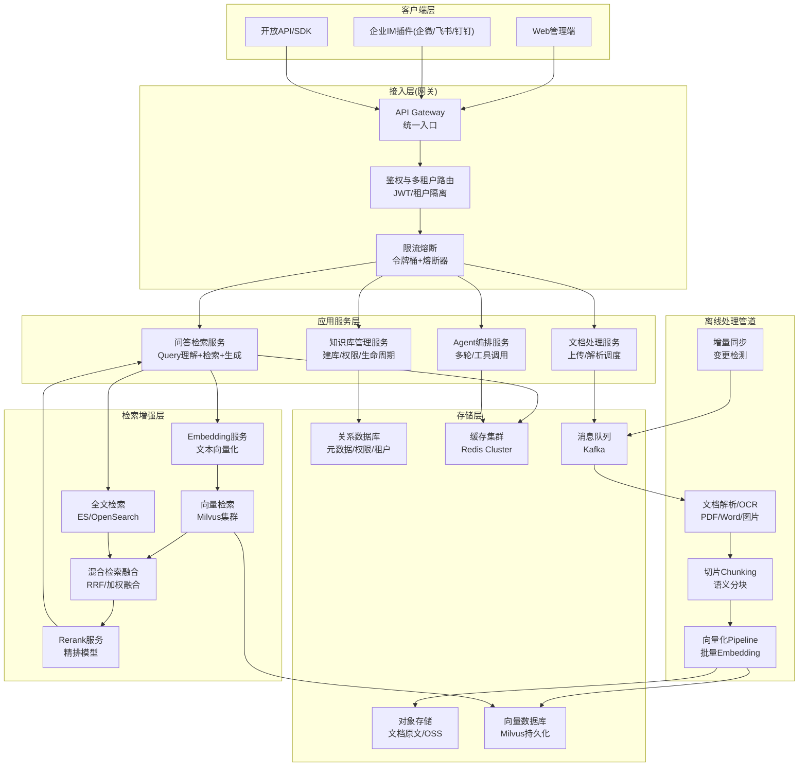
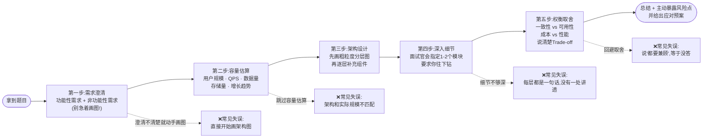
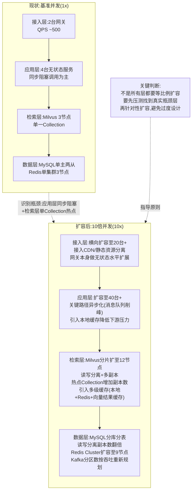

# 第68天:晋升答辩准备(二)—— 项目深挖与系统设计

> 阶段:六、旗舰职业发展篇(Stage 6 · Flagship Career)
> 课程:企业级AI全栈工程师70天特训营
> 主角:陈铭 | 导师:王振宇(老王) | 同事:苏梦、韩露、张凡
> 公司:蓬远科技 | 产品:苍穹企业级智能体中台
> 今日关键词:项目深挖、系统设计、压力追问、两两模拟面试
> 承接:Day67《技术八股准备》 | 预告:Day69《全真模拟晋升答辩》

---

## 【旁白】

如果说昨天(Day67)的技术八股准备,是把陈铭这半年多攒下的知识,一块一块从抽屉里翻出来擦干净、摆整齐,那么今天,老王要做的事只有一件:把这些擦得干干净净的"零件",一件一件地拿起来,拧一拧、掰一掰,看看哪个是真材实料,哪个一用力就散。

技术八股是地基,项目深挖才是真正决定这场晋升答辩能不能过的那道坎。评委不关心你会不会背Transformer的自注意力公式,他们关心的是:你做的这个项目,是不是真的是你做的;你说的这些技术决策,是不是真的想清楚了;你现在给出的这套架构,换一个场景、换一个数量级,还站不站得住。

老王常说一句话:"面试官问项目,不是在考你记不记得住,是在考你有没有真的'活'在那个项目里。"——这句话陈铭是从今天上午九点半开始,一点一点被"逼"着才真正听进去的。

这一天的课堂,没有PPT,没有花活儿。上午是老王一个人,拿着陈铭负责的"寰宇集团企业知识库与智能体项目"复盘文档,坐在陈铭对面,像审问一样地把项目从头拆到尾;下午是全组一起攻克一道经典系统设计题——"设计一个企业知识库系统",随后陈铭和苏梦、韩露和张凡两两分组,互相扮演面试官,老王在边上冷眼观战、随时打断点评。

陈铭后来在自己的复盘笔记里写了一句话:"这一天比过去三个月加起来更让我了解自己做的这个项目。"

好了,旁白就到这里,该干活了。

---

## 晨会纪要

**时间**:2026年X月X日(周三) 09:00-09:20
**地点**:蓬远科技 3楼小会议室"苍穹厅"
**主持人**:王振宇
**参会人**:王振宇、陈铭、苏梦、韩露、张凡
**记录人**:苏梦

### 一、昨日回顾(Day67 技术八股)

老王先花了五分钟做了个简单的复盘。他说昨天四个人各自准备的八股文清单他都翻过了,整体及格,但有个共性问题:"你们背的东西,都是'标准答案',但标准答案是死的,面试官问的问题是活的。你们现在的状态,是把答案焊在脑子里,面试官稍微拧一下问法,你们就卡壳。"

他举了个例子:韩露昨天把"RAG和长上下文的区别"这道题答得滴水不漏,但老王临时追问了一句"那如果客户的知识库只有200篇文档,你还建议用RAG吗",韩露愣了三秒。老王说:"这就是问题,你背的是'RAG vs 长文本'这道题的答案,不是这道题背后的判断逻辑。"

结论:昨天的准备是"知识准备",今天要做的是"应用准备"——把知识用在具体、刁钻、变化的场景里。

### 二、今日安排

老王把今天的安排写在白板上,一共四块:

1. **09:30-12:00 上午场:项目深挖(个人挑战赛)**。老王逐个(今天先轮到陈铭,明天轮流)扮演"刁钻考官",围绕陈铭负责的寰宇集团项目连续追问,不设时间上限,问到陈铭"答不动"为止。苏梦、韩露、张凡在旁边观摩记录,随时可以补问。
2. **13:30-16:00 下午场:系统设计题攻坚**。全员一起做一道题——"设计一个企业知识库系统"。老王先讲标准的系统设计答题方法论,然后陈铭上白板试讲一遍,大家一起补充挑刺。
3. **16:00-17:30 两两模拟面试**。四个人两两分组(陈铭/苏梦一组,韩露/张凡一组),互相扮演面试官和候选人,把上午下午学的东西用一遍。老王轮流巡场点评。
4. **17:30-18:00 收尾复盘 + 布置作业**。

老王特别强调了一句:"今天我不是要为难陈铭,是要提前把明天'全真模拟晋升答辩'里评委可能问的所有变态问题,先在这里练一遍。你们现在觉得难受,是因为我比评委更懂你们项目里的水分在哪儿。真评委没这么熟悉你们的项目,反而问不出这么准的问题——所以我今天问得越狠,你们明天越轻松。"

### 三、分工与产出物

- 陈铭:今天作为"被深挖"的主角,产出一份《项目深挖问答记录》,把老王问的每一个问题和自己的应答、以及事后完善的答案都记下来。
- 苏梦、韩露、张凡:每人今天要提交一份《系统设计题解题笔记》,并各自在两两模拟环节完成一次"面试官"和一次"候选人"角色。
- 全员:今天下班前,把"设计一个企业知识库系统"这道题的架构图、容量估算、扩展方案整理成一份文档,归档到晋升答辩材料库。

会议在09:20结束,老王最后说了句:"陈铭,准备好,我今天不会给你留情面。"

---

## 需求文档:项目深挖问题清单(内部评审版)

> 说明:本清单由老王根据历年晋升答辩评委高频提问方式整理,分为九大维度,今天上午的"刁钻追问"环节基本围绕这份清单展开。陈铭需要对照这份清单,对寰宇集团项目做一次彻底的自我拷问,任何一条答不上来,都要在今天之内补全证据链(数据、代码、决策记录)。

### 维度一:业务价值与背景

1. 这个项目的业务背景是什么?客户为什么要做这件事?不做会怎样?
2. 项目的核心KPI是什么?怎么衡量"做成了"和"没做成"?
3. 你在这个项目里承担的角色边界是什么?哪些是你独立完成的,哪些是团队协作的,哪些是你主导但别人执行的?
4. 如果用一句话向一个完全不懂技术的高管介绍这个项目的价值,你会怎么说?

### 维度二:技术选型的合理性

5. 向量数据库为什么选Milvus,而不是Pinecone、Weaviate、Qdrant、pgvector?
6. Embedding模型为什么选这一款,不选别的?
7. 为什么用RAG架构而不是直接用长上下文窗口把资料塞给大模型?
8. Agent编排框架的选型逻辑是什么?
9. 每一个技术选型,是否都做过对比测试?测试数据在哪里?

### 维度三:架构设计的完整性

10. 画出这个系统的整体架构图,标注每一层的职责。
11. 数据从"客户上传文档"到"用户拿到答案",完整链路经过了哪些组件?
12. 系统里哪些部分是同步调用,哪些是异步处理?为什么这样设计?
13. 系统的单点故障在哪里?你做了哪些容灾设计?

### 维度四:性能与容量(压力追问高发区)

14. 系统当前的QPS、延迟(P50/P95/P99)、并发用户数分别是多少?这些数字的来源是什么(压测报告?生产监控?)?
15. **如果这个设计的并发量翻10倍,会怎样?哪个组件会先扛不住?**
16. **如果客户要求把响应时间从3秒降到1秒,你的方案是什么?**
17. 系统的瓶颈在哪一层?你是怎么定位到的?
18. 缓存命中率是多少?缓存失效策略是什么?

### 维度五:可靠性与降级方案

19. **如果Milvus集群整体挂了,系统的降级方案是什么?**
20. 大模型API超时或限流了怎么办?
21. 系统的SLA承诺是多少?怎么做到的?
22. 出过什么线上事故?怎么发现的、怎么解决的、怎么防止再发生的?

### 维度六:成本

23. 这套系统的月度运行成本大概是多少?成本主要花在哪里(算力、存储、API调用)?
24. **如果老板要求预算砍一半,你会怎么砍?会牺牲什么?**
25. 有没有做过成本优化?优化前后的对比数据是什么?

### 维度七:安全与合规

26. 客户的敏感文档怎么做权限隔离?多租户之间数据会不会串?
27. 大模型调用是否涉及数据出境或第三方API的数据安全问题?
28. 有没有做审计日志?出了数据泄露怎么追溯?

### 维度八:失败与反思

29. **这个项目里,有哪个技术决策,你现在回头看是错的?为什么当时这么选,现在怎么看?**
30. 项目推进过程中最大的一次冲突或分歧是什么?怎么解决的?
31. 如果重新做一次这个项目,你会改哪三件事?

### 维度九:个人贡献的可验证性

32. 你说的"提升了30%的准确率",这个数字是怎么算出来的?有没有可以复现的评测方法?
33. 这个项目里,哪一段代码、哪一个设计文档,是可以证明"这是陈铭做的"?
34. 除了你自己的陈述,团队里谁可以证明你在这个项目里的贡献?

> 老王的批注:"以上34条,今天上午我会挑其中最狠的几条,结合你项目的实际薄弱环节现场追问。答不上来不可怕,可怕的是你答完之后不去补功课。晚上下班前,凡是今天答得不利索的问题,都要在《项目深挖问答记录》里补一版更硬的答案,并附上证据(代码路径、监控截图、压测报告链接)。"

### 问题清单使用说明(老王补充讲解,九大维度逐一拆解)

在正式进入追问环节之前,老王花了大概十分钟,把这九个维度背后的考察意图,一条一条讲给三个人听,这段讲解苏梦记得特别详细,原话基本还原如下。

**关于维度一(业务价值与背景)**,老王说:"很多人上来介绍项目,第一句话就是技术堆栈,'我们用了什么模型、什么框架',这是本末倒置。评委第一反应不是想知道你技术多牛,是想知道这个项目'值不值得做'、'做出来有没有用'。你要先用最朴素的语言讲清楚这个项目解决了什么真实痛点,不做会有什么后果,这样评委才有兴趣往下听你的技术细节。反过来说,如果业务价值讲不清楚,后面技术讲得再漂亮,评委心里也会打一个问号——你是不是在'为了炫技而炫技'。"

**关于维度二(技术选型的合理性)**,老王强调的核心是"对比"二字:"任何一个技术选型,只要你说'我们选了A',评委下一句几乎一定是'为什么不选B'。你必须对每一个关键选型,心里都装着至少两到三个候选方案的对比结论,哪怕这个对比不是你亲自做的,是团队里别人做的,你也要能讲清楚对比的维度和结论,不能一问三不知。"

**关于维度三(架构设计的完整性)**,老王提醒了一个容易被忽视的点:"很多人能画出一张漂亮的架构图,但一问'数据从进来到出去经过了哪些组件',就开始磕磕巴巴,说明这张图是背下来的,不是真正理解的。真正理解架构的人,应该能够顺着任意一条数据流,把整个链路完整地讲一遍,而不是只会指着图上的框念名字。"

**关于维度四(性能与容量)**,老王说这是"压力追问的重灾区,也是最容易涨分或者最容易翻车的区域":"你说的每一个性能数字,背后必须有底气,这个底气来自于你真的做过压测、真的看过监控,而不是凭印象说一个'看起来合理'的数字。评委问'并发翻10倍会怎样'这类问题,考的不是你能不能给出一个万能公式,考的是你有没有'量级意识'和'瓶颈定位能力',能不能在没有现成答案的情况下,当场推理出系统哪里最先扛不住。"

**关于维度五(可靠性与降级方案)**,老王说:"这个维度里最值钱的问题是'如果核心组件挂了怎么办',因为它直接考验你有没有'为最坏情况设计'的工程习惯。很多团队做项目的时候只顾着让'理想路径'跑起来,压根没想过降级路径,一旦被问到,当场就露怯。你们要记住,一个系统真正的工程成熟度,恰恰体现在它的'非理想路径'设计得怎么样。"

**关于维度六(成本)**,老王补充说:"成本这个维度,很多技术人容易答得很'技术化',上来就讲怎么省机器钱、怎么省调用费,却忘了成本决策本身往往是一个业务权衡问题,砍成本一定有代价,你要能讲清楚这个代价是什么,谁来承担这个代价的决策,而不是把自己包装成一个'既能砍成本又不影响任何东西'的超人,这种回答一听就是没有实战经验的空谈。"

**关于维度七(安全与合规)**,老王特别提到寰宇集团这类客户的行业特点:"传统制造业、国资背景的客户,对数据安全和合规的敏感度,往往比互联网公司高得多。这个维度的问题,你答得好不好,直接反映你有没有'企业级'的工程意识,而不是只会做'看起来能跑'的demo。"

**关于维度八(失败与反思)**,老王的态度非常明确:"这是我认为整个问题清单里权重最高的一类问题,没有之一。一个人对自己项目里的失败讲得有多真实、多深刻,基本上就能反映出他的技术成熟度到了哪个层次。回避失败的人,给评委的印象往往是'不成熟'或者'不诚实',这两个印象,任何一个沾上,晋升都会很难。"

**关于维度九(个人贡献的可验证性)**,老王最后说:"你们要习惯一件事——评委不会无条件相信你说的每一句话,尤其是涉及'我个人做了什么贡献'这类陈述,越是自我表述的部分,越需要有可验证的旁证。团队协作的项目里,'哪部分是我做的'这句话,最好的证明方式不是你自己反复强调,而是拿出代码提交记录、设计文档的作者署名、或者干脆让同事在旁边佐证。"

老王讲完这九条,看了看表:"好,理论讲完了,现在开始动手。陈铭,坐过来。"

---

## 架构设计图:企业知识库系统标准答案架构

> 这是老王在下午系统设计环节,针对"设计一个企业知识库系统"这道高频系统设计面试题,带全组共同画出来的"标准答案级"架构图。它不是唯一正确答案,而是一个覆盖了功能完整性、可扩展性、可靠性的参考基线,面试中根据追问方向可以在任意一层展开细节。



**架构分层说明(陈铭在白板上讲解时的口径,也是这一天大家共同打磨出来的表述)**:

- **客户端层**只做展示和交互,不承载业务逻辑,方便未来接入更多渠道(比如后续可能要接的Slack、Teams)。
- **接入层**是整套系统的"门神",统一鉴权、统一限流、统一路由,任何后端服务的横向扩展、灰度发布,客户端完全无感知。这一层也是应对"并发翻10倍"问题时最先要扩容、最容易扩容的一层。
- **应用服务层**做业务编排,四个服务职责边界清晰:知识库管理管"结构",文档处理管"进数据",问答检索管"出答案",Agent编排管"复杂任务"。这四个服务都是无状态的,状态全部下沉到存储层,这是保证水平扩展能力的关键设计原则。
- **检索增强层**是这套系统的技术核心,也是面试官最爱深挖的地方。向量检索解决语义相似度问题,全文检索解决关键词精确匹配和数字、专有名词检索问题(向量检索对这类信息天然不敏感),两者做混合检索融合,再经过Rerank精排,兼顾召回率和准确率。
- **存储层**是系统的"地基",这里要重点讲清楚不同存储选型背后的取舍:对象存储便宜但慢,适合存原文;向量库贵但支持语义检索;关系库保证元数据和权限的强一致性;缓存换的是延迟;消息队列换的是解耦和峰值削峰能力。
- **离线处理管道**是很多候选人容易漏掉的一层——企业知识库不是一次性建好就完事的,文档会持续新增、修改、删除,必须有一套增量同步机制,否则知识库很快就会"过期腐烂"。

---

## 流程图:系统设计题标准答题思路

> 这张图是老王反复强调的"系统设计题万能答题框架",今天下午陈铭在白板上讲解"设计一个企业知识库系统"时,严格按照这个顺序推进,老王要求组里每个人把这五步刻进本能反应里。



**老王对这张图的补充讲解**:

"这五步不是让你死板地一步一步走,而是给你一个'安全网'。系统设计面试最怕两种人:一种是上来就死磕某个技术细节,聊了十分钟还没画出整体架构;另一种是画完架构图就交卷,面试官问啥都答'看情况'。这五步框架的核心价值在于——**先把范围和量级定清楚,再谈架构,架构谈完必须要能往下钻至少一处细节,最后一定要主动暴露权衡取舍**。你们记住,面试官心里给你打分,'权衡取舍'这一步的权重往往比架构图本身还高,因为这最能体现工程判断力。"

---

## 示意图:并发量翻10倍场景下的系统扩展路径

> 这是老王追问陈铭"如果并发量翻10倍会怎样"之后,全组一起在白板上画出来的扩展示意图,后来也成为下午系统设计题里"权衡取舍"环节的重要素材。



**这张图背后的核心结论(也是当天讨论出的共识,记录在《系统设计题解题笔记》里)**:

并发翻10倍,不代表每一层都要"傻等比例"扩容10倍。接入层和应用层因为是无状态的,扩容成本最低、最应该优先扩;检索层(尤其是向量检索)往往是资源消耗大户,盲目扩容成本很高,更应该先通过缓存、预计算、结果复用等手段"削峰",再考虑硬扩容;数据层的扩容涉及分库分表这类结构性改造,成本和风险最高,应该放在最后,并且要提前规划好数据迁移方案,而不是等到扛不住了才手忙脚乱地做。

---

## 课堂笔记

### 上午场:老王的"刁钻考官"追问实录

09:30,大会议室"苍穹厅"。老王把桌上的投影仪关掉,把陈铭那份寰宇集团项目的复盘文档摆在桌子中间,苏梦、韩露、张凡分别坐在两侧,笔记本电脑打开,准备记录。老王没有寒暄,开场就是一句:

"陈铭,现在开始,我是评委,你是候选人。别紧张,但也别放松——今天问的每一个问题,明天答辩现场大概率会以另一种形式再问一遍。开始。先用三分钟,不看稿,把寰宇集团这个项目讲一遍。"

陈铭定了定神,开始讲:"寰宇集团是一家做重型装备制造的传统企业,内部有大量的技术标准文档、设备维护手册、历史故障处理记录,分散在各个部门,员工查资料主要靠人工搜索文件名或者问老师傅。我们给他们做的是一套企业知识库+智能问答系统,基于我们苍穹中台搭建,核心是把这些非结构化文档变成可以被自然语言问答检索的知识库,员工可以直接用中文提问,比如'某型号减速机出现异响的常见原因',系统会给出结合具体文档的答案,并标注引用来源。项目上线三个月后,客户内部的知识检索平均耗时从原来的十几分钟下降到几十秒,员工自助解决问题的比例提升明显。"

老王点点头:"背景讲得可以,套路很熟。现在开始问细节。第一个问题——你的向量数据库选的是Milvus,为什么不选Pinecone?"

**追问一:为什么选Milvus不选Pinecone?**

陈铭："当时我们对比了几个方案,Pinecone是全托管的云服务,好处是不用自己运维,但它是纯SaaS,数据必须出境到它的云上,寰宇集团是有国资背景的制造企业,对数据出境和自主可控有明确的合规要求,这一条直接把Pinecone排除了。剩下的候选是Milvus、Weaviate、Qdrant这几个开源方案,我们做了对比测试,包括写入性能、检索延迟、过滤查询(带条件的向量检索)的支持程度,还有社区活跃度和中文文档的完善度。"

老王皱眉:"你说的'对比测试',数据在哪儿?你现在说个数字。"

陈铭愣了一下,但很快调整过来:"我们在测试环境用了100万条768维的向量做基准测试,数据集是脱敏后的文档切片。Milvus在纯向量检索场景下P99延迟大概是45毫秒,Qdrant是52毫秒,Weaviate在带过滤条件的场景下延迟明显更高一些,大概到120毫秒左右,因为它的过滤是先过滤再检索,在我们这种权限过滤条件复杂的场景里吃亏。另外Milvus支持的索引类型更丰富,我们用的是HNSW索引,精度和速度都比较均衡,而且它对国产化部署和信创环境的适配也做得比较成熟,这个对寰宇集团这种客户很重要。"

老王追了一句:"你刚说的这组延迟数据,是压测报告里的,还是你现在临时编的?"

陈铭一愣,老实说:"压测报告在项目文档库里有存档,今天上午的追问我提前看过一遍,数字是记忆的,细节可能有一两毫秒的误差,但整体量级和结论是压测报告里的原话。"

老王满意地点头:"这个态度是对的。记住,评委问数字,你要么说得出具体来源,要么老老实实说这是我记忆中的量级,数据在报告里可查——千万别不知道来源还硬编一个特别精确的数字,那是找死。继续,第二个问题。"

**追问二:如果这个设计并发量翻10倍会怎样?**

老王身体前倾:"你现在这套架构,线上跑的并发量,给我说个数字。"

陈铭:"寰宇集团这边日常并发不算高,峰值大概在每秒80到100个请求左右,主要集中在早上上班和下午交接班的时间段。"

老王:"那我现在假设,你们签了个大客户,或者寰宇集团把这套系统推广到全集团所有分公司,并发量一下子翻10倍,变成每秒800到1000个请求,你的系统会怎样?"

陈铭想了几秒,走到白板前:"我先说会先崩的地方。第一个瓶颈应该是向量检索层。我们现在Milvus是单集群三节点部署,承载的Collection没有做分片,如果QPS翻10倍,检索层的CPU和内存压力会先顶上去,尤其是我们用了Rerank模型做二次排序,这一步本身就是计算密集型操作,是链路里最重的一环。第二个瓶颈是大模型API的调用配额,我们现在用的是供应商给的固定QPS配额,并发翻10倍很可能直接触发限流,导致大量请求排队甚至超时。"

老王:"那你打算怎么应对?现在就告诉我方案。"

陈铭:"分三层来。接入层和应用层都是无状态服务,直接水平扩容机器数量就能解决,这个成本最低,不用改代码。检索层要做几件事:一是把Milvus从单Collection改成按租户或者按业务域分片,分散热点;二是在检索前面加一层结果缓存,因为企业知识库场景下,很多问题是重复或者高度相似的,缓存命中率其实可以做得很高;三是Rerank这一步可以做降级开关,在极端高并发场景下,先用轻量级的规则排序顶一顶,牺牲一点精度保吞吐。第三层是大模型调用,要做多供应商的负载均衡和降级链路,主模型限流了自动切到备选模型,同时做请求排队和背压控制,避免雪崩。"

老王追问:"你说'缓存命中率可以做得很高',凭什么这么说?你线上真的测过命中率吗?"

陈铭:"测过,我们统计过一个月的问答日志,发现有大概35%的问题和历史问题的语义相似度超过0.92,这部分是可以直接复用缓存结果的,但目前我们没有上语义缓存,只做了完全字符串匹配的精确缓存,命中率只有8%左右。这也是我们规划中的一个优化点,还没有落地。"

老王在纸上记了一下,抬头说:"很好,这个回答比第一个问题的回答更让我满意,因为你清楚地区分了'已经做到的'和'规划中还没做的',而不是把画的饼说成已经实现的东西。这是很多人在答辩现场最容易翻车的地方——把PPT里写的规划当成已经完成的事实来讲,一旦评委追问细节,立刻穿帮。继续,第三个问题。"

**追问三:如果客户要求把响应时间从3秒降到1秒,你怎么办?**

老王:"现在客户嫌慢,说你们系统平均响应要3秒,人家要求砍到1秒以内,不然就不续约了。你怎么办?"

陈铭没有立刻回答,先问了一句:"我可以先追问一下这3秒具体是端到端哪个环节耗时最多吗?我们内部有分环节的耗时监控。"

老王笑了:"很好,这个反问是对的。假设你就是负责这个系统的人,你当然知道耗时分布,我告诉你——Embedding耗时约200毫秒,向量检索约300毫秒,Rerank约400毫秒,大模型生成答案约2秒,这是耗时大头。"

陈铭:"那问题很清楚,90%以上的时间在最后的大模型生成这一步,这一步是无法通过优化前面的检索链路来解决的,必须从生成环节想办法。我能想到几个方向:第一,流式输出,把'首字返回时间'和'完整回答时间'分开看,客户体感的'慢'很多时候是因为等了很久才看到第一个字,如果做成流式输出,首字延迟可以压到几百毫秒以内,用户体感会好很多,即使总耗时没变,满意度也会提升;第二,如果客户对首字延迟要求也很硬,可能需要换更快的模型,比如从一个通用的大模型换成一个经过领域微调的小模型,牺牲一点泛化能力换速度,这个需要评估回答质量是否可接受;第三,对于高频重复问题,提前做预生成缓存,直接命中缓存返回,这部分可以做到毫秒级;第四,减少不必要的模型调用轮次,比如我们现在有些场景是先用大模型做query改写再检索,这一步如果能用规则或者小模型替代,能省掉几百毫秒。"

老王追问:"如果客户说,流式输出体感好归好,但合同里写的是'完整答案返回时间不超过1秒',你怎么办?"

陈铭停顿了一下,说实话:"如果合同真是这么写的,那这是一个纯技术很难单独解决的问题,涉及到模型选型的根本性调整,可能要牺牲回答质量或者知识覆盖的广度。我会先去核实这个1秒的要求背后真实的业务动机是什么——是因为员工等不及、还是有一线操作场景对实时性要求特别高,不同的动机对应的解决方案不一样。如果是后者,可能需要针对这类高实时性场景单独做一条轻量化的问答链路,不追求覆盖所有知识库内容,只覆盖最高频的场景,用小模型加规则引擎做,把'1秒响应'限定在一个可控的子场景里,而不是对整个系统的所有问题都承诺1秒。这其实也是一种业务范围的重新界定,不能什么都自己扛。"

老王点头,转头看向苏梦、韩露、张凡:"你们听到了吗?这个回答的关键不在技术方案本身,在于陈铭没有陷入'客户说什么我就死磕什么'的陷阱,而是先去理解需求背后的动机,再决定用什么范围和什么代价去满足它。这是资深工程师和普通工程师最大的区别之一。"

**追问四:如果Milvus集群整体挂了,你的降级方案是什么?**

老王:"换个方向。现在假设你们的Milvus集群因为某个诡异的Bug,整体挂掉了,三个节点全部不可用,恢复预计需要40分钟。这40分钟里,你的系统怎么办?是直接对外报错,还是有别的方案?"

陈铭:"我们确实遇到过一次接近这种情况的故障,不是Milvus整体挂,是网络分区导致其中一个节点失联,但当时的应对思路是相通的。理想的降级方案分几个层次:第一层,如果只是部分检索能力下降,系统会自动降级到全文检索(ES)单独工作,牺牲语义检索能力,只用关键词匹配,这样至少还能返回相关文档,只是精度会下降;第二层,如果检索完全不可用,系统会走一个'兜底话术+人工客服转接'的降级路径,明确告知用户'知识库暂时不可用,已为您转接人工',而不是让用户干等或者报错;第三层,从系统设计角度,我们后来做了改进,给Milvus增加了跨机房的多副本部署,并且在应用层加了健康检查和自动切换逻辑,单个副本组不可用时可以自动切到备用副本组,减少人工介入恢复的时间。"

老王追问:"你说'我们后来做了改进',说明这个降级方案在故障发生的时候是不存在的?你是故障之后才补的?"

陈铭老实回答:"对,这是一个真实的教训。故障发生的时候,我们的系统没有优雅降级,是直接对外报错,客户当时投诉了。事后我们做了复盘,补上了刚才说的多层降级方案。这也是我想在答辩里重点讲的一个'从失败中学习'的案例,而不是回避这个事故。"

老王笑了:"这就对了。很多人怕在答辩里提自己项目出过事故,觉得这是减分项,其实恰恰相反——一个把故障讲清楚、把复盘讲透、把改进方案讲实的候选人,比一个只会说'我们项目一直很顺利'的候选人,可信度高得多,评委见得多了,一听'项目一路顺风顺水'反而会怀疑你是不是在美化。继续。"

**追问五:为什么用RAG架构而不是直接用长上下文窗口把资料塞给大模型?**

老王:"现在的大模型上下文窗口越来越长,有些能到一百万token甚至更多。你为什么还要费劲做RAG,切片、建索引、做检索,直接把客户的文档全部塞进prompt让模型自己读,不是更简单吗?"

陈铭:"这个问题要分场景看。如果客户的知识库总量很小,比如几十篇文档,长上下文直接塞进去确实是更简单粗暴的方案,不需要维护检索链路。但寰宇集团这个项目,知识库总量是十几万份文档,即便用超长上下文模型,也不可能把十几万份文档全部塞进一次请求里,首先是token成本会爆炸,其次是长上下文模型存在'中间遗忘'问题,就是在超长文本里,模型对中间部分内容的关注度和召回准确率会明显下降,这是有公开评测数据支撑的现象,不是我们主观猜测。另外,长上下文方案没有办法做权限过滤——RAG架构里,检索阶段可以结合用户权限动态过滤掉不该看到的文档,如果是把所有文档都塞进上下文,权限控制就变得非常困难,而寰宇集团对不同部门、不同岗位的文档访问权限有明确要求,这是硬性合规需求。"

老王追问:"那如果客户知识库确实不大,只有五十篇文档,你还坚持用RAG吗?"

陈铭:"如果只有五十篇文档,而且没有权限隔离的要求,我会倾向于用长上下文方案,或者干脆两者结合——检索一步做粗筛,把可能相关的文档全部作为上下文交给模型,省掉复杂的切片和精排逻辑,减少维护成本。技术选型从来不是非黑即白,是要看具体场景的规模、成本、合规要求来定,这也是我们内部做架构评审时反复强调的一点。"

老王满意地记下:"这个回答比昨天韩露的表现好——不是死守一个技术立场,而是能根据场景切换判断。继续,还有几个问题。"

**追问六:这套系统跑了多久,峰值QPS多少,你怎么证明这些数字不是编的?**

老王:"你刚才提到了几个数字,峰值QPS、准确率提升,这些数字在答辩PPT里肯定也会出现。评委问你,这些数字怎么来的,你怎么证明不是你自己编的?"

陈铭:"这个问题我们其实提前做了准备,今天上午整理证据链的时候也重新过了一遍。峰值QPS的数字来自我们的监控系统Grafana仪表盘,这个仪表盘的历史数据是保留的,可以直接截图或者现场调出来给评委看;准确率提升的数字来自我们的离线评测集,这个评测集是我们自己标注的200道典型问答对,每次模型或者检索策略调整之后都会跑一遍这个评测集,结果存在评测报告里,这些报告都有归档日期,可以看到优化前后的对比曲线;另外还有客户方的验收报告,里面有客户自己统计的'员工查资料平均耗时'的对比数据,这个是第三方的数据,可信度更高。总结来说,我说的每一个数字,背后都对应一份可以拿出来的原始材料,而不是我口头总结的印象。"

老王点头:"这个准备工作是对的。明天全真模拟的时候,我建议你把这几份关键材料的截图或者链接直接整理进答辩附件里,评委临时抽查的时候,你能秒回材料,比你嘴上说'我记得是这样的'要有说服力十倍。"

**追问七:如果老板要求预算砍一半,你会怎么砍?**

老王:"换个角度,现在假设公司高层觉得这个项目成本太高,要求你把月度运行成本砍掉一半,你会砍哪里?"

陈铭:"我们的成本主要分三块:大模型API调用费用、Milvus和ES这些检索组件的机器成本、以及存储成本。占比最大的是大模型调用费用,大概占了整体成本的60%左右。要砍成本,我会先看能不能减少不必要的模型调用——比如刚才提到的query改写这一步,如果能用规则或者更便宜的小模型替代大模型,能省下不少调用费用;第二,可以对模型做分级调用,简单问题用便宜的小模型直接回答,复杂问题才调用贵的大模型,这个需要一个问题复杂度的分类器,但分类器本身成本很低;第三,检索层可以通过提升缓存命中率减少重复的向量检索和Rerank调用,这部分是纯计算成本,优化空间也不小;第四,机器资源上,如果流量有明显的峰谷特征,可以用弹性伸缩替代常年按峰值预留资源,峰谷差异大的话这一项能省下相当可观的一笔。但我要提醒的是,砍成本一定是有代价的,比如模型分级调用可能会牺牲一部分复杂问题的回答质量,这个需要业务方一起权衡,不是纯技术单方面能决定的。"

老王:"这个回答里,'牺牲一部分回答质量,需要业务方一起权衡'这句话说得好。技术人员最容易犯的错,就是把商业决策当成纯技术问题自己扛下来,该拉着业务方一起承担的权衡,不能自己一个人扛。"

**追问八:这个项目里,有哪个决定,你现在回头看是错的?**

老王把这个问题留到了最后:"最后一个问题,也是我认为今天最重要的一个问题。这个项目做到现在,有没有哪个技术决策,你现在回头看,觉得当时是错的?"

会议室安静了几秒钟。陈铭没有立刻回答,苏梦在旁边偷偷看了他一眼。

陈铭最终说:"有。我们在项目早期,切片策略选择的是固定长度切片,按照每500个字符切一段,重叠50个字符。这个方案实现简单,上线也快,但后来发现一个问题:很多技术文档里,一个完整的故障处理步骤,或者一张表格,被固定长度切片硬生生切断了,导致检索出来的片段是不完整的,回答质量因此打了折扣。这个问题我们大概是上线两个月之后才通过客户反馈发现的,后来改成了基于文档结构的语义切片,按照标题、段落、表格边界来切,效果明显改善,但这个返工花了我们差不多两周时间,还影响了当时的另一个交付节点。回头看,如果项目最开始就投入时间做语义切片而不是图快用固定长度切片,能省下后面这两周的返工时间。当时选固定长度切片,主要是为了赶上第一个演示节点,属于典型的'为了短期交付牺牲了长期质量'的决策,现在看是有代价的。"

老王沉默了几秒,说:"这个回答,是我今天最想听到的答案。很多人被问到'哪个决定是错的'这种问题,会本能地回避,或者说一些不痛不痛的小问题来'献祭',比如'我们当时命名规范不够统一'这种无关紧要的话。你刚才说的这个,是真正影响了交付质量和进度的决策错误,而且你讲清楚了当时为什么这么选、后来怎么发现问题、怎么改的、代价是什么。这才是有分量的反思。评委在答辩现场最爱问这类问题,就是想看你有没有'诚实面对自己错误'的能力,这个能力比你吹嘘自己做了多牛的项目更能体现你的成熟度。"

**同事补问环节:苏梦、韩露、张凡轮流追问**

老王转向苏梦、韩露、张凡:"按照晨会说的,你们三个随时可以补问。现在轮到你们上场了,别光看戏。"

苏梦第一个开口,她想到了刚才老王讲的"维度九":"陈铭,你刚才说这个项目里很多决策是你主导的,但我记得实际写代码的时候,切片策略从固定长度改成语义切片这块,好像韩露也参与了不少,对吧?那你说'这是我主导的决策',这个说法怎么证明不是你一个人的一面之词?"

陈铭想了一下,答得很直接:"这个问题问得好,我确实要澄清一下边界。语义切片方案的选型和设计文档是我写的,设计评审会议记录里可以看到方案作者是我,但具体的代码实现,韩露确实承担了大概三分之一的工作量,尤其是表格识别那部分的解析逻辑,是她主导写的。如果要证明这个'边界',最直接的证据就是我们内部代码仓库的commit记录和Pull Request的审核记录,我的commit集中在切片策略核心逻辑和文档解析调度部分,韩露的commit集中在表格结构识别部分,这些都是可以在答辩现场直接调出来给评委看的,不需要我口头空口白牙地说。"

老王点评:"这个回应很扎实,他没有回避'不是我一个人做的'这个事实,反而主动把边界划清楚,还给出了可验证的证据来源。这就是维度九要考的东西——你说的'贡献',能不能被独立验证,而不是自吹自擂。"

韩露接着问,她关注的是成本和技术选型的交叉点:"你刚才说向量维度是768,用的开源Embedding模型。那你们后来有没有评估过换成更大维度、精度更高的商业Embedding模型?如果评估过,为什么最后还是没换?"

陈铭:"评估过,大概在项目上线半年后,我们做过一轮对比,商业模型在我们的评测集上准确率能提升大概4到5个百分点,但调用成本是开源自部署模型的很多倍,而且商业模型的调用需要经过外部API,寰宇集团这类客户对数据出境非常敏感,即便厂商承诺不留存数据,客户的合规部门也很难点头。综合评估下来,4到5个百分点的准确率提升,不足以覆盖成本增加和合规风险,所以最终决定继续用开源自部署方案,把优化精力放在了Rerank模型微调和检索策略优化上,这两块投入产出比更高。"

韩露追问:"如果客户是一个对合规没有那么敏感、更看重效果的互联网公司客户,你的结论会不会不一样?"

陈铭:"会不一样。如果是这种客户,商业模型的合规顾虑基本不存在,4到5个百分点的准确率提升可能就值得为之付出更高的调用成本,这也是我刚才提到的核心逻辑——技术选型永远要绑定具体客户的具体约束条件,同一个技术决策在不同客户身上可能是完全相反的最优解。"

最后是张凡,他问了一个偏运维视角的问题:"你刚才讲降级方案的时候提到了跨机房多副本部署,那这个多机房部署,数据同步是怎么做的?如果两个机房之间网络延迟增大,会不会出现数据不一致的问题?"

陈铭这次明显思考了更长时间才回答:"跨机房的向量数据同步,我们用的是Milvus自带的数据导入导出工具做定期批量同步,不是实时同步,同步周期是每小时一次。这意味着两个机房之间的数据存在一个最多一小时的延迟窗口,如果客户在这个窗口内新增了文档,而恰好主机房故障切换到备机房,备机房可能查不到这最新一小时新增的内容。这确实是一个已知的短板,目前我们是通过缩短同步周期到15分钟,并且在故障切换发生时,给用户一个'部分数据可能未同步,请稍后重试'的提示来缓解,但没有做到真正的实时强一致同步,如果要做,可能需要引入类似Milvus的CDC(变更数据捕获)能力或者自建的实时同步管道,这个我们目前还在评估成本收益。"

老王听完点评:"张凡这个问题问得挺专业,已经有点系统设计面试官的意味了。陈铭这个回答也很诚实,没有把'定期批量同步'包装成'实时同步',而是把已知短板和缓解措施都讲清楚了。你们发现没有,这三个补问,分别从'贡献边界'、'技术选型的场景依赖性'、'数据一致性的真实实现细节'三个角度切入,每一个都戳中了陈铭刚才主陈述里一带而过、没有主动展开的地方——这就是好问题的标准:不是凭空发问,是在对方的陈述里找那些'讲得含糊'的缝隙,往里钻。"

老王看了下时间,已经十一点四十五了:"上午先到这里,还有些问题我留着,下午或者明天再问。陈铭,你今天中午吃饭的时候好好想想我们上午聊的这些,不要觉得我是在为难你,这些问题,答辩现场评委一定会用不同的措辞问出类似的东西。你今天答得整体不差,但有几处反应速度还可以再快一点,尤其是被追问'数据来源'的时候,不要愣。"

苏梦这时候插了一句:"老王,那我们几个下午会不会也被这么问?"

老王笑了:"明天开始轮流,今天陈铭先当靶子,你们几个先学着怎么当刁钻考官,下午两两模拟的时候,你们要学着像我这样问陈铭,也要学着像陈铭这样答别人的追问。"

### 下午场:系统设计题攻坚——"设计一个企业知识库系统"

13:30,午休结束,大家重新聚到会议室。老王把白板擦干净,写下题目:

**"请设计一个企业级知识库系统,支持员工上传文档、自动构建知识库,并支持自然语言问答检索。"**

老王说:"这道题看起来很像你们做的寰宇集团项目,这不是巧合,是我故意的——晋升答辩里最常见的系统设计题,往往就是让你重新设计一遍你自己做过的东西,或者是它的变种。这样面试官既能考你系统设计能力,又能顺势看看你做的项目跟'标准答案'比,差在哪儿、强在哪儿。现在陈铭上白板,按照我们刚才画的那个'五步法',把这道题讲一遍,当作是你在真实的晋升答辩现场。"

陈铭走到白板前,拿起马克笔。

**第一步:需求澄清**

陈铭没有直接画图,先开口:"在开始设计之前,我想先澄清几个问题。第一,这个知识库系统的用户规模大概是多少?是几百人的中小团队,还是几万人的大型集团?第二,支持的文档类型有哪些,是纯文本,还是包括PDF、Word、Excel、图片扫描件这些复杂格式?第三,是否需要支持多租户,也就是不同部门、不同公司的知识库是否需要严格隔离?第四,对实时性有什么要求,文档上传之后多久需要能被检索到?第五,是否有权限管理的需求,比如某些文档只能特定角色看到?"

老王扮演面试官回答:"假设是一个中大型企业集团,员工规模五万人左右,文档类型覆盖PDF、Word、Excel、扫描件OCR,需要严格的多租户和权限隔离(集团下面有多个子公司,数据不能互通),文档上传后要求5分钟内可检索,支持自然语言问答,同时要保留传统的关键词搜索能力。"

陈铭点头,在白板一角记下这些约束条件:"好,那我先总结一下功能性需求:一是文档管理(上传、解析、更新、删除、版本管理);二是知识库构建(自动切片、向量化、索引构建);三是检索问答(自然语言问答+传统关键词检索);四是权限与多租户管理;五是运营管理(知识库使用统计、内容审核)。非功能性需求:高可用、低延迟、可扩展、数据安全合规、成本可控。"

老王在旁边点评(对苏梦、韩露、张凡说):"你们注意,陈铭这一步做的事,叫'把模糊的题目变成可以设计的规格'。很多人上来就画图,画到一半发现自己理解的需求和面试官想考的完全不是一回事,那前面画的图全废了。永远先花两三分钟做需求澄清,这个投入产出比极高。"

**第二步:容量估算**

陈铭继续:"接下来做容量估算。五万员工规模,假设日活跃用户是员工数的20%,大概一万人;假设每个活跃用户平均每天提问5次,那么日问答请求量大概是5万次;按照工作时间8小时集中分布,平均QPS大概是5万除以8乘3600,大约1.7,但考虑到早上上班和下午上班后的两个高峰时段流量会集中,峰值QPS估算为平均值的10到20倍,大概在20到35之间,留一些余量,我们按峰值QPS 50来设计系统容量。"

老王插话:"这个估算方法对不对?"

陈铭:"这是一个常见的'漏斗式'估算方法:总用户数→活跃比例→单用户行为频次→总请求量→按时间分布折算成QPS→再乘以峰值系数留出余量。这个估算不需要精确,面试官要看的是你有没有'量级意识',数字上下浮动一倍都不是大问题,但如果算出来的QPS是几万这种明显脱离常识的数字,就说明估算方法有问题。"

他接着算存储量:"文档规模,假设集团现有存量文档100万份,平均每份文档大小2MB,原文存储总量大概2TB,这部分放对象存储,成本很低。切片之后,假设每份文档平均切成20个片段,总片段数是2000万,每个片段的向量维度按1536维、float32存储,单个向量大小约6KB,2000万个向量总大小约120GB,这个规模Milvus单集群完全可以承载,不需要过度设计分布式方案,但要考虑未来3到5年的数据增长,按年增长50%估算,3年后向量总量可能到400GB左右,需要提前规划扩容路径。"

**第三步:架构设计**

陈铭转向白板另一侧,开始画图(即前文"架构设计图"的简化版本),分层讲解客户端层、接入层、应用服务层、检索增强层、存储层、离线处理管道各自的职责,这部分内容与前面"架构设计图"章节的讲解基本一致,不再重复展开。

老王在这一步打断了两次:

第一次打断,老王问:"你的接入层为什么要单独拆出鉴权和限流,不能让每个后端服务自己做鉴权吗?"

陈铭:"可以,但会有几个问题。第一是重复实现,每个服务都要写一套鉴权逻辑,维护成本高,而且容易出现有的服务鉴权做得严、有的服务做得松,产生安全漏洞;第二是性能,统一在网关层做鉴权,鉴权失败的请求直接被拒绝,不会消耗后端服务的资源;第三是可观测性,所有的访问日志、限流熔断策略都集中在一层,方便统一监控和调整策略,不需要改动业务代码。"

第二次打断,老王问:"你的检索增强层为什么要同时保留向量检索和全文检索两条路,不能只用向量检索吗?"

陈铭:"向量检索擅长语义相似度匹配,比如用户问'机器异响怎么处理',即使文档里没有出现'异响'这个确切词,只要语义相关,向量检索也能召回;但向量检索对精确匹配不敏感,比如用户要查一个具体的设备型号、一个具体的错误代码,这种场景下关键词精确匹配的全文检索反而更可靠,而且向量检索存在'语义漂移'的风险,可能召回一些语义相近但实际不相关的内容。所以工业界比较成熟的方案是做混合检索,两条路的结果做融合排序,兼顾语义理解和精确匹配。"

**第四步:深入细节**

老王说:"好,整体架构讲完了,现在我要往下钻。挑两个模块。第一个,你的Chunking(切片)策略具体怎么做?第二个,多租户的权限隔离具体怎么实现,能不能做到向量检索层面的隔离,而不只是应用层过滤?"

陈铭讲切片策略:"切片策略我们经历过一次教训(这里陈铭提到了上午跟老王讨论过的固定长度切片翻车的故事),现在采用的是基于文档结构的语义切片:先用文档解析工具识别出标题层级、段落、表格、列表这些结构化元素,切片时尽量保证一个完整的语义单元(比如一个小节、一张表格)不被切断,对于特别长的段落,再按照句子边界做二次切分,并保留一定的重叠(比如50到100个字符),避免上下文断裂导致语义丢失。另外我们会给每个切片附带元数据,比如所属文档、所属章节标题、页码,这些元数据在检索之后可以用于结果溯源,也可以用于后续的重排序参考。"

讲权限隔离:"权限隔离有两层。第一层是应用层的租户隔离,每个租户在关系数据库里有独立的命名空间,查询时强制带租户ID过滤,这是最基本的防线。第二层是向量检索层的隔离,这里有两种做法:一种是物理隔离,不同租户使用不同的Milvus Collection,隔离最彻底,但租户数量多了之后管理成本高,而且小租户的Collection资源利用率低;另一种是逻辑隔离,所有租户共用Collection,但在向量的元数据里带上租户ID字段,检索时用Milvus支持的标量字段过滤功能,在向量检索阶段就把不属于该租户的向量排除掉,而不是等检索完了再在应用层过滤——这一点很关键,如果是检索完再过滤,会导致召回的有效结果数量不足,比如你要召回top 10,如果检索阶段没有做租户过滤,召回的10条里可能有7条是别的租户的、要在应用层被过滤掉,最后只剩3条真正可用的结果,这是很多人容易踩的坑。寰宇集团这个项目因为客户规模没有特别大,加上有强隔离的合规要求,我们最终选择了物理隔离,按子公司拆分Collection;但如果是SaaS化产品,面向大量中小租户,我会推荐逻辑隔离加向量层过滤,兼顾隔离性和资源利用率。"

老王点评:"这个回答里,你注意到没有,陈铭又一次做到了'区分场景给出不同方案',而不是给一个放之四海而皆准的答案。这是系统设计面试里最值钱的能力。"

**第五步:权衡取舍**

老王:"最后一步,权衡取舍,你说说这套系统设计里,有哪些明显的Trade-off?"

陈铭:"至少有三个。第一,一致性与可用性的权衡:文档上传之后,向量化和索引构建是异步处理的,这意味着用户上传文档后,短时间内可能查不到刚上传的内容,这是牺牲了'强一致性'换来的系统解耦和吞吐能力,如果业务方要求'上传即可查',就需要改成同步处理,但会拉长上传接口的响应时间,也会让接入层承受更大的压力。第二,成本与性能的权衡:向量检索的精度和速度是有取舍的,索引类型、召回数量、Rerank模型大小都直接影响成本和延迟,不存在'又快又准又便宜'的方案,必须根据业务对准确率和延迟的容忍度做具体的参数调优。第三,隔离性与资源利用率的权衡:刚才说的物理隔离和逻辑隔离,隔离越彻底,资源浪费越多,管理越复杂;隔离越松,资源利用率越高,但要投入更多工程精力保证租户之间不会互相影响或者数据泄露。"

老王满意地点点头,合上笔记本:"好,这道题讲完了。总体来说,陈铭今天的表现,比我预期的要好,尤其是下午这道系统设计题,五步法的节奏掌握得不错。但我要提一个问题——你刚才全程没有主动提到'监控和可观测性'这一块,如果面试官问你'系统上线之后,你怎么知道它运行得好不好',你打算怎么答?"

陈铭想了想:"这确实是我刚才漏掉的一块。应该有一套完整的可观测性体系:日志(全链路的请求日志,带TraceID方便排查)、指标(QPS、延迟分布、错误率、缓存命中率、Milvus集群负载、大模型调用成功率和延迟)、告警(关键指标越过阈值自动告警,比如P99延迟超过某个数值,或者错误率超过1%)、以及面向业务的效果监控(比如低质量回答的比例,用户的点赞点踩反馈率)。这一块我确实应该主动提,而不是等被问到才补。"

老王:"记下来,晋升答辩里,'可观测性'和'如何衡量系统健康度'是一个非常容易被漏掉但又很容易加分的点,你下次讲系统设计题的时候,主动把这块加进去,不用等对方问。"

### 下午场:两两模拟面试(陈铭 vs 苏梦)

16:00,老王宣布进入两两模拟环节,分组是陈铭和苏梦一组,韩露和张凡一组,分别在会议室两侧进行,老王在中间来回巡场。

**第一轮:苏梦扮演面试官,陈铭扮演候选人**

苏梦拿着自己昨天准备的问题清单,先问了一个热身问题:"陈铭,简单介绍一下你自己和你最近做的项目。"

陈铭按照标准的自我介绍框架讲了一遍(项目背景、个人角色、技术亮点、业务成果),用了大概两分钟。

苏梦接着抛出一个刁钻问题:"你刚才提到你们做了混合检索,向量检索和全文检索的结果怎么融合排序的?具体的融合公式是什么?"

陈铭:"我们用的是RRF(Reciprocal Rank Fusion,倒数排名融合)算法,简单说就是把两路检索结果各自的排名倒数加权求和作为融合分数,排名越靠前的结果贡献的分数越高,这样不需要两路检索结果的分数在同一个量纲上就可以直接融合,因为向量检索的相似度分数和全文检索的BM25分数天然不在一个尺度上,直接加权求和是不合理的,RRF巧妙地绕开了这个量纲不一致的问题。"

苏梦追问:"如果RRF融合完之后,排在前面的结果还是不够准,你会怎么优化?"

陈铭:"下一步是Rerank精排,用一个专门训练过的排序模型,输入是query和候选文档片段,输出是一个更精细的相关性分数,再重新排序一次。这一步计算成本比向量检索高,所以一般只对融合后的前20到30个候选结果做精排,而不是对全部召回结果做,这样兼顾效果和成本。"

苏梦这时候卡了一下,不知道怎么继续深入追问,老王在旁边轻声提醒她:"你可以问他,Rerank模型选型和训练数据从哪来。"

苏梦顺势追问:"那你们的Rerank模型是自己训练的还是用开源的?训练数据从哪里来?"

陈铭:"寰宇这个项目用的是开源的Rerank模型做微调,训练数据来自我们前期的人工标注,标注了大概3000条query-文档相关性打分对,用这些数据在开源base模型上做了一轮微调,离线评测集上的排序准确率相比不做Rerank提升了大概12个百分点。"

苏梦模拟面试结束后,老王点评:"苏梦,你的问题设计整体不错,但有一点要注意——你在陈铭回答完RRF之后,直接问的是'怎么优化',这个问题稍微有点大,导致陈铭其实是自己把话题引到了Rerank上,而不是被你精准地问到。更刁钻的问法应该是直接问'RRF的权重怎么定,两路结果权重一样吗',这种问题更具体,更能考出候选人是不是真的懂细节,而不是知道有这个概念。你要学会把大问题拆成更具体的小问题去问。"

**第二轮:陈铭扮演面试官,苏梦扮演候选人**

角色互换,陈铭问苏梦她自己负责的模块(苏梦这段时间主要负责的是Agent工具调用和多轮对话状态管理的部分)。

陈铭问:"你负责的Agent多轮对话,状态是怎么维护的?如果一个用户的对话会话很长,状态存储会不会有问题?"

苏梦:"我们用Redis存储会话状态,每个会话有一个唯一的session ID,状态以Key-Value形式存储,设置了30分钟的过期时间,超过30分钟没有新消息,会话自动清空。如果对话很长,我们做了滑动窗口截断,只保留最近的若干轮对话作为上下文,超出窗口的历史对话会做摘要压缩,用一个小模型把早期的对话内容压缩成一段简短的摘要,附加在上下文最前面,这样既保留了长程记忆的关键信息,又不会让上下文无限增长。"

陈铭追问:"如果Redis挂了,正在进行中的会话会怎样?"

苏梦这里明显犹豫了一下:"Redis挂了的话……会话状态会丢失,用户可能需要重新开始对话。"

陈铭继续追问:"那这个是可以接受的吗?有没有想过怎么优化?"

苏梦:"这确实是个薄弱点,目前没有做容灾方案。理论上可以考虑Redis做主从加哨兵或者Cluster模式提高可用性,或者对特别重要的会话状态做定期的异地持久化备份,但这块我们项目目前还没有具体落地。"

老王在旁边打断:"陈铭,你觉得苏梦刚才这个回答,及格吗?"

陈铭想了想说:"及格,但不算亮眼。她诚实地说了'目前没有落地',这个态度是对的,但如果能进一步说清楚'为什么当时没有优先做这个',或者'如果要做,大概的优先级和方案是什么',会更完整。就像老王上午问我'哪个决定是错的'一样,承认不足只是第一步,更重要的是展示你对这个不足的思考深度。"

老王点头:"说得对。苏梦,你听到了吗?下次被问到薄弱环节,不要止步于'这确实是不足',要往前多走一步,给出你的判断和思路,哪怕这个思路还没有落地实施。"

苏梦不好意思地笑了笑,记在了自己的笔记本上。

老王最后总结了两两模拟这一环节:"今天这一轮练习,我看下来最大的收获,不是你们答得多好,而是你们开始学会'怎么问'。会问刁钻问题,本身就是理解系统设计和项目深挖逻辑最好的方式——因为你要能问出一个好问题,你自己必须先想清楚这个系统在极端场景下会怎样。"

### 下午场:两两模拟面试(韩露 vs 张凡)

会议室另一侧,韩露和张凡这一组的进展,老王也走过去旁听了一段时间。相比陈铭和苏梦那边围绕一个大项目深挖,韩露和张凡负责的都是"苍穹中台"里相对独立的功能模块——韩露主要负责文档解析和OCR识别流程,张凡主要负责监控告警体系和成本核算模块,两人一开始都不太知道该怎么把系统设计题的框架套到自己的模块上。

**第一轮:张凡扮演面试官,韩露扮演候选人**

张凡照着自己准备的清单问:"韩露,你负责的文档解析这一块,遇到扫描件识别不准的问题,你们怎么处理?"

韩露:"我们用的OCR引擎对印刷体文字的识别准确率还可以,大概能到97%以上,但寰宇集团这类制造企业的很多历史文档是手写记录或者年代久远的扫描件,清晰度差,识别准确率会掉到80%左右甚至更低。我们的处理方式是,OCR识别完之后加一层规则校验,比如检测识别结果里是否有大量乱码字符、专有名词是否命中已知的设备型号词表,如果校验不通过,会把这份文档标记为'低置信度',推送到人工审核队列,由客户方指定的资料员人工校对确认后才正式入库。"

张凡追问:"如果客户嫌人工审核太慢,要求全部自动化,你怎么办?"

韩露这里稍微停顿了一下,说:"如果完全去掉人工审核,低置信度的文档还是会被自动入库,风险是知识库里可能存在一些被识别错误的内容,用户查到的答案可能是基于错误的原文生成的,这个风险如果客户能接受,那确实可以去掉人工审核提升自动化程度和效率;但如果客户对准确性要求高,这个人工审核环节目前来看是没办法省的,只能想办法把人工审核的效率提上去,比如做一个高效的审核工具,让资料员一眼就能看出哪里可能识别错了,而不是要通读全文比对。"

张凡继续追问:"那你有没有想过用更好的OCR模型,减少低置信度文档的比例,从而减少对人工审核的依赖?"

韩露:"这个我们确实在做,最近在评估一个新的多模态大模型做文档理解,不只是识别文字,还能结合上下文和文档结构做语义级别的校验,初步测试下来低置信度文档的比例能从大概15%降到8%左右,但这个方案还在验证阶段,没有正式上线,成本也比现在用的传统OCR方案高不少,还需要做ROI评估。"

老王在旁边听完插话:"张凡,你这几个追问,方向是对的,一步一步逼近了'自动化和准确性的权衡',但你有没有想过再往深一层问——'低置信度的判断标准是怎么定的,15%这个门槛值是拍脑袋定的还是有数据支撑的'?这才是真正的细节题,决定了这个方案是不是真的经过工程验证,而不是一个大概的经验数字。"

**第二轮:韩露扮演面试官,张凡扮演候选人**

角色互换,韩露问张凡负责的成本核算模块:"你说的这套成本监控体系,能精确到给每个租户算出实际的调用成本吗?怎么做到的?"

张凡:"我们给每一次大模型调用、每一次向量检索、每一次Rerank都打上了租户ID和调用类型的标签,通过埋点采集调用耗时和资源消耗数据,再结合各家云厂商和模型供应商的计费规则,做了一个成本归因引擎,可以按天、按租户、按调用类型汇总出实际成本。这套东西现在已经在跑,每天凌晨会生成前一天的成本报表。"

韩露追问:"如果同一次问答请求里,既调用了主力大模型,又因为限流降级切换到了备用模型,这次请求的成本怎么算?算在哪个模型头上?"

张凡愣了一下:"这个……目前的统计逻辑是按实际调用的模型来算成本,如果一次请求先调用主力模型超时失败,又调用了备用模型成功返回,理论上两次调用的成本都会被记录下来,叠加计入这次请求的总成本,这样统计出来的单次请求成本会偏高一些,但这确实更贴近真实花费,因为失败的调用厂商很多时候也是要收费的,或者至少占用了配额。"

韩露继续问:"那这种'因为降级导致成本偏高'的情况,你们有没有单独统计过占比?如果占比很高,说明限流降级触发得太频繁,反而是一种隐性的成本浪费信号。"

张凡这时候露出了略显意外的表情:"这个角度我们还真没有单独拆出来看过,目前的报表只是汇总总成本,没有细分'降级导致的额外成本'这个维度。你这个问题提得挺好,我回去可以在成本归因引擎里加一个标签,统计因降级重试产生的额外调用成本占比,这个数据其实对我们判断限流阈值设置是否合理很有参考价值。"

老王这时候笑着说:"你们看,这就是一个好的追问能带来的价值——韩露刚才这个问题,不只是在'考'张凡,其实是帮他发现了自己系统里一个之前没意识到的观测盲区。系统设计和项目深挖的对话,好的时候不是单向的'考试',而是双向的'共同发现问题',这才是最高级的技术讨论状态。"

老王最后总结了两两模拟这一环节:"今天这一轮练习,我看下来最大的收获,不是你们答得多好,而是你们开始学会'怎么问'。会问刁钻问题,本身就是理解系统设计和项目深挖逻辑最好的方式——因为你要能问出一个好问题,你自己必须先想清楚这个系统在极端场景下会怎样。韩露、张凡那边虽然模块相对独立,深挖的深度目前还不如陈铭和苏梦那边,但今天下午这几轮下来,已经能看到你们俩开始学着往细节里钻了,这个进步比表面上'答得对不对'更重要。明天我会重点抽你们俩多练几轮,把苍穹中台整体架构的理解补上来,不能只守着自己那一块模块。"

---

## 代码实战:系统设计题关键组件实现

> 下午系统设计题讨论中,老王要求把"并发翻10倍"场景下最容易被追问细节的三块代码——限流器、缓存层、负载均衡扩展配置——落到具体的可运行代码上,不能只停留在"画个框图"的层面。以下代码由陈铭牵头、苏梦和韩露分别补充测试用例,晚上统一整理进项目代码仓库的 `docs/design/day68-system-design/` 目录下。

### 一、限流器实现

#### 1.1 令牌桶限流器(Python 单机版)

```python
"""
token_bucket.py
单机令牌桶限流器实现。
用于网关层对单个客户端/租户维度做请求限流,平滑突发流量。
"""

import threading
import time
from dataclasses import dataclass
from typing import Optional


@dataclass
class TokenBucketConfig:
    """令牌桶配置"""
    capacity: float          # 桶容量(最大令牌数)
    refill_rate: float       # 每秒补充的令牌数
    initial_tokens: Optional[float] = None  # 初始令牌数,默认为满桶


class TokenBucket:
    """
    经典令牌桶算法实现。

    核心思想:
    - 桶里最多能装 capacity 个令牌;
    - 每秒钟以 refill_rate 的速度往桶里加令牌,超过容量的部分丢弃;
    - 每次请求需要消耗 1 个(或指定数量的)令牌,消耗不了就拒绝或排队;
    - 令牌桶允许一定程度的突发流量(桶里攒的令牌可以一次性用掉),
      这一点是它比“固定窗口计数器”更适合生产环境的原因。
    """

    def __init__(self, config: TokenBucketConfig):
        self._capacity = config.capacity
        self._refill_rate = config.refill_rate
        self._tokens = (
            config.initial_tokens
            if config.initial_tokens is not None
            else config.capacity
        )
        self._last_refill_ts = time.monotonic()
        self._lock = threading.Lock()

    def _refill(self) -> None:
        """按时间流逝补充令牌,内部方法,调用前需持有锁"""
        now = time.monotonic()
        elapsed = now - self._last_refill_ts
        if elapsed <= 0:
            return
        added = elapsed * self._refill_rate
        if added > 0:
            self._tokens = min(self._capacity, self._tokens + added)
            self._last_refill_ts = now

    def try_acquire(self, tokens: float = 1.0) -> bool:
        """
        尝试获取指定数量的令牌。
        返回 True 表示获取成功(允许通过),False 表示令牌不足(应拒绝或排队)。
        """
        with self._lock:
            self._refill()
            if self._tokens >= tokens:
                self._tokens -= tokens
                return True
            return False

    def acquire_blocking(self, tokens: float = 1.0, timeout: Optional[float] = None) -> bool:
        """
        阻塞式获取令牌,直到超时。
        适合内部批处理场景,不建议用在对外的同步接口上(会拖长响应时间)。
        """
        deadline = None if timeout is None else time.monotonic() + timeout
        while True:
            if self.try_acquire(tokens):
                return True
            if deadline is not None and time.monotonic() >= deadline:
                return False
            # 按需要补充的令牌数估算最短等待时间,避免忙等浪费CPU
            with self._lock:
                missing = tokens - self._tokens
            wait_time = max(missing / self._refill_rate, 0.001)
            time.sleep(min(wait_time, 0.05))

    @property
    def available_tokens(self) -> float:
        with self._lock:
            self._refill()
            return self._tokens


class MultiTenantTokenBucketLimiter:
    """
    多租户令牌桶限流器管理器。
    为接入层网关服务,按租户ID维度隔离限流,避免单个租户打爆整个系统的配额。
    """

    def __init__(self, default_config: TokenBucketConfig):
        self._default_config = default_config
        self._buckets: dict[str, TokenBucket] = {}
        self._custom_configs: dict[str, TokenBucketConfig] = {}
        self._lock = threading.Lock()

    def set_tenant_quota(self, tenant_id: str, config: TokenBucketConfig) -> None:
        """为特定租户单独设置配额,比如VIP客户给更高的QPS上限"""
        with self._lock:
            self._custom_configs[tenant_id] = config
            self._buckets.pop(tenant_id, None)  # 配置变更后重建桶

    def _get_bucket(self, tenant_id: str) -> TokenBucket:
        with self._lock:
            bucket = self._buckets.get(tenant_id)
            if bucket is None:
                config = self._custom_configs.get(tenant_id, self._default_config)
                bucket = TokenBucket(config)
                self._buckets[tenant_id] = bucket
            return bucket

    def allow_request(self, tenant_id: str, cost: float = 1.0) -> bool:
        bucket = self._get_bucket(tenant_id)
        return bucket.try_acquire(cost)

    def remaining_quota(self, tenant_id: str) -> float:
        bucket = self._get_bucket(tenant_id)
        return bucket.available_tokens


if __name__ == "__main__":
    # 简单自测:模拟一个租户每秒允许10个请求,桶容量20(允许短时突发)
    limiter = MultiTenantTokenBucketLimiter(
        default_config=TokenBucketConfig(capacity=20, refill_rate=10)
    )

    allowed, rejected = 0, 0
    for i in range(50):
        if limiter.allow_request("tenant_huanyu"):
            allowed += 1
        else:
            rejected += 1
    print(f"瞬时50个请求:允许 {allowed} 个,拒绝 {rejected} 个")
```

#### 1.2 滑动窗口限流器(计数器版,便于精确统计)

```python
"""
sliding_window_limiter.py
滑动窗口限流器,精度高于固定窗口计数器,能避免"窗口边界突刺"问题。

固定窗口计数器的经典缺陷:
假设限流规则是每分钟100个请求,固定窗口在00分00秒到01分00秒之间限流100个,
如果请求全部集中在00分50秒到01分10秒这20秒内,理论上这20秒内可能通过200个请求
(前一个窗口尾部100个 + 后一个窗口头部100个),完全绕过了限流的初衷。
滑动窗口通过更细粒度的时间分桶来缓解这个问题。
"""

import threading
import time
from collections import deque
from typing import Deque, Tuple


class SlidingWindowCounter:
    """
    滑动窗口计数器限流器(基于时间戳队列实现,适合中低QPS场景)。
    高QPS场景建议使用滑动窗口"分桶"实现(见下方 SlidingWindowBucketLimiter),
    避免队列元素过多带来的内存和遍历开销。
    """

    def __init__(self, window_seconds: float, max_requests: int):
        self._window_seconds = window_seconds
        self._max_requests = max_requests
        self._timestamps: Deque[float] = deque()
        self._lock = threading.Lock()

    def _evict_expired(self, now: float) -> None:
        boundary = now - self._window_seconds
        while self._timestamps and self._timestamps[0] < boundary:
            self._timestamps.popleft()

    def allow(self) -> bool:
        now = time.monotonic()
        with self._lock:
            self._evict_expired(now)
            if len(self._timestamps) < self._max_requests:
                self._timestamps.append(now)
                return True
            return False

    def current_count(self) -> int:
        now = time.monotonic()
        with self._lock:
            self._evict_expired(now)
            return len(self._timestamps)


class SlidingWindowBucketLimiter:
    """
    滑动窗口分桶限流器,把窗口切成若干小格(bucket),
    每个格子统计自己时间范围内的请求数,当前窗口的总数
    = 完整覆盖的格子数总和 + 边界格子按比例折算的数量。

    相比时间戳队列实现,内存占用固定(桶数量固定),
    单次判断的时间复杂度是 O(桶数量) 而不是 O(窗口内请求数),
    更适合高并发生产环境。
    """

    def __init__(self, window_seconds: float, bucket_count: int, max_requests: int):
        self._window_seconds = window_seconds
        self._bucket_count = bucket_count
        self._bucket_seconds = window_seconds / bucket_count
        self._max_requests = max_requests
        # 每个桶存 (桶起始时间, 计数)
        self._buckets: list[Tuple[float, int]] = [
            (0.0, 0) for _ in range(bucket_count)
        ]
        self._lock = threading.Lock()

    def _bucket_index(self, ts: float) -> int:
        return int(ts // self._bucket_seconds) % self._bucket_count

    def _refresh_bucket(self, idx: int, ts: float) -> None:
        bucket_start, count = self._buckets[idx]
        current_bucket_start = (ts // self._bucket_seconds) * self._bucket_seconds
        if bucket_start != current_bucket_start:
            # 该格子已经跨越到新的时间片,清零重新计数
            self._buckets[idx] = (current_bucket_start, 0)

    def allow(self) -> bool:
        now = time.time()
        with self._lock:
            idx = self._bucket_index(now)
            self._refresh_bucket(idx, now)

            total = 0
            window_start = now - self._window_seconds
            for i, (bucket_start, count) in enumerate(self._buckets):
                if bucket_start >= window_start:
                    total += count

            if total >= self._max_requests:
                return False

            bucket_start, count = self._buckets[idx]
            self._buckets[idx] = (bucket_start, count + 1)
            return True


if __name__ == "__main__":
    limiter = SlidingWindowBucketLimiter(window_seconds=1.0, bucket_count=10, max_requests=100)
    ok, fail = 0, 0
    for _ in range(150):
        if limiter.allow():
            ok += 1
        else:
            fail += 1
    print(f"瞬时150请求,允许 {ok},拒绝 {fail}")
```

#### 1.3 基于Redis的分布式限流器(Lua脚本 + Python客户端)

```lua
-- redis_token_bucket.lua
-- 分布式令牌桶限流,原子性由Lua脚本在Redis单线程内保证。
-- KEYS[1]: 令牌桶的Redis Key
-- ARGV[1]: 桶容量 capacity
-- ARGV[2]: 每秒补充速率 refill_rate
-- ARGV[3]: 当前时间戳(秒,浮点数,由客户端传入以避免Redis与客户端时钟不一致问题的极端情况)
-- ARGV[4]: 本次请求需要消耗的令牌数 cost
--
-- 返回值: {是否允许(1/0), 剩余令牌数}

local key = KEYS[1]
local capacity = tonumber(ARGV[1])
local refill_rate = tonumber(ARGV[2])
local now = tonumber(ARGV[3])
local cost = tonumber(ARGV[4])

local bucket = redis.call("HMGET", key, "tokens", "last_ts")
local tokens = tonumber(bucket[1])
local last_ts = tonumber(bucket[2])

if tokens == nil then
    tokens = capacity
    last_ts = now
end

local elapsed = math.max(now - last_ts, 0)
tokens = math.min(capacity, tokens + elapsed * refill_rate)

local allowed = 0
if tokens >= cost then
    tokens = tokens - cost
    allowed = 1
end

redis.call("HMSET", key, "tokens", tokens, "last_ts", now)
-- 给限流key设置一个过期时间,避免长期不活跃的租户key永久占用内存
redis.call("EXPIRE", key, math.ceil(capacity / refill_rate) + 60)

return {allowed, tostring(tokens)}
```

```python
"""
distributed_rate_limiter.py
基于Redis + Lua脚本的分布式限流器客户端封装。
适用于多台网关实例共享同一份限流配额的场景——这也是应对"并发翻10倍"时,
接入层从2台扩容到20台之后必须解决的问题:单机内存限流器各自为战,
无法保证全局配额准确,必须把限流状态收敛到一个共享存储(Redis)上。
"""

import time
from pathlib import Path
from typing import Optional

import redis


LUA_SCRIPT_PATH = Path(__file__).parent / "redis_token_bucket.lua"


class DistributedTokenBucketLimiter:
    """
    分布式令牌桶限流器。
    通过Redis Lua脚本保证"读取当前令牌数 -> 计算补充 -> 扣减 -> 写回"
    这一整套操作的原子性,避免多个网关实例并发访问同一个租户配额时出现
    竞态条件(race condition)导致的超发。
    """

    def __init__(
        self,
        redis_client: redis.Redis,
        capacity: float,
        refill_rate: float,
        key_prefix: str = "ratelimit:tenant:",
    ):
        self._redis = redis_client
        self._capacity = capacity
        self._refill_rate = refill_rate
        self._key_prefix = key_prefix
        self._script = self._redis.register_script(LUA_SCRIPT_PATH.read_text(encoding="utf-8"))

    def _key(self, tenant_id: str) -> str:
        return f"{self._key_prefix}{tenant_id}"

    def allow_request(self, tenant_id: str, cost: float = 1.0) -> bool:
        now = time.time()
        result = self._script(
            keys=[self._key(tenant_id)],
            args=[self._capacity, self._refill_rate, now, cost],
        )
        allowed, _remaining_tokens = result
        return bool(int(allowed))

    def get_remaining_tokens(self, tenant_id: str) -> Optional[float]:
        now = time.time()
        result = self._script(
            keys=[self._key(tenant_id)],
            args=[self._capacity, self._refill_rate, now, 0],
        )
        _allowed, remaining = result
        try:
            return float(remaining)
        except (TypeError, ValueError):
            return None


class RateLimitMiddleware:
    """
    供网关(FastAPI/Flask等)使用的限流中间件封装。
    在10倍并发场景下,这个中间件会被部署在每一台网关实例上,
    但底层共享同一个Redis集群,从而保证"全局限流配额"而不是"单机限流配额"。
    """

    def __init__(self, limiter: DistributedTokenBucketLimiter):
        self._limiter = limiter

    def check(self, tenant_id: str, request_weight: float = 1.0) -> tuple[bool, dict]:
        allowed = self._limiter.allow_request(tenant_id, cost=request_weight)
        remaining = self._limiter.get_remaining_tokens(tenant_id)
        headers = {
            "X-RateLimit-Remaining": str(remaining) if remaining is not None else "unknown",
            "X-RateLimit-Tenant": tenant_id,
        }
        return allowed, headers


if __name__ == "__main__":
    # 示例:接入本地Redis做集成测试(需要本地或测试环境有Redis服务)
    client = redis.Redis(host="localhost", port=6379, db=0, decode_responses=True)
    limiter = DistributedTokenBucketLimiter(client, capacity=100, refill_rate=50)
    middleware = RateLimitMiddleware(limiter)

    allowed_count = 0
    for _ in range(200):
        ok, _headers = middleware.check("tenant_huanyu")
        if ok:
            allowed_count += 1
    print(f"200次请求,分布式限流通过 {allowed_count} 次")
```

#### 1.4 Go 版本令牌桶限流中间件(供网关服务参考,应对高并发场景性能诉求)

```go
// ratelimit_middleware.go
// Go语言实现的令牌桶限流中间件,用于高并发场景下的接入层网关。
// 相比Python实现,Go版本的goroutine调度开销更低,更适合承载10倍并发扩容后的接入层。
package ratelimit

import (
	"context"
	"net/http"
	"sync"
	"time"
)

// TokenBucket 单个令牌桶的状态
type TokenBucket struct {
	mu         sync.Mutex
	capacity   float64
	tokens     float64
	refillRate float64 // 每秒补充令牌数
	lastRefill time.Time
}

// NewTokenBucket 创建一个新的令牌桶,初始为满桶
func NewTokenBucket(capacity, refillRate float64) *TokenBucket {
	return &TokenBucket{
		capacity:   capacity,
		tokens:     capacity,
		refillRate: refillRate,
		lastRefill: time.Now(),
	}
}

func (tb *TokenBucket) refill() {
	now := time.Now()
	elapsed := now.Sub(tb.lastRefill).Seconds()
	if elapsed <= 0 {
		return
	}
	tb.tokens += elapsed * tb.refillRate
	if tb.tokens > tb.capacity {
		tb.tokens = tb.capacity
	}
	tb.lastRefill = now
}

// TryAcquire 尝试获取指定数量的令牌,成功返回true
func (tb *TokenBucket) TryAcquire(cost float64) bool {
	tb.mu.Lock()
	defer tb.mu.Unlock()
	tb.refill()
	if tb.tokens >= cost {
		tb.tokens -= cost
		return true
	}
	return false
}

// RemainingTokens 返回当前剩余令牌数(用于响应头展示或监控上报)
func (tb *TokenBucket) RemainingTokens() float64 {
	tb.mu.Lock()
	defer tb.mu.Unlock()
	tb.refill()
	return tb.tokens
}

// TenantLimiterManager 按租户维度管理令牌桶,支持自定义配额
type TenantLimiterManager struct {
	mu             sync.RWMutex
	buckets        map[string]*TokenBucket
	defaultCap     float64
	defaultRefill  float64
	customCapacity map[string]float64
	customRefill   map[string]float64
}

// NewTenantLimiterManager 创建租户级限流管理器
func NewTenantLimiterManager(defaultCapacity, defaultRefillRate float64) *TenantLimiterManager {
	return &TenantLimiterManager{
		buckets:        make(map[string]*TokenBucket),
		defaultCap:     defaultCapacity,
		defaultRefill:  defaultRefillRate,
		customCapacity: make(map[string]float64),
		customRefill:   make(map[string]float64),
	}
}

// SetTenantQuota 为VIP租户单独设置更高的配额
func (m *TenantLimiterManager) SetTenantQuota(tenantID string, capacity, refillRate float64) {
	m.mu.Lock()
	defer m.mu.Unlock()
	m.customCapacity[tenantID] = capacity
	m.customRefill[tenantID] = refillRate
	delete(m.buckets, tenantID) // 强制下次访问重建桶
}

func (m *TenantLimiterManager) getBucket(tenantID string) *TokenBucket {
	m.mu.RLock()
	bucket, ok := m.buckets[tenantID]
	m.mu.RUnlock()
	if ok {
		return bucket
	}

	m.mu.Lock()
	defer m.mu.Unlock()
	// double-check,避免并发场景下重复创建
	if bucket, ok = m.buckets[tenantID]; ok {
		return bucket
	}

	capacity := m.defaultCap
	refillRate := m.defaultRefill
	if c, ok := m.customCapacity[tenantID]; ok {
		capacity = c
	}
	if r, ok := m.customRefill[tenantID]; ok {
		refillRate = r
	}

	bucket = NewTokenBucket(capacity, refillRate)
	m.buckets[tenantID] = bucket
	return bucket
}

// Allow 判断某个租户当前请求是否被允许通过
func (m *TenantLimiterManager) Allow(tenantID string, cost float64) bool {
	return m.getBucket(tenantID).TryAcquire(cost)
}

// tenantIDContextKey 用于从context中提取租户ID的key类型
type tenantIDContextKey struct{}

// WithTenantID 将租户ID写入context,供中间件链路后续读取
func WithTenantID(ctx context.Context, tenantID string) context.Context {
	return context.WithValue(ctx, tenantIDContextKey{}, tenantID)
}

// TenantIDFromContext 从context中读取租户ID
func TenantIDFromContext(ctx context.Context) string {
	if v, ok := ctx.Value(tenantIDContextKey{}).(string); ok {
		return v
	}
	return "anonymous"
}

// Middleware 生成标准的 net/http 限流中间件
func Middleware(manager *TenantLimiterManager) func(http.Handler) http.Handler {
	return func(next http.Handler) http.Handler {
		return http.HandlerFunc(func(w http.ResponseWriter, r *http.Request) {
			tenantID := TenantIDFromContext(r.Context())
			if tenantID == "" {
				tenantID = r.Header.Get("X-Tenant-Id")
			}

			if !manager.Allow(tenantID, 1.0) {
				w.Header().Set("Retry-After", "1")
				w.WriteHeader(http.StatusTooManyRequests)
				_, _ = w.Write([]byte(`{"error":"rate_limit_exceeded","tenant":"` + tenantID + `"}`))
				return
			}

			next.ServeHTTP(w, r)
		})
	}
}
```

### 二、缓存层设计

#### 2.1 多级缓存(本地LRU + Redis)实现,应对检索层"翻10倍"的压力

```python
"""
multilevel_cache.py
多级缓存实现:本地进程内LRU缓存(L1) + Redis集群缓存(L2)。

设计动机:
在"并发翻10倍"的讨论中,我们发现检索层(向量检索+Rerank)是最重的一环,
如果每次问答请求都要重新走一遍完整的检索链路,10倍并发会让Milvus和Rerank服务首先扛不住。
企业知识库场景下,高频问题往往集中在少数热点问题上(二八法则甚至更极端),
引入多级缓存可以显著降低对下游检索组件的实际压力。

L1本地缓存:命中最快(纳秒级),但容量小、且多实例之间不共享,重启会丢失。
L2 Redis缓存:容量大、多实例共享,命中速度是毫秒级,但仍然远快于重新执行一次完整检索。
"""

import hashlib
import json
import threading
import time
from collections import OrderedDict
from dataclasses import dataclass
from typing import Any, Callable, Optional

import redis


class LRUCache:
    """线程安全的进程内LRU缓存,作为多级缓存的L1"""

    def __init__(self, max_size: int = 2000):
        self._max_size = max_size
        self._store: "OrderedDict[str, tuple[Any, float]]" = OrderedDict()
        self._lock = threading.Lock()

    def get(self, key: str) -> Optional[Any]:
        with self._lock:
            if key not in self._store:
                return None
            value, expire_at = self._store[key]
            if expire_at < time.time():
                del self._store[key]
                return None
            self._store.move_to_end(key)
            return value

    def set(self, key: str, value: Any, ttl_seconds: float) -> None:
        with self._lock:
            expire_at = time.time() + ttl_seconds
            if key in self._store:
                self._store.move_to_end(key)
            self._store[key] = (value, expire_at)
            if len(self._store) > self._max_size:
                self._store.popitem(last=False)  # 淘汰最久未使用的条目

    def invalidate(self, key: str) -> None:
        with self._lock:
            self._store.pop(key, None)

    def size(self) -> int:
        with self._lock:
            return len(self._store)


@dataclass
class CacheStats:
    l1_hits: int = 0
    l2_hits: int = 0
    misses: int = 0

    @property
    def total(self) -> int:
        return self.l1_hits + self.l2_hits + self.misses

    @property
    def hit_rate(self) -> float:
        return 0.0 if self.total == 0 else (self.l1_hits + self.l2_hits) / self.total


class MultiLevelQACache:
    """
    企业知识库问答场景专用的多级缓存封装。
    Key的生成策略:对(租户ID + 归一化后的问题文本)做哈希,
    保证同一租户下语义/字面高度相似的问题尽量落在同一个缓存key上
    (语义级别的相似问题合并,由上层的"近似匹配缓存"模块负责,这里只做精确匹配缓存)。
    """

    def __init__(
        self,
        redis_client: redis.Redis,
        l1_max_size: int = 2000,
        l1_ttl_seconds: float = 60,
        l2_ttl_seconds: float = 3600,
        key_prefix: str = "qa_cache:",
    ):
        self._l1 = LRUCache(max_size=l1_max_size)
        self._redis = redis_client
        self._l1_ttl = l1_ttl_seconds
        self._l2_ttl = l2_ttl_seconds
        self._key_prefix = key_prefix
        self.stats = CacheStats()
        self._stats_lock = threading.Lock()

    def _build_key(self, tenant_id: str, normalized_question: str) -> str:
        digest = hashlib.sha256(
            f"{tenant_id}:{normalized_question}".encode("utf-8")
        ).hexdigest()
        return f"{self._key_prefix}{digest}"

    def get(self, tenant_id: str, normalized_question: str) -> Optional[dict]:
        key = self._build_key(tenant_id, normalized_question)

        l1_value = self._l1.get(key)
        if l1_value is not None:
            with self._stats_lock:
                self.stats.l1_hits += 1
            return l1_value

        raw = self._redis.get(key)
        if raw is not None:
            value = json.loads(raw)
            # 回填L1,加速同一实例后续的重复命中
            self._l1.set(key, value, ttl_seconds=self._l1_ttl)
            with self._stats_lock:
                self.stats.l2_hits += 1
            return value

        with self._stats_lock:
            self.stats.misses += 1
        return None

    def set(self, tenant_id: str, normalized_question: str, answer_payload: dict) -> None:
        key = self._build_key(tenant_id, normalized_question)
        self._l1.set(key, answer_payload, ttl_seconds=self._l1_ttl)
        self._redis.set(key, json.dumps(answer_payload, ensure_ascii=False), ex=int(self._l2_ttl))

    def invalidate_tenant_question(self, tenant_id: str, normalized_question: str) -> None:
        """文档更新之后,需要主动失效相关的缓存问答对,避免返回过期答案"""
        key = self._build_key(tenant_id, normalized_question)
        self._l1.invalidate(key)
        self._redis.delete(key)


class BloomFilterCachePenetrationGuard:
    """
    缓存穿透防护:布隆过滤器。
    场景:如果有恶意或异常请求,大量查询"不存在的知识库/文档ID",
    这些请求永远无法命中缓存,会直接打到数据库/检索层,布隆过滤器可以在最前面拦截掉
    "一定不存在"的key,只有可能存在的key才会继续往后走。
    """

    def __init__(self, expected_items: int = 1_000_000, false_positive_rate: float = 0.001):
        import math

        self._size = self._optimal_size(expected_items, false_positive_rate)
        self._hash_count = self._optimal_hash_count(self._size, expected_items)
        self._bit_array = bytearray((self._size + 7) // 8)
        self._lock = threading.Lock()
        self._math = math

    @staticmethod
    def _optimal_size(n: int, p: float) -> int:
        import math

        return max(8, int(-(n * math.log(p)) / (math.log(2) ** 2)))

    @staticmethod
    def _optimal_hash_count(m: int, n: int) -> int:
        import math

        return max(1, int((m / n) * math.log(2)))

    def _hashes(self, item: str) -> list[int]:
        result = []
        for i in range(self._hash_count):
            h = hashlib.sha256(f"{item}:{i}".encode("utf-8")).digest()
            result.append(int.from_bytes(h[:8], "big") % self._size)
        return result

    def add(self, item: str) -> None:
        with self._lock:
            for idx in self._hashes(item):
                self._bit_array[idx // 8] |= 1 << (idx % 8)

    def might_contain(self, item: str) -> bool:
        with self._lock:
            for idx in self._hashes(item):
                if not (self._bit_array[idx // 8] & (1 << (idx % 8))):
                    return False
            return True


class SingleflightGuard:
    """
    缓存击穿防护:单飞(Singleflight)模式。
    场景:某个热点问题的缓存刚好过期,10倍并发下可能有几百个请求同时发现缓存未命中,
    如果不做保护,这几百个请求会同时穿透到检索层,造成瞬时压力尖峰("缓存击穿")。
    单飞模式保证同一个key只有一个请求真正去执行昂贵的计算,其余请求等待并共享结果。
    """

    def __init__(self):
        self._lock = threading.Lock()
        self._pending: dict[str, threading.Event] = {}
        self._results: dict[str, Any] = {}
        self._errors: dict[str, BaseException] = {}

    def do(self, key: str, fn: Callable[[], Any]) -> Any:
        with self._lock:
            event = self._pending.get(key)
            if event is not None:
                is_leader = False
            else:
                event = threading.Event()
                self._pending[key] = event
                is_leader = True

        if not is_leader:
            event.wait()
            with self._lock:
                if key in self._errors:
                    err = self._errors.pop(key)
                    raise err
                return self._results.pop(key)

        try:
            result = fn()
            with self._lock:
                self._results[key] = result
            return result
        except BaseException as exc:  # noqa: BLE001 - 需要转发给所有等待者
            with self._lock:
                self._errors[key] = exc
            raise
        finally:
            with self._lock:
                self._pending.pop(key, None)
            event.set()


class ProtectedQACacheService:
    """
    整合多级缓存 + 布隆过滤器(防穿透) + 单飞模式(防击穿)的完整问答缓存服务。
    这是给检索问答服务(应用服务层的C3)在10倍并发场景下真正接入的缓存组件。
    """

    def __init__(
        self,
        multilevel_cache: MultiLevelQACache,
        bloom_guard: BloomFilterCachePenetrationGuard,
        singleflight_guard: SingleflightGuard,
    ):
        self._cache = multilevel_cache
        self._bloom = bloom_guard
        self._singleflight = singleflight_guard

    def answer(
        self,
        tenant_id: str,
        normalized_question: str,
        expensive_retrieval_fn: Callable[[], dict],
    ) -> dict:
        cache_key = f"{tenant_id}:{normalized_question}"

        # 第一层防护:布隆过滤器判断这个问题历史上是否曾经被处理过,
        # 如果确定"从未出现过",走一条不经过多级缓存查询的快速路径,减少无意义的缓存访问。
        if not self._bloom.might_contain(cache_key):
            self._bloom.add(cache_key)
            result = self._singleflight.do(cache_key, expensive_retrieval_fn)
            self._cache.set(tenant_id, normalized_question, result)
            return result

        cached = self._cache.get(tenant_id, normalized_question)
        if cached is not None:
            return cached

        # 缓存未命中,用单飞模式合并同一时刻的重复请求,避免缓存击穿
        result = self._singleflight.do(cache_key, expensive_retrieval_fn)
        self._cache.set(tenant_id, normalized_question, result)
        return result


if __name__ == "__main__":
    client = redis.Redis(host="localhost", port=6379, db=1, decode_responses=True)
    cache = MultiLevelQACache(client)
    bloom = BloomFilterCachePenetrationGuard(expected_items=100_000, false_positive_rate=0.01)
    singleflight = SingleflightGuard()
    service = ProtectedQACacheService(cache, bloom, singleflight)

    def fake_expensive_retrieval() -> dict:
        time.sleep(0.3)  # 模拟真实检索链路的耗时
        return {"answer": "减速机异响常见原因包括轴承磨损、润滑不足、齿轮啮合异常。", "source": "设备维护手册第7章"}

    result = service.answer("tenant_huanyu", "减速机异响的原因", fake_expensive_retrieval)
    print(result)
    print(f"L1命中: {cache.stats.l1_hits}, L2命中: {cache.stats.l2_hits}, 未命中: {cache.stats.misses}")
```

#### 2.2 缓存预热脚本(应对流量高峰前的主动预热)

```python
"""
cache_warmup.py
缓存预热脚本:在预计流量高峰(比如集团全员早会推广新系统上线的当天)之前,
提前把历史高频问题的答案批量计算好并写入缓存,避免高峰第一波流量直接打穿缓存
造成"缓存雪崩式"的检索层压力尖峰。
"""

import argparse
import json
import logging
from concurrent.futures import ThreadPoolExecutor, as_completed
from pathlib import Path
from typing import Callable

import redis

from multilevel_cache import MultiLevelQACache

logging.basicConfig(level=logging.INFO, format="%(asctime)s [%(levelname)s] %(message)s")
logger = logging.getLogger("cache_warmup")


def load_hot_questions(path: Path) -> list[dict]:
    """
    从历史问答日志统计结果中加载高频问题列表。
    文件格式示例(JSON Lines):
    {"tenant_id": "tenant_huanyu", "question": "减速机异响的原因", "frequency": 1345}
    """
    items = []
    with path.open("r", encoding="utf-8") as f:
        for line in f:
            line = line.strip()
            if not line:
                continue
            items.append(json.loads(line))
    return items


def warm_up(
    cache: MultiLevelQACache,
    hot_questions: list[dict],
    compute_answer_fn: Callable[[str, str], dict],
    max_workers: int = 8,
    top_n: int = 500,
) -> None:
    sorted_questions = sorted(hot_questions, key=lambda x: x["frequency"], reverse=True)[:top_n]
    logger.info("准备预热 %d 个高频问题", len(sorted_questions))

    success_count = 0
    failed_count = 0

    def _warm_one(item: dict) -> bool:
        tenant_id = item["tenant_id"]
        question = item["question"]
        try:
            answer_payload = compute_answer_fn(tenant_id, question)
            cache.set(tenant_id, question, answer_payload)
            return True
        except Exception:  # noqa: BLE001 - 预热任务不应因单个失败中断整体流程
            logger.exception("预热问题失败: tenant=%s question=%s", tenant_id, question)
            return False

    with ThreadPoolExecutor(max_workers=max_workers) as executor:
        futures = {executor.submit(_warm_one, item): item for item in sorted_questions}
        for future in as_completed(futures):
            if future.result():
                success_count += 1
            else:
                failed_count += 1

    logger.info("预热完成:成功 %d,失败 %d", success_count, failed_count)


def main() -> None:
    parser = argparse.ArgumentParser(description="企业知识库问答缓存预热工具")
    parser.add_argument("--hot-questions-file", type=Path, required=True)
    parser.add_argument("--redis-host", default="localhost")
    parser.add_argument("--redis-port", type=int, default=6379)
    parser.add_argument("--top-n", type=int, default=500)
    parser.add_argument("--max-workers", type=int, default=8)
    args = parser.parse_args()

    client = redis.Redis(host=args.redis_host, port=args.redis_port, db=1, decode_responses=True)
    cache = MultiLevelQACache(client)
    hot_questions = load_hot_questions(args.hot_questions_file)

    def _mock_compute_answer(tenant_id: str, question: str) -> dict:
        # 生产环境这里应该调用真实的检索问答链路,这里用mock演示脚本结构
        return {"tenant_id": tenant_id, "question": question, "answer": "(预热生成的答案占位)"}

    warm_up(cache, hot_questions, _mock_compute_answer, max_workers=args.max_workers, top_n=args.top_n)


if __name__ == "__main__":
    main()
```

### 三、水平扩展与负载均衡配置

#### 3.1 Nginx 网关层负载均衡配置(接入层10倍扩容示例)

```nginx
# nginx_gateway.conf
# 接入层网关负载均衡配置示例。
# 场景:基准状态2台应用服务实例,10倍并发扩容后需要扩至20台以上,
# 本配置演示如何用加权轮询 + 健康检查 + 限流,支撑弹性扩容后的流量分发。

worker_processes auto;
worker_rlimit_nofile 65535;

events {
    worker_connections 20000;
    use epoll;
    multi_accept on;
}

http {
    include       mime.types;
    default_type  application/octet-stream;

    # 全局限流:基于客户端IP的漏桶限流,防止单点恶意刷量打穿后端
    limit_req_zone $binary_remote_addr zone=per_ip:10m rate=50r/s;
    limit_req_status 429;

    # 基于租户ID(自定义Header)的限流区,配合应用层的分布式限流器做二次防护
    map $http_x_tenant_id $tenant_key {
        default $http_x_tenant_id;
        ""      "anonymous";
    }
    limit_req_zone $tenant_key zone=per_tenant:10m rate=200r/s;

    upstream qa_service_pool {
        # 采用最少连接算法,比默认轮询更适合请求耗时差异较大的问答服务
        least_conn;

        # 10倍扩容后的应用服务实例池,权重可以按机器规格差异化配置
        server app-svc-01.internal:8080 weight=10 max_fails=3 fail_timeout=10s;
        server app-svc-02.internal:8080 weight=10 max_fails=3 fail_timeout=10s;
        server app-svc-03.internal:8080 weight=10 max_fails=3 fail_timeout=10s;
        server app-svc-04.internal:8080 weight=10 max_fails=3 fail_timeout=10s;
        server app-svc-05.internal:8080 weight=10 max_fails=3 fail_timeout=10s;
        server app-svc-06.internal:8080 weight=10 max_fails=3 fail_timeout=10s;
        server app-svc-07.internal:8080 weight=10 max_fails=3 fail_timeout=10s;
        server app-svc-08.internal:8080 weight=10 max_fails=3 fail_timeout=10s;
        server app-svc-09.internal:8080 weight=10 max_fails=3 fail_timeout=10s;
        server app-svc-10.internal:8080 weight=10 max_fails=3 fail_timeout=10s;
        server app-svc-11.internal:8080 weight=10 max_fails=3 fail_timeout=10s;
        server app-svc-12.internal:8080 weight=10 max_fails=3 fail_timeout=10s;
        server app-svc-13.internal:8080 weight=10 max_fails=3 fail_timeout=10s;
        server app-svc-14.internal:8080 weight=10 max_fails=3 fail_timeout=10s;
        server app-svc-15.internal:8080 weight=10 max_fails=3 fail_timeout=10s;
        server app-svc-16.internal:8080 weight=10 max_fails=3 fail_timeout=10s;
        server app-svc-17.internal:8080 weight=10 max_fails=3 fail_timeout=10s;
        server app-svc-18.internal:8080 weight=10 max_fails=3 fail_timeout=10s;
        server app-svc-19.internal:8080 weight=10 max_fails=3 fail_timeout=10s;
        server app-svc-20.internal:8080 weight=10 max_fails=3 fail_timeout=10s;

        # 备用低配机器,仅在主力机器全部不可用时兜底,避免影响主力流量分布
        server app-svc-backup-01.internal:8080 backup;

        keepalive 256;
    }

    server {
        listen 80;
        server_name gateway.qifengtech.internal;

        limit_req zone=per_ip burst=100 nodelay;
        limit_req zone=per_tenant burst=400 nodelay;

        location /health {
            access_log off;
            return 200 "ok\n";
        }

        location /api/v1/qa/ {
            proxy_pass http://qa_service_pool;
            proxy_http_version 1.1;
            proxy_set_header Connection "";
            proxy_set_header Host $host;
            proxy_set_header X-Real-IP $remote_addr;
            proxy_set_header X-Forwarded-For $proxy_add_x_forwarded_for;
            proxy_set_header X-Tenant-Id $http_x_tenant_id;

            # 问答接口耗时可能较长(涉及大模型生成),适当放宽超时时间
            proxy_connect_timeout 3s;
            proxy_send_timeout 15s;
            proxy_read_timeout 30s;

            # 失败自动重试到其他实例,但要限制重试次数避免雪崩式放大
            proxy_next_upstream error timeout http_502 http_503 http_504;
            proxy_next_upstream_tries 2;
            proxy_next_upstream_timeout 5s;
        }

        location /api/v1/upload/ {
            proxy_pass http://qa_service_pool;
            client_max_body_size 200m;
            proxy_request_buffering off;
        }
    }
}
```

#### 3.2 Kubernetes 部署与自动扩缩容配置(HPA)

```yaml
# k8s-qa-service-deployment.yaml
# 问答检索服务的Kubernetes部署配置,包含Deployment、Service、HPA三部分。
# 目标:基准2副本,10倍并发场景下自动扩容至最多40副本。

apiVersion: apps/v1
kind: Deployment
metadata:
  name: qa-retrieval-service
  namespace: cangqiong-platform
  labels:
    app: qa-retrieval-service
    tier: application
spec:
  replicas: 4
  selector:
    matchLabels:
      app: qa-retrieval-service
  strategy:
    type: RollingUpdate
    rollingUpdate:
      maxSurge: 25%
      maxUnavailable: 10%
  template:
    metadata:
      labels:
        app: qa-retrieval-service
        tier: application
    spec:
      containers:
        - name: qa-retrieval-service
          image: registry.qifengtech.internal/cangqiong/qa-retrieval-service:v2.3.1
          ports:
            - containerPort: 8080
          resources:
            requests:
              cpu: "500m"
              memory: "1Gi"
            limits:
              cpu: "2000m"
              memory: "4Gi"
          readinessProbe:
            httpGet:
              path: /health/ready
              port: 8080
            initialDelaySeconds: 5
            periodSeconds: 5
            failureThreshold: 3
          livenessProbe:
            httpGet:
              path: /health/live
              port: 8080
            initialDelaySeconds: 10
            periodSeconds: 10
            failureThreshold: 3
          env:
            - name: REDIS_CLUSTER_ENDPOINT
              valueFrom:
                configMapKeyRef:
                  name: qa-service-config
                  key: redis_endpoint
            - name: MILVUS_ENDPOINT
              valueFrom:
                configMapKeyRef:
                  name: qa-service-config
                  key: milvus_endpoint
            - name: RATE_LIMIT_CAPACITY
              value: "200"
            - name: RATE_LIMIT_REFILL_RATE
              value: "100"
      # 反亲和性调度:尽量把不同副本分散到不同节点,避免单节点故障影响过多副本
      affinity:
        podAntiAffinity:
          preferredDuringSchedulingIgnoredDuringExecution:
            - weight: 100
              podAffinityTerm:
                labelSelector:
                  matchExpressions:
                    - key: app
                      operator: In
                      values:
                        - qa-retrieval-service
                topologyKey: kubernetes.io/hostname
---
apiVersion: v1
kind: Service
metadata:
  name: qa-retrieval-service
  namespace: cangqiong-platform
spec:
  selector:
    app: qa-retrieval-service
  ports:
    - port: 8080
      targetPort: 8080
  sessionAffinity: None # 应用层无状态,不需要会话粘滞,任何请求可以打到任意副本
---
apiVersion: autoscaling/v2
kind: HorizontalPodAutoscaler
metadata:
  name: qa-retrieval-service-hpa
  namespace: cangqiong-platform
spec:
  scaleTargetRef:
    apiVersion: apps/v1
    kind: Deployment
    name: qa-retrieval-service
  minReplicas: 4
  maxReplicas: 40
  metrics:
    - type: Resource
      resource:
        name: cpu
        target:
          type: Utilization
          averageUtilization: 65
    - type: Resource
      resource:
        name: memory
        target:
          type: Utilization
          averageUtilization: 75
    - type: Pods
      pods:
        metric:
          name: http_requests_queued_per_pod
        target:
          type: AverageValue
          averageValue: "20"
  behavior:
    scaleUp:
      stabilizationWindowSeconds: 30
      policies:
        - type: Percent
          value: 100
          periodSeconds: 60
        - type: Pods
          value: 6
          periodSeconds: 60
      selectPolicy: Max
    scaleDown:
      stabilizationWindowSeconds: 300
      policies:
        - type: Percent
          value: 20
          periodSeconds: 120
      selectPolicy: Min
```

#### 3.3 一致性哈希实现(Milvus分片路由与缓存节点选择通用组件)

```python
"""
consistent_hash.py
一致性哈希实现,用于:
1. Milvus多分片场景下,把不同租户/知识库路由到固定的分片节点,
   保证同一租户的数据分布稳定,避免节点增减时全局重新洗牌;
2. Redis Cluster风格的客户端分片路由参考实现;
3. 应用服务无状态但如果引入本地缓存,也可以用一致性哈希让"同一类请求尽量落到同一实例",
   提升本地缓存命中率(在不破坏无状态水平扩展能力的前提下做的一种优化尝试)。
"""

import bisect
import hashlib
from typing import Optional


class ConsistentHashRing:
    """
    带虚拟节点的一致性哈希环实现。
    虚拟节点数量越多,数据分布越均匀,但维护成本(内存和查找时间)也越高,
    生产环境通常每个物理节点配置100到200个虚拟节点。
    """

    def __init__(self, virtual_node_count: int = 150):
        self._virtual_node_count = virtual_node_count
        self._ring: dict[int, str] = {}
        self._sorted_keys: list[int] = []
        self._nodes: set[str] = set()

    @staticmethod
    def _hash(key: str) -> int:
        digest = hashlib.md5(key.encode("utf-8")).hexdigest()
        return int(digest, 16)

    def add_node(self, node_id: str) -> None:
        if node_id in self._nodes:
            return
        self._nodes.add(node_id)
        for i in range(self._virtual_node_count):
            virtual_key = self._hash(f"{node_id}#vnode#{i}")
            self._ring[virtual_key] = node_id
            bisect.insort(self._sorted_keys, virtual_key)

    def remove_node(self, node_id: str) -> None:
        if node_id not in self._nodes:
            return
        self._nodes.discard(node_id)
        for i in range(self._virtual_node_count):
            virtual_key = self._hash(f"{node_id}#vnode#{i}")
            if virtual_key in self._ring:
                del self._ring[virtual_key]
                idx = bisect.bisect_left(self._sorted_keys, virtual_key)
                if idx < len(self._sorted_keys) and self._sorted_keys[idx] == virtual_key:
                    self._sorted_keys.pop(idx)

    def get_node(self, key: str) -> Optional[str]:
        if not self._ring:
            return None
        hashed = self._hash(key)
        idx = bisect.bisect(self._sorted_keys, hashed)
        if idx == len(self._sorted_keys):
            idx = 0
        return self._ring[self._sorted_keys[idx]]

    def node_count(self) -> int:
        return len(self._nodes)


class MilvusShardRouter:
    """
    面向企业知识库场景的Milvus分片路由器。
    每个租户按照租户ID一致性哈希到某个分片Collection,
    分片扩容时只需要迁移一小部分受影响的租户数据,而不是全量重新分布。
    """

    def __init__(self, shard_collections: list[str], virtual_node_count: int = 150):
        self._ring = ConsistentHashRing(virtual_node_count=virtual_node_count)
        for shard in shard_collections:
            self._ring.add_node(shard)

    def get_collection_for_tenant(self, tenant_id: str) -> str:
        collection = self._ring.get_node(tenant_id)
        if collection is None:
            raise RuntimeError("分片路由环为空,请检查Milvus分片配置")
        return collection

    def add_shard(self, shard_name: str) -> None:
        self._ring.add_node(shard_name)

    def remove_shard(self, shard_name: str) -> None:
        self._ring.remove_node(shard_name)


def simulate_rebalance_cost() -> None:
    """
    模拟验证:一致性哈希在节点数量变化时,只有少部分key需要重新分布,
    这是回答"分片扩容会不会导致大量数据迁移"这类追问时最直观的证明方式。
    """
    tenants = [f"tenant_{i:05d}" for i in range(10000)]

    router_before = MilvusShardRouter([f"shard_{i}" for i in range(4)])
    mapping_before = {t: router_before.get_collection_for_tenant(t) for t in tenants}

    router_after = MilvusShardRouter([f"shard_{i}" for i in range(4)])
    router_after.add_shard("shard_4")  # 模拟从4个分片扩容到5个分片
    mapping_after = {t: router_after.get_collection_for_tenant(t) for t in tenants}

    changed = sum(1 for t in tenants if mapping_before[t] != mapping_after[t])
    changed_ratio = changed / len(tenants)
    print(f"分片从4个扩容到5个,受影响需要迁移的租户占比约为: {changed_ratio:.2%}")
    print("(理论值应接近 1/5 = 20%,远低于传统取模哈希扩容时接近100%的迁移成本)")


if __name__ == "__main__":
    simulate_rebalance_cost()

    router = MilvusShardRouter(["shard_0", "shard_1", "shard_2", "shard_3"])
    print(router.get_collection_for_tenant("tenant_huanyu_group"))
    print(router.get_collection_for_tenant("tenant_another_client"))
```

#### 3.4 Docker Compose 扩展演示环境(用于本地验证限流+缓存+多实例负载均衡联动效果)

```yaml
# docker-compose.scale-demo.yml
# 本地/测试环境用的多实例扩展演示,用于验证限流器、缓存层、Nginx负载均衡三者协同工作。
# 与生产环境的Kubernetes部署不是同一套配置,但拓扑结构是一致的,便于讲解和演示。

version: "3.9"

services:
  nginx-gateway:
    image: nginx:1.25-alpine
    volumes:
      - ./nginx_gateway.conf:/etc/nginx/nginx.conf:ro
    ports:
      - "8080:80"
    depends_on:
      - app-svc-01
      - app-svc-02
      - app-svc-03
      - app-svc-04

  app-svc-01:
    build: ./qa-service
    environment:
      - INSTANCE_ID=app-svc-01
      - REDIS_HOST=redis-cache
      - RATE_LIMIT_CAPACITY=100
      - RATE_LIMIT_REFILL_RATE=50
    depends_on:
      - redis-cache
      - milvus-standalone

  app-svc-02:
    build: ./qa-service
    environment:
      - INSTANCE_ID=app-svc-02
      - REDIS_HOST=redis-cache
      - RATE_LIMIT_CAPACITY=100
      - RATE_LIMIT_REFILL_RATE=50
    depends_on:
      - redis-cache
      - milvus-standalone

  app-svc-03:
    build: ./qa-service
    environment:
      - INSTANCE_ID=app-svc-03
      - REDIS_HOST=redis-cache
      - RATE_LIMIT_CAPACITY=100
      - RATE_LIMIT_REFILL_RATE=50
    depends_on:
      - redis-cache
      - milvus-standalone

  app-svc-04:
    build: ./qa-service
    environment:
      - INSTANCE_ID=app-svc-04
      - REDIS_HOST=redis-cache
      - RATE_LIMIT_CAPACITY=100
      - RATE_LIMIT_REFILL_RATE=50
    depends_on:
      - redis-cache
      - milvus-standalone

  redis-cache:
    image: redis:7.2-alpine
    command: ["redis-server", "--maxmemory", "512mb", "--maxmemory-policy", "allkeys-lru"]
    ports:
      - "6379:6379"

  milvus-standalone:
    image: milvusdb/milvus:v2.4.0
    command: ["milvus", "run", "standalone"]
    environment:
      - ETCD_ENDPOINTS=etcd:2379
      - MINIO_ADDRESS=minio:9000
    ports:
      - "19530:19530"
    depends_on:
      - etcd
      - minio

  etcd:
    image: quay.io/coreos/etcd:v3.5.9
    environment:
      - ETCD_AUTO_COMPACTION_MODE=revision
      - ETCD_AUTO_COMPACTION_RETENTION=1000
      - ETCD_QUOTA_BACKEND_BYTES=4294967296

  minio:
    image: minio/minio:RELEASE.2023-03-20T20-16-18Z
    command: ["server", "/minio_data"]
    environment:
      - MINIO_ACCESS_KEY=minioadmin
      - MINIO_SECRET_KEY=minioadmin
    ports:
      - "9000:9000"

  load-test-locust:
    image: locustio/locust:2.24.0
    volumes:
      - ./locustfile.py:/mnt/locust/locustfile.py
    ports:
      - "8089:8089"
    command: ["-f", "/mnt/locust/locustfile.py", "--host", "http://nginx-gateway"]
    depends_on:
      - nginx-gateway
```

#### 3.5 压测脚本(用于验证"翻10倍并发"扩容效果的Locust脚本)

```python
"""
locustfile.py
压测脚本:模拟企业知识库问答场景的并发请求,用于验证扩容前后系统的吞吐和延迟表现。
配合上面的docker-compose演示环境,可以直观看到:
- 未做限流/缓存优化时,少量实例在高并发下延迟迅速恶化;
- 引入多级缓存 + 分布式限流 + 多实例负载均衡后,同样并发下延迟更平稳,错误率更低。
"""

import random

from locust import HttpUser, task, between


COMMON_QUESTIONS = [
    "减速机异响的常见原因是什么",
    "如何申请设备维护工单",
    "安全生产标准操作规程在哪里查看",
    "去年三季度的设备故障率报告在哪",
    "液压系统压力异常怎么排查",
    "新员工入职培训资料在哪里下载",
    "季度安全检查清单模板",
    "某型号轴承的更换周期是多久",
]

TENANT_IDS = ["tenant_huanyu_hq", "tenant_huanyu_branch_a", "tenant_huanyu_branch_b"]


class KnowledgeBaseUser(HttpUser):
    """模拟企业知识库系统的真实用户行为:大部分问题重复度较高,少部分是长尾冷门问题"""

    wait_time = between(0.5, 2.0)

    @task(8)
    def ask_hot_question(self):
        """80%的流量集中在高频重复问题上,用于验证缓存命中率对系统的保护效果"""
        question = random.choice(COMMON_QUESTIONS)
        tenant_id = random.choice(TENANT_IDS)
        self.client.post(
            "/api/v1/qa/ask",
            json={"question": question, "tenant_id": tenant_id},
            headers={"X-Tenant-Id": tenant_id},
        )

    @task(2)
    def ask_long_tail_question(self):
        """20%的流量是长尾冷门问题,必须真正走完整检索链路,不能依赖缓存"""
        question = f"关于设备编号XJ-{random.randint(1000, 9999)}的历史维护记录"
        tenant_id = random.choice(TENANT_IDS)
        self.client.post(
            "/api/v1/qa/ask",
            json={"question": question, "tenant_id": tenant_id},
            headers={"X-Tenant-Id": tenant_id},
        )

    @task(1)
    def upload_document(self):
        """模拟低频的文档上传请求"""
        tenant_id = random.choice(TENANT_IDS)
        self.client.post(
            "/api/v1/upload/",
            files={"file": ("test_doc.txt", b"mock document content" * 100)},
            headers={"X-Tenant-Id": tenant_id},
        )
```

以上所有代码晚上会由苏梦补充单元测试、韩露补充压测报告脚注、张凡负责整理成文档一并归档,作为陈铭明天全真模拟答辩时,回答系统设计题"深入细节"环节可以随手调用的技术底料——老王的原话是:"你能不能讲清楚,和你能不能真的写出来,是两件事,评委问细节的时候,能不能瞬间说出实现思路,直接暴露你是不是真懂。"

---

## 今日复盘

18:00,晨会一样的会议室,四个人加老王,开始今天的收尾复盘。

老王先让陈铭自己说说感受。陈铭说:"上午被追问的时候,前两个问题我答得还算流畅,因为那是我提前准备过的'标准答案'。但从第三个问题'响应时间从3秒降到1秒'开始,我发现自己不是在'回忆答案',而是在'现场推理',那种感觉和背书完全不一样,更累,但也更真实。到最后一个问题'哪个决定是错的',我其实一开始是有点想回避的,脑子里第一反应是想找个不痛不痛的小毛病应付过去,但转念一想,老王你天天跟我们说'评委见得多了',我觉得糊弄肯定糊弄不过去,索性就说了真话。"

老王点头:"这就是今天上午最重要的收获,不是你答对了多少题,而是你亲身体会到了'背答案'和'真思考'之间的区别。评委的追问技巧,本质上就是不断地把你从'背答案模式'逼到'真思考模式',谁能在压力下更快切换到真思考,谁的答辩就更稳。"

苏梦补充:"我下午当面试官的时候发现一个问题,我准备的问题清单看起来挺全,但一旦对方(陈铭)答得好,我就不知道怎么往下追问了,只能问一些比较宽泛的问题,不像老王那样,总能一针见血地问到点上。"

老王:"这很正常,追问能力是需要练的。我给你们一个诀窍:当对方回答完一个问题,你脑子里要下意识问自己三件事——第一,他说的这个数字/结论,证据是什么;第二,如果场景条件变一个(规模变大、变小、故障、成本压力),他的方案还成立吗;第三,他刚才的回答里,有没有哪个词是'模糊词'(比如'差不多'、'应该可以'、'一般来说'),这些模糊词背后往往藏着没想清楚的地方,直接揪出来问。"

韩露说了下午和张凡互相模拟的情况:"我们俩这块比较薄弱,因为我们俩都没有像陈铭那样有一个特别值得深挖的大项目,更多是模块级别的贡献,所以两人互相问的时候,深度确实不如陈铭那边。"

老王说:"这个问题我注意到了,明天开始,我会专门给你们俩设计基于'苍穹中台'整体项目的深挖问题,不局限于你们各自负责的模块,因为晋升答辩很多时候考的不只是'你做了什么',还有'你对整个系统的理解有多深',哪怕某个模块不是你写的,你也要能讲清楚它在整体里的位置和取舍。"

对于下午的系统设计题,老王做了一个总结:"'设计一个企业知识库系统'这道题,今天陈铭讲的这一版,已经达到了我认为'良好'的水平线,但离'优秀'还差一口气,差在哪儿?差在最后主动补充可观测性方案之前,前面整个讲解里,风险意识不够主动,都是我问一句他补一句,而不是他自己在讲的过程中,主动把系统的风险点提前暴露出来。真正顶尖的候选人,讲架构的时候会一边讲优点,一边主动说'这里有个坑,我们是这样绕过去的',这种'自曝家丑'反而是加分项,因为它证明你想得足够深、足够全面,不是只挑好听的说。"

老王最后说:"今天这一天信息量很大,你们回去之后,一定要做三件事:第一,把上午的问答记录整理成文档,不是简单抄一遍我问的话,而是要把你事后想清楚的、比现场回答更完善的版本写下来;第二,把下午系统设计题的架构图、容量估算、代码,整理成一份可以直接放进答辩材料的文档;第三,好好回想一下今天两两模拟时候被问住的那几个瞬间,想清楚为什么当时答不上来,是知识盲区,还是反应速度问题,针对性地补。"

张凡也补充了一句自己的感受:"我今天最大的收获是发现,原来'成本'这个东西也是可以被深挖的,以前我以为成本核算就是财务的事,写好报表就完事了,今天被韩露那么一问,才发现里面藏着好多值得挖的技术细节,比如刚才说的降级重试导致的隐性成本浪费,这其实是能反过来指导系统调优的。"

老王听完,补了一句总结性的话:"这正是我今天想让你们体会到的东西——项目深挖和系统设计,表面上看是两件不同的事,一个是'挖过去做过的',一个是'设计还没做的',但底层的能力是同一个:对系统的因果链条有没有一个完整、可推理的心智模型。你能不能想清楚'如果这里变了,那里会怎样',这个能力,不管是用来回答'并发翻10倍怎么办',还是用来设计一个全新的知识库系统,本质上是同一种能力在不同场景下的应用。今天你们四个人,或多或少都体会到了这种'牵一发而动全身'的推理过程,这比记住任何一个具体答案都更值钱。"

苏梦问:"那明天是不是就是正式的全真模拟了?"

老王:"对,明天是Day69,全真模拟晋升答辩,会完全按照真实答辩的流程走一遍,包括开场自我介绍、项目陈述、系统设计题、行为面试(behavioral)问题,全部连起来做一遍,时间也会严格按照真实答辩的时长控制。今天练的所有东西,明天要连成一整套完整地跑一遍,这是检验你们这两天准备成果的时候。好了,今天就到这里,大家早点回去休息,明天状态要好。"

---

## 课后作业

**作业一:补全《项目深挖问答记录》**

请以你自己实际负责或深度参与过的一个项目为对象(如果暂无实际项目经验,可以用寰宇集团知识库项目为练习对象),仿照今天上午老王追问陈铭的方式,自己写出至少8个"刁钻问题+详细回答",覆盖以下维度中的至少5个:技术选型合理性、并发/容量压力场景、极端故障降级、成本压缩、失败反思。每个问题的回答不少于150字,并注明支撑这个回答的"证据来源"(比如压测报告、监控截图、评测数据)。

**作业二:重新完成一次"设计一个企业知识库系统"的系统设计题**

不要照抄课堂上讨论的版本,请独立按照"需求澄清→容量估算→架构设计→深入细节→权衡取舍"五步法,重新做一遍这道题,并在"深入细节"环节,自选与课堂上不同的两个模块进行深入展开(课堂上深入的是Chunking策略和多租户权限隔离,请换成其他模块,例如:文档解析OCR流程、Embedding模型的选型与更新策略、Rerank模型的在线学习机制等)。

**作业三:补充系统设计题的第二个题目——"设计一个企业级的智能客服工单系统"**

要求同样按照五步法完整作答,重点关注该系统与"企业知识库系统"的相似之处(都涉及知识检索、多轮交互)与不同之处(工单系统涉及状态机流转、SLA计时、人工转接等),并画出简要的架构分层图(文字描述或Mermaid均可)。

**作业四:代码补充题——为今天的限流器实现增加"预热保护"机制**

今天课堂实现的令牌桶限流器,在服务刚启动或者从故障恢复的瞬间,桶内令牌是满的(或者按配置初始化),这意味着如果此时瞬间涌入大量积压请求,会全部被放行,可能对刚恢复、还没热身的下游服务造成二次冲击。请基于课堂上的 `TokenBucket` 或 `DistributedTokenBucketLimiter` 代码,设计并实现一个"预热保护"（Warm Up)机制:服务启动后的一段时间内(比如60秒),限流阈值从一个较低的初始值逐步爬升到目标阈值,而不是一启动就按满配额放行。写出关键代码,并解释你的爬升策略(线性爬升?指数爬升?)。

**作业五:两两模拟面试复盘**

结合今天下午两两模拟面试的经历(如果你是陈铭/苏梦/韩露/张凡之外的读者,可以假设自己是其中一位参与者),写一份不少于500字的复盘,回答以下问题:(1)作为"面试官"角色,你觉得自己提出的哪个问题最有深度,为什么?(2)作为"候选人"角色,哪个追问让你感到最有压力,当时是怎么应对的,现在回头看有没有更好的答法?(3)你认为"会问刁钻问题"这项能力,对你自己实际做系统设计有什么反向帮助?

**作业六(附加题,系统设计进阶)**:企业知识库系统上线半年后,客户提出一个新需求——要支持"跨知识库联合问答",即用户提出的一个问题,答案可能需要同时综合来自"技术文档知识库"和"财务制度知识库"两个原本严格隔离的知识库内容(但仍要遵守各自的权限控制,用户只能看到自己有权限访问的部分)。请设计一个支持这种"跨库联合检索"同时不破坏权限隔离的方案,并说明这个新需求对现有架构(尤其是检索增强层和权限模型)带来了哪些改动。

---

## 作业参考答案

**作业一参考思路**:

一份合格的《项目深挖问答记录》,最容易失分的地方,不是"答不出来",而是"泛泛而谈,没有证据"。参考今天上午陈铭的回答模式,每一条记录应该包含四个部分:问题原文、初次回答(哪怕不完美)、事后完善的回答、支撑证据的具体位置(比如"压测报告存放在项目Wiki的XX路径下,报告编号XX")。特别提醒:不要事后把答案写得"天衣无缝",完善后的回答里,依然要保留必要的诚实成分,比如"这一点我们当时没有充分考虑,后来通过XX方式补救",这种带着真实缺口的回答,比包装得完美无缺的回答更可信,也更符合晋升答辩里评委对"成熟度"的考察标准。

**作业二参考思路**:

这道题没有唯一答案,评价标准主要看五步法的完整性和内部逻辑的自洽性。需要特别提醒几个常见失分点:1)需求澄清阶段,不要只问"功能需求",一定要主动问清楚非功能性需求(尤其是数据合规、多租户隔离这类企业场景特有的约束),这是区分"做过To C系统设计"和"做过企业级系统设计"候选人的关键分水岭;2)容量估算不需要精确,但估算的方法论要展示出来,比如"日活比例→单用户行为频次→折算QPS→留峰值余量"这套推导链条,比直接甩一个数字更能体现工程素养;3)深入细节环节,如果自选了"Embedding模型的选型与更新策略",要覆盖:选型对比维度(向量维度、推理速度、多语言支持、成本)、更新策略(模型升级后,历史已经生成的向量是否需要全量重新embedding,这是一个成本和一致性的重要权衡点——通常的做法是新旧向量共存一段时间,新写入用新模型,历史数据分批异步重新计算,期间检索层需要同时支持多个向量维度或做归一化兼容处理)。

**作业三参考思路**:

企业级智能客服工单系统与知识库问答系统的核心区别在于:知识库问答是"一次性问答",工单系统是"有状态的流程流转"。架构设计上除了复用知识库系统的检索问答能力(用于给用户/客服提供参考答案、给客服提供"辅助解答建议"),还需要新增几个关键模块:1)工单状态机引擎,管理工单从"创建→分配→处理中→待客户确认→关闭/重开"等状态流转,并保证状态转移的合法性校验;2)SLA计时与告警模块,针对不同优先级工单设置响应时限和处理时限,超时自动升级或告警;3)智能路由/分单模块,根据工单内容(可以用检索增强层的语义理解能力做分类)自动分配给合适的客服或技能组;4)人工转接与交接班机制,机器人无法解决时平滑转人工,并保留完整的上下文(复用今天课堂上苏梦提到的多轮对话状态管理思路)。容量估算上,工单系统的QPS通常远低于问答系统(工单创建频次低于提问频次),但对数据一致性的要求更高(工单状态不能丢、不能重复处理),因此存储层的选型上,工单核心数据更适合强一致性的关系数据库,而不能像问答缓存那样容忍短暂的不一致。

**作业四参考思路**:

预热保护的核心思路是让限流阈值(可以是桶容量,也可以是补充速率)在服务刚启动的一段时间内动态提升,而不是一开始就用满配置。以下是一种基于时间线性爬升的实现思路(供参考,不代表唯一实现方式):

```python
class WarmingUpTokenBucket:
    """
    带预热保护的令牌桶。
    在 warmup_seconds 时间内,实际生效的refill_rate从
    min_rate 线性爬升到 target_rate,给刚启动/刚恢复的下游服务一个缓冲期。
    """

    def __init__(self, capacity: float, target_rate: float,
                 min_rate: float, warmup_seconds: float):
        import time
        self._capacity = capacity
        self._target_rate = target_rate
        self._min_rate = min_rate
        self._warmup_seconds = warmup_seconds
        self._start_ts = time.monotonic()
        self._tokens = capacity * (min_rate / target_rate)  # 初始也按比例降低
        self._last_ts = self._start_ts

    def _current_rate(self, now: float) -> float:
        elapsed = now - self._start_ts
        if elapsed >= self._warmup_seconds:
            return self._target_rate
        progress = elapsed / self._warmup_seconds
        return self._min_rate + (self._target_rate - self._min_rate) * progress

    def try_acquire(self, tokens: float = 1.0) -> bool:
        import time
        now = time.monotonic()
        rate = self._current_rate(now)
        elapsed = now - self._last_ts
        self._tokens = min(self._capacity, self._tokens + elapsed * rate)
        self._last_ts = now
        if self._tokens >= tokens:
            self._tokens -= tokens
            return True
        return False
```

爬升策略选择线性爬升而不是指数爬升,理由是:线性爬升更容易预测和监控,运维和值班同学看监控曲线时,可以直观判断"预热还剩多久达到满配额";指数爬升在爬升初期速度过慢、后期速度过快,容易在临近warmup结束时依然产生一个相对陡峭的流量提升拐点,对下游依然有冲击风险,不如线性爬升平滑。当然,也存在"分段爬升"的变体方案(比如每10秒提升一个档位),本质上是线性爬升的离散化实现,工程上更容易和现有的分布式限流器(Redis Lua脚本)结合,只需要把 `refill_rate` 参数按爬升进度动态计算后传入即可,不需要修改Lua脚本本身。

**作业五参考思路**:

这是一道开放性复盘题,没有标准答案,但评价一份好的复盘,应该满足三个标准:第一,具体,不能只说"我觉得收获很大"这种空话,要指出具体的问题、具体的回答、具体的卡壳瞬间;第二,有反思深度,不能只停留在"当时答得不好",要往前一步分析"为什么答不好——是知识不够,还是心理紧张,还是没有理解问题真实意图";第三,要能提炼出可迁移的方法论,而不只是针对某一个具体问题的补救措施,比如陈铭今天的复盘提炼出的"背答案模式"和"真思考模式"的区别,这种提炼就是一种可以迁移到任何面试场景的通用认知。

**作业六参考思路**:

跨知识库联合问答的核心挑战在于:检索阶段必须能够同时访问多个原本物理或逻辑隔离的知识库,但又不能让用户看到自己无权限访问的内容,这是一个"检索范围扩大"与"权限收紧"同时发生的矛盾场景,需要在架构上做几处关键改动:

1. **检索增强层**需要支持"多知识库并行检索",即一次问答请求可以同时向"技术文档知识库"和"财务制度知识库"两个Milvus Collection(或者分片)发起检索请求,再对两边的结果做统一的混合排序融合,这意味着原来"检索请求→单一Collection"的简单路由逻辑,要升级为"检索请求→多Collection的并行分发与结果聚合"逻辑,是一个典型的scatter-gather模式。

2. **权限模型**不能仅仅是"知识库级别"的粗粒度权限,需要下沉到"检索结果级别"的过滤:每一条检索召回的候选片段,在返回给生成阶段之前,都必须重新校验当前用户是否对该片段所属的知识库/文档/章节有访问权限,没有权限的片段直接从候选集中剔除,而不能依赖"用户能不能访问这个知识库入口"这种粗粒度判断——因为现在一次问答可能跨越多个知识库,不能假设用户对所有参与检索的知识库都有权限。

3. **答案生成阶段**需要明确标注每一条引用来源分别来自哪个知识库,一方面提升可信度和可追溯性,另一方面也是权限审计的需要——如果后续发现某次回答涉及了用户无权限的内容,可以快速定位是哪个环节的权限校验出了问题。

4. **代价与权衡**:跨库联合检索必然带来检索延迟的增加(因为要多路并行检索再融合),以及权限校验环节计算量的增加(要对更多候选片段做权限过滤),这是这个新需求带来的明确Trade-off,需要在方案里主动提出来,并给出应对措施,比如权限校验结果做短时缓存(用户-文档粒度的权限缓存,设置较短的TTL,兼顾性能和权限变更的及时性)。

---

## 明日预告

老王在今天最后留了一句话:"今天你们练的是'拆招',明天Day69,是要把所有招式串起来打一整套'实战'。"

Day69《全真模拟晋升答辩》,将会完全按照真实晋升答辩的流程和时长,把这两天准备的所有内容——自我介绍、项目陈述、技术八股、项目深挖、系统设计——连续、不间断地走一遍,老王和另外邀请的两位"资深评委"(据说是从产品线抽调的两位老同事)会像真正的答辩评委一样,现场打分、现场点评,给出一份接近真实的"模拟答辩评估报告"。

陈铭在今天收拾东西准备下班的时候,跟苏梦说了一句:"今天感觉自己被扒了一层皮,但确实第一次这么彻底地把这个项目从头到尾又想了一遍,好多东西是我做的时候没细想、现在被逼着想明白的。"

苏梦笑着回他:"明天轮到我们几个当靶子了,你可得留点力气,等着看老王怎么'照顾'我们。"

明天见。
