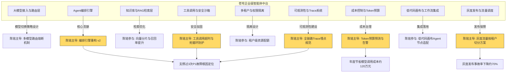
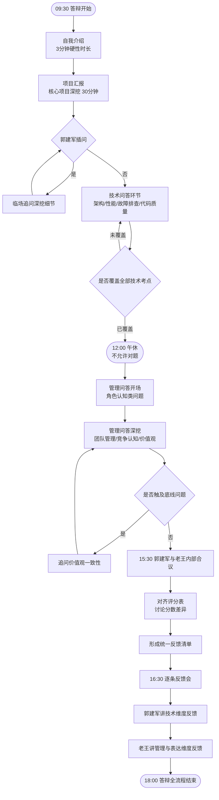
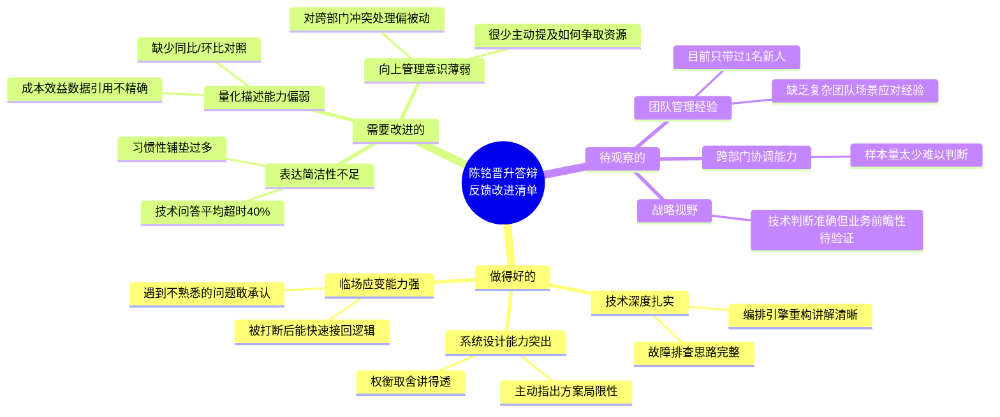

# 第69天:全真模拟晋升答辩

**所属阶段**:领航篇·企业级AI工程师晋升之路(第六阶段)
**当日主题**:一对一全真模拟晋升答辩(技术面 + 管理面),逐人反馈改进清单
**核心人物**:陈铭(受训工程师)、王振宇 / 老王(导师)、郭建军(CTO)
**公司/产品**:蓬远科技 · 苍穹企业级智能体中台
**前情承接**:Day68 完成了系统设计深挖与项目复盘材料的最终打磨
**后续预告**:Day70 结业典礼与晋升仪式,全书收官

---

## 【旁白】

七十天的旅程,走到第六十九天,忽然有一种说不清楚的安静。

陈铭是被这种安静吓到的。不是紧张感消失了——紧张感一直都在,从早上六点半睁眼那一刻就压在胸口,像是有人拿手轻轻按住了他的横膈膜,让每一次呼吸都要多用一点力气。但除了紧张,还有另一种情绪缠绕在里面,他一开始没认出来,后来想明白了,那是**舍不得**。

七十天前,他还是那个连"智能体"和"聊天机器人"傻傻分不清楚的后端工程师,写接口、改bug、被产品经理追着问排期。而现在,他能画出苍穹整个多租户智能体中台的架构图,能讲清楚向量检索的分片策略为什么这么设计,能在深夜故障复盘会上第一个把根因定位到具体的一次锁竞争。这些能力不是凌空出现的,是过去六十八天,一天一天、一个模块一个模块垫出来的。

今天是最后一次"练习赛"。明天,就要正式上场了——不,更准确地说,明天上场的不再是"答辩",而是**结果**。今天晚上七点,郭建军和老王给出的反馈,将决定陈铭以怎样的状态走进真正的晋升委员会。

老王在昨晚的消息里写了一句话:"全真模拟,意味着我们不会对你客气。你准备好了,就当是真的;你没准备好,就当庆幸——庆幸今天犯错误不用付出真实代价。"

陈铭把这句话在心里默念了两遍,合上电脑,睡了。今天,是第六十九天。风好像比昨天更烈了一点,吹得会议室的百叶窗轻轻晃。他知道,从这扇门推开进去,到晚上走出来,他会经历一次前所未有的"全息扫描"——技术的、管理的、心理的、表达的,一层一层剥开来看。

而他,已经准备好了。

他想起三十多天前的一个深夜,那次是排查一个诡异的内存泄漏问题,他和老王在会议室里对着火焰图熬到凌晨两点,老王指着一处调用栈说:"你看,不是代码写错了,是你对这个第三方SDK的生命周期理解有误差。"那句话像针一样扎进他心里,却也是从那天起,他养成了"不理解到底层,绝不轻易下结论"的习惯。他还想起某个周末,郭建军突然在群里甩来一张线上大盘的异常曲线图,只问了一句"这是什么情况",没有任何寒暄,他花了整整一个下午才排查清楚,那种被信任托付去处理真实生产问题的紧绷感,至今记忆犹新。这些片段像电影胶片一样在脑子里一格一格闪过,拼成了他现在站在这里的理由。

七十天,说长不长,说短不短。但他清楚地知道,如果没有这些具体的、带着痛感的锤炼,今天他绝不可能带着这份笃定,走进这场全真模拟答辩。

---

## 晨会纪要

**会议主题**:Day69 全真模拟晋升答辩 · 启动说明会
**参会人**:王振宇(主持)、郭建军(评委/主考官)、陈铭(答辩人)
**时间**:09:00 - 09:20
**地点**:蓬远科技 3楼"星穹"会议室

**会议要点摘录**:

1. **形式说明**。老王首先明确了今天的规则:不是"演练一遍PPT",而是完全按照真实晋升答辩委员会的流程走一遍,时间同样切成上午技术面、下午管理面两段,中间有午休复盘时间但不允许提前对答案。郭建军今天不再以"CTO日常带教"的身份出现,而是完全切换到"考官视角",该刁难就刁难,该打断就打断。

2. **郭建军补充了三条"考官规则"**:
   - 第一,不会按陈铭准备好的PPT顺序走,会随时打断插问,专挑陈铭材料里"讲得漂亮但细节薄"的地方深挖;
   - 第二,允许陈铭说"我不知道"或"这个我没想清楚",但绝不允许"绕话"或"用大词糊弄过去";
   - 第三,今天所有的提问都会被记录下来,答辩结束后原样复盘给陈铭,让他知道自己在哪个问题上答得好、哪个问题上答得空。

3. **老王强调了心态**。他跟陈铭说:"你现在的技术积累,已经足够撑起晋升这件事。今天真正要打磨的,不是知识,是**表达的密度**——同样一个技术点,你现在讲需要三分钟,答辩现场只给你四十五秒,你得学会把'我知道'压缩成'我能让你立刻明白我知道'。"

4. **议程确认**:
   - 09:30-09:40 自我介绍(3分钟硬性时长,超时会被打断)
   - 09:40-10:10 项目汇报(核心项目深挖,含苍穹中台三个关键模块)
   - 10:10-12:00 技术问答(架构、性能、故障排查、代码质量等)
   - 12:00-13:00 午休(不允许对题、不允许翻资料"抱佛脚")
   - 13:00-13:20 管理问答开场(角色认知、团队协作类问题)
   - 13:20-15:30 管理问答深挖(团队管理、竞争认知、价值观类问题)
   - 15:30-16:30 郭建军与老王内部合议,形成反馈清单
   - 16:30-18:00 逐条反馈会(郭建军主讲技术维度反馈,老王主讲管理与表达维度反馈)

5. **待办事项**:
   - 陈铭:准备好个人知识体系与项目贡献总览图(作为开场展示材料),准备好"最能代表个人技术能力"的一段代码用于问答环节展示;
   - 老王:准备评分维度表,现场逐项打分,答辩结束后转化为文字反馈;
   - 郭建军:准备至少8个"硬骨头"技术问题与4个管理场景题,不提前透露。

会议结束前,郭建军说了一句让陈铭记到现在的话:"陈铭,你不用把今天当成考试。你就当成——这是你在苍穹项目里做的最后一次'压力测试',测的不是接口,是你自己。"

会议结束后,老王单独留下陈铭说了几句话,不算是正式议程,却让陈铭一整天都记在心里。他说:"今天你会被问到很多你已经很熟悉的东西,也会被问到一些你从没细想过的角度。熟悉的部分,别放松警惕,越熟悉的东西越容易讲得啰嗦、讲得没有重点;陌生的部分,别慌,你敢说'这个我没想清楚,但我可以说说我现在的判断依据是什么',这比硬编一个漂亮答案要有价值得多。"陈铭把这句话记在了笔记本第一页,后来在下午问答里,这句话真的帮他扛住了好几个不算完全有把握的问题。

---

## 需求文档:晋升答辩评分维度表

为了让今天的模拟答辩尽量贴近真实晋升委员会的评审逻辑,老王提前设计了一份评分维度表,答辩全程由郭建军和老王分别独立打分,答辩结束后再对齐分数、讨论差异,最终形成统一的反馈清单。

这份评分维度表并不是老王临时拍脑袋想出来的,而是他综合了过去几年参与过的多次真实晋升委员会评审经验,结合苍穹中台这类偏工程深度岗位的特点,反复打磨出来的一份内部工具。他曾经跟陈铭提过一句话:"很多人觉得晋升答辩评委是凭'感觉'打分的,其实不是——好的评审体系,一定是把'感觉'拆解成一条一条可以被验证的行为证据,这样打出来的分数才经得起复盘,也才能给候选人真正有用的反馈,而不是一句模糊的'你还需要再成长成长'。"

### 一、评分维度总览

| 维度 | 权重 | 核心考察点 | 评分方式 |
|---|---|---|---|
| 技术深度 | 30% | 对核心模块的原理理解、边界条件把握、故障排查能力、技术选型的权衡逻辑 | 5档评分(1-5),每档有明确行为锚点 |
| 项目贡献 | 25% | 项目中承担的角色、解决问题的复杂度、可量化的业务价值、是否具备"从0到1"的推动力 | 5档评分,重点看"贡献度"而非"参与度" |
| 团队协作 | 20% | 跨角色沟通能力、冲突处理方式、对他人的辅导与知识传递、在团队中的信任积累 | 5档评分,结合具体行为事件(STAR法) |
| 成长潜力 | 15% | 学习速度、对反馈的接纳与转化能力、面对模糊问题时的思考框架、自我认知的清晰度 | 5档评分,重点看"增量"而非"存量" |
| 表达与呈现 | 10% | 信息密度、结构化表达能力、时间控制、在压力下的临场反应 | 5档评分,现场直接观察 |

### 二、"技术深度"维度评分细则(节选)

| 分档 | 行为锚点描述 |
|---|---|
| 1分 | 只能复述文档或PPT内容,追问两层就无法继续回答,对边界条件和异常场景基本没有考虑 |
| 2分 | 能讲清楚"是什么",但讲不清楚"为什么这么设计",遇到追问容易语无伦次 |
| 3分 | 能讲清楚设计动机,能举出一到两个真实案例支撑,但对更极端的场景(如高并发下的雪崩、跨机房网络分区)缺乏预案 |
| 4分 | 能讲清楚设计权衡、真实案例、故障排查思路,并能主动提出当前方案的局限性和改进方向 |
| 5分 | 在4分基础上,还能跳出当前模块看整体系统影响,能对比行业内其他方案并说明为什么苍穹选择了现在的路径 |

### 三、"项目贡献"维度评分细则(节选)

| 分档 | 行为锚点描述 |
|---|---|
| 1分 | 只是"被分配任务并完成",没有主动发现问题或提出改进 |
| 2分 | 在既定方案框架内完成任务,偶尔提出局部优化建议 |
| 3分 | 独立负责某个模块从设计到上线的全流程,能讲清楚业务价值 |
| 4分 | 主导过跨模块的技术方案,能量化说明对系统整体指标(性能、成本、稳定性)的提升 |
| 5分 | 推动过组织级的技术改进(如建立新的规范、沉淀可复用的能力),影响范围超出自己所在团队 |

### 四、"团队协作"维度评分细则(节选)

| 分档 | 行为锚点描述 |
|---|---|
| 1分 | 只能被动配合他人安排的工作,遇到跨角色协作需求习惯等指令,很少主动沟通进度和风险 |
| 2分 | 能配合团队完成既定分工,但遇到意见分歧时倾向于回避冲突,或者简单服从对方意见,而不是尝试用事实和数据推动共识 |
| 3分 | 能主动发起沟通、协调分歧,独立承担跨角色协作任务(比如和产品、测试、运维对接),能把技术语言"翻译"成对方能理解的表达 |
| 4分 | 能在存在明显利益或立场冲突的场景中找到多方都能接受的方案,并且主动承担起"辅导新人""传递知识"的责任,团队内部对其有较高的信任度 |
| 5分 | 能推动建立组织层面的协作机制或规范(比如设计评审模板、跨团队的接口约定),影响范围超出自己所在的直接团队,并且这种机制在其离开后依然能持续运转 |

老王在设计这一维度的时候特别提醒过陈铭:"团队协作不是看你人缘好不好,是看你在真实的分歧和压力场景里,怎么做选择。这就是为什么每一档描述里,我都要求配一个具体的行为事件作为证据,不能凭印象打分。"

### 五、"成长潜力"维度评分细则(节选)

| 分档 | 行为锚点描述 |
|---|---|
| 1分 | 面对反馈容易产生防御性反应,倾向于解释"为什么这么做是有道理的",而不是先理解反馈本身 |
| 2分 | 能接受反馈,但转化为行动的速度很慢,同一类问题反复被指出 |
| 3分 | 能较快接受反馈并调整行为,面对模糊不清的问题时,有基本的拆解思路,但框架还不够稳定 |
| 4分 | 能主动寻求反馈(而不是等别人来纠正),面对模糊问题能快速建立起分析框架,并且能把一次具体的教训转化为可复用的方法论 |
| 5分 | 具备清晰的自我认知,能准确判断自己能力的边界在哪里,并且能设计出具体、可执行、可检验的成长计划,而不是停留在"我会努力"这种模糊的表态 |

这一维度是老王个人最看重的一项,他在需求文档的备注栏里写道:"技术深度和项目贡献,看的是一个人'已经走到哪里';成长潜力,看的是一个人'接下来还能走多远'。晋升评审本质上是一次面向未来的投资决策,过去的成绩只是参考,真正决定要不要投这一票的,往往是评委对'这个人接下来一年能不能持续往前走'的判断。"

郭建军在这个备注旁边补充了一句更直接的话:"我见过不少候选人,过去一年的项目贡献列表写得很漂亮,但坐下来聊十分钟,就能感觉到这个人已经到了自己能力的天花板附近,后面很难再有明显的突破;也见过一些候选人,过去的产出看起来没那么耀眼,但聊完之后能明显感觉到,这个人处理问题的方式还在持续进化,给他更大的舞台,大概率还能往上走。晋升委员会真正想投的,是后一种人。这也是为什么'成长潜力'这个维度,权重不能设得太低。"

### 六、评分表使用说明

老王在需求文档末尾补充了三条使用说明:

1. 每个问题回答完毕后,郭建军和老王分别在自己的纸质评分表上打分,过程中不互相参考,避免"锚定效应";
2. 每个维度至少要有三个以上的具体问题作为支撑证据,不能凭"整体印象"打分,评分表旁边要写下"证据摘要";
3. 最终分数不是简单加权平均,而是先看"是否有明显短板"(任意维度低于2分需要单独标注风险),再看综合表现,这与真实晋升委员会的评审逻辑保持一致——**不是比总分,是排除硬伤**。

陈铭看到这份评分表时,心里咯噔了一下:"原来最可怕的不是分数低,是某一项特别低。"老王笑着点头:"对,这就是为什么我们今天要把技术和管理都过一遍,你不能有明显的短板。"

---

## 架构设计图:陈铭知识体系与项目贡献总览

这张图是陈铭为今天答辩专门准备的开场展示材料,目的是在三分钟自我介绍之后,用一张图快速让评委建立起"陈铭做过什么、覆盖了哪些技术领域"的整体印象。



这张图的设计思路,陈铭在准备时反复推敲了很久。他没有按照"技术栈罗列"的方式画(比如列一堆"精通Python、精通Kubernetes"),而是**以苍穹中台的九大核心模块为骨架,把自己在每个模块里的真实贡献挂上去**,并且用颜色区分出"主导"和"参与"——用深黄色标出自己主导的五个方向,这五个方向恰好是老王和郭建军过去六十八天反复带教打磨的重点领域:编排引擎、安全沙箱、可观测性、成本治理、灰度发布。

图的下半部分,他刻意加了两条"结果链路":一条指向"支撑过3次P1故障根因定位",另一条指向"年度节省模型调用成本约120万元"和"灰度发布事故率下降约70%"。老王看到这版图时说了一句:"这才对——晋升答辩不是让你证明你懂技术,是让你证明你懂技术**并且**产生了看得见的价值。图里要有结果,不能只有过程。"

陈铭在准备这张图的过程中,其实前后改了三版。第一版图画得像一份"技能清单",列了一堆诸如Python、Kubernetes、Milvus这样的关键词,老王看完直接摇头:"这张图放到简历里可以,放到晋升答辩里不合格——技能清单证明的是'你会用什么',不是'你解决了什么问题、创造了什么价值',评委看一眼就会觉得你在堆砌名词。"第二版图陈铭尝试按时间线画,把六十八天里做过的事情按周排列,结果画出来密密麻麻,连他自己都说不清楚重点在哪。直到第三版,他才想清楚——**答辩用的图,应该以"系统的模块结构"为骨架,而不是以"个人的时间线"或"个人的技能"为骨架**,因为评委真正想快速判断的问题是"这个系统健康稳定地跑起来,哪些关键能力是这个人扛下来的",把贡献挂载在系统模块上,比挂载在时间轴或者技能列表上,信息密度高得多,也更容易让评委在几十秒内建立起对候选人价值的整体判断。这个"三版迭代"的过程,后来也被老王当作一个具体的例子,用来说明"呈现方式本身,也是一种需要刻意练习的能力"。

---

## 流程图:全真模拟答辩完整流程

为了让陈铭对今天一整天的节奏有清晰的预期,老王提前画了这张流程图,并在启动会上逐段讲解。



老王在讲解这张图时特别强调了三个"关键决策点":

第一个决策点是"S3:郭建军插问"。他解释说,真实答辩委员会往往不会等你讲完再提问,而是听到某个"讲得漂亮但细节薄"的点就立刻打断,这对陈铭的心理稳定性是很大的考验——"你得习惯被打断,而且打断之后还能接得上原来的逻辑线,不能被打乱了阵脚。"

第二个决策点是"M3:是否触及底线问题"。老王说管理面问答里一定会有一两个"价值观探测题",比如"如果你的方案和领导意见不一致,你会怎么做",这类题目没有标准答案,但答辩委员会关注的是**你的判断逻辑是否清晰、是否有底线**,一旦发现回答模糊或前后矛盾,会持续追问直到看清楚。

第三个决策点是"S6/M3之后的合议环节"。老王刻意把"郭建军与老王内部合议"这一步单独画出来,让陈铭理解:反馈不是某一个人的"一言堂",而是两个评委分别打分、对齐差异之后的共识结果——这也是为什么下午的反馈会往往比答辩本身更有信息量。

除了这三个决策点,老王还专门解释了流程图里"技术问答环节"和"管理问答环节"之间为什么要隔一个整整一小时的午休,而不是紧接着往下走。他说:"真实的晋升答辩,委员会成员往往是分批次、分角色进场的,技术委员和管理委员中间通常也会有一个间隔,这个间隔既是给评委留出讨论上半场表现的时间,也是给候选人一个从'技术脑'切换到'管理脑'的缓冲期——如果连续六个小时不间断高强度问答,不管是评委还是候选人,后半场的状态都会明显下滑,判断力和表达质量都会打折扣。今天我们特意保留了这一个小时的间隔,不是走形式,是真实还原这种节奏,让陈铭提前适应这种'高强度-缓冲-高强度'的答辩节奏,而不是等真正答辩那天才第一次经历这种体感。"

---

## 示意图:反馈改进清单分类

答辩结束、合议完成之后,郭建军和老王把反馈拆成了三类,这张示意图是他们最终呈现给陈铭的分类逻辑。



郭建军解释了为什么要分成这三类,而不是简单地分成"优点"和"缺点":"'需要改进的'是指你已经具备但还不够好的能力,这些是可以通过刻意练习在短期内提升的;'待观察的'是指你目前样本量不足、没法直接下结论的能力,这些不是你的短板,是你还没有足够的机会去证明——晋升委员会看到'待观察'不会直接扣分,但会作为后续培养计划的重点。"

老王补充说:"这张图你要留着,不是今天看完就算了。它应该变成你接下来三个月的成长地图。"

陈铭当时追问了一句:"如果三个月后,'待观察的'这部分依然没有足够的样本,是不是就意味着我一直都没法在这方面被认可?"老王的回答让他印象很深:"不是。'待观察'的意思是,现在没有证据,不代表以后没有机会创造证据。你可以主动去创造这样的机会——比如主动申请带一个更复杂的新人,主动申请参与一次跨部门的联合项目,让自己有机会积累起可以被评估的行为证据。被动地等机会降临和主动地去创造机会,是两种完全不同的成长路径,而后者往往能让你的成长速度快得多。"这句话后来被陈铭写进了自己的复盘笔记里,作为对"待观察的"这一分类最重要的补充理解。

---

## 课堂笔记

### 上午场:技术问答实录(逐题还原)

09:30,陈铭站在会议室的白板前,深吸一口气,开始了他的三分钟自我介绍。他没有像很多人那样从"我叫陈铭,毕业于……"开始讲,而是直接抛出了一句话:"过去六十八天,我从一个只会写CRUD接口的后端工程师,成长为能独立负责苍穹智能体中台三个核心模块的技术骨干,今天想用三十分钟,把我做过的、能证明这件事的东西讲给两位听。"

郭建军抬眼看了他一下,没说话,但陈铭注意到老王在评分表上写了点什么。

自我介绍在2分50秒结束,精准控制在时长内。接下来是项目汇报环节,陈铭用准备好的架构总览图开场,讲了编排引擎重构、安全沙箱、可观测性三个模块的设计动机与关键决策。汇报进行到第18分钟的时候,郭建军第一次打断了他。

**郭建军**:"停一下。你刚才说编排引擎重构之后,'故障率下降了很多',很多是多少?给我一个数。"

这一下打断来得毫无预兆,陈铭正讲到兴头上,脑子里那根本来流畅的叙述线被生生截断,他甚至能感觉到自己喉咽了一下。但他没有慌乱地去找借口,而是先停顿半秒,让自己从"讲故事模式"切回"给数据模式"。

**陈铭**:(愣了半秒,随即调整)"重构前,编排引擎相关的P2以上故障平均每月4.3次,重构上线后三个月的数据是每月0.9次,下降了约79%。"

**郭建军**:"这个数你记得这么准,说明是真的复盘过。继续。"

这一次打断让陈铭意识到,今天的问答风格会是"随时验证细节的真实性",而不是"听你讲完整个故事"。他调整了后面的汇报节奏,主动在关键结论后面补一句具体数字,不再等对方来问。

10:10,汇报结束,正式进入技术问答环节。以下是几个陈铭事后认为"最有代表性"的问答,他在午休间隙用手机录音转写整理了下来,后来也成为了下午反馈会讨论的核心素材。

---

**第一问(郭建军):"你说编排引擎重构的核心是引入了'状态机 + 事件驱动'的模型,替代了原来的'链式调用'。链式调用具体出了什么问题,状态机为什么能解决?"**

陈铭的回答:"链式调用的问题主要出在三个地方。第一是**容错能力差**——原来的实现是A调用B、B调用C这样一条链,一旦中间某一步的工具调用超时或者失败,整个链路直接抛异常,没有中间状态可以恢复,用户看到的就是一次完整失败,哪怕前面80%的步骤都已经跑完了。第二是**并发场景下状态难以追踪**——如果同一个Agent会话里有多个工具调用需要并行发起,链式结构天然是串行的,想改成并行就要在代码里手写大量的Promise.all或者线程池管理,代码会变得很脆弱。第三是**可观测性差**——链式调用里,每一步的状态变化都散落在函数调用栈里,出问题只能靠堆栈日志去猜,没有一个统一的地方能看到'这个Agent会话现在处于什么状态'。

状态机模型解决这三个问题的方式是:第一,把整个Agent的生命周期显式定义成有限状态集合,比如`INIT`、`PLANNING`、`TOOL_CALLING`、`TOOL_RESULT_PENDING`、`REFLECTING`、`COMPLETED`、`FAILED`、`RETRYING`,每一次状态转换都有明确的触发事件和转换条件,失败不再是'抛异常炸掉整个链',而是转换到`FAILED`或`RETRYING`状态,可以做局部恢复。第二,事件驱动意味着工具调用的结果是通过事件队列异步通知回状态机的,天然支持并行发起多个工具调用,只需要在状态机里维护一个'待完成事件计数器',等所有并行事件都回来了再触发状态转换。第三,因为状态是显式的、集中管理的,我们可以在状态转换的每一个节点上打点,直接对接到可观测性系统,任何一个Agent会话卡在哪个状态、卡了多久,一眼就能看到。"

**郭建军追问**:"状态机切换会不会引入新的复杂度?比如状态爆炸问题,你们怎么控制状态数量不失控?"

**陈铭**:"这个问题我们确实踩过坑。刚开始设计的时候,想把每一种工具调用结果、每一种错误类型都单独建一个状态,结果状态数量涨到快30个,状态转换图画出来自己都看不懂。后来我们做了一次重构,把状态机拆成了'主状态机'和'子状态机'两层——主状态机只管Agent会话的宏观生命周期,只有7个状态;工具调用内部的重试、超时、降级逻辑,下沉到一个独立的'工具调用子状态机'里,对主状态机而言只暴露`SUCCESS`、`FAILURE`、`TIMEOUT`三种结果。这样主状态机的复杂度可控,子状态机的复杂度局部隔离,不会互相污染。"

老王在旁边补充问了一句:"这个分层的想法是你自己想到的,还是参考了什么资料?"陈铭很诚实地说:"最初是我们看Temporal工作流引擎的设计文档得到的启发,它的Workflow和Activity分层跟我们做的事情本质上是一样的,只是我们没有引入完整的Temporal,而是自己实现了一个轻量版本,因为苍穹的场景不需要跨天级别的长时间工作流。"郭建军点头:"知道借鉴了什么、为什么不直接用现成的,这个回答比自己发明轮子更让人信服。"

---

**第二问(郭建军):"如果一个Agent陷入死循环调用工具,比如反复调用同一个搜索工具却拿不到满意结果,你在架构层面怎么防止这种情况把系统资源耗尽?"**

**陈铭**:"我们在三个层面做了防护。第一层是**单会话工具调用次数上限**,每个Agent会话有一个硬性的工具调用总次数配额,默认是20次,超过就强制进入`FAILED`状态并返回'已达到最大尝试次数'的降级响应,这个配额是可以按租户等级配置的。第二层是**重复调用检测**,我们会对最近N次的工具调用做指纹比对——把工具名、参数做归一化后计算哈希,如果发现连续3次调用的指纹完全一致,直接判定为死循环,提前终止并触发一次'反思'(Reflection)提示,让大模型意识到当前策略无效,尝试换一种搜索方式,而不是傻等到配额耗尽。第三层是**全局资源熔断**,这个是系统级别的,如果某个租户在单位时间内的工具调用总QPS超过阈值,会触发限流,防止单个租户的异常Agent拖垂整个共享工具调用集群。"

**郭建军**:"重复调用检测里,你说对参数做归一化再计算哈希,归一化具体怎么做?举个例子,如果搜索关键词只是加了个空格,算不算重复?"

**陈铭**:"归一化的步骤是:先去除参数值前后空格,再统一转小写(对于不区分大小写的场景),然后对字典类型参数按key排序后再序列化,消除因为参数顺序不同带来的哈希差异。所以你说的'加了个空格'这种情况,去除首尾空格之后是相同的,会被判定为重复。但如果空格在关键词中间,比如'人工智能 发展'和'人工智能发展',这两个在语义上可能是一样的意图,但我们目前的归一化不会处理中间空格,会被判定为不同调用——这其实是我们现在方案的一个局限,如果要更精确地识别'语义重复'而不仅仅是'字面重复',可能需要引入向量相似度比较,但这样会增加额外的计算开销,我们权衡之后暂时没做,这是一个可以在后续迭代里优化的点。"

郭建军听到这里,在评分表上写了一行字,后来陈铭在反馈会上才知道那行字是:"主动暴露方案局限性,而不是回避——这是4分档以上的关键行为特征。"

---

**第三问(郭建军):"讲讲RAG检索那部分,向量库选型是怎么定的?为什么不直接用一个大家都在用的方案?"**

**陈铭**:"我们最初调研了三个方向:一个是自建基于Faiss的向量检索服务,一个是用云厂商托管的向量数据库,一个是用带原生向量能力的开源数据库比如Milvus或者PGVector。最终我们选择了Milvus,原因有三点。第一,苍穹中台是多租户架构,需要支持按租户维度做数据隔离和弹性扩缩容,Milvus的Collection级别隔离加上它对分片和副本的原生支持,比我们自己在Faiss上封装一层隔离逻辑要省事得多,也更稳。第二,我们的知识库场景里,单租户的文档量差异极大,小租户可能几百条,大租户可能几百万条,需要检索层能做水平扩展,Faiss本身更适合单机场景,做分布式需要自己搭建很多基础设施,投入产出比不划算。第三,Milvus支持标量字段和向量字段的混合查询,我们大量场景需要'先按租户ID、文档类型过滤,再做向量相似度检索',这种混合过滤在Milvus里是原生支持的,自建方案要做类似能力需要自己写过滤索引,开发成本高。"

**郭建军**:"混合过滤会不会拖慢检索性能?你们的召回延迟大概是多少,做过压测吗?"

**陈铭**:"做过。在千万级向量、单Collection的场景下,不带过滤条件的Top-10检索,P99延迟大概是35毫秒;加上标量字段过滤之后,如果过滤条件的选择性比较高(比如按租户ID过滤,一个租户的数据只占整体的千分之一),P99延迟会涨到60毫秒左右,主要是因为过滤会导致索引的部分区域命中率下降,搜索范围要扩大。我们后来做了一个优化,是把'按租户ID过滤'这个高频场景,直接改成物理上按租户分Collection,而不是逻辑上过滤,这样每个租户的检索请求天然只在自己的Collection里搜索,不需要标量过滤,延迟又降回了30多毫秒的水平。当然这个方案的代价是Collection数量会随租户数增长,需要额外做Collection的生命周期管理,比如休眠、归档不活跃租户的Collection,这部分我们做了一个后台任务定期扫描处理。"

老王后来点评这道题的时候说:"这个回答的价值在于,你没有停在'我们选了Milvus'这个结论上,而是把'压测数据 - 发现问题 - 二次优化 - 优化后的新代价与应对'这条完整链路讲出来了,这才是能让考官相信你真的做过这件事,而不是背了一份技术选型文档。"

---

**第四问(郭建军):"你提到过支撑过三次P1故障的根因定位,挑一次讲讲你的排查过程。"**

陈铭讲了三个月前的一次真实故障:苍穹中台在某个大客户的高峰使用时段出现了大面积Agent响应超时,故障影响持续了47分钟。

**陈铭**:"当时的现象是,监控大盘上Agent会话的P99延迟从平时的2秒左右飙升到了将近30秒,但是CPU、内存、网络这些基础资源指标都是正常的,这一开始让我们排查方向走偏了——因为通常延迟飙升第一反应是资源不够,但资源明明是够的。

我当时做的第一件事是去看全链路Trace,发现延迟的堆积点集中在'工具调用'这个环节,具体是调用一个第三方的企业知识库检索接口时排队严重。进一步往下查,发现是我们的工具调用客户端用的是一个共享的HTTP连接池,连接池最大连接数配置成了固定的50,而当时那个大客户同时发起的并发Agent会话数量,比平时的均值高出了将近8倍,远超连接池承载能力,导致大量请求在连接池的等待队列里排队,排队时间直接叠加到了整体响应时间上。

定位到这个问题之后,我们做了两个层面的应急处理:第一时间是临时把连接池最大连接数从50调到200,并观察下游第三方接口是否能承受这个并发量,这个是止血动作;第二天我们做了一个更彻底的改造,把原来'全局共享一个连接池'的设计,改成了'按租户维度做连接池隔离',每个租户有自己独立的连接池配额,配额大小按租户等级动态分配,这样即使某个大客户流量突增,也不会挤占其他租户的连接资源,从架构上避免了'资源争抢导致的级联延迟'这类问题再次发生。"

**郭建军**:"为什么第一次设计的时候没有考虑到连接池隔离?这是不是一个设计上的疏漏?"

陈铭在这里犹豫了一下,但还是给出了诚实的回答:"是的,这确实是最初设计时的疏漏。当时设计连接池的时候,我们主要考虑的是'避免连接数过多打爆第三方接口',所以设了一个全局上限,但没有充分考虑到'租户间流量不均衡导致资源争抢'这个场景。回过头看,如果在设计阶段就做一次'租户流量分布的极端场景推演',这个问题是可以提前发现的。这次故障之后,我们把'多租户资源隔离checklist'加入了我们团队的设计评审模板里,任何涉及共享资源池的设计,都要求明确回答'如果某个租户流量占比达到90%,会发生什么'这个问题。"

郭建军听完沉默了几秒,然后说了一句:"这个回答我给满分,不是因为你没犯错,是因为你犯错之后把它变成了组织的免疫系统,而不只是自己记住了教训。"这是上午技术问答环节里,陈铭得到的最直接的正向反馈。

---

**第五问(老王):"你刚才说的这些模块,哪个是你现在回过头看,依然觉得设计得不够好、如果重新做一次会推翻重来的?"**

这个问题让陈铭停顿了将近十秒钟。他后来说,这十秒钟里他脑子里过了一遍所有模块,第一反应是想说一个"无关紧要"的模块来显得"我没有大问题",但很快意识到这种回答方式很容易被看穿,于是选择了真实作答。

**陈铭**:"我会说是成本控制与Token预算模块。现在这个模块的实现方式,是在每次大模型调用之前,基于历史统计数据预估这次调用大概会消耗多少Token,再和租户当前的预算余额做比较,决定是放行、降级(换更便宜的模型)还是拦截。这个方案跑了大半年,基本能用,但我越来越觉得它的预估精度是有天花板的——因为它本质上是一个基于历史均值和简单回归的统计模型,面对'用户本次输入明显比历史均值更长、更复杂'的场景,预估经常是偏低的,导致实际消耗超预算之后才被动补救,而不是提前拦截。

如果重新设计,我会考虑引入一个轻量级的'预估模型',用当前输入的Token数、历史对话轮次、Agent当前状态(是否处于多轮工具调用的复杂推理阶段)这些特征,训练一个简单的回归模型来做更精细化的预估,而不是用固定的历史均值。这个想法我其实已经在内部提过一次,但因为投入产出比暂时没有被排上优先级,目前还停留在方案阶段。"

**老王**:"你觉得这个事没被排上优先级,你自己怎么看?会不会去争取?"

这个问题其实已经开始滑向管理面的范畴了,但老王故意提前抛出来,想看陈铭的反应。陈铭想了想说:"目前我的判断是,这个优化带来的收益(预估误差从现在大概±25%收窄到可能±10%以内)相对于开发投入(需要额外的特征工程和模型训练维护成本)来说,短期内确实不是最高优先级,团队现在更紧急的是编排引擎的稳定性问题。但我会把这个方案写成一份完整的技术建议,附上量化的收益预估,放在下个季度的技术债清单里,等资源腾出来的时候再推动。这不是我'放弃'了,是我认为现在推动的时机还不成熟。"

这个回答后来在反馈会上被单独提出来讨论,郭建军认为这是一个"技术判断力"和"资源意识"结合得比较好的例子。

---

**第六问(郭建军):"多租户架构下,你们怎么核算每个租户的实际成本?如果两个租户消耗了同样的Token数量,成本核算会不会一样?"**

**陈铭**:"名义上消耗同样Token数量,实际成本核算会不一样,原因有三层。第一层是**模型路由的差异**——我们的多模型路由策略会根据任务复杂度、租户等级,把请求路由到不同价位的模型,同样是一次'工具调用意图识别',一个走的是自研的轻量模型,一个走的是通用大模型的API,单位Token的采购成本能差出五到八倍,所以成本核算必须精确到'这次调用具体路由到了哪个模型',而不能简单按Token总量乘一个平均单价。第二层是**共享资源的分摊**——像向量检索、工具调用网关这类共享基础设施,它们的成本不是按调用量线性增长的,里面有固定成本(比如向量库集群的机器成本)和边际成本(比如每次检索的计算耗时),我们采用的是'固定成本按租户活跃度加权分摊,边际成本按实际调用量精确核算'的混合模型。第三层是**失败重试和降级路径带来的隐性成本**——如果一次调用因为超时重试了两次才成功,虽然最终只返回一次结果给用户,但实际发生了三次模型调用的费用,这部分隐性消耗如果不单独统计,财务核算出来的'单位调用成本'会失真,我们专门做了一个字段记录'有效调用次数'和'总调用次数'的差异,用来还原真实成本。"

**郭建军**:"如果财务部门问你,'为什么这个大客户账单里,有一笔看起来消耗量不大但费用不低的记录',你怎么在不暴露太多技术细节的前提下,让他们看懂?"

**陈铭**:"我会用一个类比的方式解释,而不是直接甩技术术语给财务同事。比如我会说,这笔费用高,不是因为'调用次数多',是因为这次请求触发的是我们内部'优先保证准确率'的高精度模型通道,就像寄快递选择了加急专线而不是普通快递,单价自然更高,但换来的是响应更快、结果更准。我们后台其实有一份'成本归因报告',会自动把每一笔异常费用标注出触发原因(是路由到了高价模型,还是发生了重试),财务同事不需要理解技术细节,只需要看这份归因标签就能给客户解释清楚。这也是我们下一步想做的一个改进方向——把这份归因报告做得更自动化、更好读,减少工程师被拉去'人工解释账单'的次数。"

老王后来评价这道题时说:"这道题看似是技术问题,其实是在考察你有没有'业务视角'——你能不能把一套复杂的技术成本模型,翻译成非技术同事能理解的语言,这个能力在真实晋升评审里,权重比很多人想象的更高。"

---

**第七问(郭建军):"我们再回到编排引擎。假设某一天,大模型厂商的API出现了大面积不可用,持续了十分钟,你们的系统会发生什么?有没有做过这种极端场景的演练?"**

**陈铭**:"这个场景我们确实演练过,而且是真实发生过的,不是纯粹的假设推演。大概四个月前,我们依赖的一个大模型供应商出现过一次区域性的API不可用,持续了大概八分钟。当时我们系统的表现是这样的:第一,多模型路由层的健康检查每15秒探测一次各个模型供应商的可用性,连续两次探测失败就会把该供应商标记为'不健康',自动把新发起的请求路由到备用供应商,这个熔断切换在故障发生后大概30秒内就完成了。第二,对于故障发生前几秒已经发出、还没拿到响应的请求,我们的超时兜底策略会在配置的超时时间(通常是8到12秒,根据场景不同)后判定失败,进入重试逻辑,重试时路由策略已经感知到主供应商不健康,会自动切到备用供应商重试,所以这部分请求的用户感知到的影响,大概是多等了几秒钟,但绝大多数最终是成功的。第三,极少数场景(比如备用供应商也出现短暂延迟)会触发降级响应,给用户返回一个'当前系统繁忙,请稍后重试'的友好提示,而不是直接报错。

那次真实故障之后,我们做了一次专门的复盘,发现当时的健康检查探测频率(15秒一次)在极端场景下切换速度还不够快,故障发生后到完全切换到备用供应商之间,有大概30秒的窗口期,这个窗口期内的用户请求成功率会有一定程度的下降。复盘之后我们把探测频率优化到了5秒一次,并且引入了'主动探测+被动反馈'结合的机制——如果短时间内某个供应商的调用失败率超过阈值,不用等下一次定时探测,直接触发降级,这样把切换窗口从30秒左右压缩到了10秒以内。"

**郭建军**:"如果两个供应商同时出问题呢?你们的兜底是什么?"

**陈铭**:"如果所有外部模型供应商都不可用,我们有一个最后一层的兜底,是一个规则引擎驱动的'降级问答'能力,针对一部分高频、标准化的场景(比如常见问题查询、简单的工单分类),用规则匹配加模板回复的方式给出一个'不那么智能但可用'的响应,保证核心业务流程不完全中断。这个方案的覆盖面有限,大概只能覆盖日常请求量的15%左右,但至少能保证在极端场景下系统不是'全黑'的。这也是我们目前认为还有较大提升空间的一个方向——如何在完全不依赖外部大模型的情况下,尽可能扩大'可用响应'的覆盖面。"

这道题的追问持续了将近六分钟,是上午技术问答环节耗时最长的一个问题,郭建军后来说:"我故意在这道题上多留了一些时间,因为'极端场景下系统怎么活下来'这个问题,最能看出一个工程师是不是真的对系统的整体韧性负责,而不只是负责自己写的那一小块代码。"

---

上午的技术问答持续到将近12点才结束,一共覆盖了11个正式提问和数不清的临场追问。陈铭走出会议室的时候,后背的衬衫已经湿透了一片。他后来回忆说,最累的不是"答不上来"的题——事实上所有问题他都答上来了——而是持续三个小时不停地在"讲清楚"和"讲简洁"这两个目标之间找平衡,每一个回答都要在心里飞速判断"这句话要不要展开、展开到什么程度"。

### 下午场:管理问答与反馈实录

午休一小时,陈铭没有翻任何资料,按照约定的规则老老实实地吃了饭、在楼下走了一圈。他说这一个小时反而是全天最放松的时候,因为知道"再翻资料也来不及了,不如让脑子歇一歇"。

走在楼下的时候,他碰到了同事赵敏——那个被老王在管理面问答里提到的、"表达特别精炼"的产品线同事。两人简单聊了几句,赵敏问他答辩感觉怎么样,陈铭如实说了自己上午被反复打断、讲得有点吃力的感受。赵敏笑着说了一句:"你知道我们做产品汇报的人,最常用的一个笨办法是什么吗?每次汇报前,我会先给自己列三句话——如果只能说三句话,我最想让对方记住哪三句。剩下的内容,都是围绕这三句话展开的补充,不是平铺直叙。"这句话说得很随意,但陈铭听进去了,他后来在下午的管理问答里,有意识地用了几次这个方法,先给出"三句话结论",再展开细节,效果确实比上午更紧凑。这段插曲虽然不在正式流程里,却是陈铭那天悄悄消化掉的一次额外收获——晋升答辩的准备,从来不只发生在会议室里,楼下走廊的一句闲聊,有时候比正式的培训更管用。

一点整,陈铭准时回到会议室,老王和郭建军也已经落座。老王简单确认了一下陈铭的状态:"感觉怎么样?"陈铭说:"上午被打断的时候有点措手不及,但吃过饭冷静下来,反而想清楚了几个卡壳的地方为什么会卡壳。"老王点头:"带着这种反思进入下午场,比带着紧张进入要好得多。开始吧。"

13:00,下午场开始,老王主持,郭建军仍然是主问人,但明显能感觉到问题的性质变了——不再追问技术细节,而是转向了对陈铭的角色认知、判断力和价值观的探测。

---

**第一问(老王):"过去六十八天,你觉得自己最大的成长是什么?最大的短板又是什么?"**

**陈铭**:"最大的成长,我觉得是从'把事情做完'变成了'把事情做对,并且能解释清楚为什么这么做'。以前写代码,能跑通、能过测试就算完成任务;现在写一段代码之前,会先想清楚这段代码在整个系统里承担什么角色、边界条件是什么、如果出问题怎么排查、未来扩展的时候会不会成为瓶颈。这种思考方式的转变,不是某一天突然发生的,是过去两个月一次一次被老王和郭建军追问'为什么'逼出来的。

最大的短板,我觉得是**表达的精炼度**——就像今天上午问答里反复出现的问题一样,我习惯把背景交代得很完整才敢下结论,这在写文档、做复盘的时候是优点,但在需要快速传递信息的场合(比如向上汇报、跨部门沟通)反而是负担。我知道这个问题,但目前还没有找到一个特别有效的训练方法,只能靠多练习去慢慢改。"

**老王**:"你说的'多练习'具体是什么?能不能给我一个可执行的计划,不是抽象的'我会努力'。"

**陈铭**:"具体来说,我打算做三件事。第一,以后写周报和技术分享,先写'一句话结论',再写支撑细节,强制自己先把结论提炼出来,而不是按时间顺序叙述过程。第二,找团队里表达特别精炼的同事(比如产品线的赵敏)做一次'汇报方式'的请教,直接学习具体的技巧,而不是自己摸索。第三,在接下来负责的项目汇报里,给自己设定'三分钟讲完核心结论'的硬性要求,每次汇报后找一个同事帮我计时和反馈。"

老王在评分表边上写了"具体、可执行、有责任人和检验方式"几个字。

---

**第二问(郭建军):"苍穹中台现在也在推低代码的Agent工作流搭建能力,让业务人员不用写代码就能配置Agent。你怎么看待这类低代码平台对你们这些工程师岗位的冲击?你不担心自己做的事情最后被'拖拖拽拽'替代吗?"**

这是今天下午最具张力的一道题,陈铭事后说,这道题他其实提前预想过会被问到,因为苍穹自己就在做低代码集成,这个问题几乎是"必考题"。

**陈铭**:"我不觉得低代码平台是在替代我们,我觉得它是在**把我们从重复劳动里解放出来,同时把我们逼到更靠近系统本质的位置**。低代码平台解决的是'常见场景的组装效率'问题——比如业务人员想搭一个'客户咨询自动分类并转发工单'的简单Agent流程,原来需要工程师排期、写代码、测试、上线,现在业务人员自己拖几个节点就能完成,这确实会减少一部分'重复性集成开发'的需求。

但低代码平台能跑起来的前提,是底层有一套稳定、安全、可观测、性能可控的引擎在支撑它——也就是我今天上午讲的编排引擎、安全沙箱、可观测性这些模块。低代码画布上的每一个'节点',背后都是我们工程师设计和维护的能力单元。低代码平台越普及,对底层引擎的稳定性、扩展性、安全边界的要求反而越高,因为一旦底层出问题,影响的不是一个工程师团队自己写的几个应用,是所有通过低代码搭建出来的、数量级更庞大的业务流程。

所以我的判断是,低代码平台会**改变工程师的工作重心**,从'一个个具体场景的开发'转向'底层能力的设计、抽象和治理',但不会减少对工程师能力深度的要求,反而是提高了。就我自己的经历来说,过去半年我花在'给低代码画布适配Agent节点'这件事上的精力,远远小于花在'保证这些节点背后的调度、隔离、观测能力足够健壮'上的精力——后者才是真正难、真正需要工程判断力的部分,而这部分工作是没办法被拖拽式的配置替代的。

至于'担不担心自己被替代'——说实话,如果我只满足于写业务集成代码,而不去理解和参与底层能力建设,那确实应该担心。但如果我持续往'系统设计者'这个方向成长,低代码平台对我来说反而是一个放大器,能让我设计出来的能力被更多业务场景低成本地复用,这是好事,不是威胁。"

**郭建军**:"如果有一天,低代码平台足够智能,连底层引擎的调优都可以自动化,你还需要担心吗?"

**陈铭**:"如果到了那个程度,我认为岗位需求会进一步上移,变成'定义系统边界、设计安全与治理规则、判断什么场景不适合自动化调优'这类更接近架构决策的工作。技术的自动化程度提高,历史上从来不是让相关岗位消失,而是让岗位的门槛和职责往更抽象的层面迁移——就像编译器的出现没有消灭工程师,而是让工程师不用再手写机器码。我不会因为这个假设去焦虑,但我会把它当作一个提醒:要持续往系统设计和判断力这个方向投入,而不是停留在具体实现层面。"

郭建军听完之后,难得地露出了一点笑意,对老王说:"这个回答,比我预期的要成熟。"

他接着又追加了一问,像是想再确认一下这个成熟度是不是"临场发挥",还是真的经过了长期思考:"那你觉得,苍穹现在投入低代码画布这件事,投入的节奏对不对?是不是应该更快一点,或者更慢一点?"

**陈铭**:"我个人的判断是,目前的投入节奏基本合适,但需要注意一个风险点。现在低代码画布覆盖的场景,主要还是相对标准化的工作流,比如客服工单分类、简单的审批流程,这类场景本身的技术复杂度不高,用低代码去覆盖,投入产出比是划算的。但如果接下来低代码画布想覆盖更复杂的场景,比如涉及多Agent协作、涉及复杂状态管理的工作流,底层能力如果跟不上,画布上的'积木'搭出来的东西,稳定性和可维护性都会出问题,到时候业务侧会觉得'低代码很好用',但工程侧要花大量精力去兜底那些看似简单拖拽出来、实际运行时状态复杂的工作流。所以我的建议是,低代码画布的场景扩张节奏,应该和底层引擎能力建设的节奏保持同步,不能画布先跑得太快,把底层落下太远,否则短期内业务侧会很满意,但半年后风险会集中爆发。"

郭建军点了点头,没有再往下追问,但陈铭注意到他在本子上写了不少字——后来在下午的反馈会上,这道题被单独提出来,作为陈铭"战略视野"这一维度里少数被正面提及的加分项。

---

**第三问(郭建军):"如果你带团队,如何培养新人?"**

**陈铭**:"我会分三个阶段来培养。第一阶段是'搭好脚手架',新人刚入职的头两到三周,不会直接丢给他复杂的、模糊的任务,而是给他一个边界清晰、有明确验收标准的小任务,让他先熟悉代码库的规范和团队的协作方式,这个阶段的重点是建立信心和基本的工作习惯,不是挑战能力上限。

第二阶段是'刻意设计的挑战性任务',大概是入职一个月到三个月之间,我会给他一些比第一阶段更模糊、需要自己去拆解和设计的任务,但会控制难度在他能力边界的'最近发展区'——太简单没有成长,太难会打击信心。这个阶段我会用类似今天这样的方式,定期做一对一的追问和复盘,不是等他做错了才纠正,而是在他做的过程中不断问'为什么这么设计''有没有考虑过某种极端情况',逼他把思考过程外化出来,这样才能真正内化成能力,而不是照着葫芦画瓢。

第三阶段是'放手但兜底',大概是三个月之后,如果前两个阶段进展顺利,我会开始让他独立负责一个完整的小模块,从设计到上线全流程自己把控,我退到review和兜底的位置,只在关键决策点介入,给他真正的'拥有感'和责任感。这个阶段的核心是让他体会到'独立完成一件有价值的事'的成就感,这是留住人才和激发潜力最有效的方式。"

**郭建军**:"这个思路我听着挺完整,但你有没有真正带过一个新人?还是这是你理论上的设想?"

陈铭没有回避这个问题:"坦白说,我目前只完整带过一名新人,就是三个月前入职的实习生小林,当时我按照类似的思路带了她,她现在已经能独立负责知识库检索模块里的一个小组件了。但我承认样本量非常有限,如果带的是能力差异很大的多个新人,或者团队规模扩大到需要同时带五六个人,我现在的方法论肯定需要迭代,这方面我确实经验不足,这也是我很清楚自己目前的短板所在。"

老王后来评价这道题说:"你没有为了显得'有管理经验'而夸大自己带过的人数或者虚构案例,这个诚实的边界感,恰恰是晋升委员会最看重的东西之一——他们见过太多人把'管理经验'吹得很满,一深挖就露馅。"

---

**第四问(老王):"如果你的技术方案跟产品经理的意见发生冲突,双方都坚持自己是对的,你会怎么处理?"**

**陈铭**:"我会先区分冲突的性质。如果是纯粹的技术实现路径的冲突(比如用什么架构、用什么数据结构),这类问题理论上是可以用数据和事实来收敛的——我会提出双方各自的方案,列出关键指标(开发成本、性能、可维护性、风险)做对比,用数据说话,而不是靠职级或者话语权压制对方。

但如果冲突的本质是'技术可行性'和'业务紧迫性'之间的权衡——比如产品经理说'这个功能必须两周上线',我说'两周上线的话,某些边界场景会有稳定性风险',这类冲突没有绝对的对错,我会做的是:第一,把风险量化、讲清楚,比如'如果两周上线,预计在高峰期有大概5%的概率出现响应超时,影响范围是XX类用户',让产品经理基于真实的风险认知做业务决策,而不是我单方面替他做决定;第二,如果产品经理基于业务判断依然坚持两周上线,我会尊重这个决策,但会提出一个'降级方案',比如先上线一个功能范围更小但风险可控的版本,把有风险的部分放到下一个迭代,这样既不完全阻塞业务节奏,又不让团队承担不可控的风险;第三,如果分歧依然无法收敛,并且我判断这个风险是'原则性的'(比如可能导致数据安全问题,而不仅仅是用户体验打折扣),我会把这个分歧升级给上级来做最终裁决,而不是自己硬扛或者硬顶。"

**老王**:"你刚才说'原则性问题'会升级给上级,那怎么判断一个问题是不是'原则性的'?这个边界你怎么划?"

**陈铭**:"我用的判断标准大概是:如果风险的后果是'可逆的、可以后续修补的'(比如用户体验不够好、性能没那么优),我倾向于在自己的权限范围内和产品经理协商解决;如果风险的后果是'不可逆的、涉及安全或者信任的'(比如可能导致用户数据泄露、可能导致关键客户的数据错乱且无法恢复),我会认为这已经超出了'技术方案讨论'的范畴,必须升级,因为这类风险一旦发生,承担后果的不只是我或者产品经理,是整个公司的信任基础。"

---

**第五问(郭建军):"你怎么看待技术债和交付速度之间的平衡?能不能举一个你自己处理过的真实案例?"**

**陈铭**:"我不认为技术债本身是坏事,合理的技术债是一种'有意识的、可控的短期妥协',问题在于技术债有没有被记录、有没有偿还计划,如果技术债是'无意识积累、无人追踪'的,那才是真正危险的。

举个真实案例。半年前,我们要在两周内支持一个大客户的定制化需求,涉及在Agent编排引擎里加一个'条件分支'能力,当时正确的做法应该是把条件分支做成一个通用的、可配置的能力模块,但按照当时的时间压力,通用化设计至少需要三周。我当时做的选择是:先实现一个'硬编码在这个客户专属配置里'的简化版本,满足两周交付的要求,但同时在代码里打了明确的`TODO`标记,写清楚'这是临时方案,通用化改造预计需要三周,已记录在技术债看板第17项',并且在上线评审会上明确告知团队和产品经理这个技术债的存在和影响范围。

一个半月之后,当第二个客户也提出类似需求时,我们提前预判到硬编码方案会难以扩展,主动申请了资源做通用化重构,把条件分支能力做成了真正可配置的模块,同时清理掉了之前的临时代码。整个过程中,技术债从产生到偿还,一直是'看得见、有计划、有责任人'的,没有变成'没人知道、没人敢碰的遗留代码'。"

**郭建军**:"如果当时那个技术债一直没有第二个客户来触发,是不是就一直放着不管了?"

**陈铭**:"如果没有新的触发场景,只要这个硬编码方案没有产生额外的维护负担或者稳定性风险,我认为放着不处理是合理的选择——技术债不是必须立刻偿还的东西,而是要评估'不偿还的持续成本'和'偿还的一次性成本'哪个更划算。但即便没有新客户触发,我也会要求这类技术债保留在看板上,定期(比如每个季度)复查一次,而不是记录完就彻底遗忘,因为系统在演化,某个当时看起来'无关紧要'的技术债,可能会在系统规模扩大之后突然变成瓶颈。"

---

**第六问(郭建军):"你怎么评价郭建军和王振宇过去六十八天带教你的方式?有没有哪一次,你其实不认同他们的判断,但没有明确表达出来?"**

这道题问得非常直接,甚至带着一点"自我审视"的陷阱意味,陈铭停顿了一会儿,决定选择真实回答,而不是说一堆场面话。

**陈铭**:"整体来说,我认为过去六十八天的带教方式,核心价值在于'不给标准答案,只给追问',这逼着我自己去把知识内化,而不是记住一份别人给的结论。这一点我是认同的,而且现在越来越感受到它的价值。

但确实有一次我不完全认同的判断。大概是Day50前后,关于是否要在编排引擎里引入一个更重的分布式事务框架来保证多Agent协作的一致性,老王当时的建议是'先用最终一致性的补偿机制顶住,不要一开始就上重型方案',我当时内心是有点犹豫的,觉得补偿机制在某些边界场景下可能不够严谨。但我没有当场明确表达这种犹豫,而是先按照建议做了,做完之后发现补偿机制确实够用,而且比分布式事务框架轻量很多,维护成本也低。回头看,我认为当时没有当场说出自己的犹豫,某种程度上是一种'过度信任权威判断、没有把自己的疑虑讲出来讨论'的表现,这其实不是一个好习惯——即便后来证明老王的判断是对的,我也应该在当时就把疑虑摆出来一起讨论,而不是自己压着不说,万一那次判断是错的,压着不说的疑虑就白白浪费了纠错的机会。"

**郭建军**:"你现在意识到这个问题了,以后遇到类似情况,你会怎么做?"

**陈铭**:"我会在收到建议之后,即便打算按建议去做,也会明确说一句'我先按这个方向做,但我有一个疑虑点是……,如果做的过程中发现这个疑虑成立,我会及时反馈',把疑虑显性化,而不是自己默默压着。这样即使最终证明建议是对的,过程中的疑虑也被记录和讨论过,是一次完整的思考闭环,而不是单方面的服从。"

老王后来在反馈会上专门提到了这道题:"这是我今天最意外的一个回答。很多人被问到'你有没有不认同带教者判断的时候',会本能地说'没有,我都很认同',这种回答听起来安全,但恰恰暴露了缺乏独立思考或者缺乏诚实表达的问题。陈铭今天敢把具体的分歧点讲出来,而且讲得有理有据,这个诚实度本身就是管理面很重要的加分项。"

---

**第七问(老王):"如果有一天,你发现团队里一个能力很强、但价值观有明显问题的人(比如为了完成KPI在数据上做了不该做的美化),你会怎么处理?"**

**陈铭**:"这是一个原则性问题,我的态度会很明确:能力和价值观不能互相抵消,数据造假这类问题,不管这个人能力多强、贡献多大,都必须被制止和纠正,不能因为'这个人很有用'就选择性地容忍。

具体的处理方式,我会分两步。第一步是私下、一对一地和他沟通,先了解具体情况——是主观故意的造假,还是对'什么算美化、什么算合理的展示技巧'这个边界理解有偏差,这两种情况的严重程度和处理方式是不一样的。如果是边界理解偏差,我会明确讲清楚公司和团队对数据真实性的底线要求,并要求纠正已经产生的问题(比如更正已经报出去的数据)。如果是主观故意的造假,这已经超出了'技术带教'能解决的范畴,我会按照公司的规范,该升级给上级或者HR的,就必须升级,不会因为顾及关系或者怕影响团队产出而私下'各打五十大板'掩盖过去。

第二步,不管是哪种情况,我都会推动团队层面的机制补救——比如这类KPI的数据来源是否有交叉校验机制,是否只依赖单一提交人的自报数据,如果发现是机制上存在漏洞导致'有造假空间',我会推动把机制补上,而不是仅仅处理这一个人就完事,因为机制不补,同样的问题以后还会在别人身上重演。"

**老王**:"如果这个人是团队里业务产出最高的核心成员,处理他会不会对团队士气和短期业绩造成很大冲击,你怎么权衡这种冲击?"

**陈铭**:"会有冲击,这个我不否认,但我认为这不是'要不要处理'的权衡项,只是'怎么处理、怎么沟通'的权衡项。如果因为担心短期业绩冲击而选择性地纵容原则性问题,团队里其他人迟早会看在眼里,长期来看对团队信任基础和整体价值观的伤害,远比短期业绩的波动更严重。我会做的权衡,是在处理这件事的沟通方式和时间节奏上更谨慎——比如提前做好业务交接和补位安排,减少处理过程中对团队正常运转的冲击,但处理的决心本身,不应该因为这个人产出高就打折扣。"

这道题被老王认为是今天管理面里"价值观探测"最典型的一道题,他后来解释道:"这类题目的关键不是听你说'我坚持原则'这句话本身,是看你有没有把'坚持原则'和'现实的复杂性'结合起来讲清楚——只喊口号的人,和真正想清楚了权衡逻辑的人,答案听起来相似,但深挖两句就能听出差别。"

---

下午三点左右,问答进入尾声,老王抛出了今天全场唯一一道让陈铭真正沉默了近二十秒的问题。

**老王**:"如果给你更大的团队和更多资源,你会优先做什么?"

陈铭在沉默了近二十秒之后,给出了这样的回答:"我会优先做一件事——把过去半年我们几个核心工程师脑子里的、没有系统化记录下来的架构决策逻辑,变成团队所有人都能理解和复用的'设计原则文档',而不是急着去做更多新功能。我观察到的一个现象是,苍穹中台现在很多关键设计决策(比如为什么用状态机而不是链式调用、为什么按租户隔离连接池)都还只存在于少数几个人的脑子里,一旦这些人休假或者有新的团队成员加入,重新讲一遍这些决策背后的权衡逻辑要耗费大量时间,而且容易讲漏、讲偏。

如果有更多资源,我会先投入一部分人力去做'架构决策记录'(ADR)的体系化建设,把过去做过的关键决策、当时的备选方案、为什么选了现在这个方案,都系统性地整理出来,再基于这些记录去设计团队的技术培训体系。这看起来'不产出新功能',但我判断这是能让团队的技术判断力真正规模化复制的基础,否则团队规模越扩大,'知识只在少数人脑子里'带来的风险和沟通成本会指数级上升。"

老王后来说,这道题他其实是想看陈铭"会不会掉进'要更多资源就是要做更多事'的思维陷阱",而陈铭给出的答案恰恰跳出了这个陷阱,选择了"补齐组织能力的短板"而不是"堆更多产出",这个判断力让他和郭建军都感到意外的满意。

郭建军在这道题之后,又补了一句看似轻松、实际上分量不轻的追问:"如果我告诉你,做这件事(架构决策记录体系化)在短期内不会有任何看得见的业务产出,甚至可能会被其他团队误解成'在偷懒、不干活',你还会坚持做吗?"

**陈铭**:"会坚持,但我会调整做法——不是闭着头一个人埋头做三个月最后甩出一份文档,而是把这件事拆成小的、能持续产出可见价值的迭代。比如第一周先把最近一次故障复盘涉及的架构决策整理成一份ADR,直接用在下一次新人培训里,让'投入是否有产出'这件事,有一个短周期就能看到的验证点,而不是让所有人干等三个月看一个大结果。这样即便有人质疑,我也可以拿出'上周的ADR已经在培训里用上了,新人上手速度加快了'这样的具体反馈去回应,而不是空口说'这件事长期有价值,你们等着看'。"

老王后来评价这个追问和回答说:"郭建军这道追问,其实是在测试一件很现实的东西——很多人有正确的判断力,但一旦这个判断力可能带来短期的'政治风险'或者'被误解的风险',就退缩了。陈铭的应对方式没有退缩,但也没有硬顶,而是找到了一个'用小步验证降低风险'的折中路径,这种务实的坚持,恰恰是技术管理岗位最稀缺的能力之一。"

---

15:30,问答环节正式结束。陈铭走出会议室的时候,整个人像是被拧干了一样,但心里有一种踏实的疲惫感——他知道自己没有藏着掖着,所有的问题都是认真、真实地回答的。

15:30到16:30这一个小时,郭建军和老王在会议室里合议,陈铭被要求在隔壁的休息室等待,不允许旁听。他后来说这一个小时比答辩本身还难熬,反而是最紧张的一个小时。

16:30,反馈会开始。以下是反馈会的详细实录,已在"今日复盘"部分完整呈现。

---

## 代码实战

答辩问答环节中,郭建军要求陈铭现场展示"最能代表个人技术能力"的一段代码,陈铭选择展示了他主导重构的**Agent编排引擎核心状态机模块**的简化版本。下午反馈会之后,针对郭建军和老王提出的"异常处理链路过长、缺乏配置化的重试策略、日志埋点不规范"等问题,陈铭当天晚上就着手写了一版改进代码。以下两段代码都是当天真实产出的内容,保留了较完整的实现细节。

选择展示这段代码,陈铭其实纠结了很久。他一开始想展示的是Token预算预测模块的代码,因为那部分涉及一些他自己设计的统计模型,技术上"看起来更有含金量"。但他后来推翻了这个想法,理由是——编排引擎状态机模块,是他六十八天里投入时间最长、踩坑最多、也最能体现"设计权衡"思考过程的一段代码,更重要的是,这段代码背后有一整套完整的故事可以讲:为什么放弃链式调用、状态爆炸问题怎么解决、死循环防护是怎么设计的。一段代码如果只能讲"实现了什么",价值有限;一段代码如果能讲出"为什么这么设计、放弃了什么、权衡了什么",才真正配得上"最能代表个人技术能力"这句话。这个选择过程本身,也是陈铭在Day68项目深挖准备阶段被反复打磨出来的判断力的体现。

### 一、展示代码:苍穹智能体编排引擎核心状态机(答辩展示版)

```python
"""
苍穹企业级智能体中台 - Agent编排引擎核心状态机模块
展示版本:用于晋升答辩现场讲解状态机 + 事件驱动设计思路
作者:陈铭
"""

from __future__ import annotations

import time
import uuid
import hashlib
import logging
import threading
from enum import Enum
from dataclasses import dataclass, field
from typing import Any, Callable, Optional
from collections import deque

logger = logging.getLogger("cangqiong.orchestrator")


class AgentState(Enum):
    """Agent会话生命周期的七个宏观状态"""
    INIT = "INIT"
    PLANNING = "PLANNING"
    TOOL_CALLING = "TOOL_CALLING"
    TOOL_RESULT_PENDING = "TOOL_RESULT_PENDING"
    REFLECTING = "REFLECTING"
    COMPLETED = "COMPLETED"
    FAILED = "FAILED"


class ToolCallOutcome(Enum):
    """工具调用子状态机对主状态机暴露的三种结果"""
    SUCCESS = "SUCCESS"
    FAILURE = "FAILURE"
    TIMEOUT = "TIMEOUT"


class OrchestrationError(Exception):
    """编排引擎统一异常基类"""
    def __init__(self, message: str, code: str = "ORCH_UNKNOWN"):
        super().__init__(message)
        self.code = code


class MaxToolCallExceededError(OrchestrationError):
    def __init__(self, session_id: str, limit: int):
        super().__init__(
            f"会话 {session_id} 工具调用次数已达上限 {limit}",
            code="ORCH_MAX_TOOL_CALL",
        )


class DuplicateToolCallDetectedError(OrchestrationError):
    def __init__(self, session_id: str, fingerprint: str):
        super().__init__(
            f"会话 {session_id} 检测到重复工具调用,指纹 {fingerprint}",
            code="ORCH_DUP_CALL",
        )


@dataclass
class ToolCallRecord:
    """单次工具调用记录,用于重复调用检测和审计"""
    tool_name: str
    params: dict
    fingerprint: str
    outcome: Optional[ToolCallOutcome] = None
    elapsed_ms: Optional[int] = None
    timestamp: float = field(default_factory=time.time)


@dataclass
class SessionContext:
    """Agent会话上下文,贯穿整个状态机生命周期"""
    session_id: str
    tenant_id: str
    max_tool_calls: int = 20
    tool_call_records: list[ToolCallRecord] = field(default_factory=list)
    current_state: AgentState = AgentState.INIT
    reflection_count: int = 0
    created_at: float = field(default_factory=time.time)

    def tool_call_count(self) -> int:
        return len(self.tool_call_records)


def compute_fingerprint(tool_name: str, params: dict) -> str:
    """
    对工具调用做指纹归一化:
    1. 参数值去除首尾空格
    2. 字典按key排序后序列化,消除顺序差异带来的哈希不一致
    """
    normalized_params = {}
    for key in sorted(params.keys()):
        value = params[key]
        if isinstance(value, str):
            value = value.strip()
        normalized_params[key] = value
    raw = f"{tool_name}::{normalized_params}"
    return hashlib.sha256(raw.encode("utf-8")).hexdigest()[:16]


class DuplicateCallDetector:
    """
    重复工具调用检测器:
    维护最近N次调用的指纹队列,连续3次指纹一致视为死循环
    """
    def __init__(self, window_size: int = 5, duplicate_threshold: int = 3):
        self.window_size = window_size
        self.duplicate_threshold = duplicate_threshold
        self._recent_fingerprints: deque[str] = deque(maxlen=window_size)

    def check_and_record(self, fingerprint: str) -> bool:
        """返回True表示检测到连续重复,需要触发反思或终止"""
        self._recent_fingerprints.append(fingerprint)
        if len(self._recent_fingerprints) < self.duplicate_threshold:
            return False
        recent = list(self._recent_fingerprints)[-self.duplicate_threshold:]
        return len(set(recent)) == 1


class ToolCallSubStateMachine:
    """
    工具调用子状态机:
    封装单次工具调用的重试、超时、降级逻辑,
    对主状态机只暴露 SUCCESS / FAILURE / TIMEOUT 三种结果,
    避免主状态机被工具调用内部细节污染。
    """
    def __init__(self, tool_registry: dict[str, Callable], max_retries: int = 2,
                 timeout_seconds: float = 10.0):
        self.tool_registry = tool_registry
        self.max_retries = max_retries
        self.timeout_seconds = timeout_seconds

    def invoke(self, tool_name: str, params: dict) -> tuple[ToolCallOutcome, Any, int]:
        """执行工具调用,返回(结果类型, 返回值, 耗时毫秒)"""
        if tool_name not in self.tool_registry:
            return ToolCallOutcome.FAILURE, f"未注册的工具: {tool_name}", 0

        tool_func = self.tool_registry[tool_name]
        attempt = 0
        start = time.time()

        while attempt <= self.max_retries:
            attempt += 1
            try:
                result = self._invoke_with_timeout(tool_func, params, self.timeout_seconds)
                elapsed_ms = int((time.time() - start) * 1000)
                return ToolCallOutcome.SUCCESS, result, elapsed_ms
            except TimeoutError:
                elapsed_ms = int((time.time() - start) * 1000)
                logger.warning(
                    "工具调用超时 tool=%s attempt=%d elapsed_ms=%d",
                    tool_name, attempt, elapsed_ms,
                )
                if attempt > self.max_retries:
                    return ToolCallOutcome.TIMEOUT, None, elapsed_ms
            except Exception as exc:
                elapsed_ms = int((time.time() - start) * 1000)
                logger.warning(
                    "工具调用失败 tool=%s attempt=%d error=%s",
                    tool_name, attempt, exc,
                )
                if attempt > self.max_retries:
                    return ToolCallOutcome.FAILURE, str(exc), elapsed_ms

        return ToolCallOutcome.FAILURE, "重试耗尽", int((time.time() - start) * 1000)

    def _invoke_with_timeout(self, func: Callable, params: dict, timeout: float) -> Any:
        result_container: dict[str, Any] = {}
        exception_container: dict[str, Exception] = {}

        def runner():
            try:
                result_container["value"] = func(**params)
            except Exception as exc:  # noqa: BLE001
                exception_container["error"] = exc

        thread = threading.Thread(target=runner, daemon=True)
        thread.start()
        thread.join(timeout)

        if thread.is_alive():
            raise TimeoutError(f"工具调用超过 {timeout} 秒未返回")
        if "error" in exception_container:
            raise exception_container["error"]
        return result_container.get("value")


class AgentOrchestrator:
    """
    Agent编排引擎主状态机。
    状态转换全部通过 transition() 方法显式触发,
    每一次状态转换都会打点上报可观测性系统。
    """

    def __init__(self, tool_registry: dict[str, Callable],
                 observability_sink: Optional[Callable[[dict], None]] = None):
        self.tool_sub_machine = ToolCallSubStateMachine(tool_registry)
        self.observability_sink = observability_sink or self._default_sink
        self._duplicate_detectors: dict[str, DuplicateCallDetector] = {}

    def create_session(self, tenant_id: str, max_tool_calls: int = 20) -> SessionContext:
        session = SessionContext(
            session_id=str(uuid.uuid4()),
            tenant_id=tenant_id,
            max_tool_calls=max_tool_calls,
        )
        self._duplicate_detectors[session.session_id] = DuplicateCallDetector()
        self._transition(session, AgentState.PLANNING, reason="会话初始化完成")
        return session

    def run_tool_call(self, session: SessionContext, tool_name: str, params: dict) -> Any:
        """
        主状态机对外暴露的核心方法:执行一次工具调用,
        内部处理配额检查、重复调用检测、状态转换。
        """
        if session.tool_call_count() >= session.max_tool_calls:
            self._transition(session, AgentState.FAILED, reason="工具调用次数超限")
            raise MaxToolCallExceededError(session.session_id, session.max_tool_calls)

        fingerprint = compute_fingerprint(tool_name, params)
        detector = self._duplicate_detectors[session.session_id]

        if detector.check_and_record(fingerprint):
            self._transition(session, AgentState.REFLECTING, reason="检测到重复调用,触发反思")
            session.reflection_count += 1
            raise DuplicateToolCallDetectedError(session.session_id, fingerprint)

        self._transition(session, AgentState.TOOL_CALLING, reason=f"发起工具调用 {tool_name}")

        outcome, result, elapsed_ms = self.tool_sub_machine.invoke(tool_name, params)

        record = ToolCallRecord(
            tool_name=tool_name,
            params=params,
            fingerprint=fingerprint,
            outcome=outcome,
            elapsed_ms=elapsed_ms,
        )
        session.tool_call_records.append(record)

        if outcome == ToolCallOutcome.SUCCESS:
            self._transition(session, AgentState.TOOL_RESULT_PENDING,
                              reason=f"工具调用成功,耗时{elapsed_ms}ms")
            return result

        self._transition(session, AgentState.FAILED,
                          reason=f"工具调用{outcome.value},耗时{elapsed_ms}ms")
        raise OrchestrationError(f"工具调用未成功: {outcome.value}", code=f"ORCH_{outcome.value}")

    def complete_session(self, session: SessionContext) -> None:
        self._transition(session, AgentState.COMPLETED, reason="会话正常结束")
        self._duplicate_detectors.pop(session.session_id, None)

    def _transition(self, session: SessionContext, new_state: AgentState, reason: str) -> None:
        old_state = session.current_state
        session.current_state = new_state
        self.observability_sink({
            "session_id": session.session_id,
            "tenant_id": session.tenant_id,
            "from_state": old_state.value,
            "to_state": new_state.value,
            "reason": reason,
            "timestamp": time.time(),
        })

    @staticmethod
    def _default_sink(event: dict) -> None:
        logger.info("状态转换: %s", event)


if __name__ == "__main__":
    def mock_search(query: str) -> str:
        return f"搜索结果: {query}"

    registry = {"search": mock_search}
    orchestrator = AgentOrchestrator(tool_registry=registry)
    demo_session = orchestrator.create_session(tenant_id="tenant_demo")
    output = orchestrator.run_tool_call(demo_session, "search", {"query": "苍穹智能体中台"})
    print(output)
    orchestrator.complete_session(demo_session)
```

陈铭在展示这段代码的时候,重点讲了三处设计:第一是`ToolCallSubStateMachine`和主状态机`AgentOrchestrator`之间的职责隔离,对应他上午回答"状态爆炸"问题时提到的分层思路;第二是`DuplicateCallDetector`的指纹归一化逻辑,对应"死循环防护"问题的现场演示;第三是`_transition`方法里统一的可观测性打点,展示了"任何状态转换都会上报"的设计原则。

郭建军当场对这段代码提了三点意见,这也直接成为了晚上反馈会的技术维度反馈来源:

1. **异常处理链路过长**:`run_tool_call`方法里,一次调用可能会在四五个不同的地方抛出不同类型的异常(`MaxToolCallExceededError`、`DuplicateToolCallDetectedError`、`OrchestrationError`),调用方需要写很长的`try/except`链才能完整处理,可读性和可维护性都不够好;
2. **重试策略是硬编码的**:`ToolCallSubStateMachine`的`max_retries`和`timeout_seconds`是构造函数参数,但没有支持"按工具类型、按租户等级差异化配置",实际生产场景中不同工具的重试策略应该是不一样的;
3. **日志埋点不规范**:代码里直接用`logger.warning`和`logger.info`打日志,没有统一的结构化字段(比如trace_id、租户ID),排查问题时很难把同一次会话的所有日志串联起来。

### 二、改进代码:针对反馈意见的重构示例(答辩当晚产出)

当晚,陈铭针对上述三点意见,连夜写出了一版改进后的代码。这份代码后续在"今日复盘"环节也被拿出来讨论,老王评价说:"这个反应速度和落地能力,本身就是晋升答辩里很有说服力的加分项——不是只会口头承认问题,是真的能在几个小时内把问题变成可运行的改进方案。"

```python
"""
苍穹企业级智能体中台 - Agent编排引擎核心状态机模块
改进版本:响应晋升答辩反馈,重构统一异常体系、
配置化重试策略、结构化日志埋点
作者:陈铭(答辩当晚重构)
"""

from __future__ import annotations

import time
import uuid
import hashlib
import logging
import threading
import contextvars
from enum import Enum
from dataclasses import dataclass, field, asdict
from typing import Any, Callable, Optional
from collections import deque

logger = logging.getLogger("cangqiong.orchestrator")

# 使用 contextvars 在异步/多线程环境下透传 trace_id,
# 解决反馈中"日志无法串联同一次会话"的问题
_trace_id_var: contextvars.ContextVar[str] = contextvars.ContextVar(
    "trace_id", default="-"
)


def set_trace_id(trace_id: str) -> None:
    _trace_id_var.set(trace_id)


def get_trace_id() -> str:
    return _trace_id_var.get()


class StructuredLogger:
    """
    统一结构化日志封装:
    每条日志强制携带 trace_id / tenant_id / session_id / event_code,
    解决反馈中"日志埋点不规范,难以串联排查"的问题
    """

    def __init__(self, base_logger: logging.Logger):
        self._logger = base_logger

    def _emit(self, level: int, event_code: str, message: str, **fields: Any) -> None:
        payload = {
            "trace_id": get_trace_id(),
            "event_code": event_code,
            "message": message,
            **fields,
        }
        self._logger.log(level, "%s", payload)

    def info(self, event_code: str, message: str, **fields: Any) -> None:
        self._emit(logging.INFO, event_code, message, **fields)

    def warning(self, event_code: str, message: str, **fields: Any) -> None:
        self._emit(logging.WARNING, event_code, message, **fields)

    def error(self, event_code: str, message: str, **fields: Any) -> None:
        self._emit(logging.ERROR, event_code, message, **fields)


struct_logger = StructuredLogger(logger)


# --------------------------------------------------------------------------
# 统一异常体系:所有编排引擎异常统一继承自 OrchestrationError,
# 并携带 error_category,解决反馈中"异常处理链路过长"的问题——
# 调用方只需要 catch OrchestrationError 一层,再根据 error_category 分流处理
# --------------------------------------------------------------------------

class ErrorCategory(Enum):
    QUOTA_EXCEEDED = "QUOTA_EXCEEDED"
    DUPLICATE_CALL = "DUPLICATE_CALL"
    TOOL_FAILURE = "TOOL_FAILURE"
    TOOL_TIMEOUT = "TOOL_TIMEOUT"
    CONFIG_ERROR = "CONFIG_ERROR"
    UNKNOWN = "UNKNOWN"


class OrchestrationError(Exception):
    """
    编排引擎统一异常基类。
    调用方可以只捕获这一个异常类型,
    通过 error_category 字段做统一的分流处理,
    避免像展示版本那样写多层 except 链。
    """

    def __init__(self, message: str, category: ErrorCategory = ErrorCategory.UNKNOWN,
                 session_id: Optional[str] = None, retriable: bool = False):
        super().__init__(message)
        self.message = message
        self.category = category
        self.session_id = session_id
        self.retriable = retriable

    def to_dict(self) -> dict:
        return {
            "message": self.message,
            "category": self.category.value,
            "session_id": self.session_id,
            "retriable": self.retriable,
        }


def max_tool_call_exceeded(session_id: str, limit: int) -> OrchestrationError:
    return OrchestrationError(
        f"会话 {session_id} 工具调用次数已达上限 {limit}",
        category=ErrorCategory.QUOTA_EXCEEDED,
        session_id=session_id,
        retriable=False,
    )


def duplicate_tool_call(session_id: str, fingerprint: str) -> OrchestrationError:
    return OrchestrationError(
        f"会话 {session_id} 检测到重复工具调用,指纹 {fingerprint}",
        category=ErrorCategory.DUPLICATE_CALL,
        session_id=session_id,
        retriable=True,
    )


def tool_call_failed(session_id: str, tool_name: str, detail: str,
                      category: ErrorCategory, retriable: bool) -> OrchestrationError:
    return OrchestrationError(
        f"会话 {session_id} 工具 {tool_name} 调用未成功: {detail}",
        category=category,
        session_id=session_id,
        retriable=retriable,
    )


class AgentState(Enum):
    INIT = "INIT"
    PLANNING = "PLANNING"
    TOOL_CALLING = "TOOL_CALLING"
    TOOL_RESULT_PENDING = "TOOL_RESULT_PENDING"
    REFLECTING = "REFLECTING"
    COMPLETED = "COMPLETED"
    FAILED = "FAILED"


class ToolCallOutcome(Enum):
    SUCCESS = "SUCCESS"
    FAILURE = "FAILURE"
    TIMEOUT = "TIMEOUT"


# --------------------------------------------------------------------------
# 配置化重试策略:解决反馈中"重试策略是硬编码的"问题。
# 支持按工具名、按租户等级设置差异化的重试次数和超时时间,
# 默认策略作为兜底。
# --------------------------------------------------------------------------

@dataclass(frozen=True)
class RetryPolicy:
    max_retries: int = 2
    timeout_seconds: float = 10.0
    backoff_base_ms: int = 200
    backoff_factor: float = 2.0

    def backoff_ms(self, attempt: int) -> int:
        return int(self.backoff_base_ms * (self.backoff_factor ** (attempt - 1)))


DEFAULT_RETRY_POLICY = RetryPolicy()


class RetryPolicyRegistry:
    """
    重试策略注册中心。
    优先级:租户+工具专属策略 > 工具默认策略 > 全局默认策略。
    支持运行时动态更新,不需要重启服务。
    """

    def __init__(self, default_policy: RetryPolicy = DEFAULT_RETRY_POLICY):
        self._default_policy = default_policy
        self._tool_policies: dict[str, RetryPolicy] = {}
        self._tenant_tool_policies: dict[tuple[str, str], RetryPolicy] = {}
        self._lock = threading.RLock()

    def set_tool_policy(self, tool_name: str, policy: RetryPolicy) -> None:
        with self._lock:
            self._tool_policies[tool_name] = policy

    def set_tenant_tool_policy(self, tenant_id: str, tool_name: str,
                                policy: RetryPolicy) -> None:
        with self._lock:
            self._tenant_tool_policies[(tenant_id, tool_name)] = policy

    def resolve(self, tenant_id: str, tool_name: str) -> RetryPolicy:
        with self._lock:
            specific = self._tenant_tool_policies.get((tenant_id, tool_name))
            if specific is not None:
                return specific
            tool_level = self._tool_policies.get(tool_name)
            if tool_level is not None:
                return tool_level
            return self._default_policy


@dataclass
class ToolCallRecord:
    tool_name: str
    params: dict
    fingerprint: str
    outcome: Optional[ToolCallOutcome] = None
    elapsed_ms: Optional[int] = None
    error_category: Optional[str] = None
    timestamp: float = field(default_factory=time.time)


@dataclass
class SessionContext:
    session_id: str
    tenant_id: str
    trace_id: str
    max_tool_calls: int = 20
    tool_call_records: list[ToolCallRecord] = field(default_factory=list)
    current_state: AgentState = AgentState.INIT
    reflection_count: int = 0
    created_at: float = field(default_factory=time.time)

    def tool_call_count(self) -> int:
        return len(self.tool_call_records)


def compute_fingerprint(tool_name: str, params: dict) -> str:
    normalized_params = {}
    for key in sorted(params.keys()):
        value = params[key]
        if isinstance(value, str):
            value = value.strip()
        normalized_params[key] = value
    raw = f"{tool_name}::{normalized_params}"
    return hashlib.sha256(raw.encode("utf-8")).hexdigest()[:16]


class DuplicateCallDetector:
    def __init__(self, window_size: int = 5, duplicate_threshold: int = 3):
        self.window_size = window_size
        self.duplicate_threshold = duplicate_threshold
        self._recent_fingerprints: deque[str] = deque(maxlen=window_size)

    def check_and_record(self, fingerprint: str) -> bool:
        self._recent_fingerprints.append(fingerprint)
        if len(self._recent_fingerprints) < self.duplicate_threshold:
            return False
        recent = list(self._recent_fingerprints)[-self.duplicate_threshold:]
        return len(set(recent)) == 1


class ToolCallSubStateMachine:
    """
    工具调用子状态机(改进版):
    重试策略不再硬编码,改为从 RetryPolicyRegistry 动态解析,
    并对每一次重试都做结构化日志记录,携带 trace_id。
    """

    def __init__(self, tool_registry: dict[str, Callable],
                 policy_registry: RetryPolicyRegistry):
        self.tool_registry = tool_registry
        self.policy_registry = policy_registry

    def invoke(self, session: SessionContext, tool_name: str,
               params: dict) -> tuple[ToolCallOutcome, Any, int, Optional[str]]:
        if tool_name not in self.tool_registry:
            struct_logger.error(
                "TOOL_NOT_REGISTERED",
                f"工具未注册: {tool_name}",
                tenant_id=session.tenant_id,
                session_id=session.session_id,
            )
            return ToolCallOutcome.FAILURE, None, 0, "工具未注册"

        policy = self.policy_registry.resolve(session.tenant_id, tool_name)
        tool_func = self.tool_registry[tool_name]
        attempt = 0
        start = time.time()
        last_error_detail: Optional[str] = None

        while attempt <= policy.max_retries:
            attempt += 1
            try:
                result = self._invoke_with_timeout(tool_func, params, policy.timeout_seconds)
                elapsed_ms = int((time.time() - start) * 1000)
                struct_logger.info(
                    "TOOL_CALL_SUCCESS",
                    f"工具调用成功: {tool_name}",
                    tenant_id=session.tenant_id,
                    session_id=session.session_id,
                    tool_name=tool_name,
                    attempt=attempt,
                    elapsed_ms=elapsed_ms,
                )
                return ToolCallOutcome.SUCCESS, result, elapsed_ms, None
            except TimeoutError:
                elapsed_ms = int((time.time() - start) * 1000)
                last_error_detail = f"超过{policy.timeout_seconds}秒未返回"
                struct_logger.warning(
                    "TOOL_CALL_TIMEOUT",
                    f"工具调用超时: {tool_name}",
                    tenant_id=session.tenant_id,
                    session_id=session.session_id,
                    tool_name=tool_name,
                    attempt=attempt,
                    max_retries=policy.max_retries,
                    elapsed_ms=elapsed_ms,
                )
                if attempt <= policy.max_retries:
                    time.sleep(policy.backoff_ms(attempt) / 1000)
                    continue
                return ToolCallOutcome.TIMEOUT, None, elapsed_ms, last_error_detail
            except Exception as exc:  # noqa: BLE001
                elapsed_ms = int((time.time() - start) * 1000)
                last_error_detail = str(exc)
                struct_logger.warning(
                    "TOOL_CALL_ERROR",
                    f"工具调用异常: {tool_name}",
                    tenant_id=session.tenant_id,
                    session_id=session.session_id,
                    tool_name=tool_name,
                    attempt=attempt,
                    max_retries=policy.max_retries,
                    error=str(exc),
                )
                if attempt <= policy.max_retries:
                    time.sleep(policy.backoff_ms(attempt) / 1000)
                    continue
                return ToolCallOutcome.FAILURE, None, elapsed_ms, last_error_detail

        return ToolCallOutcome.FAILURE, None, int((time.time() - start) * 1000), "重试耗尽"

    def _invoke_with_timeout(self, func: Callable, params: dict, timeout: float) -> Any:
        result_container: dict[str, Any] = {}
        exception_container: dict[str, Exception] = {}

        def runner():
            try:
                result_container["value"] = func(**params)
            except Exception as exc:  # noqa: BLE001
                exception_container["error"] = exc

        thread = threading.Thread(target=runner, daemon=True)
        thread.start()
        thread.join(timeout)

        if thread.is_alive():
            raise TimeoutError(f"工具调用超过 {timeout} 秒未返回")
        if "error" in exception_container:
            raise exception_container["error"]
        return result_container.get("value")


class AgentOrchestrator:
    """
    Agent编排引擎主状态机(改进版)。
    调用方现在只需要捕获一层 OrchestrationError,
    通过 error.category 做分流处理,不再需要多层 except 链。
    """

    def __init__(self, tool_registry: dict[str, Callable],
                 policy_registry: Optional[RetryPolicyRegistry] = None,
                 observability_sink: Optional[Callable[[dict], None]] = None):
        self.policy_registry = policy_registry or RetryPolicyRegistry()
        self.tool_sub_machine = ToolCallSubStateMachine(tool_registry, self.policy_registry)
        self.observability_sink = observability_sink or self._default_sink
        self._duplicate_detectors: dict[str, DuplicateCallDetector] = {}

    def create_session(self, tenant_id: str, max_tool_calls: int = 20,
                        trace_id: Optional[str] = None) -> SessionContext:
        trace_id = trace_id or str(uuid.uuid4())
        set_trace_id(trace_id)
        session = SessionContext(
            session_id=str(uuid.uuid4()),
            tenant_id=tenant_id,
            trace_id=trace_id,
            max_tool_calls=max_tool_calls,
        )
        self._duplicate_detectors[session.session_id] = DuplicateCallDetector()
        self._transition(session, AgentState.PLANNING, reason="会话初始化完成")
        return session

    def run_tool_call(self, session: SessionContext, tool_name: str, params: dict) -> Any:
        set_trace_id(session.trace_id)

        if session.tool_call_count() >= session.max_tool_calls:
            self._transition(session, AgentState.FAILED, reason="工具调用次数超限")
            raise max_tool_call_exceeded(session.session_id, session.max_tool_calls)

        fingerprint = compute_fingerprint(tool_name, params)
        detector = self._duplicate_detectors[session.session_id]

        if detector.check_and_record(fingerprint):
            self._transition(session, AgentState.REFLECTING, reason="检测到重复调用,触发反思")
            session.reflection_count += 1
            raise duplicate_tool_call(session.session_id, fingerprint)

        self._transition(session, AgentState.TOOL_CALLING, reason=f"发起工具调用 {tool_name}")

        outcome, result, elapsed_ms, error_detail = self.tool_sub_machine.invoke(
            session, tool_name, params
        )

        record = ToolCallRecord(
            tool_name=tool_name,
            params=params,
            fingerprint=fingerprint,
            outcome=outcome,
            elapsed_ms=elapsed_ms,
            error_category=(outcome.value if outcome != ToolCallOutcome.SUCCESS else None),
        )
        session.tool_call_records.append(record)

        if outcome == ToolCallOutcome.SUCCESS:
            self._transition(session, AgentState.TOOL_RESULT_PENDING,
                              reason=f"工具调用成功,耗时{elapsed_ms}ms")
            return result

        self._transition(session, AgentState.FAILED,
                          reason=f"工具调用{outcome.value},耗时{elapsed_ms}ms")

        category = (ErrorCategory.TOOL_TIMEOUT if outcome == ToolCallOutcome.TIMEOUT
                    else ErrorCategory.TOOL_FAILURE)
        raise tool_call_failed(
            session.session_id, tool_name, error_detail or "未知错误",
            category=category, retriable=(outcome == ToolCallOutcome.TIMEOUT),
        )

    def complete_session(self, session: SessionContext) -> None:
        self._transition(session, AgentState.COMPLETED, reason="会话正常结束")
        self._duplicate_detectors.pop(session.session_id, None)

    def _transition(self, session: SessionContext, new_state: AgentState, reason: str) -> None:
        old_state = session.current_state
        session.current_state = new_state
        self.observability_sink({
            "trace_id": session.trace_id,
            "session_id": session.session_id,
            "tenant_id": session.tenant_id,
            "from_state": old_state.value,
            "to_state": new_state.value,
            "reason": reason,
            "timestamp": time.time(),
        })

    @staticmethod
    def _default_sink(event: dict) -> None:
        struct_logger.info("STATE_TRANSITION", "状态转换", **event)


class OrchestrationErrorHandler:
    """
    统一错误处理入口:调用方只需要在这一处根据 error_category 分流,
    不再需要在每个调用点写多层 except 链。
    这是直接回应反馈"异常处理链路过长"的落地方案。
    """

    def __init__(self):
        self._handlers: dict[ErrorCategory, Callable[[OrchestrationError], None]] = {}

    def register(self, category: ErrorCategory,
                 handler: Callable[[OrchestrationError], None]) -> None:
        self._handlers[category] = handler

    def handle(self, error: OrchestrationError) -> None:
        handler = self._handlers.get(error.category)
        if handler is not None:
            handler(error)
        else:
            struct_logger.error(
                "UNHANDLED_ORCH_ERROR",
                "未注册处理器的编排引擎异常",
                **error.to_dict(),
            )


def build_demo_orchestrator() -> AgentOrchestrator:
    def mock_search(query: str) -> str:
        return f"搜索结果: {query}"

    def mock_slow_tool(payload: str) -> str:
        time.sleep(0.05)
        return f"处理完成: {payload}"

    registry = {"search": mock_search, "slow_tool": mock_slow_tool}
    policy_registry = RetryPolicyRegistry()
    policy_registry.set_tool_policy(
        "slow_tool", RetryPolicy(max_retries=3, timeout_seconds=5.0)
    )
    return AgentOrchestrator(tool_registry=registry, policy_registry=policy_registry)


if __name__ == "__main__":
    logging.basicConfig(level=logging.INFO)

    orchestrator = build_demo_orchestrator()
    error_handler = OrchestrationErrorHandler()
    error_handler.register(
        ErrorCategory.QUOTA_EXCEEDED,
        lambda e: print(f"[配额超限] {e.message}"),
    )
    error_handler.register(
        ErrorCategory.DUPLICATE_CALL,
        lambda e: print(f"[重复调用] {e.message}"),
    )

    demo_session = orchestrator.create_session(tenant_id="tenant_demo")
    try:
        output = orchestrator.run_tool_call(demo_session, "search", {"query": "苍穹智能体中台"})
        print(output)
        orchestrator.complete_session(demo_session)
    except OrchestrationError as err:
        error_handler.handle(err)
```

改进代码里,陈铭重点做了四处针对性调整:

1. 引入`ErrorCategory`枚举和统一的`OrchestrationError`,所有异常都携带`category`字段,调用方(比如`OrchestrationErrorHandler`)可以用一张分发表来处理不同类别的错误,而不是写四五个`except`分支;
2. `RetryPolicyRegistry`把重试策略从"硬编码在子状态机构造函数里"变成了"可按工具名、按租户动态配置",并支持运行时更新,不需要重启服务;
3. `StructuredLogger`统一封装了日志输出格式,配合`contextvars`实现的`trace_id`透传,所有和同一次会话相关的日志现在都能通过`trace_id`串联起来;
4. 增加了指数退避(`backoff_ms`)逻辑,避免重试时"无间隔连续打第三方接口",这是老王在反馈会上追加提出的一个小建议,陈铭当场就加了进去。

老王后来评价说:"这份代码本身可能不会成为你答辩PPT里的内容,但它证明了一件比代码本身更重要的事——你把反馈真的当反馈用了,不是听完就过去了。"

值得一提的是,陈铭在写这版改进代码的过程中,还发现了一个原本没有被郭建军和老王指出的小问题——展示版本里`_invoke_with_timeout`方法使用线程加`join(timeout)`来实现超时控制,当超时发生时,原来执行工具调用的那个子线程实际上并没有真正被终止,只是主线程不再等待它,如果这个子线程内部的操作本身没有做好资源释放(比如一个还没断开的数据库连接),就可能造成资源悄悄泄漏。他在给老王汇报改进代码的时候主动提出了这一点,虽然当天晚上时间有限,没有来得及在代码里彻底解决这个问题(更完善的方案通常需要引入支持取消的异步任务模型,或者在子线程内部显式监听一个取消信号量),但他把这个已知的局限性写进了代码注释里,并列入了自己后续要跟进处理的技术债清单。老王对这一点评价很高:"你不是等着别人来找问题,是自己在推敲的过程中,发现了更深一层的问题——这种主动挖掘的习惯,比单纯完成任务本身更值钱。"

---

## 今日复盘

16:30,郭建军和老王的反馈会正式开始。老王先开口:"陈铭,我们不绕弯子,直接说结论——**今天的模拟答辩,你已经达到晋升委员会的通过标准,但有几个地方,如果不提前打磨,明天真上场可能会被扣分,我们希望你今晚就能吸收进去。**"

陈铭听到这句话,悬了一整天的心总算落了一半,但他很清楚,真正有价值的内容还在后面。

### 一、做得好的部分(郭建军主讲)

郭建军先讲了他认为陈铭表现最突出的三点:

**第一,技术深度经得起深挖。** 郭建军说:"我今天故意在几个技术问题上追问了三到四层,想看看你的知识是不是'表层的',结果发现你每一层都能接得上,尤其是关于编排引擎状态机分层和向量库选型的两个问题,你不仅讲清楚了'怎么做',还讲清楚了'权衡取舍'和'这个方案的局限性在哪',这种'知道局限性在哪'的能力,是我们评分体系里4分档和5分档之间最关键的分水岭。今天很多回答,我给到了4分,极少数,比如P1故障复盘那道题,我给了5分——因为你把一次真实的犯错,转化成了组织的改进机制,这是最难得的。"

**第二,系统设计能力是真实的,不是背出来的。** 郭建军特别提到了死循环防护那道题:"你现场被我追问'参数里加个空格算不算重复'这种非常刁钻的边界问题,你能立刻讲清楚归一化逻辑处理了什么、没处理什么,而不是含糊地说'我们做了处理'。这说明你不是在背诵一份设计文档,是真的对自己写的代码有掌控感。"

**第三,临场应变能力比预期的更强。** 老王在这里插话补充:"我观察你今天被打断了不下十次,每一次被打断后,你都能在两三秒内接回自己原本的逻辑线,没有出现'被打断之后彻底乱了'的情况。这个能力其实很多技术很扎实的人都不具备,因为技术强的人容易陷入'我必须把这件事完整讲完'的执念,一被打断就会慌。你今天没有。"

郭建军还补充了一个具体的细节佐证:"你记不记得上午我问你'很多是多少'的时候,你愣了半秒钟?那半秒钟,我其实是在观察你会不会用一句空话搪塞过去,比如'反正下降了不少'。结果你没有,你停顿之后直接给了一个精确到小数点的数字。那半秒钟的停顿本身没问题,是正常的反应时间,真正重要的是停顿之后你选择了讲真话、讲精确的数据,而不是选择讲一句听起来漂亮但经不起验证的话。这个选择,在压力场景下往往比平时更能反映一个人真实的做事风格。"

### 二、需要改进的部分(老王主讲,郭建军补充)

老王翻开笔记本,开始逐条讲需要改进的问题,这部分反馈的信息量明显更大,陈铭全程在做笔记。

**第一,表达简洁性不足,平均超时约40%。** 老王给出了具体数据:"我掐着表统计了你今天所有回答的时长,技术问答环节里,你的平均回答时长是1分50秒,而真实晋升答辩每个问题的建议时长是1分15秒左右,超时比例大概是40%。你的内容质量没问题,但铺垫太多——比如'向量库选型'那道题,你花了将近40秒讲'我们最初调研了三个方向',这个铺垫可以压缩到10秒,把省下来的时间用在讲你后面更有价值的'压测数据发现问题、二次优化'那部分。"

郭建军补充了一个具体的训练建议:"你可以试试'倒金字塔'结构——先说结论和最有信息量的数字,再倒着补充过程,而不是按时间顺序从头讲。你今天讲P1故障那道题,其实已经有点这个味道了,一开始就抛出'延迟从2秒飙到30秒但资源指标正常'这个反差点,抓住了我的注意力,但大多数题目你还是习惯从头讲起。"

**第二,量化描述能力偏弱,尤其是成本效益类数据。** 老王指出:"你今天讲Token预算模块的时候,说预估误差'大概±25%',这个数字是准的,但你没有告诉我这个误差率是怎么算出来的、和行业里同类方案比是高是低。晋升委员会里的评委,尤其是业务线的评委,不一定懂技术细节,但对'这个数字意味着什么'非常敏感。你需要在关键数字后面,加一句参照物——比如'这个误差率意味着我们的Token预算拦截会有一部分误伐,但业界同类简单统计模型的误差率普遍在±30%到±40%之间,我们已经优于平均水平'。"

**第三,向上管理意识薄弱。** 这一条是郭建军提出来的,他说得比较直接:"你今天回答'带团队''管理冲突'这类问题的时候,思路是清晰的,但我注意到一个细节——你几乎没有主动提到'如何向上争取资源、如何让领导理解你的判断'这类内容,好像你所有的问题都是靠自己在'下游'解决的。真实的技术管理岗位,一半的工作是向下带团队,另一半是向上争取资源和对齐预期,你现在明显更擅长前者,后者的意识还比较薄弱。"

老王在这里追加了一句提醒:"这不是说你要学'向上管理的话术',而是要真正建立起'资源是需要主动争取,而不是等待分配'的认知——你今天回答Token预算模块优化优先级的时候,已经有一点这个意识的萌芽了,但还不够主动。"

为了让这条反馈真正落地,郭建军给出了一个具体的练习建议:"接下来一段时间,你每次要提一个技术改进建议的时候,不要只写'这个问题需要优化',要在同一份材料里,附上你打算怎么向资源方(可能是我,也可能是别的团队负责人)争取投入——包括你打算量化说明的收益、你打算解决的顾虑、你打算给出的时间节点承诺。这三样东西凑齐了,才算是一份完整的'向上沟通材料',不是单纯的技术方案。"陈铭把这段话完整记了下来,他打算把这个练习方式用到接下来关于Token预算模型优化的那份技术建议里,作为第一次实践。

老王还补充了一个小细节,提醒陈铭注意区分"向上管理"和"讨好"的边界:"向上管理的核心,不是让领导对你的印象更好,是让领导对'当前的真实情况、面临的选择、你的判断依据'有更准确的认知,这样领导才能做出更好的资源分配决策。如果你为了显得'积极主动'而夸大收益、隐藏风险,那是另一种形式的信息失真,反而会破坏信任。你要练的是'把真实情况讲清楚、讲主动',不是'把话说得让人爱听'。"

### 三、待观察的部分(双方共同讲)

关于"团队管理经验"和"跨部门协调能力",郭建军和老王都表达了相似的看法:"这不是你的短板,是你目前的机会样本量还不够,晋升委员会大概率会问到,但不会因为'样本少'而直接否定你——关键是你今天诚实地承认了'只带过一名新人',而不是夸大或者虚构,这个诚实本身就是加分的。"

对于"战略视野",郭建军的评价比较微妙:"你在低代码平台那道题上展现出的判断力,比我预期的成熟,说明你对行业趋势是有自己独立思考的,但这个判断力目前主要体现在'技术层面的趋势判断',还没有充分延伸到'业务战略层面'——比如如果我问你'苍穹接下来一年最应该优先投入哪个方向,为什么',这类问题你今天没有被问到,但真实答辩很可能会问,这方面你可以提前准备一下自己的思考框架。"

老王在这里补充了一个具体的练习方法:"你可以每个月抽一次时间,假设自己是CTO,如果只有一份预算,只能选一个方向all in,你会怎么选、为什么。不需要写得多正式,就是一次自我推演。这种推演做得多了,你对'业务战略'的敏感度会慢慢培养起来,不会等到真的被问到才现场编。"陈铭把这条建议记在了笔记本上,并打算把它作为自己接下来的一项常规练习,和"每日复盘"一起并行进行。

### 四、陈铭的感受

反馈会结束后,陈铭在自己的笔记本上写了这样一段话:

"今天最大的收获,不是发现自己哪里不够好——说实话,那些'需要改进'的点,我今天答的时候心里已经隐约有预感了。真正的收获是,老王和郭建军把这些模糊的预感,变成了**具体、可衡量、可练习的行动项**:平均回答时长要从1分50秒压到1分15秒,量化数字后面要加参照物,向上管理的意识要主动补上。这些都不是抽象的'要加油',是今晚就能开始练的东西。

还有一点让我印象很深——郭建军说的那句'我给这道题满分,不是因为你没犯错,是因为你犯错之后把它变成了组织的免疫系统'。这句话让我重新理解了'晋升'这两个字到底考察的是什么。不是考察一个人有没有犯过错,是考察一个人怎么对待自己犯过的错。

明天,就是全书最后一天了。今晚我要做的事情很明确:把今天的反馈清单重新梳理一遍,针对'表达简洁性'和'量化描述'这两条,把项目汇报稿再压缩一版;针对'向上管理意识',在管理面的几个高频问题上,补充一段关于'资源争取'的真实案例。剩下的,交给明天。"

### 五、老王与郭建军的临别寄语

反馈会临近结束的时候,气氛忽然松了下来。老王把手里的评分表合上,靠在椅背上,像是卸下了一天"考官"的身份,重新变回了那个带了陈铭六十八天的导师。

"陈铭,我跟你说句心里话,"老王说,"今天上午你被我们连着打断的时候,我在观察你的表情——你没有慌,也没有露出'你们怎么这么难为我'的抗拒感,你的第一反应是调整,不是辩解。这个反应模式,是我这六十八天里最希望在你身上看到的东西,今天它稳稳地长出来了。"

郭建军没有像往常那样一句话点评就带过,他难得多说了几句:"我带过不少工程师,技术强的人不少,但很多人技术强到一定程度之后,会有一种隐性的傲气——遇到质疑第一反应是'证明自己是对的',而不是'先搞清楚对方在质疑什么'。你今天没有这个问题,不管是我问的技术细节,还是老王问的管理场景题,你都是先听清楚问题本身,再去回答,而不是急着证明自己。这个习惯,比你今天答对了多少道题更重要,因为它决定了你未来能不能持续地把事情做对,而不是只在今天这一场考试里表现好。"

陈铭听到这里,鼻子有点发酸。这七十天里,他被追问过无数次"为什么",被指出过无数个"这里不够细",甚至也有过深夜改代码改到崩溃想放弃的时刻,但今天这一刻,他第一次真切地感受到——这些追问和打磨,从来不是为了让他"通过一场考试",而是真的在把他往一个更扎实、更完整的技术人塑造。

"最后一句话,"老王说,"明天你走进去的时候,不用再想'我要证明自己配得上晋升'。你今天已经证明过了。明天,你只需要把今天这个真实的自己,原样地带进去就够了。"

### 六、陈铭笔记本上的最后一段话

那天晚上回到住处,陈铭没有立刻开始改材料,而是先在笔记本的最后一页,写下了这样一段话,后来他把这段话保留了下来,作为对整整七十天的一个小小的注脚:

"七十天前,我以为晋升靠的是'知道足够多的知识点'。今天走出这场模拟答辩,我才真正明白,晋升靠的是——**面对一个问题,能不能诚实地讲清楚自己知道什么、不知道什么、以及为什么做了现在这个选择**。技术深度是基础,但真正让人信服的,是那种'我把这件事想透了,不管你从哪个角度问,我都能接得住'的踏实感。

今天被指出的每一条问题,我都记下来了。表达要更精炼,数字要有参照物,向上管理的意识要更主动。这些不是要在明天之前突然变成一个完美的人,而是要带着这些认知,继续往前走。老王说得对——真正的成长,从来不是某一天'突然达标',是日复一日,把每一次被指出的问题,变成下一次真实的改变。"

---

## 课后作业

1. 请你为自己设计一份"晋升答辩评分维度表",至少包含4个评分维度,并为其中一个维度写出完整的5档行为锚点描述(参考本篇需求文档的格式)。

2. 结合本篇课堂笔记中"编排引擎状态机分层"的设计思路,请说明:什么情况下你会选择用"状态机"来建模一个业务流程,什么情况下更适合用简单的"顺序调用"?请给出至少两个判断标准。

3. 陈铭在回答"死循环防护"问题时,提到指纹归一化目前无法识别"语义重复"(比如"人工智能 发展"和"人工智能发展")。请你设计一个改进方案,在不显著增加计算开销的前提下,提升重复调用检测对轻量语义差异的容忍度。

4. 请你模拟回答一次管理面问题:"如果你的技术方案跟产品经理的意见发生冲突,双方都坚持自己是对的,你会怎么处理?"要求使用STAR法(情境-任务-行动-结果),并结合一个你自己经历过或设想的真实场景。

5. 本篇代码实战部分,陈铭针对"异常处理链路过长""重试策略硬编码""日志埋点不规范"三点反馈做了重构。请你指出改进代码中`RetryPolicyRegistry`类的`resolve`方法目前还存在的一个潜在设计缺陷(提示:考虑策略变更的可观测性和策略解析的可测试性),并给出改进思路。

6. 请你总结本篇"反馈改进清单"三分类法(做得好的/需要改进的/待观察的)的核心区分逻辑,并思考:如果你是评审者,面对一个"技术很强但几乎不主动暴露方案局限性"的候选人,你会把"技术深度"这一项打几分?为什么?

7.(拓展题)如果你即将参加一场类似的全真模拟晋升答辩,请列出你认为自己最有可能被追问到"细节不够扎实"的三个技术点,并为每一个点写一句"如果被追问,我会补充的具体数据或案例"。

---

## 作业参考答案

**第一题参考答案**:一份可用的评分维度表至少需要覆盖"技术能力""业务价值""协作能力""成长性"四个维度,权重设置要能体现晋升级别对应的侧重(比如初级晋升更看重技术能力权重,高级晋升更看重业务价值和影响力权重)。以"团队协作"维度为例,5档行为锚点可以这样设计:1分——几乎只能被动配合他人安排的工作,缺乏主动沟通;2分——能配合团队完成任务,但遇到分歧时倾向于回避而不是解决;3分——能主动沟通、协调分歧,独立完成跨角色协作任务;4分——能在冲突场景中找到多方都能接受的方案,并主动辅导他人;5分——能在组织层面建立协作机制或规范,影响范围超出自己所在的直接团队。核心原则是每一档都要有"可观察的具体行为",而不是抽象的形容词。

设计这类评分表时,还有一个常见的误区需要提醒:很多人在写行为锚点的时候,容易写成"能力描述"而不是"行为描述",比如写"具备较强的沟通能力"这种表述,看起来像是评分标准,但实际上无法直接观察和验证,评分者最终还是会退化成凭印象打分。更好的写法是把"能力"翻译成"在什么场景下,做了什么具体的事情,产生了什么可验证的结果",就像本篇需求文档里"团队协作"维度4分档写的"能在存在明显利益或立场冲突的场景中找到多方都能接受的方案"——这句话本身已经隐含了"场景""行动""结果"三个要素,评分者拿着这句话去对照候选人今天的具体表现,就能比较客观地判断这一档是否成立,而不需要凭主观感觉去猜。

**第二题参考答案**:选择状态机建模的判断标准可以归纳为两条。第一,**状态数量和转换条件是否复杂到需要显式管理**——如果一个业务流程的中间状态很少(比如只有"进行中"和"完成"两种),用顺序调用+简单的if判断完全够用,引入状态机反而增加了理解和维护成本;但如果存在多个可能的中间状态(比如本篇的PLANNING、TOOL_CALLING、REFLECTING等),并且状态之间存在多种可能的转换路径,状态机能让这些路径显式化、可追踪。第二,**是否需要支持"从中间状态恢复"或者"外部系统查询当前状态"**——顺序调用的状态信息通常只存在于调用栈里,一旦中断很难恢复到中间点继续执行;而状态机的状态是显式持久化的,天然支持故障恢复、断点续传和外部可观测性查询。如果业务场景对"中断后能否恢复"没有要求,顺序调用的简洁性反而是优点。

补充一点实践经验:很多团队在引入状态机时容易犯的错误,是"一开始就设计一个大而全的状态机",试图把所有可能的分支都建模进去,结果导致状态数量迅速膨胀、状态转换图变得难以理解,这正是本篇陈铭提到的"状态爆炸"问题。更稳妥的做法,是像陈铭团队那样采用分层策略——先梳理出业务流程里"影响宏观决策路径"的关键状态,把这些放进主状态机;把"内部实现细节相关、不影响宏观决策"的状态,下沉到子状态机里,只向上暴露有限的几种结果。这种"分层收敛"的设计原则,不仅适用于Agent编排引擎,也普遍适用于订单系统、审批流系统等各类需要状态机建模的业务场景。

**第三题参考答案**:一种成本可控的改进方案是引入"轻量级归一化预处理层",而不是直接上向量相似度计算。具体做法包括:1)对查询类参数,先做分词后去除停用词(比如"的""了""吗"等),再按词频重新排序拼接,消除词序和无意义空格造成的字面差异;2)对数字、日期等结构化参数,统一格式化为标准形式(比如把"2026年7月"和"2026-07"都归一化为"202607");3)如果需要进一步识别近义表达,可以维护一个轻量的领域同义词表(比如"人工智能"和"AI"互相映射),在归一化阶段做替换,而不引入完整的向量模型推理开销。这个方案的核心思路是"用规则化的轻量预处理去覆盖大部分常见的语义等价场景",只有在规则化方案效果明显不足、且死循环场景造成实际损失较大时,才考虑引入向量相似度这种更重的方案,这也呼应了陈铭在答辩中提到的"投入产出比权衡"的判断逻辑。

**第四题参考答案**(示例):情境——某次需求评审中,产品经理要求某个数据导出功能必须支持"实时导出百万级数据且不允许分批",工程判断认为这在现有架构下会导致数据库连接长时间占用,存在拖垂其他在线查询的风险。任务——需要在不阻塞业务发布节奏的前提下,推动一个风险可控的替代方案。行动——先用一次小规模压测,量化说明"实时导出百万级数据"在高峰期会导致数据库连接池占用超过80%,附带具体的影响范围预估;随后提出替代方案:导出请求先入队列,异步生成文件后通知下载,首屏响应时间从可能的分钟级降到2秒以内,只是"实时"变成了"准实时,平均延迟90秒内完成"。结果——产品经理基于量化的风险数据认可了替代方案,功能按原计划节奏上线,且没有引发数据库层面的稳定性问题。这个回答的关键在于始终用数据说话,而不是用职级或坚持来解决分歧。

这道题在实际使用STAR法作答时,还有一个容易被忽略的细节,值得额外说明:很多人讲"结果"这一步的时候,习惯性地只讲"最后达成了什么共识",却漏掉了"这次冲突处理之后,对后续协作方式产生了什么样的长期影响"。比如在上面这个例子里,更完整的"结果"陈述,还可以补充一句——"这次经历之后,团队和产品经理约定,以后涉及数据规模超过十万级的导出类需求,评审阶段就默认要求先做一次小规模压测,把这个验证环节固化成了流程规范的一部分",这样"结果"就不只是解决了一次具体的冲突,还沉淀出了一条可以持续复用的协作机制,这种"从一次事件沉淀出机制"的思路,正是本篇反复强调的、能让候选人从"项目贡献"维度获得更高评分的关键行为特征。

**第五题参考答案**:目前`resolve`方法的一个潜在设计缺陷,是策略解析过程"发生了什么"完全没有可观测性——如果某次工具调用实际用的是"租户专属策略"还是"全局默认策略",外部完全无法感知,一旦策略配置出现误配(比如误删了某个租户专属策略导致悄悄退回默认策略),排查起来会非常困难。改进思路是让`resolve`方法返回一个携带来源信息的对象(比如`ResolvedPolicy(policy=..., source="tenant_tool" / "tool_default" / "global_default")`),并在每次工具调用的结构化日志里带上这个来源字段,这样既能在生产环境快速排查"为什么这次调用用了非预期的重试策略",也能在单元测试里直接断言"某个租户+工具组合命中的是哪一级策略",提升了可测试性。

**第六题参考答案**:三分类法的核心区分逻辑是"能力是否已经具备且可评估"与"能力是否有足够样本支撑判断"。"做得好的"和"需要改进的"都属于"已经有足够证据可以评估"的范畴,区别只是水平高低;"待观察的"则是"证据不足、无法负责任地下结论"的范畴,不应该被当作缺点直接扣分,而应该作为后续培养和验证的方向。对于"技术很强但几乎不主动暴露方案局限性"的候选人,按照本篇评分细则,这类候选人很难达到4分档以上——因为4分档的关键行为锚点是"能主动提出当前方案的局限性和改进方向",技术强只能保证3分档("能讲清楚设计动机,能举出真实案例支撑"),缺乏对局限性的主动暴露,恰恰说明其思考深度还停留在"论证自己方案的正确性",而不是"客观评估方案的边界",这在真实的架构决策场景中是有风险的,因为对局限性的认知直接决定了未来系统演化时会不会踩到同样的坑。

进一步展开来说,评审者在遇到这类候选人时,除了打分之外,更建设性的做法是在反馈环节里明确指出这个现象背后可能的原因——有些人是因为"不知道该讲局限性",有些人是因为"担心讲局限性会显得自己不够强、影响评审结果"。前一种情况需要的是方法论上的引导,比如告诉他"讲清楚局限性,恰恰是加分项,不是减分项";后一种情况需要的是心理层面的重新校准,让候选人理解到,评审者更看重的是候选人对问题的认知深度和坦诚程度,而不是"完美无缺的表演"。这也是为什么本篇里郭建军反复用"给满分不是因为你没犯错,是因为你诚实面对了错误"这样的话来引导陈铭——评审的目的从来不是筛选出"看起来完美"的人,而是筛选出"思考足够透彻、值得托付更大责任"的人。

**第七题参考答案**(示例性回答,鼓励结合自身真实情况调整):第一,如果被追问"你说的性能优化提升了30%,这个数字的测试环境和线上环境是否一致",我会补充具体的压测环境配置对比数据和线上灰度验证的实际观测数据,而不是只引用测试环境的结论;第二,如果被追问"你提到的故障复盘,后续的整改措施是否真的落地并验证过效果",我会补充整改上线后连续N个月没有复发同类故障的具体监控数据;第三,如果被追问"你说的团队协作案例,对方是否认可你的说法",我会提前和案例中涉及的同事对齐过口径,确保不同角度描述的事实是一致的,避免出现"各说各话"的尴尬。

这道拓展题的价值,并不在于把答案背下来应付真实答辩,而在于提前完成一次"自我审计"——很多人平时讲项目经历的时候,习惯性地引用一个自己都没有仔细核实过的数字,或者复述一个二手听来的结论,一旦被追问细节,就容易露出"底子不实"的破绽。提前把自己最可能被深挖的几个点找出来,补齐证据链,是任何一场重要答辩前都值得投入时间去做的准备工作,这也是本篇陈铭在Day68系统设计与项目深挖阶段就已经开始做,并在Day69这场全真模拟里被反复验证有效的方法。

这里再多说一句题外话:很多读者可能会觉得,"提前预判会被追问的点、补齐证据"这种做法,听起来像是一种应试技巧,甚至带着一点"表演"的味道。但如果仔细拆解陈铭今天一整天的应答方式,会发现这种准备的本质,恰恰不是表演,而是**倒逼自己把过去做过的事情重新梳理、重新验证一遍**——很多工程师做完一个项目就翻篇了,很少会回头把关键数字重新核实一遍、把技术选型的权衡逻辑重新梳理一遍。而这种"倒逼式复盘",本身就是一次深度学习的过程,它带来的收益远不止"答辩时表现更好",更重要的是,它会让候选人对自己做过的事情形成更结构化、更经得起推敲的认知,这份认知会在未来很长一段时间里持续发挥作用,不管有没有下一次答辩。

### 补充说明:关于"反馈清单"的延伸思考

除了以上七道题,这里再补充一点延伸思考,帮助读者更完整地理解本篇的核心方法论。

很多人在准备晋升答辩或者任何形式的正式评审时,容易陷入两种极端。第一种极端是"过度包装",把每一个数字都往好的方向修饰,把每一个失误都尽量淡化不提,这种做法短期内可能让汇报显得漂亮,但一旦遇到像郭建军这样擅长深挖细节的考官,包装出来的水分会迅速被戳破,而且一旦被戳破一次,评委对候选人后续所有陈述的信任度都会打折扣,这个代价远比"如实讲一个不那么完美但真实的故事"要大得多。第二种极端是"过度谦逊",把自己做过的事情讲得平淡无奇,不敢强调自己的贡献和价值,这种做法看似安全,但会让评委无法准确判断候选人的真实能力和贡献边界,反而会拉低应得的评价。

本篇陈铭的应答方式,某种程度上提供了第三条路径——**如实陈述,但有意识地把关键结论和数字前置,把局限性和不足主动摆出来,同时清楚说明"为什么现在是这个状态、下一步打算怎么做"**。这种表达方式的底层逻辑,是把"被评审"这件事,从"证明自己完美无缺"重新定义为"证明自己有清晰、诚实、持续进步的判断力"。这也是为什么,郭建军和老王在反馈会上反复强调的,不是陈铭有没有犯过错误,而是他面对错误、面对局限性时展现出的思考方式和处理方式。这一点,值得每一个准备迎接重要评审的人认真体会。

---

## 明日预告

七十天的路,只剩下最后一天了。

明天,不再有模拟,不再有"练习赛"的宽容。陈铭要带着今天这份反馈清单里的每一条,走进真正意义上的收官现场——**Day70:结业典礼与晋升仪式**。

老王在今天反馈会的最后说了一句让陈铭反复回味的话:"从明天开始,你的成长不会再由我和郭建军逐条打分了。但这不是结束,是你从'被带教'真正走向'独立自主'的起点。"

明天的内容,将回望整整七十天的旅程——从最初连智能体和聊天机器人都分不清楚的后端工程师,到今天能独立扛住一整天技术与管理双重考验的技术骨干;也将正式揭晓,陈铭在苍穹企业级智能体中台这场硬仗里,交出的这份答卷,究竟能不能换来那一次期待已久的晋升。

临走前,郭建军把评分表折起来放进公文包,对陈铭说了一句意味深长的话:"明天见到的,可能不只是我和老王。带好你今天准备的那张架构总览图,也带好今天犯过的每一个小错——它们和你的技术能力一样,都是你这七十天最真实的一部分。"陈铭没有多问"明天还有谁",只是点了点头。他知道,不管明天等待他的是怎样的场面,自己已经把能准备的,都准备到了当下能做到的最好程度。

全书的故事,即将迎来最后的落幕。而对陈铭来说,这才是真正意义上的,新的开始。
