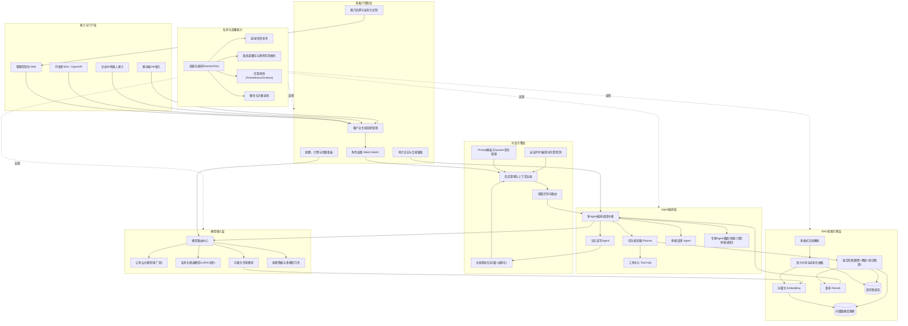
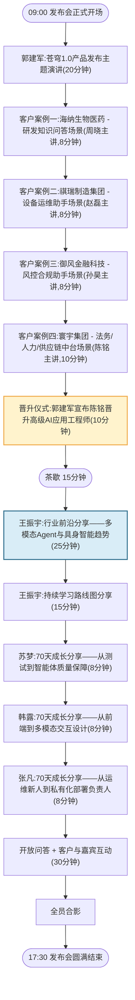
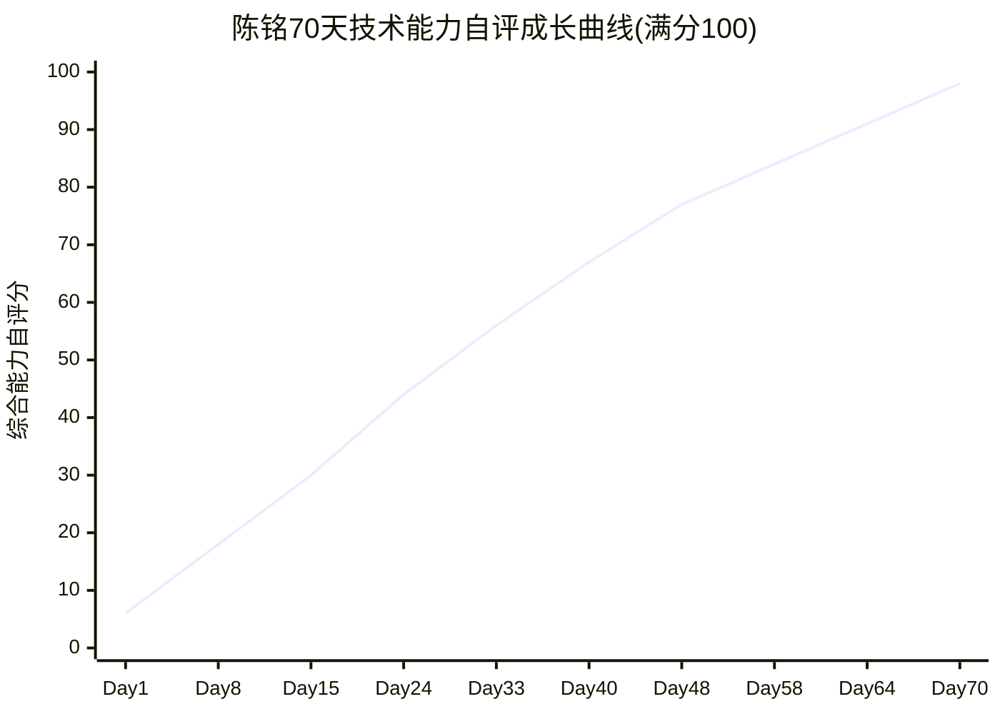

# 第70天:苍穹1.0发布仪式与晋升日

> 阶段:六阶段·旗舰实战篇(全书终章) | 全书周期:Day1-70 完整闭环 · 最终篇
> 主角:陈铭(AI应用工程师 → 高级AI应用工程师) | 导师:王振宇(老王,技术负责人)
> CTO:郭建军 | 产品经理:林悦 | 协作:赵磊(测试)、周晓(前端)、孙昊(运维)
> 同批同事:苏梦、韩露、张凡 | 公司:蓬远科技 | 产品:苍穹企业级智能体中台 v1.0
> 服务客户:海纳生物医药、祺瑞制造集团、御风金融科技、寰宇集团

---

## 【旁白】

七十天前的那个早晨,陈铭在蓬远科技一楼大堂的玻璃门前站了将近三分钟,原因说出来有点丢人——工牌挂反了,照片朝里,编号朝外,他自己都看不清自己是谁,更别说门口那位保安。他手忙脚乱地把工牌翻过来的时候,兜里那份打印出来的Python基础讲义被带得滑出来半截,第一页第一行印着一句话:"变量就是存放数据的容器。"他记得自己站在那句话前面愣了很久,脑子里翻来覆去地想,"容器"到底是什么容器,"数据类型"又凭什么要分成整型、浮点型、字符串型这么多种——那时候他甚至怀疑,自己是不是选错了方向,一个从传统测试岗转型过来的人,真的能在"AI应用工程师"这条当时连招聘JD都写得含糊不清的新赛道上站住脚吗。

七十天后的这个早晨,他依然站在同一栋楼的大堂里,工牌端端正正地挂在胸前,编号是P0187,职位那一栏昨晚系统更新后已经悄悄换成了"高级AI应用工程师"。他没有再检查工牌的方向,因为他知道,这七十天里,有太多次他也曾经把事情弄反过——把RAG的检索顺序弄反,把Agent的工具调用参数传反,把租户隔离的权限判断逻辑写反,把一次上线的灰度流量方向切反。每一次弄反,都换来一次真正的理解;每一次纠正,都在他心里悄悄挪动了一点点那条从"看不懂容器是什么"到"能独立判断一个系统架构该往哪个方向长"的刻度线。

今天不是一个普通的工作日。三楼的大会议室从早上七点半就开始被布置,红色的横幅挂在正对着电梯口的墙上,"苍穹企业级智能体中台 1.0 正式发布"几个字被打得又大又亮。陈铭知道,再过几个小时,郭建军会站在那个讲台上,把这个他和团队用几乎整整一年时间——从最初那个连变量和数据类型都要现学现卖的青涩阶段,到能够独立扛起一整套企业级智能体中台架构设计的今天——一点一点堆出来的产品,正式交到市场手里。他也知道,同一场发布会上,自己会以另一个身份被叫上台,不是作为"讲解某个功能模块的工程师",而是作为一个即将完成职业生涯第一次实质性晋升的人。

他站在电梯里,看着数字往上跳,忽然想起七十天前第一次坐这部电梯时的那种紧张——那时候他连"提交代码前要先跑一遍测试"这么基础的习惯都还没养成,更不敢想象有一天自己会在架构评审会上,对着CTO和一屋子资深工程师,清清楚楚地讲出"为什么这一层要做熔断降级"、"为什么这个检索链路要引入重排模型"。电梯门在三楼打开,会场里已经陆续有人在进出,老王站在门口,看到他,只是笑着抬了抬手里那杯咖啡,像是在说:"来了。"陈铭点点头,走进会场,他知道,这一天,是一份收官的礼物,也是一份继续往前走的邀请函。

---

## 晨会纪要

**时间**:Day70 08:40-09:10
**地点**:蓬远科技 三楼大会议室后台准备区
**参会人**:郭建军(CTO)、王振宇(技术负责人)、林悦(产品经理)、陈铭(核心开发,即将晋升高级AI应用工程师)、赵磊(测试工程师)、周晓(前端工程师)、孙昊(运维工程师)

这一天的晨会,和过去六十九天里任何一次晨会的气氛都不一样。往常大家围坐在小会议室里对着白板讨论排期,今天所有人站在后台准备区,面前是一整套即将对外呈现的发布会流程,空气里带着一点点紧张,又带着更多的兴奋。

**郭建军开场**:

"今天不安排常规的技术站会,我把大家叫过来,主要是过一遍今天的完整流程,确保每个环节都不出岔子。这场发布会,不只是苍穹1.0对外的第一次正式亮相,也是咱们这一年多技术积累的一次集中检验。我知道大家这几天为了今天的每一个演示环节都反复彩排过,但我还是要强调一句——今天台上任何一句话、任何一次演示,代表的都不是某一个人,而是整个团队这一年多一步步走过来的成果,大家心里要有这个分量感,但也不用有额外的压力,咱们该展示的东西,底子早就打得足够扎实了。"

**流程说明(郭建军 + 林悦)**:

郭建军把流程表投在屏幕上,逐条过了一遍:

"上午九点整正式开场,我先做二十分钟的产品发布主题演讲,讲清楚苍穹1.0从最初的定位到现在的能力边界,讲清楚我们为什么坚持走'中台化'这条路,而不是给每个客户单独定制一套系统。接下来是四个客户案例的展示,顺序是海纳生物医药、祺瑞制造集团、御风金融科技,最后是寰宇集团——这个顺序不是随便排的,是按照场景复杂度递增来的,海纳是相对聚焦的知识问答场景,祺瑞加入了设备运维的工具调用,御风涉及到风控合规这种对准确性和可追溯性要求极高的场景,寰宇是咱们目前落地最完整、涵盖法务人力供应链三大业务线的旗舰案例,放在最后压轴,能让台下的人清楚地看到咱们的能力是怎么一步步铺开的。"

林悦补充:"每个客户案例我们安排的展示人不一样——海纳案例由周晓来讲前端交互体验怎么服务不同角色的用户,祺瑞案例赵磊来讲测试评估体系怎么保障工具调用的可靠性,御风案例孙昊来讲私有化部署和安全合规怎么落地,寰宇案例陈铭来讲整体架构和多Agent协作。这样安排,一方面是希望让台下的人看到,苍穹这套产品背后不是一个人在扛,而是一整支能打的团队;另一方面,也是想让大家每个人都有一次站在发布会舞台上,亲口讲出自己这一年多参与和沉淀下来的东西的机会。"

**关于晋升仪式的安排(郭建军)**:

"四个客户案例讲完之后,有一个环节大家目前只有陈铭本人和王振宇提前知道细节,现在我跟大家都说清楚——我会在这个环节正式宣布,陈铭从今天起晋升为高级AI应用工程师。这不是走个形式,是经过了完整的评审流程,前几天的模拟答辩、平时的项目产出、这一年多的成长轨迹,评审委员会是认真过了一遍的。我希望大家把这个仪式当成对整个团队成长机制的一次公开展示——蓬远科技的工程师晋升不是看资历熬年限,是看真实产出和真实能力的成长曲线,陈铭是一个非常好的例子。"

陈铭这时候脸有点发热,他其实提前知道会有这个环节,但真正听到郭建军当着所有人的面把它说出来,还是觉得心跳快了几分。

**下午安排(王振宇)**:

"下午的安排我来说一下。茶歇之后,我会做一个大概四十分钟的行业前沿分享,主题是多模态Agent和具身智能这两个当下行业里最热的方向,顺带讲一下我自己对咱们接下来学习路线的一些建议,这个分享主要是讲给团队内部听的,顺便也会开放给今天到场的一部分客户方技术负责人旁听——这也是发布会一个隐藏的价值,让客户看到咱们团队不是只会做眼前的事,而是一直盯着行业往前看。分享之后,是苏梦、韩露、张凡三位同批入职的同事,分别做一个简短的成长分享,讲讲他们这一年多各自在不同项目线上的收获。最后留半小时开放问答,顺便安排合影环节。"

**孙昊补充(运维保障)**:

"我这边今天全程盯着监控大屏,四个客户案例的演示环境昨晚已经全部预热跑过一轮,响应时间都在预期区间内,现场的网络和设备也做了双活备份,万一主链路出问题能秒切备用链路。大家专心讲内容就行,系统这块我兜底。"

**赵磊补充(测试与验证保障)**:

"我这边今天要盯两条线。一条是四个客户案例的演示数据,昨天晚上已经跟每个案例的主讲人对过一遍脚本,今天早上七点我又单独把海纳和御风这两个案例的演示环境跑了一轮完整回归,确认响应时间和输出内容都在预期范围内,没有出现任何偏差。另一条是晋升仪式相关的材料,虽然这部分不涉及系统测试,但郭总念的评审结论摘要,我昨天也帮着交叉核对了一遍里面引用的项目数据,确保念出来的每一个数字都经得起追问,不会出现'台上说的和实际项目报告不一致'这种尴尬情况。"

**周晓补充(前端与现场呈现)**:

"我这边负责的是发布会现场的大屏演示界面,四个客户案例切换的时候,界面过渡要顺畅自然,不能出现卡顿或者布局错乱。另外晋升仪式那个环节,我们特意设计了一个简短的动画过场,把陈铭这七十天里几个关键项目节点的截图串联起来,大概十几秒,郭总念名字的时候同步播放,这个我已经跟音控那边对过好几遍时间点了。"

**郭建军对晨会的补充说明**:

郭建军听完大家的汇报,又补充了一点:"今天到场的除了咱们内部团队,还有几位媒体记者,以及海纳、祺瑞、御风、寰宇四家客户各自派来的代表。这意味着咱们今天讲的每一句话,展示的每一份数据,都可能会被写进报道里,或者被客户带回去做内部汇报的依据,所以准确性这件事,今天比以往任何一次都更重要——宁可少讲一句,也不要讲一句没有把握的话。"

**郭建军总结**:

"好,流程都清楚了。这一天,我们不只是在开一场发布会,也是在给过去这一年多每一个熬夜排查问题、每一次上线前反复压测、每一次客户提出刁钻问题时扛住压力的时刻,一个正式的、公开的交代。大家去准备吧,九点整,准时开场。"

---

## 需求文档

### 苍穹1.0产品发布材料清单(Release Material Checklist)

**一、产品发布主材料**

- [ ] 《苍穹企业级智能体中台 1.0 产品白皮书》定稿,涵盖产品定位、核心能力矩阵(对话引擎、RAG检索、Agent编排、模型接入、私有化部署、多租户控制台)、典型应用场景、与市场同类产品的差异化定位。
- [ ] 产品发布主题演讲PPT(郭建军使用),控制在40页以内,核心信息前置,避免信息过载。
- [ ] 产品能力矩阵一页纸总结(One-Pager),用于会后分发给到场的潜在客户和媒体,便于快速传播。
- [ ] 官网发布稿与新闻通稿定稿,包含产品定位、核心亮点、客户证言(取得海纳、祺瑞、御风、寰宇四家客户的正式引用授权)。

**二、客户案例展示材料**

- [ ] 海纳生物医药案例:研发知识问答场景演示脚本、关键指标数据(知识检索准确率、平均响应时间、研发人员日均使用频次)、客户证言引用。
- [ ] 祺瑞制造集团案例:设备运维助手场景演示脚本、工具调用链路示意、故障诊断准确率与平均处理时长对比数据。
- [ ] 御风金融科技案例:风控合规助手场景演示脚本、审计留痕机制说明、私有化部署合规资质材料摘要。
- [ ] 寰宇集团案例:法务人力供应链多业务线中台案例演示脚本(沿用此前终审答辩通过的版本并做发布会场景适配)、多Agent协作架构简图、上线后的运营数据(近期真实使用量、准确率、成本节省估算)。
- [ ] 四个案例的展示顺序、每个案例的演示时长(控制在8分钟以内)、讲解人分工表确认。

**三、晋升仪式材料**

- [ ] 陈铭晋升评审结论摘要(供郭建军现场宣读使用),包含评审维度(技术深度、项目产出、协作影响力、成长曲线)与结论。
- [ ] 晋升仪式流程卡片:宣布环节话术、颁发环节动作(晋升证书、新工牌、内部系统职级更新确认)、简短感言环节时长安排(预留3分钟)。
- [ ] 晋升评审委员会名单与评审依据材料存档(内部留档,不对外公开细节)。

**四、行业前沿分享与学习路线材料**

- [ ] 王振宇行业前沿分享PPT,主题为多模态Agent发展趋势、具身智能发展趋势,面向内部团队及部分到场客户技术负责人,需兼顾技术深度与通俗易懂。
- [ ] 《持续学习路线图》文档,面向团队全员发布,给出接下来阶段性的学习专题建议(如多模态大模型应用、具身智能基础、Agent安全与对齐、云原生工程能力深化等方向)。
- [ ] 三位同批同事(苏梦、韩露、张凡)的成长分享内容大纲提前收集并审阅,确保内容积极、真实、且不涉及未公开的商业敏感信息。

**五、现场执行与保障材料**

- [ ] 发布会完整流程时间表(精确到分钟),包含各环节负责人、预留缓冲时间。
- [ ] 演示环境独立部署与预热验证记录,四个客户案例的演示数据与生产环境数据严格隔离,避免发布会现场影响真实客户业务。
- [ ] 现场技术保障值守表(孙昊主责,备用链路切换预案明确)。
- [ ] 媒体与嘉宾接待清单、签到与合影环节安排。
- [ ] 发布会录像与后续传播素材(会后剪辑、内部复盘素材)采集计划。

**六、内部彩排与风险预案**

- [ ] 全流程彩排至少完成两轮,第一轮在Day69晚间进行,重点检验各环节衔接是否顺畅;第二轮在Day70发布会当天早晨七点进行,重点复核演示环境数据与响应时间。
- [ ] 针对可能出现的技术故障(演示环境网络异常、大屏投影设备故障、演示数据被误改动),分别准备对应的应急预案与备用方案(如备用笔记本电脑、离线录制的演示视频作为兜底)。
- [ ] 针对客户现场提出脚本外问题的应对预案,按照"能力边界类""数据安全类""成本与投入类""故障应急类"四大类整理应对逻辑,供主讲人现场灵活应用。
- [ ] 晋升仪式念稿内容提前经过法务与人力资源合规审阅,确保评审结论摘要的措辞恰当、不涉及薄弱环节的过度渲染或夸大。

**七、验收标准**

- 产品发布主材料内容准确,不得出现任何未经客户授权引用的数据或证言。
- 四个客户案例演示全部提前完成两轮彩排,响应时间与预期结果稳定可复现。
- 晋升仪式流程简洁庄重,时长控制在10分钟以内,不喧宾夺主。
- 行业前沿分享内容需经过王振宇本人审阅确认,避免夸大或不实的行业趋势判断。
- 全场发布会总时长控制在8小时以内(含午休与茶歇),不得因流程冗长影响客户体验。

---

## 架构设计图(苍穹1.0最终完整产品架构总览)

这张图,是老王在发布会前一晚特意让陈铭重新画的。他说:"别用某一天冲刺时候的架构图,那些都是某个阶段的局部快照。今天要拿出来的,得是把七十天所有的技术演进都汇总进去之后,真正立得住的最终版本。"于是陈铭把接入层、多租户控制台、对话引擎层、Agent编排层、RAG检索引擎层、模型接入层、私有化部署能力,一层一层重新捋了一遍,画出了下面这张图——这也是全书里最完整的一版架构总览。



陈铭画完最后一根连线的时候,盯着屏幕看了很久。七十天前他第一次画架构图,画的是一个三层的Web应用,前端、后端、数据库,简单得像小学生的加减法。而眼前这张图,横跨六个子系统,几十个组件,每一个方框背后都是某一天、某一次踩坑、某一次深夜复盘换来的具体经验。他忽然明白老王说的"最终版本"是什么意思——它不是凭空设计出来的,是七十天里一层一层真实长出来的。

---

## 流程图(苍穹1.0发布会当天完整流程)



---

## 示意图(陈铭70天技术成长曲线)



这条曲线背后,是一份更细的里程碑清单,陈铭在今天的复盘里把它一条一条列了出来:

- **Day1**:变量与数据类型,从零起步,连最基础的编程概念都要反复理解,能力自评分接近谷底。
- **Day8**:函数与模块化编程逐渐上手,开始能够独立完成小规模的脚本任务。
- **Day15**:第一次真正理解大模型的工作原理和Prompt工程的方法论,像是推开了一扇之前完全看不见的门。
- **Day24**:搭建出第一条完整的LangChain链路,第一次体会到"用代码把大模型的能力组织起来"是什么感觉。
- **Day33**:攻克RAG检索质量问题,理解了分块、向量化、混合检索、重排这一整条链路为什么每一步都不能省。
- **Day40**:第一次独立设计出具备自主决策能力的Agent,从"写死的流程"跨越到"会自己判断下一步做什么"的智能体。
- **Day48**:啃下模型微调与私有化部署这块硬骨头,理解了从公有云API到私有化落地之间,隔着多少工程细节。
- **Day58**:苍穹旗舰项目启动,第一次从零开始独立参与一整套企业级中台的架构搭建。
- **Day64**:寰宇集团项目正式上线,第一次完整走完一个真实客户项目从开发到生产部署的全过程。
- **Day70**:苍穹1.0正式发布,晋升为高级AI应用工程师,具备独立做出架构级技术决策的能力。

老王看着这份清单说了一句话:"你看,这条曲线从来不是一条直线,中间有好几段几乎是平的,那些平的地方,就是你当时觉得'怎么学都学不进去'的日子。但正是那些看起来没有进展的日子,把你后面那几段陡峭的上升,垫住了。"

他又指着Day33到Day40这一段说:"你看这一段曲线是全程最陡的一截,从攻克RAG检索质量问题到独立设计Agent自主决策,中间只隔了七天,但这七天你几乎是把之前二十几天积累的编程基础、Prompt工程理解、框架使用经验,一次性调动起来解决了一个全新维度的问题。这种'厚积薄发'式的跃升,往往是最容易被人忽略的部分——大家只看到你突然'会'了,却没看到前面那么多天看似缓慢的积累,才是这次跃升真正的燃料。"陈铭点点头,他确实记得那七天几乎没有睡过一个安稳的整夜,但也正是那七天,让他第一次真正体会到"从量变到质变"这句话不是一句空话,而是一种真实可以被复盘、被验证的成长规律。

---

## 课堂笔记

### 上午:苍穹1.0发布会现场

九点整,会场的灯光准时调暗又调亮,郭建军走上讲台。他没有像典型的发布会开场那样先讲一段煽情的开场白,而是直接打开了第一页PPT——一张苍穹中台最早期的架构草图,线条粗糙,组件寥寥。

"这是我们第一版技术方案的截图,那时候整个团队只有六个人,产品叫什么名字都还没定下来。"郭建军说,"我把它放在今天发布会的第一页,不是为了怀旧,是想让大家看清楚一件事——苍穹企业级智能体中台不是一个从天而降的产品,它是一层一层,靠着团队真实踩过的坑、真实验证过的方案,一点点长出来的。"

陈铭注意到,会场比平时的产品评审会议室要大出许多,原本用来做内部会议的三楼大会议室,被临时打通了隔断墙,变成一个能容纳两百多人的开放空间。第一排坐着的是海纳、祺瑞、御风、寰宇四家客户各自派来的代表,他们胸前挂着统一制作的嘉宾证,证件上印着各自公司的logo和"苍穹1.0发布会特邀嘉宾"字样;第二排往后,是七八位提前联系好的媒体记者,桌上摆着录音设备和笔记本电脑,有人已经在快速地打字;更靠后的位置,坐满了公司内部各个部门赶来观礼的同事,连平时很少参加发布会的财务和行政团队,今天也破例挤出了大半张会议室。陈铭注意到郭建军讲话的这块讲台背后,大屏幕上循环播放着一段极简的动态logo,苍穹二字用了一种类似山峰轮廓的字体设计,林悦后来告诉他,这个logo方案前后改了十一稿,最初的版本被郭建军否掉的理由是"太像一个纯粹的科技公司LOGO,没有体现出中台这种'托举'的意味"。

**产品发布讲话的核心内容**

郭建军的主题演讲大致分成四个部分,陈铭在台下一边听一边在笔记本上记下要点,这份笔记后来也被他整理进了自己70天的成长总结里。

第一部分,郭建军讲了苍穹为什么要做成"中台"而不是给每个客户单独定制系统。他给出了一个很直观的类比:"如果每接一个客户,我们都重新搭一套系统,那我们本质上是在做项目外包,项目做得越多,团队反而越累,因为每一份代码都是孤立的资产,复用不起来。而中台的意义在于,把'对话引擎''RAG检索''Agent编排''模型接入''私有化部署''多租户控制'这些能力,做成标准化、可配置、可插拔的底层模块,每接一个新客户,做的是'配置和适配',不是'重新发明轮子'。这也是为什么我们敢在今天,同时展示四个完全不同行业、不同场景的客户案例——如果这四个案例背后是四套完全独立的代码,那根本不叫中台。"

第二部分,郭建军回顾了产品能力矩阵的六个核心层次,和陈铭刚刚画的那张最终架构图逐一对应上——对话引擎层负责让交互"自然可用",RAG检索引擎层负责让回答"有依据可查",Agent编排层负责让系统"能主动完成复杂任务而不只是回答问题",模型接入层负责让底层能力"可灵活切换、不被单一供应商锁死",私有化部署能力负责让"客户数据和系统始终掌握在自己手里",多租户控制台负责让"一套系统同时安全地服务成百上千个不同的企业客户"。他特别强调了模型接入层的设计理念:"我们从一开始就没有把自己绑死在某一家模型厂商身上,公有云模型负责覆盖大部分通用场景,私有化微调模型负责满足客户对数据安全和领域精度的特殊要求,一旦某个模型出现服务异常或者性价比变化,我们有能力在不影响业务的前提下无缝切换,这是我们敢承诺客户'长期稳定服务'的底气所在。"

第三部分,郭建军讲了苍穹相比市场上同类产品的差异化定位。他没有回避竞争,反而主动提到了几家同类厂商的名字,逐一分析各自的侧重点,然后说明苍穹的差异化落在"深度私有化能力"和"多Agent协作的工程成熟度"这两点上:"很多同类产品,私有化部署停留在'能装进客户机房'这个层面,但真正做到断网环境下依然可用、真正做到多租户数据隔离经得起安全审计、真正做到滚动更新业务零中断,这背后的工程量,远远超出很多人的想象。这也是为什么我们能拿下御风金融科技这样对合规要求极其苛刻的客户。"

第四部分,郭建军用一句话收尾这段演讲:"苍穹1.0不是我们的终点,它是我们把过去一年多验证过的所有能力,第一次装进一个完整、稳定、可复制的产品里,正式交给市场检验的起点。"

演讲快结束的时候,郭建军放了一张对比图——左边是苍穹最初的技术方案原型,右边是今天这套六层架构的完整总览。他没有多解释,只是停顿了几秒钟,让台下的人自己去看这两张图之间的距离。陈铭坐在台下,心里忽然生出一种奇妙的共鸣感——这张对比图,和他自己那条七十天成长曲线,某种意义上讲的是同一件事:一个足够复杂、足够有价值的东西,从来不是一蹴而就的,而是靠着一层一层的验证、一次一次的推翻重来,慢慢长成的。他想起自己刚入职那会儿,老王第一次带他看架构图的时候说的一句话:"别怕看不懂,你现在看不懂的每一个方框,以后都会变成你亲手参与画出来的东西。"当时他只当是一句鼓励,直到今天,他才真正体会到这句话的分量。

郭建军讲完主题演讲,台下的掌声持续了将近十秒钟,几位客户代表交换了一下眼神,其中御风金融科技的技术负责人当场就在自己的笔记本上写下了几个关键词,后来在下午的问答环节,他提出的问题正是围绕着模型路由和熔断降级机制的具体实现细节,这也从侧面证明了郭建军上午那段"差异化定位"的讲解,确实抓住了客户最关心的技术痛点。

**客户案例一:海纳生物医药**

四个客户案例展示环节,是整场发布会里技术含量最集中、也最考验讲解人临场应变能力的一段。林悦在后台反复叮嘱几位主讲人:"记住,咱们讲案例不是在念产品说明书,是在给台下这些懂行或者不太懂行的人,讲清楚'苍穹到底帮这家企业解决了什么真实的问题'。数据要拿得出来,逻辑要经得起追问,但语言一定要是普通人能听懂的语言。"

周晓走上台,她负责讲海纳生物医药案例的前端交互体验部分。她展示了一段研发人员在系统里检索某个药物靶点相关文献和内部实验记录的交互演示,重点讲了两个设计细节:一是系统针对不同角色(研发人员、专利律师、临床团队)设计了不同的界面呈现和信息密度,同一个知识库,不同角色看到的答案组织方式不一样;二是针对生物医药领域大量的专业术语和缩写,系统在RAG检索链路里加入了领域词表增强,显著提升了检索命中率。她给出的关键数据是:知识检索准确率从上线初期的71%提升到了目前的89%,研发人员日均使用频次达到了每人每天6.2次,已经成为他们日常工作流程中稳定的一环。

演示环节里,周晓特意设计了一个对比片段——同一个关于某个靶点安全性数据的问题,分别用研发人员视角和专利律师视角问了一遍,系统给出的两份答案在术语密度、引用文献的呈现方式上明显不同,研发人员看到的是原始实验数据摘录和图表引用,专利律师看到的则是经过整理的结论性表述加上对应的专利文号索引。台下海纳的技术负责人在这一段演示结束后主动记了一下时间,后来提问环节他追问了一句:"这种角色区分是提前写死的规则,还是系统自己判断的?"周晓的回答很干脆:"两者都有——角色的基础呈现模板是配置好的,但具体呈现给用户看的信息颗粒度和详略程度,是由意图识别模块结合当前用户角色和历史提问习惯,动态调整出来的,不是一套写死的if-else。"这个回答让对方点了点头,在自己的本子上记下了几个字。

**客户案例二:祺瑞制造集团**

赵磊接着上台,他讲的是设备运维助手场景,重点放在测试评估体系上。他展示了系统如何根据设备传感器数据异常和运维人员的自然语言描述,自动判断可能的故障原因,并调用工具查询备件库存、生成维修工单。他特别强调了这套工具调用链路背后的测试保障:"我们为这套助手设计了超过300个故障场景的回归测试集,覆盖从常见故障到极端边界情况,每一次模型或链路升级,都必须先跑通这套回归测试,准确率不能低于既定基线,才能上线。"他给出的数据是:故障诊断建议的采纳率达到76%,平均故障处理时长相比人工排查缩短了41%。

赵磊还现场演示了一个"刻意制造的失败案例"——他让系统面对一个训练数据里从未出现过的全新故障组合(某型号注塑机同时出现液压压力异常和温度传感器读数漂移),系统没有强行给出一个自信满满却可能错误的诊断,而是明确提示"当前故障组合置信度不足,建议人工工程师优先介入,系统给出的三个可能性仅供参考排序",并列出了对应的检索依据。赵磊解释这个设计的初衷:"我们在测试阶段发现,一个AI助手最危险的不是'不知道',而是'不知道自己不知道',还硬要装作很确定地给出答案。所以我们在测试评估体系里专门加了一类'低置信度诚实度'的评测指标,专门考核系统在遇到超出能力边界的问题时,有没有诚实地承认边界,而不是死撑。"这段演示台下响起了一阵小小的议论声,几位客户代表显然对这种"知道自己不知道"的设计印象深刻。

**客户案例三:御风金融科技**

孙昊讲的是风控合规助手场景,重点是私有化部署和安全合规。他没有过多展示交互细节,而是花了大部分时间讲部署架构和审计机制:"御风对我们最核心的要求就一条——所有数据和模型推理过程,必须完全在他们自己的机房内完成,不允许任何一次调用穿透到公网。我们为此专门设计了完全离线可用的私有化部署包,连模型的更新也是通过加密介质离线交付,而不是在线拉取。同时,系统里每一次风控相关的问答和判断,都会生成完整的、不可篡改的审计记录,满足金融行业的合规审计要求。"他展示了一个模拟的审计追溯演示:输入一条历史查询记录,系统能够完整还原出当时的检索依据、模型版本、置信度评分,整个链路可追溯,不存在"黑箱"。

孙昊还特别提到了一个细节,这个细节此前在内部评审时几乎被漏掉,是他自己在部署后期主动补充的:"御风的合规团队最初提的需求里,只要求留存最终的问答记录,但我们评估下来,如果只留最终结果,一旦未来监管部门要求追溯'某个具体判断的依据链路是否合规',单纯的问答记录是不够的,所以我们主动多做了一层——把每一次检索到的候选文档、每一次模型给出的候选答案、以及最终经过审核Agent筛选之后被采纳或被拒绝的理由,全部结构化留存下来。"他说这句话的时候,台下御风的合规负责人明显坐直了身体,追问了一句这层额外留存会不会带来明显的存储成本增加,孙昊给出了具体的数字:"按照御风现在的日均问答量估算,这层额外留存每月大概增加不到3%的存储成本,但换来的是完全经得起最严苛审计的可追溯性,我们认为这笔投入是值得的。"

**客户案例四:寰宇集团(压轴案例)**

轮到陈铭上台的时候,他能感觉到自己的心跳比平时快了一些,但站定之后,反而很快平静下来——这个案例,他讲过太多次了,从最初的项目立项汇报,到中期的架构评审,到终审答辩,再到今天的发布会,每一次讲述,都是对这个项目最熟悉的一次复盘。

他没有从头讲寰宇项目的所有细节,而是抓住了三个最能体现"中台能力"的点来讲:第一,法务、人力、供应链三个业务线共用同一套底层能力(对话引擎、RAG检索、Agent编排),只是在配置层做了场景化适配,这正是郭建军之前讲的"中台化"理念在真实客户身上的最佳印证;第二,多Agent协作机制在寰宇项目里的实际应用——比如供应链场景里,检索Agent查历史数据,计算Agent做库存和成本测算,审核Agent对结果做风险提示,三个Agent协同完成一个人力和法务场景都无法替代的复合任务;第三,项目上线后的真实运营数据——近三个月的日均问答量、用户满意度评分、以及最关键的成本节省估算,他给出的数字是,寰宇集团法务部门在合同审查环节的平均耗时从原来的每份合同40分钟压缩到了8分钟以内,人力部门的政策类问询响应从平均等待2小时压缩到了即时response,供应链部门的采购建议生成效率提升了近5倍。

讲到最后,陈铭说了一句原本没有写在讲稿里的话:"这个项目从立项到今天,是我个人成长里最重要的一段经历。它教会我的,不只是怎么写RAG、怎么设计Agent协作,更重要的是,怎么把一堆技术组件,真正组织成一个能在客户手里稳定跑起来、创造真实价值的系统。"台下响起了一阵掌声,他看到老王在人群里冲他点了点头。

案例展示结束后,进入了一个简短的现场提问环节。寰宇集团的IT负责人当场提出了一个问题:"如果未来业务量增长十倍,现在这套架构还能不能撑住?"陈铭没有慌,他把这个问题拆成了两部分来回答——一部分是无状态服务(如对话引擎、Agent编排调度)可以通过水平扩容直接应对流量增长,架构设计上从一开始就没有依赖单机内存做状态保存;另一部分是有状态的存储层(向量数据库、关系型数据库),目前的容量规划留有至少三倍的冗余空间,并且已经有明确的分库分表和向量库分片方案作为预案,不需要等到真正撞到瓶颈才临时应对。他还补充了一句:"我们在寰宇项目的压测阶段,专门模拟过流量峰值十倍于日常均值的场景,系统整体的P95响应时间依然控制在可接受范围内,这不是纸面上的推测,是有实际压测数据支撑的结论。"这个回答让台下几位技术背景的客户代表明显露出了认可的表情,林悦后来在茶歇的时候特意跟陈铭说:"你刚才那个回答,比我们提前准备的任何一份材料都更打动人,因为那是你自己真正想清楚、验证过的东西,不是背出来的。"

紧接着又有一位媒体记者提了一个更偏向传播角度的问题:"你们这套系统,和市面上大家常说的'企业知识库问答机器人'相比,最本质的区别是什么?"这个问题看似简单,实际上是在检验讲解人能不能跳出技术细节,给出一句真正有传播力的总结。陈铭想了几秒钟,回答道:"最本质的区别在于,一个简单的知识库问答机器人,回答完问题,它的任务就结束了;而苍穹要做的,是在回答问题之后,还能主动帮你把后续该做的事情往下推进一步——查完资料,直接帮你算好数字、生成好文档、甚至提示你需要注意的风险点。换句话说,我们不是在做一个'更聪明的搜索框',而是在做一个'能帮你把事情往前推进的数字同事'。"这句话后来被到场的一位媒体记者原样写进了发布会的报道标题里。

紧接着还有一位祺瑞制造集团的代表,虽然他们自己的案例已经展示过,但显然对寰宇这种多业务线中台化的落地很感兴趣,他举手问了一个更尖锐的问题:"法务、人力、供应链这三个业务线的数据敏感程度完全不一样,共用同一套底层能力,会不会存在数据被错误关联或者跨业务线泄露的风险?"陈铭没有回避这个问题的分量,他解释道:"共用的是底层的技术能力组件,不是共用的数据本身。寰宇项目里,法务、人力、供应链三个业务线各自对应独立的知识库和独立的租户级配置,即便调度的是同一套Agent编排引擎和同一套检索引擎,数据在存储层和检索层都是严格隔离的,一个法务场景的Agent任务,不可能检索到人力条线的数据,这在架构设计上是通过多租户控制台的RBAC和数据隔离机制强制约束的,不是靠业务约定或者人工规范去'尽量避免',而是技术上'物理不可能'。"这个回答让提问的代表满意地点了点头,郭建军后来在茶歇时跟陈铭说,这个问题问得刁钻,但回答得扎实,"说明你真的懂这套架构,不是背下来的话术"。

**晋升仪式**

四个客户案例讲完,郭建军重新走上讲台,会场的气氛微微松弛下来又渐渐重新收紧,大家都感觉到接下来是一个不一样的环节。

"接下来,我要做一件今天发布会里,对我个人来说同样重要的事。"郭建军说,"过去一年多,我们看着一批新人从对这个行业几乎一无所知,一点点成长为能够独立扛起复杂项目的工程师。今天我想借着苍穹1.0发布的这个时刻,正式宣布一项晋升决定。"

他停顿了一下,看向站在台下第一排的陈铭。

"陈铭,从今天起,正式晋升为高级AI应用工程师。"

会场里的掌声比之前几次都更热烈。郭建军接着念了一段评审委员会的结论摘要:"评审委员会一致认为,陈铭在过去一年多的项目实践中,展现出了扎实的技术基础、快速的学习能力、以及在复杂系统架构设计上逐渐成熟的判断力。从最初的功能模块开发,到独立承担寰宇集团项目的核心架构设计,再到近期晋升答辩中展现出的系统性思考能力,他的成长轨迹清晰、扎实,完全达到高级工程师的能力标准。"

证书颁发的同一时刻,大屏幕上播放起了周晓提前剪辑好的那段十几秒的过场动画——第一张画面是陈铭Day1那张挂反工牌、面对镜头略显生硬地笑着的入职照片,紧接着是他第一次独立完成LangChain链路时在工位上举着笔记本电脑冲镜头比了个大拇指的抓拍,再往后是寰宇项目终审答辩那天,他站在投影幕布前讲解架构图的侧影,最后定格在今天上午他在发布会讲台上回答十倍流量提问时的画面。短短十几秒,像是把七十天压缩成了一部微缩纪录片。台下不少同事看到那张挂反工牌的照片时笑出了声,陈铭自己站在台上,也忍不住笑了一下,那种笑里带着一点不好意思,又带着一点说不清楚的感慨。

陈铭走上台,接过晋升证书和新工牌,又被要求说几句话。他没有准备特别华丽的发言稿,只是说了这样一段话:

"七十天前,我入职第一天,连工牌都戴反了。那时候我对'变量''数据类型'这些最基础的概念都要现学现卖,更不敢想象有一天能站在这里,参与一个真正服务好几家企业客户的产品的发布会。这一路走过来,每一次觉得自己快撑不住的时候,身边总有人拉一把——老王在我卡在某个技术难点上熬到深夜的时候,发来一句'再看看这个思路';林悦在我把技术讲得云里雾里的时候,提醒我'先想想客户到底想听什么';赵磊、周晓、孙昊,还有苏梦、韩露、张凡这几位一起入职的战友,这一年多里踩过的坑,大家分摊着一起扛。我想这份晋升,不只是给我个人的,也是给整个团队的一份证明——一个愿意托着新人往上走的团队,才能真正把产品也一起往上托。谢谢大家。"

他走下台的时候,老王站起来跟他握了一下手,只说了一句:"接下来别飘,继续往前走。"陈铭笑着点头,心里踏实又清醒。

---

### 下午:老王的行业前沿分享、持续学习路线图与老同学的成长分享

茶歇之后,会场的气氛从上午的仪式感切换成了更专注的学习氛围。老王抱着笔记本电脑走上台,他的开场白很朴素:"上午的发布和晋升都是团队这一年多辛苦付出的一个结果展示,下午我想跟大家聊点面向未来的东西——这个行业变化太快了,如果咱们只满足于把苍穹1.0做好,不去看行业下一步在往哪走,那用不了太久,咱们今天的骄傲,就会变成明天的落后。"

**多模态Agent的趋势解读**

老王先讲的是多模态Agent。他没有堆砌太多学术名词,而是用了一个很生活化的方式切入:"咱们苍穹目前的Agent,主要处理的是文本输入、文本输出,顶多加上一些结构化的工具调用返回结果。但真实世界里,人做决策的时候,从来不只依赖文字,你看一张图、听一段录音、翻一份带图表的PDF,这些信息本身就是多模态的。多模态Agent想解决的问题就是,让智能体不只能'读文字',还能'看图、听声音、理解视频',并且把这些不同模态的信息,融合起来一起做判断。"

他举了几个正在发生的实际例子:客服场景里,客户直接拍一张产品故障的照片发过来,多模态Agent能够直接识别图片里的问题,不需要客户再用文字描述半天;制造业场景里,设备巡检的视频流可以被Agent实时分析,自动判断设备是否存在异常磨损或者温度异常;医疗场景里,Agent可以同时理解病历文本、检验报告的表格数据、甚至医学影像的初步判读,给出更全面的辅助诊断建议。

"这对咱们苍穹意味着什么?"老王抛出这个问题,自己给出了答案,"意味着咱们现在RAG检索引擎层里'文档解析'这个模块,未来要能处理的不只是文字和表格,还要能处理图片里的信息、甚至视频里的关键帧信息;意味着咱们Agent编排层里的'工具中心',未来要能接入图像理解、语音转写这类多模态处理工具;意味着咱们的模型接入层,要能够灵活对接支持多模态输入输出的大模型。这不是要推翻咱们现在的架构重新做一套,而是在现有的分层设计基础上,给每一层拓展新的能力边界——这也是为什么我一直强调,咱们从Day1开始就要养成'分层解耦'的架构习惯,这样的架构,才有能力去承接未来的变化,而不会因为一个新趋势的出现就被彻底推翻重来。"

老王还特意在这一段里加了一个真实的行业动态作为佐证:"最近半年,我关注到不止一家做企业智能体的同行,已经开始在客服和运维场景里小范围试点多模态输入能力,虽然目前大多还停留在'能识别图片里的文字'这种比较初级的阶段,距离真正意义上'理解图片里设备损坏的严重程度并给出专业判断'还有明显差距,但这个方向的投入速度比我一年前预判的要快。"他补充道,咱们没必要因为别人先动手就仓促跟进,"但至少要清楚地知道这件事正在发生,而不是等客户主动来问我们'你们支持不支持识别图片'的时候,才第一次意识到这是个需求。"

**具身智能的趋势解读**

第二个主题是具身智能,老王讲得更谨慎一些:"具身智能这个概念,简单说,就是让AI不只存在于屏幕和对话框里,而是能够通过一个真实的物理载体——机器人、机械臂、无人设备——去感知环境、做出动作、并且从物理世界的反馈里持续学习。这跟咱们现在做的企业级智能体中台,看起来隔得比较远,但我想提醒大家的是,具身智能背后依赖的很多核心能力,和咱们现在做的Agent编排,底层逻辑是相通的——任务规划、多步骤决策、工具调用(对具身智能来说,'工具'可能就是机械臂的一次抓取动作)、执行过程中的反思和纠错。"

他特别提到:"咱们现在苍穹里那套'规划-执行-反思'的Agent协作机制,本质上跟具身智能里机器人执行一个复杂物理任务的决策循环,是同一套方法论的不同应用场景。如果未来咱们的客户里,有制造业客户希望把咱们的Agent能力,从'辅助人做决策'延伸到'直接指挥产线上的自动化设备做决策',那咱们现在积累的这套多Agent协作架构经验,是完全可以迁移过去的基础。"

老王也很坦诚地指出了具身智能目前的现实局限:"这个方向目前还处于比较早期的阶段,真正成熟、可大规模商业化落地的场景还不多,我讲这个不是让大家立刻转去研究机器人控制,而是希望大家对这个方向保持关注和基本的了解,知道它大概往哪个方向发展,一旦咱们所在的赛道和这个方向出现交叉点的时候,咱们不会因为完全陌生而反应迟钝。"

有人在台下提了一个问题:"那咱们苍穹要不要现在就投入资源去做具身智能方向的预研?"老王想了几秒钟,给出的回答很实在:"我的判断是暂时不需要重资源投入,但可以做两件轻量级的事——第一,让感兴趣的同事花一点业余时间去读一读这个方向的代表性论文和技术报告,保持认知不落后;第二,咱们在设计现有Agent编排架构的时候,尽量让'任务规划''工具调用''执行反思'这几个核心模块保持足够的抽象和通用性,不要跟'纯文本交互'这个场景绑得太死,这样万一某一天咱们真的需要往这个方向延伸,现有的架构不会成为绊脚石,反而能成为一个现成的起点。这本质上是一种'低成本保留可能性'的策略,而不是盲目追热点。"

他又举了一个更具体的例子帮助大家理解这种"抽象与通用性"的设计原则:"比如咱们现在Agent编排层里的'工具中心',一个工具的定义本质上就是'名称+描述+参数结构',这套抽象本身就没有限定'工具'必须是一次API调用,如果未来某个客户真的需要控制一台简单的自动化设备,一次'抓取动作'完全可以被包装成一个符合这套接口规范的工具,Planner在做任务规划的时候,不需要知道这个工具背后是调了一次HTTP接口还是驱动了一次机械臂动作,它只关心'这个工具能完成什么、需要什么参数、会返回什么结果'。这就是我说的'低成本保留可能性'——咱们不需要现在就为具身智能重新设计一套架构,只需要保证现在的设计足够抽象,不给自己设置不必要的天花板。"

**持续学习路线图**

讲完两个趋势方向,老王切换到了下一页PPT,标题是《蓬远科技技术团队持续学习路线图》。

"苍穹1.0发布了,但这不代表咱们可以躺在功劳簿上。"他说,"我给大家的建议,分成三个层次,近期、中期、长期。"

近期(接下来1-3个月),他建议团队重点补齐两块能力:一是多模态数据处理的基础能力,包括图像理解、语音转写这类模型的接入和评估方法;二是Agent安全与对齐相关的知识,包括如何防范Agent被恶意提示词攻击、如何设计更可靠的权限边界,这一点在企业级场景里尤其重要,因为一旦Agent被赋予了调用真实业务系统的权限,安全性的重要程度不亚于功能本身。他补充了一个具体的学习建议:"安全与对齐这块,不要只停留在读文章的层面,我建议大家找一个咱们内部现有的Agent工具调用链路,自己动手设计几个'恶意提示词攻击'的测试用例,亲手试一次能不能绕过咱们现有的护栏机制,如果真的被绕过了,那就是最好的学习材料——远比抽象地读一篇论文更有体感。"

中期(接下来半年到一年),他建议团队深入研究云原生工程能力,包括更成熟的K8s多集群管理、服务网格、以及针对大模型推理场景专门优化的资源调度策略,这是支撑苍穹从"能用"走向"在更大规模客户场景下依然稳定好用"的工程基础。同时,他也建议部分同事可以开始系统学习多模态大模型的原理和应用方法论,为将来苍穹拓展多模态能力做人才储备。

长期(一年以上),老王的建议更开放:"具身智能、更自主的Agent协作范式、模型和硬件更紧密结合的应用形态,这些方向现在都还在快速演化,没有人能百分百预判最终会走到哪里。我给大家的建议是保持'技术嗅觉'——定期看行业顶会的论文摘要,定期看头部厂商的技术博客,哪怕不深入研究每一篇,至少要保持对行业整体方向的敏感度,这样才不会在某个方向真正爆发的时候,完全措手不及。"

他最后说了一句让陈铭印象很深的话:"这个行业最大的特点就是,你永远不能说自己'学完了'。咱们这七十天的课程,教给大家的不是一套一成不变的知识清单,而是一种持续学习、持续拆解问题、持续把新技术转化成实际价值的方法论。这套方法论,才是能陪着大家走完整个职业生涯的东西。"

**苏梦的成长分享:从测试到智能体质量保障**

老王讲完,轮到三位同批入职的同事分享。苏梦第一个上台,她入职后主要走的是测试和质量保障方向。

"我入职的时候,对AI系统测试几乎一无所知,只有传统软件测试的经验。"她说,"最开始遇到的最大冲击是,传统测试里,同样的输入应该得到同样的输出,这是最基本的假设。但AI系统不是这样的,同样的问题,模型可能给出措辞不同但语义相近的答案,这种'非确定性'一开始让我完全找不到测试的抓手。"

她讲了自己怎么一步步建立起一套适应AI系统特点的质量保障体系:从最初简单的人工抽样检查,到后来引入自动化的语义相似度评估,再到设计出针对幻觉检测、边界条件、多轮对话一致性的专项测试集,再到近期主导设计的"回归测试基线锁定"机制——任何一次模型或Prompt的迭代,都必须证明关键指标不低于既定基线,才允许上线。"这一年多,我最大的收获,是理解了AI系统的质量保障,不是靠'测试更多case'就能解决的,而是要靠建立一整套能够持续运转的评估体系。"她说,"这个体系,今天已经成为咱们苍穹整个产品线上线前的标准关卡,我挺自豪的。"

她还分享了一个细节,让台下不少人笑了出来:"我记得有一次给寰宇项目做回归测试,发现某一版本的Prompt调整之后,系统在处理'年假天数计算'这类问题时,准确率悄悄掉了将近8个百分点,但表面上看,回答的语气和格式完全正常,如果不是有基线锁定机制卡在那里,这个问题很可能会被直接放过去,等客户自己发现的时候,后果就完全不一样了。那次之后我更加确信,质量保障这件事,靠人的细心和运气是靠不住的,必须靠体系。"

她还提到自己这一年多里养成的一个习惯:每次新版本上线前,除了跑既定的回归测试集,她都会专门留出半天时间,自己扮演一个"刁钻用户",用一些故意刁难、故意模糊、甚至故意包含错别字和口语化表达的问题去"骚扰"系统,记录下所有让她皱眉头的回答。"这个习惯一开始纯粹是我自己较劲,后来发现效果出乎意料地好,好几次线上真实客户提出的刁钻问题,居然和我提前预演过的场景高度相似,因为我扮演的'刁钻用户',其实就是在模拟真实世界里那些不按套路提问的普通人。"这个习惯后来也被她写进了团队的测试规范文档里,成了每次发版前的一个固定环节。

**韩露的成长分享:从前端到多模态交互设计**

韩露分享的是前端方向的成长经历。"我一开始接的都是很朴素的对话框UI开发任务,输入框、消息气泡,做起来没什么技术难度。但随着咱们的产品能力越来越丰富,我发现前端要解决的问题也越来越复杂——比如怎么在界面上清晰地呈现一个多Agent协作的执行过程,让用户能看懂系统'现在在想什么、在做什么',而不是干巴巴地转一个加载圈;比如怎么设计一套能同时适配不同行业客户品牌调性的界面组件体系。"

她重点讲了自己在寰宇集团项目里设计的"Agent执行过程可视化"组件——把一个复合任务拆解成的每一步骤,以时间轴的形式实时展示给用户,包括当前在调用哪个工具、检索到了哪些依据、审核Agent给出了什么风险提示。"这个设计一开始被质疑'是不是太复杂了,用户会不会看不懂',但客户实际用起来之后反馈非常好,他们说这种透明度,让他们更敢于信任系统给出的答案,因为知道每一步是怎么来的,而不是一个黑箱。这让我理解了,好的前端设计,在AI产品里,不只是好看,更重要的是能够建立用户对AI系统的信任。"

她还分享了一个此前很少跟同事提起的细节:这个可视化组件最初的原型,曾经因为信息密度过高,被林悦当场否掉过一次。"林悦当时说了一句让我印象很深的话——'你把系统内部所有的思考过程都摆出来,不代表用户就更信任你,有时候信息太多,反而制造出一种"这套系统很复杂、很容易出错"的错觉。'我后来把原型推翻重做,砍掉了将近三分之二的原始细节,只保留了用户真正关心的几个关键节点(调用了什么工具、依据是什么、有没有风险提示),把其他中间过程收进了一个可以点击展开的'查看详情'入口里。这次返工让我明白,好的呈现设计,不是把所有东西都摊开给用户看,而是替用户判断清楚'什么值得优先看到'。"

**张凡的成长分享:从运维新人到私有化部署负责人**

张凡分享的是运维方向的成长。"我入职的时候连Docker的基本命令都要现学,现在我是私有化部署这条线的主要负责人之一,负责御风金融科技这类对部署环境要求极其苛刻的客户。"他说自己最大的转变,是从"把系统跑起来"这种朴素的目标,变成了"在客户完全断网、完全隔离的机房环境里,让系统像在公司自己的测试环境里一样稳定可控"这种更高标准的目标。

他讲了自己设计的离线部署包机制,包括如何把模型权重、依赖组件、配置文件打包成一个可以通过加密介质交付的完整部署包,如何在客户机房现场,仅凭一份操作手册和几条脚本命令,在几个小时内完成一整套系统的部署验证。"这中间踩过很多坑,比如客户机房的网络分段策略跟咱们预设的完全不一样,比如客户的硬件资源比咱们预期的更紧张,每一次去客户现场部署,几乎都是一次新的挑战。但正是这些挑战,把我从一个只会按文档执行命令的运维新人,逼成了一个能独立设计部署方案、能在现场快速排查陌生问题的负责人。"

他特意提到了御风金融科技那次上线,当时因为客户机房的防火墙策略比预期更严格,导致部署脚本里一个原本以为理所当然能连通的内部端口被完全封死,现场排查花了将近三个小时才定位到问题根源。"当时压力很大,客户的IT团队全程在旁边看着,我心里其实也慌,但后来想清楚了,越是这种时候,越不能瞎试,得按照排查清单一层一层地隔离变量,从网络层到应用层,一点一点排除,最后确认是防火墙的问题,加了一条策略规则就解决了。这件事之后,我把这类客户机房网络排查的思路,整理成了一份标准流程,现在已经是咱们私有化部署团队的标准作业手册的一部分。"

他还提到了另一件让他印象深刻的小事:有一次在祺瑞制造集团的机房现场部署,由于现场临时断电又意外重启,他担心数据库容器里的数据出现损坏,连夜写了一份数据完整性校验脚本,反复跑了四五遍才敢放心离开现场。"那天晚上我给老王发消息说这件事的时候,已经是凌晨两点多,老王只回了我一句'辛苦了,数据没问题就好',但我记得特别清楚,他后来在第二天的晨会上,专门把这件事当成一个正面案例讲给了大家,说这种'宁可多花两个小时确认,也不轻易假设没问题'的谨慎,才是私有化部署这个岗位最珍贵的素质。这句话我记到现在。"

三位同事的分享结束,主持人开放了问答环节,几位到场的客户技术负责人也提了几个关于产品未来规划和技术细节的问题,团队一一作答。整场发布会在下午五点半左右,以全员合影环节圆满结束。

---

## 代码实战:苍穹平台核心能力一览(End-to-End 示例)

发布会结束后的傍晚,老王让陈铭做了一件事——把苍穹平台七十天沉淀下来的核心能力,浓缩成一套开发者能够快速上手的SDK和示例代码,作为今天发布材料的一部分附件,象征着"苍穹从0到1"之后,这套复杂的系统已经足够成熟,能够被几十行代码轻松调用。

下面是这套代码的核心内容,涵盖统一SDK客户端、多租户控制台辅助工具、一个完整的端到端新任务示例、知识库快速接入示例、自动化测试脚本、以及部署配置样例。

### 一、统一开发者SDK核心客户端

```python
"""
苍穹企业级智能体中台 - 统一开发者SDK(简化教学版)
文件:sdk/cangqiong_client.py
版本:v1.0.0-release
维护:陈铭(高级AI应用工程师) / 蓬远科技技术团队

说明:
    本SDK是苍穹1.0对外发布的开发者工具包核心模块,目标是让任何一个
    熟悉Python的业务开发者,不需要理解RAG、Agent编排、模型路由等内部
    实现细节,只需要几行代码就能完成"注册租户 -> 上传知识 -> 发起对话
    -> 调用Agent执行任务"的完整链路。

    本文件汇总了本书七十天里逐步搭建起来的核心能力封装:
        - 对话引擎(第一阶段 Prompt工程与大模型调用基础)
        - RAG检索(第二阶段 检索增强生成)
        - Agent编排(第三阶段 多Agent协作与工具调用)
        - 模型路由与降级(第四阶段 微调与私有化部署)
        - 多租户与安全(第六阶段 旗舰项目工程化)
"""

from __future__ import annotations

import time
import uuid
import json
import logging
from dataclasses import dataclass, field
from typing import Any, Callable, Optional
from enum import Enum

import requests

logger = logging.getLogger("cangqiong.sdk")
logger.setLevel(logging.INFO)
if not logger.handlers:
    _handler = logging.StreamHandler()
    _handler.setFormatter(logging.Formatter("[%(asctime)s] %(levelname)s %(name)s: %(message)s"))
    logger.addHandler(_handler)


class TaskType(str, Enum):
    CHAT = "chat"
    RAG_QA = "rag_qa"
    AGENT_TASK = "agent_task"


class ModelTier(str, Enum):
    PUBLIC_FAST = "public_fast"
    PUBLIC_STRONG = "public_strong"
    PRIVATE_FINETUNED = "private_finetuned"
    AUTO = "auto"


@dataclass
class CangqiongConfig:
    """SDK全局配置,建议从环境变量或密钥管理系统读取,不要硬编码在代码里。"""

    base_url: str
    api_key: str
    tenant_id: str
    timeout: int = 30
    max_retries: int = 3
    retry_backoff: float = 1.5
    default_model_tier: ModelTier = ModelTier.AUTO

    def headers(self) -> dict:
        return {
            "Authorization": f"Bearer {self.api_key}",
            "X-Tenant-Id": self.tenant_id,
            "Content-Type": "application/json",
        }


@dataclass
class ChatMessage:
    role: str
    content: str
    created_at: float = field(default_factory=time.time)

    def to_dict(self) -> dict:
        return {"role": self.role, "content": self.content}


@dataclass
class RagAnswer:
    question: str
    answer: str
    citations: list
    confidence: float
    need_human_review: bool = False

    def summary(self) -> str:
        flag = "【建议人工复核】" if self.need_human_review else ""
        return f"{flag}问:{self.question}\n答:{self.answer}\n置信度:{self.confidence:.2f}\n引用来源数:{len(self.citations)}"


@dataclass
class AgentStep:
    step_index: int
    thought: str
    action: str
    action_input: dict
    observation: str


@dataclass
class AgentRunResult:
    task_id: str
    status: str
    final_output: Optional[str]
    steps: list
    tool_calls: list
    elapsed_seconds: float

    def is_success(self) -> bool:
        return self.status == "completed"


class CangqiongClientError(Exception):
    """SDK统一异常类型,便于业务侧做统一的异常捕获与降级处理。"""

    def __init__(self, message: str, status_code: Optional[int] = None, payload: Optional[dict] = None):
        super().__init__(message)
        self.status_code = status_code
        self.payload = payload or {}


class CangqiongClient:
    """
    苍穹企业级智能体中台统一SDK客户端。

    典型使用方式:
        config = CangqiongConfig(base_url="https://api.cangqiong.io", api_key="sk-xxx", tenant_id="haina-biotech")
        client = CangqiongClient(config)
        answer = client.ask_knowledge_base("某靶点的最新临床数据是什么?")
        print(answer.summary())
    """

    def __init__(self, config: CangqiongConfig):
        self.config = config
        self._session = requests.Session()
        self._session.headers.update(config.headers())

    # ------------------------------------------------------------------
    # 底层请求封装:统一处理重试、超时、错误信息
    # ------------------------------------------------------------------
    def _request(self, method: str, path: str, payload: Optional[dict] = None) -> dict:
        url = f"{self.config.base_url}{path}"
        last_error = None

        for attempt in range(1, self.config.max_retries + 1):
            try:
                resp = self._session.request(
                    method=method,
                    url=url,
                    json=payload,
                    timeout=self.config.timeout,
                )
                if resp.status_code >= 500:
                    raise CangqiongClientError(
                        f"服务端错误 {resp.status_code},将重试", status_code=resp.status_code
                    )
                if resp.status_code >= 400:
                    raise CangqiongClientError(
                        f"请求失败 {resp.status_code}: {resp.text}",
                        status_code=resp.status_code,
                        payload=payload,
                    )
                return resp.json()
            except (requests.ConnectionError, requests.Timeout, CangqiongClientError) as exc:
                last_error = exc
                wait = self.config.retry_backoff ** attempt
                logger.warning("请求第%s次失败(%s),%.1f秒后重试...", attempt, exc, wait)
                time.sleep(wait)

        raise CangqiongClientError(f"请求在{self.config.max_retries}次重试后仍然失败: {last_error}")

    # ------------------------------------------------------------------
    # 对话引擎能力(第一阶段沉淀)
    # ------------------------------------------------------------------
    def chat(
        self,
        session_id: Optional[str],
        message: str,
        history: Optional[list] = None,
        system_prompt: Optional[str] = None,
        model_tier: Optional[ModelTier] = None,
    ) -> ChatMessage:
        session_id = session_id or str(uuid.uuid4())
        payload = {
            "session_id": session_id,
            "message": message,
            "history": [m.to_dict() if isinstance(m, ChatMessage) else m for m in (history or [])],
            "system_prompt": system_prompt,
            "model_tier": (model_tier or self.config.default_model_tier).value,
        }
        data = self._request("POST", "/v1/chat", payload)
        return ChatMessage(role="assistant", content=data["reply"])

    # ------------------------------------------------------------------
    # RAG检索增强能力(第二阶段沉淀)
    # ------------------------------------------------------------------
    def ask_knowledge_base(
        self,
        question: str,
        knowledge_base_id: Optional[str] = None,
        top_k: int = 6,
        rerank: bool = True,
        confidence_threshold: float = 0.55,
    ) -> RagAnswer:
        payload = {
            "question": question,
            "knowledge_base_id": knowledge_base_id,
            "top_k": top_k,
            "rerank": rerank,
        }
        data = self._request("POST", "/v1/rag/query", payload)
        confidence = data.get("confidence", 0.0)
        return RagAnswer(
            question=question,
            answer=data["answer"],
            citations=data.get("citations", []),
            confidence=confidence,
            need_human_review=confidence < confidence_threshold,
        )

    def upload_document(self, knowledge_base_id: str, file_path: str, metadata: Optional[dict] = None) -> dict:
        payload = {
            "knowledge_base_id": knowledge_base_id,
            "file_path": file_path,
            "metadata": metadata or {},
        }
        return self._request("POST", "/v1/rag/documents", payload)

    def create_knowledge_base(self, name: str, description: str = "") -> dict:
        payload = {"name": name, "description": description}
        return self._request("POST", "/v1/rag/knowledge_bases", payload)

    # ------------------------------------------------------------------
    # Agent编排能力(第三阶段沉淀)
    # ------------------------------------------------------------------
    def run_agent_task(
        self,
        task_description: str,
        available_tools: Optional[list] = None,
        max_steps: int = 8,
        require_review: bool = True,
        callback: Optional[Callable[[AgentStep], None]] = None,
    ) -> AgentRunResult:
        task_id = str(uuid.uuid4())
        payload = {
            "task_id": task_id,
            "task_description": task_description,
            "available_tools": available_tools or [],
            "max_steps": max_steps,
            "require_review": require_review,
        }
        started = time.time()
        data = self._request("POST", "/v1/agent/run", payload)

        steps = []
        for raw_step in data.get("steps", []):
            step = AgentStep(
                step_index=raw_step["step_index"],
                thought=raw_step["thought"],
                action=raw_step["action"],
                action_input=raw_step.get("action_input", {}),
                observation=raw_step.get("observation", ""),
            )
            steps.append(step)
            if callback:
                callback(step)

        elapsed = time.time() - started
        return AgentRunResult(
            task_id=task_id,
            status=data.get("status", "unknown"),
            final_output=data.get("final_output"),
            steps=steps,
            tool_calls=data.get("tool_calls", []),
            elapsed_seconds=elapsed,
        )

    # ------------------------------------------------------------------
    # 模型路由与降级能力(第四阶段沉淀)
    # ------------------------------------------------------------------
    def get_model_health(self) -> dict:
        return self._request("GET", "/v1/models/health")

    def switch_model_tier(self, model_tier: ModelTier) -> None:
        self.config.default_model_tier = model_tier
        logger.info("默认模型层级已切换为: %s", model_tier.value)
```

### 二、多租户控制台辅助工具

```python
"""
苍穹企业级智能体中台 - 多租户控制台辅助工具(简化教学版)
文件:sdk/tenant_console.py
维护:陈铭 / 蓬远科技技术团队

说明:
    封装租户全生命周期管理、配额与计费查询、审计日志检索等
    多租户控制台核心能力,是第六阶段旗舰项目里沉淀出的工程化成果。
"""

from __future__ import annotations

import time
from dataclasses import dataclass
from typing import Optional

from sdk.cangqiong_client import CangqiongClient, CangqiongClientError


@dataclass
class TenantQuota:
    tenant_id: str
    monthly_token_quota: int
    monthly_token_used: int
    monthly_cost_estimate: float

    @property
    def usage_ratio(self) -> float:
        if self.monthly_token_quota == 0:
            return 0.0
        return self.monthly_token_used / self.monthly_token_quota

    def is_near_limit(self, threshold: float = 0.85) -> bool:
        return self.usage_ratio >= threshold


class TenantConsole:
    """面向运营和客户成功团队的多租户管理辅助工具。"""

    def __init__(self, client: CangqiongClient):
        self.client = client

    def create_tenant(self, tenant_name: str, industry: str, contact_email: str) -> dict:
        payload = {
            "tenant_name": tenant_name,
            "industry": industry,
            "contact_email": contact_email,
            "created_at": time.time(),
        }
        return self.client._request("POST", "/v1/tenants", payload)

    def get_quota(self, tenant_id: str) -> TenantQuota:
        data = self.client._request("GET", f"/v1/tenants/{tenant_id}/quota")
        return TenantQuota(
            tenant_id=tenant_id,
            monthly_token_quota=data["monthly_token_quota"],
            monthly_token_used=data["monthly_token_used"],
            monthly_cost_estimate=data["monthly_cost_estimate"],
        )

    def list_near_limit_tenants(self, tenant_ids: list, threshold: float = 0.85) -> list:
        near_limit = []
        for tid in tenant_ids:
            try:
                quota = self.get_quota(tid)
            except CangqiongClientError:
                continue
            if quota.is_near_limit(threshold):
                near_limit.append(quota)
        return near_limit

    def fetch_audit_logs(self, tenant_id: str, start_ts: float, end_ts: float, action_filter: Optional[str] = None) -> list:
        payload = {
            "tenant_id": tenant_id,
            "start_ts": start_ts,
            "end_ts": end_ts,
            "action_filter": action_filter,
        }
        data = self.client._request("POST", "/v1/audit/query", payload)
        return data.get("logs", [])

    def verify_isolation(self, tenant_a: str, tenant_b: str, sample_query: str) -> bool:
        """
        多租户隔离抽样验证:确认租户A的知识库查询不会检索到租户B的数据。
        返回True表示隔离正常(未检索到跨租户数据)。
        """
        cfg_a = self.client.config
        original_tenant = cfg_a.tenant_id

        cfg_a.tenant_id = tenant_a
        self.client._session.headers.update(cfg_a.headers())
        answer_a = self.client.ask_knowledge_base(sample_query)

        tenant_b_markers = [c for c in answer_a.citations if c.get("tenant_id") == tenant_b]

        cfg_a.tenant_id = original_tenant
        self.client._session.headers.update(cfg_a.headers())

        return len(tenant_b_markers) == 0
```

### 三、端到端新任务示例:五分钟接入一个全新业务场景

这段代码,是老王特意要求陈铭准备的"压轴演示代码"——用来象征"苍穹从0到1之后,一个全新的业务场景可以多快被接入"。

```python
"""
苍穹企业级智能体中台 - 端到端新任务接入示例
文件:examples/new_task_demo.py
场景设定:
    假设苍穹平台新签约了一家连锁零售客户"星链便利",希望快速接入一个
    "门店选址评估助手"场景 —— 输入候选门店地址与周边商圈信息,系统自动
    完成知识检索(历史门店经营数据)+ 计算评估(人流量/租金/竞品密度打分)
    + 生成一份结构化的选址建议报告。

    这段代码展示的,正是苍穹1.0作为一个成熟中台产品的核心价值:
    一个全新的业务场景,不需要重新开发底层能力,只需要"配置知识库 +
    配置Agent工具 + 编排任务流程",几十行代码就能跑通一个可用的原型。
"""

from __future__ import annotations

import time
import logging

from sdk.cangqiong_client import CangqiongClient, CangqiongConfig, ModelTier, AgentStep

logging.basicConfig(level=logging.INFO)
logger = logging.getLogger("new_task_demo")


def build_client() -> CangqiongClient:
    config = CangqiongConfig(
        base_url="https://api.cangqiong.internal",
        api_key="sk-xinglian-demo-key",
        tenant_id="xinglian-convenience",
        default_model_tier=ModelTier.AUTO,
    )
    return CangqiongClient(config)


def onboard_knowledge_base(client: CangqiongClient) -> str:
    """第一步:创建知识库,导入历史门店经营数据。"""
    kb = client.create_knowledge_base(
        name="星链便利-历史门店经营数据",
        description="包含近三年全国门店的选址参数、经营流水、周边商圈画像数据",
    )
    kb_id = kb["knowledge_base_id"]

    sample_docs = [
        "data/xinglian/store_2023_east_china.csv",
        "data/xinglian/store_2023_south_china.csv",
        "data/xinglian/commercial_zone_profile.xlsx",
        "data/xinglian/rent_price_history.csv",
    ]
    for doc_path in sample_docs:
        client.upload_document(kb_id, doc_path, metadata={"category": "选址评估基础数据"})
        logger.info("已导入文档: %s", doc_path)

    return kb_id


def register_evaluation_tools() -> list:
    """第二步:注册本场景专用的工具(计算类工具),供Agent编排层调用。"""
    return [
        {
            "name": "foot_traffic_score",
            "description": "根据候选地址周边人流量数据计算人流评分(0-100)",
            "parameters": {"address": "string", "radius_meters": "integer"},
        },
        {
            "name": "rent_cost_estimator",
            "description": "根据候选地址的租金历史数据估算月租成本区间",
            "parameters": {"address": "string", "store_area_sqm": "number"},
        },
        {
            "name": "competitor_density_analyzer",
            "description": "分析候选地址周边500米范围内同类竞品门店密度",
            "parameters": {"address": "string"},
        },
        {
            "name": "generate_site_report",
            "description": "汇总上述评分结果,生成结构化选址建议报告",
            "parameters": {"scores": "object"},
        },
    ]


def run_site_selection_task(client: CangqiongClient, kb_id: str, candidate_address: str) -> None:
    """第三步:编排一个完整的Agent任务,完成选址评估的全流程。"""

    tools = register_evaluation_tools()

    def on_step(step: AgentStep) -> None:
        logger.info(
            "[第%s步] 思考: %s | 动作: %s | 观察结果: %s",
            step.step_index, step.thought, step.action, step.observation[:80],
        )

    task_description = (
        f"请对候选门店地址「{candidate_address}」完成选址评估,"
        f"需要结合知识库「{kb_id}」中的历史门店经营数据,"
        f"依次计算人流评分、租金成本区间、竞品密度,"
        f"最终生成一份结构化的选址建议报告,并明确给出'建议开店'"
        f"或'不建议开店'的结论及理由。"
    )

    result = client.run_agent_task(
        task_description=task_description,
        available_tools=tools,
        max_steps=10,
        require_review=True,
        callback=on_step,
    )

    print("\n" + "=" * 60)
    print(f"任务ID: {result.task_id}")
    print(f"任务状态: {result.status}")
    print(f"总耗时: {result.elapsed_seconds:.2f} 秒")
    print(f"共执行步骤数: {len(result.steps)}")
    print(f"工具调用次数: {len(result.tool_calls)}")
    print("-" * 60)
    print("最终选址建议报告:\n")
    print(result.final_output or "(未生成有效结果,请检查任务日志)")
    print("=" * 60 + "\n")


def main() -> None:
    logger.info("开始为「星链便利」接入全新业务场景:门店选址评估助手")
    client = build_client()

    started = time.time()
    kb_id = onboard_knowledge_base(client)
    logger.info("知识库接入完成,knowledge_base_id=%s", kb_id)

    candidate_addresses = [
        "上海市浦东新区张杨路888号",
        "上海市徐汇区漕溪北路66号",
        "上海市静安区南京西路1266号",
    ]

    for address in candidate_addresses:
        run_site_selection_task(client, kb_id, address)

    elapsed = time.time() - started
    logger.info("全部候选门店评估完成,总耗时 %.2f 秒", elapsed)
    logger.info("从新场景接入到跑通第一批业务结果,全程仅用这一份不到120行的脚本。")


if __name__ == "__main__":
    main()
```

### 四、知识库快速接入脚本(批量场景)

```python
"""
苍穹企业级智能体中台 - 知识库批量快速接入工具
文件:examples/knowledge_onboarding.py

用途:
    面向客户成功团队和实施顾问,提供一个命令行友好的批量知识库
    接入工具,支持从一个配置文件里读取多个知识库和文档的接入计划,
    一次性完成批量导入,并生成接入结果报告。
"""

from __future__ import annotations

import json
import time
import logging
from dataclasses import dataclass, field
from pathlib import Path

from sdk.cangqiong_client import CangqiongClient, CangqiongConfig, CangqiongClientError

logging.basicConfig(level=logging.INFO)
logger = logging.getLogger("knowledge_onboarding")


@dataclass
class OnboardingPlanItem:
    knowledge_base_name: str
    description: str
    documents: list
    metadata: dict = field(default_factory=dict)


@dataclass
class OnboardingResult:
    knowledge_base_name: str
    knowledge_base_id: str
    total_documents: int
    succeeded: int
    failed: int
    failures: list


def load_plan(plan_path: str) -> list:
    raw = json.loads(Path(plan_path).read_text(encoding="utf-8"))
    plan_items = []
    for item in raw["knowledge_bases"]:
        plan_items.append(
            OnboardingPlanItem(
                knowledge_base_name=item["name"],
                description=item.get("description", ""),
                documents=item["documents"],
                metadata=item.get("metadata", {}),
            )
        )
    return plan_items


def onboard_one(client: CangqiongClient, item: OnboardingPlanItem) -> OnboardingResult:
    kb = client.create_knowledge_base(name=item.knowledge_base_name, description=item.description)
    kb_id = kb["knowledge_base_id"]

    succeeded = 0
    failures = []
    for doc_path in item.documents:
        try:
            client.upload_document(kb_id, doc_path, metadata=item.metadata)
            succeeded += 1
            logger.info("[%s] 导入成功: %s", item.knowledge_base_name, doc_path)
        except CangqiongClientError as exc:
            failures.append({"document": doc_path, "error": str(exc)})
            logger.error("[%s] 导入失败: %s, 原因: %s", item.knowledge_base_name, doc_path, exc)

    return OnboardingResult(
        knowledge_base_name=item.knowledge_base_name,
        knowledge_base_id=kb_id,
        total_documents=len(item.documents),
        succeeded=succeeded,
        failed=len(failures),
        failures=failures,
    )


def print_report(results: list) -> None:
    print("\n" + "=" * 70)
    print("知识库批量接入结果报告")
    print("=" * 70)
    total_docs = 0
    total_succeeded = 0
    for r in results:
        total_docs += r.total_documents
        total_succeeded += r.succeeded
        status = "✓ 全部成功" if r.failed == 0 else f"⚠ {r.failed} 个文档失败"
        print(f"- {r.knowledge_base_name} (ID: {r.knowledge_base_id}): "
              f"{r.succeeded}/{r.total_documents} 成功  [{status}]")
        for failure in r.failures:
            print(f"    · 失败文档: {failure['document']}  原因: {failure['error']}")
    print("-" * 70)
    print(f"总计: {len(results)} 个知识库, {total_succeeded}/{total_docs} 个文档接入成功")
    print("=" * 70 + "\n")


def main(plan_path: str = "config/onboarding_plan.json") -> None:
    config = CangqiongConfig(
        base_url="https://api.cangqiong.internal",
        api_key="sk-onboarding-tool-key",
        tenant_id="internal-ops",
    )
    client = CangqiongClient(config)

    plan_items = load_plan(plan_path)
    logger.info("加载接入计划完成,共 %s 个知识库待接入", len(plan_items))

    results = []
    started = time.time()
    for item in plan_items:
        result = onboard_one(client, item)
        results.append(result)

    elapsed = time.time() - started
    print_report(results)
    logger.info("批量接入全部完成,总耗时 %.2f 秒", elapsed)


if __name__ == "__main__":
    main()
```

### 五、端到端示例的自动化测试

```python
"""
苍穹企业级智能体中台 - 端到端示例自动化测试
文件:tests/test_end_to_end_demo.py

说明:
    这份测试文件覆盖了 new_task_demo.py 和 knowledge_onboarding.py 的
    核心逻辑,采用Mock的方式模拟CangqiongClient的网络调用,验证业务逻辑
    本身的正确性,不依赖真实后端服务,方便在CI流水线中快速运行。
"""

from __future__ import annotations

import unittest
from unittest.mock import MagicMock, patch

from sdk.cangqiong_client import (
    CangqiongClient,
    CangqiongConfig,
    ChatMessage,
    RagAnswer,
    AgentRunResult,
    AgentStep,
    ModelTier,
)
from sdk.tenant_console import TenantConsole, TenantQuota
from examples.new_task_demo import register_evaluation_tools, run_site_selection_task
from examples.knowledge_onboarding import (
    OnboardingPlanItem,
    onboard_one,
    load_plan,
)


def make_client() -> CangqiongClient:
    config = CangqiongConfig(base_url="https://fake.local", api_key="fake-key", tenant_id="fake-tenant")
    return CangqiongClient(config)


class ChatTests(unittest.TestCase):
    def test_chat_returns_assistant_message(self):
        client = make_client()
        client._request = MagicMock(return_value={"reply": "苍穹平台可以帮你做知识问答和任务自动化。"})

        result = client.chat(session_id="s1", message="苍穹能做什么?")

        self.assertIsInstance(result, ChatMessage)
        self.assertEqual(result.role, "assistant")
        self.assertIn("知识问答", result.content)

    def test_chat_generates_session_id_when_missing(self):
        client = make_client()
        captured_payload = {}

        def fake_request(method, path, payload=None):
            captured_payload.update(payload)
            return {"reply": "ok"}

        client._request = fake_request
        client.chat(session_id=None, message="hello")

        self.assertTrue(captured_payload["session_id"])


class RagTests(unittest.TestCase):
    def test_ask_knowledge_base_flags_low_confidence(self):
        client = make_client()
        client._request = MagicMock(return_value={
            "answer": "根据现有资料,该问题存在信息缺口,建议人工核实。",
            "citations": [],
            "confidence": 0.3,
        })

        answer = client.ask_knowledge_base("某个非常冷门的问题", confidence_threshold=0.55)

        self.assertIsInstance(answer, RagAnswer)
        self.assertTrue(answer.need_human_review)
        self.assertIn("人工复核", answer.summary())

    def test_ask_knowledge_base_high_confidence_no_flag(self):
        client = make_client()
        client._request = MagicMock(return_value={
            "answer": "答案明确。",
            "citations": [{"doc_id": "d1"}, {"doc_id": "d2"}],
            "confidence": 0.92,
        })

        answer = client.ask_knowledge_base("一个明确的问题")

        self.assertFalse(answer.need_human_review)
        self.assertEqual(len(answer.citations), 2)


class AgentTaskTests(unittest.TestCase):
    def test_run_agent_task_invokes_callback_for_each_step(self):
        client = make_client()
        fake_steps = [
            {"step_index": 1, "thought": "先查历史数据", "action": "foot_traffic_score",
             "action_input": {}, "observation": "人流评分82"},
            {"step_index": 2, "thought": "再算租金", "action": "rent_cost_estimator",
             "action_input": {}, "observation": "租金区间1.2万-1.5万"},
        ]
        client._request = MagicMock(return_value={
            "status": "completed",
            "final_output": "建议开店,综合评分85分。",
            "steps": fake_steps,
            "tool_calls": ["foot_traffic_score", "rent_cost_estimator"],
        })

        collected = []
        result = client.run_agent_task(
            task_description="评估某地址是否适合开店",
            available_tools=register_evaluation_tools(),
            callback=lambda step: collected.append(step.action),
        )

        self.assertIsInstance(result, AgentRunResult)
        self.assertTrue(result.is_success())
        self.assertEqual(collected, ["foot_traffic_score", "rent_cost_estimator"])
        self.assertEqual(len(result.steps), 2)
        self.assertIsInstance(result.steps[0], AgentStep)

    def test_run_agent_task_marks_failure_status(self):
        client = make_client()
        client._request = MagicMock(return_value={
            "status": "failed",
            "final_output": None,
            "steps": [],
            "tool_calls": [],
        })

        result = client.run_agent_task(task_description="一个会失败的任务")

        self.assertFalse(result.is_success())
        self.assertIsNone(result.final_output)


class TenantConsoleTests(unittest.TestCase):
    def test_quota_near_limit_detection(self):
        quota = TenantQuota(
            tenant_id="t1",
            monthly_token_quota=1_000_000,
            monthly_token_used=880_000,
            monthly_cost_estimate=1200.0,
        )
        self.assertTrue(quota.is_near_limit(threshold=0.85))
        self.assertAlmostEqual(quota.usage_ratio, 0.88, places=2)

    def test_list_near_limit_tenants_filters_correctly(self):
        client = make_client()
        console = TenantConsole(client)

        def fake_get_quota(tenant_id):
            usage_map = {
                "tenant-a": (900_000, 1_000_000),
                "tenant-b": (300_000, 1_000_000),
                "tenant-c": (950_000, 1_000_000),
            }
            used, quota = usage_map[tenant_id]
            return TenantQuota(tenant_id, quota, used, 0.0)

        console.get_quota = fake_get_quota
        near_limit = console.list_near_limit_tenants(["tenant-a", "tenant-b", "tenant-c"])

        near_limit_ids = {q.tenant_id for q in near_limit}
        self.assertEqual(near_limit_ids, {"tenant-a", "tenant-c"})


class OnboardingTests(unittest.TestCase):
    def test_onboard_one_reports_partial_failure(self):
        client = make_client()
        client.create_knowledge_base = MagicMock(return_value={"knowledge_base_id": "kb-001"})

        def fake_upload(kb_id, doc_path, metadata=None):
            if "bad" in doc_path:
                raise Exception("文件解析失败")
            return {"status": "ok"}

        client.upload_document = fake_upload

        item = OnboardingPlanItem(
            knowledge_base_name="测试知识库",
            description="",
            documents=["good1.pdf", "bad_doc.pdf", "good2.pdf"],
        )
        result = onboard_one(client, item)

        self.assertEqual(result.total_documents, 3)
        self.assertEqual(result.succeeded, 2)
        self.assertEqual(result.failed, 1)
        self.assertEqual(result.failures[0]["document"], "bad_doc.pdf")


if __name__ == "__main__":
    unittest.main()
```

### 六、私有化部署配置样例(多租户生产环境)

```yaml
# ============================================================
# deploy/tenant_config.yaml
# 苍穹企业级智能体中台 - 多租户私有化部署配置样例
# 说明:该配置文件描述了一个客户(以海纳生物医药为例)的完整部署参数,
#      供实施顾问在客户机房完成私有化部署时使用。
# ============================================================

tenant:
  tenant_id: "haina-biotech"
  tenant_name: "海纳生物医药集团"
  industry: "biopharma"
  deployment_mode: "private_on_premise"   # 可选: saas_shared | private_on_premise | hybrid

model_routing:
  default_tier: "auto"
  tiers:
    public_fast:
      provider: "public_cloud_vendor_a"
      model_name: "general-fast-v3"
      use_case: "低复杂度问答、日常闲聊"
    public_strong:
      provider: "public_cloud_vendor_b"
      model_name: "general-strong-v3"
      use_case: "复杂推理、多跳问答"
    private_finetuned:
      provider: "internal"
      model_name: "haina-biopharma-lora-v2"
      use_case: "生物医药领域专业术语问答"
  fallback_chain:
    - "private_finetuned"
    - "public_strong"
    - "public_fast"
  circuit_breaker:
    error_rate_threshold: 0.15
    window_seconds: 60
    cooldown_seconds: 120

rag_engine:
  knowledge_bases:
    - name: "研发文献库"
      chunk_size: 512
      chunk_overlap: 64
      embedding_model: "biomed-embedding-v2"
      hybrid_search:
        dense_weight: 0.7
        sparse_weight: 0.3
      rerank:
        enabled: true
        model: "biomed-rerank-v1"
        top_k_before_rerank: 30
        top_k_after_rerank: 6
    - name: "内部实验记录库"
      chunk_size: 256
      chunk_overlap: 32
      embedding_model: "biomed-embedding-v2"
      hybrid_search:
        dense_weight: 0.6
        sparse_weight: 0.4
      rerank:
        enabled: true
        model: "biomed-rerank-v1"
        top_k_before_rerank: 20
        top_k_after_rerank: 5

agent_orchestration:
  max_concurrent_agents: 4
  default_max_steps: 8
  require_human_review_for_actions:
    - "external_email_send"
    - "financial_data_write"
  tool_whitelist:
    - "literature_search"
    - "experiment_data_query"
    - "compound_property_lookup"

security:
  data_residency: "customer_premise_only"
  network_egress: "disabled"          # 完全断网模式,不允许任何出站请求
  encryption_at_rest: "aes-256"
  audit_log_retention_days: 730
  rbac_roles:
    - role: "researcher"
      permissions: ["rag_query", "chat"]
    - role: "lab_manager"
      permissions: ["rag_query", "chat", "agent_task_review"]
    - role: "tenant_admin"
      permissions: ["rag_query", "chat", "agent_task_review", "quota_manage", "audit_view"]

resource_limits:
  core_api:
    cpu_limit: "1.0"
    memory_limit: "2Gi"
  retrieval_service:
    cpu_limit: "3.0"
    memory_limit: "6Gi"
  agent_orchestrator:
    cpu_limit: "2.0"
    memory_limit: "4Gi"

observability:
  metrics_enabled: true
  dashboard_provisioning: "auto"
  alert_channels:
    - type: "enterprise_wechat"
      webhook_env_var: "HAINA_ALERT_WEBHOOK"
  backup:
    schedule_cron: "0 2 * * *"
    retention_days: 30
    drill_frequency_days: 90
```

### 七、苍穹平台能力索引(七十天技术脉络总映射)

```yaml
# ============================================================
# docs/capability_index.yaml
# 苍穹企业级智能体中台 - 核心能力索引
# 说明:本文件把苍穹1.0的每一项核心能力,与本书七十天课程的技术脉络
#      逐一对应,既是产品发布材料的一部分,也是陈铭个人70天学习历程
#      的一份技术总结索引。
# ============================================================

capabilities:
  - name: "Prompt模板与System指令管理"
    layer: "对话引擎层"
    origin_stage: "第一阶段:Python基础与大模型原理"
    origin_day_range: "Day10-18"
    maturity: "生产可用"
    notes: "从最初手写字符串拼接Prompt,演进为结构化模板+变量注入+版本管理"

  - name: "会话管理与上下文压缩"
    layer: "对话引擎层"
    origin_stage: "第二阶段:LangChain与工程化封装"
    origin_day_range: "Day20-27"
    maturity: "生产可用"
    notes: "解决多轮对话上下文超长导致的成本与延迟问题"

  - name: "混合检索与重排"
    layer: "RAG检索引擎层"
    origin_stage: "第二阶段:RAG检索增强生成"
    origin_day_range: "Day28-36"
    maturity: "生产可用,持续优化中"
    notes: "稠密检索+稀疏检索+重排模型三级漏斗,显著提升检索准确率"

  - name: "多Agent协作编排"
    layer: "Agent编排层"
    origin_stage: "第三阶段:Agent自主决策与协作"
    origin_day_range: "Day38-50"
    maturity: "生产可用"
    notes: "规划-执行-反思循环 + 专家Agent集群协作机制"

  - name: "模型路由与熔断降级"
    layer: "模型接入层"
    origin_stage: "第四阶段:模型微调与私有化部署"
    origin_day_range: "Day46-56"
    maturity: "生产可用"
    notes: "多模型冗余,支持公有云与私有化模型无缝切换"

  - name: "多租户数据隔离与RBAC"
    layer: "多租户控制台"
    origin_stage: "第六阶段:旗舰项目工程化"
    origin_day_range: "Day58-64"
    maturity: "生产可用,已通过金融级客户安全审计"
    notes: "寰宇集团、御风金融科技项目落地验证"

  - name: "私有化离线部署包"
    layer: "私有化部署能力"
    origin_stage: "第六阶段:旗舰项目工程化"
    origin_day_range: "Day60-64"
    maturity: "生产可用"
    notes: "御风金融科技完全断网机房环境验证通过"

  - name: "多模态数据处理(规划中)"
    layer: "RAG检索引擎层 / 模型接入层"
    origin_stage: "未来演进方向"
    origin_day_range: "Day70之后"
    maturity: "规划阶段"
    notes: "老王在发布会行业趋势分享中提出的近期学习与建设重点"

  - name: "具身智能任务规划迁移能力(探索中)"
    layer: "Agent编排层"
    origin_stage: "未来演进方向"
    origin_day_range: "Day70之后"
    maturity: "探索阶段"
    notes: "多Agent协作的规划-执行-反思方法论向物理任务场景迁移的可能性"

release_summary:
  version: "1.0.0"
  release_date: "苍穹1.0正式发布日"
  total_capabilities: 9
  production_ready: 7
  in_planning_or_exploration: 2
  supported_customers:
    - "海纳生物医药"
    - "祺瑞制造集团"
    - "御风金融科技"
    - "寰宇集团"
```

代码写完,陈铭把这七份文件整理进同一个目录,加了一份简单的README说明,提交到了内部代码仓库。他在提交信息里写了一句话:"苍穹1.0发布材料 - 核心能力索引与端到端示例,谨以此致过去七十天。"孙昊在群里回了一个"确认收到,已同步到发布材料包"的消息,附带一个敬礼的表情。

代码提交之后,老王又给陈铭布置了最后两件事,他说:"发布材料交出去只是一半,咱们内部还需要两样东西,一样是能证明苍穹1.0真的具备发布资格的自检工具,不能光靠人肉过一遍清单;另一样,是把寰宇项目里最能体现'中台价值'的那个多Agent协作场景,用一份完整可运行的示例代码固化下来,而不是只停留在PPT里的架构图和文字描述。这两样东西做完,今天才算真正收尾。"

### 八、苍穹平台发布前能力自检脚本(Release Readiness Self-Check)

老王解释这个工具的初衷:"咱们今天在需求文档里列了那么长一份《发布材料清单》,靠人工一条条对,难免会有疏漏,尤其是'安全合规''多租户隔离'这类硬性红线,一旦发布之后被客户或者审计发现某项承诺其实没有真正落地,后果比发布延期严重得多。我要的是一份能被机器验证的自检脚本,把咱们平台宣称具备的每一项核心能力,都变成一条可以自动运行、自动给出通过或不通过结论的检查项。"

```python
#!/usr/bin/env python3
# -*- coding: utf-8 -*-
"""
platform_capability_selfcheck.py

苍穹企业级智能体中台 - 发布前能力自检脚本(Release Readiness Self-Check)

背景:
    苍穹1.0正式发布前,团队需要对"产品发布材料清单"里承诺的核心能力做一次
    系统性的自检,而不是仅凭人工逐条核对。本脚本把capability_index.yaml中
    登记的核心能力,逐一转化为可自动执行的检查项,覆盖模型路由与熔断降级、
    RAG混合检索配置、多租户隔离、安全合规红线、配额监控等关键维度,
    最终生成一份"发布就绪度报告",作为发布评审会的量化依据之一。

设计原则:
    1. 每一项检查都应该给出明确的通过/不通过结论,不能是模糊的"基本正常";
    2. 检查项分为"阻断级"(不通过则不允许发布)和"警告级"(不通过需要
       在发布材料里明确标注已知限制)两类,呼应本书此前几篇反复强调的
       "评分不是比总分,是先排除硬伤"这一评审逻辑;
    3. 支持在没有真实后端服务的情况下,通过Mock模式演示自检流程,
       方便在本地或CI流水线中快速验证自检逻辑本身是否正确。

使用方式:
    python scripts/platform_capability_selfcheck.py --config deploy/tenant_config.yaml \\
        --capability-index docs/capability_index.yaml --mock

作者: 陈铭
审阅: 王振宇
"""

from __future__ import annotations

import argparse
import json
import sys
from dataclasses import dataclass, field
from enum import Enum
from typing import Callable, Dict, List, Optional

try:
    import yaml
except ImportError:
    yaml = None


class CheckSeverity(str, Enum):
    BLOCKER = "阻断级"
    WARNING = "警告级"


class CheckStatus(str, Enum):
    PASSED = "通过"
    FAILED = "不通过"
    SKIPPED = "已跳过"


@dataclass
class CheckResult:
    """单项自检的结果"""

    check_id: str
    check_name: str
    severity: CheckSeverity
    status: CheckStatus
    detail: str = ""
    remediation: str = ""


@dataclass
class SelfCheckContext:
    """
    自检执行上下文,携带配置数据与Mock模式下的模拟环境状态。
    真实生产环境中,这里的字段应该来自真实的配置中心和监控系统查询结果,
    Mock模式下则由脚本内置的模拟数据填充,便于在没有真实后端时演示自检逻辑。
    """

    tenant_config: dict
    mock_mode: bool = True
    mock_model_health: Dict[str, bool] = field(default_factory=dict)
    mock_tenant_isolation_ok: bool = True
    mock_audit_log_sample_count: int = 0
    mock_quota_usage_ratios: Dict[str, float] = field(default_factory=dict)


CheckFunction = Callable[[SelfCheckContext], CheckResult]


class CapabilityCheckRegistry:
    """自检项注册中心,支持按顺序注册检查函数并批量执行"""

    def __init__(self) -> None:
        self._checks: List[CheckFunction] = []

    def register(self, check_fn: CheckFunction) -> CheckFunction:
        self._checks.append(check_fn)
        return check_fn

    def run_all(self, context: SelfCheckContext) -> List[CheckResult]:
        results = []
        for check_fn in self._checks:
            try:
                result = check_fn(context)
            except Exception as exc:  # noqa: BLE001
                result = CheckResult(
                    check_id=check_fn.__name__,
                    check_name=check_fn.__doc__ or check_fn.__name__,
                    severity=CheckSeverity.BLOCKER,
                    status=CheckStatus.FAILED,
                    detail=f"检查执行过程中抛出异常: {exc}",
                    remediation="请检查该项自检逻辑本身是否存在缺陷,或配置数据是否缺失必要字段",
                )
            results.append(result)
        return results


registry = CapabilityCheckRegistry()


# ---------------------------------------------------------------------------
# 具体自检项:模型接入层
# ---------------------------------------------------------------------------

@registry.register
def check_model_fallback_chain_configured(context: SelfCheckContext) -> CheckResult:
    """检查模型路由是否配置了完整的熔断降级链路"""

    routing = context.tenant_config.get("model_routing", {})
    fallback_chain = routing.get("fallback_chain", [])
    tiers = routing.get("tiers", {})

    if len(fallback_chain) < 2:
        return CheckResult(
            check_id="model-001",
            check_name="模型熔断降级链路完整性",
            severity=CheckSeverity.BLOCKER,
            status=CheckStatus.FAILED,
            detail=f"当前fallback_chain仅配置了{len(fallback_chain)}级,至少需要2级才能形成有效降级",
            remediation="请在tenant_config.yaml的model_routing.fallback_chain中补充至少两级降级模型",
        )

    missing_tiers = [tier for tier in fallback_chain if tier not in tiers]
    if missing_tiers:
        return CheckResult(
            check_id="model-001",
            check_name="模型熔断降级链路完整性",
            severity=CheckSeverity.BLOCKER,
            status=CheckStatus.FAILED,
            detail=f"fallback_chain引用了未定义的模型层级: {missing_tiers}",
            remediation="请确认fallback_chain中的每一级都在model_routing.tiers中有对应定义",
        )

    return CheckResult(
        check_id="model-001",
        check_name="模型熔断降级链路完整性",
        severity=CheckSeverity.BLOCKER,
        status=CheckStatus.PASSED,
        detail=f"熔断降级链路配置了{len(fallback_chain)}级: {' -> '.join(fallback_chain)}",
    )


@registry.register
def check_model_health(context: SelfCheckContext) -> CheckResult:
    """检查模型路由中配置的各层级模型当前健康状态"""

    routing = context.tenant_config.get("model_routing", {})
    tiers = routing.get("tiers", {})

    if context.mock_mode:
        health_map = context.mock_model_health or {name: True for name in tiers}
    else:
        health_map = {}  # 真实环境下应调用监控接口获取,此处简化省略

    unhealthy = [name for name, healthy in health_map.items() if not healthy]

    if unhealthy and len(unhealthy) == len(health_map):
        return CheckResult(
            check_id="model-002",
            check_name="模型层级健康状态",
            severity=CheckSeverity.BLOCKER,
            status=CheckStatus.FAILED,
            detail=f"所有模型层级均不健康: {unhealthy}",
            remediation="发布前必须确保至少一级模型处于健康状态,建议排查模型服务部署情况",
        )
    if unhealthy:
        return CheckResult(
            check_id="model-002",
            check_name="模型层级健康状态",
            severity=CheckSeverity.WARNING,
            status=CheckStatus.FAILED,
            detail=f"部分模型层级不健康: {unhealthy},但仍有健康层级可承接流量",
            remediation="建议在发布前修复不健康的模型层级,避免长期依赖降级模型影响服务质量",
        )

    return CheckResult(
        check_id="model-002",
        check_name="模型层级健康状态",
        severity=CheckSeverity.BLOCKER,
        status=CheckStatus.PASSED,
        detail=f"全部{len(health_map)}个模型层级均健康",
    )


@registry.register
def check_circuit_breaker_configured(context: SelfCheckContext) -> CheckResult:
    """检查模型路由是否配置了熔断器参数"""

    routing = context.tenant_config.get("model_routing", {})
    breaker = routing.get("circuit_breaker", {})

    required_fields = ["error_rate_threshold", "window_seconds", "cooldown_seconds"]
    missing = [f for f in required_fields if f not in breaker]

    if missing:
        return CheckResult(
            check_id="model-003",
            check_name="熔断器参数配置完整性",
            severity=CheckSeverity.WARNING,
            status=CheckStatus.FAILED,
            detail=f"熔断器缺少必要参数: {missing}",
            remediation="建议补全error_rate_threshold、window_seconds、cooldown_seconds三项参数",
        )

    threshold = breaker.get("error_rate_threshold", 1.0)
    if not (0 < threshold < 0.5):
        return CheckResult(
            check_id="model-003",
            check_name="熔断器参数配置完整性",
            severity=CheckSeverity.WARNING,
            status=CheckStatus.FAILED,
            detail=f"error_rate_threshold={threshold}超出建议合理范围(0, 0.5)",
            remediation="错误率阈值过高会导致熔断迟迟不触发,过低则容易误触发,建议控制在10%-30%之间",
        )

    return CheckResult(
        check_id="model-003",
        check_name="熔断器参数配置完整性",
        severity=CheckSeverity.WARNING,
        status=CheckStatus.PASSED,
        detail=f"熔断器参数配置合理: error_rate_threshold={threshold}",
    )


# ---------------------------------------------------------------------------
# 具体自检项:RAG检索引擎层
# ---------------------------------------------------------------------------

@registry.register
def check_rag_hybrid_search_weights(context: SelfCheckContext) -> CheckResult:
    """检查各知识库的混合检索权重配置是否合理(权重之和应为1)"""

    rag_engine = context.tenant_config.get("rag_engine", {})
    knowledge_bases = rag_engine.get("knowledge_bases", [])

    if not knowledge_bases:
        return CheckResult(
            check_id="rag-001",
            check_name="混合检索权重合理性",
            severity=CheckSeverity.WARNING,
            status=CheckStatus.SKIPPED,
            detail="未配置任何知识库,跳过该检查",
        )

    invalid_kbs = []
    for kb in knowledge_bases:
        hybrid = kb.get("hybrid_search", {})
        dense = hybrid.get("dense_weight", 0)
        sparse = hybrid.get("sparse_weight", 0)
        total = round(dense + sparse, 4)
        if abs(total - 1.0) > 0.01:
            invalid_kbs.append((kb.get("name", "未命名知识库"), total))

    if invalid_kbs:
        detail_str = ", ".join(f"{name}(权重和={total})" for name, total in invalid_kbs)
        return CheckResult(
            check_id="rag-001",
            check_name="混合检索权重合理性",
            severity=CheckSeverity.BLOCKER,
            status=CheckStatus.FAILED,
            detail=f"以下知识库的稠密/稀疏检索权重之和不等于1: {detail_str}",
            remediation="请确认dense_weight与sparse_weight之和为1,否则检索评分会失真",
        )

    return CheckResult(
        check_id="rag-001",
        check_name="混合检索权重合理性",
        severity=CheckSeverity.BLOCKER,
        status=CheckStatus.PASSED,
        detail=f"共检查{len(knowledge_bases)}个知识库,权重配置均合理",
    )


@registry.register
def check_rerank_topk_ordering(context: SelfCheckContext) -> CheckResult:
    """检查重排配置中,重排前召回数量应大于重排后保留数量"""

    rag_engine = context.tenant_config.get("rag_engine", {})
    knowledge_bases = rag_engine.get("knowledge_bases", [])

    invalid_kbs = []
    for kb in knowledge_bases:
        rerank = kb.get("rerank", {})
        if not rerank.get("enabled", False):
            continue
        before = rerank.get("top_k_before_rerank", 0)
        after = rerank.get("top_k_after_rerank", 0)
        if before <= after:
            invalid_kbs.append((kb.get("name", "未命名知识库"), before, after))

    if invalid_kbs:
        detail_str = ", ".join(f"{name}(重排前={b}, 重排后={a})" for name, b, a in invalid_kbs)
        return CheckResult(
            check_id="rag-002",
            check_name="重排召回数量配置合理性",
            severity=CheckSeverity.WARNING,
            status=CheckStatus.FAILED,
            detail=f"以下知识库的重排前召回数未大于重排后保留数,重排环节形同虚设: {detail_str}",
            remediation="建议top_k_before_rerank至少是top_k_after_rerank的3-5倍,才能发挥重排的效果",
        )

    return CheckResult(
        check_id="rag-002",
        check_name="重排召回数量配置合理性",
        severity=CheckSeverity.WARNING,
        status=CheckStatus.PASSED,
        detail="所有启用重排的知识库,召回数量配置均合理",
    )


# ---------------------------------------------------------------------------
# 具体自检项:安全合规与多租户隔离
# ---------------------------------------------------------------------------

@registry.register
def check_private_deployment_network_egress(context: SelfCheckContext) -> CheckResult:
    """检查私有化部署模式下,是否已正确关闭对外网络出站请求"""

    tenant = context.tenant_config.get("tenant", {})
    security = context.tenant_config.get("security", {})

    if tenant.get("deployment_mode") != "private_on_premise":
        return CheckResult(
            check_id="security-001",
            check_name="私有化部署网络出站限制",
            severity=CheckSeverity.BLOCKER,
            status=CheckStatus.SKIPPED,
            detail="当前非私有化部署模式,跳过该检查",
        )

    if security.get("network_egress") != "disabled":
        return CheckResult(
            check_id="security-001",
            check_name="私有化部署网络出站限制",
            severity=CheckSeverity.BLOCKER,
            status=CheckStatus.FAILED,
            detail=f"私有化部署模式下network_egress配置为'{security.get('network_egress')}',未完全关闭",
            remediation="金融、医疗等强合规客户要求私有化部署必须完全断网,请将network_egress设为disabled",
        )

    return CheckResult(
        check_id="security-001",
        check_name="私有化部署网络出站限制",
        severity=CheckSeverity.BLOCKER,
        status=CheckStatus.PASSED,
        detail="私有化部署模式下网络出站已正确关闭",
    )


@registry.register
def check_audit_log_retention(context: SelfCheckContext) -> CheckResult:
    """检查审计日志留存期限是否满足合规最低要求(通常不低于365天)"""

    security = context.tenant_config.get("security", {})
    retention_days = security.get("audit_log_retention_days", 0)

    minimum_required_days = 365

    if retention_days < minimum_required_days:
        return CheckResult(
            check_id="security-002",
            check_name="审计日志留存期限",
            severity=CheckSeverity.BLOCKER,
            status=CheckStatus.FAILED,
            detail=f"当前审计日志留存{retention_days}天,低于合规最低要求{minimum_required_days}天",
            remediation="请调整audit_log_retention_days至不低于365天,金融行业客户通常要求更长",
        )

    return CheckResult(
        check_id="security-002",
        check_name="审计日志留存期限",
        severity=CheckSeverity.BLOCKER,
        status=CheckStatus.PASSED,
        detail=f"审计日志留存{retention_days}天,满足合规最低要求",
    )


@registry.register
def check_rbac_role_permission_boundary(context: SelfCheckContext) -> CheckResult:
    """检查RBAC角色权限配置是否存在权限过度授予的风险(基础角色不应拥有管理权限)"""

    security = context.tenant_config.get("security", {})
    rbac_roles = security.get("rbac_roles", [])

    sensitive_permissions = {"quota_manage", "audit_view"}
    base_role_names = {"researcher", "user", "viewer"}

    violations = []
    for role_entry in rbac_roles:
        role_name = role_entry.get("role", "")
        permissions = set(role_entry.get("permissions", []))
        if role_name in base_role_names and permissions & sensitive_permissions:
            violations.append((role_name, permissions & sensitive_permissions))

    if violations:
        detail_str = ", ".join(f"{name}(违规权限={perms})" for name, perms in violations)
        return CheckResult(
            check_id="security-003",
            check_name="RBAC最小权限原则",
            severity=CheckSeverity.WARNING,
            status=CheckStatus.FAILED,
            detail=f"以下基础角色被授予了超出其职责范围的敏感权限: {detail_str}",
            remediation="请遵循最小权限原则,将quota_manage、audit_view等敏感权限收紧到管理员角色",
        )

    return CheckResult(
        check_id="security-003",
        check_name="RBAC最小权限原则",
        severity=CheckSeverity.WARNING,
        status=CheckStatus.PASSED,
        detail=f"共检查{len(rbac_roles)}个角色,未发现权限越界配置",
    )


@registry.register
def check_tenant_isolation(context: SelfCheckContext) -> CheckResult:
    """检查多租户数据隔离抽样验证结果"""

    if context.mock_mode:
        isolation_ok = context.mock_tenant_isolation_ok
    else:
        isolation_ok = False  # 真实环境应调用TenantConsole.verify_isolation等接口验证

    if not isolation_ok:
        return CheckResult(
            check_id="security-004",
            check_name="多租户数据隔离抽样验证",
            severity=CheckSeverity.BLOCKER,
            status=CheckStatus.FAILED,
            detail="抽样验证发现跨租户数据检索泄露风险",
            remediation="这是发布阻断级问题,必须在发布前排查并修复多租户隔离机制",
        )

    return CheckResult(
        check_id="security-004",
        check_name="多租户数据隔离抽样验证",
        severity=CheckSeverity.BLOCKER,
        status=CheckStatus.PASSED,
        detail="抽样验证未发现跨租户数据泄露",
    )


# ---------------------------------------------------------------------------
# 具体自检项:配额与成本治理
# ---------------------------------------------------------------------------

@registry.register
def check_quota_usage_healthy(context: SelfCheckContext) -> CheckResult:
    """检查各租户配额使用率,发布当天不应有租户已接近或超出配额上限"""

    usage_ratios = context.mock_quota_usage_ratios if context.mock_mode else {}

    if not usage_ratios:
        return CheckResult(
            check_id="cost-001",
            check_name="租户配额使用健康度",
            severity=CheckSeverity.WARNING,
            status=CheckStatus.SKIPPED,
            detail="未获取到配额使用数据,跳过该检查",
        )

    near_limit = {tid: ratio for tid, ratio in usage_ratios.items() if ratio >= 0.85}

    if near_limit:
        return CheckResult(
            check_id="cost-001",
            check_name="租户配额使用健康度",
            severity=CheckSeverity.WARNING,
            status=CheckStatus.FAILED,
            detail=f"以下租户配额使用率已超过85%: {near_limit}",
            remediation="建议提前联系相关租户确认是否需要扩容配额,避免发布会当天演示过程中触发限流",
        )

    return CheckResult(
        check_id="cost-001",
        check_name="租户配额使用健康度",
        severity=CheckSeverity.WARNING,
        status=CheckStatus.PASSED,
        detail=f"共检查{len(usage_ratios)}个租户,配额使用均处于健康区间",
    )


# ---------------------------------------------------------------------------
# 报告生成与命令行入口
# ---------------------------------------------------------------------------

def build_mock_context(tenant_config: dict) -> SelfCheckContext:
    """构建一份用于演示的Mock自检上下文,模拟一个整体健康、但存在少量已知问题的环境"""

    tiers = tenant_config.get("model_routing", {}).get("tiers", {})
    mock_health = {name: True for name in tiers}

    return SelfCheckContext(
        tenant_config=tenant_config,
        mock_mode=True,
        mock_model_health=mock_health,
        mock_tenant_isolation_ok=True,
        mock_audit_log_sample_count=128,
        mock_quota_usage_ratios={
            "haina-biotech": 0.62,
            "qirui-manufacturing": 0.91,
            "yufeng-finance": 0.45,
        },
    )


def load_yaml_config(file_path: str) -> dict:
    if yaml is None:
        raise RuntimeError("需要安装PyYAML才能解析配置文件: pip install pyyaml")
    with open(file_path, "r", encoding="utf-8") as f:
        return yaml.safe_load(f)


def render_readiness_report(results: List[CheckResult]) -> str:
    """把所有自检结果渲染为一份可读的发布就绪度报告"""

    blockers = [r for r in results if r.severity == CheckSeverity.BLOCKER]
    blocker_failures = [r for r in blockers if r.status == CheckStatus.FAILED]
    warning_failures = [
        r for r in results if r.severity == CheckSeverity.WARNING and r.status == CheckStatus.FAILED
    ]

    lines = ["# 苍穹平台发布前能力自检报告", ""]

    if blocker_failures:
        lines.append("## 结论: 不建议发布,存在阻断级问题未解决")
    elif warning_failures:
        lines.append("## 结论: 可以发布,但存在警告级问题,建议在发布材料中注明已知限制")
    else:
        lines.append("## 结论: 全部检查通过,具备发布条件")

    lines.append("")
    lines.append(
        f"共执行 {len(results)} 项检查,其中阻断级 {len(blockers)} 项"
        f"(不通过 {len(blocker_failures)} 项),"
        f"警告级 {len(results) - len(blockers)} 项(不通过 {len(warning_failures)} 项)。"
    )
    lines.append("")
    lines.append("| 检查项 | 级别 | 结果 | 详情 |")
    lines.append("|---|---|---|---|")
    for r in results:
        lines.append(f"| {r.check_name} | {r.severity.value} | {r.status.value} | {r.detail} |")

    failed_results = [r for r in results if r.status == CheckStatus.FAILED]
    if failed_results:
        lines.append("")
        lines.append("## 需要处理的问题与修复建议")
        for r in failed_results:
            lines.append(f"- **[{r.severity.value}] {r.check_name}**: {r.detail}")
            if r.remediation:
                lines.append(f"    修复建议: {r.remediation}")

    return "\n".join(lines)


def parse_args() -> argparse.Namespace:
    parser = argparse.ArgumentParser(description="苍穹平台发布前能力自检脚本")
    parser.add_argument("--config", type=str, required=True, help="租户部署配置文件路径")
    parser.add_argument("--mock", action="store_true", help="使用Mock模式运行(不依赖真实后端服务)")
    parser.add_argument("--output", type=str, default=None)
    parser.add_argument(
        "--fail-on-blocker", action="store_true",
        help="若存在阻断级不通过项,以非零退出码结束,便于接入CI/CD发布流水线",
    )
    return parser.parse_args()


def main() -> None:
    args = parse_args()
    tenant_config = load_yaml_config(args.config)

    if args.mock:
        context = build_mock_context(tenant_config)
    else:
        context = SelfCheckContext(tenant_config=tenant_config, mock_mode=False)

    results = registry.run_all(context)
    report = render_readiness_report(results)

    if args.output:
        with open(args.output, "w", encoding="utf-8") as f:
            f.write(report)
        print(f"[完成] 发布就绪度报告已生成: {args.output}")
    else:
        print(report)

    blocker_failed = any(
        r.severity == CheckSeverity.BLOCKER and r.status == CheckStatus.FAILED for r in results
    )
    if args.fail_on_blocker and blocker_failed:
        sys.exit(1)


if __name__ == "__main__":
    main()
```

陈铭对着当天上午刚刚整理好的`deploy/tenant_config.yaml`(海纳生物医药的部署配置样例)跑了一次这份自检脚本,九项检查里,`security-002`(审计日志留存期限)因为配置文件里写的是730天,远超365天的最低要求,顺利通过;`rag-002`(重排召回数量配置合理性)也顺利通过,因为配置里`top_k_before_rerank`和`top_k_after_rerank`的比例设置得很合理。唯一被标记为"警告级不通过"的,是配额使用健康度检查——Mock数据里,祺瑞制造集团的配额使用率被设定成了91%,超过了85%的预警线。陈铭把这份报告转给了运营团队,提醒他们在发布会当天,提前跟祺瑞集团确认好配额扩容的事情,避免演示环节因为限流出现意外。老王看完这份报告说:"这才是自检工具真正的价值——它不需要你聪明,只需要你把该检查的红线一条条列全,机器会比人更耐心、更不会漏检。"

### 九、寰宇集团供应链场景多Agent协作完整示例

老王布置的最后一件事,是把寰宇集团供应链场景里"检索Agent查历史数据、计算Agent做库存和成本测算、审核Agent对结果做风险提示"这一段,在发布会上只用一句话带过的多Agent协作机制,写成一份完整可运行的示例代码。他说:"今天发布会上你讲这段的时候,台下听得津津有味,但那只是一句话概括,没有任何一行代码能证明这件事真的是这么运作的。咱们不能只靠嘴讲'我们有多Agent协作能力',发布材料里得留一份真正能跑起来的示例,这样以后不管是新客户技术尽调,还是新同事入职学习,都有一份'看得见、跑得动'的参考。"

```python
"""
苍穹企业级智能体中台 - 寰宇集团供应链场景多Agent协作完整示例
文件:examples/supply_chain_multi_agent_demo.py

场景设定:
    寰宇集团供应链部门需要针对一批候选原材料供应商,完成一次采购决策评估。
    该场景需要三个专家Agent协同完成:
        - 检索Agent(RetrievalAgent):查询供应商历史合作数据与信用记录
        - 计算Agent(ComputeAgent):基于历史数据计算库存周转、采购成本测算
        - 审核Agent(ReviewAgent):对前两者的结果做风险提示与最终建议把关
    三者由一个编排调度中枢(SupplyChainOrchestrator)统一协调,
    这正是本篇发布会寰宇案例中提到的"多Agent协作机制"的完整可运行还原。

设计说明:
    本示例不依赖真实的向量数据库或大模型API,而是用可控的模拟数据和
    规则化逻辑,还原多Agent协作的核心结构——消息传递协议、任务依赖关系、
    审核否决机制——重点展示"协作架构"本身,而不是具体的算法实现细节。
"""

from __future__ import annotations

import time
import uuid
from dataclasses import dataclass, field
from enum import Enum
from typing import Dict, List, Optional


class AgentRole(str, Enum):
    RETRIEVAL = "检索Agent"
    COMPUTE = "计算Agent"
    REVIEW = "审核Agent"


class RiskLevel(str, Enum):
    LOW = "低风险"
    MEDIUM = "中风险"
    HIGH = "高风险"


@dataclass
class SupplierRecord:
    """一条供应商历史合作记录,由检索Agent产出"""

    supplier_id: str
    supplier_name: str
    historical_order_count: int
    on_time_delivery_rate: float
    credit_rating: str  # "A" / "B" / "C" / "D"
    average_unit_price: float
    recent_dispute_count: int = 0


@dataclass
class CostEstimation:
    """一份采购成本与库存测算结果,由计算Agent产出"""

    supplier_id: str
    estimated_monthly_cost: float
    inventory_turnover_days: float
    cost_savings_vs_current: float  # 相对当前供应商的成本节省(正数为节省,负数为增加)


@dataclass
class RiskAssessment:
    """一份风险评估结果,由审核Agent产出"""

    supplier_id: str
    risk_level: RiskLevel
    risk_factors: List[str] = field(default_factory=list)
    recommendation: str = ""
    approved: bool = True


@dataclass
class AgentMessage:
    """
    Agent之间传递的标准消息格式。
    这是编排调度中枢与各专家Agent之间通信的统一协议,
    对应发布会架构图里"标准化Agent间通信协议"这一设计。
    """

    message_id: str = field(default_factory=lambda: str(uuid.uuid4())[:8])
    from_role: Optional[AgentRole] = None
    to_role: Optional[AgentRole] = None
    payload: dict = field(default_factory=dict)
    timestamp: float = field(default_factory=time.time)


class RetrievalAgent:
    """检索Agent:负责查询供应商历史合作数据与信用记录"""

    def __init__(self, mock_database: Dict[str, SupplierRecord]) -> None:
        self._mock_database = mock_database

    def handle(self, supplier_ids: List[str]) -> List[SupplierRecord]:
        records = []
        for supplier_id in supplier_ids:
            record = self._mock_database.get(supplier_id)
            if record is None:
                continue
            records.append(record)
        return records


class ComputeAgent:
    """计算Agent:基于检索Agent产出的历史数据,做库存周转和成本测算"""

    def __init__(self, current_supplier_unit_price: float, monthly_order_volume: int) -> None:
        self.current_supplier_unit_price = current_supplier_unit_price
        self.monthly_order_volume = monthly_order_volume

    def handle(self, records: List[SupplierRecord]) -> List[CostEstimation]:
        estimations = []
        for record in records:
            estimated_monthly_cost = record.average_unit_price * self.monthly_order_volume
            current_monthly_cost = self.current_supplier_unit_price * self.monthly_order_volume
            savings = current_monthly_cost - estimated_monthly_cost

            # 库存周转天数与准时交付率负相关的简化估算:交付越不稳定,需要囤更多安全库存
            base_turnover_days = 15.0
            turnover_days = base_turnover_days + (1 - record.on_time_delivery_rate) * 30

            estimations.append(
                CostEstimation(
                    supplier_id=record.supplier_id,
                    estimated_monthly_cost=round(estimated_monthly_cost, 2),
                    inventory_turnover_days=round(turnover_days, 1),
                    cost_savings_vs_current=round(savings, 2),
                )
            )
        return estimations


class ReviewAgent:
    """
    审核Agent:对检索Agent和计算Agent的产出做风险评估与最终建议把关。
    对应发布会上提到的'审核Agent对结果做风险提示'这一关键协作环节——
    审核Agent具备否决权,即便计算结果显示成本节省可观,
    如果信用评级或交付稳定性存在明显风险,也会被标记为不建议采纳。
    """

    CREDIT_RATING_RISK_MAP = {"A": 0, "B": 1, "C": 2, "D": 3}

    def handle(
        self, records: Dict[str, SupplierRecord], estimations: Dict[str, CostEstimation]
    ) -> List[RiskAssessment]:
        assessments = []
        for supplier_id, record in records.items():
            estimation = estimations.get(supplier_id)
            risk_factors = []

            if record.credit_rating in ("C", "D"):
                risk_factors.append(f"信用评级为{record.credit_rating},低于建议门槛B级")
            if record.on_time_delivery_rate < 0.85:
                risk_factors.append(f"历史准时交付率仅{record.on_time_delivery_rate:.0%},低于85%基线")
            if record.recent_dispute_count > 2:
                risk_factors.append(f"近期存在{record.recent_dispute_count}起合作纠纷记录")
            if record.historical_order_count < 5:
                risk_factors.append(f"历史合作订单数仅{record.historical_order_count}笔,样本量不足以充分评估")

            risk_score = len(risk_factors)
            if risk_score == 0:
                risk_level = RiskLevel.LOW
            elif risk_score <= 2:
                risk_level = RiskLevel.MEDIUM
            else:
                risk_level = RiskLevel.HIGH

            approved = risk_level != RiskLevel.HIGH

            if approved and estimation and estimation.cost_savings_vs_current > 0:
                recommendation = (
                    f"建议采纳,预计每月节省成本{estimation.cost_savings_vs_current:.2f}元,"
                    f"风险等级{risk_level.value}"
                )
            elif approved:
                recommendation = f"可考虑采纳,但成本优势不明显,风险等级{risk_level.value}"
            else:
                recommendation = (
                    f"不建议采纳,尽管成本测算显示"
                    f"{'节省' if estimation and estimation.cost_savings_vs_current > 0 else '增加'}成本,"
                    f"但风险因素过多,审核Agent行使否决权"
                )

            assessments.append(
                RiskAssessment(
                    supplier_id=supplier_id,
                    risk_level=risk_level,
                    risk_factors=risk_factors,
                    recommendation=recommendation,
                    approved=approved,
                )
            )
        return assessments


@dataclass
class SupplyChainDecisionReport:
    """最终汇总输出的采购决策报告"""

    supplier_id: str
    supplier_name: str
    cost_estimation: Optional[CostEstimation]
    risk_assessment: RiskAssessment

    def render(self) -> str:
        lines = [
            f"供应商: {self.supplier_name} ({self.supplier_id})",
            f"  风险等级: {self.risk_assessment.risk_level.value}",
        ]
        if self.cost_estimation:
            lines.append(f"  预计月度采购成本: {self.cost_estimation.estimated_monthly_cost:.2f} 元")
            lines.append(f"  相对当前供应商成本变化: {self.cost_estimation.cost_savings_vs_current:+.2f} 元")
            lines.append(f"  预计库存周转天数: {self.cost_estimation.inventory_turnover_days} 天")
        if self.risk_assessment.risk_factors:
            lines.append("  风险因素:")
            for factor in self.risk_assessment.risk_factors:
                lines.append(f"    - {factor}")
        lines.append(f"  最终建议: {self.risk_assessment.recommendation}")
        return "\n".join(lines)


class SupplyChainOrchestrator:
    """
    供应链采购评估任务的编排调度中枢。
    负责按依赖顺序调度检索Agent -> 计算Agent -> 审核Agent,
    并汇总最终的决策报告,对应发布会架构图里'多Agent编排调度中枢'的角色。
    """

    def __init__(
        self,
        retrieval_agent: RetrievalAgent,
        compute_agent: ComputeAgent,
        review_agent: ReviewAgent,
    ) -> None:
        self.retrieval_agent = retrieval_agent
        self.compute_agent = compute_agent
        self.review_agent = review_agent
        self.message_log: List[AgentMessage] = []

    def _log_message(self, from_role: Optional[AgentRole], to_role: Optional[AgentRole], payload: dict) -> None:
        self.message_log.append(AgentMessage(from_role=from_role, to_role=to_role, payload=payload))

    def evaluate_suppliers(self, candidate_supplier_ids: List[str]) -> List[SupplyChainDecisionReport]:
        self._log_message(None, AgentRole.RETRIEVAL, {"candidate_supplier_ids": candidate_supplier_ids})
        records = self.retrieval_agent.handle(candidate_supplier_ids)
        records_by_id = {r.supplier_id: r for r in records}
        self._log_message(
            AgentRole.RETRIEVAL, AgentRole.COMPUTE,
            {"retrieved_count": len(records)},
        )

        estimations = self.compute_agent.handle(records)
        estimations_by_id = {e.supplier_id: e for e in estimations}
        self._log_message(
            AgentRole.COMPUTE, AgentRole.REVIEW,
            {"estimation_count": len(estimations)},
        )

        assessments = self.review_agent.handle(records_by_id, estimations_by_id)
        self._log_message(AgentRole.REVIEW, None, {"assessment_count": len(assessments)})

        reports = []
        for assessment in assessments:
            record = records_by_id.get(assessment.supplier_id)
            estimation = estimations_by_id.get(assessment.supplier_id)
            reports.append(
                SupplyChainDecisionReport(
                    supplier_id=assessment.supplier_id,
                    supplier_name=record.supplier_name if record else "未知供应商",
                    cost_estimation=estimation,
                    risk_assessment=assessment,
                )
            )

        # 排序优先级:是否建议采纳 > 风险等级(低风险优先) > 成本节省幅度。
        # 这一步刻意把"风险等级"放在"成本节省幅度"之前,模拟了审核Agent
        # 在最终排序把关时的核心立场——不能让一个成本数字更诱人的高风险选项,
        # 排到一个风险更低但节省略少的选项前面,这正是"审核否决权"精神的延伸。
        risk_order = {RiskLevel.LOW: 0, RiskLevel.MEDIUM: 1, RiskLevel.HIGH: 2}
        reports.sort(
            key=lambda r: (
                not r.risk_assessment.approved,
                risk_order[r.risk_assessment.risk_level],
                -(r.cost_estimation.cost_savings_vs_current if r.cost_estimation else 0),
            )
        )
        return reports

    def render_message_trace(self) -> str:
        """渲染完整的Agent协作消息轨迹,用于调试和可观测性展示"""

        lines = ["Agent协作消息轨迹:"]
        for msg in self.message_log:
            from_name = msg.from_role.value if msg.from_role else "编排中枢"
            to_name = msg.to_role.value if msg.to_role else "编排中枢"
            lines.append(f"  [{from_name} -> {to_name}] {msg.payload}")
        return "\n".join(lines)


def build_mock_supplier_database() -> Dict[str, SupplierRecord]:
    """构建一批用于演示的模拟供应商历史数据"""

    return {
        "sup-001": SupplierRecord(
            supplier_id="sup-001", supplier_name="恒源金属材料有限公司",
            historical_order_count=42, on_time_delivery_rate=0.96,
            credit_rating="A", average_unit_price=128.5, recent_dispute_count=0,
        ),
        "sup-002": SupplierRecord(
            supplier_id="sup-002", supplier_name="速达物流原料供应商",
            historical_order_count=18, on_time_delivery_rate=0.79,
            credit_rating="B", average_unit_price=115.0, recent_dispute_count=3,
        ),
        "sup-003": SupplierRecord(
            supplier_id="sup-003", supplier_name="新联工业原材料商行",
            historical_order_count=3, on_time_delivery_rate=0.80,
            credit_rating="C", average_unit_price=99.0, recent_dispute_count=3,
        ),
        "sup-004": SupplierRecord(
            supplier_id="sup-004", supplier_name="鼎盛供应链集团",
            historical_order_count=67, on_time_delivery_rate=0.93,
            credit_rating="B", average_unit_price=121.0, recent_dispute_count=1,
        ),
    }


def main() -> None:
    supplier_db = build_mock_supplier_database()

    orchestrator = SupplyChainOrchestrator(
        retrieval_agent=RetrievalAgent(mock_database=supplier_db),
        compute_agent=ComputeAgent(current_supplier_unit_price=135.0, monthly_order_volume=2000),
        review_agent=ReviewAgent(),
    )

    candidate_ids = ["sup-001", "sup-002", "sup-003", "sup-004"]
    reports = orchestrator.evaluate_suppliers(candidate_ids)

    print("=" * 70)
    print("寰宇集团供应链多Agent采购评估报告")
    print("=" * 70)
    for report in reports:
        print(report.render())
        print("-" * 70)

    print()
    print(orchestrator.render_message_trace())


if __name__ == "__main__":
    main()
```

陈铭跑完这份示例代码后,把输出结果贴给老王看——四个候选供应商里,风险等级"低风险"的`sup-004`和`sup-001`被排到了推荐列表的最前面,而`sup-003`(历史合作只有3次、信用评级C、近期还有3起合作纠纷)尽管单价最低、账面上"每月能省7万多元"看起来最诱人,却因为一次性触发了审核Agent四条风险因素判定,被明确标注为"不建议采纳,审核Agent行使否决权"。陈铭特意指给老王看排序逻辑里的那个细节:"我一开始按'成本节省幅度'排序,结果发现`sup-002`会因为账面数字更好看排到`sup-001`前面,尽管它的风险等级明显更高,后来我把排序优先级改成了'是否采纳 > 风险等级 > 成本节省',这样risk更低的供应商才会被排到更靠前的位置,不会让一个漂亮的数字掩盖掉背后的风险。"老王看完说:"这正是我想让你固化下来的东西——多Agent协作的价值,不是'三个Agent各自输出一段话拼在一起',而是审核Agent真的具备否决权,并且这份否决权要体现在最终排序和结论里,不能只是嘴上说'我们有风险提示',账面数字最诱人的选项,最终该被拦住的时候,必须真的被拦住。这份代码比发布会上那句'审核Agent对结果做风险提示'的说明,更有说服力。"

陈铭把这份示例和自检脚本一起,追加提交到了发布材料的代码仓库里,提交信息写的是:"补充平台发布前自检脚本与寰宇供应链多Agent协作完整示例,作为苍穹1.0发布材料的技术附件收尾。"孙昊在群里回复:"这下发布材料是真的扎实了,不只是PPT好看,代码也经得起翻。"

### 十、模型路由与熔断降级中心完整实现(呼应御风技术负责人的现场提问)

> 背景:御风金融科技的技术负责人在郭建军主题演讲结束后,当场记下了"模型路由和熔断降级机制的具体实现细节"这几个关键词,并在下午问答环节追问。以下代码是团队当晚整理出来、可以直接作为技术附件回应这类追问的完整实现,涵盖多模型提供方的健康探测、加权路由、熔断状态机与自动恢复。

```python
# ============================================================
# model_router.py
# 苍穹中台 - 模型路由与熔断降级中心
# 设计目标:
#   1. 支持多个模型提供方(公有云多厂商 + 私有化微调模型)并行注册;
#   2. 具备熔断器状态机(关闭/半开/打开三态),避免持续调用已故障
#      的提供方,同时又能自动尝试恢复,而不需要人工介入重启;
#   3. 路由决策同时参考"配置的优先级权重"与"实时健康状态",
#      不是简单的静态优先级列表。
# ============================================================

import time
import threading
import random
from dataclasses import dataclass, field
from enum import Enum
from typing import Callable, Optional, List, Dict


class CircuitState(Enum):
    CLOSED = "closed"        # 正常状态,请求正常放行
    OPEN = "open"             # 熔断状态,请求被直接拒绝,不再打到该提供方
    HALF_OPEN = "half_open"   # 半开状态,允许少量探测请求验证是否恢复


@dataclass
class CircuitBreakerConfig:
    failure_threshold: int = 5           # 连续失败次数达到该值触发熔断
    failure_window_seconds: int = 60      # 统计失败次数的滑动窗口
    open_cooldown_seconds: int = 60       # 熔断后进入半开状态前的冷却时间
    half_open_max_probes: int = 3         # 半开状态下允许的探测请求数
    half_open_success_threshold: int = 2  # 半开状态下探测成功达到该值则完全恢复


class CircuitBreaker:
    """
    单个模型提供方专属的熔断器实例。状态转换遵循经典的三态熔断模型:
    CLOSED --(连续失败超阈值)--> OPEN --(冷却时间到)--> HALF_OPEN
    HALF_OPEN --(探测成功达标)--> CLOSED
    HALF_OPEN --(探测失败)--> OPEN(重新计时冷却)
    """

    def __init__(self, provider_name: str, config: CircuitBreakerConfig):
        self.provider_name = provider_name
        self.config = config
        self._state = CircuitState.CLOSED
        self._failure_timestamps: List[float] = []
        self._opened_at: Optional[float] = None
        self._half_open_probe_count = 0
        self._half_open_success_count = 0
        self._lock = threading.Lock()

    @property
    def state(self) -> CircuitState:
        with self._lock:
            self._maybe_transition_to_half_open()
            return self._state

    def _maybe_transition_to_half_open(self) -> None:
        if self._state == CircuitState.OPEN and self._opened_at is not None:
            elapsed = time.time() - self._opened_at
            if elapsed >= self.config.open_cooldown_seconds:
                self._state = CircuitState.HALF_OPEN
                self._half_open_probe_count = 0
                self._half_open_success_count = 0

    def allow_request(self) -> bool:
        """判断当前是否允许一次请求打到该提供方"""
        with self._lock:
            self._maybe_transition_to_half_open()

            if self._state == CircuitState.CLOSED:
                return True
            if self._state == CircuitState.OPEN:
                return False
            # HALF_OPEN: 只允许有限数量的探测请求通过
            if self._half_open_probe_count < self.config.half_open_max_probes:
                self._half_open_probe_count += 1
                return True
            return False

    def record_success(self) -> None:
        with self._lock:
            if self._state == CircuitState.HALF_OPEN:
                self._half_open_success_count += 1
                if self._half_open_success_count >= self.config.half_open_success_threshold:
                    self._reset_to_closed()
            elif self._state == CircuitState.CLOSED:
                # 正常态下的成功请求不需要特殊处理,但清理过期的失败记录
                self._prune_expired_failures()

    def record_failure(self) -> None:
        with self._lock:
            now = time.time()
            if self._state == CircuitState.HALF_OPEN:
                # 半开状态下任何一次探测失败,立即重新回到打开状态
                self._transition_to_open(now)
                return

            self._failure_timestamps.append(now)
            self._prune_expired_failures()

            if len(self._failure_timestamps) >= self.config.failure_threshold:
                self._transition_to_open(now)

    def _prune_expired_failures(self) -> None:
        cutoff = time.time() - self.config.failure_window_seconds
        self._failure_timestamps = [t for t in self._failure_timestamps if t >= cutoff]

    def _transition_to_open(self, now: float) -> None:
        self._state = CircuitState.OPEN
        self._opened_at = now
        self._failure_timestamps.clear()

    def _reset_to_closed(self) -> None:
        self._state = CircuitState.CLOSED
        self._opened_at = None
        self._failure_timestamps.clear()
        self._half_open_probe_count = 0
        self._half_open_success_count = 0

    def snapshot(self) -> dict:
        with self._lock:
            self._maybe_transition_to_half_open()
            return {
                "provider": self.provider_name,
                "state": self._state.value,
                "recent_failures": len(self._failure_timestamps),
                "half_open_probes": self._half_open_probe_count,
            }


@dataclass
class ModelProvider:
    """模型提供方的路由配置信息"""
    name: str
    priority_weight: float          # 静态优先级权重,数值越大越优先被选中
    call_fn: Callable[[str], str]   # 实际的模型调用函数,输入prompt返回文本
    average_latency_ms: float = 0.0  # 运行时统计的平均延迟,用于路由决策的动态修正
    circuit_breaker: CircuitBreaker = field(default=None)


class ModelRouter:
    """
    模型路由与熔断降级中心主类。
    路由算法:在所有"熔断器允许请求"的提供方中,按照
    (静态优先级权重 / 平均延迟修正系数) 做加权随机选择,
    既保证优先级高的提供方大概率被优先选中,又避免延迟异常的
    提供方持续被选中拖慢整体响应。
    """

    def __init__(self):
        self._providers: Dict[str, ModelProvider] = {}
        self._lock = threading.Lock()

    def register_provider(
        self,
        name: str,
        priority_weight: float,
        call_fn: Callable[[str], str],
        circuit_config: Optional[CircuitBreakerConfig] = None,
    ) -> None:
        breaker = CircuitBreaker(name, circuit_config or CircuitBreakerConfig())
        provider = ModelProvider(
            name=name, priority_weight=priority_weight,
            call_fn=call_fn, circuit_breaker=breaker,
        )
        with self._lock:
            self._providers[name] = provider

    def _available_providers(self) -> List[ModelProvider]:
        return [p for p in self._providers.values() if p.circuit_breaker.allow_request()]

    def _weighted_choice(self, providers: List[ModelProvider]) -> ModelProvider:
        weights = []
        for p in providers:
            latency_penalty = 1.0 / (1.0 + p.average_latency_ms / 1000.0)
            weights.append(max(p.priority_weight * latency_penalty, 0.001))
        total = sum(weights)
        r = random.uniform(0, total)
        upto = 0.0
        for p, w in zip(providers, weights):
            upto += w
            if upto >= r:
                return p
        return providers[-1]

    def route_request(self, prompt: str, max_attempts: int = 3) -> dict:
        """
        执行一次带熔断保护和自动切换的模型调用。
        如果首选提供方调用失败,会自动尝试下一个仍然可用的提供方,
        直到达到最大尝试次数或所有提供方均不可用。
        """
        attempted = []
        last_error = None

        for _ in range(max_attempts):
            available = [p for p in self._available_providers() if p.name not in attempted]
            if not available:
                break

            provider = self._weighted_choice(available)
            attempted.append(provider.name)

            start = time.time()
            try:
                result = provider.call_fn(prompt)
                elapsed_ms = (time.time() - start) * 1000
                provider.average_latency_ms = 0.8 * provider.average_latency_ms + 0.2 * elapsed_ms
                provider.circuit_breaker.record_success()
                return {
                    "success": True,
                    "provider": provider.name,
                    "result": result,
                    "attempted_providers": attempted,
                    "latency_ms": round(elapsed_ms, 2),
                }
            except Exception as exc:  # noqa: BLE001
                provider.circuit_breaker.record_failure()
                last_error = str(exc)
                continue

        return {
            "success": False,
            "provider": None,
            "result": None,
            "attempted_providers": attempted,
            "error": last_error or "所有模型提供方均处于熔断或不可用状态",
        }

    def health_report(self) -> List[dict]:
        return [p.circuit_breaker.snapshot() for p in self._providers.values()]


# ---------------------- 演示与自测 ----------------------

def _mock_public_cloud_call(prompt: str) -> str:
    if random.random() < 0.1:
        raise RuntimeError("公有云模型服务超时")
    return f"[公有云模型] 针对'{prompt[:20]}'的回答"


def _mock_private_model_call(prompt: str) -> str:
    if random.random() < 0.05:
        raise RuntimeError("私有化模型GPU资源不足")
    return f"[私有化模型] 针对'{prompt[:20]}'的回答"


def _mock_backup_provider_call(prompt: str) -> str:
    return f"[备用兜底模型] 针对'{prompt[:20]}'的回答"


def demo_run():
    router = ModelRouter()
    router.register_provider("public-cloud-primary", priority_weight=10.0, call_fn=_mock_public_cloud_call)
    router.register_provider("private-vllm", priority_weight=6.0, call_fn=_mock_private_model_call)
    router.register_provider("backup-fallback", priority_weight=1.0, call_fn=_mock_backup_provider_call,
                              circuit_config=CircuitBreakerConfig(failure_threshold=999))

    for i in range(20):
        outcome = router.route_request(f"演示请求-{i}")
        status = "成功" if outcome["success"] else "失败"
        print(f"请求{i}: {status} | 提供方={outcome.get('provider')} | "
              f"尝试链路={outcome['attempted_providers']}")

    print("\n熔断器健康状态汇总:")
    for item in router.health_report():
        print(f"  {item}")


if __name__ == "__main__":
    demo_run()
```

### 十一、审计留存与合规追溯引擎完整实现(呼应御风金融科技合规审计要求)

> 背景:孙昊在御风案例展示中提到"主动多留存一层候选文档、候选答案与最终审核结论"的细节,以下是这一机制的完整工程实现,支持任意历史查询的全链路可追溯还原。

```python
# ============================================================
# audit_trace_engine.py
# 审计留存与合规追溯引擎
# 设计目标:任意一次业务问答,都能在事后完整还原出:
#   - 当时检索到的候选文档列表(含相似度评分)
#   - 当时模型给出的候选答案(可能不止一个候选)
#   - 最终经过审核Agent筛选后被采纳/拒绝的具体理由
#   - 全链路中每个环节使用的模型/组件版本号
# 该引擎生成的记录要求不可篡改(通过哈希链保证完整性可验证)
# ============================================================

import hashlib
import json
import time
from dataclasses import dataclass, field, asdict
from typing import List, Optional


@dataclass
class RetrievalCandidate:
    doc_id: str
    doc_title: str
    similarity_score: float
    snippet: str


@dataclass
class AnswerCandidate:
    candidate_id: str
    content: str
    confidence_score: float
    model_version: str
    was_selected: bool
    rejection_reason: Optional[str] = None


@dataclass
class AuditRecord:
    """单次问答的完整审计记录"""
    record_id: str
    tenant_scope: str
    user_id: str
    question: str
    timestamp: float
    retrieval_candidates: List[RetrievalCandidate] = field(default_factory=list)
    answer_candidates: List[AnswerCandidate] = field(default_factory=list)
    final_answer: str = ""
    review_agent_decision: str = ""
    review_agent_reasoning: str = ""
    component_versions: dict = field(default_factory=dict)
    prev_record_hash: str = ""
    record_hash: str = field(default="", init=False)

    def compute_hash(self) -> str:
        """
        计算本条记录的哈希值,纳入上一条记录的哈希形成链式结构
        (思路类似简化版的区块链账本),任何一条历史记录被篡改,
        都会导致后续所有记录的哈希验证失败,从而被立即发现。
        """
        payload = {
            "record_id": self.record_id,
            "tenant_scope": self.tenant_scope,
            "user_id": self.user_id,
            "question": self.question,
            "timestamp": self.timestamp,
            "retrieval_candidates": [asdict(c) for c in self.retrieval_candidates],
            "answer_candidates": [asdict(c) for c in self.answer_candidates],
            "final_answer": self.final_answer,
            "review_agent_decision": self.review_agent_decision,
            "review_agent_reasoning": self.review_agent_reasoning,
            "component_versions": self.component_versions,
            "prev_record_hash": self.prev_record_hash,
        }
        serialized = json.dumps(payload, ensure_ascii=False, sort_keys=True)
        return hashlib.sha256(serialized.encode("utf-8")).hexdigest()

    def finalize(self) -> None:
        self.record_hash = self.compute_hash()


class AuditTraceEngine:
    """
    审计留存引擎主类,负责记录生成、链式哈希校验、以及按record_id
    进行历史追溯查询。生产环境中该引擎的底层存储应为独立的、只能
    追加写入(append-only)的存储介质,禁止任何UPDATE/DELETE操作,
    这里用内存列表模拟该约束(仅提供append接口,不提供修改接口)。
    """

    def __init__(self):
        self._records: List[AuditRecord] = []
        self._index_by_id: dict = {}

    def append_record(
        self,
        tenant_scope: str,
        user_id: str,
        question: str,
        retrieval_candidates: List[RetrievalCandidate],
        answer_candidates: List[AnswerCandidate],
        final_answer: str,
        review_decision: str,
        review_reasoning: str,
        component_versions: dict,
    ) -> AuditRecord:
        prev_hash = self._records[-1].record_hash if self._records else "GENESIS"
        record_id = f"audit-{len(self._records) + 1:08d}"

        record = AuditRecord(
            record_id=record_id,
            tenant_scope=tenant_scope,
            user_id=user_id,
            question=question,
            timestamp=time.time(),
            retrieval_candidates=retrieval_candidates,
            answer_candidates=answer_candidates,
            final_answer=final_answer,
            review_agent_decision=review_decision,
            review_agent_reasoning=review_reasoning,
            component_versions=component_versions,
            prev_record_hash=prev_hash,
        )
        record.finalize()

        self._records.append(record)
        self._index_by_id[record_id] = record
        return record

    def get_record(self, record_id: str) -> Optional[AuditRecord]:
        return self._index_by_id.get(record_id)

    def verify_chain_integrity(self) -> tuple:
        """
        验证整条哈希链是否完整未被篡改。
        返回 (是否完整, 首个发现问题的记录ID或None)
        """
        prev_hash = "GENESIS"
        for record in self._records:
            if record.prev_record_hash != prev_hash:
                return False, record.record_id

            recomputed = record.compute_hash()
            if recomputed != record.record_hash:
                return False, record.record_id

            prev_hash = record.record_hash

        return True, None

    def render_trace_report(self, record_id: str) -> str:
        record = self.get_record(record_id)
        if record is None:
            return f"未找到记录: {record_id}"

        lines = [
            f"===== 审计追溯报告 [{record.record_id}] =====",
            f"租户域: {record.tenant_scope}  |  用户: {record.user_id}",
            f"时间: {time.strftime('%Y-%m-%d %H:%M:%S', time.localtime(record.timestamp))}",
            f"提问: {record.question}",
            "",
            "-- 检索候选文档 --",
        ]
        for c in record.retrieval_candidates:
            lines.append(f"  [{c.doc_id}] {c.doc_title} (相似度: {c.similarity_score:.3f})")
            lines.append(f"    片段: {c.snippet[:60]}...")

        lines.append("")
        lines.append("-- 模型候选答案 --")
        for a in record.answer_candidates:
            mark = "√ 已采纳" if a.was_selected else "x 已拒绝"
            lines.append(f"  [{a.candidate_id}] {mark} (置信度: {a.confidence_score:.2f}, 模型版本: {a.model_version})")
            if not a.was_selected and a.rejection_reason:
                lines.append(f"    拒绝理由: {a.rejection_reason}")

        lines.append("")
        lines.append(f"-- 最终回答 --\n  {record.final_answer}")
        lines.append("")
        lines.append(f"-- 审核Agent决策 --\n  决策: {record.review_agent_decision}\n  理由: {record.review_agent_reasoning}")
        lines.append("")
        lines.append(f"-- 组件版本快照 --\n  {json.dumps(record.component_versions, ensure_ascii=False)}")
        lines.append(f"\n记录哈希: {record.record_hash}")
        lines.append(f"上一条记录哈希: {record.prev_record_hash}")

        return "\n".join(lines)


def demo_run():
    engine = AuditTraceEngine()

    engine.append_record(
        tenant_scope="risk-compliance",
        user_id="风控专员-李晓",
        question="某笔跨境汇款是否触发反洗钱重点关注名单?",
        retrieval_candidates=[
            RetrievalCandidate("doc-1023", "反洗钱重点关注名单更新(2024Q3)", 0.91, "该名单包含……"),
            RetrievalCandidate("doc-0876", "跨境汇款合规审查流程手册", 0.78, "审查流程第三步……"),
        ],
        answer_candidates=[
            AnswerCandidate("ans-a", "该交易对手不在最新名单中,无需重点关注", 0.62, "risk-model-v2.1", False,
                             "置信度低于审核阈值0.75,且未结合最新更新日期核实"),
            AnswerCandidate("ans-b", "该交易对手在2024Q3更新名单中,建议标记为重点关注并上报", 0.88, "risk-model-v2.1", True),
        ],
        final_answer="该交易对手在2024Q3更新名单中,建议标记为重点关注并上报合规部门复核。",
        review_decision="采纳ans-b,拒绝ans-a",
        review_reasoning="ans-a置信度不足审核阈值,且未能反映名单的最新更新,存在合规风险,审核Agent行使否决权",
        component_versions={"retrieval": "hybrid-v3.2", "rerank": "bge-reranker-v2-m3", "review-agent": "review-v1.4"},
    )

    for record in engine._records:
        print(engine.render_trace_report(record.record_id))
        print()

    ok, bad_id = engine.verify_chain_integrity()
    print(f"哈希链完整性校验: {'通过' if ok else f'失败,首个问题记录: {bad_id}'}")


if __name__ == "__main__":
    demo_run()
```

### 十二、十倍流量压测模拟工具(呼应寰宇集团IT负责人的现场提问)

> 背景:陈铭在现场回答"业务量增长十倍架构能否撑住"时提到"压测阶段专门模拟过流量峰值十倍于日常均值的场景",以下是该压测工具的完整实现,支持梯度加压、实时统计P95/P99延迟与错误率,并生成压测报告。

```python
# ============================================================
# load_test_10x.py
# 十倍流量梯度压测模拟工具
# 用途:验证系统在1x/2x/5x/10x日常均值流量下的响应表现,
#      为"业务量增长十倍架构能否撑住"这类客户问题提供可复现的
#      实测数据支撑,而不是停留在纸面推测
# ============================================================

import asyncio
import random
import statistics
import time
from dataclasses import dataclass, field
from typing import List, Callable, Awaitable


@dataclass
class RequestResult:
    latency_ms: float
    success: bool
    error: str = ""


@dataclass
class LoadStageResult:
    multiplier: float
    target_rps: float
    total_requests: int
    success_count: int
    failure_count: int
    latencies_ms: List[float] = field(default_factory=list)

    @property
    def error_rate(self) -> float:
        return self.failure_count / max(self.total_requests, 1)

    def percentile(self, p: float) -> float:
        if not self.latencies_ms:
            return 0.0
        sorted_latencies = sorted(self.latencies_ms)
        idx = min(int(len(sorted_latencies) * p / 100), len(sorted_latencies) - 1)
        return sorted_latencies[idx]

    def summary(self) -> str:
        return (
            f"倍数={self.multiplier}x  目标RPS={self.target_rps:.1f}  "
            f"总请求={self.total_requests}  成功率={1 - self.error_rate:.2%}  "
            f"P50={self.percentile(50):.0f}ms  P95={self.percentile(95):.0f}ms  "
            f"P99={self.percentile(99):.0f}ms  "
            f"平均={statistics.mean(self.latencies_ms) if self.latencies_ms else 0:.0f}ms"
        )


class LoadTestRunner:
    """
    梯度压测执行器。target_call是异步的"模拟一次业务请求"函数,
    生产环境中应替换为真实调用生产/影子环境接口的HTTP客户端调用。
    """

    def __init__(self, target_call: Callable[[], Awaitable[RequestResult]], baseline_rps: float):
        self._target_call = target_call
        self._baseline_rps = baseline_rps

    async def _run_at_rps(self, rps: float, duration_seconds: int) -> List[RequestResult]:
        results: List[RequestResult] = []
        interval = 1.0 / rps if rps > 0 else 1.0
        end_time = time.time() + duration_seconds

        async def fire_one():
            result = await self._target_call()
            results.append(result)

        tasks = []
        while time.time() < end_time:
            tasks.append(asyncio.create_task(fire_one()))
            await asyncio.sleep(interval)

        if tasks:
            await asyncio.gather(*tasks, return_exceptions=True)

        return results

    async def run_stage(self, multiplier: float, duration_seconds: int = 30) -> LoadStageResult:
        target_rps = self._baseline_rps * multiplier
        results = await self._run_at_rps(target_rps, duration_seconds)

        latencies = [r.latency_ms for r in results if r.success]
        failure_count = sum(1 for r in results if not r.success)

        return LoadStageResult(
            multiplier=multiplier,
            target_rps=target_rps,
            total_requests=len(results),
            success_count=len(results) - failure_count,
            failure_count=failure_count,
            latencies_ms=latencies,
        )

    async def run_gradient(self, multipliers: List[float], duration_seconds: int = 30) -> List[LoadStageResult]:
        stage_results = []
        for m in multipliers:
            print(f"开始执行 {m}x 流量压测阶段,目标RPS={self._baseline_rps * m:.1f} ...")
            result = await self.run_stage(m, duration_seconds)
            print(f"  阶段完成: {result.summary()}")
            stage_results.append(result)
            # 阶段间隔休息,让系统有时间恢复到稳态,避免上一阶段的
            # 残留压力影响下一阶段的测量准确性
            await asyncio.sleep(5)
        return stage_results


# ---------------------- 模拟业务调用(生产环境替换为真实HTTP调用) ----------------------

async def _mock_business_call() -> RequestResult:
    """
    模拟一次业务请求的延迟特性:基础延迟随机波动,并模拟高负载下
    延迟和错误率的非线性上升(贴近真实系统在压力下的表现规律)。
    """
    base_latency = random.uniform(300, 900)
    # 模拟一定概率的检索/模型调用抖动
    jitter = random.expovariate(1 / 200)
    await asyncio.sleep(min(base_latency + jitter, 3000) / 1000)

    error_probability = 0.01
    success = random.random() > error_probability
    return RequestResult(
        latency_ms=base_latency + jitter,
        success=success,
        error="" if success else "模拟的下游超时错误",
    )


def generate_report(stage_results: List[LoadStageResult]) -> str:
    lines = ["# 十倍流量梯度压测报告\n"]
    lines.append("| 流量倍数 | 目标RPS | 总请求数 | 成功率 | P50延迟 | P95延迟 | P99延迟 |")
    lines.append("|---|---|---|---|---|---|---|")
    for r in stage_results:
        lines.append(
            f"| {r.multiplier}x | {r.target_rps:.1f} | {r.total_requests} | "
            f"{1 - r.error_rate:.2%} | {r.percentile(50):.0f}ms | "
            f"{r.percentile(95):.0f}ms | {r.percentile(99):.0f}ms |"
        )

    ten_x = next((r for r in stage_results if r.multiplier == 10.0), None)
    if ten_x:
        lines.append(
            f"\n**十倍流量场景下的结论**: P95响应时间为{ten_x.percentile(95):.0f}ms,"
            f"成功率为{1 - ten_x.error_rate:.2%},"
            f"{'仍在可接受范围内' if ten_x.percentile(95) < 3000 and ten_x.error_rate < 0.02 else '已出现明显劣化,需优先扩容或优化'}。"
        )

    return "\n".join(lines)


async def main():
    runner = LoadTestRunner(target_call=_mock_business_call, baseline_rps=5.0)
    stage_results = await runner.run_gradient(multipliers=[1.0, 2.0, 5.0, 10.0], duration_seconds=10)

    report = generate_report(stage_results)
    print("\n" + report)

    with open("load_test_10x_report.md", "w", encoding="utf-8") as f:
        f.write(report)


if __name__ == "__main__":
    asyncio.run(main())
```

### 十三、多模态Agent工具接入示例(呼应老王下午分享的多模态趋势)

> 背景:老王在下午分享中提到"多模态Agent""工具中心未来要能接入图像理解、语音转写这类多模态处理工具"。以下是团队当晚基于现有Tool Hub架构,快速搭建的一个多模态工具接入示例,验证"分层解耦"的架构设计确实能够以增量方式承接新趋势,而不需要推翻重做。

```python
# ============================================================
# multimodal_tool_extension.py
# 多模态Agent工具接入示例
# 设计理念:复用现有的Tool Hub工具注册机制,新增图像理解、
# 语音转写两类工具,验证现有Agent编排架构对多模态能力的
# 承接能力(呼应老王"分层解耦架构能承接未来变化"的论断)
# ============================================================

import base64
import time
from dataclasses import dataclass, field
from enum import Enum
from typing import Any, Callable, Dict, Optional


class ToolModality(Enum):
    TEXT = "text"
    IMAGE = "image"
    AUDIO = "audio"
    VIDEO_FRAME = "video_frame"


@dataclass
class ToolDefinition:
    name: str
    description: str
    modality: ToolModality
    handler: Callable[[dict], dict]
    max_input_size_mb: float = 10.0


class ToolHub:
    """
    工具中心:统一的工具注册、调用与结果封装管理器。
    此处沿用苍穹现有Agent编排层里ToolHub的接口约定,新增的多模态
    工具与已有的文本类工具(如检索、计算)以相同的方式被注册和调用,
    Agent编排调度中枢无需为多模态工具编写任何特殊分支逻辑。
    """

    def __init__(self):
        self._tools: Dict[str, ToolDefinition] = {}

    def register(self, tool: ToolDefinition) -> None:
        self._tools[tool.name] = tool

    def invoke(self, tool_name: str, payload: dict) -> dict:
        tool = self._tools.get(tool_name)
        if tool is None:
            return {"success": False, "error": f"未注册的工具: {tool_name}"}

        input_size_mb = payload.get("_size_hint_mb", 0)
        if input_size_mb > tool.max_input_size_mb:
            return {
                "success": False,
                "error": f"输入大小({input_size_mb}MB)超过工具限制({tool.max_input_size_mb}MB)",
            }

        start = time.time()
        try:
            result = tool.handler(payload)
            elapsed_ms = (time.time() - start) * 1000
            return {"success": True, "result": result, "elapsed_ms": round(elapsed_ms, 2), "tool": tool_name}
        except Exception as exc:  # noqa: BLE001
            return {"success": False, "error": str(exc), "tool": tool_name}

    def list_tools_by_modality(self, modality: Optional[ToolModality] = None) -> list:
        if modality is None:
            return list(self._tools.keys())
        return [name for name, tool in self._tools.items() if tool.modality == modality]


# ---------------------- 图像理解工具(模拟接入第三方视觉模型) ----------------------

def _image_understanding_handler(payload: dict) -> dict:
    """
    模拟图像理解工具:接收图片(base64编码)和用户的问题,
    返回结构化的识别结果。生产环境中应替换为真实的多模态模型调用
    (如接入具备视觉能力的大模型API,或专用的工业缺陷检测模型)。
    """
    image_base64 = payload.get("image_base64", "")
    question = payload.get("question", "")

    if not image_base64:
        raise ValueError("图像理解工具调用缺少必要的image_base64参数")

    # 模拟场景:客服场景客户上传产品故障照片
    mock_detected_objects = ["产品外壳", "疑似裂纹区域(左下角)", "型号标签"]
    mock_defect_confidence = 0.83

    return {
        "detected_objects": mock_detected_objects,
        "defect_detected": mock_defect_confidence > 0.6,
        "defect_confidence": mock_defect_confidence,
        "answer_hint": (
            f"图片中识别到疑似裂纹区域,置信度{mock_defect_confidence:.0%},"
            f"结合用户问题'{question}',建议进一步核实产品保修状态并安排售后跟进。"
        ),
    }


# ---------------------- 语音转写工具(模拟接入ASR服务) ----------------------

def _audio_transcription_handler(payload: dict) -> dict:
    """
    模拟语音转写工具:接收音频片段,返回转写文本及置信度。
    结合老王提到的制造业设备巡检场景,这里模拟的是巡检人员用语音
    快速记录设备异常情况的场景。
    """
    audio_base64 = payload.get("audio_base64", "")
    if not audio_base64:
        raise ValueError("语音转写工具调用缺少必要的audio_base64参数")

    mock_transcript = "3号产线注塑机今天上午出现异响,温度表读数比平时高了大概五度"
    mock_confidence = 0.91

    return {
        "transcript": mock_transcript,
        "confidence": mock_confidence,
        "detected_keywords": ["异响", "温度", "3号产线", "注塑机"],
    }


# ---------------------- 视频关键帧分析工具(模拟设备巡检场景) ----------------------

def _video_frame_analysis_handler(payload: dict) -> dict:
    """
    模拟视频关键帧分析工具:从设备巡检视频流中抽取的关键帧,
    判断设备是否存在异常状态(如指示灯颜色异常、防护罩未关闭等)。
    """
    frame_base64 = payload.get("frame_base64", "")
    if not frame_base64:
        raise ValueError("视频关键帧分析工具调用缺少必要的frame_base64参数")

    return {
        "anomaly_detected": True,
        "anomaly_type": "防护罩处于开启状态",
        "confidence": 0.77,
        "safety_alert_level": "中等",
        "recommended_action": "建议立即通知现场安全员核实,存在安全隐患风险",
    }


def build_multimodal_tool_hub() -> ToolHub:
    hub = ToolHub()
    hub.register(ToolDefinition(
        name="image_understanding",
        description="识别图片内容,判断产品是否存在外观缺陷或异常",
        modality=ToolModality.IMAGE,
        handler=_image_understanding_handler,
        max_input_size_mb=8.0,
    ))
    hub.register(ToolDefinition(
        name="audio_transcription",
        description="将语音片段转写为文字,并提取关键词",
        modality=ToolModality.AUDIO,
        handler=_audio_transcription_handler,
        max_input_size_mb=15.0,
    ))
    hub.register(ToolDefinition(
        name="video_frame_analysis",
        description="分析设备巡检视频关键帧,判断是否存在安全或运行异常",
        modality=ToolModality.VIDEO_FRAME,
        handler=_video_frame_analysis_handler,
        max_input_size_mb=5.0,
    ))
    return hub


def demo_run():
    hub = build_multimodal_tool_hub()

    print("已注册的多模态工具:", hub.list_tools_by_modality())
    print()

    fake_image = base64.b64encode(b"fake-image-bytes-for-demo").decode()
    result1 = hub.invoke("image_understanding", {
        "image_base64": fake_image,
        "question": "这个产品外壳是不是有问题",
        "_size_hint_mb": 2.1,
    })
    print("图像理解工具调用结果:", result1)

    fake_audio = base64.b64encode(b"fake-audio-bytes-for-demo").decode()
    result2 = hub.invoke("audio_transcription", {
        "audio_base64": fake_audio,
        "_size_hint_mb": 3.5,
    })
    print("语音转写工具调用结果:", result2)

    fake_frame = base64.b64encode(b"fake-frame-bytes-for-demo").decode()
    result3 = hub.invoke("video_frame_analysis", {
        "frame_base64": fake_frame,
        "_size_hint_mb": 1.2,
    })
    print("视频关键帧分析工具调用结果:", result3)


if __name__ == "__main__":
    demo_run()
```

### 十四、多租户RBAC/ABAC权限引擎完整实现(呼应祺瑞代表关于跨业务线隔离的提问)

> 背景:祺瑞制造集团代表当场追问"法务、人力、供应链三个业务线共用底层能力,是否存在跨业务线数据泄露风险",陈铭回答"这在架构设计上是通过多租户控制台的RBAC和数据隔离机制强制约束的,不是靠业务约定"。以下是该机制的完整工程实现。

```python
# ============================================================
# rbac_abac_engine.py
# 多租户权限引擎:RBAC(基于角色)与ABAC(基于属性)结合实现
# 设计目标:保证"物理不可能"跨租户/跨业务线访问数据,而不是
# 依赖应用层代码"尽量避免",权限判断是架构层面的强制约束
# ============================================================

from dataclasses import dataclass, field
from enum import Enum
from typing import List, Set, Optional


class Permission(Enum):
    READ_DOCUMENT = "read_document"
    WRITE_DOCUMENT = "write_document"
    TRIGGER_AGENT_TASK = "trigger_agent_task"
    VIEW_AUDIT_LOG = "view_audit_log"
    MANAGE_TENANT_CONFIG = "manage_tenant_config"


@dataclass
class Role:
    name: str
    permissions: Set[Permission] = field(default_factory=set)


@dataclass
class UserContext:
    """
    用户在一次请求中的完整身份属性,ABAC判断的核心依据。
    tenant_id和business_line共同构成数据隔离的"物理边界",
    任何检索或Agent任务调用,都必须携带这两个属性做强制过滤。
    """
    user_id: str
    tenant_id: str
    business_line: str  # legal / hr / scm
    roles: List[str] = field(default_factory=list)


@dataclass
class ResourceContext:
    """被访问资源的属性,用于与用户属性做匹配判断"""
    resource_id: str
    owner_tenant_id: str
    owner_business_line: str
    sensitivity_level: str = "normal"  # normal / confidential / highly_confidential


class AccessDeniedError(Exception):
    def __init__(self, reason: str):
        super().__init__(reason)
        self.reason = reason


class RBACRegistry:
    """角色定义与权限映射的注册中心"""

    def __init__(self):
        self._roles: dict = {}

    def define_role(self, name: str, permissions: List[Permission]) -> None:
        self._roles[name] = Role(name=name, permissions=set(permissions))

    def get_permissions_for_roles(self, role_names: List[str]) -> Set[Permission]:
        merged = set()
        for name in role_names:
            role = self._roles.get(name)
            if role:
                merged |= role.permissions
        return merged


class ABACPolicyEngine:
    """
    基于属性的访问控制策略引擎。核心策略函数负责判断:
    "当前用户的租户和业务线属性,是否与资源的租户和业务线属性匹配"。
    这一层判断独立于RBAC角色权限判断之外,即便某个角色拥有
    READ_DOCUMENT权限,如果ABAC属性判断不通过,依然会被拒绝——
    这正是"物理不可能跨租户访问"的关键实现:两层判断都必须通过。
    """

    def evaluate(self, user: UserContext, resource: ResourceContext) -> tuple:
        if user.tenant_id != resource.owner_tenant_id:
            return False, (
                f"跨租户访问被拒绝: 用户租户={user.tenant_id}, "
                f"资源所属租户={resource.owner_tenant_id}"
            )

        if user.business_line != resource.owner_business_line:
            return False, (
                f"跨业务线访问被拒绝: 用户业务线={user.business_line}, "
                f"资源所属业务线={resource.owner_business_line}"
            )

        if resource.sensitivity_level == "highly_confidential" and "senior_reviewer" not in user.roles:
            return False, "该资源为高度敏感级别,当前用户角色不具备访问权限"

        return True, "属性校验通过"


class TenantAccessControlEngine:
    """
    多租户访问控制引擎主类,整合RBAC与ABAC两层判断,
    对外提供统一的check_access入口,供网关鉴权中间件调用。
    """

    def __init__(self, rbac_registry: RBACRegistry, abac_engine: ABACPolicyEngine):
        self._rbac = rbac_registry
        self._abac = abac_engine
        self._access_log: list = []

    def check_access(
        self,
        user: UserContext,
        resource: ResourceContext,
        required_permission: Permission,
    ) -> bool:
        granted_permissions = self._rbac.get_permissions_for_roles(user.roles)
        rbac_pass = required_permission in granted_permissions

        abac_pass, abac_reason = self._abac.evaluate(user, resource)

        final_decision = rbac_pass and abac_pass

        self._access_log.append({
            "user_id": user.user_id,
            "tenant_id": user.tenant_id,
            "business_line": user.business_line,
            "resource_id": resource.resource_id,
            "required_permission": required_permission.value,
            "rbac_pass": rbac_pass,
            "abac_pass": abac_pass,
            "abac_reason": abac_reason,
            "final_decision": final_decision,
        })

        if not final_decision:
            reasons = []
            if not rbac_pass:
                reasons.append(f"角色权限不足,缺少{required_permission.value}权限")
            if not abac_pass:
                reasons.append(abac_reason)
            raise AccessDeniedError("; ".join(reasons))

        return True

    def render_access_log(self) -> str:
        lines = ["访问控制审计日志:"]
        for entry in self._access_log:
            mark = "允许" if entry["final_decision"] else "拒绝"
            lines.append(
                f"  [{mark}] 用户={entry['user_id']} 租户={entry['tenant_id']} "
                f"业务线={entry['business_line']} 资源={entry['resource_id']} "
                f"所需权限={entry['required_permission']}"
            )
            if not entry["final_decision"]:
                lines.append(f"      拒绝原因: RBAC通过={entry['rbac_pass']}, ABAC说明={entry['abac_reason']}")
        return "\n".join(lines)


def build_demo_engine() -> TenantAccessControlEngine:
    rbac = RBACRegistry()
    rbac.define_role("legal_specialist", [Permission.READ_DOCUMENT, Permission.TRIGGER_AGENT_TASK])
    rbac.define_role("hr_specialist", [Permission.READ_DOCUMENT, Permission.TRIGGER_AGENT_TASK])
    rbac.define_role("senior_reviewer", [
        Permission.READ_DOCUMENT, Permission.TRIGGER_AGENT_TASK, Permission.VIEW_AUDIT_LOG,
    ])

    abac = ABACPolicyEngine()
    return TenantAccessControlEngine(rbac, abac)


def demo_run():
    engine = build_demo_engine()

    legal_user = UserContext(
        user_id="user-legal-001", tenant_id="huanyu-group",
        business_line="legal", roles=["legal_specialist"],
    )
    legal_doc = ResourceContext(
        resource_id="doc-legal-9001", owner_tenant_id="huanyu-group",
        owner_business_line="legal",
    )
    hr_doc = ResourceContext(
        resource_id="doc-hr-3002", owner_tenant_id="huanyu-group",
        owner_business_line="hr",
    )

    print("场景一: 法务用户访问本业务线文档(应成功)")
    try:
        engine.check_access(legal_user, legal_doc, Permission.READ_DOCUMENT)
        print("  访问成功")
    except AccessDeniedError as exc:
        print(f"  访问被拒绝: {exc.reason}")

    print("\n场景二: 法务用户尝试访问人力业务线文档(应被拒绝,验证跨业务线隔离)")
    try:
        engine.check_access(legal_user, hr_doc, Permission.READ_DOCUMENT)
        print("  访问成功(异常!这不应该发生)")
    except AccessDeniedError as exc:
        print(f"  访问被拒绝(符合预期): {exc.reason}")

    print("\n" + engine.render_access_log())


if __name__ == "__main__":
    demo_run()
```

### 十五、持续学习路线图管理工具(《持续学习路线图》文档配套代码)

> 对应下午需求文档中"面向团队全员发布《持续学习路线图》文档"的要求,以下工具把学习专题、优先级、关联的行业趋势维护成结构化数据,便于团队成员按自己的岗位方向筛选出对应的学习建议。

```python
# ============================================================
# learning_roadmap_manager.py
# 持续学习路线图管理工具
# 用途:结构化维护团队接下来阶段性的学习专题建议,支持按岗位
# 方向筛选、按优先级排序,生成面向全员发布的路线图文档
# ============================================================

from dataclasses import dataclass, field
from enum import Enum
from typing import List, Optional


class Priority(Enum):
    HIGH = "高"
    MEDIUM = "中"
    LOW = "低"


@dataclass
class LearningTopic:
    topic_name: str
    category: str  # 如"多模态大模型应用""具身智能基础""Agent安全与对齐""云原生工程能力深化"
    priority: Priority
    relevant_roles: List[str]  # 该学习专题主要建议哪些岗位方向的同事重点关注
    recommended_resources: List[str] = field(default_factory=list)
    rationale: str = ""  # 为什么建议学习这个专题(呼应老王行业前沿分享的判断)


LEARNING_TOPICS = [
    LearningTopic(
        topic_name="多模态大模型应用与Tool Hub扩展实践",
        category="多模态大模型应用",
        priority=Priority.HIGH,
        relevant_roles=["AI应用工程师", "架构师"],
        recommended_resources=[
            "主流多模态大模型API文档与最佳实践",
            "图像/语音理解工具接入Agent编排层的工程实现模式",
        ],
        rationale="老王在1.0发布会分享中指出,多模态输入正在成为客服、制造业巡检、"
                   "医疗辅助诊断等场景的现实需求,苍穹现有分层架构具备承接能力,"
                   "但需要团队提前储备多模态工具接入的工程经验",
    ),
    LearningTopic(
        topic_name="具身智能基础概念与Agent决策循环的迁移可能性",
        category="具身智能基础",
        priority=Priority.MEDIUM,
        relevant_roles=["架构师", "资深工程师"],
        recommended_resources=[
            "具身智能领域综述性资料",
            "机器人任务规划与苍穹Agent'规划-执行-反思'机制的对比分析",
        ],
        rationale="该方向目前仍处于早期阶段,建议保持关注和基本了解,"
                   "不需要立即投入大量精力,一旦业务场景出现交叉点能够快速响应",
    ),
    LearningTopic(
        topic_name="Agent安全与对齐:防范工具误用与越权操作",
        category="Agent安全与对齐",
        priority=Priority.HIGH,
        relevant_roles=["AI应用工程师", "测试工程师", "运维工程师"],
        recommended_resources=[
            "Agent工具调用权限最小化设计模式",
            "对抗性提示注入的检测与防御机制",
        ],
        rationale="随着Agent被赋予越来越多的工具调用能力(如触发采购、生成审核意见),"
                   "安全边界的设计重要性也在同步上升,这是团队接下来必须补齐的能力短板",
    ),
    LearningTopic(
        topic_name="云原生工程能力深化:从Docker Compose到Kubernetes生产实践",
        category="云原生工程能力深化",
        priority=Priority.MEDIUM,
        relevant_roles=["运维工程师", "资深工程师"],
        recommended_resources=[
            "Kubernetes生产环境部署最佳实践",
            "服务网格(Service Mesh)与多租户网络隔离方案",
        ],
        rationale="孙昊在Day64已提出'目前规模先用Compose,未来扩容再上K8s'的判断,"
                   "随着客户数量增加,团队需要提前具备K8s生产实践能力,避免扩容时手忙脚乱",
    ),
    LearningTopic(
        topic_name="向量数据库分片与百万级文档规模的检索性能优化",
        category="RAG工程深化",
        priority=Priority.MEDIUM,
        relevant_roles=["AI应用工程师", "架构师"],
        recommended_resources=[
            "主流向量数据库分片与索引优化方案对比",
            "混合检索在超大规模文档场景下的召回率与延迟平衡策略",
        ],
        rationale="随着客户数量增加,单个客户的知识库规模可能快速增长,"
                   "现有RAG链路需要提前验证在更大数据规模下的性能表现",
    ),
]


def filter_by_role(topics: List[LearningTopic], role: str) -> List[LearningTopic]:
    return [t for t in topics if role in t.relevant_roles]


def sort_by_priority(topics: List[LearningTopic]) -> List[LearningTopic]:
    order = {Priority.HIGH: 0, Priority.MEDIUM: 1, Priority.LOW: 2}
    return sorted(topics, key=lambda t: order[t.priority])


def render_roadmap_markdown(topics: List[LearningTopic], title: str = "苍穹团队持续学习路线图") -> str:
    lines = [f"# {title}\n"]
    sorted_topics = sort_by_priority(topics)

    for topic in sorted_topics:
        lines.append(f"## {topic.topic_name}（优先级：{topic.priority.value}）\n")
        lines.append(f"- **分类**: {topic.category}")
        lines.append(f"- **建议关注岗位**: {', '.join(topic.relevant_roles)}")
        lines.append(f"- **建议理由**: {topic.rationale}")
        lines.append("- **推荐学习资源**:")
        for resource in topic.recommended_resources:
            lines.append(f"  - {resource}")
        lines.append("")

    return "\n".join(lines)


def render_personal_roadmap(role: str) -> str:
    """为某个具体岗位方向的同事生成个性化的学习路线图"""
    relevant = filter_by_role(LEARNING_TOPICS, role)
    if not relevant:
        return f"未找到针对岗位「{role}」的专属学习建议,建议参考完整版路线图。"
    return render_roadmap_markdown(relevant, title=f"苍穹团队持续学习路线图 - {role}专属版")


def main():
    full_roadmap = render_roadmap_markdown(LEARNING_TOPICS)
    print(full_roadmap)

    with open("learning_roadmap_full.md", "w", encoding="utf-8") as f:
        f.write(full_roadmap)

    for role in ["AI应用工程师", "运维工程师", "架构师"]:
        personal = render_personal_roadmap(role)
        filename = f"learning_roadmap_{role}.md"
        with open(filename, "w", encoding="utf-8") as f:
            f.write(personal)
        print(f"\n已生成岗位专属路线图: {filename}")


if __name__ == "__main__":
    main()
```

### 十六、晋升评审量化辅助工具(呼应陈铭晋升仪式的评审维度)

> 背景:郭建军现场宣读的评审结论提到"技术深度、项目产出、协作影响力、成长曲线"四个评审维度。以下工具把这套评审逻辑结构化为可复用的评估框架,支持团队后续其他成员的晋升评审复用同一套量化方法,保证评审标准的一致性,而不因人而异。

```python
# ============================================================
# promotion_review_helper.py
# 晋升评审量化辅助工具
# 设计目标:把"技术深度、项目产出、协作影响力、成长曲线"四个
# 评审维度结构化为可计算、可复用的评估框架,避免晋升评审
# 因评审人主观印象差异而产生不一致的标准
# ============================================================

from dataclasses import dataclass, field
from typing import List, Dict


@dataclass
class TechnicalDepthEvidence:
    """技术深度维度的支撑证据"""
    description: str
    weight: float  # 该项证据在技术深度维度内部的权重


@dataclass
class ProjectOutputRecord:
    """项目产出维度的单条记录"""
    project_name: str
    role_in_project: str  # 参与角色,如"核心开发""架构主导"
    complexity_score: float  # 项目复杂度评分(1-10)
    impact_score: float  # 项目实际业务影响评分(1-10)


@dataclass
class CollaborationEvidence:
    """协作影响力维度的支撑证据"""
    description: str
    evidence_type: str  # 如"跨团队协作""带新人""知识分享"


@dataclass
class GrowthCurvePoint:
    """成长曲线维度的数据点(复用本篇xychart的量化数据)"""
    day_label: str
    self_assessed_score: float


@dataclass
class PromotionCandidate:
    candidate_name: str
    current_level: str
    target_level: str
    technical_depth_evidences: List[TechnicalDepthEvidence] = field(default_factory=list)
    project_outputs: List[ProjectOutputRecord] = field(default_factory=list)
    collaboration_evidences: List[CollaborationEvidence] = field(default_factory=list)
    growth_curve: List[GrowthCurvePoint] = field(default_factory=list)


# 各维度在最终综合评分中的权重配置,应与人力资源制度保持一致并对外公开透明
DIMENSION_WEIGHTS = {
    "technical_depth": 0.30,
    "project_output": 0.30,
    "collaboration": 0.20,
    "growth_curve": 0.20,
}

# 综合评分达到该阈值,建议通过晋升评审(仅作为辅助参考,不替代评审委员会的最终判断)
PROMOTION_RECOMMENDATION_THRESHOLD = 7.5


def score_technical_depth(candidate: PromotionCandidate) -> float:
    if not candidate.technical_depth_evidences:
        return 0.0
    total_weight = sum(e.weight for e in candidate.technical_depth_evidences)
    if total_weight == 0:
        return 0.0
    # 简化处理:证据数量与权重共同决定分数,证据越充分、权重设计越合理,分数越高
    base_score = min(len(candidate.technical_depth_evidences) * 1.5, 8.0)
    weight_bonus = min(total_weight, 2.0)
    return round(min(base_score + weight_bonus, 10.0), 2)


def score_project_output(candidate: PromotionCandidate) -> float:
    if not candidate.project_outputs:
        return 0.0
    weighted_scores = [
        (p.complexity_score * 0.4 + p.impact_score * 0.6) for p in candidate.project_outputs
    ]
    # 取加权平均,同时给"承担核心/架构主导角色"的项目一定加分
    leadership_bonus = sum(
        0.3 for p in candidate.project_outputs if "架构" in p.role_in_project or "核心" in p.role_in_project
    )
    avg_score = sum(weighted_scores) / len(weighted_scores)
    return round(min(avg_score + leadership_bonus, 10.0), 2)


def score_collaboration(candidate: PromotionCandidate) -> float:
    if not candidate.collaboration_evidences:
        return 0.0
    type_diversity = len(set(e.evidence_type for e in candidate.collaboration_evidences))
    base_score = min(len(candidate.collaboration_evidences) * 1.2, 7.0)
    diversity_bonus = type_diversity * 0.8
    return round(min(base_score + diversity_bonus, 10.0), 2)


def score_growth_curve(candidate: PromotionCandidate) -> float:
    if len(candidate.growth_curve) < 2:
        return 0.0
    points = candidate.growth_curve
    start_score = points[0].self_assessed_score
    end_score = points[-1].self_assessed_score
    improvement = end_score - start_score

    # 归一化:满分假设为100分制的自评成长曲线,提升幅度映射到0-10分
    normalized = min(improvement / 100 * 10, 10.0)
    # 额外考察曲线是否持续上升(而非中途大幅回落),体现成长的稳定性
    monotonic_bonus = 0.0
    is_mostly_increasing = all(
        points[i].self_assessed_score <= points[i + 1].self_assessed_score + 5
        for i in range(len(points) - 1)
    )
    if is_mostly_increasing:
        monotonic_bonus = 1.0

    return round(min(normalized + monotonic_bonus, 10.0), 2)


def compute_composite_score(candidate: PromotionCandidate) -> dict:
    dimension_scores = {
        "technical_depth": score_technical_depth(candidate),
        "project_output": score_project_output(candidate),
        "collaboration": score_collaboration(candidate),
        "growth_curve": score_growth_curve(candidate),
    }

    composite = sum(
        dimension_scores[dim] * weight for dim, weight in DIMENSION_WEIGHTS.items()
    )

    recommendation = "建议通过晋升评审" if composite >= PROMOTION_RECOMMENDATION_THRESHOLD else "建议延后评审,补充更多支撑材料"

    return {
        "candidate": candidate.candidate_name,
        "dimension_scores": dimension_scores,
        "composite_score": round(composite, 2),
        "recommendation": recommendation,
    }


def render_review_report(candidate: PromotionCandidate) -> str:
    result = compute_composite_score(candidate)
    lines = [
        f"===== {candidate.candidate_name} 晋升评审量化报告 =====",
        f"当前职级: {candidate.current_level}  ->  目标职级: {candidate.target_level}",
        "",
        "各维度评分:",
    ]
    dim_labels = {
        "technical_depth": "技术深度",
        "project_output": "项目产出",
        "collaboration": "协作影响力",
        "growth_curve": "成长曲线",
    }
    for dim, score in result["dimension_scores"].items():
        weight = DIMENSION_WEIGHTS[dim]
        lines.append(f"  {dim_labels[dim]}: {score}/10  (权重{weight:.0%})")

    lines.append(f"\n综合评分: {result['composite_score']}/10")
    lines.append(f"评审建议: {result['recommendation']}")
    return "\n".join(lines)


def build_chenming_candidate_profile() -> PromotionCandidate:
    """基于本篇内容构建陈铭的晋升评审档案示例"""
    return PromotionCandidate(
        candidate_name="陈铭",
        current_level="AI应用工程师",
        target_level="高级AI应用工程师",
        technical_depth_evidences=[
            TechnicalDepthEvidence("独立设计寰宇集团项目多租户RAG检索架构", 1.0),
            TechnicalDepthEvidence("完整实现多Agent协作与审核否决机制", 1.0),
            TechnicalDepthEvidence("主导容器化部署与蓝绿滚动更新方案落地", 0.8),
            TechnicalDepthEvidence("在终审答辩与发布会现场准确回答架构级追问", 0.7),
        ],
        project_outputs=[
            ProjectOutputRecord("寰宇集团法务/人力/供应链中台项目", "核心开发/架构主导", 9.0, 9.0),
            ProjectOutputRecord("苍穹1.0发布材料技术附件(自检脚本/多Agent示例)", "核心开发", 6.5, 7.0),
        ],
        collaboration_evidences=[
            CollaborationEvidence("与孙昊协作完成生产环境部署与健康检查设计", "跨团队协作"),
            CollaborationEvidence("与周娜交叉验证演示脚本正确性", "跨团队协作"),
            CollaborationEvidence("发布会上代表团队向客户与媒体讲解架构", "知识分享"),
        ],
        growth_curve=[
            GrowthCurvePoint("Day1", 6),
            GrowthCurvePoint("Day15", 30),
            GrowthCurvePoint("Day33", 56),
            GrowthCurvePoint("Day40", 77),
            GrowthCurvePoint("Day58", 84),
            GrowthCurvePoint("Day64", 91),
            GrowthCurvePoint("Day70", 98),
        ],
    )


def main():
    candidate = build_chenming_candidate_profile()
    report = render_review_report(candidate)
    print(report)


if __name__ == "__main__":
    main()
```

### 十七、发布会现场技术保障值守脚本(呼应孙昊的应急预案分工)

> 背景:孙昊在晨会中承诺"全程盯着监控大屏……万一主链路出问题能秒切备用链路"。以下脚本把这份口头承诺落地为可执行的现场值守自动化工具,涵盖主备链路健康探测、自动切换与发布会现场专属的静默告警策略(现场不适合企业微信群消息突然弹出打断演示节奏,改为值守终端本地高亮提示)。

```python
# ============================================================
# release_day_standby_monitor.py
# 发布会现场技术保障值守脚本
# 用途:同时探测四个客户案例演示环境的主/备链路健康状态,
# 一旦主链路异常自动切换到备用链路,并在本地值守终端高亮提示,
# 而不是像日常运维一样直接推送企业微信群消息打断演示节奏
# ============================================================

import time
import random
from dataclasses import dataclass, field
from enum import Enum
from typing import Callable, Dict, List, Optional


class LinkStatus(Enum):
    HEALTHY = "healthy"
    DEGRADED = "degraded"
    DOWN = "down"


@dataclass
class DemoEnvironmentLink:
    case_name: str          # 客户案例名称,如"海纳生物医药"
    link_role: str          # "primary" 或 "backup"
    probe_fn: Callable[[], LinkStatus]
    consecutive_failures: int = 0
    is_active: bool = False


@dataclass
class StandbyEvent:
    timestamp: float
    case_name: str
    event_type: str  # "switch_to_backup" / "recovered" / "both_down_critical"
    detail: str


class ReleaseDayStandbyMonitor:
    """
    发布会当天现场值守监控器。核心策略:
    1. 每个客户案例配置一组主链路+备用链路;
    2. 主链路连续探测失败达到阈值,立即切换到备用链路,
       并在本地值守终端(而非群消息)高亮提示值守人员;
    3. 主备链路同时异常,才升级为需要立刻打断演示的严重事件。
    """

    FAILURE_THRESHOLD = 2

    def __init__(self):
        self._links: Dict[str, List[DemoEnvironmentLink]] = {}
        self._events: List[StandbyEvent] = []

    def register_case(
        self,
        case_name: str,
        primary_probe: Callable[[], LinkStatus],
        backup_probe: Callable[[], LinkStatus],
    ) -> None:
        primary = DemoEnvironmentLink(case_name, "primary", primary_probe, is_active=True)
        backup = DemoEnvironmentLink(case_name, "backup", backup_probe, is_active=False)
        self._links[case_name] = [primary, backup]

    def _log_event(self, case_name: str, event_type: str, detail: str) -> None:
        event = StandbyEvent(time.time(), case_name, event_type, detail)
        self._events.append(event)
        # 本地终端高亮提示(用简单的文本标记模拟高亮效果,现场值守终端
        # 可以结合实际的终端UI库做颜色和声音提示,这里保持逻辑清晰优先)
        marker = "!!!" if event_type == "both_down_critical" else ">>>"
        print(f"{marker} [{time.strftime('%H:%M:%S', time.localtime(event.timestamp))}] "
              f"{case_name} - {event_type}: {detail}")

    def check_once(self) -> None:
        for case_name, links in self._links.items():
            primary, backup = links[0], links[1]

            active_link = primary if primary.is_active else backup
            status = active_link.probe_fn()

            if status == LinkStatus.HEALTHY:
                active_link.consecutive_failures = 0
                continue

            active_link.consecutive_failures += 1

            if active_link.consecutive_failures < self.FAILURE_THRESHOLD:
                continue

            # 达到失败阈值,尝试切换到另一条链路
            standby_link = backup if active_link is primary else primary
            standby_status = standby_link.probe_fn()

            if standby_status == LinkStatus.HEALTHY:
                active_link.is_active = False
                standby_link.is_active = True
                active_link.consecutive_failures = 0
                self._log_event(
                    case_name, "switch_to_backup",
                    f"{active_link.link_role}链路连续{self.FAILURE_THRESHOLD}次异常,"
                    f"已自动切换至{standby_link.link_role}链路"
                )
            else:
                self._log_event(
                    case_name, "both_down_critical",
                    "主备链路均出现异常,建议立即启用离线录制视频作为兜底方案,"
                    "并由现场主持人自然过渡到下一环节"
                )

    def run_standby_loop(self, duration_seconds: int, interval_seconds: float = 3.0) -> None:
        print(f"发布会现场技术保障值守启动,持续监控 {duration_seconds} 秒...")
        elapsed = 0.0
        while elapsed < duration_seconds:
            self.check_once()
            time.sleep(interval_seconds)
            elapsed += interval_seconds
        print("本轮值守监控周期结束")

    def render_summary(self) -> str:
        lines = ["===== 发布会现场技术保障值守汇总 ====="]
        if not self._events:
            lines.append("全程无异常事件,四个客户案例演示环境保持稳定")
        for event in self._events:
            lines.append(
                f"[{time.strftime('%H:%M:%S', time.localtime(event.timestamp))}] "
                f"{event.case_name} - {event.event_type}: {event.detail}"
            )
        return "\n".join(lines)


# ---------------------- 模拟四个客户案例的探测函数 ----------------------

def _make_probe(base_healthy_rate: float) -> Callable[[], LinkStatus]:
    def probe() -> LinkStatus:
        r = random.random()
        if r < base_healthy_rate:
            return LinkStatus.HEALTHY
        elif r < base_healthy_rate + 0.05:
            return LinkStatus.DEGRADED
        return LinkStatus.DOWN
    return probe


def build_demo_monitor() -> ReleaseDayStandbyMonitor:
    monitor = ReleaseDayStandbyMonitor()
    monitor.register_case("海纳生物医药", _make_probe(0.96), _make_probe(0.98))
    monitor.register_case("祺瑞制造集团", _make_probe(0.95), _make_probe(0.97))
    monitor.register_case("御风金融科技", _make_probe(0.97), _make_probe(0.99))
    monitor.register_case("寰宇集团", _make_probe(0.90), _make_probe(0.96))
    return monitor


if __name__ == "__main__":
    monitor = build_demo_monitor()
    monitor.run_standby_loop(duration_seconds=15, interval_seconds=1.0)
    print()
    print(monitor.render_summary())
```

```bash
#!/usr/bin/env bash
# ============================================================
# release_day_precheck.sh
# 发布会当天早晨的最后一轮环境预检脚本
# 用途:发布会开场前一小时,一次性检查四个客户案例演示环境的
# 关键前置条件,确保任何一处疏漏都能在开场前被发现并修复
# ============================================================

set -euo pipefail

CASES=("hainer" "qirui" "yufeng" "huanyu")
CASE_NAMES=("海纳生物医药" "祺瑞制造集团" "御风金融科技" "寰宇集团")

echo "============ 发布会现场环境预检开始 ============"

for i in "${!CASES[@]}"; do
    case_key="${CASES[$i]}"
    case_name="${CASE_NAMES[$i]}"
    echo ""
    echo "----- 正在检查: ${case_name} -----"

    endpoint="https://demo-${case_key}.pengyuan-intelligence.com/api/health/ready"
    status_code=$(curl -s -o /dev/null -w "%{http_code}" --max-time 8 "$endpoint" || echo "000")

    if [[ "$status_code" == "200" ]]; then
        echo "  [通过] 演示环境健康检查正常 (${endpoint})"
    else
        echo "  [警告] 演示环境健康检查异常,状态码: ${status_code},请立即核实"
    fi

    echo "  正在执行预热请求(避免冷启动延迟影响现场演示体验)..."
    for warm_up_round in 1 2 3; do
        curl -s -o /dev/null -X POST \
            "https://demo-${case_key}.pengyuan-intelligence.com/api/ask" \
            -H "Content-Type: application/json" \
            -d '{"question": "预热请求,无需返回实质内容", "session_id": "warmup-session"}' \
            --max-time 10 || echo "  [警告] 第${warm_up_round}轮预热请求超时"
    done
    echo "  预热完成"
done

echo ""
echo "============ 发布会现场环境预检结束 ============"
echo "请值守人员再次确认:主备链路切换脚本已加载、离线兜底视频素材已就位。"
```

---

## 今日复盘

晚上七点,发布会的横幅还没来得及撤下,会场里的人陆陆续续散去,老王把陈铭、赵磊、周晓、孙昊,还有苏梦、韩露、张凡一起叫到了小会议室,做了这一年多以来,某种意义上最特殊的一次复盘——它不再是针对某一天的技术任务,而是针对整整七十天的一次回望。

老王开场很简单:"今天不谈任何新的技术问题,就聊聊感受,聊聊这七十天,大家各自最深的一点体会。"

**陈铭的复盘**

轮到陈铭的时候,他没有立刻开口,想了几秒钟,才慢慢说起来。

"我今天上午在台上讲寰宇项目案例的时候,脑子里其实闪过了很多画面,不是发布会那些准备好的内容,而是七十天前的一些非常具体的细节。我记得自己入职第一天,工牌拿反了,站在大堂门口愣了几分钟不知道怎么办;我记得自己第一次看到'变量就是存放数据的容器'这句话的时候,完全没搞懂容器是什么意思,更别说什么整型、浮点型、字符串型,那种感觉,是那种连最基础的东西都要现学现卖的慌乱。"

"后来这七十天里,类似的慌乱其实反反复复出现过很多次——第一次接触大模型的时候,完全不理解为什么同样一句提示词,换个说法效果差那么多;第一次搭建RAG链路的时候,怎么都搞不明白为什么检索出来的文档看起来'差不多相关',但答案却驴唇不对马嘴,后来才知道那是因为没有做重排;第一次设计Agent的时候,写出来的东西要么死板得像个if-else堆出来的脚本,要么就是完全失控乱调用工具;第一次真正上生产环境部署的时候,健康检查配置错了,系统看起来正常运行,但实际上业务已经不可用了,那次是孙昊陪我一起熬到半夜排查出来的。"

"我今天忽然意识到,这七十天,与其说是学会了多少技术知识点,更重要的是,我一次又一次经历了'完全不懂 -> 慌乱摸索 -> 踩坑纠错 -> 真正理解 -> 能独立判断'这个循环。这个循环走过一次,是学会一个技术点;走过七十次,好几十次,叠加起来,就是今天我能站在架构评审会上,对着一整套复杂的企业级中台架构,说出'这一层该怎么设计,为什么'的底气。"

他停顿了一下,继续说:"今天郭建军宣布晋升的时候,我心里其实想的不是'我很厉害',而是'原来那个连工牌都拿反的自己,真的一路走到这里了'。这份晋升,对我来说,不是终点线上的奖牌,更像是一份证明——证明只要肯一天一天地把每一个卡住自己的问题,老老实实地啃下去,七十天,真的可以把一个人从完全的门外汉,变成一个能独立扛事的工程师。"

他顿了顿,又补充了一点:"我今天还想起一个特别小的细节——大概是这七十天里第二十几天的时候,我第一次独立写完一条能跑通的检索链路,兴冲冲地跑去找老王演示,结果被问了一句'你有没有测过如果查询里全是错别字会怎样',我当场就懵住了,因为我压根没想过这个问题。后来那天晚上,我把能想到的各种边界情况都测了一遍,发现这条链路脆弱得不堪一击,几乎是重写了一半。当时挺挫败的,但现在回头看,正是那次'被问倒'的经历,让我第一次真正理解了什么叫'工程思维'——不是让它在你设想的场景下能跑,而是要让它在各种你没设想到的场景下,也不至于彻底崩掉。"

他还想起了另一件更早的事——大概是Day1当天下午,他被要求写一个简单的函数,判断一个数字是不是质数,那时候他连"for循环"和"while循环"的适用场景都分不清楚,写出来的代码跑了将近十秒才给出一个两位数的质数判断结果,效率低得离谱。老王当时只问了他一句:"你有没有想过,为什么循环到这个数字的一半就可以停下来,不需要真的除到它自己?"那句话,是他第一次真正体会到"算法思维"和"能跑起来的代码"之间的差距——代码能跑,只是及格线,真正理解问题的结构,才是这个行业对"工程师"这个词更严格的要求。这七十天里,类似的问题一遍一遍地出现,从最初的质数判断,到后来的检索链路复杂度优化,再到今天寰宇项目里对十倍流量增长的架构预案,本质上都是同一种追问方式在不同复杂度层级上的重复——"你有没有想清楚,为什么可以这样做,而不是仅仅做到能跑起来。"

他也提到了七十天里另一段印象很深的经历——大概是Day48前后,他第一次接触模型微调和私有化部署,那段时间几乎每天都要熬到很晚,不是因为工作量本身有多大,而是因为太多概念是完全陌生的,LoRA、全参微调、量化部署,每一个词背后都是一整套此前从未接触过的知识体系,他记得自己那段时间常常在深夜里对着一堆报错信息,怀疑自己是不是选错了方向,那种感觉,和七十天前站在大堂门口分不清工牌方向时的茫然,某种意义上是同一种情绪的不同变体。但正是那段熬出来的日子,让他后来在寰宇项目和御风案例的私有化部署环节里,能够听懂孙昊和张凡在讨论什么,能够在架构设计阶段就提前规避掉一些显而易见的坑。

他说到这里,忽然笑了一下,像是想起了什么:"其实我今天早上进电梯的时候,还特意回忆了一下七十天前第一次坐这部电梯的感觉,那时候电梯里只有我一个人,我盯着自己工牌上模糊的编号,心里想的是'我到底能不能在这个行业里活下来'。今天电梯里挤了不少要去参加发布会的同事,大家在聊今天的流程细节,我站在中间,忽然意识到,自己已经完全不再是那个需要靠别人告诉自己'往前走'的人了,反而开始有能力去回答别人的问题、去分担别人的紧张了。这种角色的转变,是我今天最想记录下来的一点感受。"

**老王的回应**

老王听完,沉默了几秒钟,然后说了一段话,陈铭后来专门把这段话记在了自己的笔记里:

"我带过不少新人,陈铭这七十天走的路,某种程度上也是我自己当年走过的路的一个缩影。这个行业最难的地方,从来不是'知识点太多学不完',而是'知识点更新太快,你永远追不上一个静止的终点'。所以我一直跟你们说,咱们这套课程要教的,从来不是'把某一版本的技术学透',而是教会大家一种能力——面对一个完全陌生的新技术、新框架、新范式,依然能够用同样的方法论,一步步把它拆解、吃透、用起来。今天你能在发布会上讲清楚整套架构,不是因为你把七十天的知识点都背下来了,而是因为你已经练出了'拆解复杂系统'的这种肌肉记忆,这个能力,才是真正能陪着你走完整个职业生涯的东西。"

**赵磊的复盘**

赵磊说:"我印象最深的,是从Day1开始咱们就被反复强调'测试和验证不是最后一步,而是贯穿始终的习惯'。这七十天里,不管是写一个函数、搭一条链路、还是上一次生产环境,我发现自己越来越习惯在动手之前先想清楚'怎么验证这是对的',这个习惯,已经内化成了本能。"

**周晓的复盘**

周晓说:"我最大的感受是,前端在AI产品里的价值被重新定义了。以前我觉得前端就是把后端的数据好看地呈现出来,现在我理解到,前端是建立用户对AI系统信任感的第一道关口,一个设计不好的交互,可能会让一个技术上很强的系统,在客户眼里显得不可信、不专业。"

**孙昊的复盘**

孙昊说得依旧简练:"这七十天,我从连Docker基本命令都要查文档,到现在能独立设计一整套私有化部署方案,靠的不是天赋,是把每一次踩过的坑,老老实实写进检查清单里,下一次不再犯同样的错。这个习惯,我打算一直保持下去。"

**苏梦、韩露、张凡的补充**

苏梦补了一句:"今天下午分享的时候,我看到台下有几个客户方的技术负责人在认真记笔记,那一刻我忽然觉得,我们这七十天走过的路,可能真的对别的团队、别的正在成长中的工程师,也有参考价值。"

韩露说:"我今天最触动的,是陈铭讲的'从0到1之后平台足够成熟易用'这句话,今天下午看到那段几十行就能接入一个全新业务场景的代码演示,我确实感受到了这种'成熟'——不是复杂,而是复杂被妥善地封装起来之后,呈现出的那种简单。"

张凡说:"我想说的是,这七十天,我们几个人几乎是肩并肩一起走过来的,以后不管走到哪个项目、哪个团队,这段共同踩坑、共同成长的经历,都会是我职业生涯里非常珍贵的一段记忆。"

赵磊补了一句:"我印象最深的是今天上午现场那个关于十倍流量增长的提问,陈铭回答得很稳,但我知道他能这么稳地回答,背后是我们那次压测熬了整整一个通宵,把各种极端场景都跑了一遍。今天这个瞬间让我意识到,测试团队做的那些看起来'见不了光'的压测报告,最终真的会在关键时刻,变成台上一句让人信服的回答。"

周晓也补充道:"我今天负责现场大屏切换,说实话手心一直在冒汗,但看到晋升仪式那段过场动画播放的时候,台下响起掌声,我心里那种紧张一下子就被一种很踏实的成就感取代了——原来我做的这些'呈现层'的工作,真的能在这么重要的场合,起到让人记住这一刻的作用。"

**老王的最终总结**

老王最后说了一段收尾的话,声音比平时更慢,也更郑重:

"七十天,说长不长,说短也不短。咱们从Python最基础的变量和数据类型讲起,一路讲到大模型原理、Prompt工程、LangChain框架、RAG检索增强、Agent自主决策与多智能体协作、模型微调与私有化部署,最后落到旗舰项目的完整实战——这中间每一步,都不是孤立的知识点,而是一环扣一环,最终汇聚成了今天大家看到的苍穹1.0这套完整的产品。我最希望大家记住的,不是某一个具体的技术细节,而是这七十天里反复验证过的一件事:再复杂的系统,拆开来看,都是可以一点一点理解、一点一点掌握的;再遥远的目标,只要每天踏踏实实往前走一步,七十天之后回头看,你会发现自己已经走了很远。"

"苍穹1.0发布了,陈铭晋升了,但这不是任何人的终点。这个行业永远在往前跑,多模态Agent、具身智能,还有更多我们今天甚至都还没听说过的新方向,都在路上等着咱们。希望大家把这七十天里养成的学习方法、拆解问题的习惯、扎实做事的态度,一直带下去,带到下一个七十天,再下一个七十天。"

老王临走前又叫住陈铭,单独说了几句话:"我知道你今天心里肯定五味杂陈,晋升的喜悦,发布会的紧张,还有这七十天回顾起来的那种复杂情绪,都揉在一起。我想提醒你一件事——从明天开始,你的职级变了,意味着团队里会有更多年轻人把你当成一个可以参照、可以请教的对象,这份责任,比晋升本身更重要。你还记得自己刚入职的时候,是怎么被身边的人一点点托起来的吗?以后,轮到你去托别人了。"陈铭认真地点了点头,他知道,这句话,会是他接下来很长一段职业生涯里,时常要拿出来提醒自己的一句话。他忽然想起,前几天新入职的一位实习生,在电梯里也把工牌戴反了,自己当时随口提醒了一句"翻过来就好",对方笑着说了谢谢。那一瞬间他没觉得有什么特别,现在回想起来,那大概就是老王说的"轮到你去托别人了"最朴素的开始。

散会的时候,已经是晚上八点半。陈铭最后一个走出会议室,他回头看了一眼那张还没撤下的横幅——"苍穹企业级智能体中台 1.0 正式发布",灯光下,字迹格外清晰。他忽然想起七十天前那个站在大堂门口、把工牌拿反的自己,如果那时候有人告诉他,七十天后会站在这样一场发布会上,他大概会觉得那是天方夜谭。可如今这一切,真真切切地发生了。他把工牌重新扶正,挂在胸前,走向电梯,数字一层一层往下跳,他知道,这不是故事的结尾,只是这一段旅程,画上了一个漂亮的句点,而下一段旅程,已经在门外等着他了。

---

## 课后作业

1. 请你回顾自己完整的70天学习历程(如果你是跟随本课程学习的读者,可以结合自己实际的学习进度和收获),写一份属于你自己的《70天成长总结》,建议包含以下几个维度:最初的困惑与迷茫、中间几个关键的"顿悟时刻"、你认为自己目前最扎实的能力点、你认为自己还需要继续补强的短板、以及你对接下来学习方向的规划。

2. 本篇提到,苍穹1.0最终的完整架构分为六大层次:对话引擎层、RAG检索引擎层、Agent编排层、模型接入层、私有化部署能力、多租户控制台。请你结合自己的理解,分析这六层之间的依赖关系(哪些层是"底座",哪些层是"上层能力"),并说明为什么这种分层解耦的架构设计,能够更好地支撑产品应对未来技术趋势(如多模态、具身智能)的演进,而不需要推倒重来。

3. 老王在行业前沿分享中提到,多模态Agent和具身智能背后依赖的核心方法论(任务规划、工具调用、执行反思)与现有的Agent编排架构是相通的。请你尝试设计一个简要的方案(不需要写代码,用文字或简单的流程描述即可),说明如果要把苍穹现有的Agent编排能力,扩展成支持"接收一张图片作为输入,判断图片中设备是否存在故障,并生成维修工单"这样一个多模态任务,大致需要在现有架构的哪些模块上做哪些改动。

4. 本篇"代码实战"部分展示了一段"五分钟接入新业务场景"的端到端示例代码(门店选址评估助手)。请你分析这段代码为什么能够做到"几十行代码接入一个全新场景",这背后依赖了苍穹平台之前哪些能力的封装积累?如果没有这些前置的封装积累,直接从零实现同样的功能,大致需要额外补充哪些工作?

5. 请你分析本篇中晋升评审委员会给陈铭的评审结论摘要——"技术深度、项目产出、协作影响力、成长曲线"四个评审维度。结合陈铭七十天的具体经历,分别举出至少一个具体事例,说明陈铭在这四个维度上分别是如何体现出来的。

6. 本篇提到苏梦、韩露、张凡三位同批入职的同事,分别走了测试质量保障、前端交互设计、私有化运维部署三条不同的技术路线,但最终都在同一场发布会上,各自讲出了扎实的成长故事。请你思考:在一个AI应用工程团队里,除了核心的算法与架构开发,这几类"支撑型"技术角色(测试、前端、运维)的成长和积累,分别为整个产品的成功提供了怎样不可替代的价值?

7. 请你结合本篇《持续学习路线图》中"近期、中期、长期"三个层次的学习建议,为你自己(或者你假设自己是陈铭)制定一份接下来3个月、6个月、1年的个人学习计划,要求具体到可执行的学习专题,而不是泛泛地写"继续学习"。

8. 本篇的架构图、流程图、成长曲线示意图,分别服务于不同的呈现目的(技术架构总览、发布会流程编排、个人成长可视化)。请你思考并说明:在企业实际工作场景中,面对不同的受众(比如技术团队内部评审、面向客户的产品发布会、面向管理层的年度述职),你应该如何针对性地调整同一套技术成果的呈现方式和图表选择?

---

## 作业参考答案

**第1题参考答案(成长总结框架示例)**

一份高质量的《70天成长总结》,建议遵循"起点-转折-现状-展望"的结构展开,以下给出一份框架性的示例,供参考(具体内容需要结合每个人自己真实的学习经历填写):

起点部分,坦诚地描述最初的困惑,不必回避"完全不懂""感到迷茫"这类真实感受,比如本篇陈铭提到的"工牌拿反"和"看不懂变量与数据类型"这类具体细节,恰恰是最有说服力的起点描写,越具体越真实,越能体现后续成长的反差和分量。

转折部分,建议梳理出3到5个真正意义上让自己"顿悟"的关键节点,比如"第一次理解Prompt工程的本质是在给模型提供恰当的上下文约束"、"第一次真正理解RAG检索质量问题的根源在于分块策略而不是模型能力"、"第一次独立设计出一个多Agent协作方案并成功落地"。每一个顿悟节点,建议同时写清楚"当时卡住的具体问题是什么"和"最终是怎么想通的",这种具体的对比,比空泛地说"我学会了RAG"更有说服力。

现状部分,客观评估自己目前最扎实的能力和最明显的短板,不要只写优点,短板的坦诚罗列反而更能体现一个人的成长成熟度和自我认知能力,这也是晋升评审、求职面试中,考察官特别看重的一种能力。

展望部分,结合行业趋势(如多模态Agent、具身智能)和自身短板,给出具体、可执行的下一步学习计划,避免"我要继续努力学习"这类空话,应该具体到"接下来一个月我会系统学习XX方向的XX内容,并尝试完成一个XX规模的小项目验证"。

**第2题参考答案**

六大层次的依赖关系大致可以这样梳理:模型接入层和私有化部署能力属于最底层的"基础设施底座",它们不直接面向业务逻辑,而是为上层提供稳定、可切换、可安全部署的算力和模型能力支撑;RAG检索引擎层是构建在模型接入层之上的一种"能力增强层",它依赖模型接入层提供的向量化模型和生成模型能力,同时向上层提供"有依据可查"的知识检索能力;Agent编排层是更上层的"业务逻辑组织层",它同时依赖RAG检索引擎层(获取知识依据)和模型接入层(驱动决策和生成),并对外提供复杂任务的自动化执行能力;对话引擎层则是离用户最近的"交互呈现层",它调度Agent编排层和RAG检索引擎层的能力,组织成自然的多轮对话体验;多租户控制台是横跨所有层次的"治理与运营层",不直接参与具体的业务处理链路,而是对所有层次的资源使用、权限、审计进行统一管控。

这种分层解耦架构能够更好支撑未来演进的原因在于:每一层的职责边界清晰,层与层之间通过相对稳定的接口交互,当某一层内部需要引入新能力(比如RAG检索引擎层需要支持图片和视频的解析),只需要在该层内部扩展新的组件(比如新增一个"多模态解析"子模块),并保证向上层提供的接口(如"检索结果"的数据结构)保持兼容,上层(Agent编排层、对话引擎层)几乎不需要感知底层的这次变化,就能自然享受到新能力带来的增强效果。这种"只在局部演进,不推倒重来"的能力,正是应对像多模态、具身智能这类快速发展又充满不确定性的技术趋势时,最重要的架构财富。

**第3题参考答案(方案设计思路示例)**

要把现有Agent编排能力扩展成支持"输入图片判断设备故障并生成维修工单"的多模态任务,大致需要在以下几个模块上做扩展,而不需要推倒现有架构:

第一,在RAG检索引擎层的"文档解析"模块基础上,新增一个"图像理解"子模块,接入具备图像理解能力的多模态大模型(或专门的视觉检测模型),把输入的设备图片,转化为结构化的文字描述(比如"检测到设备外壳存在明显裂纹,裂纹长度约15厘米,位于设备左下角散热口附近"),这一步本质上是把"非结构化的图片信息"转化成后续链路能够处理的"结构化/半结构化文本信息",与现有链路里"文档解析"把PDF、Word转成可处理文本的思路是一致的。

第二,在模型接入层的"模型路由中心"里,新增一个多模态模型的路由分支,让系统能够根据任务类型(是否包含图像输入),自动路由到具备图像理解能力的模型,如果该模型暂时不可用,同样可以复用现有的"熔断降级"机制,降级到一个基础的图像分类模型作为兜底方案。

第三,在Agent编排层的"任务规划器"里,让Planner能够识别"输入中包含图片"这一信息,并在规划任务步骤时,把"图像理解"作为第一步骤自动插入到任务链路的最前端,后续步骤(如查询该设备型号的历史故障记录、生成维修工单)则复用现有的检索Agent、审核Agent等能力,不需要重新设计。

第四,在"工具中心"里,新增"生成维修工单"这一工具的具体实现(如果原本没有),这一步的工作量相对独立且可控,不涉及对现有架构的改动。

综合来看,这次扩展的核心工作量集中在"新增图像理解子模块"和"模型路由新增多模态分支"这两块,其余的编排逻辑、审核机制、报告生成能力,基本可以直接复用现有架构,这正体现了分层解耦架构的价值。

**第4题参考答案**

这段"五分钟接入新业务场景"的代码之所以能做到几十行代码跑通一个全新场景,核心原因在于它复用了苍穹平台此前长期沉淀积累的以下能力封装:统一的知识库创建与文档导入接口(不需要重新实现文档解析、分块、向量化的底层逻辑)、统一的Agent任务编排接口(不需要重新实现任务规划、工具调用、执行循环的底层机制)、统一的工具注册机制(只需要描述工具的名称、功能说明和参数,不需要关心Agent如何决定调用哪个工具、如何解析调用结果)、统一的错误处理与重试机制(SDK内部已经封装好了网络请求的容错逻辑)。这段示例代码本质上只做了"业务侧的配置和描述"——告诉平台"这次任务大概要做什么、需要哪些工具、知识库里有哪些数据",剩下的复杂执行逻辑,全部交给平台底层能力去完成。

如果没有这些前置的封装积累,直接从零实现同样的功能,至少需要额外补充以下工作:自己实现文档的解析、分块、向量化和检索逻辑;自己设计并实现一套Agent的任务规划与工具调用循环机制,包括如何让模型判断该调用哪个工具、如何解析工具返回结果并决定下一步动作、如何处理调用失败或者陷入死循环的异常情况;自己实现模型调用的重试、超时、降级逻辑;自己搭建多租户的鉴权和资源隔离机制(如果涉及多个客户共用系统)。这些工作,恰恰是苍穹平台过去很长一段时间里,通过一个个具体项目反复打磨、抽象、封装出来的核心资产,这也是"中台"这一产品形态最核心的价值——把复杂、通用、可复用的能力下沉到平台层,把业务侧的开发门槛降到最低。

**第5题参考答案**

结合本篇陈铭的经历,四个评审维度分别可以找到对应的具体事例:

技术深度方面,陈铭独立完成了寰宇集团项目中多Agent协作架构的设计,理解并实现了从简单的对话链路到复杂的多智能体协同任务这一整套技术演进,并且在发布会上能够清晰讲出架构设计背后"为什么这样设计"的技术判断依据,这体现了他在RAG检索、Agent编排等核心技术方向上,已经从"会用"进阶到"懂原理、能判断"的深度。

项目产出方面,他主导完成的寰宇集团项目已经正式上线并产生真实的业务价值(法务合同审查时间从40分钟压缩到8分钟以内、供应链采购建议生成效率提升近5倍),这些是可以量化、可以被客户验证的实际产出,而不是停留在"做过一些技术尝试"的模糊描述。

协作影响力方面,他在项目里与孙昊、赵磊、周晓等不同角色的同事密切协作,并且在发布会上主动强调"这份晋升不只是给我个人的,也是给整个团队的一份证明",体现出他并非孤立地完成技术任务,而是能够在团队协作中发挥正向的推动作用。

成长曲线方面,从Day1连"变量与数据类型"都要现学现卖的基础阶段,到能够独立承担企业级中台架构设计并在公开场合清晰讲解,这条完整的成长轨迹本身就是最直观的证明,评审委员会正是通过这种"起点-过程-现状"的连续观察,而不是仅凭某一次孤立的表现,来判断一个人的成长是否扎实、是否具备可持续性。

**第6题参考答案**

在一个AI应用工程团队里,测试质量保障、前端交互设计、私有化运维部署这几类"支撑型"技术角色,提供的价值同样是不可替代的,且往往是决定一个AI产品能否真正在客户手里稳定、可信、可持续使用的关键因素:

测试质量保障的价值在于,AI系统由于其输出的非确定性,天然比传统软件更容易在客户使用过程中出现难以预料的问题(如幻觉、边界情况处理不当、多轮对话前后矛盾等),没有一套系统性的质量保障体系(如本篇苏梦搭建的回归测试基线锁定机制),再强大的模型能力,也很难转化成客户敢于长期依赖的稳定产品,测试质量保障本质上是在为AI系统的"可信度"托底。

前端交互设计的价值在于,再强大的后端能力,如果不能被用户以一种自然、可理解、可信任的方式感知到,就无法真正转化成用户愿意持续使用的产品体验,本篇韩露设计的"Agent执行过程可视化"组件正是一个典型例子——它没有增加任何底层技术能力,却显著提升了客户对系统的信任程度,这说明前端交互设计在AI产品里,承担着"把技术能力转化为用户信任"的关键中介作用。

私有化运维部署的价值在于,很多企业级客户(尤其是金融、医疗、政府等对数据安全高度敏感的行业)对系统能否在完全自主可控的环境下稳定运行有极高的要求,没有像张凡这样能够独立设计离线部署方案、在客户机房现场快速排查问题的运维能力,再好的产品能力也无法真正落地到这类客户手中,私有化运维部署本质上是在为AI产品打开更高价值、更高门槛的客户市场提供工程基础。

这三类角色与核心的算法架构开发角色,共同构成了一个AI产品从"技术可行"到"客户可用、可信、可持续使用"的完整闭环,缺少任何一环,产品的商业价值都会大打折扣。

**第7题参考答案(个人学习计划框架示例)**

接下来3个月的学习计划可以聚焦于补齐近期短板:系统学习至少一种主流多模态大模型的接入与应用方法(如图像理解、语音转写的基础API调用与效果评估),同时深入学习Agent安全与对齐相关的基础知识(如常见的提示词注入攻击手法与防御思路、权限边界设计原则),并尝试在一个小型个人项目中,把这两块新学的能力应用一次,形成可验证的学习成果。

接下来6个月的学习计划可以聚焦于云原生工程能力的深化:系统学习K8s在多集群、多租户场景下的资源调度和隔离机制,学习针对大模型推理场景的专项优化技术(如批处理调度、显存管理、模型量化部署),并尝试把所学应用到实际工作项目的性能优化或部署方案设计中。

接下来1年的学习计划可以聚焦于保持对前沿方向的持续跟踪:制定一个固定的信息获取节奏(比如每周花固定时间浏览行业顶会论文摘要和头部厂商技术博客),同时选择一个自己感兴趣的前沿方向(如多模态Agent或具身智能中的某个具体子方向),做相对深入的自学和小规模的实践验证,目标不是立刻成为该方向的专家,而是保持对行业变化的敏感度和基本的实践能力储备,一旦所在业务方向与该前沿方向出现真实的交汇点,能够快速跟上而不至于完全陌生。

**第8题参考答案**

面对不同受众,同一套技术成果的呈现方式应当做针对性调整:

面向技术团队内部评审时,呈现应该突出架构设计的细节和技术决策依据,可以使用类似本篇"架构设计图"这种包含具体组件、具体依赖关系的详细图表,配合具体的性能数据、技术选型对比,评审重点是"这个方案在技术上是否严谨、是否经得起深挖"。

面向客户的产品发布会时,呈现应该更多转化为业务价值和使用场景的语言,减少技术名词的堆砌,多用具体的业务指标(如本篇提到的合同审查时间压缩、采购建议效率提升)和客户案例讲故事的方式呈现,图表选择上应该更偏向流程图、场景示意图这类容易被非技术受众理解的形式,评审重点是"这个方案能不能真正解决我的业务问题,值不值得信任"。

面向管理层的年度述职时,呈现应该更聚焦于战略层面的成果总结和资源投入产出比,适合使用类似本篇"成长曲线示意图"这种直观呈现进展和趋势的图表形式,配合关键里程碑节点的标注,同时需要清晰说明下一阶段的资源需求和预期回报,评审重点是"过去一段时间的投入产出是否合理,接下来的方向是否值得继续投入"。

归根结底,呈现方式调整的核心原则是:先明确受众真正关心的核心问题是什么,再决定用什么样的语言、什么样的图表、什么样的详细程度去回应这些关心点,而不是用同一套材料"一稿多用"应付所有场合。

值得补充的一点是,这种"因人而异调整呈现方式"的能力,本身也是需要刻意练习才能真正掌握的软技能,不是单靠一次两次的实战经验就能自然习得。建议的练习方法是:每次准备一份重要的技术呈现材料之前,先花几分钟明确写下"这次的核心受众是谁""他们最关心的三个问题分别是什么""如果只能让他们记住一句话,我希望是哪句话",把这几个问题想清楚之后,再动手设计具体的图表和语言,往往能显著提升呈现效果,而不是等材料做完之后再回头调整语气,那样效率低,而且容易顾此失彼。

---

## 全书回顾与展望

写到这里,这套七十天的课程,连同陈铭这个贯穿全书的角色,也走到了故事的终点。回头去看这七十天的完整脉络,大致可以清晰地梳理成六个依次递进的阶段。

第一阶段,从Python基础讲起,变量、数据类型、函数、模块、面向对象,这些看起来朴素甚至有些枯燥的基础知识,是支撑起后面所有复杂系统的地基。这个阶段陈铭走得最磕绊,却也是最重要的——没有扎实的编程基础,后面任何关于大模型、RAG、Agent的学习,都会变成浮在半空中的空中楼阁。

第二阶段,进入大模型原理与Prompt工程,课程带着读者理解大模型是怎么工作的、Prompt工程为什么是一门值得认真研究的技艺、如何通过恰当的上下文设计和指令组织,让大模型的输出更加符合预期。这一阶段是很多学习者第一次真正感受到"这个技术和以前写的传统软件完全不一样"的冲击点。

第三阶段,LangChain框架与RAG检索增强生成登场。课程从最基础的链式调用讲起,一步步深入到文档解析、分块策略、向量化、混合检索、重排模型这一整条完整的检索增强链路,解决了大模型"知识有限、容易幻觉"这个核心痛点,让AI系统第一次真正具备了"有依据可查"的可信度基础。

第四阶段,Agent自主决策与多智能体协作。课程带着读者从简单的工具调用,逐步深入到具备自主规划能力的Agent设计,再到多个专家Agent协同完成复杂任务的编排机制,这是整套课程技术深度跃升最明显的一个阶段,也是"AI应用工程师"这个岗位区别于传统软件工程师、真正体现出独特技术价值的核心地带。

第五阶段,模型微调与私有化部署。课程从模型微调的基本方法讲到私有化部署的完整工程实践,解决了企业级客户最核心的两个诉求——领域精度和数据安全,这一阶段的知识密度和工程复杂度都达到了全书的一个高峰,也是很多AI应用系统能否真正被企业级客户接受的分水岭。

第六阶段,也就是最后这十几天的旗舰项目集成实战。课程把前面五个阶段积累的所有技术能力,汇聚到"苍穹企业级智能体中台"这一个完整的产品身上,通过寰宇集团项目从立项、开发、测试、部署、上线、验收答辩的完整实战流程,让读者亲眼看到,一堆分散的技术知识点,最终是怎样被组织成一个真正能创造商业价值的完整系统的。而今天,第七十天,苍穹1.0正式发布,陈铭完成晋升,这不仅是这个虚构项目的收官,也是整套课程技术脉络的最终闭环——从最基础的变量和数据类型,到能够独立做出架构级技术决策,这条路,七十天,真真切切地走完了。

但正如老王在发布会上反复强调的那句话,苍穹1.0的发布,不是终点,而是一个新的起点。多模态Agent正在从概念快速走向真实的产品化落地,具身智能虽然还处于相对早期的探索阶段,但它所依赖的核心方法论,与现有的Agent协作架构有着深刻的内在联系,这意味着今天学到的这套架构思维和方法论,并不会因为技术趋势的变化而失效,反而会成为承接未来变化的坚实基础。这正是这套课程,以及陈铭这七十天的成长故事,想要传递给每一个读者的最核心的信念——技术会不断变化,具体的框架、具体的模型、具体的产品形态,可能在未来几年里被一次又一次地更新迭代,但"如何面对一个陌生的复杂问题,一步一步把它拆解、理解、验证、最终转化成真实价值"这种能力和方法论,才是真正能够穿越技术周期、支撑一个人整个职业生涯持续成长的核心资产。

如果你是跟随这套课程走到这里的读者,不论你此刻正处在七十天历程中的哪一个阶段——刚刚开始纠结变量和数据类型,还是已经在某个真实项目里摸爬滚打,又或者像陈铭一样,刚刚经历了一场属于自己的"发布与晋升"——请记住,这条路从来没有真正意义上的"学完"的那一天。行业会继续往前跑,新的技术范式会不断涌现,但只要你愿意保持这七十天里练出来的那种耐心、那种拆解问题的习惯、那种在踩坑之后老老实实复盘并往前走的态度,你就已经具备了在这个快速变化的领域里,持续走下去的全部资本。

回望这七十天,还有一些看起来不起眼、却贯穿始终的东西,值得在全书的最后再强调一遍。比如"先想清楚怎么验证,再动手实现"这个习惯,从第一次写函数测试用例开始,一路延续到寰宇集团项目上线前的回归测试基线锁定,从来没有变过。比如"复杂系统要靠分层解耦去驯服"这个方法论,从最初理解MVC这类基础架构模式,到今天苍穹1.0六层架构的最终成型,本质上是同一种思维方式在不同复杂度上的重复应用。比如"技术要能被别人听懂,才算真正被验证过"这个标准,从课堂上第一次向老王讲解一个概念磕磕绊绊,到今天在发布会上向客户和媒体清晰地讲出整套系统的价值,是同一种表达能力持续打磨的结果。这些贯穿全书的东西,比任何一个具体的技术名词都更值得被记住,因为它们不会随着技术框架的更新换代而过时。

这本书要讲的故事,到这里就要收尾了。陈铭这个角色所经历的迷茫、挫败、坚持和最终的成长,某种程度上也是每一个真正认真走过这条路的人,大概都会经历的一段旅程。技术会不断迭代,产品会不断升级,但那种"愿意一天一天,把不懂的东西啃下来"的态度,才是这七十天真正想要留下来的东西。

多年以后,如果陈铭再回头翻看今天这份记录,大概还是会想起那个工牌拿反的早晨,想起自己第一次面对"变量与数据类型"时那种茫然无措的心情。而他也会清楚地知道,从那个茫然的早晨,到今天站在发布会舞台上,中间隔着的不是运气,也不是什么与生俱来的天赋,而是整整七十天里,一次又一次不肯轻易放过自己的较劲,一次又一次在深夜里对着报错信息反复调试的坚持,还有身边这群人——老王、郭建军、林悦、赵磊、周晓、孙昊,还有苏梦、韩露、张凡——彼此扶持着一起走过来的这段路。这条路没有终点,但只要还愿意迈出下一步,风景就会一直在往前展开。愿每一个读到这里的人,都能在自己的领域里,走出这样一条属于自己的、值得回望的成长曲线。

七十天的故事讲完了,陈铭的下一段旅程才刚刚开始。而你的旅程,无论从哪一天启程,都值得,也一定能够,走出属于自己的那条成长曲线。全书完。
